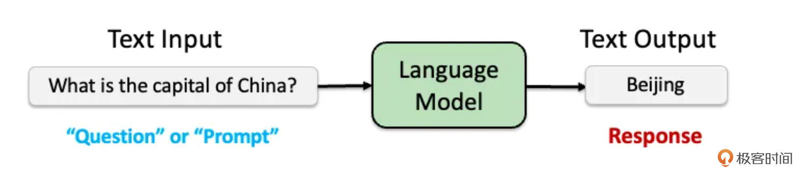
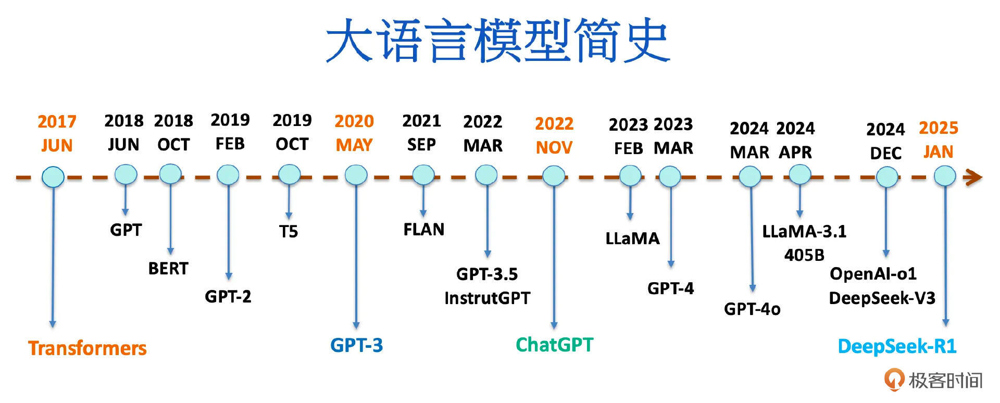
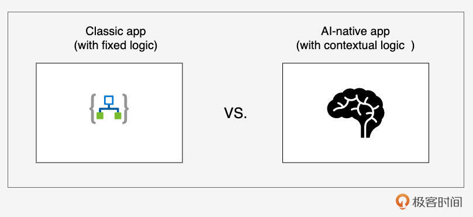
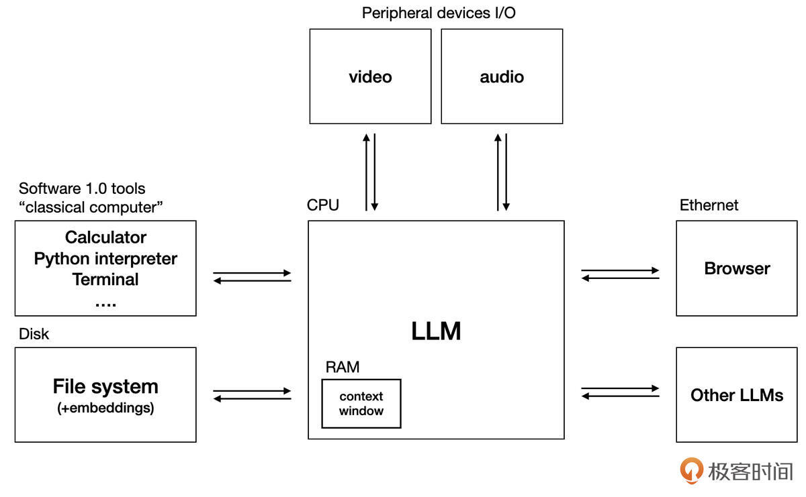

# AI集成：如何让大模型赋能你的Go应用？
你好，我是Tony Bai。

在前面的Go工程实践模块中，我们已经深入学习了如何构建健壮的应用骨架、核心组件（如配置、日志），如何进行部署、升级、观测、故障诊断和性能调优。这些知识帮助我们打造出高质量的、面向传统业务场景的Go应用。然而，一个不可忽视的技术浪潮正席卷全球——那就是以大语言模型（LLM）为代表的人工智能。

许多Go开发者可能正站在AI时代的门槛，心中充满好奇但也可能有些许困惑：AI大模型究竟是什么？它为软件开发带来了怎样的新范式？Go语言在这个新的生态中扮演什么角色？最重要的是，我如何才能将这些强大的AI能力，快速、有效地集成到现有或未来的Go应用中呢？

如果你也有这些疑问，这节课正是为你量身打造的。同时，你可以将它作为你进入AI应用开发领域的快速入门指南，帮助你：

- 理解LLM的基本概念和它所带来的应用开发新范式。

- 掌握与LLM进行交互的核心准则。

- 熟悉当前行业内与LLM通信的API事实标准。

- 并最终学会如何使用Go语言（通过直接调用API和更推荐的官方SDK）与这些强大的AI模型进行基础对话。


本节课的内容将高度凝练，旨在为你“扫盲”和“上手”打下概念基础，为你后续可能更深入的AI应用开发（例如构建基于RAG的AI系统、AI Agent等）或学习专门的AI课程做好铺垫和衔接，力求在有限的篇幅内，让你快速把握Go与AI集成的核心要点。

## 理解AI大模型与AI原生应用新范式

在我们开始用Go代码与AI交互之前，首先需要建立对当前这波AI浪潮核心驱动力——大语言模型——以及它所催生的新型应用形态有一个清晰的认知。

### AI浪潮已至：Gopher的机遇与挑战

人工智能，特别是自2022年底ChatGPT惊艳亮相以来，以大语言模型为代表的生成式AI（Generative AI）技术，正以前所未有的速度和深度改变着各行各业，软件开发领域首当其冲。

大语言模型（Large Language Models，LLMs）是当前这波 AI 浪潮中最耀眼的明星，也是驱动 AI 原生应用实现其智能特性的核心引擎。简单来说，语言模型（Language Model，LM）是一种旨在理解、处理和生成人类语言的人工智能系统。它们通过从海量文本数据中学习语言的模式、结构和上下文关系，从而能够产生连贯且与上下文相关的文本，广泛应用于机器翻译、文本摘要、聊天机器人、内容创作、代码编写等诸多领域。



而大语言模型则是语言模型的一个重要子集，它们与传统 LM 的主要区别在于 **其模型架构的革新（主要基于 Transformer 架构）和训练数据的海量性，以及由此带来的模型参数规模的急剧膨胀**。LLM 通常拥有数十亿甚至数万亿级别的参数（例如，OpenAI 的 GPT-3 就拥有 1750 亿参数）。这种巨大的规模赋予了 LLM 前所未有的语言理解和生成能力，使其在广泛的任务中展现出卓越的性能，甚至催生出许多令人惊叹的“涌现能力”（Emergent Abilities）。

这几年来大语言模型飞速发展，下图是大语言模型发展历程的简单示意图：



这波以LLM为代表的AI浪潮既带来了巨大的机遇，也对我们开发者（包括Gopher们）提出了新的挑战。

LLM的出现，使得机器具备了前所未有的自然语言理解、生成、推理和多模态处理能力。这为我们创造全新、更智能、更个性化的应用体验打开了大门。我们可以构建智能客服、代码助手、内容创作工具、自动化报告生成、复杂数据分析与洞察等以往难以想象的应用。

那么，如何理解这些AI模型的能力边界？如何有效地引导和控制它们的行为？如何将它们与我们现有的软件系统和业务流程相结合？这些都是我们需要学习和适应的新课题。

虽然Python凭借其丰富的科学计算库和AI框架生态，在AI算法研究和模型训练领域占据主导地位，但 **Go语言在AI应用的工程化和落地层面，拥有其独特的优势**。

- **高性能与高并发**：Go的并发模型（goroutine和channel）和高效的执行性能，使其非常适合构建需要处理大量并发请求、进行实时数据处理的AI应用后端服务、API网关或中间件。

- **强大的网络库与工具链**：Go在网络编程方面的优势，以及其简洁的部署方式（静态编译的单个二进制文件），使其非常适合构建与LLM API进行交互，以及部署在云原生环境中的AI应用。

- **快速增长的生态**：虽然起步相对较晚，但Go在AI领域的生态系统（如SDK、框架、工具库）正在快速发展。


因此，对于我们Gopher而言，利用Go语言的工程优势，将强大的LLM能力集成到我们的应用中，赋能现有业务或开创新的智能服务，是一个非常值得抓住的机遇。

### LLM即“操作系统”：理解AI应用开发的新范式

要理解如何开发基于LLM的AI原生应用，一个非常有洞察力的视角是将 **大语言模型视为一种新型的“操作系统”（我们称之为“LLM OS”）**。这个概念由AI领域大佬Andrej Karpathy提出，旨在帮助我们建立一个理解LLM及其应用开发生态的心智模型。

接下来，我们就自上而下理解这个新范式，先来看看什么是AI原生应用。

#### 什么是AI原生应用？

我们先通过下面这张图来直观感受一下日常开发和使用的“经典应用”（Classic App）与AI原生应用的区别：



我们看到，与依赖固定、预定义逻辑的传统/经典应用不同，AI原生应用（AI-Native App）从底层设计上就将AI（特别是LLM）作为其核心驱动力和关键组件。它的核心逻辑不再是完全由开发者硬编码的规则，而是更多地依赖于AI模型的动态理解、推理和生成能力，能够根据上下文进行适应和响应。

#### LLM：“智能内核”



在这个新范式中，LLM扮演着如同传统操作系统内核一样的角色。它接收来自应用程序的“指令”（即我们稍后会详细讨论的Prompt），处理这些指令（利用其庞大的知识库和推理能力），并返回结果。

- **CPU类比**：LLM本身（如Claude 3、Gemini 2.5 pro、DeepSeek等）可以看作是这个“LLM OS”的中央处理器（CPU），负责核心的“智能计算”。

- **内存类比**：LLM的“上下文窗口”（Context Window）则像操作系统的内存（RAM）。它决定了LLM在一次交互中能够“记住”和处理多少信息（以Token数量衡量）。超出上下文窗口的信息，LLM通常会“忘记”。

- **存储类比**：外部知识库，如向量数据库或传统文件系统，可以看作是LLM OS的“硬盘”，用于存储LLM自身训练数据之外的、持久化的私有知识。通过检索增强生成（RAG）等技术，LLM可以在需要时从这些“硬盘”中加载信息到其“内存”（上下文窗口）中。

- **I/O与系统调用类比**：LLM通过工具调用（Function Calling）机制（或ModelContextProtocol、MCP协议）与外部世界（如API、数据库、代码解释器）进行交互，这非常类似于传统操作系统通过系统调用（Syscall）来访问硬件或执行特权操作。


理解 “LLM OS” 这个范式，能帮助我们更好地组织关于AI应用开发的知识，并认识到构建AI应用不仅仅是调用一个API那么简单，它更像是在围绕一个新的“计算平台”进行系统设计。

### 初识LLM的“说明书”：模型规格的重要性

每个LLM OS的具体“实例”（即某个特定的模型，如 `gpt-4o` 或 `deepseek-chat`）都有其自身的“说明书”——即 **模型规格（Model Spec）**。 [OpenAI等公司提出的Model Spec](https://github.com/openai/model_spec) 旨在明确模型应遵循的目标、规则和默认行为，力求在模型的有用性、诚实性和无害性之间取得平衡，并提升其可控性。

对于开发者而言，理解目标模型的Model Spec（或其类似文档）至关重要，因为它通常会包含以下关键信息：

- **模型的能力边界**：它擅长什么任务？不擅长什么？

- **上下文窗口大小**：这是设计对话历史管理和RAG策略的关键参数。

- **Tokenization方式**：了解文本是如何被切分为Token的，有助于估算成本和优化Prompt。

- **训练数据截止日期**：了解模型的知识库“有多新”。

- **行为准则与安全限制**：模型被期望如何回应，以及有哪些内容生成限制。

- **API参数的特殊含义或支持情况。**


在开始与任何一个LLM进行实际交互之前，花时间阅读其“说明书”，是确保我们能有效、安全地使用它的第一步。

了解了这些基础概念后，我们接下来深入探讨与LLM进行交互的核心准则。

## 与LLM交互的核心准则及API事实标准

掌握了LLM作为一种新型“操作系统”的基本概念后，我们需要学习如何与其进行有效的“沟通”。这种沟通遵循一套特定的规则和结构。

### 对话与消息：交互的基础

与LLM OS进行结构化交互的核心单元是对话（Conversation）。从技术角度看， **一个对话就是由一个有序的消息（Message）列表构成的序列**。这个 `messages` 列表是我们与LLM进行一次完整沟通的“脚本”。

列表中的每一个消息对象通常包含两个核心字段：

- `role`（角色）：一个字符串，定义消息的发送者或类型。

- `content`（内容）：消息的具体承载，通常是文本字符串，对于多模态模型也可以是图像等数据。


常见的角色包括：

- `system`（系统消息）：用于设定LLM的角色、行为准则、输出格式等高级指令。它通常作为 `messages` 列表的第一条，为整个对话定下基调（在OpenAI的最新规范中，更倾向于使用 `developer` 角色来代表应用开发者设定的指令，但 `system` 因其历史悠久和广泛兼容性，在许多场景下仍被接受和使用）。

- `user`（用户消息）：代表最终用户提出的问题或指令。

- `assistant`（助手消息）：代表LLM（即“助手”）先前返回的回答。


正确地构造和维护这个包含不同角色消息的有序列表，是实现有效对话的关键。

### 理解LLM API的“无状态性”

一个对于初学者可能反直觉但至关重要的特性是， **LLM API的交互在底层通常是无状态的（Stateless）**。

这意味着，当你通过API向LLM发送一个 `messages` 列表并获得回应后，LLM本身 **不会自动“记住”这次交互的任何内容** 以供紧随其后的下一次独立API调用使用。每一次API请求，对于LLM来说，都是一次相对独立且全新的计算任务。它处理你当前提供的 `messages` “脚本”，生成回应，然后就“忘记”了这个脚本，等待处理下一个。

**因此，实现连贯的多轮对话的责任落在了客户端（即我们的Go应用）身上。** 我们的应用必须：

1. 存储整个对话过程中所有角色的所有消息。

2. 当用户发起新一轮交互时，将新的 `user` 消息按严格的时间顺序追加到已存储的历史消息之后。

3. 最终，将这个完整且有序的对话历史（即更新后的 `messages` 列表）作为下一次API请求的输入。


正是这种应用层面的状态管理，才使得“无状态”的LLM API能够支持看起来“有记忆”的流畅多轮对话。

### OpenAI兼容API：Chat Completions API的事实标准

幸运的是，在如何与LLM进行对话式交互方面，业界已经形成了一个事实上的API标准，它源自OpenAI的Chat Completions API（通常指其 `POST /v1/chat/completions` 端点）。

这个API规范因其设计的简洁性、灵活性和强大的功能（支持多轮对话、流式响应、函数调用/工具使用、JSON模式输出等），已被众多主流的商业LLM提供商（如Anthropic Claude、Google Gemini和DeepSeek等）和开源模型服务框架（如Ollama）所广泛采纳和兼容。

这意味着，我们一旦掌握了如何调用这套OpenAI兼容API，就拥有了一把能够与绝大多数LLM进行交互的“万能钥匙”。

**Chat Completions API的核心请求结构通常包含**：

- `model`（string）指定要使用的LLM模型ID。

- `messages`（array of message objects）：包含完整对话历史的消息列表，每个消息有 `role` 和 `content`。

- 可选参数如 `temperature`（控制随机性）、 `max_tokens`（限制输出长度）、 `stream`（是否启用流式响应）等。


身份认证通常通过以下方式进行：

- **API密钥（API Key）**：一个由服务商分配的字符串，通常通过HTTP请求的 `Authorization: Bearer <YOUR_API_KEY>` 头部传递。

- **API基础URL（API Base URL）**：指定API服务的网络地址。例如，OpenAI官方是 `https://api.openai.com/v1`，DeepSeek是 `https://api.deepseek.com`（或 `.../v1`），本地Ollama通常是 `http://localhost:11434/v1`。


这两个信息通常通过环境变量（如 `OPENAI_API_KEY`、 `OPENAI_API_BASE`）或在代码中配置给SDK客户端。

### 用Go发出第一个“Hello, AI”：裸调API实战

下面让我们亲自动手，使用Go的标准库 `net/http` 和 `encoding/json` 来向一个OpenAI兼容的API服务（我们以DeepSeek为例，它提供免费额度且与OpenAI API高度兼容）发送一个简单的“Hello, AI”请求。

1. **准备：**

- 注册DeepSeek平台（ [https://platform.deepseek.com/](https://platform.deepseek.com/)）并获取API Key。

- 设置环境变量： `export OPENAI_API_KEY="<YOUR_DEEPSEEK_API_KEY>"`。


2. **示例Go代码：**

```go
// ch30/hello_ai/hello_ai.go
package main

import (
    "bytes"
    "context"
    "encoding/json"
    "fmt"
    "io"
    "log"
    "net/http"
    "os"
    "time"
)

// ChatMessage 定义了对话中单条消息的结构
type ChatMessage struct {
    Role    string `json:"role"`    // 角色：system, user, 或 assistant
    Content string `json:"content"` // 消息内容
}

// ChatCompletionRequest 定义了发送给聊天补全API的请求体结构
type ChatCompletionRequest struct {
    Model    string        `json:"model"`             // 使用的模型ID
    Messages []ChatMessage `json:"messages"`          // 对话消息列表
    Stream   bool          `json:"stream,omitempty"`  // 是否流式响应，omitempty表示如果为false则不序列化此字段
    // 可以添加其他参数如 Temperature, MaxTokens 等
}

// ResponseChoice 定义了API响应中单个选择项的结构
type ResponseChoice struct {
    Index        int         `json:"index"`
    Message      ChatMessage `json:"message"`       // 助手返回的消息
    FinishReason string      `json:"finish_reason"` // 结束原因，如 "stop", "length"
}

// ChatCompletionResponse 定义了聊天补全API响应体的主结构
type ChatCompletionResponse struct {
    ID      string           `json:"id"`      // 响应ID
    Object  string           `json:"object"`  // 对象类型，如 "chat.completion"
    Created int64            `json:"created"` // 创建时间戳
    Model   string           `json:"model"`   // 使用的模型ID
    Choices []ResponseChoice `json:"choices"` // 包含一个或多个回复选项的列表
    // Usage   UsageInfo        `json:"usage"`   // Token使用情况 (在非流式时通常有)
}

// UsageInfo 定义了Token使用统计的结构 (为简化，此处可以先不详细定义)
// type UsageInfo struct { ... }

func main() {
    apiKey := os.Getenv("OPENAI_API_KEY")
    if apiKey == "" {
        log.Fatal("错误：环境变量 OPENAI_API_KEY 未设置。")
    }

    // DeepSeek API端点 (OpenAI兼容)
    apiURL := "https://api.deepseek.com/v1/chat/completions" // 使用与OpenAI SDK默认更接近的路径
    modelID := "deepseek-chat"                             // DeepSeek提供的聊天模型

    // 构造请求体
    requestPayload := ChatCompletionRequest{
        Model: modelID,
        Messages: []ChatMessage{
            {Role: "system", Content: "你是一个乐于助人的AI助手。"},
            {Role: "user", Content: "你好AI，请问Go语言是什么时候发布的？"},
        },
        Stream: false, // 我们先尝试非流式
    }

    requestBodyBytes, err := json.Marshal(requestPayload)
    if err != nil {
        log.Fatalf("序列化请求体失败: %v", err)
    }

    // 创建HTTP请求
    // 使用 context.WithTimeout 创建一个带超时的上下文
    ctx, cancel := context.WithTimeout(context.Background(), 30*time.Second)
    defer cancel() // 确保在函数结束时取消上下文，释放资源

    req, err := http.NewRequestWithContext(ctx, "POST", apiURL, bytes.NewBuffer(requestBodyBytes))
    if err != nil {
        log.Fatalf("创建HTTP请求失败: %v", err)
    }
    req.Header.Set("Content-Type", "application/json")
    req.Header.Set("Authorization", "Bearer "+apiKey)

    // 发送请求
    fmt.Println("正在发送请求到AI模型...")
    client := &http.Client{} // 可以配置client的超时等参数
    resp, err := client.Do(req)
    if err != nil {
        // 检查上下文是否已超时或被取消
        if errors.Is(err, context.DeadlineExceeded) {
            log.Fatalf("请求超时: %v", err)
        }
        log.Fatalf("发送HTTP请求失败: %v", err)
    }
    defer resp.Body.Close()

    // 读取并处理响应
    responseBodyBytes, err := io.ReadAll(resp.Body)
    if err != nil {
        log.Fatalf("读取响应体失败: %v", err)
    }

    if resp.StatusCode != http.StatusOK {
        log.Fatalf("API请求失败，状态码: %d, 响应: %s", resp.StatusCode, string(responseBodyBytes))
    }

    var chatResponse ChatCompletionResponse
    if err := json.Unmarshal(responseBodyBytes, &chatResponse); err != nil {
        log.Fatalf("反序列化响应JSON失败: %v\n原始响应: %s", err, string(responseBodyBytes))
    }

    // 打印AI的回答
    if len(chatResponse.Choices) > 0 {
        assistantMessage := chatResponse.Choices[0].Message
        fmt.Printf("AI助手的回答 (模型: %s):\n%s\n", chatResponse.Model, assistantMessage.Content)
        fmt.Printf("(结束原因: %s)\n", chatResponse.Choices[0].FinishReason)
    } else {
        fmt.Println("AI未返回任何有效的回答选项。")
    }
}

```

运行代码（确保已设置 `OPENAI_API_KEY`，并且你的网络可以访问 `api.deepseek.com`），你将会看到类似如下的输出（具体回答内容可能因模型版本和时间而异）：

```plain
// 在ch30/hello_ai目录下

$go run hello_ai.go
正在发送请求到AI模型...
AI助手的回答 (模型: deepseek-chat):
Go语言（又称Golang）由Google开发，并于**2009年11月10日**正式对外发布。它的初始版本（Go 1.0）则在**2012年3月28日**推出，标志着语言的核心特性与API进入稳定阶段。以下是关键时间点：

1. **2007年**：Robert Griesemer、Rob Pike和Ken Thompson开始设计Go语言。
2. **2009年11月10日**：开源发布，并公开了编译器、工具链和早期标准库。
3. **2012年3月28日**：发布**Go 1.0**，提供长期兼容性承诺，成为生产环境可用版本。
4. **后续发展**：Go团队保持每半年发布一次增量更新（如Go 1.1、1.2等），逐步引入改进（如泛型在**Go 1.18**中加入）。

Go的简洁性、并发支持（goroutine）和高效编译使其在云计算、微服务等领域广受欢迎。如需更详细版本历史，可参考[Go官方博客](https://blog.golang.org)。
(结束原因: stop)

```

恭喜！你已经成功用Go语言通过裸调API的方式，与一个强大的LLM进行了第一次对话。这个例子覆盖了构造请求、认证、发送、接收和解析响应的核心流程。

在上面的例子中，我们设置了 `Stream: false`，所以是等待模型完全生成回答后一次性接收。如果将 `Stream: true`，API会以Server-Sent Events（SSE）协议逐步返回数据块。客户端需要处理这种事件流，从中提取并拼接 `delta.content` 片段来实时显示。这对于提升聊天等交互式应用的体验至关重要，但处理逻辑比非流式要复杂一些。

掌握了API的基本交互方式后，我们自然会思考如何更有效地“指导”LLM给出我们期望的输出，以及如何让我们的Go代码更简洁优雅。

## Prompt工程与Go SDK：提升交互效率与优雅性

仅仅知道如何通过API发送和接收数据是不够的。要真正发挥LLM的威力，我们需要掌握两项关键技能：一是如何精心设计我们发送给LLM的“指令”（即Prompt工程），二是如何利用Go SDK来简化与API的交互，使代码更优雅、更健壮。

### Prompt工程入门：与LLM高效沟通的“指令艺术”

Prompt是我们提供给LLM的输入文本，它既是指令（Instruction），也是上下文（Context）。一个设计良好的Prompt能够清晰地传达我们的意图，引导LLM准确、高质量地完成任务。反之，模糊或设计不当的Prompt则可能导致LLM给出无用甚至错误的输出。 **Prompt工程（Prompt Engineering）就是设计、编写和优化Prompt的艺术与科学。**

正如与人类沟通时，表达的清晰度和准确性直接影响沟通效果一样，与 LLM 进行“沟通”（或者更准确地说，进行“引导”）时， **Prompt 的质量也直接决定了 LLM 输出结果的质量、相关性和可靠性。** 一个含糊不清的 Prompt 往往导致 LLM 给出无用、错误甚至荒谬的答案，而一个精心设计的 Prompt 则能引导 LLM 发挥其惊人的潜力。

设计高质量、高效率的 Prompt 是一项需要经验积累和细致思考的工作，并且通常需要一些技巧或者说遵循一些原则，掌握这些技巧或原则，是 Gopher 们开启高效 Prompt Engineering 之旅的第一步。

下面我就介绍几种简单有效的Prompt技巧。

- **明确角色扮演（Role Playing）**：在 `system` 或 `user` 消息中明确告诉LLM它应该扮演什么角色。例如：“你是一个经验丰富的Go语言技术文档审阅者，请检查以下文本的准确性和流畅性。”

- **清晰的指令与期望输出格式**：直接、具体地说明任务要求和期望的输出格式。例如：“请将以下英文段落翻译成简体中文，并以一个JSON对象的格式返回，包含 `original_text` 和 `translated_text` 两个字段。”

- **提供示例（Few-shot Learning）**：在Prompt中给出几个输入/输出的例子，帮助模型理解任务模式和期望风格。


```plain
指令：请将以下英文客户服务邮件翻译成简体中文，并保持礼貌和专业的语气。请参考以下示例的翻译风格和格式。

--- 示例 1 ---
英文邮件：
Subject: Urgent: Problem with recent software update
Body:
Hi team,
Our production system started experiencing frequent crashes after a_recent_update_v2.1. Could you please look into this ASAP? This is business critical.
Thanks,
Jane Doe

中文翻译：
主题：紧急：关于近期软件更新的问题
正文：
团队你们好，
我们的生产系统在最近的v2.1版本更新后开始频繁崩溃。能否请你们尽快调查此事？这对我们的业务至关重要。
谢谢，
简·杜

--- 示例 2 ---
英文邮件：
Subject: Question about API rate limits
Body:
Hello,
I'd like to understand more about the rate limits for your public API. Can you provide some documentation or details?
Regards,
John Smith

中文翻译：
主题：关于API速率限制的咨询
正文：
你好，
我想进一步了解贵公司公共API的速率限制情况。能否提供相关的文档或详细信息？
此致，
约翰·史密斯

--- 实际任务 ---
英文邮件：
Dear Valued Customer,
We received your inquiry regarding the shipment delay of order #12345. We sincerely apologize for any inconvenience this may have caused. Our logistics team is currently investigating the issue and we expect to have an update for you within 24 hours.
Thank you for your patience.
Sincerely,
Support Team

中文翻译：

```

- **思维链（Chain-of-Thought，CoT）提示**：对于需要多步推理的任务（如数学应用题），引导模型先输出其思考步骤，再给出最终答案。通常在问题后加上一句“Let’s think step by step.”或类似的引导语。这能显著提高复杂推理的准确率。

下面是一个使用CoT提示词与大模型交互的示例：

```plain
问题：自助餐厅有 23 个苹果。他们用了 20 个来做午餐，然后又买了 6 个。他们现在有多少个苹果？
请一步一步思考，然后给出最终答案。

思考过程：
首先，我们知道餐厅开始时有 23 个苹果。
然后，他们用了 20 个苹果做午餐。所以剩下的苹果数量是 23 - 20 = 3 个。
之后，他们又买了 6 个苹果。所以现在的苹果总数是 3 + 6 = 9 个。
因此，他们现在有 9 个苹果。

最终答案：9

```

Prompt工程是一门实践性很强的技艺，需要通过不断的实验和迭代来优化。本节课仅作最基础的入门介绍，更深入的技巧通常在专门的AI课程中探讨。你也可以订阅极客时间上有关Prompt工程的专栏或视频课程继续深入学习。

### 为何需要SDK？告别繁琐的HTTP请求

回顾我们前面用Go标准库裸调API的例子，虽然它能工作，但也暴露了几个痛点。

- **代码冗长**：需要手动构造JSON请求体、设置HTTP头部、发送请求、检查状态码、读取响应体、反序列化JSON等，样板代码很多。

- **易错**：JSON的字段名、数据类型、HTTP头部的拼写等都容易出错。

- **缺乏类型安全**：在构造请求和解析响应时，如果Go结构体与API的JSON结构不完全匹配，可能导致运行时错误或数据丢失。

- **高级功能处理复杂**：例如，处理流式响应（SSE）、实现错误重试、管理API速率限制等，都需要编写大量额外的逻辑。


幸运的是，SDK（Software Development Kit，软件开发工具包）的出现正是为了解决这些痛点。大模型SDK可以提供如下价值：

- **封装底层细节**：SDK将所有底层的HTTP交互、认证、JSON序列化/反序列化等都封装好了。

- **提供类型安全的接口**：提供与API对应的Go结构体和方法，利用Go的类型系统在编译期就能发现很多错误。

- **简化API调用**：开发者只需与SDK提供的更高级、更符合Go语言习惯的接口交互。

- **内置常用功能**：通常会内置错误处理、重试机制、超时控制，并简化对流式响应等高级功能的使用。

- **易于维护**：当API更新时，SDK维护者（尤其是官方）会负责更新SDK，开发者通常只需升级SDK版本并做少量适配即可。


对于任何严肃的AI应用开发，使用一个好的SDK几乎是必然选择。那么我们Gopher都有哪些高质量的大模型应用开发Go SDK可以选择呢？接下来，我们就来看看Go LLM SDK的生态。

### Go LLM SDK生态概览

Go社区在LLM SDK方面发展迅速，无论是主流大模型厂商，还是社区第三方，都提供了高质量的Go SDK供我们使用。

- **主流大模型官方SDK**：
  - `github.com/openai/openai-go`：由OpenAI官方维护，支持其所有API，包括Chat Completions、Embeddings、Images、Audio等。 **这是我们本节课后续示例的重点，也是与OpenAI兼容API交互的首选。**

  - `github.com/anthropics/anthropic-sdk-go`：Anthropic官方SDK，用于Claude系列模型。

  - `https://github.com/googleapis/go-genai`：Google官方SDK，用于Gemini系列模型。
- **通用/多模型SDK与框架内嵌SDK**：
  - 社区也有一些尝试封装多种LLM API的通用SDK或工具库。

  - 更常见的是，像LangChainGo（ `github.com/tmc/langchaingo`）或Eino这样的Go LLM应用框架，它们内部会包含与多种LLM进行交互的SDK层或适配器。

最后，建议你优先选择官方SDK，它们通常能最快支持最新功能且维护有保障。对于OpenAI兼容API， `openai/openai-go` 是核心。

### 实战：使用OpenAI Go SDK与模型交互

现在，我们将使用官方的 `github.com/openai/openai-go` SDK来编写一个复杂一些的示例，演示如何使用SDK进行简单的非流式的多轮对话。这个示例程序会模拟用户与一个“Go语言编程助手”进行连续对话，用户可以在命令行输入问题，程序会将问题和模型的回答都记录下来，并在下次提问时一起发送。

```go
// ch30/openai-go-sdk/multi-turn-no-stream/main.go

package main

import (
    "bufio"
    "context"
    "errors"
    "fmt"
    "log"
    "os"
    "strings"

    openai "github.com/openai/openai-go"
    "github.com/openai/openai-go/option"
)

func main() {
    // 1. 环境准备
    apiKey := os.Getenv("OPENAI_API_KEY")
    if apiKey == "" {
        log.Fatal("错误：未设置 OPENAI_API_KEY 环境变量。")
    }
    baseURL := os.Getenv("OPENAI_API_BASE")
    if baseURL == "" {
        log.Fatal("Error: OPENAI_API_BASE environment variable not set.")
    }

    // 2. 客户端初始化 (同上)
    client := openai.NewClient(option.WithAPIKey(apiKey),
        option.WithBaseURL(baseURL))
    ctx := context.Background()

    // 3. 初始化对话历史
    // 创建一个 openai.ChatCompletionMessageParamUnion 类型的切片来存储历史。
    // 通常以一个 openai.SystemMessage 开始，设定助手的角色或行为。
    messages := []openai.ChatCompletionMessageParamUnion{
        openai.SystemMessage("你是一个乐于助人的 Go 语言编程助手。"),
    }

    fmt.Println("开始与 Go 助手对话 (输入 'quit' 退出):")
    // 使用 bufio.NewReader 读取用户输入。
    reader := bufio.NewReader(os.Stdin)

    // 4. 进入对话循环
    for {
        fmt.Print("You: ")
        userInput, _ := reader.ReadString('\n')
        userInput = strings.TrimSpace(userInput)

        // 输入 "quit" 退出循环。
        if strings.ToLower(userInput) == "quit" {
            fmt.Println("再见!")
            break
        }

        // 5. 将用户输入添加到历史记录
        // 使用 openai.UserMessage 将用户输入包装并追加到 messages 切片。
        messages = append(messages, openai.UserMessage(userInput))

        // 6. 构建包含完整历史的请求
        params := openai.ChatCompletionNewParams{
            Model: "deepseek-chat",
            // 关键：将包含所有历史的 messages 切片传递给 Messages 字段。
            Messages: messages,
        }

        fmt.Println("助手正在思考...")

        // 7. 发起 API 请求 (非流式)
        completion, err := client.Chat.Completions.New(ctx, params)
        // 8. 处理 API 错误
        if err != nil {
            var apiErr *openai.Error
            if errors.As(err, &apiErr) {
                fmt.Printf("API 错误: Status=%d Type=%s Message=%s\n", apiErr.StatusCode, apiErr.Type, apiErr.Message)
            } else {
                fmt.Printf("API 错误: %v\n", err)
            }
            // 可选：如果调用失败，从历史记录中移除刚才添加的用户消息，避免错误累积。
            messages = messages[:len(messages)-1]
            continue // 继续下一次循环，等待用户再次输入。
        }

        // 9. 处理并添加助手响应到历史记录
        if len(completion.Choices) > 0 {
            // 获取助手的响应消息结构体 (openai.ChatCompletionMessage)。
            assistantResponseMsg := completion.Choices[0].Message
            fmt.Printf("Assistant: %s\n", assistantResponseMsg.Content)

            // 关键步骤：将助手的响应消息转换回参数类型，并添加到历史记录中。
            // 使用 assistantResponseMsg.ToParam() 方法！
            messages = append(messages, assistantResponseMsg.ToParam())

        } else {
            fmt.Println("Assistant: 我暂时没有回应。")
            // 可选：如果助手没有回应，也移除最后的用户消息。
            messages = messages[:len(messages)-1]
        }

        // 10. 可选：历史记录截断逻辑
        // 在实际应用中，需要检查 messages 的长度（或累计 token 数）
        // 并根据需要移除旧的消息，以防止超出模型的上下文窗口限制。
        // const maxHistoryItems = 10 // 例如保留最近 10 条（含系统消息）
        // if len(messages) > maxHistoryItems {
        //    // 保留第一条（系统消息）和最后 maxHistoryItems-1 条
        //    messages = append(messages[:1], messages[len(messages)-(maxHistoryItems-1):]...)
        // }
    }
}

```

多轮非流式对话的代码逻辑在于维护对话的历史记录，通过创建一个\[\]openai.ChatCompletionMessageParamUnion类型的切片messages来存储系统消息、用户输入和助手回复。这与单轮非流式对话的逻辑不同，后者只处理一次用户请求。在对话循环中，程序不断获取用户输入并更新历史记录，确保每次请求都包含完整的对话内容，而非单轮对话中仅发送单一用户消息。此循环设计允许模拟持续对话，增强用户交互的连贯性。

下面是运行这个示例的一次输出结果（由于篇幅过长，省略了部分输出内容）：

```plain
// 在ch30/openai-sdk/multi-turn-no-stream目录下

$go build
$export OPENAI_API_KEY=<your_api_key>
$export OPENAI_API_BASE=https://api.deepseek.com/v1
$./demo
开始与 Go 助手对话 (输入 'quit' 退出):
You: Write an example of go slice
助手正在思考...
Assistant: # Go Slice Example

Here's a comprehensive example demonstrating slices in Go:

package main

import "fmt"

func main() {
    // 1. Creating slices
    // Using a slice literal
    fruits := []string{"Apple", "Banana", "Cherry"}
    fmt.Println("Fruits:", fruits) // Output: Fruits: [Apple Banana Cherry]

    // Creating from an array
    arr := [5]int{10, 20, 30, 40, 50}
    numbers := arr[1:4] // slice from index 1 to 3 (4 is exclusive)
    fmt.Println("Numbers:", numbers) // Output: Numbers: [20 30 40]

    // Using make() - length 3, capacity 5
    names := make([]string, 3, 5)
    names[0], names[1], names[2] = "Alice", "Bob", "Charlie"
    fmt.Println("Names:", names) // Output: Names: [Alice Bob Charlie]

    ... ... //此处省略若干输出内容

    // 7. Multi-dimensional slice
    matrix := [][]int{
        {1, 2, 3},
        {4, 5, 6},
        {7, 8, 9},
    }
    fmt.Println("Matrix:", matrix)
}

Key points demonstrated:
1. Different ways to create slices (literal, from array, with make)
2. Basic operations like append, length, capacity
3. Slicing operations
4. Copying slices
5. Modifying slices and their underlying arrays
6. Iteration
7. Multi-dimensional slices

Slices are more flexible than arrays in Go because they can grow and shrink as needed. They are reference types that point to an underlying array.

You: add a demo of slice auto growing to your example
助手正在思考...
Assistant: # Go Slice Example with Auto-Growth Demonstration

Here's an enhanced version of the slice example that includes a demonstration of slice auto-growth:

package main

import "fmt"

func main() {
    // Initial slice with small capacity
    nums := make([]int, 0, 2) // length 0, capacity 2
    fmt.Printf("Initial - len: %d, cap: %d, %v\n", len(nums), cap(nums), nums)

    // Append elements to demonstrate auto-growth
    nums = append(nums, 1)
    fmt.Printf("After append 1 - len: %d, cap: %d, %v\n", len(nums), cap(nums), nums)

    ... ... //此处省略若干输出内容
}

### Output Explanation:

When you run this program, you'll see output like:

Initial - len: 0, cap: 2, []
After append 1 - len: 1, cap: 2, [1]
After append 2 - len: 2, cap: 2, [1 2]
After append 3 (exceeds capacity) - len: 3, cap: 4, [1 2 3]
After append 4 - len: 4, cap: 4
After append 5 - len: 5, cap: 8
After append 6 - len: 6, cap: 8
After append 7 - len: 7, cap: 8
After append 8 - len: 8, cap: 8
After append 9 - len: 9, cap: 16
After append 10 - len: 10, cap: 16

Slice growth pattern:
Go typically doubles the capacity when a slice grows beyond its current capacity
until it reaches 1024 elements, after which it grows by 25% each time

Practical growth example:
Capacity changed from 0 to 1 at len=1
Capacity changed from 1 to 2 at len=2
Capacity changed from 2 to 4 at len=3
Capacity changed from 4 to 8 at len=5
Capacity changed from 8 to 16 at len=9

### Key Points:

1. **Auto-Growth Behavior**: When you append to a slice that's at capacity, Go automatically:
   - Creates a new underlying array with larger capacity
   - Copies all existing elements to the new array
   - Returns a new slice with the expanded capacity

2. **Growth Algorithm**:
   - For small slices (<1024 elements), capacity doubles each time
   - For larger slices, it grows by 25% each time

3. **Performance Consideration**:
   - Frequent resizing can impact performance
   - If you know the approximate size needed, it's better to initialize with `make([]T, length, capacity)`
You: quit
再见!

```

这个示例清晰地展示了如何使用 `openai/openai-go` SDK来管理多轮对话的上下文，并通过简单的用户输入循环实现了基本的聊天交互。通过示例，我们可以看到SDK极大地简化了与API的通信过程。

通过这节课对 `openai/openai-go` 的实战演练，我们已经掌握了使用Go SDK与LLM进行对话的核心技能。对于Anthropic Claude或Google Gemini等其他主流模型，虽然它们的官方Go SDK在API细节和设计哲学上可能有所不同，但其核心的交互理念——构造请求、发送、处理响应——以及SDK所带来的便利性是相通的。这里鼓励你在需要时，查阅对应模型的官方Go SDK文档进行学习和使用。

掌握了如何通过SDK与LLM进行基础通信后，我们已经具备了将AI能力集成到Go应用中的第一块重要拼图。

## 展望Go在更高级AI应用中的角色

到目前为止，我们主要聚焦于如何通过Go语言与LLM进行基础的、对话式的API交互。这对于构建许多AI增强功能（如智能问答、文本摘要、简单内容生成）来说已经足够。然而，LLM的真正潜力远不止于此。当我们将LLM与外部知识、外部工具以及更复杂的控制流结合起来时，就能构建出更强大、更自主的AI应用。

虽然深入构建这些高级AI应用超出了本节课（作为Go进阶课中的AI集成引导）的范围，但了解它们的概念，以及Go语言在其中可能扮演的角色，对于我们Gopher把握未来的技术方向非常重要。

这里主要说一下检索增强生成（RAG）与AI Agent两种高级AI应用方向，以及Go在支撑整个AI生态系统的基础设施和工具链方面的结合点。

### RAG：让LLM拥有“私有知识库”

检索增强生成（RAG，Retrieval Augmented Generation）是一种技术，通过从外部知识源（如公司的内部文档、产品手册和最新的行业报告等，通常存储在向量数据库中）检索相关信息，并将这些信息作为上下文提供给大语言模型，从而增强其生成回答的相关性、准确性和时效性。这种方法有效地解决了LLM在训练数据截止、特定领域知识不足以及容易产生“幻觉”（即编造事实）等问题。

在构建RAG流程中，Go语言可以发挥重要作用。

首先，在文档处理与嵌入方面，Go可以编写高效的工具，解析原始文档（如PDF、Markdown、HTML），并对其进行分块（chunking），随后调用嵌入模型（如OpenAI的Embeddings API）将文本块转换为向量。

其次，Go还提供了与主流向量数据库（如Pinecone、Weaviate、Milvus和Qdrant）的客户端库，可以用来存储和高效检索与用户查询最相关的向量化文档片段。

最后，Go应用的后端可以负责整个RAG流程的编排，包括接收用户查询、将查询向量化、从向量数据库中检索相关上下文、构建包含用户查询和检索到的上下文的提示（Prompt）、调用LLM API或使用SDK进行生成，以及处理并返回最终结果。Go的并发能力在这一过程中得到了良好的发挥，确保了高效的检索与生成。

除了让LLM“博闻强识”，AI领域的另一个热门探索方向是赋予LLM更强的自主行动能力，这就是我们要讨论的AI Agent。

### AI Agent：构建能够自主思考和行动的智能体

AI Agent是当前人工智能领域一个非常令人兴奋的研究和应用方向，它不再仅仅满足于让LLM像一个问答机器人或文本生成器那样被动地响应用户输入，而是试图构建一种更高级的智能实体。

这种智能体能够基于大型语言模型强大的自然语言理解、知识推理和一定程度的逻辑规划能力，去 **自主地设定目标、制定计划（Planning）、选择并使用外部工具（Tool Using）来执行任务，并能根据执行结果和环境反馈进行自我评估、学习和调整（Learning/Adaptation）**，最终以一种更主动、更智能的方式完成复杂的、多步骤的、需要与真实世界或外部系统动态交互的任务。

你可以将一个AI Agent想象成一个拥有“大脑”（通常是核心的LLM）和一套“工具箱”的智能助理。它的“工具箱”里可能包含代码解释器、搜索引擎、计算器、日历API客户端、数据库查询工具，甚至与其他AI模型交互的接口（比如Google的A2A协议）等。当Agent接收到一个高层级的任务（例如，“帮我规划下周末去北京的旅行，并预订往返机票和酒店”），它的“大脑”会首先理解任务，将其分解为一系列子步骤，然后决定在每个步骤需要使用哪个“工具”，调用工具获取信息或执行操作，再根据工具的返回结果评估进展，并规划下一步行动，直到最终完成整个任务。

**Go语言在构建AI Agent的浪潮中，同样展现出其独特的工程优势和潜力。**

**Agent执行后端/运行时（Agent Runtime）。** 一个Agent的核心通常是一个“思考-行动-观察”的循环（ReAct - Reason and Act - 框架就是一个典型例子）。Go语言以其卓越的性能、轻量级的并发（goroutine）以及高效的内存管理，使其非常适合构建Agent的核心执行引擎。这个引擎需要处理任务的分解与调度、工具的调用与结果的异步处理、Agent状态的维护（如记忆、历史记录），以及与LLM的频繁交互。Go的并发模型能让Agent同时处理多个子任务或与多个工具交互，而其性能则能保障Agent的响应速度和思考效率。

**工具API的实现与标准化封装。** Agent的“工具箱”是其行动能力的关键。传统上，如果Agent需要调用外部API（无论是公司内部的业务API还是公共的互联网API）或执行特定的系统操作（如读写文件、执行命令），开发者会为每个这样的“工具”编写一个Go函数或服务，并将其接口暴露给Agent。Go强大的标准库（特别是 `net/http`、 `os`、 `database/sql` 等）和丰富的第三方生态，使得这种传统方式的工具API封装变得非常便捷。LLM通过其规划能力，理解何时需要调用这些工具，并通过某种机制（如函数调用、API请求）触发它们。

然而，随着Agent需要使用的工具种类和数量的增加，这种点对点的、非标准化的工具集成方式可能会带来维护和扩展上的挑战。 **模型上下文协议（MCP - Model Context Protocol）** 的出现，正是为了解决LLM与外部世界（包括数据源和工具）交互的标准化问题。MCP试图定义一套通用的“接口”规范，让LLM能够以一种统一的、结构化的方式发现、理解和调用外部工具或获取上下文数据。

**Go语言在实现MCP Server方面同样具有显著优势。** 一个MCP Server负责将一组工具或数据源按照MCP规范进行封装，并提供一个标准化的端点供LLM（或Agent核心）查询和交互。Go的高性能网络库、并发处理能力以及对JSONRPC（MCP通常基于JSONRPC）的良好支持，使其非常适合构建高效、可靠的MCP Server。通过这种方式，Go不再仅仅是实现单个工具API，而是能够构建一个 **标准化的“工具上下文提供者”**，LLM可以通过MCP协议来“理解”这个Server能提供哪些工具（函数签名、参数描述、功能说明），并请求执行它们。这不仅提升了工具的可发现性和互操作性，也为Agent的工具使用带来了更结构化和可管理的方式。因此，Go在为AI Agent提供“工具”支持时，既能胜任传统的API封装，也能完美承担起构建和实现MCP Server这一更高级、更标准化的角色。

在讨论AI Agent时，你可能还会听到一个相关的术语——Agentic AI。虽然这两个词经常被互换使用，但它们侧重点略有不同：

- **AI Agent通常更侧重于指代一个具体的、能够执行上述自主规划、工具使用和学习调整等行为的软件实体或系统。** 它是一个可构建、可部署的“智能体程序”。

- **Agentic AI则更偏向于描述一种设计理念、研究方向或AI系统所展现出的类智能体（agent-like）特性。** 它强调的是AI系统所具备的那种能够像一个有自主意识的代理人一样去感知环境、设定目标、采取行动并从经验中学习的能力和行为模式。可以说，AI Agent是实现Agentic AI理念的一种具体技术路径和产物。一个具备高度Agentic特性的AI系统，可能由一个或多个协同工作的AI Agent组成。


Go语言凭借其在系统编程、网络服务、并发处理和工程效率上的优势，无疑为构建强大的AI Agent和实现复杂的Agentic AI系统提供了坚实的工程基础。

当我们让LLM不仅能检索知识（如RAG），还能主动使用工具去行动（如AI Agent）时，AI应用的想象空间将被极大地拓展。

### Go与AI生态的更多结合点

除了直接构建面向用户的AI应用外，Go语言在支撑整个AI生态系统的基础设施和工具链方面也大有可为：

- **数据处理与特征工程**：虽然Python在此领域有优势，但对于需要高性能、大规模并发处理的特定数据预处理或特征提取任务，Go可以作为补充。

- **模型部署与服务化**：使用Go构建高性能的HTTP/gRPC服务来包装和提供对已训练模型的推理（inference）API，或者作为AI模型服务的API网关、负载均衡器等。

- **AI基础设施与工具链开发**：例如，开发用于模型管理、实验追踪、分布式训练协调（尽管训练本身可能不是Go）、AI数据管道编排等的平台和工具。


虽然本节课主要聚焦于基础的LLM API交互，但理解这些更高级的应用场景，能帮助我们更好地定位Go在未来AI版图中的价值。

## 小结

这节课，我们一起探索了如何将强大的AI大模型能力集成到Go应用中，为Go开发者进入激动人心的AI应用开发领域提供了坚实的入门基础。

我们首先理解了AI浪潮为Gopher带来的机遇与挑战，并明确了Go语言在AI工程化中的定位——凭借其高性能、高并发、强大的网络库和易于部署的特性，Go是构建AI应用后端、中间件和基础设施的理想选择。我们还引入了“LLM即操作系统”这一核心范式，以及模型规格的重要性，为理解AI应用开发建立了新的心智模型。

接着，我们深入学习了与LLM交互的核心准则，包括以对话和消息（包含 `system`、 `user`、 `assistant` 等角色）为基础的交互结构，以及LLM API在底层通常所具有的“无状态性”——这要求开发者必须在客户端（Go应用）负责维护和传递完整的对话历史以实现多轮对话。

我们重点介绍了目前行业内与LLM通信的API事实标准——OpenAI兼容API（特别是Chat Completions API），了解了其核心请求与响应结构，以及通过API密钥和Base URL进行身份认证的方式。我们还通过一个Go语言裸调API的实战示例，亲手完成了第一个“Hello, AI”程序。

为了提升交互效率和代码质量，我们探讨了Prompt工程的入门技巧（如明确角色、清晰指令、提供示例、思维链提示）和为何需要使用SDK。我们概览了Go LLM SDK的生态，并重点实战了官方的OpenAI Go SDK（ `github.com/openai/openai-go`），通过示例学习了如何使用它进行多轮对话。

最后，我们简要展望了Go在更高级AI应用（如RAG、AI Agent）中的角色，以及在AI数据处理、模型服务化和基础设施开发等领域的更多结合点。

本节课为你打开了Go与AI集成的大门。虽然我们只触及了冰山一角（特别是像Prompt工程、RAG、Agent这些都足以构成独立的深度课程），但你现在已经拥有了开始在自己的Go项目中尝试和探索AI能力的基础知识和工具。希望你能带着这份初识的兴奋，勇敢地去探索Go+AI的无限可能！

## 思考题

假设你需要为一个已有的Go Web应用（例如，一个技术博客系统）集成一个简单的AI功能：当用户在搜索框输入问题时，如果站内搜索结果不理想，可以提供一个“问AI”的按钮，将用户的问题发送给一个LLM，并将模型的回答展示给用户。请思考：

1. 你会选择直接调用LLM API（如本节课中的裸调API方式）还是使用Go SDK（如 `openai/openai-go`）来实现这个功能？请阐述你选择的理由。

2. 在Go后端，你会如何设计一个简单的函数（或方法）来处理这个“问AI”的请求？它大致需要接收哪些参数？你会如何构造发送给LLM的 `messages` 列表（特别考虑System Message和User Message的内容应该是什么）？

3. 对于用户提出的问题，如果你希望LLM的回答能更多地基于你博客中的现有文章内容，而不是仅仅依赖LLM的通用知识库（以减少幻觉，并使回答更具针对性），你会如何初步设想（不需要写完整代码，描述思路即可）让LLM在回答时能“参考”到相关的博客文章内容（这实际上是在为后续可能学习的RAG技术做一个最基础的思考铺垫）？


欢迎在留言区分享你的思考和见解！我是Tony Bai，我们下节课再见。