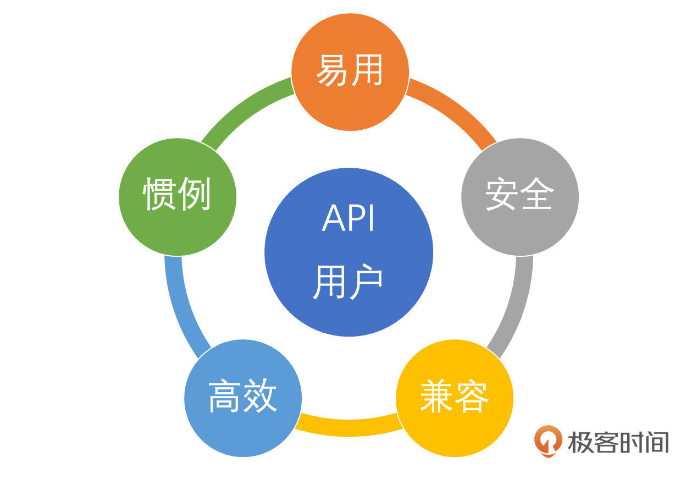

# API设计：构建用户喜爱、健壮可靠的公共接口
你好！我是Tony Bai。

前面几节课，我们探讨了项目布局、包设计、并发设计、接口设计和错误处理设计，这些都构成了我们构建高质量Go应用的基础。今天，我们要聚焦于这一切努力最终呈现给用户的那个界面——API（Application Programming Interface）。

API无处不在，从我们每天使用的Web服务（RESTful、gRPC）、操作系统调用，到我们代码中导入的各种库和框架。可以说， **现代软件开发很大程度上就是围绕着API进行构建和交互的**。

虽然API种类繁多，但本节课将聚焦于如何设计Go包（或模块）对外暴露的公共API。这里的API指的是那些首字母大写、可以被其他包导入和使用的函数、变量、常量、类型（及其可导出字段和方法）。这通常发生在你编写一个库供他人使用，或者在一个大型项目中划分模块，需要定义清晰的模块间交互接口时。

一个设计糟糕的包API，可能会让使用者痛苦不堪：难以理解、容易误用、性能低下、频繁变更导致兼容性噩梦。而一个设计良好、用户喜爱的API，则会像一件趁手的工具，清晰、高效、健壮可靠，能够极大地提升开发效率和库（或模块）的生命力。

那么，如何才能设计出这样的Go包API呢？

- 评判API好坏的标准是什么？仅仅是功能正确吗？

- Go语言的特性（如简洁性、接口、错误处理）对API设计有哪些具体影响？

- 有哪些核心原则和实践技巧可以指导我们设计出更优秀的API？


这节课，我们就来深入探讨Go包API设计的核心原则与实践。我们将一起：

1. 明确Go包API的构成要素。

2. 从用户视角出发，建立评价API设计的五大核心标准。

3. 结合Go语言特性和示例，逐一解析如何实践这五大标准：易用性、安全性、兼容性、高效性、惯例性。


掌握这些，你将能更有信心地设计出让用户（包括未来的你）用得舒心、值得信赖的Go包API。

## Go包API的核心构成：对外暴露的“契约”

在谈论设计原则之前先要明确，当我们说一个Go包的“API”时，具体是指什么。根据Go的导出规则（首字母大写决定可见性），一个包的公共API由以下显性元素构成：

- 导出的函数（Exported Functions）：包级别提供的可调用功能。

- 导出的变量（Exported Variables）：包级别提供的可访问状态（应谨慎使用，因为它们是全局可变的）。

- 导出的常量（Exported Constants）：包级别定义的、不可变的值。

- 导出的类型（Exported Types）：
  - 类型本身（如 `type MyStruct struct {...}`）。

  - 类型的可导出字段（结构体中首字母大写的字段）。

  - 类型的可导出方法（首字母大写的方法）。


**这些导出的标识符共同构成了包与外部世界交互的显性契约。** 它们是我们在文档中承诺会保持稳定（或按版本演进）的部分。一旦发布并被用户依赖，对这些API的任何不兼容修改都可能直接破坏用户的代码。

然而，API的“契约”并不仅仅局限于这些明确导出的标识符。这里，我们必须引入一个在API设计和维护领域至关重要的定律——海勒姆定律（Hyrum’s Law），也被称为“隐式接口定律”：

> “当你有足够多的API用户时，你在合同（文档）中承诺什么都无关紧要：你系统中所有可观察的行为都会被某些人所依赖。”

这条定律揭示了一个残酷的现实： **API的实际契约往往比我们书面承诺的契约更广泛**。除了导出的函数签名、类型定义外，API还包含了大量可观察的行为语义，这些也构成了用户可能依赖的隐性契约。这些行为可能包括：

- 特定的错误返回值或错误文本格式：即使用户只检查 `err != nil`，他们也可能在日志或监控中依赖错误的具体文本。

- 函数执行的副作用：例如，一个函数在完成主要任务的同时，可能还会更新某个全局状态或写入一个日志文件，即使这未在文档中明确说明。

- 性能特征：比如某个函数的平均响应时间，或者它分配内存的模式。

- 特定情况下的panic行为：即使不鼓励，但某些情况下panic也是可观察的。

- 未导出字段的默认值或内部状态的间接影响：通过某些导出方法可以间接观察到。

- 依赖库的版本或行为：如果你的API间接暴露了某个依赖库的特性，用户可能也会依赖它。


海勒姆定律的启示对API设计和维护至关重要：

1. API设计需极其谨慎：在设计API时，不仅要考虑显式的签名，还要思考所有可能被用户观察到的行为和副作用。应尽可能减少不必要的、未承诺的可观察副作用。

2. 文档并非万能挡箭牌：即使你在文档中明确说明某个行为是“内部实现细节，请勿依赖”，一旦它被用户观察到并依赖，后续的修改仍然可能“破坏”他们的系统。

3. 变更的巨大成本：任何对可观察行为的改动（哪怕是修复一个 “Bug” 或是改变一个未明确承诺的行为），都可能是一个破坏性变更 (Breaking Change)。这也解释了为什么移除那些看似“垃圾”或设计不佳的旧特性会如此困难——总有用户在依赖它们。

4. 版本控制和兼容性策略：必须有严格的版本管理策略（如语义版本控制 SemVer）来管理API的演进，并通过清晰的发布说明、废弃策略和迁移指南来帮助用户应对变更。


因此，当谈论Go包API的核心构成时， **我们不仅要关注那些通过首字母大写明确暴露出来的“显性契约”，更要时刻警惕那些可能被用户依赖的“隐性契约”——即API的所有可观察行为**。一个真正负责任的API设计者，会努力让显性契约尽可能地覆盖所有预期行为，并最大限度地减少未预期的、可能被依赖的副作用。

理解了API的这种双重契约（显性与隐性），我们才能更好地进入下一环节，讨论如何设计出用户喜爱且长期可靠的API。

## 用户视角下的API设计“黄金标准”

好的API设计，最终目标是服务好它的用户（可能是其他团队成员、外部开发者，甚至是几个月后的你自己）。用户的核心期望是什么？我们可以将其归纳为五个关键要素，作为我们评判和设计API的“黄金标准”：

1. **易用性**（Usability）： API是否容易理解、学习和正确使用？用户能否快速上手，甚至“用过一次后，下次无需查手册”？

2. **安全性**（Security & Safety）：API是否健壮可靠？是否能防止误用？是否考虑了并发场景下的安全？

3. **兼容性**（Compatibility）：API是否稳定？后续的演进是否能保证向后兼容，不轻易破坏用户的现有代码？

4. **高效性**（Efficiency）：API的性能是否满足需求？是否避免了明显的性能陷阱？资源消耗是否合理？

5. **惯例性**（Idiomatic）：API的设计是否符合Go语言的习惯和风格？是否让有经验的Go开发者感到自然和熟悉？




这些要素本身就是设计任何高质量Go SDK的重要准则。接下来，我们逐一深入探讨如何实践这五大要素。

## 要素一：易用性——让用户第一次就上手

易用性是API设计中最直观也最影响用户体验的因素。一个易用的API至少应该做到简单和清晰，让用户第一次就上手，并在用过一次后，下次无需查手册，这可以理解为API易用性的充分但不必要的条件。

### 简单原则（Simplicity）

在追求优秀API设计的道路上，简单性扮演着至关重要的角色。它不仅仅是一个理想状态，更是优秀API的前提条件，尽管简单本身并不足以完全定义优秀。核心在于践行“少即是多”这一关键原则。

“少即是多”强调API的功能应该专注，严格遵循单一职责原则（SRP）。这意味着每一个函数或类型都应当只负责一项明确的任务，并把它做好。我们应极力避免设计那些试图执行过多任务的“万能”函数，或是包含许多不相关方法的复杂类型。一个功能专注、设计简洁的API，其优势是显而易见的：它更容易被开发者理解和学习，更易于进行单元测试和集成测试，同时也具备更高的可组合性，允许开发者像搭积木一样灵活地构建更复杂的功能。

让我们通过一个Go语言的例子，来具体看下如何通过拆分功能提升API的简单性。

首先是反模式：一个函数承载过多职责。

想象一个名为 `ProcessUserData` 的函数，它试图一次性处理用户数据的多个方面，例如加载用户资料、更新统计信息和发送通知。这种设计往往会导致函数签名复杂（可能需要多个布尔标志来控制不同行为），并且内部逻辑耦合度高。

```go
// 反模式：一个函数做太多事
func ProcessUserData(userID int, loadProfile bool, updateStats bool, sendNotification bool) (*Profile, error) {
    var profile *Profile
    var err error

    if loadProfile {
        // 加载用户资料逻辑...
        // profile, err = ...
    }
    if updateStats {
        // 更新统计信息逻辑...
    }
    if sendNotification {
        // 发送通知逻辑...
    }
    return profile, err
}

```

这样的函数难以理解其确切行为，难以独立测试某一项功能，也难以在其他上下文中复用其部分逻辑。

其次是推荐模式：拆分为专注的函数。

与之相对，推荐的做法是将 `ProcessUserData` 拆分为多个更小、更专注的函数。每个函数都清晰地定义其单一职责：

```go
// 推荐模式：拆分成更专注的函数/方法

// GetUserProfile 负责获取用户资料
func GetUserProfile(ctx context.Context, userID int) (*Profile, error) { ... }

// UpdateUserStats 负责更新用户统计信息
func UpdateUserStats(ctx context.Context, userID int, stats Stats) error { ... }

// SendNotification 负责发送通知
func SendNotification(ctx context.Context, userID int, message string) error { ... }

```

通过这样的拆分，每个函数的名称和参数都准确地反映了其功能，并可以独立地为 `GetUserProfile`、 `UpdateUserStats` 和 `SendNotification` 编写测试用例。调用方还可以根据实际需求，按需组合调用这些函数。例如，某个场景可能只需要获取用户资料并发送通知，而不需要更新统计。当需要修改某项功能（如通知逻辑）时，只需要关注 `SendNotification` 函数，降低了修改带来的风险。

### 清晰原则（Clarity）

首先是 **命名精准与上下文简洁**。API的名称（包、类型、函数、方法、变量、常量）应准确、无歧义地描述其功能或代表的实体。避免过于宽泛、模糊或可能产生误解的词语。目标是让用户通过名称就能大致猜到它的用途，让API意图不言自明。

- 在没有歧义的上下文中，简洁通常更受欢迎。例如，标准库 `strconv` 包提供了 `Atoi`（ASCII to Integer）函数，而不是更冗长的 `ASCIIToInteger`，因为在 `strconv` 这个包的上下文中 `Atoi` 的含义已经足够清晰。

- 避免过于宽泛、模糊或可能产生误解的词语（如 `ProcessData`、 `HandleItem`）， `CalculateTotalAmount` 可以比 `ProcessData` 更清晰地表达计算总金额的意图。

- 对于可能产生歧义或功能复杂的API，宁可选择更长但更具描述性的名称。


其次是 **参数设计**。

- 数量适中：函数或方法的参数不宜过多（通常建议不超过3-4个）。参数过多通常是函数职责不单一的信号。

- 逻辑分组：如果参数较多且逻辑相关，应使用结构体将它们封装起来，提高可读性和可维护性。

- 参数位置符合直觉与惯例：
  - 主次分明：将更重要或更“主动”的参数放在前面。例如 `http.ListenAndServe(addr string, handler Handler)`，地址 `addr` 是服务的监听目标， `handler` 是处理逻辑，这种顺序符合直觉。如果反过来 `ListenAndServe(handler Handler, addr string)`，在调用时 `http.ListenAndServe(nil, ":8080")` 就会显得不那么自然（尽管 `nil` handler 是合法的）。

  - 约定俗成：遵循现实世界或领域内的约定。例如，描述几何体时，我们习惯于“长、宽、高”的顺序；计算圆柱体积时， `cylinderVolume(radius, height float64)` 可能比 `cylinderVolume(height, radius float64)` 更符合多数人的认知习惯。

  - 标准库惯例：学习并遵循标准库中的参数顺序惯例。例如， `io.Copy(dst Writer, src Reader)` 和 `copy(dst, src []T)` 都是目标参数（ `dst`）在前，源参数（ `src`）在后。这形成了一种强大的模式，用户可以触类旁通。

  - `context.Context` 和 `error` 的位置有其特定惯例（将在“惯例性”中详述）。
- 可选参数与配置：对于有多个可选参数或复杂配置的函数/方法，优先使用选项模式（Options Pattern），而不是使用大量可变参数或 `nil` 来表示默认值。这使得API调用更清晰，也更易于向后兼容地添加新选项。


下面是选项模式处理可选参数的示例：

```go
package httpclient

type Client struct { timeout time.Duration; retries int }
type Option func(*Client) // 选项是修改 Client 的函数

// WithTimeout 返回一个设置超时的 Option
func WithTimeout(d time.Duration) Option {
    return func(c *Client) { c.timeout = d }
}
// WithRetries 返回一个设置重试次数的 Option
func WithRetries(n int) Option {
    return func(c *Client) { c.retries = n }
}

// NewClient 接受可变的 Option 参数
func NewClient(opts ...Option) *Client {
    // 设置默认值
    client := &Client{timeout: 10 * time.Second, retries: 3}
    // 应用传入的选项
    for _, opt := range opts {
        opt(client)
    }
    return client
}

// 使用
// client1 := httpclient.NewClient() // 使用默认值
// client2 := httpclient.NewClient(httpclient.WithTimeout(5*time.Second), httpclient.WithRetries(1)) // 自定义选项

```

然后是 **返回值明确**：返回值的类型和数量应清晰。如果函数可能失败，明确返回 `error` 类型。如果返回多个值，其含义应易于理解（可考虑具名返回值，但避免裸 `return` 带来的模糊性）。

最后是 **文档与注释**：清晰、准确、完整的文档是API易用性的生命线。每个导出的标识符都应有GoDoc注释，解释其用途、行为、参数、返回值、限制和可能的错误。提供可运行的示例代码（ `Example` 函数）能极大地帮助用户理解如何正确使用API。考虑到海勒姆定律，文档也应尽可能明确哪些行为是契约的一部分，哪些是实现细节且可能会改变。

## 要素二：安全性——构建可信赖的接口

你不能假设API用户都有高尚的品德。一个好的API不仅要易用，更要健壮可靠，能抵御误用甚至是故意攻击，并保证程序的安全。

- 最小权限/暴露原则：只导出（大写）真正需要被外部使用的部分。所有内部实现细节、辅助函数、未最终确定的API都应保持非导出（小写）或放在 `internal` 包中。API表面积越小，越容易维护和保证安全。

- 输入校验：不要信任任何来自外部（甚至是包内部其他部分）的输入。API函数/方法应该对其接收的参数进行必要的校验（如非空检查、范围检查、格式检查等），对于无效输入应明确返回错误，而不是panic或产生未定义行为。


```go
package user

import "errors"

var ErrInvalidEmail = errors.New("invalid email format")

func UpdateEmail(userID int, newEmail string) error {
    // 输入校验
    if userID <= 0 {
        return errors.New("invalid user ID")
    }
    if !isValidEmailFormat(newEmail) { // 假设有校验函数
        return fmt.Errorf("%w: %s", ErrInvalidEmail, newEmail) // 包装错误提供上下文
    }
    // ... 执行更新逻辑 ...
    return nil
}

```

- 并发安全承诺：
  - 明确说明：API（特别是涉及可变状态的类型的方法或操作共享资源的函数）的并发安全性（goroutine-safe）必须在文档中清晰、显著地说明。

  - 默认非并发安全：如果没有特别说明，用户通常会假设API不是并发安全的。这是Go社区的一个普遍认知。

  - 提供并发安全版本（可选）：如果一个核心数据结构或操作在并发场景下需求很高，可以考虑提供两个版本的API：一个基础的、非并发安全的版本（可能性能更高）和一个并发安全的版本。
    - 例如 `map` vs `sync.Map`：标准库提供了非并发安全的 `map` 和并发安全的 `sync.Map`。

    - `Safe` 后缀约定：有时，社区会采用为并发安全版本添加 `-Safe` 后缀的命名约定（如 `MyType` vs `MyTypeSafe`，或方法 `DoWork()` vs `DoWorkSafe()`)，但这并非官方强制标准，清晰的文档说明更重要。
  - 内部同步：如果API承诺并发安全，那么它内部必须使用适当的同步原语（如 `sync.Mutex`、 `sync.RWMutex`、 `atomic` 操作）来保护共享状态。
- 程序安全承诺：
  - 避免不必要的 panic：公共API函数/方法不应该因为可预期的错误情况（如无效输入、资源不可用等）而 `panic`。这些情况应该通过返回 `error` 来处理。 `panic` 应保留给真正不可恢复的程序内部错误。

  - 禁止 `os.Exit`：库代码（包API）绝对不能调用 `os.Exit()`，程序的生命周期应由 `main` 包或应用程序的顶层逻辑来控制，库中调用 `os.Exit()` 会粗暴地终止整个应用程序，这通常是不可接受的。

  - `MustXxx` 模式（谨慎使用）：对于某些确实不应该失败的操作（例如，从一个已知合法的常量字符串编译正则表达式），或者开发者明确希望在出错时立即终止程序的场景（通常在初始化阶段或工具类程序中），可以提供一个 `MustXxx` 版本的函数。这个函数在内部执行 `Xxx` 版本，如果 `Xxx` 返回错误，则 `MustXxx` 会 `panic`。这是一种将错误检查责任转移给调用者的明确信号。

```go
package main

import (
    "fmt"
    "regexp"
)

// MustCompile 是标准库 regexp 包中的例子
// func Compile(expr string) (*Regexp, error)
// func MustCompile(str string) *Regexp {
//     regexp, error := Compile(str)
//     if error != nil {
//         panic(`regexp: Compile(` + quote(str) + `): ` + error.Error())
//     }
//     return regexp
// }

func main() {
    // 如果正则模式固定且已知合法，使用 MustCompile 很方便
    validPattern := `\d+`
    re := regexp.MustCompile(validPattern)
    fmt.Println(re.MatchString("123")) // true

    // 如果模式可能非法，应该使用 Compile 并检查错误
    // invalidPattern := `[`
    // _, err := regexp.Compile(invalidPattern)
    // if err != nil {
    //     fmt.Println("Compile error:", err)
    // }
}

```

使用 `MustXxx` 模式时，必须确保其可能 `panic` 的情况对调用者是清晰和可接受的。

- 资源管理与关闭：如果API创建或管理了需要显式释放的资源（如文件句柄、网络连接、数据库连接池、后台goroutine），必须提供清晰的关闭或清理机制（通常是一个 `Close()` 方法），并在文档中说明何时以及由谁负责调用它。确保资源不会泄漏。

## 要素三：兼容性——尊重用户的既有代码

API一旦发布并被用户依赖，保持其稳定性就至关重要。频繁的不兼容变更会给用户带来巨大的痛苦。

- 向后兼容承诺： **对于公共API，应尽最大努力保持向后兼容**。这意味着，升级到新版本的库后，用户基于旧版本API编写的代码应该仍然能够编译和正确运行。这不仅包括显式的API签名（函数名、参数、返回值、导出类型和字段等），根据海勒姆定律，我们还必须意识到，用户可能依赖了API的任何可观察行为，即“隐性契约”。因此，改变函数的执行副作用、错误返回的特定文本格式，甚至某些性能特征，都可能被视为破坏性变更。
  - 可以做（通常安全）：添加新的导出函数/类型/方法；给结构体添加新字段（只要用户使用带字段名的字面量初始化）；放宽函数参数类型（如从具体类型改为接口）。

  - 谨慎或避免做（潜在破坏性变更）：
    - 删除或重命名导出标识符。

    - 改变函数/方法签名（参数或返回值的数量、类型、顺序）。

    - 改变导出类型字段的类型或移除字段。

    - 改变常量值。

    - 改变函数/方法的行为语义或可观察的副作用，即使这些行为未在文档中明确承诺。

    - 改变错误返回的具体类型或错误文本格式（如果用户可能依赖它们进行特定处理或解析）。

    - 显著改变性能特征（如某个操作突然变慢很多或消耗更多资源）。
- 语义版本控制（Semantic Versioning - SemVer）：遵循 [SemVer 2.0.0](https://semver.org/) 规范是管理API兼容性的最佳实践，Go Modules也原生支持SemVer， **为我们保证API兼容性提供了工具链层面的支持**。SemVer的版本号格式为 `MAJOR.MINOR.PATCH`：
  - `MAJOR` 版本（如 `v1.x.x` -\> `v2.0.0`）：包含不兼容的API变更（包括对显性契约和用户可能依赖的隐性契约的破坏）。

  - `MINOR` 版本（如 `v1.2.x` -\> `v1.3.0`）：包含向后兼容的新功能添加。

  - `PATCH` 版本（如 `v1.2.3` -\> `v1.2.4`）：包含向后兼容的Bug修复（修复时也要小心，避免改变用户可能已依赖的“buggy”行为）。
- 为未来扩展设计：在设计API时，预留一些扩展点，以便未来 **在不破坏兼容性的前提下增加功能**。
  - 接受接口而非具体类型。

  - 使用选项模式（Options Pattern）。

  - 返回结构体指针而非结构体值（但要注意，即使返回指针，修改结构体内部未导出字段的行为也可能被依赖）。

  - 使用函数式参数。

  - 明确文档：对于那些你预期可能会改变但又不得不暴露的行为，尽可能在文档中用最强烈的措辞警告用户不要依赖（尽管海勒姆定律告诉我们这可能仍然不够）。

## 要素四：高效性——避免不必要的性能陷阱

虽然API设计的首要目标通常是正确性和易用性，但我们也应关注其性能，避免引入明显的性能陷阱。

首先要 **避免不必要的内存分配**。

- 避免在API内部创建不必要的临时拷贝。

- 如果函数需要返回切片或map，并且调用者很可能直接修改它们，那么API应该返回副本以保护内部状态，并在文档中说明。

- 如果API返回大量数据（如大的切片或map），考虑是否可以设计成允许调用者提供预先分配好的缓冲区（例如，类似 `io.Reader` 的 `Read(p []byte)`）。比如下面这个接收缓冲区的示例：


```go
package data

// ReadDataInto 读取数据到调用者提供的缓冲区 buf
// 返回实际读取的字节数 n 和错误 err
// 这种方式避免了 ReadData 内部为返回数据分配内存
func ReadDataInto(buf []byte) (n int, err error) {
    // ... 从某个源读取数据，最多填充 len(buf) 字节 ...
    return bytesRead, nil
}

```

其次要 **关注资源消耗**。设计API时，要考虑其可能的资源消耗（CPU、内存、网络带宽、文件句柄等）。避免设计出容易导致资源泄漏（如忘记关闭返回的资源）或过度消耗资源的接口。如果某个操作开销特别大，应在文档中明确指出。

最后要 **关注性能文档**。如果API的性能特征比较特殊（如某个函数是CPU密集型，某个函数有网络延迟），或者有特定的性能调优建议（如建议使用带缓冲的I/O），应该在文档中说明，并最好提供Benchmark代码以方便用户在自己的环境下对API性能做出评估。

## 要素五：惯例性——写出“Go味道”的API

一个好的Go API应该让有经验的Go开发者感到自然和熟悉，遵循Go社区广泛接受的惯例和风格。这能显著降低用户的学习成本，提高代码的可读性和与其他Go库的互操作性。

- 命名惯例（Naming Conventions）：
  - 包名（Package Name）： 小写、简洁且通常是单数名词，如 `http`、 `json`、 `time`。包名是调用者使用你API时的前缀（如 `http.Client`），因此它提供了重要的上下文。应避免使用下划线或混合大小写。

  - 接口名（Interface Name）：如果接口只包含一个方法，通常以 `-er` 结尾，如 `io.Reader`、 `fmt.Stringer`。如果包含多个方法，名称应能概括其行为集合。

  - 函数/方法名：
    - 使用清晰的驼峰式命名，导出的标识符首字母大写。

    - 带有动作语义的函数用动词开头：如 `ParseInt`、 `WriteDetail`、 `ConnectToDatabase`。

    - 创建类函数/构造函数（Constructors）：通常命名为 `New...` 或 `NewXxx...`，返回一个类型实例（通常是指针），如 `errors.New`、 `strings.NewReader`、 `mypkg.NewMyTypeWithConfig(...)`。

    - 避免不必要的Getter/Setter：Go不鼓励像JavaBeans那样为每个字段都提供 `GetXxx` 和 ` SetXxx` 方法。如果字段可以安全地直接访问（导出），则直接访问。只有当获取或设置字段需要额外逻辑（如校验、计算、同步、懒加载）时，才需要方法。如果确实需要，简单命名如 `Value()` 和 `SetValue()`，比 `GetValue()` 更常见。

    - 避免与包名重复：函数或类型名不应简单重复包名，因为调用者会写 `pkgname.ItemName`。例如，在 `yamlconfig` 包中，函数名可以是 `Parse(input string)` 而不是 `ParseYAMLConfig(input string)`。方法名则可以更简洁，如 `config.WriteTo(w io.Writer)` 而不是 `config.WriteConfigTo(w io.Writer)`，因为 `config` 实例已经提供了上下文。
- 错误处理（Error Handling）：
  - 函数或方法如果可能失败，应将 `error` 类型作为其最后一个返回值。

  - 调用者负责显式检查返回的 `error` 是否为 `nil`。

  - 使用 `fmt.Errorf` 的 `%w` 动词来包装错误，保留上下文。

  - 使用 `errors.Is` 和 `errors.As` 来检查和解构错误链。
- Context 的使用：
  - 如果函数需要支持取消、超时或传递请求范围的值，应接受 `context.Context` 作为其第一个参数，通常命名为 `ctx`。
- 函数 vs. 方法的选择（回顾 [第7讲](https://time.geekbang.org/column/article/878939)）：
  - 方法是将接收者作为首参的函数。

  - Go倾向于优先考虑无状态的函数。

  - 如果操作与特定类型的状态紧密相关（需要读取或修改类型的字段），应定义为该类型的方法。
- 参数与返回值的惯例：
  - 参数顺序：
    - `context.Context` 总是在第一个。

    - 重要的、必须的参数在前；可选的、配置类的参数在后（可考虑选项模式）。

    - 目标（destination）通常在源（source）之前，如 `io.Copy(dst Writer, src Reader)`。
  - 参数数量：不宜过多。对于不定数量的同类型参数，如果调用时更倾向于直接列举（如 `sum(1, 2, 3)`），使用可变参数（ `nums ...int`）比直接使用切片类型参数（ `nums []int`）API更友好。

  - 返回值列表：不宜过长。两个返回值（一个有效载荷，一个error）很常见。三个返回值（比如 `value, ok, error` 或 `quotient, remainder, error`）也还可以接受，但再多就是极限了，可能需要考虑返回一个结构体。

  - 具名 vs 非具名返回值：如果使用具名返回值能显著提高函数/方法的可读性（例如，当有多个同类型的返回值，或者想在 `defer` 中修改返回值时），那么就使用它。否则，为了简洁，通常使用非具名返回值，避免滥用裸 `return` 导致的含义模糊。

  - 接受接口返回具体类型（通常是指针）：这是一个常见的Go API设计建议。函数参数尽可能使用接口类型，以增加灵活性和可测试性。而返回值，如果是一个你定义的具体类型（尤其是结构体），通常返回其指针 `*MyType`，除非它是小型且不可变的。

  - 切片参数的修改：如果函数对传入的切片做了 `append` 操作（可能导致底层数组重新分配），务必将操作后的新切片作为返回值返回，调用者必须接收这个返回值。

```go
func appendToSlice(s []int, elems ...int) []int {
    return append(s, elems...)
}
// 调用者： mySlice = appendToSlice(mySlice, 1, 2)

```

- 零值可用性（Zero Value Usability）：
  - 设计的类型（尤其是结构体）应尽可能使其零值（即 `var t MyType`）是有意义且可以直接使用的，或者至少不会导致panic。例如 `bytes.Buffer` 的零值就是一个可用的空缓冲区，这简化了类型的初始化。

编写符合Go惯例的API，最好的学习方式是多阅读和借鉴标准库及社区中广受好评的优秀第三方库的API设计，它们是“活的”最佳实践。

## 从Go官方设计的MCP SDK看API设计五要素

理论原则和惯例技巧我们已经讨论了不少，但没有什么比分析一个真实世界、经过深思熟虑的API设计更能加深理解了。Go团队最近参与设计了一个针对模型上下文协议（Model Context Protocol，MCP）的官方Go SDK，其 [设计草案（Design #364）](https://github.com/orgs/modelcontextprotocol/discussions/364) 为我们提供了一个绝佳的案例，来观察这些API设计要素是如何在实践中应用的。

**MCP是一种用于客户端（如IDE、代码编辑器）和服务器（如语言服务器、AI模型服务）之间交换上下文信息、调用工具、获取资源等的协议。** Go团队的目标是为Go语言创建一个高质量的MCP SDK，作为官方modelcontextprotocol/go-sdk。

我们就从这份设计草案中，挑选一些关键点，看看它们是如何体现我们之前讨论的API设计五大核心要素的。

> 注：在我写这节课的内容时，该SDK的雏形在 [https://github.com/golang/tools/tree/master/internal/mcp可以下载。后续该SDK大概率会正式成为MCP官方go-sdk（https://github.com/modelcontextprotocol/go-sdk）。鉴于篇幅，这里不再贴出该SDK的源码，](https://github.com/golang/tools/tree/master/internal/mcp%E5%8F%AF%E4%BB%A5%E4%B8%8B%E8%BD%BD%E3%80%82%E5%90%8E%E7%BB%AD%E8%AF%A5SDK%E5%A4%A7%E6%A6%82%E7%8E%87%E4%BC%9A%E6%AD%A3%E5%BC%8F%E6%88%90%E4%B8%BAMCP%E5%AE%98%E6%96%B9go-sdk%EF%BC%88https://github.com/modelcontextprotocol/go-sdk%EF%BC%89%E3%80%82%E9%89%B4%E4%BA%8E%E7%AF%87%E5%B9%85%EF%BC%8C%E8%BF%99%E9%87%8C%E4%B8%8D%E5%86%8D%E8%B4%B4%E5%87%BA%E8%AF%A5SDK%E7%9A%84%E6%BA%90%E7%A0%81%EF%BC%8C%E5%90%84%E4%BD%8D%E5%B0%8F%E4%BC%99%E4%BC%B4%E5%8F%AF%E4%BB%A5%E8%87%AA%E8%A1%8C%E4%B8%8B%E8%BD%BD%E6%BA%90%E7%A0%81%EF%BC%8C%E5%B9%B6%E7%BB%93%E5%90%88%E4%BB%A3%E7%A0%81%E4%B8%80%E8%B5%B7%E7%90%86%E8%A7%A3%E4%B8%8B%E9%9D%A2%E7%9A%84%E8%AF%B4%E6%98%8E%E3%80%82) [你](https://github.com/golang/tools/tree/master/internal/mcp%E5%8F%AF%E4%BB%A5%E4%B8%8B%E8%BD%BD%E3%80%82%E5%90%8E%E7%BB%AD%E8%AF%A5SDK%E5%A4%A7%E6%A6%82%E7%8E%87%E4%BC%9A%E6%AD%A3%E5%BC%8F%E6%88%90%E4%B8%BAMCP%E5%AE%98%E6%96%B9go-sdk%EF%BC%88https://github.com/modelcontextprotocol/go-sdk%EF%BC%89%E3%80%82%E9%89%B4%E4%BA%8E%E7%AF%87%E5%B9%85%EF%BC%8C%E8%BF%99%E9%87%8C%E4%B8%8D%E5%86%8D%E8%B4%B4%E5%87%BA%E8%AF%A5SDK%E7%9A%84%E6%BA%90%E7%A0%81%EF%BC%8C%E5%90%84%E4%BD%8D%E5%B0%8F%E4%BC%99%E4%BC%B4%E5%8F%AF%E4%BB%A5%E8%87%AA%E8%A1%8C%E4%B8%8B%E8%BD%BD%E6%BA%90%E7%A0%81%EF%BC%8C%E5%B9%B6%E7%BB%93%E5%90%88%E4%BB%A3%E7%A0%81%E4%B8%80%E8%B5%B7%E7%90%86%E8%A7%A3%E4%B8%8B%E9%9D%A2%E7%9A%84%E8%AF%B4%E6%98%8E%E3%80%82) [可以自行下载源码，并结合代码一起理解下面的内容。](https://github.com/golang/tools/tree/master/internal/mcp%E5%8F%AF%E4%BB%A5%E4%B8%8B%E8%BD%BD%E3%80%82%E5%90%8E%E7%BB%AD%E8%AF%A5SDK%E5%A4%A7%E6%A6%82%E7%8E%87%E4%BC%9A%E6%AD%A3%E5%BC%8F%E6%88%90%E4%B8%BAMCP%E5%AE%98%E6%96%B9go-sdk%EF%BC%88https://github.com/modelcontextprotocol/go-sdk%EF%BC%89%E3%80%82%E9%89%B4%E4%BA%8E%E7%AF%87%E5%B9%85%EF%BC%8C%E8%BF%99%E9%87%8C%E4%B8%8D%E5%86%8D%E8%B4%B4%E5%87%BA%E8%AF%A5SDK%E7%9A%84%E6%BA%90%E7%A0%81%EF%BC%8C%E5%90%84%E4%BD%8D%E5%B0%8F%E4%BC%99%E4%BC%B4%E5%8F%AF%E4%BB%A5%E8%87%AA%E8%A1%8C%E4%B8%8B%E8%BD%BD%E6%BA%90%E7%A0%81%EF%BC%8C%E5%B9%B6%E7%BB%93%E5%90%88%E4%BB%A3%E7%A0%81%E4%B8%80%E8%B5%B7%E7%90%86%E8%A7%A3%E4%B8%8B%E9%9D%A2%E7%9A%84%E5%86%85%E5%AE%B9%E3%80%82)

### 易用性的体现

- 清晰的命名与职责划分：SDK将核心API组织在单一的 `mcp` 包中（如 `mcp.Client`、 `mcp.Server`、 `mcp.Stream`），这与Go标准库（如 `net/http`、 `net/rpc`）的风格一致，有助于用户快速定位核心功能。同时，将非直接相关的部分（如JSON Schema实现 `jsonschema`）分离到独立的包中，保持了核心包的专注。 核心类型如 `Client`、 `Server`、 `ClientSession`、 `ServerSession` 以及方法如 `Connect`、 `CallTool`、 `ListRoots` 等，名称都相对直观，能较好地表达其用途。

- 合理的参数设计与选项模式：
  - Context首参数：所有涉及I/O或可能阻塞的操作（如 `Connect`、 `CallTool`、 `Read`、 `Write`）都接受 `context.Context` 作为第一个参数，这是Go并发API的标准实践，便于调用者控制超时和取消。

  - 参数结构体：对于复杂的RPC方法（如 `ListTools`），其参数被封装在 `XXXParams` 结构体中（如 `*ListToolsParams`），而不是罗列大量参数，这使得API更整洁，也便于未来扩展参数而保持向后兼容。

  - 选项结构体： `NewClient` 和 `NewServer` 函数接受一个可选的 `*ClientOptions` 或 `*ServerOptions` 结构体参数，用于配置客户端或服务器的行为（如 `KeepAlive` 时长、各种处理器）。这里没有使用可变参数函数选项模式，主要是因为客户端与服务端行为参数比较少，大多为必需参数，且参数项多有合理的零值/默认值。
- 简化常见操作：提供了如 `Server.Run(context.Context, Transport)` 这样的便捷方法，来处理运行一个会话直到客户端断开的常见场景，简化了用户的代码。

- 迭代器方法：对于List系列的RPC方法，除了返回完整列表的方法外，SDK还提供了返回迭代器的方法（如 `(*ClientSession) Tools(...) iter.Seq2[Tool, error]`），使用Go 1.23+的 `iter.Seq2` 类型。这简化了客户端处理分页逻辑，提供了更符合Go惯例的迭代体验。


### 安全性的体现

- 错误处理：所有可能失败的操作都返回 `error` 作为最后一个参数，符合Go的错误处理惯例。协议层面的错误（如JSON-RPC错误）被包装成Go的 `error` 类型（如 `JSONRPCError`），使得调用者可以统一处理。

- 资源管理： `Stream` 接口定义了 `Close() error` 方法，明确了连接资源需要被关闭。 `SSEHTTPHandler` 和 `StreamableHTTPHandler` 也提供了 `Close()` 方法来停止接受新会话并关闭活动会话。

- 明确的并发模型考量（虽然未详述）：文档中提到 `Client` 和 `Server` 可以处理多个连接/会话，这暗示了其内部实现需要考虑并发安全。虽然具体同步机制未在API层面暴露，但这是SDK实现者必须考虑的核心安全问题。

- 输入校验（通过JSON Schema）：工具（Tool）的输入参数可以通过JSON Schema进行校验，这为API的健壮性提供了一层保障。SDK通过反射从Go类型生成初始Schema，并允许用户自定义，这是一个在灵活性和安全性之间取得平衡的设计。


### 兼容性的体现

- 最小化API：设计文档多次强调保持API最小化，以允许未来规范演进，并尽可能避免不兼容的SDK API变更。

- 参数使用指针：RPC方法的参数（ `XXXParams`）和结果（ `XXXResult`）通常使用指针类型。这样做的好处是，如果未来MCP规范在这些结构体中添加了新的可选字段，现有客户端代码传递 `nil`（对于Params）或不处理新字段（对于Result）通常仍能保持向后兼容。


### 高效性的体现

- `json.RawMessage` 的使用：对于用户提供的业务数据（如Tool的参数和结果的 `Content` 字段），SDK使用 `json.RawMessage` 类型。这意味着SDK本身不对这些业务数据进行完全的解析和序列化，而是将其作为原始的JSON字节流传递，将编解码的责任和开销留给客户端和服务器的业务逻辑。这避免了SDK层面不必要的多次编解码，提升了效率。

- 底层Transport抽象： `Transport` 和 `Stream` 接口设计得相对底层，只关注建立连接和读写原始JSON-RPC消息。这使得实现自定义Transport更容易，也为不同Transport的性能优化提供了空间。


### 惯例性的体现

- 遵循标准库风格：将核心API组织在单一包 ( `mcp`)，使用 `context.Context` 作为首参数返回 `error`，这些都与 `net/http`、 `net/rpc` 和 `database/sql` 等标准库的风格保持一致。

- 接口设计： `Transport` 和 `Stream` 接口的设计（如 `Connect`、 `Read`、 `Write`、 `Close`）体现了Go对小接口和行为抽象的偏好。 `Stream` 接口也符合 `io.Closer` 惯例。

- 迭代器：使用Go 1.23+ 的 `iter.Seq` 和 `iter.Seq2` 作为迭代器方法的返回类型，这是最新的Go惯例。

- 错误处理：使用 `ctx.Err()` 来获取由 `context` 取消导致的错误。

- 中间件模式：虽然文档中提到对于认证或context注入等低层请求处理，推荐使用标准的HTTP中间件模式，对于MCP协议层面的中间件，也提供了 `Server.AddDispatchers` 这种类似中间件链的机制。


Go团队设计的这份MCP SDK草案，在很多方面都体现了良好的API设计原则。当然，任何API设计都是权衡的艺术。例如，为了保持API最小化和灵活性，它将JSON-RPC的实现细节隐藏起来，并大量使用 `interface{}`（通过 `any` 或 `json.RawMessage`）来处理动态数据，这可能会在某些时候牺牲一点编译期类型安全或需要用户进行类型断言。但总体而言，这份设计稿为我们提供了一个学习和借鉴如何在Go中设计复杂但清晰、健壮的SDK API的优秀范例。

## 小结

设计一个用户喜爱且长期可靠的Go包API，是一项极具挑战但也回报丰厚的任务。这节课，我们从Go包API的构成出发，深入探讨了设计优秀API的五大核心要素，并通过分析Go官方设计的MCP SDK案例，将这些原则落到了实处。

1. **API的构成与双重契约**：我们明确了Go包的API不仅包括显式导出的标识符（函数、类型、常量、变量及其方法和字段），更要警惕海勒姆定律所揭示的隐性契约——即API所有可观察的行为都可能被用户依赖。这要求我们在设计和变更API时必须极其谨慎。

2. **易用性**：强调简单、清晰、一致的原则。通过精准的命名、合理的参数设计（如选项模式），以及详尽的文档和示例，降低用户的学习和使用成本。MCP SDK通过其清晰的类型和方法命名、参数结构体以及对 `context` 的标准使用体现了这一点。

3. **安全性**：遵循最小权限，做好输入校验，明确API的并发安全承诺，并提供清晰的资源管理机制，构建可信赖的接口。MCP SDK通过错误处理惯例、资源关闭接口以及对校验（JSON Schema）的考量来保障安全性。

4. **兼容性**：核心是尊重用户的既有代码。严格遵循向后兼容原则（同时考虑显性和隐性契约），善用语义版本控制 (SemVer)，并在设计时预留扩展性。MCP SDK在设计时就考虑了未来规范的演进，并通过最小化API和使用指针参数等方式来提升未来兼容性。

5. **高效性**：关注API的性能表现，避免不必要的内存分配和资源消耗，并在必要时通过文档指导用户进行性能优化。MCP SDK中使用 `json.RawMessage` 处理业务数据、提供底层Transport抽象等设计都体现了对效率的追求。

6. **惯例性**：编写具有 “Go味道” 的API，遵循社区的命名、错误处理、参数设计等惯例，使API对Go开发者更加自然和友好。MCP SDK在整体风格、接口设计、错误处理和迭代器使用上都力求与Go标准库和社区最佳实践保持一致。

7. **案例的启示**：通过分析MCP SDK的设计，我们更具体地看到了这些抽象原则是如何在真实的、由经验丰富的团队设计的API中得到体现和权衡的。它告诉我们，好的API设计需要在规范的完整性、语言的惯用性、系统的健壮性、未来的适应性以及必要的扩展性之间找到精妙的平衡点。


最终，设计API是一场持续的、与用户的“对话”。它要求我们不仅要有扎实的技术功底，更要有同理心，时刻站在用户的角度思考。通过不断实践这些原则，审慎地做出每一个设计决策，并勇于从反馈中学习和迭代，我们才能逐步打造出真正优秀的Go包API，为Go生态的繁荣贡献力量。

## 思考题

标准库 `net/http` 包中， `http.ListenAndServe(addr string, handler http.Handler)` 函数是一个非常常用的API。请你思考以下2个问题：

1. 这个API在易用性、安全性和惯例性方面有哪些做得好的地方？

2. 它在设计上（特别是参数类型 `handler http.Handler`）是如何体现Go接口设计和依赖倒置原则的？这带来了什么好处？


欢迎在评论区分享你的分析！我是Tony Bai，我们下节课将开启设计篇的实战串讲。
