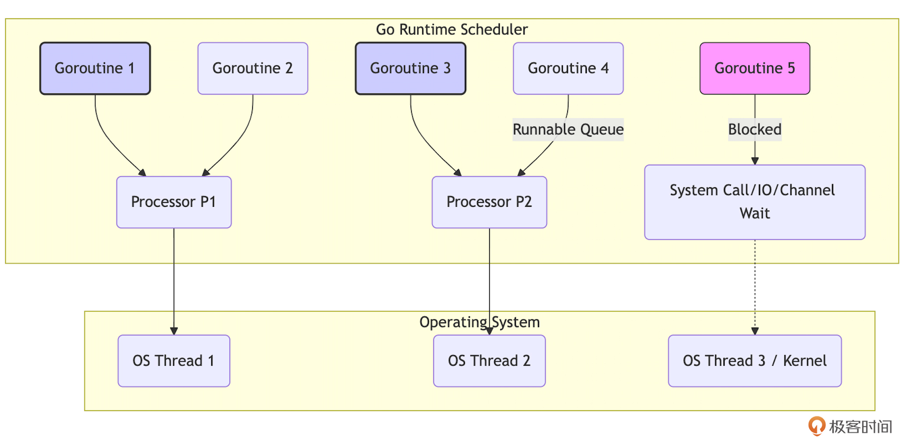
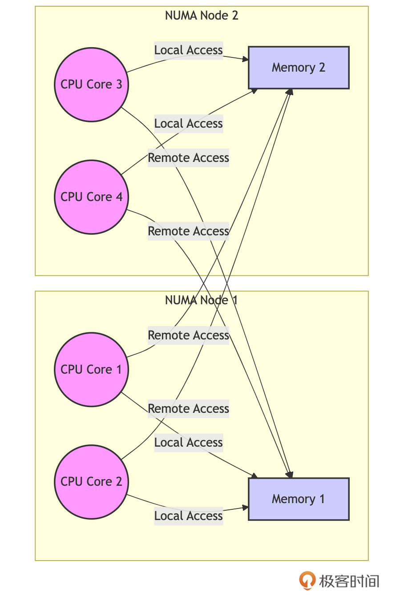
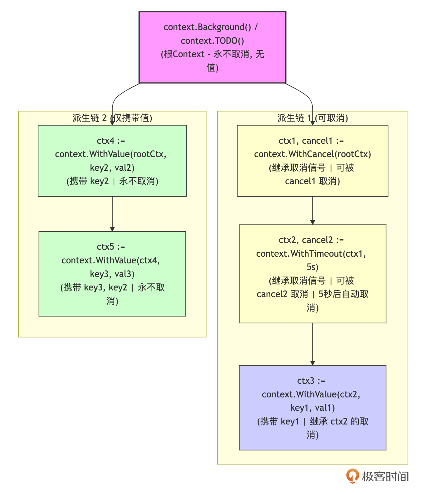

#  Go并发核心：goroutine、channel与Context的最佳实践
你好，我是Tony Bai！

Go语言之所以能在云计算和微服务时代迅速崛起，其简洁而强大的并发编程模型功不可没。如果你问一个Gopher，Go最吸引人的特性是什么？很多人会脱口而出： **goroutine** 和 **channel**！

这种基于 CSP（Communicating Sequential Processes）模型的并发原语，让编写并发程序变得前所未有的简单和直观。

但是，仅仅会用 go 关键字启动一个goroutine，或者知道用channel传递数据，就足够了吗？

- goroutine 到底“轻量”在哪里？我们应该如何管理它们的生命周期，避免泄漏？

- channel 除了基本的发送接收，还有哪些强大的用法和需要注意的死锁、关闭陷阱？

- 当我们需要处理更复杂的并发协调，比如多路监听、共享资源访问时，仅仅依靠 goroutine 和 channel 是否还够用？ `select`、 `sync` 包又扮演了什么角色？

- 在跨越goroutine边界，甚至跨越网络请求时，如何优雅地传递请求相关的截止时间、取消信号以及上下文值？这时， `context` 包为何成为事实标准，我们又该如何用好它？


不深入理解Go并发的核心工具及其适用边界，你可能会写出低效、易出错，甚至资源泄漏的并发代码。 **掌握 goroutine、channel、select、sync 和 context 的最佳实践，是编写高质量Go并发程序的基石。**

这节课，我们就一起深入Go并发的核心地带。我们将一起：

1. 领略Go并发模型的魅力：理解 goroutine 的轻量高效和 channel 的通信哲学，并关注其常见陷阱。

2. 探讨超越基础原语的场景：了解何时以及如何使用 `select`、 `sync` 包的工具来应对更复杂的并发挑战。

3. 详解 `context` 包：掌握这个处理超时、取消和请求值传递的利器及其最佳实践。


接下来，就让我们一起开启Go并发进阶之旅，一起驾驭Go的并发之力！

## Go并发模型的魅力：理解goroutine与channel的轻量与高效

Go的并发模型建立在两个核心概念之上：goroutine 和 channel。

### Goroutine：为何如此轻量？

Goroutine 常被称为“轻量级线程”，这是Go并发模型的核心优势所在。但“轻量”具体体现在哪里呢？

#### 极低的创建开销

启动一个goroutine所需的内存非常少，初始栈空间通常只有几KB。相比之下，操作系统线程（OS Thread）的创建通常需要分配数MB的栈空间。这意味着在Go程序中，我们可以轻松创建成千上万，甚至百万级别的goroutine，而不必过于担心资源耗尽的问题。

#### 动态伸缩的栈

Goroutine的栈空间并非固定不变。它以一个较小的初始值（如2KB）开始，并且能够根据函数的调用深度和局部变量的需求，在运行时自动地增长（分配更大的栈段）和收缩（释放不使用的栈段）。这种按需分配的机制避免了像传统线程那样预先分配一个固定大栈（如8MB）可能带来的内存浪费。

不过，自Go 1.19起，Go运行时在分配初始goroutine栈时会更加智能，它会根据goroutine历史平均栈使用情况来决定初始大小。这种基于历史平均值的策略，旨在减少普通情况下早期栈增长和拷贝的需要，其代价是对于那些远低于平均栈使用量的goroutine，可能会浪费最多2倍的空间。

#### 用户态调度与M:N模型

Goroutine的调度完全由Go运行时在用户空间进行管理，避免了进入和退出内核态的高昂成本。Go运行时实现了一个高效的 **M:N调度模型**：它将大量的用户级goroutine（M个）映射到少量的内核级OS线程（N个）上执行，并通过逻辑处理器（P）进行协调。当一个goroutine发生阻塞（如等待I/O、channel操作、锁）时，运行时会自动将其移出对应的OS线程，并让该线程去执行另一个就绪的goroutine，从而实现高效的CPU利用和并发执行。

我们可以用一个简化图来理解这个模型：



上图中，多个Goroutine（G）运行在逻辑处理器（P）上，P将工作调度到实际的OS线程（T）上执行。阻塞的G会暂时脱离P。

启动一个goroutine在语法上极其简单，只需在函数或方法调用前加上 `go` 关键字：

```go
package main

import (
    "fmt"
    "time"
)

func simpleWorker(id int) {
    fmt.Printf("Worker %d starting\n", id)
    time.Sleep(50 * time.Millisecond)
    fmt.Printf("Worker %d done\n", id)
}

func main() {
    go simpleWorker(1) // 启动 goroutine
    go simpleWorker(2)

    fmt.Println("Main goroutine might exit before workers finish...")
    // 如果 main 在这里直接结束，worker 可能没机会执行完
    // time.Sleep(100 * time.Millisecond) // 等待一小段时间，但这也并不可靠！
}

```

上面这个例子故意突显了主goroutine退出会导致整个程序退出的问题。为了正确地等待goroutine完成，我们需要 **同步机制**， `sync.WaitGroup` 显然是最常用的一种。

```go
package main

import (
    "fmt"
    "sync"
    "time"
)

func workerWithWG(id int, wg *sync.WaitGroup) {
    defer wg.Done() // 确保在 worker 退出前调用 Done
    fmt.Printf("Worker %d starting\n", id)
    time.Sleep(50 * time.Millisecond)
    fmt.Printf("Worker %d done\n", id)
}

func main() {
    var wg sync.WaitGroup
    for i := 0; i < 3; i++ {
        wg.Add(1)               // 在启动前增加计数
        go workerWithWG(i, &wg) // 传递 WaitGroup 指针
    }
    fmt.Println("Main waiting...")
    wg.Wait() // 阻塞，直到计数器归零
    fmt.Println("Main finished.")
}

```

这段代码使用 sync.WaitGroup 来同步多个 goroutine 的执行，确保主函数（main）在所有 worker goroutine 完成任务后才退出。

### Goroutine的进阶提示与陷阱

虽然goroutine提供了难以置信的便利性和强大的并发能力，但“能力越大，责任越大”。像任何强大的工具一样，如果不了解其细微之处和潜在的陷阱，可能会适得其反。接下来，我们就探讨下Go开发者进阶需要特别注意的地方。

#### Goroutine 泄漏（Goroutine Leak）

Goroutine 泄漏是最常见的陷阱之一。如果一个goroutine因为某种原因（如等待一个永远不会关闭或发送数据的channel，或等待一个永远不会满足的锁）而永久阻塞，它就永远不会退出。它占用的内存（主要是栈空间）和运行时资源将无法被回收，日积月累会导致内存耗尽或性能下降。下面是一个因Channel阻塞导致goroutine泄漏的示例：

```plain
func leakExample() {
    ch := make(chan int) // 无缓冲channel
    go func() {
        val := <-ch // 尝试从 ch 接收，但没有发送者，永久阻塞
        fmt.Println("Received:", val) // 这行永远不会执行
    }()
    // ch 没有被写入或关闭，上面的 goroutine 将永远阻塞，造成泄漏
    fmt.Println("Launched leaky goroutine...")
}

```

这是一个经典的例子，leakExample中启动的 goroutine会无限期地存在（直到程序退出），因为它被永远阻塞，试图从无缓冲通道 `ch` 接收数据。由于没有任何goroutine向 `ch` 发送值（并且 `ch` 从未关闭）， `<-ch` 操作将永远阻塞，使 goroutine 保持活动状态。这就是 goroutine 泄漏的本质。此外，由于闭包，通道 `ch` 被匿名 goroutine 函数捕获。这意味着 goroutine 保留对 `ch` 的引用。因为 goroutine 泄漏了（永远不会终止），所以通道 `ch` 也将在程序的整个生命周期内保留在内存中。它不能被垃圾回收，因为泄漏的 goroutine 持有对它的引用。

因此，务必确保每个启动的goroutine都有 **明确的、可达到的退出条件**。使用 `context` 包来控制生命周期（我们稍后详述），或者确保channel会被关闭或有数据发送/接收。对于使用 `sync.WaitGroup` 的情况，确保 `Done()` 一定会被调用。

#### 过多的Goroutine带来的开销

虽然单个goroutine很轻量，但启动过多（比如无限制地为每个入站请求启动多个goroutine）仍然会带来不可忽视的开销：

- 内存消耗：每个goroutine至少有几KB的栈，百万个goroutine就需要GB级别的内存。

- 调度器压力：Go运行时调度器需要管理所有活动的goroutine，过多的goroutine会增加调度的复杂度和开销，上下文切换虽然比线程切换快，但也不是零成本。

- 资源竞争：大量的goroutine可能同时竞争CPU、内存带宽、锁或其他资源，导致性能下降而非提升。

- GC压力：更多的goroutine栈对象也需要GC扫描。


因此，在实际开发中，不建议无限制地创建goroutine。对于需要处理大量并发任务的场景，可使用 **Worker Pool** 模式来复用和限制goroutine的数量，或者使用带缓冲channel作为信号量来控制并发度。下面是一个用channel做信号量控制并发度的示例：

```plain
package main

import (
    "fmt"
    "math/rand"
    "sync"
    "time"
)

// 模拟一个耗时任务
func simulateTask(id int) {
    duration := time.Duration(rand.Intn(3)) * time.Second // 模拟任务耗时 0-3 秒
    fmt.Printf("Task %d: Starting, will take %s\n", id, duration)
    time.Sleep(duration)
    fmt.Printf("Task %d: Finished\n", id)
}

func main() {
    rand.Seed(time.Now().UnixNano()) // 初始化随机数种子，确保每次运行结果不同

    numTasks := 20        // 总任务数量
    concurrencyLimit := 5 // 并发度限制

    // 创建一个带缓冲的 channel 作为信号量
    semaphore := make(chan struct{}, concurrencyLimit)

    var wg sync.WaitGroup // 用于等待所有 goroutine 完成

    for i := 1; i <= numTasks; i++ {
        wg.Add(1) // 增加等待计数器

        go func(taskID int) {
            defer wg.Done() // goroutine 结束时减少等待计数器

            // 获取信号量：向 channel 发送一个值（空结构体）
            semaphore <- struct{}{} // 阻塞直到 channel 有空位

            // 执行任务
            simulateTask(taskID)

            // 释放信号量：从 channel 接收一个值
            <-semaphore
        }(i)
    }

    wg.Wait() // 等待所有 goroutine 完成
    fmt.Println("All tasks finished.")
}

```

示例中的semaphore channel就像一个许可证池。每个goroutine 在开始执行任务之前必须获得一个许可证（通过向 channel 发送数据）。当所有许可证都已发放时（channel 已满），新的 goroutine 必须等待，直到有许可证被释放 (通过从 channel 接收数据)。这确保了同时运行的 goroutine 的数量永远不会超过 concurrencyLimit。运行此程序，你会看到任务按批次启动，每批次最多 concurrencyLimit（5）个任务同时运行。程序会等待所有任务完成，然后退出。

#### 主Goroutine退出问题（再强调）

主函数（main goroutine）的退出会导致整个程序的立即终止，不会等待其他goroutine完成，我们必须使用 `sync.WaitGroup`、channel 或其他同步机制来确保所有必要的goroutine都执行完毕。在前面的示例中已经演示了这一点，这里就不赘述了。

#### 调度器与NUMA架构的不感知

当前的Go运行时调度器，在设计上 **并未针对非一致性内存访问（NUMA）架构进行优化**。



如上图所示，在拥有多个CPU插槽（socket）和各自独立内存区域的NUMA服务器上，Go调度器可能将一个goroutine调度到与它所需访问的内存关联的CPU节点不同的另一个CPU节点上运行。这种跨节点的内存访问延迟会显著高于访问本地内存，可能导致性能瓶颈。

对于性能极其敏感且部署在NUMA服务器上的应用，一些开发者会采用 **手动绑核**（CPU Affinity）的策略，尝试将特定的goroutine（或支撑它们的OS线程）绑定到特定的CPU核心或NUMA节点上，以确保计算和数据访问的局部性。这通常需要借助第三方库或操作系统提供的工具（不如numactl），是一种高级且需要谨慎使用的优化手段。

理解goroutine的轻量特性及其背后的实现机制，同时警惕这些潜在的陷阱和限制，是编写高效、健壮Go并发程序的基础。接下来，我们将探讨goroutine之间沟通的桥梁——channel。

### Channel：不仅仅是管道

如果说goroutine是Go并发的执行单元，那么channel就是它们之间沟通的桥梁和同步的纽带。 **Go推崇“通过通信来共享内存”，channel正是这一理念的具象化体现。**

Channel提供了一种类型安全的方式，让goroutine可以发送和接收特定类型的值。更重要的是，channel的操作本身就包含了同步机制。

#### 创建与类型

Go使用内置的 `make` 函数来创建channel：

```go
// 创建一个只能传递 int 值的 channel
chInt := make(chan int)      // 无缓冲 channel

// 创建一个可以缓冲 5 个 string 值的 channel
chStr := make(chan string, 5) // 带缓冲 channel

```

- **无缓冲（Unbuffered）Channel**：容量为0。发送者（ `ch <- val`）和接收者（ `<-ch`）必须 **同时** 准备好进行通信，否则先到达的一方会 **阻塞** 等待另一方。这种阻塞行为使得无缓冲channel成为一种强大的 **同步** 工具。

- **带缓冲（Buffered）Channel**：拥有一个有限容量的队列。
  - 发送操作只有在缓冲区 **满** 时才会阻塞。

  - 接收操作只有在缓冲区 **空** 时才会阻塞。

  - 它允许发送和接收在一定程度上 **解耦** 和 **异步**，可以用来平滑突发流量或作为简单的队列。

#### 基本操作回顾

我们用一个简单的生产者-消费者示例回顾和强化一下Channel的基本操作：

```go
package main

import (
    "fmt"
    "math/rand"
    "sync"
    "time"
)

func producer(id int, ch chan<- int, wg *sync.WaitGroup) { // chan<- 表示只发送channel
    defer wg.Done()
    for i := 0; i < 3; i++ {
        data := id*10 + i
        fmt.Printf("Producer %d sending: %d\n", id, data)
        ch <- data // 发送数据
        time.Sleep(time.Duration(rand.Intn(100)) * time.Millisecond)
    }
}

func consumer(ch <-chan int, done chan struct{}) { // <-chan 表示只接收channel
    // 使用 for range 优雅地接收，直到 channel 关闭
    for data := range ch {
        fmt.Printf("Consumer received: %d\n", data)
        time.Sleep(time.Duration(rand.Intn(200)) * time.Millisecond)
    }
    fmt.Println("Consumer finished as channel closed.")

    done <- struct{}{}
}

func main() {
    ch := make(chan int, 3) // 带缓冲 channel
    var wg sync.WaitGroup
    var done = make(chan struct{})

    go consumer(ch, done) // 启动消费者

    numProducers := 2
    wg.Add(numProducers)
    for i := 0; i < numProducers; i++ {
        go producer(i, ch, &wg) // 启动生产者
    }

    wg.Wait() // 等待生产者完成
    close(ch)
    <-done // 等待消费者完成
    fmt.Println("Main finished.")
}

```

这段示例代码演示了使用带缓冲的 Channel 实现生产者-消费者模式。 多个生产者 goroutine 向 Channel 发送数据，一个消费者 goroutine 从 Channel 接收数据。 代码使用 sync.WaitGroup 来同步生产者和主 goroutine，并使用 close 函数关闭 Channel，通知消费者不再有新的数据。消费者goroutine与主goroutine的同步则是由一个无缓冲的 channel 充当的“信号”来实现的，当所有生产者退出后，主Goroutine关闭带缓冲的channel(ch)来通知消费者不再有新的数据发送到 Channel，然后主goroutine通过<-done等待消费者完成。消费者的for range 循环在接收到 Channel 关闭的信号后会退出。消费者通过done channel向主goroutine发送结束信号。

### Channel的进阶提示与陷阱

Channel虽然优雅，但也隐藏着不少陷阱，尤其是在涉及阻塞、关闭和 `nil` channel时。下面我们逐一来看。

#### 死锁：永久阻塞

这是最常见的channel问题。当一个goroutine尝试对一个channel进行操作（发送或接收），但永远没有其他goroutine来进行配对操作时，就会发生死锁。我们来看三个典型的死锁示例。

- 向无缓冲channel发送但无接收者，示例代码如下：

```go
func deadlockSend() {
    ch := make(chan int) // 无缓冲
    ch <- 1             // 尝试发送，但没有接收者，永久阻塞 -> deadlock
    fmt.Println("Sent?") // 不会执行
}

```

Go运行时能检测到这种所有 goroutine 都阻塞的情况并 panic (fatal error: all goroutines are asleep - deadlock!)，下面要讲到的示例情况也是如此。

- 空channel接收但无发送者，示例代码如下：

```go
func deadlockReceive() {
    ch := make(chan int) // 无缓冲
    val := <-ch         // 尝试接收，但没有发送者，永久阻塞 -> deadlock
    fmt.Println("Received:", val) // 不会执行
}

```

- 带缓冲channel死锁，示例代码如下：

```go
func deadlockBuffered() {
    ch := make(chan int, 1) // 容量为 1
    ch <- 1                 // 发送成功 (缓冲区未满)
    ch <- 2                 // 尝试发送，缓冲区已满，阻塞 -> deadlock
    fmt.Println("Sent 2?")   // 不会执行
}

```

因此，我们要确保channel的发送和接收操作能够匹配。对于无缓冲channel，发送和接收必须成对出现。对于带缓冲channel，要考虑缓冲区大小。使用 `select` 可以处理阻塞情况，这个在下面会有说明。

#### 死锁：操作 `nil` Channel

对一个值为 `nil` 的channel进行发送或接收操作，会永久阻塞，同样导致死锁。

```go
func deadlockNil() {
    var ch chan int // ch is nil
    // ch <- 1      // 发送操作，永久阻塞 -> deadlock
    <-ch         // 接收操作，永久阻塞 -> deadlock
}

```

因此，在使用channel前，务必确保它已经被 `make` 初始化。在 `select` 语句中，对 `nil` channel 的 `case` 永远不会被选中，可以利用这个特性来动态禁用某个 `case`，接下来也会说明。

#### Panic：关闭Channel相关的操作

以下关闭Channel的操作会导致运行时 panic：

- 关闭一个 `nil` channel。

- 关闭一个已经被关闭的 channel。

- 向一个已经被关闭的 channel 发送数据。


下面是一个示例：

```go
func panicClose() {
    // var chNil chan int
    // close(chNil) // panic: close of nil channel

    ch := make(chan int, 1)
    close(ch)
    // close(ch)    // panic: close of closed channel

    // ch <- 1      // panic: send on closed channel
}

```

为此，我们要遵循 **“不要从接收端关闭 channel，也不要关闭有多个并发发送者的 channel”** 的原则。关闭操作应由唯一的发送者，或最后一个确定不再发送的发送者执行，或者像上面示例那样，当发送者都发送结束后，由主Goroutine执行关闭操作。

#### 关闭 Channel 后的接收行为

对已关闭的channel进行接收操作是安全的，并且 **不会阻塞**。常用的从可能已关闭的channel中读取数据的操作语句如下：

```plain
val, ok := <-ch

```

如果 `ch` 的缓冲区中还有值，会依次接收这些值，并且 `ok` 为 `true`；当缓冲区为空后，后续的接收操作会立即返回该channel元素类型的 **零值**，并且 `ok` 为 `false`。

下面是一个具体的示例：

```go
func receiveFromClosed() {
    ch := make(chan int, 2)
    ch <- 1
    ch <- 2
    close(ch)

    val1, ok1 := <-ch
    fmt.Println(val1, ok1) // 输出 1 true

    val2, ok2 := <-ch
    fmt.Println(val2, ok2) // 输出 2 true

    val3, ok3 := <-ch
    fmt.Println(val3, ok3) // 输出 0 false (零值, ok为false)

    val4, ok4 := <-ch
    fmt.Println(val4, ok4) // 输出 0 false (零值, ok为false)

    // for range 会在 channel 关闭且读完所有缓冲值后自动结束
    // for val := range ch { // 如果在这里用 for range，它会读完 1, 2 然后退出
    //     fmt.Println("Range received:", val)
    // }
}

```

理解这个行为，对于使用 `for range` 遍历channel或需要判断channel是否已关闭并取完数据的场景至关重要。

#### Channel 的传递

Channel在运行是层面的表示，与map和slice类似，都存储的是指向底层数据结构的指针。将channel传递给函数时，传递的是这个指针的副本，它们指向同一个底层channel。因此，在函数内部对channel的操作（发送、接收、关闭）会影响到函数外部。下面示例演示了这一点：

```go
func closeChan(ch chan int) {
    close(ch) // 关闭操作会影响 main 中的 ch
}

func main() {
    ch := make(chan int)
    // go func(){ <-ch }() // 启动一个接收者避免死锁
    closeChan(ch)
    // ch <- 1 // 会 panic，因为 ch 已经被关闭
    _, ok := <-ch // 接收会立即返回 0, false
    fmt.Println("Channel closed?", !ok) // 输出 true
}

```

掌握channel的这些进阶用法和潜在陷阱，是利用它构建可靠、高效并发程序的关键。Channel虽然强大，但也需要谨慎使用，避免死锁和panic。

接下来，我们将看到当简单的goroutine和channel不足以应对更复杂的并发协调时，需要用到哪些更强大的工具。

## 超越基础原语：何时需要 select、sync 包与 Context？

Goroutine 和 Channel 构成了Go并发编程的基础，足以应对许多并发场景。但现实世界的并发问题往往更加复杂。当你需要处理以下情况时，就可能需要超越这两个基础原语了：

- 需要同时等待 **多个 Channel** 事件，并根据哪个先发生来采取不同行动？

- 需要保护 **共享内存**（如共享变量、数据结构）的访问，防止多个 goroutine 同时修改导致数据错乱？

- 某些简单的状态更新（如计数器、标志位）需要 **无锁** 的原子操作来保证效率和正确性？

- 需要一种机制来 **协调** 多个 goroutine，等待它们全部完成？

- 需要跨 goroutine **传递取消信号或截止时间**？


Go 标准库为此提供了更强大的工具： `select` 语句、 `sync` 包以及 `context` 包。

### `select` 语句：多路复用与超时控制

`select` 是 Go 语言在 channel 操作上的瑞士军刀。它允许你同时等待多个 channel 的发送或接收操作，并在其中任意一个操作就绪（可以执行而不会阻塞）时，执行相应的 `case` 分支。

#### 基础用法回顾

我们用一个多channel的选择示例来回顾和强化一下select的基本操作：

```go
package main

import (
    "fmt"
    "time"
)

func main() {
    ch1 := make(chan string, 1)
    ch2 := make(chan string, 1)

    go func() { time.Sleep(100 * time.Millisecond); ch1 <- "from ch1" }()
    go func() { time.Sleep(50 * time.Millisecond); ch2 <- "from ch2" }()

    // 等待 ch1 或 ch2 先到达
    select {
    case msg1 := <-ch1:
        fmt.Println("Received:", msg1)
    case msg2 := <-ch2:
        fmt.Println("Received:", msg2) // 这个会先执行
    case <-time.After(200 * time.Millisecond): // 设置超时
        fmt.Println("Timeout waiting for channels.")
        // default: // 添加 default 使 select 非阻塞
        //    fmt.Println("No channel ready right now.")
    }
}

```

这段代码使用 select 语句来同时监听多个 Channel，并在其中一个 Channel 接收到数据时执行相应的操作。它还使用了 time.After 函数（返回一个channel）来设置超时，防止程序无限期地等待。

#### select进阶提示与陷阱

select这把“军刀”虽然强大，但也隐藏着不少陷阱，尤其是在涉及channel选择、阻塞等行为时。下面我们逐一来看。

**首先是随机选择（Random Selection）。** 如果 `select` 语句在某一时刻有多个 case同时就绪，它会伪随机地选择其中一个执行。不能假设它会按代码顺序或其他任何固定顺序选择。下面这个示例很好地展示了这一点：

```go
package main

import (
    "fmt"
)

func selectRandom() {
    ch1 := make(chan int, 1)
    ch2 := make(chan int, 1)
    ch1 <- 1
    ch2 <- 2

    // ch1 和 ch2 都已就绪
    select {
    case <-ch1:
        fmt.Println("Received from ch1")
    case <-ch2:
        fmt.Println("Received from ch2")
    }
}
func main() {
    for range 5 {
        selectRandom()
    }
}

```

多次运行这个示例，你会发现有时输出 ch1，有时输出 ch2。因此，你在日常使用select时，务必注意不要依赖 `select` 的选择顺序来实现特定的逻辑。

**然后是阻塞行为。** 如果 `select` 中没有 `default` 分支，并且所有 `case` 上的 channel 操作都不能立即执行（即都会阻塞），那么整个 `select` 语句会阻塞，直到其中至少一个 channel 操作变得可以执行。比如下面这个示例：

```go
func selectBlockingDeadlock() {
    ch := make(chan int) // 无缓冲，也无发送者
    fmt.Println("Waiting on select...")
    select {
    case <-ch: // 无法接收，阻塞
        fmt.Println("Received something?")
    }
    // 如果没有其他 goroutine 向 ch 发送，这里会死锁
    fmt.Println("Select finished?")
}

```

因此，在使用select时，我们要确保 `select` 监听的 channel 最终会有事件发生，或者提供 `default` 或超时 `case` 来避免永久阻塞。

**接着是 `nil` Channel Case 的妙用。** 对 `nil` channel 进行读或写操作的 `case` 永远不会被选中。我们可以利用这一点来动态地启用或禁用 `select` 中的某个 `case`。看下面示例：

```go
package main

import (
    "fmt"
)

func selectNilCase(sendData bool) {
    dataCh := make(chan int, 1)
    var sendCh chan<- int // 初始为 nil

    if sendData {
        sendCh = dataCh // 如果需要发送，让 sendCh 指向 dataCh
        sendCh <- 100   // 发送数据 (如果 sendData 为 true)
    }

    select {
    case val := <-dataCh: // 接收 case
        fmt.Println("Received:", val)
    case sendCh <- 200: // 发送 case, 如果 sendCh 为 nil，此 case 无效
        fmt.Println("Sent 200")
    default:
        fmt.Println("Default case executed.")
    }
}

func main() {
    selectNilCase(true) // Received: 100
    selectNilCase(false) // Default case executed.
}

```

我们看到如果 sendData 为 false，sendCh 为 nil，那发送 case 无效。如果 sendData 为 true，sendCh 指向 dataCh，缓冲区可能满，那发送 case 可能阻塞或执行。将channel变量设为 `nil` 是临时“关闭” `select` 中对应 `case` 的常用技巧，这种技巧可以用于动态控制 select 语句的行为、避免不必要的阻塞和优雅地处理错误。

**最后是空 `select` （Empty Select）。** 一个没有任何 `case` 的 `select {}` 语句会永久阻塞。这有时被用作一种让 goroutine 等待（例如，等待程序结束信号）的简单方式，虽然使用 channel 或 `sync.WaitGroup` 通常更清晰。

```plain
func selectEmptyBlock() {
    fmt.Println("Entering empty select block...")
    select {} // 永久阻塞当前 goroutine
    // fmt.Println("This will never be printed.")
}

```

掌握 `select` 的上述这些行为特性，是编写复杂、健壮的 Go 并发程序的关键。

### `sync` 与 `atomic`：当共享内存是必须时

虽然 Go 推崇通过 channel 通信，但现实中， **共享内存配合锁或原子操作仍然是解决许多并发问题的有效甚至更优的手段**，尤其是在对性能要求极高或需要保护复杂数据结构状态的场景。Go同样提供了针对共享内存方案的原语支持，下面我们简单看一下。

#### `sync.Mutex` 与 `sync.RWMutex`

sync.Mutex 与 sync.RWMutex是最基础也是最重要的共享内存保护机制。

`sync.Mutex` **（互斥锁）** 保证同一时刻只有一个 goroutine 能进入被其保护的代码临界区。适用于任何需要独占访问共享资源的场景。

```plain
var counter int
var mu sync.Mutex // 保护 counter

func incrementCounter() {
    mu.Lock() // 获取锁
    counter++
    mu.Unlock() // 释放锁
}

// 更安全的做法，保证 Unlock 总被调用
func safeIncrement() {
    mu.Lock()
    defer mu.Unlock() // 推荐使用 defer 释放锁
    counter++
}

```

使用sync.Mutex时要注意以下事项：

- 锁的粒度：保护的代码范围应尽可能小，只包含必要的操作，避免持有锁时间过长影响并发度。

- 死锁：多个 goroutine 获取多个锁时，必须保证所有 goroutine 都按相同顺序获取锁，否则极易死锁。

- 不要拷贝： `Mutex` 包含内部状态，不能被拷贝。应传递其指针。


sync包提供了RWMutex用于 **读多写少** 的场景，该RWMutex允许多个“读”操作并发进行，但“写”操作会保证独占。RWMutex可以显著提高并发读的性能。下面是一个应用RWMutex的典型示例：

```go
var configData map[string]string
var configMu sync.RWMutex // 保护 configData

func getConfig(key string) (string, bool) {
    configMu.RLock() // 获取读锁 (共享)
    defer configMu.RUnlock()
    val, ok := configData[key]
    return val, ok
}

func setConfig(key, value string) {
    configMu.Lock() // 获取写锁 (独占)
    defer configMu.Unlock()
    configData[key] = value
}

```

RWMutex在使用上“门槛”略高于Mutex，并且 `RWMutex` 本身比 `Mutex` 复杂，开销略高。如果读写比例不悬殊，或者写竞争激烈， `Mutex` 可能反而性能更好。需要根据实际场景的benchmark再决定究竟使用哪种锁。和Mutex一样，RWMutex也有内部状态，同样不可拷贝。

#### `atomic` 包（原子操作）

对于非常简单的基础类型（各种 `int`、 `uint`、 `uintptr`、 `unsafe.Pointer`）的共享访问，如果操作本身是原子的（如简单的增减、比较并交换 CAS、加载、存储），使用 `sync/atomic` 包提供的函数通常比使用锁效率更高，因为它直接利用了 CPU 提供的原子指令，避免了锁的开销和可能的上下文切换。

```go
import "sync/atomic"

var counter int64 // 必须是 int64 或 int32 等 atomic 支持的类型

func atomicIncrement() {
    atomic.AddInt64(&counter, 1) // 原子增 1
}

func getCounterAtomic() int64 {
    return atomic.LoadInt64(&counter) // 原子读
}

```

**然而，在多核高并发环境下，原子操作的扩展性也并非没有“天花板”。** 尽管单个原子指令执行很快，但当多个CPU核心高频地对 **同一块内存（通常是同一个缓存行 Cache Line）** 上的原子变量进行写操作时，CPU为了维护缓存一致性（例如通过MESI协议），会导致该缓存行在不同核心的缓存之间频繁同步和失效。这种现象，尤其是在“真共享（True Sharing）”争用下，会导致所谓的“缓存行乒乓（Cache Line Ping-Ponging）”，带来显著的内存访问延迟。

这意味着，一个简单的原子计数器在核心数非常多，且所有核心都在激烈竞争更新这同一个计数器时，其性能可能远不如预期，甚至成为瓶颈。这个问题不仅影响直接使用原子操作的代码，也可能间接影响依赖原子操作实现内部状态管理的标准库并发原语（例如 `sync.RWMutex` 内部的读者计数器，在高并发读场景下，其原子更新就可能因此产生争用，限制了读操作的扩展性）。

Go 社区也一直在关注和探索解决这类多核扩展性问题的方案，例如通过设计 per-P（Go调度器中的Processor）或 per-M（OS Thread）的数据结构（如一些提案中讨论的 `ShardedValue`、 `PLocalCache`、 `MLocal` 等思路），将数据分片或本地化，以减少跨核心的共享内存争用，从而更好地发挥 Go 在现代多核硬件上的并发潜力。

不过，即便有这些深层次的性能考量，原子操作的适用范围仍然是明确的：它们主要用于 `atomic` 包支持的类型和操作，无法保护复杂数据结构或多个操作的原子性。并且，对于复杂逻辑，使用原子操作可能比锁更难理解和维护。因此，在选择时，需要权衡简洁性、预期的并发级别、争用情况以及对极致性能的需求。

#### 其他 `sync` 原语

`sync` 包还提供了一些辅助并发逻辑编写的原语，这里我们来简单说明一下它们各自的特点和适用场景。

**首先是 `sync.WaitGroup`。**

你可能已经很熟悉 `sync.WaitGroup` 了，它是我们用来等待一组 goroutine 完成任务的常用工具，前面也多次出现过它的身影。虽然好用，但其经典的 `wg.Add(1)`， `go func(){ defer wg.Done() ... }()`， `wg.Wait()` 的三段式用法，虽然模式固定，但开发者（尤其是新手）偶尔会忘记调用 `Done`，或者错误地将 `Add` 放在了 goroutine 内部，导致潜在的死锁或 panic。

为了解决这些痛点，Go 社区有一个广受关注的提案（ [#63796](https://github.com/golang/go/issues/63796)），建议为 `WaitGroup` 增加一个 `Go(f func())` 方法。这个方法会封装 `Add(1)`，启动 goroutine 以及 `defer Done()` 的逻辑，使得启动和管理一个由 `WaitGroup` 追踪的 goroutine 变得异常简洁和安全，如 `wg.Go(func() { /* 你的任务代码 */ })`。这个提案已标记为 “Likely Accept”，我们很有可能在未来的 Go 版本（如 Go 1.25 或之后）中看到它成为标准库的一部分，进一步提升并发编程的体验。这一改进也得益于 Go 1.22 中 for 循环变量语义的修正，使得在闭包中直接使用循环变量更加安全。

如果你不仅需要等待一组 goroutine 完成，还关心它们是否出错，并希望在任何一个 goroutine 出错时能够 **取消** 其他 goroutine 的执行时， `sync.WaitGroup` 就显得力不从心了。这时， `errgroup`（位于 `golang.org/x/sync/errgroup` 包）就派上了大用场。

`errgroup.Group` 提供了类似 `WaitGroup` 的功能，但它额外处理了 **错误传播** 和基于 `context` 的 **取消机制**。你可以用 `group.Go(func() error { ... })` 来启动一个任务，这个函数需要返回一个 `error`。 `group.Wait()` 会等待所有由 `Go` 方法启动的 goroutine 完成，并返回遇到的 **第一个非nil错误**。如果其中一个任务返回错误，或者传递给 `errgroup.WithContext` 的 `context` 被取消，那么与该 `group` 关联的 `context` 也会被取消，从而通知所有其他正在运行的任务尽快退出。 `errgroup` 的设计与我们前面讨论的 `context` 包完美结合，非常适合管理一组可能出错并需要级联取消的并发任务。许多流行的第三方库和实际项目中都能看到它的身影。

**接着是 `sync.Once`。** `sync.Once` 可以确保某个初始化动作 **只执行一次**，即使在多个 goroutine 并发调用 `Do` 方法的情况下也是如此。这对于实现单例模式的延迟初始化、全局配置加载等场景非常有用，可以避免竞态条件和不必要的重复工作。

```go
var once sync.Once
var config *MyConfig

func GetConfig() *MyConfig {
    once.Do(func() {
        // 这里的代码只会被执行一次
        config = loadConfigFromSomewhere()
        fmt.Println("Config loaded.")
    })
    return config
}

```

**然后是 `sync.Cond`（条件变量）。** `sync.Cond` 是 Go 语言中提供的一种复杂的 goroutine 间同步机制，它允许 goroutine 等待某个特定条件的成立，并在条件变化时通知其他正在等待的 goroutine。使用 `sync.Cond` 时，通常会与一个 `Locker`（如 `*sync.Mutex`）一起使用，以确保条件判断和状态变更的原子性。

`sync.Cond` 提供了三个主要方法： `Wait()`、 `Signal()` 和 `Broadcast()`。其中， `Wait()` 方法会原子性地解锁其关联的 `Locker`，并将调用该方法的 goroutine 置于等待状态，直到被 `Signal()` 或 `Broadcast()` 唤醒。唤醒后， `Wait()` 会重新锁定 `Locker`。 `Signal()` 方法则用于唤醒一个正在等待该条件的 goroutine，而 `Broadcast()` 方法则用于唤醒所有正在等待该条件的 goroutine。

需要注意的是， `sync.Cond` 是一种相对底层的同步机制，使用时必须仔细管理锁和条件判断，以避免出现死锁或虚假唤醒（spurious wakeup）的情况，即 goroutine 被唤醒但条件仍未满足。在许多场景中，使用 channel 或其他更高级的同步原语可能会提供更简洁的解决方案。然而，对于那些需要精细控制等待和通知逻辑的复杂同步问题， `sync.Cond` 仍然是一个不可或缺的工具。

**然后我们来看 `sync.Pool`。** `sync.Pool` 是 Go 语言中的一种原语，主要用于复用临时对象，以减轻垃圾收集器（GC）的压力。当需要频繁创建和销毁大量相同类型的、生命周期短暂的对象时，例如在处理网络请求时使用的缓冲区， `sync.Pool` 可以有效地缓存这些对象，从而减少内存分配和 GC 扫描的开销。

需要注意的是， `sync.Pool` 并不是一个通用的缓存工具。池中的对象可能会在没有任何通知的情况下被 GC 回收，尤其是在两次 GC 之间未被使用时。因此，它不适合用于存储有状态或必须持久化的对象。

总的来说， `sync.Pool` 是一个性能优化工具。是否使用它以及如何配置其 `New` 函数（用于在池为空时创建新对象），通常需要通过基准测试来验证其实际效益。合理地利用 `sync.Pool` 可以显著提高应用程序的性能，特别是在高频率对象创建和销毁的场景中。

**最后我们来看 `sync.Map`。** 这是 Go 1.9 引入的一个内置的并发安全的 map。与普通的 `map` 配合 `sync.Mutex` 或 `sync.RWMutex` 来保护并发访问相比， `sync.Map` 在某些特定场景下（主要是读多写少，或者大量不相交的写操作）能提供更好的性能，因为它采用了一些更细粒度的锁策略和无锁技术。

我们在 [第 06 讲](https://time.geekbang.org/column/article/878172?utm_campaign=geektime_search&utm_content=geektime_search&utm_medium=geektime_search&utm_source=geektime_search&utm_term=geektime_search) 中已经对 `sync.Map` 的适用场景和内部机制做过探讨，这里就不再赘述。

#### 选择 `sync` 包还是 channel？

既生瑜何生亮！Go既提供了体现“通过通信来共享内存”哲学的channel，也提供了传统基于共享内存并发模型的sync包和原子操作，那么我们该如何选择使用哪种并发原语呢？

通常在需要传递数据或所有权或需要简单同步的场景中先考虑 **channel**。如果需要保护共享内存状态或实现临界区，又或者需要更高性能的并发，则更多使用 **Mutex/RWMutex**。对于需要高性能无锁更新简单计数器/标志的场景， **atomic** 则更为适合。而像 `errgroup` 这样的工具，则是在 `WaitGroup` 和 `context` 基础上，针对特定并发模式（如带错误传播和取消的goroutine组）的进一步封装和优化。

### Context 包：超越同步，实现控制与传值

我们已经看到 `select` 可以处理多路 channel 和超时， `sync` 可以保护共享数据。但它们都难以解决跨越整个请求处理链路（可能涉及多个 goroutine、多个函数调用、甚至跨服务调用）的取消传播和截止时间控制的问题，也难以优雅地传递 **请求范围的上下文信息**（如 Request ID、用户认证信息）。

这正是 `context` 包的用武之地。它提供了一种标准化的方式来携带这些跨越 API 边界的信号和值。 `Context` 就像一根贯穿整个调用链的“指挥棒”，下游的函数和 goroutine 可以通过它：

- 检查是否应该提前取消工作（因为上游已经取消或超时）。

- 了解整个操作的最终截止时间。

- 获取与当前请求相关的特定值。


`context` 包是现代 Go Web 开发、微服务以及任何涉及复杂异步流程的标准实践。它的引入极大地提升了 Go 程序在处理超时、取消以及传递请求元数据方面的健壮性和优雅性。

由于 `context` 的重要性和其独特的设计，我们在接下来的内容中会对其进行更详细的探讨，学习它的核心接口、实现机制和最佳实践。

## context详解：优雅处理超时、取消与请求值传递

在了解了goroutine、channel以及更传统的 `sync` 原语后，我们再聚焦于Go并发编程中一个极其重要且独特的工具—— `context` 包。正如我们之前提到的，当简单的同步或数据传递不足以应对跨goroutine的请求生命周期管理、超时控制、取消传播以及请求范围的值传递时， `context` 就成了不二之选。

`context` 包自Go 1.7加入标准库以来，已成为编写健壮网络服务和并发程序的基石。它提供了一套标准的接口和机制，让我们能够优雅地处理这些复杂场景。那么， `context` 是如何做到这一切的呢？让我们深入它的核心设计。

### 核心接口：Context 的四个“能力”

`context` 包的核心就是 `Context` 接口类型，它定义了上下文应该具备的四种能力：

```go
// $GOROOT/src/context/context.go
type Context interface {
    // Deadline 返回工作应该被取消的时间。如果没有设置截止时间，ok 返回 false。
    Deadline() (deadline time.Time, ok bool)

    // Done 返回一个 Channel。当代表此上下文的工作被取消时，此 Channel 会被关闭。
    // 如果此上下文永远不会被取消，Done 可能返回 nil。
    Done() <-chan struct{}

    // Err 在 Done 返回的 Channel 被关闭后，返回一个非 nil 的错误。
    // 如果上下文被取消，返回 Canceled；如果上下文超时，返回 DeadlineExceeded。
    Err() error

    // Value 返回与此上下文关联的键 key 对应的值，如果不存在则返回 nil。
    Value(key any) any
}

```

我们可以将这四个方法分为两类，对应 `context` 要解决的两大问题。

**第一类：控制传递（Cancellation & Deadline）。** `Deadline()`、 `Done()`、 `Err()` 这三个方法共同构成了上下文的控制机制。

- `Done()` 是核心，它提供了一个只读channel。下游的goroutine应该监听这个channel。一旦它被关闭，就意味着收到了取消或超时的信号，应该停止当前工作并清理资源。

- `Err()` 用于在 `Done()` 关闭后，获取具体的取消原因（是手动取消 `context.Canceled` 还是超时 `context.DeadlineExceeded`）。

- `Deadline()` 则允许获取设置的截止时间（如果有的话）。


**第二类：值传递（Request-scoped Values）。** `Value(key any)` 方法用于在函数调用链或goroutine之间传递请求范围的值，如Trace ID、用户身份等。

仅仅定义接口是不够的。 `context` 包的精妙之处在于它提供了一系列函数来创建和派生具有不同能力的 `Context` 实例，并内置了这些接口的具体实现。

### 创建与派生 Context：构建上下文关系树

一个典型的Go程序中，Context通常形成一个树状结构。树的根节点通常是一个 “Background” Context，而后续的操作会基于父Context派生出子Context。这种树状结构是理解取消信号传播和值传递的关键。

#### 根 Context（ `Background` 与 `TODO`）

Go context包提供了两种创建根Context的方法。

- `context.Background()`：返回一个非nil、永不取消、没有值、没有截止时间的空Context。它通常用在 `main` 函数、初始化、或请求处理的最顶层，作为所有Context树的根。

- `context.TODO()`：功能与 `Background()` 完全相同。它的存在是为了提示开发者：当你还不确定应该使用哪个Context，或者当前函数未来计划接收一个Context参数时，可以临时用 `TODO()` 作为占位符。


这两个函数返回的都是内部类型 `emptyCtx` 的实例，它们本身不携带任何信息或控制能力，仅仅作为派生的起点。

#### 派生 Context

基于一个父Context创建新的子Context。子Context会继承父Context的取消信号和值。下面是context包提供的常用的创建子Context的函数：

- `context.WithCancel(parent Context) (ctx Context, cancel CancelFunc)`：创建可手动取消的子Context。

- `context.WithDeadline(parent Context, d time.Time) (Context, CancelFunc)`：创建带截止时间的子Context。

- `context.WithTimeout(parent Context, timeout time.Duration) (Context, CancelFunc)`：创建带超时的子Context。

- `context.WithValue(parent Context, key, val any) Context`：创建携带键值对的子Context。


#### Context 树状结构示例

为了更好地理解Context的树型结构，我绘制了一个Context 树状结构示意图，如下所示：



这张图展示了从根 Context 派生出不同类型子 Context 的关系。

- `rootCtx`：代表树的根，由 `context.Background()` 或 `context.TODO()` 创建。

- 派生链1 展示了可取消Context的链式派生：
  - `ctx1`（通过 `WithCancel`）可被手动取消。

  - `ctx2`（通过 `WithTimeout`）继承 `ctx1` 的取消，并增加超时自动取消。

  - `ctx3`（通过 `WithValue`）携带值 `(key1, val1)`，并继承 `ctx2` 的取消特性。取消信号会从 `rootCtx` -\> `ctx1` -\> `ctx2` -\> `ctx3` 向下传播。
- 派生链2 展示了仅携带值的派生：
  - `ctx4` 和 `ctx5` 通过 `WithValue` 创建，它们携带值，但因为它们的祖先 `rootCtx` 永不取消，所以它们自身也无法被取消。

  - `ctx5` 可以通过 `Value()` 方法访问到 `key3` 和 `key2` 的值（向上查找）。

理解这个树状结构和派生关系，对于掌握 Context 的取消传播和值传递机制至关重要。

#### 关于cancel函数

对于 `WithCancel`、 `WithDeadline` 和 `WithTimeout`，它们都返回一个 `cancel` 函数。调用这个函数会：

1. 关闭当前 Context 的 `Done()` channel。

2. 递归地取消所有由当前 Context 派生出的子 Context。

3. 释放当前 Context 占用的资源（如计时器）。


要注意，返回的 `cancel` 函数 **务必要被调用**，以避免资源泄漏。最常用的方式是使用 `defer cancel()`。

#### 关于WithValue的key

前面说过，WithValue 函数是用于创建包含键值对的上下文的函数。它主要用于传递请求作用域的数据，并且应该避免滥用。 **为了避免不同包之间的键冲突， `WithValue` 的 `key` 不应使用内置类型（如 `string`），而应该为上下文的键定义自己的类型。** 通常使用 struct{} 作为键的类型，因为 struct{} 不占用任何内存，并且可以保证唯一性。

下面就是一个基于 struct{} 自定义WithValue键类型的示例：

```plain
package main

import (
    "context"
    "fmt"
)

// 定义一个上下文键类型
type requestIDKey struct{}

func main() {
    // 创建一个根上下文
    ctx := context.Background()

    // 创建一个派生的上下文，并添加一个请求 ID
    ctx = context.WithValue(ctx, requestIDKey{}, "12345")

    // 从上下文中获取请求 ID
    requestID := ctx.Value(requestIDKey{}).(string) // 需要类型断言

    fmt.Println("Request ID:", requestID) // 输出：Request ID: 12345

    // 传递上下文给其他函数
    processRequest(ctx)
}

func processRequest(ctx context.Context) {
    // 从上下文中获取请求 ID
    requestID := ctx.Value(requestIDKey{}).(string)

    fmt.Println("Processing request with ID:", requestID) // 输出：Processing request with ID: 12345
}

```

### 如何优雅地使用 Context

掌握了创建和派生的方法后，正确使用Context还需要遵循一些约定和模式。

**第一，作为函数首参数，命名 `ctx`。** 使用ctx算是Go社区的强约定，比如：

```go
func ProcessData(ctx context.Context, data MyData) error

```

**第二，显式传递，不存入结构体。** Context 代表的是一次调用或请求的上下文，它应该是流动的。将其存入结构体字段通常意味着设计上可能存在问题（除非该结构体本身就代表一个长期运行的任务，且需要用Context控制其生命周期，但这种情况也需谨慎）。

**第三，监听 `Done()` Channel。** 这是响应取消信号的核心。对于任何可能长时间运行或阻塞的操作（网络请求、数据库查询、等待channel、复杂计算等），都应该在操作前或操作中通过 `select` 检查 `ctx.Done()`，比如下面示例：

```go
func longRunningTask(ctx context.Context) error {
    ticker := time.NewTicker(1 * time.Second)
    defer ticker.Stop()

    for {
        select {
        case <-ctx.Done(): // 检查取消信号
            slog.Info("Task canceled", "error", ctx.Err())
            return ctx.Err()
        case <-ticker.C:
            slog.Info("Working...")
            // 做一小部分工作
        }
    }
}

```

**第四，及时调用 `cancel()`。** 对于 `WithCancel`、 `WithDeadline` 和 `WithTimeout` 返回的 `cancel` 函数，使用 `defer cancel()` 是确保资源释放的最简单可靠的方式。

**第五，向下传递，而非取代。** 当调用下游函数或启动新goroutine时，将当前 `ctx`（或基于它派生的新 `ctx`）传递下去。不要在中间环节用 `context.Background()` 或 `TODO()` 重新创建一个根Context，这会切断取消信号和值的传播链条。

**第六， `Value` 的克制使用。** 牢记 `WithValue` 的设计初衷和限制。它不是通用的参数传递机制。如果一个值不是贯穿请求始终的上下文信息，最好还是通过函数参数显式传递。

通过遵循这些原则和实践， `context` 就能成为你手中处理并发控制和信息传递的利器，帮助你编写出更健壮、更可预测、更易于维护的Go程序。

## 小结

这一讲，我们深入探讨了Go并发编程的核心武器库，从基础的 goroutine、channel 到更高级的 select、sync 包原语，并重点详解了现代Go并发不可或缺的 `context` 包。

1. **Go并发模型的魅力**：我们理解了goroutine为何轻量（低创建开销、动态栈、用户态调度M:N模型），以及channel作为类型安全、内置同步的通信管道的核心地位。同时，我们也警惕了 goroutine 泄漏、过多 goroutine 的开销、主 goroutine 退出以及当前调度器对 NUMA 不敏感等潜在问题和陷阱，并掌握了 channel 操作可能导致的死锁和 panic 情况，以及 channel 关闭的最佳实践。

2. **超越基础原语**：我们认识到，在复杂场景下需要更强大的工具。 `select` 提供了多路 channel 复用的能力，并能优雅地实现超时和非阻塞逻辑，但也需要注意其随机选择和 `nil` channel case 的行为。当需要保护共享内存时， `sync` 包的 `Mutex` 和 `RWMutex` 是基础工具，需要注意锁粒度、死锁和拷贝问题； `atomic` 包则为基本类型提供了高效的无锁操作。 `WaitGroup` 和 `Once` 也是常用的同步辅助工具。

3. **Context 的核心价值**：我们明确了 `context` 主要解决了其他原语难以优雅处理的、跨越 goroutine 的取消传播、截止时间控制和请求范围值传递等几大核心问题。

4. **Context 详解与实践**：我们掌握了 `Context` 接口的四个方法（ `Deadline`、 `Done`、 `Err`、 `Value`），以及如何通过 `Background`、 `TODO`、 `WithCancel`、 `WithDeadline`、 `WithTimeout` 和 `WithValue` 来创建和派生 Context，构建上下文关系树。重点强调了监听 `Done()` channel 以响应取消信号，以及必须调用 `cancel()` 函数（通常用 `defer`）以释放资源这两大核心实践。同时，我们也学习了 `WithValue` 传递请求范围值的正确姿势（使用非导出 key 类型、传递必要信息、注意性能）。


理解并熟练运用 goroutine、channel、select、sync 原语以及 context 包，是编写健壮、高效、可维护的Go并发程序的关键。它们共同构成了Go语言在现代并发编程领域的核心竞争力，使得开发者能够以相对简洁的方式应对复杂的并发挑战。

## 思考题

假设在一个需要向多个下游服务（比如服务A、服务B、服务C）并行发起 RPC 调用的场景中，要求：

1. 整个操作有一个总的超时时间（比如 500ms）。

2. 只要有一个下游服务调用失败，就应该尽快取消其他还在进行的调用。

3. 需要将请求的 Trace ID 传递给所有下游调用。


你会如何结合使用 goroutine、channel、 `sync.WaitGroup`、 `context.WithTimeout`、 `context.WithCancel` 和 `context.WithValue` 来实现这个逻辑？描述一下大致的思路或关键代码结构。

欢迎在留言区分享你的设计！我是Tony Bai，我们下节课见。
