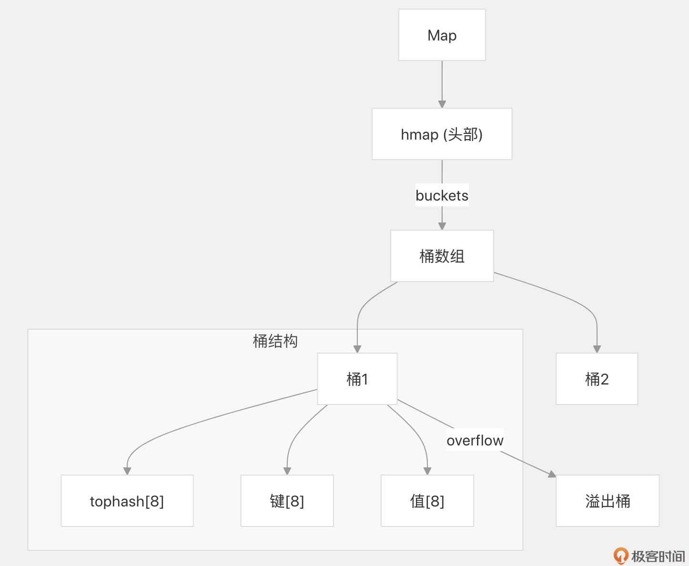
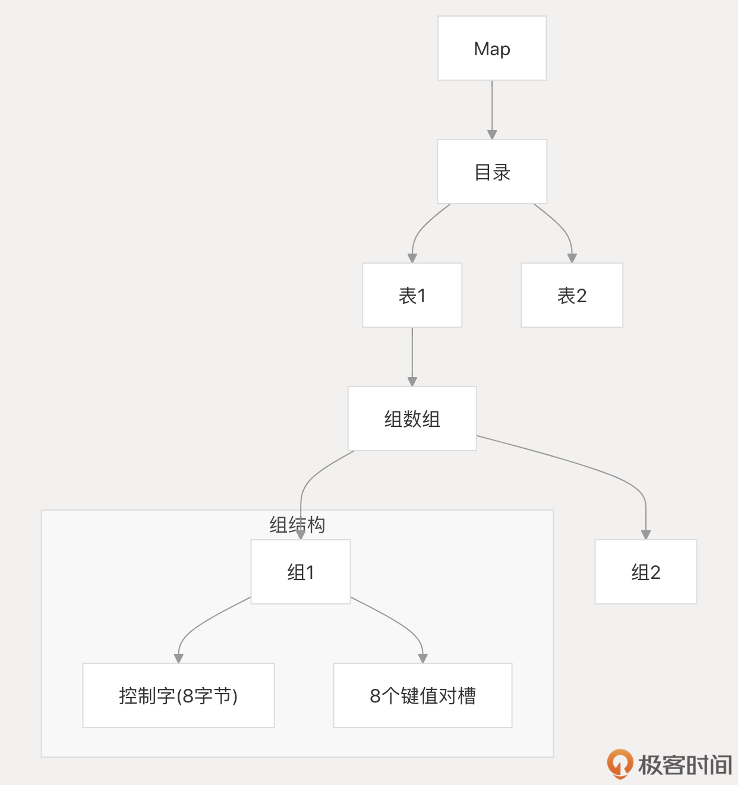

# Map：不仅是键值对，掌握哈希表的高效用法与并发陷阱
你好，我是 Tony Bai。

前面几讲我们“强化”了 Go 中的原生序列类型，如数组、切片和字符串。它们擅长处理有序数据，但如果我们需要快速根据一个“键”找到对应的“值”呢？这时，Go 的另一个内置法宝—— **map** 就登场了。

**map 本质上是哈希表（hash table）的一种实现**。它的核心“魅力”在于，无论你的数据集有多大，查找、插入、删除一个键值对的操作，平均时间复杂度都能达到惊人的 **O(1)**，也就是常数时间！这使得 map 成为 Go 中使用频率最高、也最实用的数据结构之一，无论是做缓存、去重，还是建立数据间的关联，都离不开它。

但是，强大的工具往往伴随着复杂性。map 的使用并非“傻瓜式”操作，一不小心就可能掉进各种“陷阱”：

- 并发读写 map 为何会导致程序崩溃？如何安全地在 goroutine 间共享 map？
- 为什么不能直接获取 map 中元素的地址？修改 map 中的结构体字段为何会报错？
- `nil` map 和空 map 有何区别？误用为何会导致 panic？
- 为何不能直接用 `==` 比较两个 map 是否相等？
- map 的遍历顺序为何是随机的？

如果你对这些问题还存在疑惑，那么这节课就是为你量身定制的。 **不深入理解 map 的特性、约束和常见陷阱，就可能写出有并发风险、性能低下甚至隐藏Bug 的代码。**

本节课我们将深入探讨 map 的用法、特性、陷阱和优化技巧，让你能够充分发挥 map 的优势，避免常见的错误。

并且，Go map 的实现依然在优化，Go 1.24 版本中引入了基于 swiss table 的新 map 实现，在本节课末尾，我也会对新 map 的实现做简单介绍，对新旧 map 实现做个简单对比。我们的目标很明确： **让你不仅会用 map，更能用好 map**，充分发挥其威力，规避其风险。

## map 基础回顾

我们先快速过一遍 map 的基础，确保大家都在同一起跑线上。

#### 创建 Map： `make` vs 字面量

声明一个 map 变量：

```
var m map[KeyType]ValueType

```

KeyType 必须是可比较（comparable）的类型，支持 == 和 !=，如 int、string、指针、 struct（所有字段都可比较）等，但 slice、func、map 本身不行。ValueType 可以是任意类型。

但仅仅这样声明的 map 还不行，因为其值是 nil。 **对 nil map 进行写操作会导致 panic！** 因此，必须初始化 map 才能使用。下面是两种常用的初始化 map 的方式：

1. 使用 `make` 函数

```
// 创建一个空的 map
m1 := make(map[string]int)

// 创建时预估容量 (后面会讲为何重要)
m2 := make(map[string]int, 100) // 预分配大约100个元素的空间

```

`make` 是创建空 map 或需要动态添加元素时的常用选择。

2. 使用字面量（Literal）

```
// 创建并初始化
m3 := map[string]int{
    "apple":  1,
    "banana": 2,
}

// 创建一个空的 map (等效于 make)
m4 := map[string]int{}

```

如果创建时就知道初始内容，使用字面量创建并初始化 map 的方式更简洁。

#### 核心操作

map 的核心操作包括：

- **增/ 改（Set）**

使用赋值 `m[key] = value`。键存在则更新，不存在则添加。

```
m := make(map[string]int)
m["one"] = 1 // 增
m["one"] = 11 // 改

```

- **删（Delete）**

使用内置 `delete(m, key)` 函数。如果 `key` 不存在，该操作无效果，不会报错。

```
delete(m, "one")
delete(m, "not_exist") // 安全，无操作

```

- **查（Get）**

使用索引 `value := m[key]`。如果 `key` 不存在，会返回 ValueType 的零值！这可能导致混淆，无法区分值恰好是零值还是键不存在，因此推荐使用 “comma ok” idiom 判断键是否存在，如下面示例：

```
value, ok := m["one"]
if ok {
    fmt.Println("Key 'one' exists, value:", value)
} else {
    fmt.Println("Key 'one' does not exist")
}

```

#### 遍历 Map： `for range` 与随机性

Go 支持使用 for range 遍历 map：

```
m := map[string]int{"a": 1, "b": 2, "c": 3}
for key, value := range m {
    fmt.Println(key, ":", value)
}

```

切记： **Map 的遍历顺序是随机的！** 每次运行 `for range`，你得到的键值对顺序可能都不同。这是 Go 团队故意设计的，目的是防止开发者依赖任何隐式的迭代顺序。

如果需要按特定顺序（如按键排序）遍历，标准做法是：

- 提取所有键到一个切片。
- 对切片进行排序。
- 遍历排序后的切片，用键从 map 中取值。

```
import "sort"
// ... (m 定义同上)
keys := make([]string, 0, len(m))
for k := range m {
    keys = append(keys, k)
}
sort.Strings(keys) // 排序 keys

for _, k := range keys {
    fmt.Println(k, ":", m[k]) // 按 key 排序输出
}

```

#### nil Map vs 空 Map 再强调

- **nil map** ( `var m map[K]V`)

nil map 的值为 `nil`，不能进行写操作（包括赋值和 delete），否则会 panic。不过，对 nil map 进行读操作（ `len`、 `range` 和查找）是安全的。

```
var m map[int]int
// m[1] = 1 // panic
println(m[1]) // 0
for k, v := range m {
    _ = k
    _ = v
}
println(len(m)) // 0

-   **空 map** (`make(map[K]V)` 或 `map[K]V{}`)

空  map  的值不是`nil`，但其长度为  0，可以安全进行读写操作。

var m = make(map[int]int)
m[1] = 1
println(m[1]) // 1
for k, v := range m {
    _ = k
    _ = v
}
println(len(m)) //1

```

同时我们看到：使用内置的 `len(m)` 可以获取 map 中当前键值对的数量，而对 `nil` map 调用 `len` 则返回 0。在并发环境中也可以使用 len 函数获取 map 大小，但如果在 map 上进行写操作（如添加或删除键值对）时，其他 goroutine 调用 len 可能会得到不一致的结果。

为了避免踩坑，我建议大家总是初始化 map 再使用，避免使用 `nil` map。

上面我们回顾了 map 的基本操作，包括声明、初始化、增删改查以及遍历。这些操作构成了 map 日常使用的基础。然而，要真正掌握 map，避免在使用过程中踩坑，我们还需要深入了解 map 的一些高级特性和潜在问题。

接下来，我们将探讨 map 的并发安全性、键值类型的限制、性能优化等进阶话题，帮助你更好地驾驭 map 这个强大的工具。

## 进阶：并发、约束、优化与避坑指南

回顾了 map 的基本用法后，我们来学习 map 的进阶使用技巧，包括如何避免常见的陷阱，以及如何优化 map 的性能。要用好 map，必须了解以下几点。

#### 并发安全：原生 Map 的“致命弱点”

**Go 的原生 map 类型不是并发安全的！** 这意味着多个 goroutine 同时读一个 map 是安全的。但只要有一个 goroutine 在写（增、删、改），同时有其他 goroutine 在读或写，就极有可能导致 panic 或数据损坏，这是绝对禁止的。

那如何在并发环境中使用 map？有三种主要方案。

1. **使用 `sync.Mutex`（互斥锁）**

这是最简单直接的方式。在每次访问（读或写）map 前加锁，访问结束后解锁。保证同一时间只有一个 goroutine 能操作 map。

```
import "sync"

type SafeMap struct {
    mu sync.Mutex
    m  map[string]int
}

func NewSafeMap() *SafeMap {
    return &SafeMap{m: make(map[string]int)}
}

func (sm *SafeMap) Set(key string, value int) {
    sm.mu.Lock()
    defer sm.mu.Unlock()
    sm.m[key] = value
}

func (sm *SafeMap) Get(key string) (int, bool) {
    sm.mu.Lock()
    defer sm.mu.Unlock()
    val, ok := sm.m[key]
    return val, ok
}

```

不过这个方案的缺点是锁的粒度太大，即使是读操作也要竞争锁，性能在读多写少场景下不高。

2. **使用 `sync.RWMutex`（读写锁）**

允许多个读操作并发进行，但写操作需要独占。 **适用于读多写少的场景**。

```
type SafeMap struct {
    sync.RWMutex
    m map[string]int
}

func (sm *SafeMap) Set(key string, value int) {
    sm.Lock() // 写锁
    defer sm.Unlock()
    sm.m[key] = value
}

func (sm *SafeMap) Get(key string) (int, bool) {
    sm.RLock() // 读锁
    defer sm.RUnlock()
    value, ok := sm.m[key]
    return value, ok
}

```

该方案提高了读操作的并发性，但不足也有，那就是实现比使用 `Mutex` 略复杂，写操作仍然是阻塞的。

3. **使用 sync.Map (Go 1.9+)**

**Go 1.9 标准库提供了内置并发安全的 map**，可以安全地被多个 goroutine 并发使用，无需额外的加锁或协调。

```
import "sync"

var sm sync.Map // 直接声明即可使用

// 存储
sm.Store("key1", 100)

// 读取
if value, ok := sm.Load("key1"); ok {
    fmt.Println("Loaded value:", value.(int)) // 注意类型断言
}

// 读取或存储 (如果key不存在则存储并返回新值)
actual, loaded := sm.LoadOrStore("key2", 200)
fmt.Println("LoadOrStore:", actual.(int), "Loaded?", loaded)

// 删除
sm.Delete("key1")

// 遍历 (注意 Range 的函数签名)
sm.Range(func(key, value interface{}) bool {
    fmt.Println("Range:", key.(string), value.(int))
    return true // 返回 true 继续遍历, false 停止
})

```

那么上述 3 种 map 并发安全方案该如何选择呢？

我们先来看 sync.Map。sync.Map 类型针对两种常见场景进行了优化：

1. 对于给定键的条目只被写入一次但被读取多次的情况，例如只会增长的缓存。
2. 多个 goroutine 读取、写入和覆盖不相交键集的条目。

在这两种情况下使用 sync.Map，可以显著减少与普通 Go map 结合使用 Mutex 或 RWMutex 的锁竞争。

如果确定不要用 sync.Map，而是用原生 map 类型，那么如果 map 的读写操作都比较频繁，或者读操作的临界区较大，建议使用 sync.Mutex。如果 map 的读操作远远多于写操作，且读操作的临界区较小，建议使用 sync.RWMutex。

#### Key 的约束：必须可比较

前面提到，map 的 KeyType 必须是可比较的类型。Go 语言规范中详细定义了可比较的类型和比较规则。

**可比较的类型**

- 布尔值
- 数值类型（整数、浮点数、复数）
- 字符串
- 指针
- 通道
- 接口类型
- 数组（元素类型必须可比较）
- 结构体（字段类型必须可比较）

**不可比较的类型**

- 切片
- 函数
- 包含切片或函数的结构体类型

将不可比较的类型作为 `map` 的键会导致编译错误。在日常编程过程中，大家可以参考下面的键类型选用建议：

- 优先使用内建类型（如整数、字符串）作为 `map` 的键。
- 避免使用浮点数作为 `map` 的键，因为浮点数的精度问题可能导致相等的键被认为是不同的。
- 如果需要使用结构体作为 `map` 的键，确保结构体的所有字段都是可比较的。
- 如果需要使用自定义类型作为键，确保自定义类型是来自可比较类型或由可比较类型组合而成的。

说完 map 的键类型，我们再来看看 map 的值（Value）。

#### Value 的约束：不可寻址性

map 的元素是不可寻址的（not addressable），这意味着我们不能直接获取 map 元素的地址，也不能直接修改 map 元素的值（如果 value 是结构体类型）。

```
m := map[string]int{"a": 1}
// p := &m["a"] // 编译错误: cannot take address of m["a"]

type Point struct{ X, Y int }
points := map[string]Point{"origin": {0, 0}}
// points["origin"].X = 10 // 编译错误: cannot assign to struct field points["origin"].X in map

```

这是因为 map 在扩容（rehash）时，内部元素的位置可能会改变。如果允许获取元素地址，那么扩容后这个地址就会失效，变成悬空指针，非常危险。Go 语言从设计上禁止了这种操作。

那么如何修改 map 中结构体的值呢？ 下面给出两种常见的方案。

1. **取出副本 -> 修改副本 -\> 存回 map**

```
p := points["origin"] // 取出的是 Point 值的副本
p.X = 10             // 修改副本
points["origin"] = p   // 将修改后的副本存回 map

```

这是最常用的方法，虽然看起来有点啰嗦，但保证了安全。

2. **让 Value 成为指针类型**

如果 map 的值本身就是指针，那么你可以直接修改指针指向的内容。

```
pointsPtr := map[string]*Point{"origin": {0, 0}} // 值是指针 *Point
pointsPtr["origin"].X = 10                      // 合法！修改指针指向的 Point 结构体

```

选择哪种取决于你的数据模型和共享需求。如果结构体很大，或者需要在多处共享同一个结构体实例，使用指针可能更合适。

#### Map 的比较：为何不能用 `==`？

**map 类型本身是不可比较的（除了与** `nil` **比较）。**

```
m1 := map[string]int{"a": 1}
m2 := map[string]int{"a": 1}
// fmt.Println(m1 == m2) // 编译错误: invalid operation: m1 == m2 (map can only be compared to nil)

```

这是因为 map 的内部实现中包含了指针，而指针的比较是基于指针地址的。即使两个 map 的键值对完全相同，它们的指针也可能不同。此外，浮点数作为值时，比较也存在精度问题。

那么，如何判断两个 map 是否逻辑相等呢？

我们可以自定义函数来遍历比较每个键值对，比如下面的 mapEqual 函数：

```
func mapEqual(m1, m2 map[string]int) bool {
    if len(m1) != len(m2) { // 检查两个map的键值对数量是否相等
        return false
    }
    for k, v1 := range m1 {
        if v2, ok := m2[k]; !ok || v1 != v2 { // 检查 key 存在性和 value 相等性
            return false
        }
    }
    return true
}

```

Go 1.21 版本在标准库中增加了 maps 包，其中提供的 Equal 和 EqualFunc 两个泛型函数可以用来实现对任意类型的 map 的比较，比如下面这个示例：

```
package main

import (
    "fmt"
    "maps"
    "strings"
)

func main() {
    m1 := map[int]string{
        1:    "one",
        10:   "Ten",
        1000: "THOUSAND",
    }
    m2 := map[int]string{
        1:    "one",
        10:   "Ten",
        1000: "THOUSAND",
    }

    fmt.Println(maps.Equal(m1, m2))

    m3 := map[int]string{
        1:    "one",
        10:   "Ten",
        1000: "THOUSAND",
    }
    m4 := map[int][]byte{
        1:    []byte("One"),
        10:   []byte("Ten"),
        1000: []byte("Thousand"),
    }
    eq := maps.EqualFunc(m3, m4, func(v1 string, v2 []byte) bool {
        return strings.ToLower(v1) == strings.ToLower(string(v2))
    })
    fmt.Println(eq)
}

```

显然， **我们推荐使用 `maps` 包提供的函数对 map 进行比较。**

#### 性能优化：预估容量，减少扩容

map 的扩容（rehash）是其主要性能开销之一。当 map 中元素数量超过容量 × 加载因子（Go 中加载因子约为 6.5）时，就会触发扩容。扩容需要分配更大的内存，并将所有键值对重新计算哈希并迁移到新表中。

如果能在创建 map 时预估其最终大致会存储多少元素，可以通过 `make` 指定容量提示（capacity hint）。

```
// 预估最多会存 1000 个元素
m := make(map[string]MyType, 1000)

```

这会让 Go 运行时尝试分配一个足够容纳约 1000 个元素的底层哈希表（实际容量通常是接近的 2 的幂次方）。这样做可以显著减少甚至避免后续插入元素时触发的扩容次数，从而提升性能，尤其是在需要一次性插入大量元素的场景。

不过要注意：这只是一个提示，不是硬性限制。即使指定了容量，map 仍然可以在需要时自动扩容。

到这里，我们已经了解了 map 的一些高级用法和潜在的陷阱，包括并发安全、键值类型的限制以及性能优化技巧。那么，在实际应用中，我们应该如何选择合适的数据结构呢？

map 固然强大，但并非万能。接下来，我们将探讨 map 的适用场景、局限性，以及与其他数据结构的比较，帮助你在不同场景下做出最佳选择。

## 场景辨析：何时选择 Map，何时另寻他路？

Map 的核心优势在于快速键值查找（O(1) 平均）。因此，它最适用于：

- **按唯一标识符查找数据**：如根据用户 ID 查找用户信息 `map[UserID]UserInfo`。
- **建立数据关联**：如将订单 ID 映射到订单详情 `map[OrderID]*Order`。
- **缓存**：缓存计算结果或常用数据，用输入参数或唯一键作 key。
- **集合（Set）实现**：利用 `map[KeyType]struct{}` 或 `map[KeyType]bool` 来存储一组唯一的元素，快速检查元素是否存在。 `struct{}` 是空结构体，不占内存，作 value 最优。
- **计数器**：如统计单词频率 `map[string]int`。

**Map 不适合的场景：**

- **需要有序遍历**：Map 遍历顺序随机。如果需要按插入顺序或键的排序顺序访问，应使用切片（slice），可能配合排序。
- **数据量小且固定**：如果键值对数量很少且固定，直接使用数组（array）或结构体（struct）可能更简单、性能更好（无哈希计算和指针开销）。
- **频繁插入删除，查找次要**：如果主要操作是不断添加和移除元素，对查找速度要求不高，简单的切片或链表（需自己实现或用库）可能更合适，避免哈希冲突和 rehash 开销。

选择数据结构时，要根据具体的操作需求（查找、插入、删除、遍历、排序的频率和性能要求）来权衡。

通过前面的讨论，我们已经对 map 的用法、特性、适用场景和局限性有了全面的了解。为了更深入地理解 map 的性能表现和行为特征，我们还可以从底层实现的角度进行探究。

接下来，我们将简要介绍 map 的底层数据结构——哈希表，以及 Go 语言中 map 实现的一些关键技术细节。请注意，这部分内容为可选阅读，旨在帮助你建立更深入的理解，不影响 map 的日常使用。

## 底层速览：新旧 map 实现的对比

为了更好地理解 `map` 的性能特点和使用限制，我们可以简单了解一下 `map` 的底层实现原理。

#### 哈希表的基本原理

Go `map` 的底层实现是哈希表（hash table）。哈希表是一种通过哈希函数将键映射到值的数据结构。

- **哈希函数**：将任意大小的键转换为固定大小的哈希值（hash code）。
- **哈希桶**：哈希表中的一个存储单元，用于存储哈希值相同的键值对。
- **冲突解决**：当不同的键具有相同的哈希值时，会发生哈希冲突。常见的冲突解决方式有：

  - **链地址法**（chaining）：将哈希值相同的键值对存储在同一个链表中。
  - **开放地址法**（open addressing）：当发生冲突时，探测哈希表中的下一个可用位置。

#### Go map 的扩容机制：加载因子、渐进式扩容

我的《 [Go语言第一课](http://gk.link/a/10AVZ)》专栏中有关于 Go 1.24 之前 map 实现的说明，这里再用一幅示意图简要说明一下：



我们看到 Go 的老版 map 实现使用桶（bucket）数组存储键值对，并使用链地址法解决哈希冲突。每个哈希桶（暂称为正常桶）可以存储一定数量的哈希值相同的键值对。当哈希表中存储的数据过多，单个桶已经装满时就会使用溢出桶，溢出桶若再满了，还会创建新的溢出桶。这些桶通过末尾的 overflow 指针连接成一条链。

当 `map` 中的键值对数量达到容量的某个比例（装载因子，load factor）时， `map` 会自动扩容。Go map 早期的装载因子是 6.5。其扩容过程的步骤大致如下：

1. 创建一个新的哈希表，大小是原哈希表的两倍。
2. 将原哈希表中的键值对重新散列到新的哈希表中。
3. 释放原哈希表的内存。

为了避免一次性迁移所有键值对导致的性能抖动，Go map 采用了渐进式扩容，即在插入值和删除值的操作过程中伴随实施扩容操作。在扩容过程中， `map` 会同时使用新旧两个哈希表，新的键值对会被插入到新的哈希表中，而旧的键值对会逐渐迁移到新的哈希表中。

#### 新旧版本 map 实现的差异：Swiss Table 的引入

Go 语言的 `map` 实现在不断演进，以追求更高的性能和更低的内存占用。Go 1.24 版本引入了一项重大改进：基于 Swiss Table 的全新 `map` 实现。

Swiss Table 是 Google 于 2017 年提出的一种新型哈希表设计，并在 2018 年开源于 Abseil C++ 库中。它是一种开放寻址哈希表，通过优化探测序列和利用 SIMD（单指令多数据）指令，实现了比传统哈希表更快的查找、插入和删除速度。 Go 1.24 的 `map` 实现借鉴了 Swiss Table 的核心思想，但针对 Go 的特性做了特殊优化。下面是新 map 实现的示意图：



从图中我们看到新 map 实现的一些特点。

1. **分组与控制字**


   a. Go map 将底层数组划分为多个逻辑组（group）（即图中的组数组），每个组包含 8 个槽位（slot）。


   b. 每个组都有一个 64 位的控制字（control word），用于记录组内每个槽位的状态（空、已删除、已占用）以及已占用槽位中键的哈希值的低 7 位（h2）。

2. **哈希值拆分**


   a. 计算键的哈希值 `hash(key)`。


   b. 将哈希值拆分为两部分：高 57 位（h1）和低 7 位（h2）。


   c. h1 用于确定键所属的组，h2 用于在组内快速查找。

3. **快速查找**


   a. 根据 h1 定位到组。


   b. 利用控制字和 SIMD 指令（或等效的位运算），并行比较组内所有槽位的 h2 与目标键的 h2。


   c. 如果 h2 匹配，再比较完整的键，以处理哈希冲突。


   d. 如果 h2 不匹配或键不相等，则继续探测下一个组。

4. **渐进式扩容**


   a. Go map 仍然采用增量扩容的方式来避免单次操作的巨大延迟。


   b. 为了适应增量扩容，一个 map 被拆成多个独立的 Swiss Table，并使用目录（Directory）来管理这些表（如上图）。


   c. 单个 table 的最大容量为 1024 个条目。


   d. 在插入时，如果单个表需要扩容，它将一次性完成，但其他表不受影响。

5. **迭代时修改**


   a. Go 语言规范允许在迭代 `map` 时修改 `map`。


   b. Go map 通过维护迭代器引用的旧表快照来实现这一特性，确保迭代顺序不受扩容影响。


   c. 在返回元素前，会检查元素在新表中是否存在以及值是否被更新。


新实现具体以下优势：

- **更高的查找性能**：通过分组、控制字和 SIMD 指令，减少了平均探测次数。
- **更高的加载因子**：优化后的探测行为允许更高的加载因子（load factor），降低了平均内存占用。
- **更低的插入延迟**：渐进式扩容将单次插入的最坏情况延迟限制在较小范围内。

Go 1.24 的 `map` 实现通过引入 Swiss Table 设计，显著提升了 `map` 的性能和效率。这一改进体现了 Go 语言对底层数据结构持续优化的承诺，也为开发者提供了更强大的工具来构建高性能应用。尽管具体的实现细节可能随版本迭代而变化，但理解这些基本原理有助于我们更好地利用 `map` 的特性，避免常见的性能陷阱。

## 小结

这一讲，我们深入探讨了 Go 语言的基石之一 —— map。我们不仅回顾了它的基本用法，更关键的是，揭示了它高效背后的机制，以及使用时必须注意的陷阱和优化点。

1. **核心优势**：基于哈希表，提供平均 O(1) 的键值查找、插入、删除效率。
2. **基础操作**：掌握 `make`/字面量创建、CRUD 操作（注意 comma ok）、 `for range` 遍历（随机顺序）、 `nil` map 与空 map 的区别。
3. **并发安全**：原生 map 非并发安全。需使用 `sync.Mutex`， `sync.RWMutex` 或 `sync.Map`（根据读写模式和场景选择）。
4. **键值约束**：Key 必须可比较；Value 不可寻址（修改需取出或用指针）。
5. **比较**：Map 不可用 `==` 比较，需手动或用 `maps.Equal`/ `maps.EqualFunc`。
6. **性能优化**：通过 `make` 预分配容量可显著减少扩容开销。
7. **适用场景**：快速查找、数据关联、缓存、集合模拟是强项；不适用于需要有序或频繁增删且查找次要的场景。
8. **底层启示**：哈希冲突、扩容开销、元素移动解释了性能特点和部分使用限制。

**Map 功能强大，但理解其特性、遵循最佳实践至关重要**。掌握了这些，你就能在 Go 程序中自信、高效、安全地使用 map 了。

## 思考题

假设你需要实现一个本地内存缓存，用于存储用户 ID（int）到用户信息 (一个较大的 struct `UserInfo`) 的映射。这个缓存会被多个 goroutine 并发访问，读操作非常频繁，写操作（新增或更新用户信息）相对较少。

你会选择哪种方案来实现这个并发安全的缓存？并简述你的理由。

1. 原生 `map[int]UserInfo` \+ `sync.Mutex`
2. 原生 `map[int]*UserInfo` \+ `sync.Mutex`（UserInfo 使用指针）
3. 原生 `map[int]UserInfo` \+ `sync.RWMutex`
4. 原生 `map[int]*UserInfo` \+ `sync.RWMutex`
5. `sync.Map`（存储 `UserInfo` 或 `*UserInfo`）

欢迎在留言区分享你的选择和权衡过程！我是 Tony Bai，我们下节课见。
