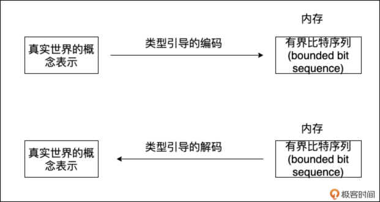
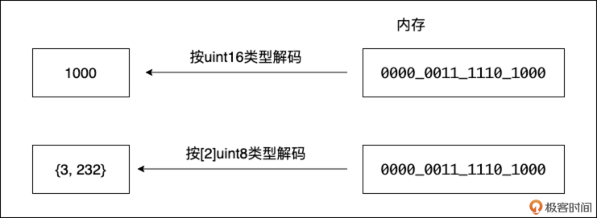
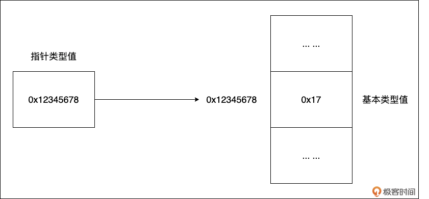
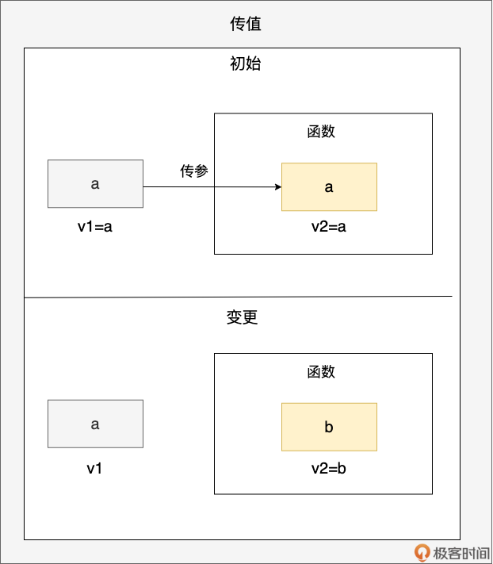
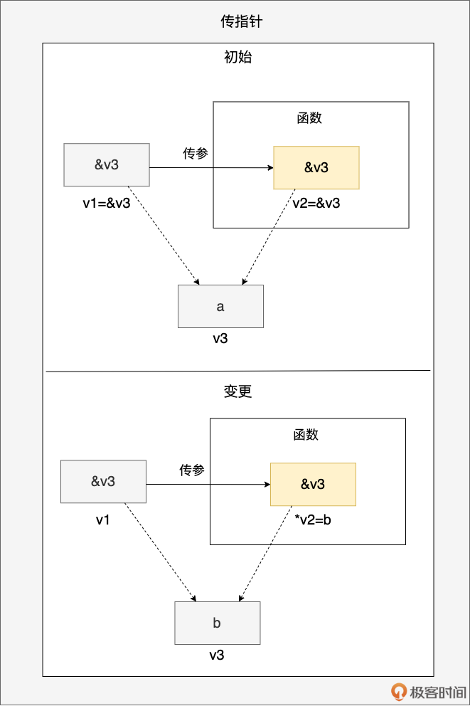
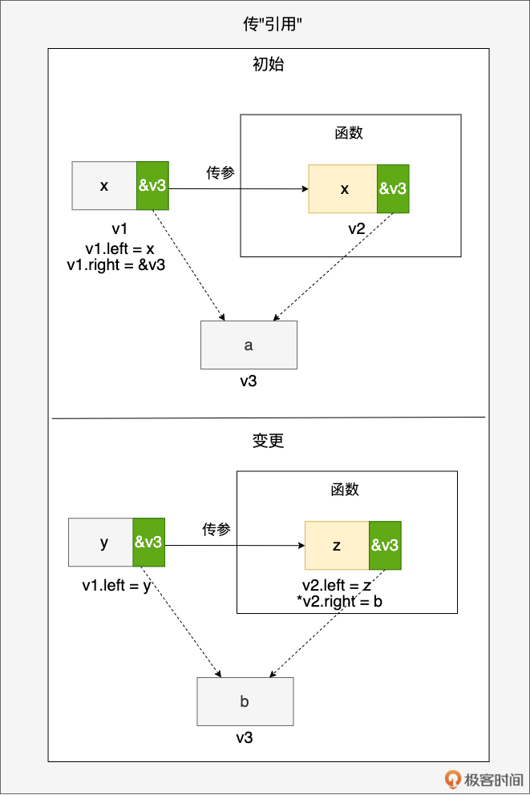

# 值传递vs指针传递：深入Go数据操作的底层逻辑与性能考量
你好，我是 Tony Bai。

从这一节课开始，我们将进入 Go 语法细节。作为 Go 进阶者，你一定已经用过值类型（如 int、float64 以及自定义结构体类型）和指针类型（如 \*int、\*T）。你可能也知道什么时候用值、什么时候用指针，会对程序的性能和行为产生影响。

但你是否真正思考过：

- 当我们说“值”时，在计算机内存层面，它到底意味着什么？
- Go 语言中“一切皆值”的理念，具体是如何体现的？
- Go 的函数参数传递，到底是“值传递”还是“引用传递”？为什么传递指针和传递切片看起来效果不同？
- 在性能和程序正确性之间，我们该如何明智地选择使用值还是指针？

这些问题看似基础，却直击 Go 数据操作的本质。 **不深入理解值与指针的底层机制，你可能只是“知其然”，但在面对性能瓶颈、内存问题或复杂的共享状态时，会“不知其所以然”**，难以写出真正高质量的 Go 代码。

这节课，我们就来彻底厘清这些概念，我们就将从计算机如何存储数据的底层原理出发，由浅入深、层层推进地讨论 Go 语言中的值类型、指针类型，以及它们在数据传递中的行为表现。同时也会介绍一些在使用值和指针时需要注意的事项。

掌握了这些，你对 Go 的数据操作将有更深刻的认识，为后续学习方法、接口、并发等打下坚实基础。

## 从计算机内存看“值”的本质

我们人类通过抽象来理解世界，比如数量、大小、颜色、文本。计算机要解决现实问题，也需要对这些概念进行表示。它如何做到的呢？答案是：通过内存中的 **有界比特序列（bounded bit sequence）**。



无论是整数 1000，还是字符串 “hello”，或者一个复杂的结构体，当它们存储在计算机内存中时，本质上都是一连串的 0 和 1。 **这串有界的 0 和 1，我们就可以称之为“一个值（value）”**。

而类型（type），则赋予了这段比特序列以含义。同一段比特序列，用不同的类型去“解码 （decode）”，会得到完全不同的结果。

比如，内存中有这样 16 个比特： `0000 0011 1110 1000`

- 如果用 uint16 类型去解释，它代表整数 1000。
- 如果用 \[2\]byte（长度为 2 的字节数组）类型去解释，它可能代表两个字节，数值分别是 3 和 232。



为了方便编程，高级语言引入了 **标识符（identifier）**（如变量名、常量名）来与内存地址建立关联。我们说变量持有（hold）一个值，实际上是指这个变量名对应着某个内存地址，该地址上存储着那个值的比特序列。

当然，也存在不与任何标识符绑定的值，我们称之为 **字面值（literal）**，常用于初始化变量或常量：

```
var a int = 17         // 用字面值17初始化变量a
s := "hello"           // 用字面值"hello"初始化变量s
const f float64 = 3.14 // 用字面值3.14初始化常量f
fmt.Println(42)        // 42是一个整型字面值

```

原生类型的字面值，可以简单理解为汇编中的立即数；而复杂类型（比如结构体）的字面值，则一般是临时存储在栈上的有界比特序列。

## “一切皆值”：Go 语言的核心理念

根据上面关于值的定义，我们可以认为， **在 Go 语言中，所有类型的实例都是以值的形式存在的**：包括基本类型，如整数、浮点数、布尔等，以及复杂的数据类型，如结构体、数组、切片、map、channel 等。

到这里你可能会问：“不对吧？我听说 map 和 channel 是引用类型，传递它们更像是传递指针？”别急，要解答这个问题，我们就要来先看看值的分类。

#### 值的分类：不止基本类型

Go 中的值大致可分为三类。

- **基本类型值**

基本类型是 Go 语言中最基础的数据类型，它们是直接由语言定义的。基本类型的值通常是简单的值，比如整数、浮点数、布尔值等。在 Go 语言中，基本类型的值可以进行各种运算和比较操作。

- **复合类型值**

复合类型则是由基本类型组成的更复杂的数据类型。它们的值由多个基本类型值或复合类型值组合而成，并且可以使用结构化的方式进行访问和操作。

在 Go 语言中，复合类型包括数组、切片、map、结构体、接口、channel 等多种类型。这些复合类型在不同的场景下都有不同的用途，可以用于表示不同的数据结构或者实现不同的算法。

注意，字符串在 Go 中是一个特殊的存在，从 Go 类型角度来看，它应该属于原生内置的基本类型，但从值的角度考虑，由于在运行时字符串类型表示为一个两字段的结构（这在《 [Go语言第一课](https://time.geekbang.org/column/intro/100093501)》专栏中有讲过，在后续的课程我们还会提到），因此，我们可将其归为 **复合类型值** 范畴。

- **指针类型值**

有一类值十分特殊，它自身是一个基本类型值，更准确的说是一个整型值， **但这个整型值的含义却是另外一个值所在内存单元的地址**。如下图所示：



我们看到：指针类型值为 0x12345678，这个值是另外一个内存块（值为0x17）的地址。指针类型值在 Go 语言以及 C、C++ 这一的静态语言中扮演着极其重要的角色。

现在我们可以回答前面的问题了： **map 和 channel 是值吗？**

**是的，它们是值。** 更准确地说，从 Go 运行时的角度看，一个 map 变量或 channel 变量，其本身存储的值是一个指针，这个指针指向了运行时在堆上分配的、用于实现 map 或 channel 功能的内部数据结构（比如哈希表、缓冲区等）。

所以， **当你传递一个 map 或 channel 变量时，你实际上是在按值传递这个指针**。这就是为什么在函数内部对 map 或 channel 进行操作（如添加键值对、发送接收数据）会影响到函数外部的原始变量——因为它们指向的是同一个底层的运行时数据结构。

#### 值的可变性：并非所有值都能修改

虽然从物理内存角度看，内存单元的数据都可以被改写，但在编程语言和操作系统层面，对值的可变性做了限制。

- **内存段限制**：操作系统将虚拟内存划分为不同段，如代码段（只读）、数据段、BSS 段、堆、栈等。存储在只读段（如代码段）的值是不可变的。
- **语言层面限制**
  - 常量（const）定义的值是不可变的。
  - 字符串（string）类型的值在 Go 中也是不可变的。尝试修改字符串内容会导致编译错误或创建新字符串。
  - 其他大部分类型（如 int、struct 的字段，slice 或 array 的元素）的值，如果它们不在只读内存段且不是常量，则是可变（mutable）的。

#### 指针：特殊的值，重要的工具

针对指针这类值，编程语言抽象出了一种类型： **指针类型**，写作 \*T。指针类型的变量与指针类型值绑定，它内部存储的是另外一个内存单元的地址。这样就衍生出通过指针读取和更新指针指向的值的操作方法：

```
var a int = 5 // 基础类型值
var p = &a    // p为指针类型变量(*int)，其值为变量a的地址。

println(*p)   // 通过指针读取其指向的变量a的值
*p = 15       // 通过指针更新其指向的变量a的值

```

当一个指针变量存储的地址是另外一个指针变量的地址时，我们就有了多级指针：

```
var x int = 1
var y int = 2
var p *int = &x   // p是指向变量x的指针
var q *int = &y   // q是指向变量y的指针
var pp **int = &p // pp是指向指针p的指针，即int**类型

```

可以通过下面的方式来访问和修改多级指针的指向：

```
fmt.Println(**pp) // 输出1，相当于两次间接访问
pp = &q
fmt.Println(**pp) // 输出2，相当于两次间接访问
**pp = 3         //  相当于y=3，即修改y的值为3
fmt.Println(y)     // 输出3

```

通过多级指针，我们可以实现对同一份数据的多层间接访问和操作。这在某些场景下很有用，最典型的，比如在函数中修改上层函数的局部指针变量的指向：

```
func changePointer(pp **int) {
    var nv = 20
    *pp = &nv
}

func main() {
    var v = 10
    var p = &v
    var pp = &p

    fmt.Println("Before:", **pp) // 输出 Before: 10

    changePointer(pp)

    fmt.Println("After:", **pp) // 输出 After: 20
}

```

需要注意的是，多级指针的使用会增加代码的复杂度，在实际编程中要根据需要适度使用，过度使用反而会降低代码的可读性。

指针更大的好处就在于传递开销低，且传递后，接收指针的函数/方法体中依然可以修改指针指向的内存单元的值。接下来，我们就来详细说一下值的传递。

## 剖析值传递与指针传递的机制

无论是赋值还是传参，Go 语言中所有值传递的方法都是值拷贝，也称为逐位拷贝（bitwise copy）。不过即便是值拷贝，也会带来三种不同效果，我们逐一来看一下。

1. **传值：你是你，我是我**



通过上面传值的示意图，我们看到值变量 v1（初值为 a）被传递到函数参数 v2 中，之后函数内 v2 的值更新为 b，但并不影响 v1，v1 的值仍为 a，用代码表示即为：

```
func foo(v2 int) {
    b := 2
    v2 = b // 传递后的v2独立更新为b
    _ = v2
}

func main() {
    a := 1
    v1 := a
    println(v1) // 1
    foo(v1)
    println(v1) // v1值仍为1
}

```

日常开发中，像传整型、浮点型、布尔值等都属于这种类型的传值。

2. **传指针：你是你，我是我，但我们共同指向他**



通过上面传指针的示意图，我们看到指针变量 v1（初值为 v3 的地址）被传递到函数参数 v2 中，v1 和 v2 拥有相同的指针值，都指向 v3 变量所在的内存块（初值为 a）。当函数通过 v2 指针解引用修改 v3 的值为 b 后，v1 也能感受到相同的变化。用代码表示即为：

```
func foo(v2 *int) {
    b := 2
    *v2 = b
}

func main() {
    a := 1
    v3 := a
    v1 := &v3
    println(*v1) // 1
    foo(v1)
    println(*v1) // 2
}

```

日常开发中，传递 \*T 指针类型变量，以及那些在 Go runtime 层面本质是一个指针的类型的实例时，比如 map、channel 等，都归属于这一类型。

3. **传“引用”：你是你，我是我，但我们有一部分共同指向他**



首先要注意，Go 语言规范中没有“引用类型”这一表述。其次，也不要将这里的“引用”与其他语言的“引用类型”相提并论。

这里传“引用”的效果是：传递前后的变量一部分是独立更新互不影响的，一部分则是有共同指向，相互影响的。示例图很好理解，这里就不赘述了。

**最典型的例子就是切片。** 当我们将切片传入函数后，函数内对切片的更新操作会影响到原切片，包括更新切片元素的值、向切片追加元素等。尤其是向切片追加（append）元素后，会导致传递前后的两个切片出现“不一致”，比如下面的示例：

```
func foo(sl []int) {
    sl = append(sl, 5)
    sl = append(sl, 6)
    fmt.Println(sl, len(sl), cap(sl)) // [1 2 3 4 5 6] 6 8
}

type SliceHeader struct {
    Data uintptr
    Len  int
    Cap  int
}

func main() {
    sl := make([]int, 4, 8)
    sl[0] = 1
    sl[1] = 2
    sl[2] = 3
    sl[3] = 4
    foo(sl)
    fmt.Println(sl, len(sl), cap(sl)) // [1 2 3 4] 4 8
    p0 := unsafe.SliceData(sl)
    p := (*[8]int)(unsafe.Pointer(p0))
    fmt.Println(*p) // [1 2 3 4 5 6 0 0]
}

```

我们看到：foo 函数实际上已经修改了 sl 对应的底层数组（见最后一行输出结果），但由于传递前的 sl 中的 Len 和 Cap 值并没有变更（如果你尚不清楚切片的 len 和 cap 是什么，可以重温一下《 [Go语言第一课](https://time.geekbang.org/column/intro/100093501)》专栏），因此出现了不一致的情况。

因此， **当切片作为函数参数时，我们通常会将修改后的切片作为返回值返回出来**，这样就能保持传递前后修改的一致，就像下面代码中那样：

```
func foo(sl []int) []int {
    sl = append(sl, 5)
    sl = append(sl, 6)
    fmt.Println(sl, len(sl), cap(sl)) // [1 2 3 4 5 6] 6 8
    return sl
}

type SliceHeader struct {
    Data uintptr
    Len  int
    Cap  int
}

func main() {
    sl := make([]int, 4, 8)
    sl[0] = 1
    sl[1] = 2
    sl[2] = 3
    sl[3] = 4
    sl = foo(sl)
    fmt.Println(sl, len(sl), cap(sl)) // [1 2 3 4 5 6] 6 8
}

```

这里之所以使用“引用”来形容这种效果，主要是像切片这样的类型与我们熟知的其他语言中的引用（reference）很像，它们都是以“值”的形态传递，但却能干着“指针”的活儿。

## 值 vs 指针：选择场景与注意事项

#### 零值：Go的默认与安全

Go 中，变量在声明但未显式初始化时，会被自动赋予其类型的零值。

- 数值类型： `0`
- 布尔类型： `false`
- 字符串类型： `""`（空字符串）
- 指针、接口、切片、map、channel、函数类型： `nil`
- 数组、结构体：每个元素或字段都是其类型的零值

零值机制保证了 Go 变量总是有个确定的初始状态，避免了未初始化变量带来的风险。

**注意**：对 `nil` 指针、 `nil` map、 `nil` slice 等进行解引用或访问操作通常会导致运行时 panic。使用前务必检查是否为 `nil`（或确保它们已被正确初始化）。

一个特殊用法是零长度数组 `[0]T`，它的实例不占用内存，常用来使结构体不可比较（因为函数类型不可比较）：

```
type NonComparable struct {
    _ [0]func() // 包含不可比较类型，使整个结构体不可比较
    Data int
}
// var nc1, nc2 NonComparable
// fmt.Println(nc1 == nc2) // 编译错误

```

#### 值的比较：并非都能“==”

不是所有 Go 类型都支持使用 == 或 != 运算符进行比较：

```
func main() {
    var sl1 []int
    var sl2 []int
    var m1 map[string]int
    var m2 map[string]int
    var f1 = func() {}
    var f2 = func() {}
    fmt.Println(sl1 == sl2) // invalid operation: sl1 == sl2 (slice can only be compared to nil)
    fmt.Println(sl1 != sl2) // invalid operation: sl1 != sl2 (slice can only be compared to nil)
    fmt.Println(m1 == m2) // invalid operation: m1 == m2 (map can only be compared to nil)
    fmt.Println(m1 != m2) // invalid operation: m1 != m2 (map can only be compared to nil)
    fmt.Println(f1 == f2) // invalid operation: f1 == f2 (func can only be compared to nil)
    fmt.Println(f1 != f2) // invalid operation: f1 != f2 (func can only be compared to nil)
}

```

Go 中的切片、map 和函数类型只支持与 nil 进行相等或不等比较。

针对除此之外的其他不同类型，Go 执行的比较操作也是不同的。

- 对于基本类型（如 int、float、bool 等）以及指针类型，只需要比较它们的值的二进制表示就可以了。
- 对于结构体类型（不包含不支持比较的类型的字段），需要逐一比较它们的每个字段。
- 对于数组类型（元素类型不是不可比较类型），需要逐一比较它们的每个元素。
- 对于接口类型，需要判断它们是否指向同一个动态类型以及动态值是否相等。

下面还有一些值比较的注意事项，你也要了解一下。

- 对于浮点数类型，不能使用 “==” 运算符进行比较相等性，因为浮点数的精度问题可能导致比较结果不正确，可以使用 math 包中的函数进行比较。
- 对于结构体和数组类型，如果其中包含不可比较的字段（如切片、map、函数等），则整个结构体和数组类型也是不可比较的。
- 对于切片类型，可以使用 reflect 包中的函数 DeepEqual 进行比较。
- 对于指针类型，需要注意空指针的情况，应该先判断指针是否为 nil，再进行比较。

#### 传值还是传指针：性能与语义的权衡

传值还是传指针是我们日常 Go 编程时经常需要考虑的一个问题。我总结了一下，选择传值还是传指针主要取决于以下三个因素：

1. **对象的大小**

如果对象的大小较小（例如一个简单的结构体或者基本类型值），建议使用传值的方式，因为这种情况下复制对象的开销相对较小。相反，如果对象的大小较大（例如一个庞大的结构体或者大的数组），建议使用传指针的方式，这样可以避免复制整个对象，从而节省内存和 CPU 开销。

```
// 传值示例
type SmallStruct struct {
    A int
    B bool
}

func updateValue(s SmallStruct) SmallStruct {
    s.A = 42
    s.B = true
    return s
}

// 传指针示例
type LargeStruct struct {
    Data [1024]byte
}

func updatePointer(s *LargeStruct) {
    for i := range s.Data {
        s.Data[i] = byte(i % 256)
    }
}

```

2. **对象的可变性**

如果需要在函数内部修改对象的值，则必须使用传指针的方式，其原因在前面讲解不同传值方式的效果时已经阐明了。如果使用传值的方式，函数内部对对象的修改将不会影响到原始对象。

3. **对象是否支持复制**

如果对象包含一些不支持或语义上不允许复制的字段（例如 sync.Mutex 等)，则必须使用传指针的方式，因为这些字段在复制时会导致编译错误或运行时的非预期结果。

上述的三个因素也同样适用于方法的 receiver 参数类型选择，但还有一个因素会制约 method receiver 的选型，那就是考虑 T 或 \*T 是否需要实现某个接口类型。关于 method receiver 的类型选择问题，我们会在后面的课程中有系统的讲解，这里就不赘述了。

总的来说，在选择传值还是传指针时，需要根据对象的大小、可变性和是否支持复制等因素进行权衡，合理选择可以提高程序的性能和可读性。

#### 类型转换与内存解释：unsafe的力量与风险

前面说过，值是一个“有界比特序列”，按照不同类型进行解码，得到的结果也是不同的。我们可以通过 unsafe.Pointer 来进行不同的解码。比如下面例子中，将一个 uint32 的值分别按 \[2\]uint16 和 \[4\]uint8 数组类型进行解码后的结果：

```
package main

import (
    "fmt"
    "unsafe"
)

func main() {
    var a uint32 = 0x12345678

    b := (*[2]uint16)(unsafe.Pointer(&a))
    c := (*[4]uint8)(unsafe.Pointer(&a))

    fmt.Println(*b) // [22136 4660]  按[2]uint16做内存解释
    fmt.Println(*c) // [120 86 52 18] 按[4]uint8做内存解释
}

```

**再次强调**：unsafe 包的使用非常危险，它打破了 Go 的类型安全，可能导致难以追踪的错误和程序崩溃。只应在绝对必要且完全理解其后果的情况下使用（通常在与 C 库交互或进行底层性能优化时）。

#### 深拷贝 vs 浅拷贝：复制的陷阱

在编码过程中，当我们复制一个对象时，会涉及到两种不同的复制方式：浅拷贝（Shallow Copy）和深拷贝（Deep Copy）。 **这两种方式的主要区别在于它们如何处理对象内部包含的指针（或引用）类型字段**。

浅拷贝只复制对象本身。如果对象内部包含指针，那么副本中的指针将与原始对象中的指针指向同一块内存地址。这意味着，如果通过副本修改了指针指向的数据，原始对象也会受到影响。

深拷贝则不同，它不仅复制对象本身，还会递归地复制对象内部所有指针指向的数据。深拷贝完成后，副本与原始对象是完全独立的，它们没有任何共享的内存。

我们来看一个示例：

```
package main

import "fmt"

type Address struct {
    City string
}

type Person struct {
    Name    string
    Age     int
    Address *Address // 指针类型字段
}

// DeepCopy 方法实现了 Person 类型的深拷贝
func (p Person) DeepCopy() Person {
    newPerson := p // 先复制值类型字段
    if p.Address != nil {
        newAddress := *p.Address // 复制指针指向的Address对象
        newPerson.Address = &newAddress //新对象指针指向新地址
    }
    return newPerson
}

func main() {
    // 浅拷贝示例
    p1 := Person{Name: "Alice", Age: 30, Address: &Address{City: "New York"}}
    p2 := p1        // 浅拷贝
    p2.Address.City = "Los Angeles"
    fmt.Println(p1.Address.City) // 输出 "Los Angeles"，p1也被修改了

    // 深拷贝示例
    p3 := Person{Name: "Bob", Age: 25, Address: &Address{City: "Chicago"}}
    p4 := p3.DeepCopy() // 深拷贝
    p4.Address.City = "Seattle"
    fmt.Println(p3.Address.City) // 输出 "Chicago"，p3未受影响
}

```

对于包含指针字段的类型，实现深拷贝和浅拷贝的方式有所不同。浅拷贝很简单，直接赋值即可。Go 会自动复制结构体中的所有字段，包括指针字段。但如前所述，这种复制只是指针值的复制，而不是指针指向的数据的复制。

**要实现深拷贝，则需要手动编写代码或使用第三方库。** 对于包含指针字段的结构体，一种常见的做法是定义一个 DeepCopy 方法，在该方法中创建新的指针，并复制指针指向的数据。

在这个例子中，Person 结构体包含一个 Address 类型的指针字段。针对该结构体类型变量的浅拷贝操作是直接赋值（p2 := p1），这样两个变量 p1 和 p2 中的指针类型字段 Address 指向同一个内存对象，当通过 p2 将 City 改为 “Los Angeles”，p1 中的 Adress.City 也会随之改变。

深拷贝则使用了自定义的 DeepCopy 方法，DeepCopy 首先复制了 Person 结构体中的值类型字段（Name 和 Age），然后检查 Address 指针是否为 nil。如果不为 nil，则创建一个新的 Address 对象，并复制原始 Address 对象的值，最后将新 Person 对象的 Address 字段指向这个新的 Address 对象。这样就实现了 Person 对象的深拷贝。

**在 Go 语言中，深拷贝有其特定的应用场景。** 由于 Go 中的赋值操作（包括函数参数传递）默认是浅拷贝，这在某些情况下可能会导致意料之外的副作用。

例如，当你希望修改一个对象的副本，但不希望影响原始对象时，或者当你需要将一个对象的状态保存为一个快照，以备后续恢复时，都需要用到深拷贝。另外，在并发编程中，为了避免多个 goroutine 之间的数据竞争，通常也需要对共享数据进行深拷贝。

不过即便如此，某些情况下，手工实现一个 DeepCopy 方法也是很难的，甚至是不可能的，比如当有循环引用或某些类型不支持拷贝（比如 sync.Mutex）的情况时。

## 小结

这一讲，我们从底层内存表示出发，重新审视了 Go 语言中看似基础却至关重要的“ **值**”与“ **指针**”。现在，我们来梳理一下核心要点。

1. **值的本质**：内存中的一段有界比特序列，其含义由类型决定。

2. **Go 核心理念**：一切皆值。所有类型实例（包括 map、channel 等）在内存中都以值的形式存在。map/channel 变量的值是指向运行时内部数据结构的指针。

3. **指针类型**：存储其他值内存地址的特殊值。通过 & 获取地址，通过解引用访问/修改指向的值。

4. **唯一传递方式**：Go 只有值传递（按位拷贝）。

5. **不同传递效果源于拷贝内容**


   a. 拷贝基本类型/无指针 struct -> 纯值传递效果（隔离）。


   b. 拷贝指针值 -> 指针传递效果（共享修改）。


   c. 拷贝含指针的结构（如 slice header） -> 部分共享效果（底层数据共享，结构本身隔离）。

6. **实用考量**


   a. 理解零值保证了变量的确定性。


   b. 掌握值比较规则，知道哪些类型可比，哪些不可比。


   c. 传值 vs 传指针需权衡数据大小（性能）、修改需求（语义）和拷贝语义。


   d. 深拷贝 vs 浅拷贝在处理包含指针的对象复制时非常关键。


深入理解值和指针，以及 Go 唯一的值传递机制，是编写出高效、正确、符合 Go 语言习惯代码的关键一步。它能帮助你避免常见的内存共享错误，做出更优的性能决策，并为你理解后续更复杂的概念（如方法接收者、接口实现、并发内存模型）打下坚实的基础。

## 思考题

结合本节课对值传递三种效果的讨论（纯值效果、指针效果、切片效果），请你动手编写一个 Go 程序示例，要求：

1. 定义一个函数 `modifyValues`。
2. 在这个函数内部，尝试修改传入的三个不同类型的参数：一个 **int**，一个 **\*int**（指向一个int），一个 **\[\]int**（切片）。
3. 在 `main` 函数中，调用 `modifyValues`，并打印调用前后这三个原始变量的值（对于指针，打印指向的值；对于切片，打印切片内容、长度、容量），清晰地展示出这三种传递效果的不同。

欢迎将你的代码示例和观察结果分享在留言区！我是 Tony Bai，我们下节课见。
