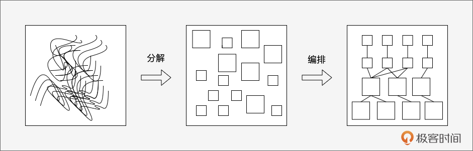
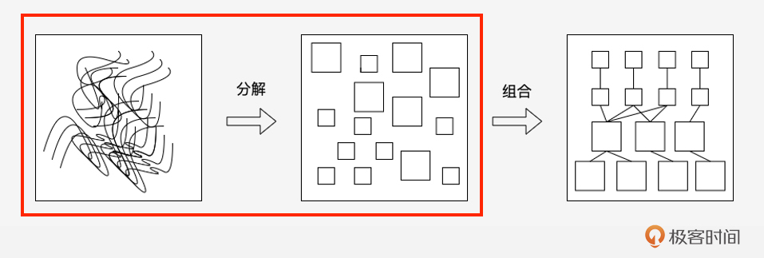
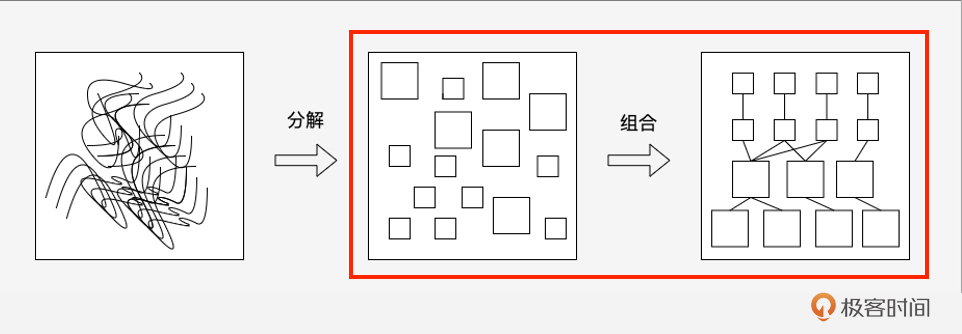
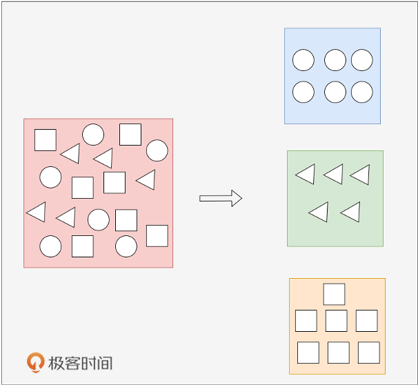
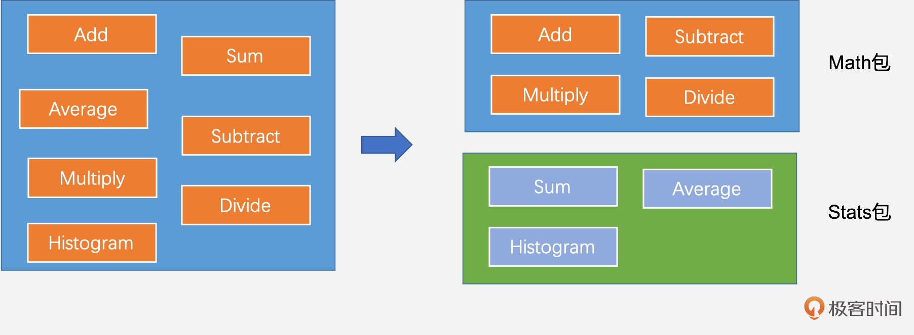
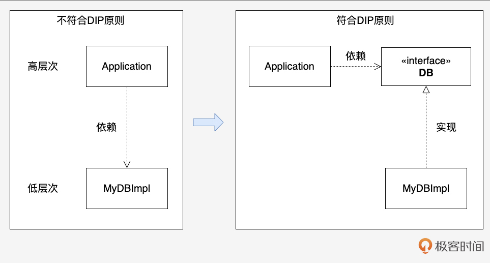
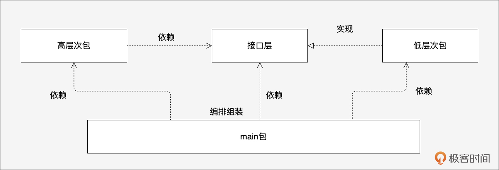

# 包设计：如何实践高内聚、低耦合与SOLID原则？
你好！我是Tony Bai。

上一节课我们讨论了宏观的项目布局，为代码找到了安放的“社区”和“街道”。但仅仅有好的布局还不够，项目的真正活力来自于构成它的基本单元——包（package）。可以说， **Go应用的本质就是一组设计良好、协同工作的包的集合**。如何设计出职责清晰、依赖合理、易于维护的包，是衡量Go代码质量的关键，也是我们设计先行模块的核心议题。

你可能会问：

- Go的包在设计中到底扮演什么角色？仅仅是代码的容器吗？

- 人人都说“高内聚、低耦合”，在Go包设计中，这具体怎么落地？

- 经典的SOLID设计原则，对于没有继承、推崇组合的Go，还有效吗？如何用Go的方式实践它们？

- 有哪些常见的包设计“陷阱”或“反模式”是我们必须警惕和避免的？


**不理解Go包设计的核心原则，可能会让我们创建出职责混乱、依赖纠缠、难以测试和扩展的“意大利面条式”代码。** 掌握良好的包设计实践，是编写出地道、可维护、高质量Go代码的必经之路。

这节课，我们就来深入探讨Go包设计的艺术与科学。在我们深入包设计原则之前，我们先来重新认识Go包。

## Go包的认知：基本的功能、编译和设计单元

我们知道Go包是Go编程语言中的一个重要概念，它是一组相关的Go源代码文件。并且，在Go中，每个Go源文件都必须属于一个包。但Go包又不仅仅是一个存放 `.go` 文件的目录，它在Go语言中承载着多重关键角色。

### Go包是基本功能单元

Go包是一个逻辑上独立的单元，是Go的基本功能单元，用来做功能和职责边界的划分。比如标准库的 `fmt` 包负责格式化I/O， `net/http` 包负责HTTP客户端和服务端实现。一个设计良好的包，其名称（ `pkgname`）和提供的API（ `pkgname.PublicSymbol`）应该能清晰地反映它所承担的功能。这些基本功能单元的累加就构成了Go应用，因此Go应用的本质就是一组Go包的集合。

Go包这种功能独立的单元为Go开发者提供了“封装”和复用的便利。在Go中，Go包也是代码复用的基本单元，被用来管理和组织代码，上一节课 [《Go项目布局》](https://time.geekbang.org/column/article/883662?utm_campaign=geektime_search&utm_content=geektime_search&utm_medium=geektime_search&utm_source=geektime_search&utm_term=geektime_search) 本质上就是安排Go包的位置，使得代码更易于维护和重用。

### Go包是基本编译单元

Go包还是编译时的最小单位。也就是说，Go编译器编译代码时会以包为单位进行编译，而不是以文件为单位。这意味着一个包中的所有源文件都将被编译成一个单独的目标文件（通常是 `.a` 归档文件），而不是多个目标文件。

使用包而不是文件作为编译单元，有助于提高编译效率和管理依赖关系。Go编译速度快是包这种设计“先进性”的一个表现，即便每次编译都是从零开始。Go编译速度快的几个原因与以包作为编译单元是密不可分的，具体体现在Go源文件在开头处显式地列出所有依赖包，编译器不必读取整个文件就可确定依赖包列表；Go包之间不能存在循环依赖，由于无环，包可以被单独编译，也可以并行编译；已编译的Go包的目标文件中记录了其所依赖包的导出符号信息。Go编译器在读取该目标文件时不需进一步读取其依赖包的目标文件。

### Go包是基本设计单元

这个世界越来越复杂，软件系统同样变得日益复杂。无论你是什么编程语言的开发者，我们要面对的都是如何驯服这种复杂性。到目前为止，我们驯服这种复杂性的思路还很初级，无非是 **对复杂性进行分解、分解、分解，并按照我们更容易理解的方式重新组合**。



Go包是基本功能单元，对于Go开发者，我们要将复杂性分解为一个个包，然后以一种合理的方式将包组合在一起以实现我们要的系统，因此Go包也是我们面对一个系统时的基本设计单元。我们不仅要设计每个包肩负的职责，还要设计包与包之间的关系，以及每个包对外暴露的API（接口）。可以说， **Go的系统设计很大程度上就是面向包进行的设计**。

理解了包的这三重身份，我们就能更好地把握包设计的重要性，以及后续原则的出发点。接下来，我们就来看看Go包的设计思路。

## Go包的设计思路：自然内聚性与最小耦合

即便你没写过Go程序，作为程序员你也应该知道“高内聚、低耦合”这个原则在软件系统设计中的分量。

以上面的复杂性分解和组合的示意图为例，高内聚是指导复杂性分解的原则：



而低耦合则是指导分解后的模块重新组合的原则：



这里我们就以这个原则作为“抓手”，展开看看Go包的设计思路。

高内聚、低耦合这个顶层原则，适用于所有编程语言的系统设计。但落到Go包设计上面，具体如何体现高内聚与低耦合呢？我们继续往下看。

### 功能选桶：包的自然内聚性

面对一个复杂系统，我们通常会做一些系统分析，比如用领域驱动设计的方式从需求中挖掘出一堆术语、事件、命令等（即便你不懂领域设计的纯正方法，你的实际操作过程也或多或少与领域设计的内容重叠）。之后，通常会分层、划分服务，每个服务又要划分模块或包。

在服务这一层次上哪些功能放到哪个包里呢？这个过程我称之为“功能选桶”，如下面示意图。



这让我想到了和孩子一起学习动物分类时的书中题目：

```plain
有这样一组动物：老虎、狮子、海马、大雁、熊猫、黄鹂、鲸鱼，这些动物能分为哪几个类别呢?

```

一个稍稍被启蒙了的孩子都会给出这样的分类：

```plain
陆地动物：老虎、狮子、熊猫
海洋动物：海马、鲸鱼
天空动物：大雁、黄鹂

```

而另外一个稍有一些生物学入门知识的大点的孩子可能会给出下面的分类：

```plain
哺乳动物：老虎、狮子、熊猫、鲸鱼
卵生动物：海马、大雁、黄鹂

```

无论哪种，这些分类都是基于动物行为特征的自然结合。第一种似乎更直观自然，第二种则需要有更“专业”的知识（领域知识）。Go包的“功能选桶”其实是一个道理，相关功能自然结合到一个包中，保证这个包的内聚性。

再比如这几个功能函数：Add、Subtract、Multiply、Divide、Sum、Average、Histogram，我们如何为它们选桶呢？

一种不那么内聚的作法是将上述所有函数都放入math包；而更自然内聚一些的作法则是将Add、Subtract、Multiply、Divide放入math包，将Sum、Average、Histogram等放入stats包（statistics，统计学），如下图所示。



此外， **好的包名是内聚性的关键信号**：一个内聚性好的包，通常能用一个 **简洁、准确、具有描述性** 的名字来概括其职责。标准库的 `net/http`、 `os/exec`、 `encoding/json` 都是好例子。反之，像 `utils`、 `common`、 `helpers` 和 `shared` 这样的包名，往往是 **缺乏内聚性、职责不清** 的信号，极易变成代码的“垃圾抽屉”，是需要极力避免的反模式。

此外，如果一个功能只被一个包使用，最好就近放在那个包里（可以不导出）。如果被多个包使用，我们要思考它真正属于哪个功能领域，并为其创建有意义的新包。

在进行“功能选桶”时，越符合我们对现实世界或问题领域的自然理解，划分出的包就越可能具有高内聚性，可读性和可理解性大概率就越好。

### 包间关系：最小耦合

功能选桶之后，我们再来看包与包之间的关系，通常我们称这种关系称为耦合。

用白话来理解耦合就是：当a变化时，b受到影响并随之变化，则说b与a之间存在耦合，即b依赖a。a是引发b变化的一个原因。

程序员都知道： **一种理想的耦合情况是正交，即你变你自变，我岿然不动。但现实中这很难达到，我们应该追求的是尽可能地降低包与包间的耦合**。

在包依赖层面，Go强制要求不能存在循环依赖，即 **Go包之间的耦合一定是有向无环的**，这一定层度上也能帮助Go包之间降低耦合。

要降低包与包之间的耦合，我们首先要了解Go包间的最低耦合关系是什么。

在代码层面最低的耦合是接口耦合，在Go中，接口的实现是隐式的，即a包实现b包中定义的接口时是不需要显式导入b包的，我们可以在c包中完成对a包与b包的组装，这样c包依赖a包和b包，但a包与b包之间没有任何耦合。

那么负责组装a包与b包的c包能否在代码层面消除掉对a和b的依赖呢？这个就很难了。我们可以使用依赖注入技术，来消除在代码层面手动基于依赖进行初始化或创建时的复杂性，不过依赖注入技术也有“门槛”，它会让你的代码不那么直观，代码的可读性和可理解性会下降。

> 注：依赖注入在Go中并非是一种惯用法。Google开源了像 [wire](https://github.com/google/wire) 这样的依赖注入框架（通过代码生成而实现的编译期依赖注入），更多是为了解决掉内部大型Go项目初始化时各种创建动作的复杂性。

我们可以参考软件界用于降低代码耦合的原则，比如由Robert C. Martin（通常被称为“Uncle Bob”）在 [《敏捷软件开发》](https://book.douban.com/subject/1140457/) 一书中提出的，旨在帮助开发人员设计更加灵活、可扩展和可维护的软件系统的SOLID敏捷设计原则。那么，这些原则如何应用在Go上，或者在Go中如何体现呢？我们接着来看。

## SOLID原则：在Go包设计中的应用

SOLID是由Robert C. Martin提出的五个面向对象设计原则的首字母缩写。虽然Go并非传统OO语言，但这些原则背后蕴含的设计思想对于编写高质量、可维护的Go代码（尤其是包的设计）仍然具有重要的指导意义。我们需要结合Go的特性来理解和应用它们。下面我们就逐一看一下如何将SOLID原则应用在Go包设计方面。

### 单一职责原则（SRP）

> 对于一个类而言，应该仅有一个原因会引起它的变化。在SRP的语境中，我们把职责定义为“变化的原因”（a reason for change）。如果你有超过一个的动机去改变一个类，那么这个类就具有多种职责。——《敏捷软件开发》

就像Uncle Bob在书中说的那样：“如果你有超过一个的动机去改变一个类，那么这个类就具有多种职责。有时，我们很难注意到这一点。我们习惯于以组（group）的形式去考虑职责”。

在Go包这一层次上，SRP更多体现在功能内聚上，就像前面举的math包和stats包的例子。

再比如我们有一个图形库，它可以绘制不同类型的图形，如矩形、圆形、三角形等。我们可能会定义一个graph包，里面定义了Graphics类型，它具有Draw方法，用于绘制图形。在不遵循SRP的情况下，graph包Graphics类型可能会包含绘制各种类型图形的代码，这会导致类不仅包含多个职责，而且功能不够内聚。

在遵循SRP的情况下，我们可以在graph包中定义Graphics接口，该接口具有Draw方法，然后在rectangle、circle、triangle包中分别定义Graphics接口的实现：Rectangle类型、Circle类型与Triangle类型：

```plain
graph/
    - graph.go // 定义Graphics接口
    - rectangle/
        - rectangle.go // 定义Rectangle类型和其Draw方法
    - circle/
        - circle.go // 定义Circle类型和其Draw方法
    - triangle/
        - triangle.go // 定义Triangle类型和其Draw方法

```

这样，每个包都只负责一个图形类型，职责更加单一，也更容易维护和扩展。

### 开放-关闭原则（OCP）

> 软件实体（类、模块、方法等）应该对扩展开放，但是对修改关闭。——《敏捷软件开发》

还以上面的graph等包为例，OCP原则可以体现在两方面。

首先是扩展Graphics接口的实现。我们无法修改graph.go中的Graphics接口，但如果你要添加一个square包，定义Square类型并实现Draw方法，那么我们可以在graph包下面添加一个square包，这个包和circle等包位于同等位置，都实现了graph包的Draw方法。这样我们便很容易地扩展出一种新的“绘制正方形”的新功能。

其次是基于Graphics接口的组合。我们无法修改graph.go中的Graphics接口，但是我们可以基于graph.Graphics接口去组合出其他具有更多职责的接口或非接口类型，就像io包中的Reader、Writer接口被组合到ReaderCloser、ReadWriteCloser中一样。

OCP原则的关键是抽象，在Go中建立包与包之间关系抽象的最佳方法就是建立接口类型。前面说过，通过接口的耦合是最低的包间耦合，因此采用OCP原则对于降低包间耦合具有重要意义。

不过，Bob大叔在书中也说了：“遵循OCP的代价也是昂贵的。创建恰当的抽象是要花费时间和精力的。那些抽象也增加了软件设计的复杂性，开发人员有能力处理的抽象数量是有限的”。OCP原则的应用应该被限定在最可能发生的变化上。

### 里氏替换原则（LSP）

> 对于里氏替换原则（LSP），可以如此解释：子类型（subtype）必须能够替换掉它们的基类（base type）。——《敏捷软件开发》

Bob大叔在讲解LSP原则时使用的语言是C++和Java，对于这两种静态类型的OO语言来说，支持抽象和多态的关键机制之一是继承（inheritance）。也只有在继承的概念之上，采用基类和子类之分。

不过Go并非传统意义上的OO语言，它没有继承，没有类型层次体系。即便没有这些，Go也不乏抽象表达能力，最直接的就是接口这个行为的集合。

这样里氏替换原则（LSP）在Go中就可以如此解释： **接口I的所有实现都是可以相互替代的，因为它们履行了同样的契约**。

### 接口隔离原则（ISP）

> 客户端程序不应该被迫依赖于它们不需要的方法。——《敏捷软件开发》

这在体现Go包与包关系层面不是那么明显，方法已经告诉你这种耦合是接口耦合，但究竟用的是什么样的接口呢？“胖接口”，不是！我们需要刚刚好，不多不少的接口。

来看一个例子，我们有如下一些接口定义：

```plain
type Printer interface {
    Print()
}

type Scanner interface {
    Scan()
}

type PrintSleeper interface {
    Printer
    Sleep()
}

type PrintScanSleeper interface {
    Printer
    Scanner
    Sleep()
}

```

现在我们要实现一个打印机打印的API，我们最初的设计是：

```plain
func Print(p PrintScanSleeper, data []byte) error {
}

```

在这个设计中，Print函数依赖的是PrintScanSleeper，这意味着传入的合法参数类型必须要实现Print、Scan和Sleep三个方法，但我们的函数只是为了实现打印，它不需要调用Scanner的Scan方法，根据ISP原则，我们不应该强迫Print函数依赖它们本不需要的方法，于是第二版设计如下：

```plain
func Print(p Printer, data []byte) error {
}

```

这似乎无懈可击。但常识告诉我们，每次打印结束后，都需要让打印机休眠，显然仅依赖Printer接口又缺少了点东西，那么最终版的设计如下：

```plain
func Print(p PrintSleeper, data []byte) error {
}

```

对ISP原则的白话阐述就是：“不多不少，刚刚好”！

### 依赖倒置原则（DIP）

> 高层次的模块不应该依赖低层次的模块。两者都应该依赖抽象。抽象不应该依赖于细节，细节应该依赖于抽象。——《敏捷软件开发》

如果你的代码符合上面几条原则的话，那么到这里，你的代码很大可能也是符合DIP原则的。

一提到“依赖抽象”，你肯定想到的还是接口。在Go中，接口是抽象的主要代名词。

在包与包的关系层面上，DIP原则表现为：高层次包依赖接口，低层次的包实现接口。示例如下图：



因此，在同等条件下，采用DIP原则设计良好的Go程序的包导入图应该是宽而平的，而不是高而窄的：



应用SOLID原则能帮助我们设计出更灵活、可维护、易于测试的Go包结构。

## 单包内部的设计要点

除了包与包之间的关系，单个包内部的设计也同样重要。我们来讲一些关键点。

### 包名

我们在引用某个包的导出标识符时使用的是：

```plain
pkgname.XXX

```

由此可见包名的重要性，它可以理解为 **一个包的API的重要组成部分**，因此 **包设计的第一步就是要为包起个好名字。**

给Go包起名字首先要注意简单达意，比如标准库的fmt、io、os等，并且包名按惯例应该与其目录名一致。同一工程内部包名最好是唯一的，避免工程内部出现名字碰撞。如果为了简洁而失去了包名的内聚性的内涵（功能和作用），比如utils、common这些名字基本无法表达包究竟担负的职责，那么莫不如将包名加长一些，点缀上能达意的单词，比如printutil而不仅仅是util。

### 最小化暴露表面积

这是最重要的原则之一。包应该只导出（Export）那些确实需要被外部使用的类型、函数、常量和变量（通常首字母大写）。所有仅供包内部使用的辅助类型、函数或状态，都应该保持非导出（unexported，首字母小写）。这样做的好处是：

- **封装**：隐藏了实现细节，使得包的内部实现可以自由修改而不影响外部使用者（只要公共API不变）。

- **减少耦合**：外部代码只能依赖于稳定的公共API，而不是脆弱的内部实现。

- **API清晰**：公共API更少、更专注，更容易理解和使用。


```go
package calculator

import "errors"

// Add 是公共 API，需要导出
func Add(a, b int) int {
    return add(a, b) // 调用内部非导出函数
}

// add 是内部实现细节，不需要导出
func add(a, b int) int {
    // ... 可能有一些内部逻辑 ...
    return a + b
}

var errInternal = errors.New("internal error") // 非导出错误变量

```

### 避免包级状态

包级别的变量（尤其是可导出的）本质上是全局变量。全局状态会带来诸多问题：

- **隐藏依赖**：函数的行为可能隐式地依赖于这些包级变量的状态，使得代码难以理解和推理。

- **测试困难**：测试时需要管理和重置这些全局状态，测试用例之间可能相互影响。

- **并发问题**：如果多个goroutine并发地读写包级变量而没有适当的同步，会导致数据竞争。


```go
package config

// 反模式：使用包级变量存储配置
var DefaultConfig = map[string]string{"timeout": "10s"}
func Get(key string) string { return DefaultConfig[key] } // 隐式依赖全局状态

// 推荐模式：通过结构体封装状态，显式传递
type Config struct { settings map[string]string; mu sync.RWMutex }
func NewConfig() *Config { /* ... */ }
func (c *Config) Get(key string) string { c.mu.RLock(); defer c.mu.RUnlock(); return c.settings[key] }
// 使用者需要显式地创建和传递 Config 实例

```

尽量将状态封装在结构体中，并通过函数参数或方法接收者来传递。

### 接口定义位置再讨论

前面在ISP和DIP中提到，接口定义通常应靠近消费者（Consumer）。即，如果包 `A` 需要包 `B` 提供的某种能力，那么定义这个能力的接口最好放在包 `A` 中，然后让包 `B` 实现它。这样做的好处是：

- 包 `A` 只依赖于自己定义的、满足自身最小需求的接口，符合ISP。

- 避免了包 `B` 为了被 `A` 使用而反过来依赖 `A`（如果接口定义在A中）。

- 使得包 `B` 可以被更多不知道彼此存在的消费者使用（只要它们定义了相似需求的接口）。


当然，对于非常通用的、标准化的接口（如 `io.Reader`、 `http.Handler`），将它们定义在标准库或共享的基础库中是完全合理的。

### main包应尽可能简洁

在Go中，main包是特殊的包，用于定义程序的入口函数main。在Go中，main函数应该尽可能简洁，它应该只负责装配其他包，调用其他函数或模块，不应该包含过多的代码逻辑。这样可以提高代码的可读性和可维护性。如果要对main函数进行单测的话，那么可以将main函数的逻辑放置到另外一个函数中，比如run，然后对run函数进行详尽的测试。

## 避免包设计的常见误区

最后，我们再总结一下除了前面提到的之外，还需要避免的一些包设计误区。

1. **为了测试而扭曲设计**：虽然可测试性很重要，但不应过度。为每个结构体都创建接口只为了方便Mock，可能会引入不必要的抽象，使生产代码更复杂。应优先考虑其他测试策略（如表驱动测试、测试辅助函数、使用真实依赖的集成测试等），仅在确实需要Mock复杂依赖或外部系统时才引入接口。

2. **忽略包的循环依赖**：再次强调，Go编译器禁止循环依赖。遇到此错误时，必须从结构上解决，而不是试图绕过。这通常意味着需要重新审视包的职责划分，或者提取公共依赖到新的包中，或者使用接口实现依赖倒置。


## 小结

包是Go语言的基石，良好的包设计是构建高质量Go应用的关键。这一节课，我们深入探讨了Go包设计的核心原则与实践。

1. **Go包的多重身份**：它是功能单元（封装职责）、编译单元（独立编译）和设计单元（组织结构）。

2. **自然内聚性**：设计包时应追求高内聚，将功能上紧密相关、服务于单一目的的代码组织在一起。好的包名是内聚性的直接体现，警惕 `utils`、 `common` 等“大杂烩”包。

3. **SOLID原则在Go中的应用**：虽然源于OO，但SOLID原则对Go包设计极具指导意义，主要通过接口来实践 OCP、LSP、ISP、DIP，通过单一职责来指导包的划分。

4. **单包内部的设计要点**：强调最小化暴露表面积以实现封装，避免包级状态以降低耦合和提高可测试性，并再次讨论了接口定义的位置以及main包的设计原则。

5. **避免常见误区**：警惕为了测试而过度设计、用技巧绕过循环依赖等问题。


最终，优秀的Go包设计并非遵循某个僵化的模板，而是理解这些原则背后的思想，并结合项目的具体需求，做出务实、简洁、灵活的决策。目标是创建出职责清晰、依赖合理、易于理解、测试和维护的包结构，支撑起整个应用的健康发展。

## 思考题

假设你在开发一个项目，需要一个处理配置加载的功能。配置可能来自多种来源：JSON文件、YAML文件、环境变量、甚至是远程配置中心。你希望提供一个统一的方式来读取这些配置项。

你会如何设计相关的包和接口来实现这个功能，并体现出本节课讨论的高内聚、低耦合以及SOLID原则，特别是OCP和DIP（可以简述包的划分、核心接口的设计以及它们之间的关系）？

欢迎在评论区分享你的设计思路！我是Tony Bai，我们下节课见。
