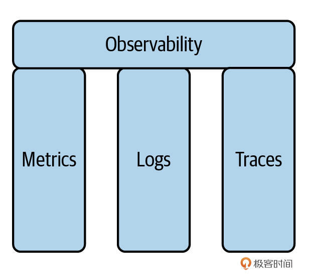

# 可观测性：Metrics、Logging、Tracing，让你的Go服务不再是黑盒（上）
你好，我是Tony Bai。

在前面的几节课中，我们已经为Go应用打下了坚实的“地基”和“主体结构”。我们学习了如何构建一个健壮的应用骨架，使其具备清晰的初始化流程、合理的组件编排和优雅的退出机制。我们还深入探讨了支撑应用运行的核心组件，包括如何进行灵活的配置管理、如何实现结构化的日志记录，以及在需要时如何设计可扩展的插件化架构。

可以说，我们的Go应用现在已经能够按照预期逻辑正确地“运转”起来了。但是，一个仅仅能“正确运转”的应用，距离能让我们在生产环境中安心运维、快速响应问题的服务，还缺少了非常关键的一环。想象一下，应用上线后：

- 我们如何知道它当前的健康状况如何？处理请求的速率是多少？响应延迟是否在可接受范围内？CPU和内存等资源消耗是否正常？

- 当用户报告问题，或者某个功能表现异常时，我们如何才能快速定位到问题的具体环节或错误信息？

- 如果应用由多个微服务组成（或者即使是单体应用，其内部调用链路也可能很复杂），一个请求在系统中流转的完整路径是怎样的？性能瓶颈又潜藏在哪一步？

传统的、仅靠查看零散的应用日志或依赖基本的系统监控（如top命令看CPU），在面对现代应用的复杂性和对高可用、高性能的要求时，已经显得捉襟见肘。我们需要一套更系统、更深入的方法来“观测”我们的应用——这就是可观测性（Observability）。

**可观测性，简单来说就是我们能够从系统外部产生的信号，如日志、指标、追踪数据（tracing）中，推断和理解其内部状态、行为和性能的能力。** 它不仅仅是“监控”（Monitoring）的简单升级，更是一种主动的、探索式的系统理解能力，是保障现代应用（尤其是云原生和分布式应用）稳定、高效运行的基石。一个具有良好可观测性的系统，能帮助我们自信地回答关于系统“正在发生什么”以及“为什么会这样发生”的任意问题。

接下来的三节课，我们会一起为我们的Go服务构建起强大的“感知系统”。具体来说，我们将：

- 探讨云原生时代为何可观测性如此重要，以及它是如何从传统监控演进而来，其核心支柱又是什么。

- 深入Metrics、Logging和Tracing这三大支柱在Go生态中的主流技术栈和实践。

- 三大支柱如何整合，以及可观测性数据采集中常见的Push与Pull模型，以及展望eBPF技术为Go应用可观测性带来的革命性影响。

在深入具体的技术栈之前，我们首先需要理解为何在当今的云原生时代，可观测性变得如此不可或缺，以及它与传统的“监控”有何不同。

## 为何云原生应用更需要可观测性？

云原生架构以其微服务、容器化、不可变基础设施、声明式API和动态调度等特性，为我们带来了前所未有的敏捷性、弹性和可扩展性。但与此同时，这些特性也显著增加了系统的复杂性，比如说：

- 组件数量激增：一个单体应用可能被拆分为数十甚至数百个微服务，每个服务可能有多个实例运行在不同的容器中。

- 交互路径复杂：用户的一个请求可能需要跨越多个微服务才能完成，服务间的依赖关系错综复杂。

- 动态性与短暂性：容器和Pod的生命周期可能很短，它们会被动态地创建、销毁和迁移。IP地址和实例标识不再固定。

- 故障模式多样化：问题的根源可能在任何一个服务、任何一个实例、网络层面，甚至是编排平台自身。

在这样的背景下，像预先定义好要监控的关键指标，搭建固定的仪表盘，当指标超过阈值时发出告警这样的传统的监控方法虽然仍然有用，但往往不足以应对。因为我们很难预知所有可能发生的故障模式，也很难通过有限的仪表盘快速定位未知问题的根源。

云原生应用需要的是一种更深层次的、能够主动探索和理解系统内部状态的能力，这就是可观测性。要理解可观测性的真正含义及其与我们熟知的“监控”之间的关系，我们需要先明确它们各自的侧重点。

## 可观测性的演进与核心支柱

可观测性并非一个全新的概念，它源于控制理论，指的是系统可以由其外部输出推断其内部状态的程度。在软件领域，我们可以将其通俗地理解为：我们能够多好地理解和解释我们系统的行为，仅仅通过观察其外部产生的信号（如日志、指标、追踪数据）。

### 从“监控”到“可观测性”的视角转变

长久以来，“监控”是我们保障系统稳定运行的主要手段。但随着系统复杂性的指数级增长，仅仅“监控”已知问题已显不足，我们需要一种更主动、更深入的洞察能力，这便是“可观测性”所倡导的。

**监控的核心理念更侧重于“我们知道要注意什么，并据此进行观察”。** 它通常是基于我们对系统已有认知和历史经验，预先定义好一系列关键性能指标（KPIs）、健康检查项和告警规则。当系统运行时，我们通过仪表盘跟踪这些已知指标，当指标偏离正常范围或触发告警阈值时，我们就知道系统可能出现了已知类型的问题。监控告诉我们系统是否在按照我们预期的方式工作，以及何时偏离了这个预期。

**与监控相比，可观测性更强调的是“我们具备探索和理解任何可能发生的情况的能力，即使是我们之前未曾预料到的未知问题”。** 它不仅仅是收集数据，更在于这些数据是否足够丰富、是否能够被灵活地查询和关联，从而允许我们提出任意的“为什么”和“怎么样”的问题，并能从中找到答案。可观测性使我们能够深入调试、诊断和理解那些复杂的、新兴的，甚至从未见过的系统行为。可以说，可观测性是构建和运维高度动态、大规模分布式系统的坚实基础，而监控则是建立在可观测性数据之上的一种具体应用。

理解了这种视角上的转变，我们接下来需要明确构成一个可观测系统的“外部信号”，即我们赖以推断内部状态的遥测数据主要包含哪些核心部分。

### 可观测性的三大支柱

业界普遍认为，一个完善的可观测性体系主要由以下三种不同类型但又相互关联的遥测数据（Telemetry Data）构成，它们从不同维度为我们描绘了系统的运行画像：

首先来看Metrics（度量/指标）。 **Metrics是可聚合的、数值型的时间序列数据，它们通常在固定的时间间隔内被收集，主要作用是反映系统在一段时间内的宏观状态、性能表现和变化趋势。** 例如，一个Web服务的每秒请求数（QPS）、API请求的平均延迟和P99延迟、错误请求的百分比、CPU和内存的平均使用率、消息队列的当前长度、数据库的活跃连接数等。

指标数据通常是数字，这使得它们非常易于进行数学运算（如求和、平均、百分位计算、速率计算）和长期存储。它们是构建监控仪表盘，进行趋势分析、设置告警阈值及容量规划的理想数据源。通过指标，我们可以快速了解系统的整体健康状况和性能基线。

再来看Logging（日志）。 **日志是离散并带有精确时间戳的事件记录。每一条日志通常记录了在特定时间点发生的某个特定事件的详细上下文信息。** 例如，一次用户登录成功的记录（包含用户ID、登录时间、IP地址）、一次订单创建失败的记录（包含订单ID、失败原因、相关的错误堆栈）、服务启动时的配置信息、一个函数执行过程中的关键调试信息、一次数据库慢查询的完整SQL语句和参数。

日志通常是文本形式（在现代系统中，强烈推荐使用结构化格式如JSON），它们包含了关于单个事件的丰富细节。日志非常适合用于事后审计、具体错误的深度排查、理解某个特定请求或业务流程的完整执行步骤和遇到的问题。虽然日志量通常较大，但其提供的上下文深度是Metrics和Tracing难以替代的。

最后看Tracing（追踪/链路）。 **分布式追踪记录的是，单个请求（或一个完整的业务事务）在现代分布式系统中，从最初的入口开始到最终的响应（或错误）结束，其间跨越多个服务、组件和基础设施的完整调用路径和在每个环节的耗时及相关的元数据。**

比如说，一个用户在电商App上提交订单的请求可能先经过移动App的API网关，然后调用订单服务，订单服务接着可能会调用用户认证服务、商品库存服务、优惠券服务和支付服务，最后才返回结果。分布式追踪会将这个请求在所有这些服务中的每一次调用（这些调用被称为一个Span）都记录下来，并将它们按照父子关系串联起来，形成一个完整的Trace（调用链）。

追踪提供了对请求的端到端视图，以及在复杂系统中各个组件之间交互的清晰画像。它对于理解服务依赖关系、定位分布式环境下的性能瓶颈（哪个服务、哪个环节最慢）、分析错误在服务间的传播路径，以及优化整体系统架构都至关重要。

你可能还会听过这样一种说法：Events（事件）是可观测性的第四大支柱。事件可以看作是比日志更结构化、更富含特定业务或系统语义的离散记录，它们通常用于表示系统中发生的有意义的、原子性的状态变更或活动。但在目前的实践中，高质量的结构化日志往往已经能够承载许多事件所要表达的信息，两者的界限有时会比较模糊。

Metrics、Logging、Tracing这三大支柱并非各自为战的孤岛，恰恰相反，它们相互补充、相互印证。一个真正强大的可观测性平台，应该能够让我们在这三种数据之间轻松地进行跳转和联动分析。例如，当你从Metrics图表上发现某个服务的错误率飙升时，你应该能快速跳转到该时间段内该服务的错误日志，并从错误日志中提取出TraceID，进而查看到导致错误的完整分布式调用链。这种整合能力是实现高效故障排查和深度系统理解的关键。

理解了可观测性的核心理念和三大支柱之后，我们自然会关心构建这样一个体系期望达到的目标。

## 可观测性体系的目标

构建一个完善的可观测性体系，其最终目标是为了：

- **快速故障检测与定位**：当问题发生时，能够迅速发现（通过告警），并通过关联的日志、指标和追踪数据快速定位到问题的根源。

- **性能瓶颈分析与优化**：深入理解应用的性能表现，识别出CPU、内存、I/O或网络瓶颈，为性能优化提供数据支持。

- **系统容量规划与资源管理**：通过对历史指标数据的分析，预测未来的资源需求，进行合理的容量规划，避免资源浪费或不足。

- **理解用户行为与业务趋势**：从指标和日志中提取业务相关数据，分析用户行为模式、业务流程的转化率等，为产品决策提供支持。

- **提升系统可靠性和开发者信心**：当你对系统的内部状态有清晰的洞察时，你就能更有信心地进行变更、发布新版本，并更快地从故障中恢复。

## 小结

这节课，我们理解了在云原生时代，为何可观测性（而不仅仅是传统监控）如此重要，以及它的核心目标是提供对系统内部状态和行为的深刻洞察。

云原生架构在带来前所未有的敏捷性、弹性和可扩展性的同时，也显著增加了系统的复杂性。可观测性是能够让我们从系统外部产生的信号中，推断和理解其内部状态、行为和性能的能力。与监控相比，可观测性更强调的是“我们具备探索和理解任何可能发生的情况的能力，即使是我们之前未曾预料到的未知问题”。

最后，我们再来回忆一下可观测性的三大核心支柱，这是我们这三节课的核心内容：

- Metrics 是可聚合的、数值型的时间序列数据，它们通常在固定的时间间隔内被收集。它们的主要作用是反映系统在一段时间内的宏观状态、性能表现和变化趋势。

- Logging 是离散并带有精确时间戳的事件记录。每一条日志通常记录了在特定时间点发生的某个特定事件的详细上下文信息。

- Tracing 记录的是，单个请求（或一个完整的业务事务）在现代分布式系统中，从最初的入口开始到最终的响应（或错误）结束，其间跨越多个服务、组件和基础设施的完整调用路径和在每个环节的耗时及相关的元数据。

下一节课，我们将深入这三大核心支柱的主流技术栈和实践。欢迎在留言区分享你的思考和方案！我是Tony Bai，我们下节课见。
