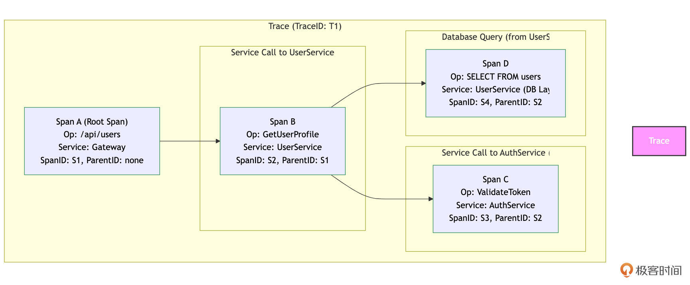
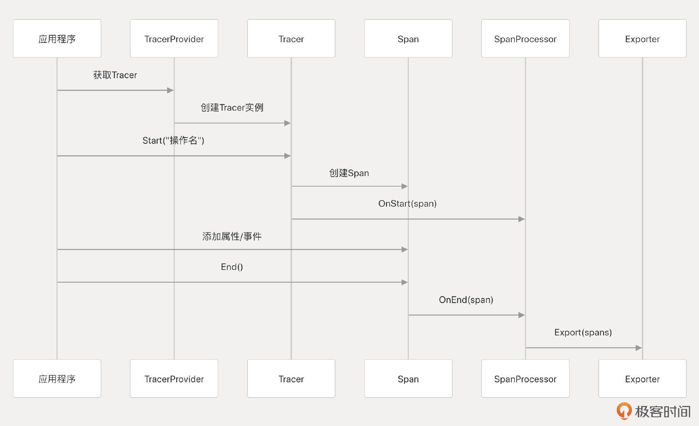
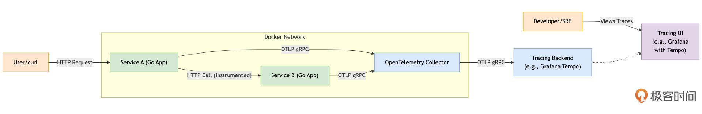
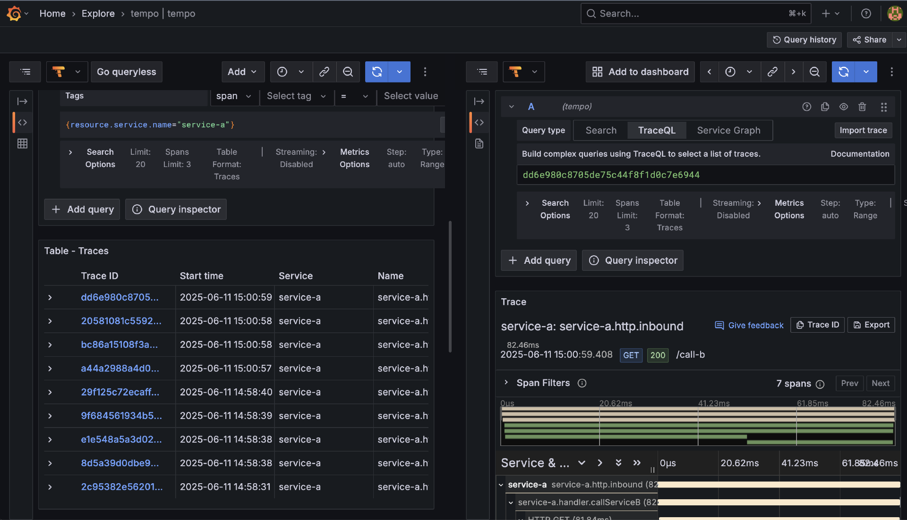

# 可观测性：Metrics、Logging、Tracing，让你的Go服务不再是黑盒（下）
你好，我是Tony Bai。

上节课，我们深入了解了Metrics、Logging在Go生态中的主流技术栈和实践。这节课，我们先继续探讨Tracing，再来聊聊这三者是如何整合的，可观测性数据采集中常见的Push与Pull模型，以及展望eBPF技术为Go应用可观测性带来的革命性影响。

## Go应用的Tracing：洞察分布式链路与瓶颈

在微服务架构下，一个用户的请求可能需要依次或并行地调用多个Go服务（甚至混合其他语言的服务）才能完成。当这个请求变慢或出错时，如何快速定位是哪个环节、哪个服务出了问题？如何理解整个请求的端到端耗时和内部瓶颈？这就是分布式追踪（Distributed Tracing）要解决的核心问题。它允许我们像侦探一样，追踪一个请求从起点到终点，在复杂的分布式系统中穿梭的完整路径，并记录下每一段路程（即每次服务调用或重要操作）的耗时、元数据和可能发生的错误。

接下来，我们就深入探讨如何为Go应用引入分布式追踪能力。我们将首先理解其核心概念，然后重点学习业界标准OpenTelemetry（OTel）在Go中的应用，包括如何进行代码插桩、上下文传播。最后，我们将通过一个包含两个Go HTTP服务相互调用的实战示例，演示如何将追踪数据发送到OpenTelemetry Collector并最终在Grafana Tempo中进行可视化和分析，让你直观感受分布式追踪的威力。

要有效地利用分布式追踪，我们首先需要掌握它的一些基本术语和核心理念。

### 分布式追踪的核心概念

理解以下几个核心概念是掌握分布式追踪的基础：

- Trace（追踪/链路）：代表一个请求（或一个完整的业务事务）在分布式系统中的完整生命周期或执行路径。一个Trace由一个或多个Span组成，所有属于同一个Trace的Span共享同一个全局唯一的 `TraceID`。你可以把它想象成一次旅行的完整行程单。

- Span（跨度/区间）：Trace中的基本工作单元，代表一个命名的、有明确开始和结束时间的操作。例如，一次HTTP请求的接收和处理、一次数据库查询、一个函数的执行、一次消息的发布或消费等，都可以被表示为一个Span。每个Span都有一个在当前Trace内唯一的 `SpanID`，并且（除了整个Trace的第一个Span，即根Span Root Span之外）通常会有一个 `ParentSpanID` 来指向上游调用它的那个Span。通过这种父子关系，所有的Span就串联成了一个树状结构的调用链。我们可以用下图来更直观地理解Trace和Span的关系：




如图所示，整个矩形框代表一个Trace（T1）。Span A是这个Trace的根Span，代表网关服务收到的初始请求。它没有父Span。网关服务调用了用户服务，产生了子Span Span B（ `ParentID: S1`）。用户服务内部又调用了认证服务（产生子Span Span C， `ParentID: S2`）和数据库（产生子Span Span D， `ParentID: S2`）。这样，通过 `TraceID` 和 `ParentSpanID`，这些Span被组织成了一个清晰的调用树，反映了请求的处理流程。

- SpanContext（跨度上下文）：包含了在一个Trace中全局唯一标识一个Span所需的所有信息，主要包括 `TraceID` 和 `SpanID`。它还可能携带其他需要在进程边界（例如，通过HTTP Header或gRPC Metadata）传播的追踪相关信息，如采样决策（Sampling Decision）和Baggage Items（用户定义的、随调用链传播的键值对，例如 `customer_tier=premium`）。上下文传播是实现分布式追踪的关键机制。

- Attributes / Tags（属性/标签）：附加到Span上的键值对元数据，用于描述Span操作的更多上下文细节。例如，HTTP请求的URL、方法、状态码；数据库查询的SQL语句（可能需要脱敏）、影响行数；或者业务相关的ID（如 `order_id`）等。这些属性对于后续筛选、聚合和分析Trace数据非常重要。

- Events / Logs（事件/日志）：在一个Span的时间范围内发生的、带有精确时间戳的具名事件或简短日志消息。例如，标记一个缓存命中/未命中、记录一个特定的错误信息（但不是替代结构化日志），或者标记一个复杂操作的某个关键子步骤完成。

- Instrumentation（代码插桩）：为了能够生成上述的Trace和Span数据，需要在应用代码的关键位置（例如，收到外部请求时、发起对其他服务的RPC调用前、访问数据库前后、执行重要业务逻辑的函数入口和出口等）插入额外的代码逻辑来创建Span、设置其属性、记录事件，并在跨服务调用时正确地传播SpanContext。这个过程就叫做“插桩”。插桩可以是手动的，也可以在一定程度上通过库或Agent提供的自动插桩功能来实现。


理解了这些核心概念，我们就能更好地去选择和使用具体的分布式追踪解决方案。在当前的云原生生态中，OpenTelemetry已经成为了这个领域的事实标准。

### OpenTelemetry：可观测性的未来与Go实践

在分布式追踪领域，曾经存在多种不同的标准和实现，如OpenTracing和OpenCensus。为了统一和简化，社区最终融合这些标准，诞生了OpenTelemetry（简称为 `OTel`）。

OpenTelemetry是一个由CNCF（Cloud Native Computing Foundation）托管的开源项目，旨在提供一套统一的、厂商中立的API、SDK（软件开发工具包）和工具，以生成、收集和导出遥测数据。这些数据包括Traces、Metrics和 Logs。尽管Logs的支持仍在发展中，Traces和Metrics是OTel当前最成熟的部分。OTel的目标是成为可观测性数据采集的事实标准，使开发者能够方便地在应用中集成可观测性能力，同时灵活选择和切换后端分析平台，如Jaeger、Zipkin、Tempo、Datadog和New Relic等。

#### OpenTelemetry Go SDK核心组件

对于Go语言，OpenTelemetry提供了官方的API和Go SDK，主要包括几个核心组件。

首先是 `TracerProvider`，它是创建 `Tracer` 的工厂，通常在应用启动时配置为全局的TracerProvider。

其次是 `Tracer`，用于从代码中创建新的Span，可以通过 `tracerProvider.Tracer("instrumentation-library-name")` 获取。

每个Span代表一个操作单元，通过 `tracer.Start(ctx, "span-name", opts...)` 创建。

此外， `SpanProcessor` 定义了Span在完成时如何被处理，例如同步导出或批量异步导出。最后， `Exporter` 负责将处理过的Span数据发送到具体的追踪后端，OTel提供了多种Exporter实现，包括OTLP Exporter、Jaeger Exporter和Zipkin Exporter等。其中，OTLP（OpenTelemetry Protocol）是OTel定义的一种通用遥测数据传输协议，推荐使用该格式进行数据导出。

Tracer、Span和Exporter的协作工作流程可以用下面这个流程示意图表示：



那么Go代码如何集成OTel Tracing呢？我们继续往下看。

#### 在Go代码中集成OTel Tracing的两种方式

在Go代码中集成OTel Tracing的主要方式有两种，一种是手动插桩，另外一种是自动插桩。

手动插桩是指在应用程序的源代码中直接添加OpenTelemetry API和SDK的代码，以明确地创建和管理Trace、Span等追踪元素。这种方式提供了对追踪数据收集的精细控制，允许开发者捕获特定于业务逻辑的自定义指标和事件。

自动插桩是指利用预构建的库、agent或工具，在不修改应用程序源代码的情况下自动捕获和发送遥测数据。对于Go语言，由于其编译型特性，传统的自动插桩（如Java的字节码注入）较为困难。OTel提供了两种自动插桩的方案， **一种是 [基于eBPF自动插桩](https://github.com/open-telemetry/opentelemetry-go-instrumentation)，用户无需通过SDK手动修改业务代码**。eBPF可以自动检测Go应用，收集HTTP、数据库和RPC调用相关的数据，同时自动传递用户上下文，确保整个trace的完整性。另外一种则是 **通过类似 [InstrGen](https://github.com/open-telemetry/opentelemetry-go-contrib) 的工具在编译时实现自动插桩**。InstrGen可以在编译期间解析整个项目的语法树，并在指定方法中插入代码以启用应用程序监控。这个编译时插桩方案可以避免eBPF自动插桩方案的诸多限制，如内核版本约束、性能开销大、eBPF指令长度限制等。

虽说手动插桩是“侵入式”的，需要修改现有代码，但对于规模较小的项目来说确实很方便，也提供了最大的灵活性和定制能力。并且，手动插桩对于开发者来说，也是理解代码Tracing机制的最好方式，因此这一节课中的示例也将选择手动插桩的方式。

#### 在Go代码中集成OTel Tracing的示例

为了更具体地理解如何在Go应用中实践分布式追踪，我们将通过一个包含两个简单HTTP服务（ `service-a` 和 `service-b`）相互调用的示例来演示。 `service-a` 会接收外部请求，然后调用 `service-b`，最终将结果返回。我们将使用OpenTelemetry Go SDK对这两个服务进行手工插桩，并通过OTLP gRPC Exporter将追踪数据发送到一个本地运行的OpenTelemetry Collector，Collector再将数据转发给Grafana Tempo进行存储和可视化。下面是这个示例的拓扑与数据流示例图：



如上图所示：

1. 用户通过 `curl` 或浏览器向 `Service A` 的 `:8080` 端口发起请求。

2. `Service A` 处理请求，其中一部分逻辑会调用 `Service B` 的 `:8081` 端口。

3. `Service A` 和 `Service B` 都集成了OpenTelemetry Go SDK。它们产生的Trace Span数据会通过OTLP gRPC协议发送到 `OTel Collector` 的 `:4317` 端口。

4. `OTel Collector` 进行简单的处理（如批量化）后，再将Trace数据通过OTLP gRPC协议转发给 `Grafana Tempo` 进行存储。

5. 开发者或运维人员可以通过 `Grafana`（配置了Tempo数据源）的UI来查询和可视化存储在Tempo中的Trace数据。


下面，我们就来一步步使用单机版Docker实现示意图中的流程。

我们首先启动流程图中tracing backend，这里以 [Grafana的Tempo](https://github.com/grafana/tempo) 为例：

```plain
// 在ch24/tracing/otel_tempo_example下执行(确保tempo_data目录存在)
docker run -d \
    --name tempo-server \
    --user root \
    --network host \
    -p 3200:3200 \
    -p 4317:4317 \
    -v $(pwd)/tempo_data:/tmp/tempo \
    grafana/tempo:latest  \
    -storage.trace.backend=local \
    -storage.trace.local.path=/tmp/tempo/traces

```

其中3200端口是供Grafana查询数据的http端口，4317端口则是 [OpenTelemetry Collector](https://github.com/open-telemetry/opentelemetry-collecto)（下面简称为OTel Collector）向Tempo发送Trace数据的服务端口。

> 注意：生产环境Tempo通常使用对象存储作为后端存储，这里使用的本地路径（temp\_data）存储数据仅限于demo。

接下来，我们再来启动OTel Collector。OTel Collector负责接收来自Go应用的跟踪信息、指标以及日志等遥测数据、处理遥测数据，并使用其组件将其导出到各种可观测性后端（这里是Tempo），这里我们仅使用OTel Collector接收跟踪数据。

下面是OTel Collector使用的配置文件ch24/tracing/otel\_tempo\_example/otel-collector-config.yaml，这个配置文件告诉Collector如何接收、处理和导出数据：

```plain
# ch24/tracing/otel_tempo_example/otel-collector-config.yaml
receivers:
  otlp: # 接收OTLP协议的数据
    protocols:
      grpc:
        endpoint: 0.0.0.0:14317 # OTLP gRPC receiver on port 14317
      http:
        endpoint: 0.0.0.0:14318 # OTLP HTTP receiver on port 14318

processors:
  batch: # 批量处理数据以提高效率，减少对后端的请求次数

exporters:
  otlp: # 将数据通过OTLP gRPC发送给Tempo
    endpoint: "localhost:4317" # Tempo容器的服务名和OTLP gRPC端口
    tls:
      insecure: true # 仅用于本地演示，生产环境应使用TLS

service:
  pipelines:
    traces: # 定义traces数据的处理管道
      receivers: [otlp]
      processors: [batch]
      exporters: [otlp] # 指向上面定义的otlp exporter (即发送给Tempo)

```

使用下面docker命令可以在本地启动一个基于上述配置文件的OTel Collector：

```plain
$docker run -d --name otel-collector-server \
    -p 14317:14317 `# OTLP gRPC (for services to send to Collector)` \
    -p 14318:14318 `# OTLP HTTP (optional)` \
    -v $(pwd)/otel-collector-config.yaml:/etc/otel-collector-config.yaml \
    --network host \
    otel/opentelemetry-collector-contrib:latest \
    --config=/etc/otel-collector-config.yaml

```

有了Tempo和OTel Collector后，就差向它们发送Trace数据的应用了。我们逐个看一下拓扑示意图中的Service A和Service B的代码。

我们将创建一个通用的包和相关函数来初始化TracerProvider，供 `service-a` 和 `service-b` 共同使用：

```plain
// ch24/tracing/otel_tempo_example/tracing/tracer.go
package tracing

import (
    "context"
    "fmt"
    "log"
    "time"

    "go.opentelemetry.io/otel"
    "go.opentelemetry.io/otel/exporters/otlp/otlptrace/otlptracegrpc"
    "go.opentelemetry.io/otel/propagation"
    "go.opentelemetry.io/otel/sdk/resource"
    sdktrace "go.opentelemetry.io/otel/sdk/trace"
    semconv "go.opentelemetry.io/otel/semconv/v1.26.0"
    "google.golang.org/grpc"
    "google.golang.org/grpc/credentials/insecure"
)

// InitTracerProvider initializes and registers an OTLP gRPC TracerProvider.
// It returns a shutdown function that should be called by the application on exit.
func InitTracerProvider(ctx context.Context, serviceName, serviceVersion, otlpEndpoint string) (func(context.Context) error, error) {
    log.Printf("Initializing TracerProvider for service '%s' (v%s), OTLP endpoint: '%s'\n", serviceName, serviceVersion, otlpEndpoint)

    res, err := resource.Merge(
        resource.Default(),
        resource.NewWithAttributes(
            semconv.SchemaURL,
            semconv.ServiceName(serviceName),
            semconv.ServiceVersion(serviceVersion),
            // attribute.String("environment", "demo"), // 可选的其他全局属性
        ),
    )
    if err != nil {
        return nil, fmt.Errorf("failed to create OTel resource: %w", err)
    }

    // 创建到OTLP Collector的gRPC连接
    // 在生产中，应该使用安全的凭证 (e.g., grpc.WithTransportCredentials(credentials.NewClientTLSFromCert(nil, "")))
    // 并处理连接错误和重试
    connCtx, cancelConn := context.WithTimeout(ctx, 5*time.Second) // 连接超时
    defer cancelConn()
    conn, err := grpc.DialContext(connCtx, otlpEndpoint,
        grpc.WithTransportCredentials(insecure.NewCredentials()), // 仅用于演示
        grpc.WithBlock(), // 阻塞直到连接成功或超时
    )
    if err != nil {
        return nil, fmt.Errorf("failed to create gRPC connection to OTLP collector at '%s': %w", otlpEndpoint, err)
    }
    log.Printf("Successfully connected to OTLP collector at %s\n", otlpEndpoint)

    // 创建OTLP Trace Exporter
    traceExporter, err := otlptracegrpc.New(ctx, otlptracegrpc.WithGRPCConn(conn))
    if err != nil {
        // 尝试关闭连接，如果创建exporter失败
        if cerr := conn.Close(); cerr != nil {
            log.Printf("Warning: failed to close gRPC connection after exporter creation failed: %v", cerr)
        }
        return nil, fmt.Errorf("failed to create OTLP trace exporter: %w", err)
    }
    log.Println("OTLP trace exporter initialized.")

    // 创建BatchSpanProcessor，这是生产推荐的
    bsp := sdktrace.NewBatchSpanProcessor(traceExporter)

    // 创建TracerProvider
    tp := sdktrace.NewTracerProvider(
        sdktrace.WithSampler(sdktrace.AlwaysSample()), // 为了演示，采样所有trace
        sdktrace.WithResource(res),
        sdktrace.WithSpanProcessor(bsp),
    )

    // 设置为全局TracerProvider和Propagator
    otel.SetTracerProvider(tp)
    otel.SetTextMapPropagator(propagation.NewCompositeTextMapPropagator(
        propagation.TraceContext{}, // W3C Trace Context (标准)
        propagation.Baggage{},      // W3C Baggage
    ))

    log.Printf("Global TracerProvider and Propagator set for service '%s'.\n", serviceName)

    // 返回一个关闭函数，它会关闭TracerProvider和gRPC连接
    shutdownFunc := func(shutdownCtx context.Context) error {
        log.Printf("Attempting to shutdown TracerProvider for service '%s'...\n", serviceName)
        var errs []error
        if err := tp.Shutdown(shutdownCtx); err != nil {
            errs = append(errs, fmt.Errorf("TracerProvider shutdown error: %w", err))
            log.Printf("Error shutting down TracerProvider for %s: %v\n", serviceName, err)
        } else {
            log.Printf("TracerProvider for %s shut down successfully.\n", serviceName)
        }
        if err := conn.Close(); err != nil {
            errs = append(errs, fmt.Errorf("gRPC connection close error: %w", err))
            log.Printf("Error closing gRPC connection for %s: %v\n", serviceName, err)
        } else {
            log.Printf("gRPC connection for %s closed successfully.\n", serviceName)
        }
        if len(errs) > 0 {
            // 可以将多个错误合并返回，这里简单返回第一个
            return fmt.Errorf("shutdown for service %s encountered errors: %v", serviceName, errs)
        }
        return nil
    }

    return shutdownFunc, nil
}

```

接下来，我们先来创建示意图中的service-a，该服务暴露/call-b端点，凡是请求该端点的请求，service-a会通过HTTP客户端调用service-b：

```plain
// ch24/tracing/otel_tempo_example/service-a/main.go

package main

import (
    "context"
    "demo/tracing" // 导入通用的tracing初始化包
    "fmt"
    "io"
    "log"
    "net/http"
    "os"
    "os/signal"
    "syscall"
    "time"

    "go.opentelemetry.io/contrib/instrumentation/net/http/otelhttp" // HTTP client/server auto-instrumentation
    "go.opentelemetry.io/otel"
    "go.opentelemetry.io/otel/attribute"
    "go.opentelemetry.io/otel/codes"
    oteltrace "go.opentelemetry.io/otel/trace" // 不直接用trace.Tracer，而是通过otel.Tracer获取
)

func main() {
    ctx, stop := signal.NotifyContext(context.Background(), syscall.SIGINT, syscall.SIGTERM)
    defer stop()

    serviceName := "service-a"
    serviceVersion := "1.0.0"
    otlpEndpoint := os.Getenv("OTEL_EXPORTER_OTLP_ENDPOINT")
    if otlpEndpoint == "" {
        otlpEndpoint = "localhost:14317" // OTel Collector服务地址
        log.Printf("[%s] OTEL_EXPORTER_OTLP_ENDPOINT not set, using default: %s\n", serviceName, otlpEndpoint)
    }

    // 初始化TracerProvider
    shutdownTracer, err := tracing.InitTracerProvider(ctx, serviceName, serviceVersion, otlpEndpoint)
    if err != nil {
        log.Fatalf("[%s] Failed to initialize TracerProvider: %v. Is OTel Collector running at %s?", serviceName, err, otlpEndpoint)
    }
    defer func() { // 确保在应用退出时关闭TracerProvider
        shutdownCtx, cancel := context.WithTimeout(context.Background(), 5*time.Second)
        defer cancel()
        if err := shutdownTracer(shutdownCtx); err != nil {
            log.Printf("[%s] Error during TracerProvider shutdown: %v", serviceName, err)
        }
    }()

    // 获取一个Tracer实例
    tracer := otel.Tracer(serviceName + "-tracer") // Tracer命名

    // 创建一个带有OTel自动插桩的HTTP客户端
    // otelhttp.NewTransport 会自动为出站请求创建Span并注入Trace Context
    otelClient := http.Client{
        Transport: otelhttp.NewTransport(http.DefaultTransport),
    }

    // 定义HTTP Handler
    callBHandler := func(w http.ResponseWriter, r *http.Request) {
        // 从请求的context中启动一个新的Span，它会成为otelhttp.NewHandler创建的父Span的子Span
        // 或者如果这个handler是顶层入口，它会成为新的根Span（如果otelhttp.NewHandler没用）
        // 在本例中，我们将使用otelhttp.NewHandler包装整个Mux，所以这里tracer.Start会创建子Span
        requestCtx, parentSpan := tracer.Start(r.Context(), "service-a.handler.callServiceB")
        defer parentSpan.End()

        parentSpan.SetAttributes(attribute.String("http.target", r.URL.Path))
        log.Printf("[%s] Received request for %s\n", serviceName, r.URL.Path)

        // 获取service-b的URL (应来自配置或服务发现)
        serviceB_URL := os.Getenv("SERVICE_B_URL")
        if serviceB_URL == "" {
            serviceB_URL = "http://localhost:8081/data" // service-b服务地址
            log.Printf("[%s] SERVICE_B_URL not set, using default: %s\n", serviceName, serviceB_URL)
        }

        // 创建到service-b的请求，并使用带有当前Span的context
        // otelClient.Transport (otelhttp.NewTransport) 会自动从requestCtx中提取Trace Context并注入到出站请求头
        outboundReq, err := http.NewRequestWithContext(requestCtx, "GET", serviceB_URL, nil)
        if err != nil {
            parentSpan.RecordError(err)
            parentSpan.SetStatus(codes.Error, "failed to create request to service-b")
            http.Error(w, "Internal server error", http.StatusInternalServerError)
            return
        }

        log.Printf("[%s] Calling Service B at %s...\n", serviceName, serviceB_URL)
        resp, err := otelClient.Do(outboundReq) // 使用带OTel插桩的HTTP客户端发送请求
        if err != nil {
            parentSpan.RecordError(err)
            parentSpan.SetStatus(codes.Error, "failed to call service-b")
            http.Error(w, fmt.Sprintf("Failed to call service-b: %v", err), http.StatusServiceUnavailable)
            return
        }
        defer resp.Body.Close()

        bodyBytes, err := io.ReadAll(resp.Body)
        if err != nil {
            parentSpan.RecordError(err)
            parentSpan.SetStatus(codes.Error, "failed to read response from service-b")
            http.Error(w, "Internal server error reading response", http.StatusInternalServerError)
            return
        }

        responseMessage := fmt.Sprintf("Service A got response from Service B: [%s]", string(bodyBytes))
        parentSpan.AddEvent("Received response from Service B", oteltrace.WithAttributes(attribute.Int("response.size", len(bodyBytes))))
        parentSpan.SetStatus(codes.Ok, "Successfully called service-b")

        w.WriteHeader(resp.StatusCode)
        fmt.Fprint(w, responseMessage)
        log.Printf("[%s] Successfully handled /call-b request.\n", serviceName)
    }

    // 使用otelhttp.NewHandler包装我们的业务handler，使其自动处理入站请求的Trace上下文和根Span创建
    // "service-a-http-server" 将作为这个HTTP服务器instrumentation的名称，影响根Span的命名
    tracedCallBHandler := otelhttp.NewHandler(http.HandlerFunc(callBHandler), "service-a.http.inbound")

    mux := http.NewServeMux()
    mux.Handle("/call-b", tracedCallBHandler)

    server := &http.Server{
        Addr:    ":8080",
        Handler: mux, // 使用已包装的handler
    }

    go func() {
        log.Printf("[%s] HTTP server listening on :8080\n", serviceName)
        if err := server.ListenAndServe(); err != nil && err != http.ErrServerClosed {
            log.Fatalf("[%s] Service A failed to start: %v", serviceName, err)
        }
    }()

    <-ctx.Done() // 等待退出信号
    log.Printf("[%s] Shutdown signal received, stopping server...\n", serviceName)
    shutdownServerCtx, cancelShutdownServer := context.WithTimeout(context.Background(), 5*time.Second)
    defer cancelShutdownServer()
    if err := server.Shutdown(shutdownServerCtx); err != nil {
        log.Printf("[%s] Error during server shutdown: %v", serviceName, err)
    }
    log.Printf("[%s] Server stopped.\n", serviceName)
}

```

service-b的代码与service-a类似：

```plain
// ch24/tracing/otel_tempo_example/service-b/main.go

... ...
func simulateWork(ctx context.Context, duration time.Duration, operationName string) {
    // 获取当前context中的tracer，创建一个子span
    tracer := otel.Tracer("service-b-worker-tracer") // 可以用更具体的tracer name
    _, span := tracer.Start(ctx, operationName)
    defer span.End()

    span.SetAttributes(attribute.Int64("work.duration.ns", duration.Nanoseconds()))
    log.Printf("[Service B] Worker: Starting %s (will take %v)\n", operationName, duration)
    time.Sleep(duration)
    log.Printf("[Service B] Worker: Finished %s\n", operationName)
    span.AddEvent("Work simulation completed")
}

func dataHandler(w http.ResponseWriter, r *http.Request) {
    // otelhttp.NewHandler 已经为这个请求创建了一个服务器端Span，并将其放入r.Context()
    // 我们可以从r.Context()中获取当前的Span，或者直接用它来创建子Span
    ctx := r.Context()
    tracer := otel.Tracer("service-b-handler-tracer") // 获取tracer

    // 手动创建一个子span来表示这个handler内部的特定业务逻辑
    var handlerSpan oteltrace.Span // Using oteltrace alias from global import
    ctx, handlerSpan = tracer.Start(ctx, "service-b.handler.processData")
    defer handlerSpan.End()

    handlerSpan.SetAttributes(attribute.String("handler.message", "Service B processing /data request"))
    log.Printf("[Service B] Received request at /data. TraceID: %s\n", oteltrace.SpanFromContext(ctx).SpanContext().TraceID())

    // 模拟一些工作
    simulateWork(ctx, 50*time.Millisecond, "databaseQuery")
    simulateWork(ctx, 30*time.Millisecond, "externalAPICall")

    fmt.Fprintln(w, "Data from Service B (processed)")
    handlerSpan.AddEvent("Successfully returned data from Service B")
    handlerSpan.SetStatus(codes.Ok, "Data processed and returned")
}

func main() {
    ctx, stop := signal.NotifyContext(context.Background(), syscall.SIGINT, syscall.SIGTERM)
    defer stop()

    serviceName := "service-b"
    serviceVersion := "1.0.0"
    otlpEndpoint := os.Getenv("OTEL_EXPORTER_OTLP_ENDPOINT")
    if otlpEndpoint == "" {
        otlpEndpoint = "localhost:14317" // Otel Collector服务名
        log.Printf("[%s] OTEL_EXPORTER_OTLP_ENDPOINT not set, using default: %s\n", serviceName, otlpEndpoint)
    }

    shutdownTracer, err := tracing.InitTracerProvider(ctx, serviceName, serviceVersion, otlpEndpoint)
    if err != nil {
        log.Fatalf("[%s] Failed to initialize TracerProvider: %v", serviceName, err)
    }
    defer func() {
        shutdownCtx, cancel := context.WithTimeout(context.Background(), 5*time.Second)
        defer cancel()
        if err := shutdownTracer(shutdownCtx); err != nil {
            log.Printf("[%s] Error during TracerProvider shutdown: %v", serviceName, err)
        }
    }()

    // 使用otelhttp.NewHandler来自动为HTTP请求创建span并处理上下文传播
    // "service-b.http.inbound" 将作为这个HTTP服务器instrumentation的名称
    handlerWithTracing := otelhttp.NewHandler(http.HandlerFunc(dataHandler), "service-b.http.inbound")

    mux := http.NewServeMux()
    mux.Handle("/data", handlerWithTracing) // 注册带追踪的handler

    server := &http.Server{
        Addr:    ":8081",
        Handler: mux,
    }

    go func() {
        log.Printf("[%s] HTTP server listening on :8081\n", serviceName)
        if err := server.ListenAndServe(); err != nil && err != http.ErrServerClosed {
            log.Fatalf("[%s] Service B failed to start: %v", serviceName, err)
        }
    }()

    <-ctx.Done()
    log.Printf("[%s] Shutdown signal received, stopping server...\n", serviceName)
    shutdownServerCtx, cancelShutdownServer := context.WithTimeout(context.Background(), 5*time.Second)
    defer cancelShutdownServer()
    if err := server.Shutdown(shutdownServerCtx); err != nil {
        log.Printf("[%s] Error during server shutdown: %v", serviceName, err)
    }
    log.Printf("[%s] Server stopped.\n", serviceName)
}

```

上面两段代码演示了如何使用OpenTelemetry（OTel）对两个 `service-a` 和 `service-b` 两个服务代码进行手动插桩，以实现分布式追踪。我们大致解释一下代码的核心要点：

1. OTel 初始化: 两个服务都依赖一个共享的 `tracing` 包（ `demo/tracing`）来初始化 `TracerProvider`。初始化时会配置服务名称（ `serviceName`）、服务版本（ `serviceVersion`）和 OTLP导出器端点（ `OTEL_EXPORTER_OTLP_ENDPOINT`，默认为 `localhost:14317`），用于将追踪数据发送到我们已经启动的Otel Collector。程序优雅退出时会调用 `shutdownTracer` 来确保追踪数据被完整发送。

2. Service A（调用方）：
   1. HTTP 服务器端插桩：使用 `otelhttp.NewHandler` 包装其HTTP处理器（ `callBHandler`）。这会自动为进入 `/call-b` 的请求创建一个服务器端 Span，并将追踪上下文（Trace Context）放入请求的 `context.Context` 中。

   2. 手动创建子 Span：在 `callBHandler` 内部，通过 `tracer.Start()` 手动创建一个子 Span（ `service-a.handler.callServiceB`），用于包裹调用 Service B 的业务逻辑。

   3. HTTP 客户端插桩：创建一个 `http.Client`，其 `Transport` 被 `otelhttp.NewTransport` 包装。当 Service A 调用 Service B 时，这个 Transport 会自动从当前 `context.Context` 中提取追踪信息，并创建一个客户端 Span（作为 `service-a.handler.callServiceB` 的子 Span），然后将追踪上下文（如 Trace ID、Span ID）注入到发往 Service B 的 HTTP 请求头中（实现上下文传播）。

   4. Span 操作：在 Span 上设置属性（ `SetAttributes`）、添加事件（ `AddEvent`）、记录错误（ `RecordError`）和设置状态（ `SetStatus`）。
3. Service B（被调用方）：
   1. HTTP 服务器端插桩：同样使用 `otelhttp.NewHandler` 包装其HTTP处理器（ `dataHandler`）。当收到来自 Service A 的请求时，它会自动从请求头中提取追踪上下文，并创建一个新的服务器端 Span，该 Span 会成为 Service A 中客户端 Span 的子 Span，从而将两个服务的追踪串联起来。

   2. 手动创建子 Span：在 `dataHandler` 内部，手动创建子 Span（ `service-b.handler.processData`）来包裹其核心处理逻辑。

   3. 模拟工作单元的 Span： `simulateWork` 函数进一步创建更细粒度的子 Span（如 `databaseQuery`、 `externalAPICall`），展示如何追踪内部操作。

   4. Span 操作：同样在 Span 上进行属性、事件和状态的设置。
4. 上下文传播（Context Propagation）：
   1. 核心机制是通过 `context.Context` 在函数调用链中传递追踪信息。

   2. 跨服务边界时， `otelhttp` 库负责在 HTTP 请求头中序列化和反序列化追踪上下文（通常使用 W3C Trace Context 标准）。

这两段代码通过结合 OTel 提供的 HTTP 自动插桩库和手动创建 Span 的方式，为两个微服务构建了一个完整的分布式追踪链路。通过这些插桩，当一个请求从 Service A 发起，流经 Service B，再到 Service B 内部的模拟工作单元时，整个调用链上的所有操作都会被记录为一系列关联的 Span。这些 Span 数据发送到 OTel Collector 并最终存储在追踪后端后，可以可视化整个分布式请求的路径、延迟和依赖关系，便于问题排查和性能分析。

下面，我们来构建并运行service-a和service-b：

```plain
// 在ch24/tracing/otel_tempo_example下
$go build -o svc-a service-a/main.go
$go build -o svc-b service-a/main.go
// 在新窗口启动service-a
$./svc-a
2025/06/11 06:56:56 [service-a] OTEL_EXPORTER_OTLP_ENDPOINT not set, using default: localhost:14317
2025/06/11 06:56:56 Initializing TracerProvider for service 'service-a' (v1.0.0), OTLP endpoint: 'localhost:14317'
2025/06/11 06:56:56 Successfully connected to OTLP collector at localhost:14317
2025/06/11 06:56:56 OTLP trace exporter initialized.
2025/06/11 06:56:56 Global TracerProvider and Propagator set for service 'service-a'.
2025/06/11 06:56:56 [service-a] HTTP server listening on :8080

// 在新窗口启动service-b
$./svc-b
2025/06/11 06:57:45 [service-b] OTEL_EXPORTER_OTLP_ENDPOINT not set, using default: localhost:14317
2025/06/11 06:57:45 Initializing TracerProvider for service 'service-b' (v1.0.0), OTLP endpoint: 'localhost:14317'
2025/06/11 06:57:45 Successfully connected to OTLP collector at localhost:14317
2025/06/11 06:57:45 OTLP trace exporter initialized.
2025/06/11 06:57:45 Global TracerProvider and Propagator set for service 'service-b'.
2025/06/11 06:57:45 [service-b] HTTP server listening on :8081

```

然后通过curl访问service-a的/call-b端点，以产生流量和trace数据：

```plain
// 在新窗口多次访问service-a的call-b端点
$ curl localhost:8080/call-b
Service A got response from Service B: [Data from Service B (processed)
$ curl localhost:8080/call-b
Service A got response from Service B: [Data from Service B (processed)
... ...

```

接下来就是通过Grafana查看Trace数据了。在Grafana中，你可以添加Tempo类型数据源，具体操作和前面添加prometheus、victorialogs数据源大同小异，这里不赘述了。有了Tempo数据源后，我们就可以通过Explore > tempo查看来自tempo数据源的数据了（如下图所示）：



你应该能看到名为 `service-a` 和 `service-b` 的服务，并且可以搜索到包含多个Span（一个来自service-a的 `service-a.handleCallB`，一个由 `otelhttp.NewTransport` 自动创建的HTTP客户端Span，一个由service-b的 `otelhttp.NewHandler` 自动创建的HTTP服务端Span `service-b-http-server`，以及service-b内部手动创建的 `service-b.dataHandler.Process` 和 `service-b.internalProcessing`）的完整Trace。点击Trace可以看到详细的调用链、每个Span的耗时、属性和事件。

通过这个更完整的示例，我们演示了如何使用OpenTelemetry Go SDK为多个相互调用的Go服务进行插桩，并通过OTel Collector将追踪数据发送到Grafana Tempo进行可视化。这清晰地展现了分布式追踪在理解微服务交互和定位跨服务瓶颈方面的强大能力。

至此，我们的Go应用产生的标准化Trace数据，已经通过OpenTelemetry Collector的桥梁，顺利抵达了Grafana Tempo后端。Tempo凭借其针对TraceID优化的存储和与Grafana的无缝集成，为我们提供了一种高效的追踪数据解决方案。

然而，正如技术世界常态，解决方案往往不止一种。在Tempo之外，业界还有哪些久经考验或独具特色的主流Tracing后端？例如，经典的Jaeger和Zipkin是如何应对大规模追踪数据的？而像VictoriaMetrics这样的新兴力量，在尝试将Trace数据融入其统一可观测性版图时，又展现了哪些不同的设计思路和性能表现？深入了解这些不同的“玩家”如何进行Trace数据的存储、查询、分析和可视化，对我们构建真正适合自身业务场景的追踪体系至关重要。

### 主流Tracing后端与可视化

一旦Go应用通过OTel SDK生成并导出了Trace数据（通常通过OTLP协议发送给OpenTelemetry Collector），我们就需要一个强大的追踪后端（Tracing Backend）来接收、持久化存储这些海量的Trace数据，并提供高效的查询接口和丰富的可视化能力。

在开源领域，有几个广为人知且经过生产环境检验的追踪后端，我们一一来看。

Jaeger（ [https://www.jaegertracing.io/](https://www.jaegertracing.io/)）由Uber开源，是CNCF的毕业项目，功能非常全面，生态也相对成熟。Jaeger通常包含 `jaeger-agent`（可选，用于在应用节点收集和转发数据）、 `jaeger-collector`（接收数据并写入存储）、存储后端（支持Cassandra、Elasticsearch、Kafka、BadgerDB等多种，甚至可以直接将数据写入ClickHouse – ClickHouse因其LSM-Tree和列式存储特性，被证明非常适合存储Trace Span数据）以及 `jaeger-query`（提供查询API和Web UI）。

Jaeger提供丰富的查询功能（按服务、操作、标签、耗时、错误等搜索Trace），直观的Trace火焰图和甘特图可视化服务依赖拓扑图以及Trace数据对比等。Jaeger可以直接接收OTLP数据（较新版本），或者通过OTel Collector将其配置为Jaeger的Exporter。Grafana也内置了对Jaeger数据源的支持。

另一个历史悠久且流行的开源追踪系统 Zipkin（ [https://zipkin.io/](https://zipkin.io/)），源于Twitter。与Jaeger类似，Zipkin也有Collector、Storage（支持多种后端如Cassandra、Elasticsearch、MySQL）、Query Service和Web UI。其数据模型（特别是B3传播头）对后续的追踪标准（如W3C Trace Context）有一定影响。最后，Zipkin同样可以接收OTLP数据（通过OTel Collector转换或直接支持）。

然而，随着监控数据量的持续爆炸式增长，社区对存储成本效益、查询性能以及与现有监控生态（特别是Metrics和Logs）的无缝集成提出了更高的要求。正是在这种背景下，一些新的、设计理念更现代的追踪后端应运而生，其中Grafana Tempo是一个突出的代表。

Grafana Tempo（ [https://grafana.com/oss/tempo/](https://grafana.com/oss/tempo/)）为海量Trace设计，与Grafana生态深度融合。Grafana Tempo是Grafana Labs推出的一个高可扩展、高性价比的分布式追踪后端。它的设计哲学与Grafana Loki（用于日志）有诸多相似之处，都强调通过简化的索引策略和与对象存储的集成来降低大规模遥测数据存储的成本。

- 核心设计理念：
  - **专注于通过TraceID进行高效查找，对TraceID本身建立索引。** 它不试图对Span的每一个属性（tag）都建立复杂的二级索引（这正是传统追踪系统如Elasticsearch后端可能导致存储和查询成本高昂的原因之一）。

  - **与对象存储深度集成。** Tempo将原始的Trace Span数据主要存储在廉价的对象存储服务中（如Amazon S3、Google Cloud Storage、Azure Blob Storage、MinIO等）。

  - **依赖于从Metrics或Logs中“发现”TraceID。** Tempo的设计鼓励一种“先从Metrics或Logs中发现问题，再用TraceID深入追踪”的工作流。例如，当你从Grafana的Metrics仪表盘上看到一个服务的P99延迟飙升，或者从Loki的日志中找到一条错误日志，你应该能够从这些Metrics或Logs的元数据中提取出相关的TraceID，然后再到Tempo中用这个TraceID精确查找完整的调用链进行深度分析。
- 架构组件：Tempo通常包含Distributor（接收数据）、Ingester（构建内存中的Trace并写入后端）、Compactor（合并和压缩数据块）、Querier/Query Frontend（处理查询）等组件。它可以单节点运行，也可以集群部署。

- 与Grafana、Loki、Prometheus/VictoriaMetrics的无缝集成：这被认为是Tempo的核心优势和最大卖点。在Grafana的统一界面中，你可以：
  - 观察来自Prometheus或VictoriaMetrics的Metrics图表，发现异常。

  - 从Metrics图表（例如，通过Exemplars或者时间范围和标签）一键跳转到相关的Logs（存储在Loki或VictoriaLogs中）。

  - 从Logs中提取出关键的TraceID。

  - 用这个TraceID直接在Grafana中查询Tempo数据源，查看该请求的完整Trace视图。 这种Metrics-Logs-Traces之间的无缝跳转和上下文关联，极大地提升了故障排查和性能分析的效率和体验。

Tempo以其低存储成本、高可扩展性、以及与Grafana可观测性生态的深度融合，正迅速成为云原生环境下分布式追踪后端的一个非常受欢迎的选择，尤其适合那些已经在使用Grafana、Prometheus和Loki的团队。

最后，VictoriaMetrics团队也一直在积极探索和研究分布式追踪的存储与查询问题。Trace Span数据与结构化日志在本质上非常相似：都是由键值对（字段/属性）构成，都有高写入速率的需求，且通常只有一小部分数据会被频繁查询。因此，该团队基于VictoriaLogs之上实现了一个高效的Trace存储和检索原型：VictoriaTraces。在特定条件下，该原型在CPU使用率、内存消耗和数据大小方面，相比基于ClickHouse或Tempo（本地磁盘模式）的Jaeger具有较大的性能优势。这意味着，对于那些已经在使用或考虑使用VictoriaMetrics和VictoriaLogs的Go开发者来说，未来很可能可以直接将Trace数据也存入VictoriaLogs（或其演进版本），从而在VictoriaMetrics生态内实现Metrics、Logs、Traces的统一存储和查询，这无疑是非常有吸引力的前景。

选择哪种追踪后端，取决于团队的技术栈、已有的监控基础设施、对存储成本和查询性能的特定需求、以及与Metrics/Logs系统的集成偏好。但无论选择哪种后端，Go应用侧坚持使用OpenTelemetry SDK进行插桩并导出OTLP格式的数据，是确保未来灵活性和可移植性的最佳实践。

通过Metrics量化状态，通过Logging记录事件，通过Tracing洞察链路，我们就能为Go应用构建起一个强大的可观测性体系。但这三者如果各自为政，其威力会大打折扣。要真正释放可观测性的力量，实现对复杂系统行为的深度理解和快速的问题定位，就必须将这些不同来源的遥测数据有效地整合与关联起来。

## 整合、模型与未来：构建统一可观测性视图

理解了如何分别构建Metrics、Logging和Tracing系统之后，我们首先要解决的问题是，如何让这“三驾马车”协同作战，而不是各行其是。

### Metrics、Logging、Tracing的整合与关联

为何需要整合？ 想象一下这样的典型线上排障场景：

1. 你收到一个告警，提示某个服务的P99延迟（来自Metrics系统）突然飙升。

2. 你自然希望查看该时间段内这个服务的错误日志（来自Logging系统），看看是否有相关的异常信息或错误堆栈。

3. 如果日志指向了某个特定的请求或用户，你可能还想找到这个（或类似）慢请求的完整分布式调用链（来自Tracing系统），以分析具体的性能瓶颈在哪里。


如果这三者是孤立的，你可能需要在不同的监控系统、不同的查询界面之间手动切换、复制ID、调整时间范围进行搜索，这个过程不仅效率低下，而且容易遗漏关键信息。而如果它们能够被有效地整合关联起来，你就可以从一个Metrics告警或图表，平滑地钻取（drill down）到相关的日志条目，再从日志中提取出TraceID，一键跳转到该Trace的详细视图，整个排障流程将变得行云流水。

那么，实现这种数据间关联的关键是什么呢？ **答案主要在于一致的元数据/标签和有效的上下文传播。**

首先，一致的元数据和标签是实现数据关联的“粘合剂”。我们必须确保在Metrics的标签、结构化日志的字段以及Trace Span的属性中，使用相同含义、相同命名（或可映射）的键来记录那些能够将不同遥测数据串联起来的关键上下文信息。例如， `service_name`、 `instance_id`（或 `pod_name`、 `host`）、 `environment`（如 `prod`、 `staging`）、 `version`（应用版本）等，这些都应该是所有遥测数据共有的。

而对于实现Logs和Traces之间的精确关联， `trace_id` 和 `span_id` 是最核心的关联ID，必须努力将它们包含在每一条与特定追踪活动相关的日志中。此外，诸如 `user_id`、 `request_id`、 `session_id` 和 `order_id` 等与具体业务或请求相关的ID，如果也能在Metrics、Logs和Traces中一致地出现（作为标签或属性），将极大地增强我们按业务维度进行故障排查和数据分析的能力。

其次，上下文传播是确保这些关联ID（特别是TraceID和SpanID）能够在分布式系统中正确传递的关键机制。正如我们在讨论Tracing时提到的，当一个请求跨越多个服务边界时，TraceID和SpanID必须通过网络调用（例如，作为HTTP Headers或gRPC Metadata）在服务之间正确地传播下去。同时，在单个服务内部的函数调用链中，这些ID也应该被有效地传递（通常是利用Go的 `context.Context`），以便在任何需要记录日志或Metrics的地方都能够获取到它们。

最终，数据间的这种关联能力还需要一个强大的、具有整合能力的可视化平台来呈现。现代的可观测性平台（如Grafana）通常都致力于提供这种统一的视图。例如，在Grafana中，你可以通过精心设计的仪表盘和数据源配置，实现：

- 从Prometheus的Metrics图表（例如，一个显示高错误率的面板）直接跳转到VictoriaLogs的日志查询界面，并自动使用图表中的时间范围和相关标签（如 `service_name`、 `instance_id`）作为日志的初始过滤条件。

- 从VictoriaLogs的日志条目中，如果该日志包含了 `trace_id` 字段，可以配置一个“衍生链接（derived link）”，使得用户点击该TraceID后，能直接在Tempo（或Jaeger/Zipkin）数据源中打开这个Trace的详细视图（如Span列表等）。


通过这种方式，我们就打破了Metrics、Logging和Tracing之间的数据孤岛，构建了一个真正统一和高效的可观测性分析流程，使得从发现问题到定位根因的路径大大缩短。

在讨论完数据整合之后，我们还需要了解一下可观测性领域遥测数据的采集模型。

### Push vs. Pull 模型在可观测性中的应用

在收集遥测数据时，主要有两种基本的数据流模型：Push（推送）模型和Pull（拉取）模型。理解它们的原理和差异，有助于我们选择合适的工具和设计合理的架构。

在Pull模型中，中央收集系统（例如Prometheus Server）扮演主动角色，它会定期地向被监控的目标（例如我们Go应用暴露的 `/metrics` 端点）发起请求，以“拉取”最新的数据。这种模型的优点如下：

- **集中控制**，监控系统可以统一管理所有目标的发现、抓取配置和频率。

- **易于服务发现**，尤其是在像Kubernetes这样的动态环境中，Prometheus的服务发现机制非常强大。

- **对目标应用的压力相对可控**，应用只需被动地暴露一个端点。

- 能够通过拉取成功与否间接 **检测目标的存活状态**。


然而，Pull模型也存在一些不适用的场景，例如对于生命周期非常短暂的任务（如Serverless函数、短时间运行的批处理作业），Prometheus可能在它们结束之前还未来得及拉取数据。此外，如果目标应用位于复杂的网络环境（如NAT之后或有严格防火墙限制），中央系统可能难以直接访问其端点。Prometheus的Metrics收集是Pull模型的典型代表。

与此相对，在Push模型中，被监控的目标（通常是应用自身，或者部署在应用旁边的Agent）扮演主动角色，它会将产生的遥测数据主动“推送”到中央收集系统。这种模型的优点在于：

- **非常适合短暂任务和Serverless函数**，因为它们可以在结束前主动推送自己的数据。

- **对网络环境要求更低**（NAT/防火墙友好），只要目标能访问到中央收集系统的接收端点即可。

- **数据的实时性可能更高。** 因为数据可以一产生就立即推送，无需等待中央系统的固定拉取周期。


但是，Push模型也面临一些挑战：中央系统对数据源的控制力相对较弱，难以统一管理所有源的配置和发送行为。如果大量数据源同时向中央系统推送数据，可能会造成“推送风暴”，导致收集系统过载（因此需要有效的限流、鉴权和背压机制）。并且，如果一个数据源停止推送数据，中央系统可能无法立即判断它是正常停止还是发生了故障（通常需要心跳或其他带外机制来辅助判断存活状态）。Logging（如Filebeats将日志Push到VictorilLogs）和Tracing（如OTel Exporter将Trace数据Push到Collector或后端）通常采用Push模型。 某些Metrics系统（如VictoriaMetrics）也原生支持多种协议的Push数据摄入，或者像Prometheus通过Pushgateway间接支持短暂任务的Push。

在现代可观测性系统中，我们往往会看到 **这两种模型的混合使用**。例如，一个常见的组合可能是：使用Prometheus（Pull模型）收集Metrics，使用Filebeat将日志Push到VictoriaLogs（Push模型），并使用OpenTelemetry Collector接收应用Push过来的Trace数据（Push模型）。选择哪种模型或组合，需要根据具体的数据类型、应用场景、网络环境以及对控制和实时性的要求来综合考虑。

除了数据整合和采集模型，可观测性领域的技术本身也在不断演进。其中，eBPF技术的兴起，为我们观测Go应用（乃至整个系统）带来了革命性的新视角。

### eBPF对Go可观测性的革命性影响（展望）

在可观测性领域，一个正在快速发展并展现出巨大潜力的技术是eBPF（extended Berkeley Packet Filter）。虽然深入eBPF的细节超出了本节课要讲的范围，但了解其基本概念及其对Go可观测性的潜在影响，对于我们把握未来的技术趋势非常重要。

简单来说，eBPF是一种允许开发者在Linux内核中安全、高效地执行自定义代码（eBPF程序）的技术，而无需修改内核源代码或加载传统的内核模块。这些eBPF程序可以被附加到内核的各种“钩子点”（如系统调用入口/出口、网络数据包处理路径、内核函数调用等）。当内核执行到这些钩子点时，对应的eBPF程序就会被触发执行，从而能够以极低的开销收集到非常详细的系统和应用行为数据。

eBPF对可观测性的革命性影响主要体现在：

- **零侵入/自动插桩**：这是eBPF最引人注目的特性之一。对于许多类型的可观测数据收集（特别是与网络流量、系统调用、内核事件相关的Metrics和部分Traces），eBPF可以做到对被观测的应用代码完全透明。也就是说，我们无需在Go应用层面进行任何代码修改、引入SDK或重新编译部署，eBPF程序就能直接在内核层面“观察”到应用的外部行为（如它发起了哪些网络连接、读写了哪些文件、执行了哪些系统调用）并收集相关数据。

- **获取更底层的、更全面的遥测数据**：eBPF可以直接访问内核数据结构和事件，从而能够收集到许多传统用户态监控工具难以获取或开销较大的信息，例如精确到每个进程/容器的网络流量统计、TCP连接的生命周期事件、DNS解析延迟、系统调用的频率和耗时、磁盘I/O的细节等。

- **对Go应用的价值**：
  - 弥补Go运行时可观测性的盲点：虽然Go的 `pprof` 和 `trace` 工具能提供丰富的运行时内部信息，但对于某些更底层的、与操作系统内核交互密切的行为（如精确的网络包收发细节、文件I/O的实际耗时、特定系统调用的瓶颈），eBPF能提供更直接、更全面的观测视角。

  - 实现更低开销的持续剖析：一些基于eBPF的剖析工具（如Parca、Pyroscope的eBPF模式）正在探索如何通过在内核层面采样CPU执行、内存分配（通过hook malloc/free 等）甚至off-CPU时间，来实现比传统用户态采样更低开销、干扰更小的持续性能剖析。

  - 自动化的服务依赖拓扑发现和部分分布式追踪能力：通过监控所有进程的网络连接和请求（特别是对HTTP/1.x、HTTP/2、gRPC等常见协议的解析），基于eBPF的工具可以在一定程度上自动发现服务之间的调用关系，构建服务拓扑图，并为这些协议的请求自动生成Trace Span，而无需应用层进行手动插桩（尽管其包含的业务上下文信息可能不如SDK插桩丰富）。

当前，已经有不少优秀的开源项目（如CNCF的Pixie、Cilium、Falco和Grafana Labs的Pyroscope、Deepflow等）和商业产品正在积极利用eBPF来构建新一代的、更自动化的、零侵入或低侵入的可观测性解决方案。

eBPF无疑正在为云原生可观测性带来一场深刻的变革。它使得我们能够以一种前所未有的方式和粒度去理解和诊断我们的Go服务（以及运行它们的基础设施），并且很多时候是以对应用代码零侵入的方式。对于Go开发者来说，关注并理解eBPF技术及其在可观测性领域的应用，将是未来提升系统洞察能力、简化可观测性集成的一个非常重要的方向。

## 小结

这节课，我们继续深入Tracing领域，认识到OpenTelemetry（OTel）作为统一的、厂商中立的遥测数据标准的重要性。我们学习了OTel Tracing的核心概念（Trace、Span、SpanContext），以及如何在Go应用中使用OTel Go SDK进行手动插桩来生成和传播Trace数据，并通过OTLP Exporter将其发送到OpenTelemetry Collector，最终在追踪后端（如Grafana Tempo）进行可视化和分析。我们通过一个包含两个Go HTTP服务相互调用的示例，完整演示了这个过程。

此外，我们还讨论了如何整合Metrics、Logging和Tracing（通过一致的元数据和上下文传播，特别强调了TraceID在日志中的重要性），分析了可观测性数据采集中常见的Push与Pull模型的特点与应用，并展望了eBPF技术为Go应用可观测性带来的革命性影响和未来的巨大潜力，它有望实现零侵入或极低侵入的自动化可观测数据收集。

通过连续三节课的学习，相信你已经掌握了为Go服务构建强大可观测性体系的核心知识和技能。这将使你能够更自信地将Go应用部署到复杂的生产环境，并在出现问题时，拥有快速洞察和解决问题的能力，真正让你的服务不再是一个难以捉摸的“黑盒”，为后续的故障诊断、性能调优打下坚实的数据基础。

## 思考题

1. 技术选型与集成策略：假设你正在为一个新的Go微服务（例如，一个处理用户画像分析的核心服务，它会接收数据、进行一些计算，并可能调用其他内部服务）设计其完整的可观测性方案。
   1. Metrics：你会选择Prometheus作为基础，还是直接考虑VictoriaMetrics？为什么？你的Go应用会暴露哪些关键的自定义指标（遵循RED或黄金四信号的思路）？

   2. Logging：你会选择Loki还是VictoriaLogs作为日志后端（假设不考虑ELK）？理由是什么？你的Go应用会使用 `log/slog` 输出哪些关键的结构化字段来帮助你分析用户画像处理的流程和可能遇到的问题？

   3. Tracing：你会如何使用OpenTelemetry Go SDK对这个画像分析服务进行插桩，以追踪一个画像生成请求的完整生命周期（包括可能的内部函数调用和对其他服务的调用）？
2. 数据关联与eBPF的思考：
   1. 为了将Metrics、Logging和Tracing数据有效地关联起来，你认为在你的Go应用代码（例如， `slog` 日志的属性、OTel Span的属性）以及在日志收集代理（如Filebeat、Promtail、Vector）的配置中，最关键的需要保持一致或能够相互映射的上下文ID或标签是什么？

   2. 如果让你畅想一下，eBPF技术未来可能会如何改变或简化你为这个Go用户画像服务构建可观测性的方式（例如，在自动插桩、网络监控、底层性能剖析等方面）？

欢迎在留言区分享你的思考和方案！我是Tony Bai，我们下节课见。
