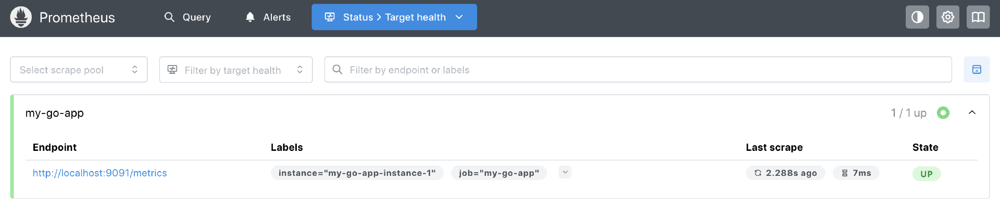
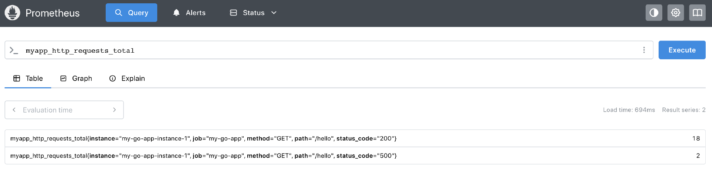
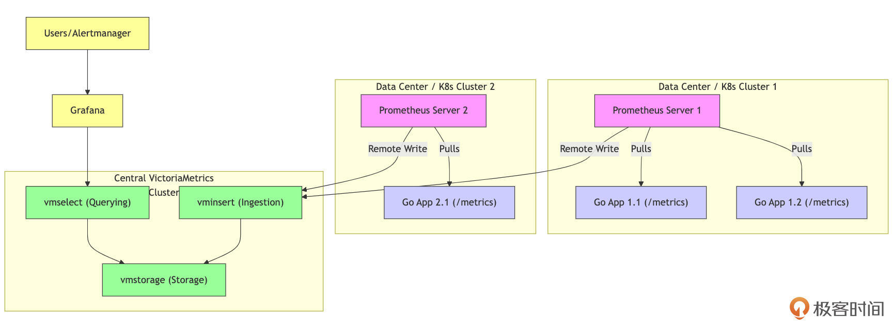
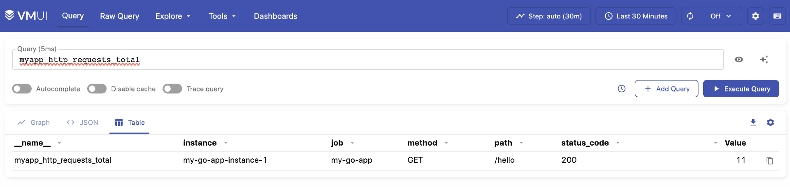
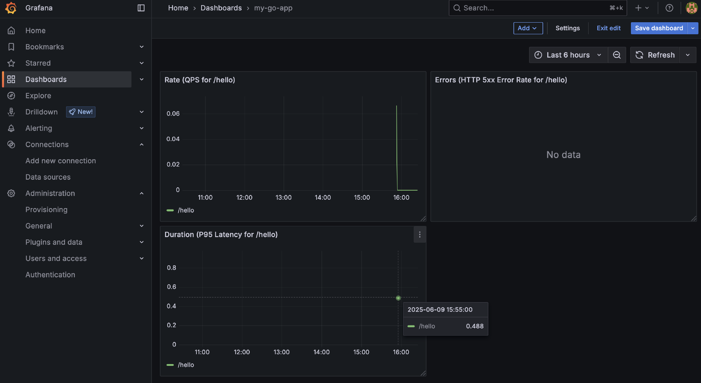
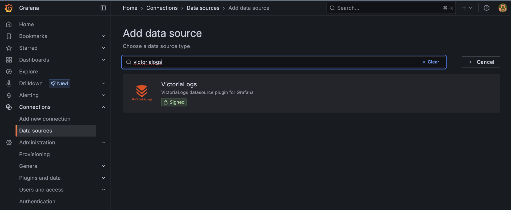
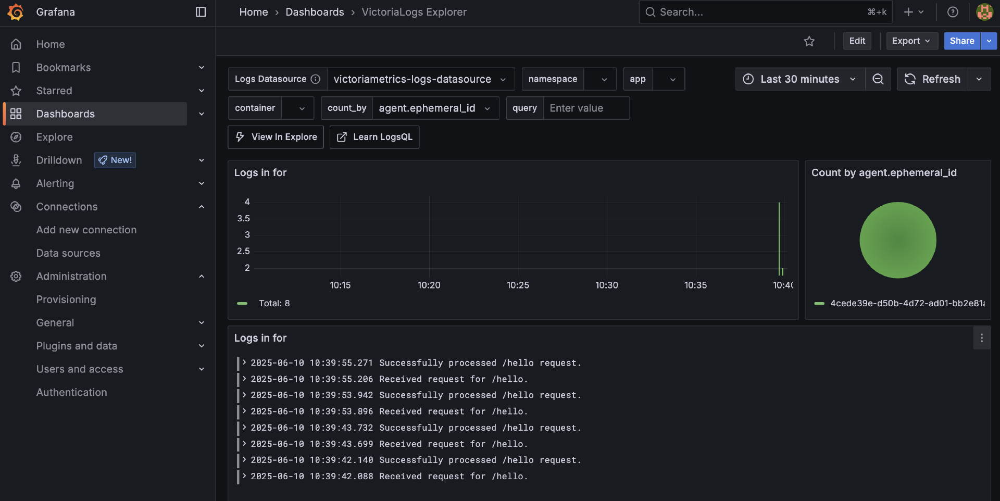
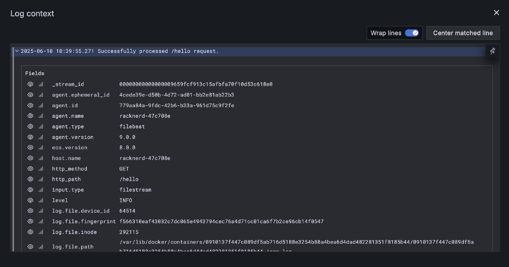

# 可观测性：Metrics、Logging、Tracing，让你的Go服务不再是黑盒（中）
你好，我是Tony Bai。

上节课，我们一起探讨了云原生时代为何可观测性如此重要，以及它是如何从传统监控演进而来，其核心支柱又是什么。这节课，我们将深入了解Metrics、Logging和Tracing三大支柱在Go生态中的主流技术栈和实践：

- **Metrics**（度量/指标）：如何使用Prometheus或新兴的VictoriaMetrics来量化Go应用的状态与趋势。

- **Logging**（日志）：如何构建有效的结构化日志系统，并利用Loki或VictoriaLogs等方案进行集中管理和分析。

- **Tracing**（追踪/链路）：如何借助OpenTelemetry和Grafana Tempo等工具，洞察分布式请求的完整路径和性能瓶颈。因为内容比较多，这一部分我们放到下节课讲。


首先，我们来看Metrics。

## Go应用的Metrics：量化系统状态与趋势

Metrics（度量或指标）是可观测性的基石之一。它们通过可聚合的数值型时间序列数据，为我们描绘出系统在一段时间内的运行画像，告诉我们系统“有多快”、“有多忙”、“消耗了多少资源”、“产生了多少错误”等等。对于Go应用而言，我们不仅关心其底层的资源消耗（如CPU、内存），也关心其业务层面的表现（如请求速率、处理延迟、错误数量等）。接下来，我们将学习Metrics的核心概念，了解主流的Go Metrics方案（特别是Prometheus及其兼容生态如VictoriaMetrics），并掌握如何在Go应用中实际暴露和收集指标。

### Metrics的核心概念

在深入具体工具之前，我们先了解一下Metrics领域的一些通用核心概念。

首先是指标类型，最常见的指标类型包括：

- Counter（计数器）：一个单调递增的累积值，用于记录某个事件发生的总次数。例如，HTTP请求的总数、发生的错误总数。它只能增加或在应用重启时重置为零。我们通常关心其在一段时间内的变化率（rate）。

- Gauge（仪表盘/瞬时值）：一个可以任意上升或下降的数值，表示某个指标在特定时间点的瞬时值。例如，当前的CPU使用率、内存占用大小、队列中的任务数量、活跃的goroutine数量。

- Histogram（直方图）：对观察到的值（通常是请求延迟或响应大小）进行采样，并将其分布到一组可配置的桶（buckets）中进行计数，同时也会记录观察值的总和（sum）和总次数（count）。通过直方图，我们可以计算分位数（quantiles，如P95、P99延迟），从而更好地理解数据的分布情况，而不仅仅是平均值。

- Summary（摘要/概要）：与Histogram类似，也用于观察值的分布，但它直接在客户端（应用侧）计算和暴露预定义的分位数（例如，φ=0.5、φ=0.9、φ=0.99），以及总和（sum）和总次数（count）。计算分位数可能对客户端有一定性能开销，且聚合多个Summary实例的分位数比较困难。


标签（Labels / Tags）是实现Metrics多维度分析的关键。一个指标可以关联一组键值对标签，用于区分该指标的不同实例或方面。例如，一个名为 `http_requests_total` 的Counter可以有 `method="GET"`、 `path="/api/users"`、 `status_code="200"` 这样的标签，从而允许我们按HTTP方法（method）、路径（path）、状态码（status\_code）等维度对请求总数进行聚合和查询。

时序数据库（TSDB - Time Series Database）：专门用于存储和查询带有时间戳的指标数据（即时间序列）的数据库。Prometheus、VictoriaMetrics以及InfluxDB等都是常见的TSDB。

掌握了这些基本概念，我们还需要一个方法论来指导我们应该监控哪些指标。对于服务类应用，Grafana Labs的VP Product，同时也是Prometheus和OpenMetrics早期贡献者Tom Wilkie，于2018年提出的 [RED方法论](https://grafana.com/blog/2018/08/02/the-red-method-how-to-instrument-your-services/) **是一个非常好的起点**， **它能帮助我们快速搭建起一套核心的服务质量指标体系**：

- Rate（R - 速率）：服务每秒处理的请求数量。这通常对应QPS或RPS。

- Errors（E - 错误数/率）：服务处理请求时发生的错误数量或错误率。

- Duration（D - 耗时/延迟）：服务处理每个请求所需的时间，通常关注其分布（如平均值、P90、P95、P99）。


监控这三个核心指标，能让我们对服务的健康状况和性能表现有一个基本的把握。对于不是Metrics专家的开发人员来说，遵循RED方法论至少能确保关键的服务质量指标被覆盖。除此之外， **对于更通用的应用或系统，Google的SRE经验总结出的“四个黄金信号”（Four Golden Signals）也是一个重要的参考：延迟（Latency）、流量（Traffic）、错误（Errors）、饱和度（Saturation）。** 饱和度衡量的是服务有多“满”，强调了对系统中最受约束资源的监控。

有了这些核心概念和指导方法论，我们就可以来看Go生态中主流的Metrics方案了。

### 主流Metrics方案演进与Go实践

在Go生态中，Prometheus因其与云原生理念的天然契合，长期以来都是Metrics监控的事实标准。但随着技术的发展和对大规模、高性能监控需求的增加，也涌现出了一些优秀的替代或增强方案，如VictoriaMetrics。

#### Prometheus：云原生监控的事实标准

Prometheus是一个开源的监控和告警工具包，最初由SoundCloud开发，现已成为CNCF（Cloud Native Computing Foundation）的毕业项目。基于Prometheus的监控方案的核心架构包括多个关键组件：

- Prometheus Server负责拉取、存储、查询和告警。

- Exporters用于将非Prometheus格式的指标转换为可被Prometheus识别的格式。

- Alertmanager处理告警信息。

- Grafana则用于数据的可视化。


Prometheus方案通常采用Pull模型，定期通过HTTP从目标的 `/metrics` 端点拉取数据。这种方式确保了监控数据的实时性和准确性。在Go应用中，开发者可以通过使用官方的 `prometheus/client_golang` 库来暴露Prometheus格式的Metrics。具体步骤包括定义和注册自定义指标，例如使用 `prometheus.NewCounterVec`、 `NewGaugeVec` 和 `NewHistogramVec` 等函数，并通过 `promhttp.Handler()` 暴露 `/metrics` 端点，以便Prometheus Server能够访问这些指标数据。

```go
// ch24/metrics/prometheus_example/main.go

package main

import (
    "fmt"
    "log"
    "math/rand"
    "net/http" // For prometheus.NewGoCollector example
    "time"

    "github.com/prometheus/client_golang/prometheus"
    "github.com/prometheus/client_golang/prometheus/promauto"
    "github.com/prometheus/client_golang/prometheus/promhttp"
)

var (
    httpRequestsTotal = promauto.NewCounterVec(
        prometheus.CounterOpts{
            Name: "myapp_http_requests_total",
            Help: "Total number of HTTP requests processed by the application.",
        },
        []string{"method", "path", "status_code"},
    )

    httpRequestDurationSeconds = promauto.NewHistogramVec(
        prometheus.HistogramOpts{
            Name:    "myapp_http_request_duration_seconds",
            Help:    "Histogram of HTTP request latencies.",
            Buckets: prometheus.DefBuckets,
        },
        []string{"method", "path"},
    )
)

func handleHello(w http.ResponseWriter, r *http.Request) {
    startTime := time.Now()
    time.Sleep(time.Duration(rand.Intn(500)+50) * time.Millisecond)
    statusCode := http.StatusOK
    if rand.Intn(10) == 0 {
        statusCode = http.StatusInternalServerError
        w.WriteHeader(statusCode)
        fmt.Fprintf(w, "Oops! Something went wrong.")
    } else {
        w.WriteHeader(statusCode)
        fmt.Fprintf(w, "Hello from Go Metrics App!")
    }
    duration := time.Since(startTime).Seconds()

    httpRequestsTotal.With(prometheus.Labels{
        "method":      r.Method,
        "path":        r.URL.Path,
        "status_code": fmt.Sprintf("%d", statusCode),
    }).Inc()

    httpRequestDurationSeconds.With(prometheus.Labels{
        "method": r.Method,
        "path":   r.URL.Path,
    }).Observe(duration)

    log.Printf("%s %s - %d, duration: %.3fs", r.Method, r.URL.Path, statusCode, duration)
}

func main() {
    http.HandleFunc("/hello", handleHello)

    metricsMux := http.NewServeMux()
    metricsMux.Handle("/metrics", promhttp.Handler())

    go func() {
        log.Println("Metrics server listening on :9091")
        if err := http.ListenAndServe(":9091", metricsMux); err != nil {
            log.Fatalf("Failed to start metrics server: %v", err)
        }
    }()

    log.Println("Application server listening on :8080")
    if err := http.ListenAndServe(":8080", nil); err != nil {
        log.Fatalf("Failed to start application server: %v", err)
    }
}

```

在这个示例中，我们暴露了两个自定义指标，一个是Counter类型的myapp\_http\_requests\_total，另外一个则是直方图类型的httpRequestDurationSeconds。

编译运行上述示例：

```plain
$cd ch24/metrics/prometheus_example
$go build
$./demo
2025/06/09 06:03:05 Application server listening on :8080
2025/06/09 06:03:05 Metrics server listening on :9091

```

接下来，我们在浏览器或用curl访问几次 [http://localhost:8080/hello](http://localhost:8080/hello) 来产生一些指标数据。然后访问 [http://localhost:9091/metrics，你会看到Prometheus格式的文本指标输出，包括我们自定义的](http://localhost:9091/metrics%EF%BC%8C%E4%BD%A0%E4%BC%9A%E7%9C%8B%E5%88%B0Prometheus%E6%A0%BC%E5%BC%8F%E7%9A%84%E6%96%87%E6%9C%AC%E6%8C%87%E6%A0%87%E8%BE%93%E5%87%BA%EF%BC%8C%E5%8C%85%E6%8B%AC%E6%88%91%E4%BB%AC%E8%87%AA%E5%AE%9A%E4%B9%89%E7%9A%84) `myapp_http_requests_total`、 `myapp_http_request_duration_seconds`，以及Go运行时指标（如 `go_goroutines`）：

```plain
$ curl http://localhost:9091/metrics
# HELP go_gc_duration_seconds A summary of the wall-time pause (stop-the-world) duration in garbage collection cycles.
# TYPE go_gc_duration_seconds summary
go_gc_duration_seconds{quantile="0"} 0
go_gc_duration_seconds{quantile="0.25"} 0
go_gc_duration_seconds{quantile="0.5"} 0
go_gc_duration_seconds{quantile="0.75"} 0
go_gc_duration_seconds{quantile="1"} 0
go_gc_duration_seconds_sum 0
go_gc_duration_seconds_count 0

... ...

# HELP myapp_http_request_duration_seconds Histogram of HTTP request latencies.
# TYPE myapp_http_request_duration_seconds histogram
myapp_http_request_duration_seconds_bucket{method="GET",path="/hello",le="0.005"} 0
myapp_http_request_duration_seconds_bucket{method="GET",path="/hello",le="0.01"} 0
myapp_http_request_duration_seconds_bucket{method="GET",path="/hello",le="0.025"} 0
myapp_http_request_duration_seconds_bucket{method="GET",path="/hello",le="0.05"} 0
myapp_http_request_duration_seconds_bucket{method="GET",path="/hello",le="0.1"} 0
myapp_http_request_duration_seconds_bucket{method="GET",path="/hello",le="0.25"} 3
myapp_http_request_duration_seconds_bucket{method="GET",path="/hello",le="0.5"} 4
myapp_http_request_duration_seconds_bucket{method="GET",path="/hello",le="1"} 6
myapp_http_request_duration_seconds_bucket{method="GET",path="/hello",le="2.5"} 6
myapp_http_request_duration_seconds_bucket{method="GET",path="/hello",le="5"} 6
myapp_http_request_duration_seconds_bucket{method="GET",path="/hello",le="10"} 6
myapp_http_request_duration_seconds_bucket{method="GET",path="/hello",le="+Inf"} 6
myapp_http_request_duration_seconds_sum{method="GET",path="/hello"} 1.782521357
myapp_http_request_duration_seconds_count{method="GET",path="/hello"} 6
# HELP myapp_http_requests_total Total number of HTTP requests processed by the application.
# TYPE myapp_http_requests_total counter
myapp_http_requests_total{method="GET",path="/hello",status_code="200"} 5
myapp_http_requests_total{method="GET",path="/hello",status_code="500"} 1

... ...
promhttp_metric_handler_requests_total{code="200"} 0
promhttp_metric_handler_requests_total{code="500"} 0
promhttp_metric_handler_requests_total{code="503"} 0

```

直接查看这些文本指标对于调试来说可能有用，但要真正发挥Metrics的威力，我们需要让Prometheus来抓取和查询它们。

为了快速体验，我们可以使用Docker在本地启动一个单点的Prometheus实例。

我们先来创建Prometheus配置文件（prometheus.yml）。在你的项目目录（例如ch24/metrics/prometheus\_example/下，或一个专门的monitoring目录）创建一个名为prometheus.yml的文件，内容如下：

```yaml
# prometheus.yml
global:
  scrape_interval: 15s # 每15秒抓取一次指标，默认为1分钟
  evaluation_interval: 15s # 每15秒评估一次告警规则

# alerting: # 告警管理配置，本示例中暂时不配置Alertmanager
  # alertmanagers:
  # - static_configs:
  #   - targets:
  #     # - alertmanager:9093

scrape_configs:
  # 第一个抓取作业：抓取Prometheus自身的指标 (可选，但有助于了解Prometheus健康状况)
  - job_name: 'prometheus'
    static_configs:
      - targets: ['localhost:9090'] # Prometheus默认监听9090端口

  # 第二个抓取作业：抓取我们的Go应用暴露的指标
  - job_name: 'my-go-app'
    # 这里我们假设Go应用运行在宿主机，Prometheus在Docker中。
    static_configs:
      - targets: ['localhost:9091'] # 目标是宿主机的9091端口
        labels:
          instance: my-go-app-instance-1 # (可选) 为这个target添加标签

```

在这个配置文件中，scrape\_interval定义了Prometheus抓取指标的频率，这里是15s抓取一次指标。在scrape\_configs下，我们为my-go-app作业定义了一个static\_configs。target列表中的 `'localhost:9091'` 告诉prometheus抓取指标的具体地址。

接下来，我们在包含prometheus.yml的目录下，打开终端并运行以下命令：

```bash
docker run \
    -d \
    --network host \
    -v $(pwd)/prometheus.yml:/etc/prometheus/prometheus.yml \
    --name prometheus-server \
    prom/prometheus:latest

```

通过curl访问http://localhost:8080/hello来产生一些指标数据。然后等待片刻（例如，等待一两个scrape\_interval的时间，即15-30秒），打开浏览器，访问Prometheus的Web UI： [http://localhost:9090](http://localhost:9090)。点击顶部导航栏的 “Status” -> “Target health”。你应该能看到名为 my-go-app 的作业，其State应该是 “UP”，并且Last Scrape时间是最近的，如下图所示：



如果State是 “DOWN”，你需要检查网络连接（Docker容器是否能访问到宿主机的9091端口）和Go应用是否仍在运行且 `/metrics` 端点可访问。

在Prometheus Web UI的 “Query” 页面，你可以在表达式输入框中输入PromQL查询语句来查询和可视化你的Go应用指标。例如：

- 查询HTTP请求总数：myapp\_http\_requests\_total，你应该能看到不同method、path、status\_code组合的时间序列。

- 计算每秒请求速率（QPS）： `rate(myapp_http_requests_total{path="/hello"}[1m])`，这会显示过去1分钟内， `/hello` 路径的平均每秒请求速率。

- 查询P95请求延迟： `histogram_quantile(0.95, sum(rate(myapp_http_request_duration_seconds_bucket{path="/hello"}[1m])) by (le))`。

- 查询/hello的总请求次数： `myapp_http_request_duration_seconds_count{path="/hello"}`（请求总次数）。

- 查询/hello的请求总耗时： `myapp_http_request_duration_seconds_sum{path="/hello"}`（总耗时）。

- 查看Go运行时goroutine数量： `go_goroutines`。


Prometheus的Web UI会以图表或表格的形式展示查询结果，如下图这样：



通过这个简单的单机Docker Prometheus部署，我们就成功地将Go应用暴露的Metrics数据收集起来，并能够使用强大的PromQL进行查询和分析了。这为我们后续使用Grafana进行更丰富的可视化和告警打下了基础。

Prometheus凭借其强大的数据模型、Pull机制的简洁性，以及与Kubernetes的深度集成（服务发现），奠定了其在云原生监控领域的领导地位。然而，正如任何系统一样，当面临大规模部署和对高可用性、长期存储的极致追求时，最初的Prometheus单点架构也暴露出了一些局限性。

#### Prometheus单点部署的挑战与演进方案

一个独立的Prometheus Server实例，虽然功能强大且易于上手，但在生产环境中，特别是当监控的Targets数量巨大、产生的指标时间序列非常多，或者对监控数据的持久性和可用性要求极高时，可能会遇到以下挑战：

- **单点故障**：如果该Prometheus Server宕机，整个监控和告警系统就会失效。

- **存储容量与性能瓶颈**：Prometheus Server内置的TSDB是为单机优化的，其存储容量受限于本地磁盘，当数据量过大或保留时间过长时，磁盘I/O和查询性能都可能成为瓶颈。

- **全局视图与数据聚合困难**：如果你有多个独立的Prometheus Server（例如，每个Kubernetes集群或每个数据中心部署一个），要获得一个跨所有实例的全局指标视图，或者对来自不同Prometheus的数据进行统一聚合查询会比较困难。

- **长期数据存储**：Prometheus本地TSDB通常不适合做非常长时间（例如，数年）的指标数据存储和高效查询。


为了解决这些问题，Prometheus社区和相关生态发展出了一系列优秀的解决方案， **它们通常围绕着如何实现Prometheus的高可用、可扩展和长期存储能力展开**。

先来看方案一：Prometheus联邦（Federation）。

- 原理：允许一个Prometheus Server（上层Prometheus）从其他Prometheus Server（下层Prometheus）抓取（scrape）它们已经聚合或筛选过的指标数据。

- 用途：主要用于构建层次化的监控体系，例如，一个全局的Prometheus Server从多个数据中心或集群的Prometheus Server中收集关键的、聚合后的指标，以获得一个概览视图。

- 局限：联邦通常只抓取少量聚合数据，不适合传输原始的高基数指标；对于大规模的全局查询和长期存储，能力仍然有限。


方案二：Thanos。Thanos是一个非常流行的开源项目， **它旨在为Prometheus提供高可用、可扩展的全局查询视图和无限的长期存储能力，同时保持与Prometheus生态的兼容性**。

- 核心组件与思想：
  - Sidecar：它与每个Prometheus Server实例一起部署，负责将Prometheus本地TSDB中的数据块（通常是最近2小时的数据）上传到对象存储（如S3、GCS、Azure Blob Storage、MinIO等）进行长期存储，并暴露一个Store API供查询。

  - Query（Thanos Querier）：一个无状态的组件，它实现了Prometheus的查询API。当收到查询请求时，它会同时查询所有Prometheus Sidecar（获取近期数据）和Store Gateway（获取长期历史数据），并将结果合并后返回给用户或Grafana。这提供了全局的、跨所有Prometheus实例的查询视图。

  - Store Gateway：部署在对象存储之前，它实现了Store API，使得Thanos Querier能够查询存储在对象存储中的历史数据块。

  - Compact（Thanos Compactor）：负责对对象存储中的数据块进行压缩（compaction）和降采样（downsampling），以优化存储效率和长期查询性能。

  - Ruler（Thanos Ruler）：用于在全局数据视图上执行记录规则和告警规则（可选）。

  - Receive（Thanos Receiver）：允许通过Prometheus的Remote Write协议直接将数据写入Thanos的长期存储（绕过Sidecar和本地Prometheus存储），适用于某些场景（可选）。
- 优点：提供了真正的全局查询视图和基于对象存储的、经济高效的长期存储方案；与Prometheus紧密集成；高可用性（Querier、Store Gateway等组件可以水平扩展）。

- 部署与运维：Thanos本身是一个分布式系统，其部署和运维相比单点Prometheus要复杂许多。


方案三：Cortex Cortex。Cortex Cortex是另一个CNCF孵化项目，它提供了一个水平可扩展、高可用、多租户的、兼容Prometheus的监控系统。Cortex通常接收来自Prometheus Server（通过Remote Write）或兼容Agent推送的指标数据。其内部架构也比较复杂，包含了Ingester、Distributor、Querier、Ruler、Compactor、Store Gateway等多个微服务组件，并依赖NoSQL数据库（如Cassandra、Bigtable）或对象存储作为后端。 **Cortex更侧重于构建大规模、多租户的监控即服务（Monitoring-as-a-Service）平台。**

这些方案（特别是Thanos和Cortex）极大地扩展了Prometheus的能力，使其能够胜任非常大规模的监控场景。然而，它们自身也引入了新的运维复杂性。

正是在这样的背景下，一些力求在性能、可扩展性和运维简洁性之间取得更好平衡的新兴解决方案开始受到关注，VictoriaMetrics便是其中的佼佼者。

#### VictoriaMetrics：高性能、可扩展的Prometheus兼容监控方案

VictoriaMetrics是一款开源的高性能、高性价比的时间序列数据库和监控解决方案，与Prometheus生态系统高度兼容。它的崛起背景与大规模Prometheus集群（结合Thanos或Cortex）运维的复杂性以及其他时间序列数据库（如InfluxDB 3.0核心转向Rust）的变化密切相关。这些因素为VictoriaMetrics这样的新兴方案提供了发展空间，许多用户发现它在提供强大功能的同时，部署和运维相对更为简单。

VictoriaMetrics具备几个核心优势。首先，它在数据摄入和查询性能方面表现优异，自定义的时间序列数据库存储引擎实现了 **高压缩比**，有效降低了存储成本。其次，相较于其他分布式时间序列数据库方案，VictoriaMetrics的单点和集群版本通常 **对CPU和内存的占用更低**，表现出较低的资源消耗。

在部署和水平扩展方面，VictoriaMetrics提供了 **易于使用的单节点版本**（victoria-metrics-single），适合中小型监控场景或作为评估入门。该版本将所有功能集成在一个二进制文件中，方便启动和使用。而集群版本则通过清晰分离的组件（vmstorage用于存储，vminsert作为数据写入代理，vmselect作为数据查询代理）实现水平扩展，架构相对简洁。

此外，VictoriaMetrics与Prometheus生态系统 **高度兼容**，支持Prometheus的抓取协议，可以直接抓取Go应用暴露的 `/metrics` 端点，或通过其Agent vmagent进行抓取。它还全面支持PromQL查询语言，并可以作为Prometheus的远程写后端（Remote Write target），同时支持Grafana作为可视化前端。

最后，VictoriaMetrics支持Push和Pull模型，除了通过vmagent进行Pull外，它还原生支持通过HTTP API接收多种协议（如InfluxDB Line Protocol、Graphite、OpenTSDB、DataDog和Prometheus Remote Write）推送的指标数据。这些特性使得VictoriaMetrics成为一个灵活且高效的监控解决方案。国内很多互联网大厂都将其可观测平台升级到了以VictoriaMetrics为中心的新一代方案。

下面我们就来介绍一下这个方案的参考架构，以及一个简单的演示示例。

#### Go应用集成与参考架构

一个常见的、推荐的集成架构是，让本地的Prometheus Server（或vmagent）负责指标的抓取，然后通过Prometheus的remote\_write功能，将所有（或筛选后的）指标数据实时写入到中心的VictoriaMetrics（单点或集群）进行长期存储和统一查询。



如上图所示：在应用环境中，部署一个或多个抓取代理（Scraper）是监控系统的第一步。这些抓取代理可以是标准的Prometheus Server，也可以是更轻量的vmagent。它们的主要职责是通过HTTP Pull的方式，从你的Go应用及其他需要监控的目标的 `/metrics` 端点收集指标数据。

一旦抓取代理收集到这些指标数据，它们会使用Prometheus的remote\_write协议，将数据实时地通过HTTP Post的方式发送给VictoriaMetrics的数据摄入组件（VMInsert）。对于VictoriaMetrics的单节点版本，通常会监听一个端口，处理写入和查询请求。

接下来，VMInsert负责接收这些数据，并进行初步处理，然后将数据分发到存储节点（VMStorage）进行高效的压缩和持久化。这一过程确保了数据的高效存储和管理。

最后，当用户或Grafana需要查询数据时，它们会向VictoriaMetrics的查询组件（VMSelect）发送PromQL查询请求。VMSelect会从VMStorage中检索相关数据，执行查询，并将结果返回给请求者。这一整套流程确保了数据的实时获取、处理和查询，为监控系统提供了高效的解决方案。

这种架构的优势在于：

- **解耦**：抓取层（Prometheus/vmagent）与存储/查询层（VictoriaMetrics）分离，各自可以独立扩展和管理。

- **兼容性**：Go应用无需任何改动，继续暴露Prometheus格式的metrics。

- **性能与效率**：充分利用了Prometheus成熟的服务发现和抓取能力，以及VictoriaMetrics在存储、查询性能和资源效率上的优势。

- **长期存储**：VictoriaMetrics非常适合作为Metrics的长期存储解决方案。


下面我们就使用Docker部署单机版VictoriaMetrics并通过Prometheus Remote Write写入数据来演示一下上述架构过程。由于VictoriaMetrics与Prometheus的抓取协议和远程写协议兼容，我们之前为Prometheus编写的Go应用无需任何修改。我们将分别使用 `docker run` 命令启动一个Prometheus实例（配置为将数据Remote Write到VictoriaMetrics）和一个单节点的VictoriaMetrics实例。

假设你在项目根目录下创建一个名为 monitoring\_vm 的子目录，用于存放相关的配置文件。

```plain
// ch24/metrics/prometheus_example下面
# tree -F -L 1 monitoring_vm
monitoring_vm/
├── prometheus.yml  # Prometheus配置文件(增加remote write配置)
└── vm_data/        # VictoriaMetrics数据持久化目录
这个配置文件与之前`docker-compose`示例中的类似

```

这里的prometheus.yml与前面的不同之处在于新增的remote\_write部分需要指向VictoriaMetrics容器的地址：

```plain
// ch24/metrics/prometheus_example/monitoring_vm/prometheus.yml

global:
  scrape_interval: 15s # 每15秒抓取一次指标，默认为1分钟
  evaluation_interval: 15s # 每15秒评估一次告警规则

remote_write: # 本次新增
  - url: "http://localhost:8428/api/v1/write"
    # queue_config: # (可选)
    #   capacity: 50000
    #   max_samples_per_send: 5000

scrape_configs:
  # 第一个抓取作业：抓取Prometheus自身的指标 (可选，但有助于了解Prometheus健康状况)
  - job_name: 'prometheus'
    static_configs:
      - targets: ['localhost:9090'] # Prometheus默认监听9090端口

  # 第二个抓取作业：抓取我们的Go应用暴露的指标
  - job_name: 'my-go-app'
    # 这里我们假设Go应用运行在宿主机，Prometheus在Docker中。
    static_configs:
      - targets: ['localhost:9091'] # 目标是宿主机的9091端口
        labels:
          instance: my-go-app-instance-1 # (可选) 为这个target添加标签

```

接下来，使用 `docker run` 分别启动VictoriaMetrics和Prometheus的单节点实例，其中Prometheus的启动命令与前面的一致，VictoriaMetrics的启动命令如下：

```bash
// 在ch24/metrics/prometheus_example/monitoring_vm下执行
$ docker run -d \
    --name victoriametrics-server \
    --network host \
    -v $(pwd)/vm_data:/victoria-metrics-data \
    victoriametrics/victoria-metrics:latest \
    -retentionPeriod=1y \
    -storageDataPath=/victoria-metrics-data

```

这里有几个启动参数需要注意。首先，使用 `-v $(pwd)/vm_data:/victoria-metrics-data` 参数可以将本地的vm\_data目录挂载到容器内。这一设置用于持久化VictoriaMetrics的数据，因此确保该目录存在或Docker具有创建权限是非常重要的。需要特别注意的是， `$(pwd)` 在Linux和macOS下指的是当前目录，确保路径的正确性至关重要。

其次， `-retentionPeriod=1y` 参数用于设置数据的保留期限为一年。这意味着在这一时间段内，数据将被保留，超出期限的数据将会被清理。

最后， `-storageDataPath=/victoria-metrics-data` 参数用于指定容器内的数据存储路径，这一路径与挂载的卷相对应。这一设置确保了VictoriaMetrics能够在正确的位置存储和管理数据，从而实现高效的数据持久化。通过这些参数的配置，可以有效地管理VictoriaMetrics的数据存储和保留策略。

接下来，我们就可以验证数据是否写入VictoriaMetrics了。我们等待一段时间（例如，几个抓取周期，几十秒到一分钟），让Prometheus抓取Go应用指标并通过remote\_write发送给VictoriaMetrics。打开浏览器访问VictoriaMetrics自带的Web页面 [http://localhost:8428/vmui/。在VMUI的查询框中，输入PromQL查询语句来查询已写入的指标，例如：](http://localhost:8428/vmui/%E3%80%82%E5%9C%A8VMUI%E7%9A%84%E6%9F%A5%E8%AF%A2%E6%A1%86%E4%B8%AD%EF%BC%8C%E8%BE%93%E5%85%A5PromQL%E6%9F%A5%E8%AF%A2%E8%AF%AD%E5%8F%A5%E6%9D%A5%E6%9F%A5%E8%AF%A2%E5%B7%B2%E5%86%99%E5%85%A5%E7%9A%84%E6%8C%87%E6%A0%87%EF%BC%8C%E4%BE%8B%E5%A6%82%EF%BC%9A) `myapp_http_requests_total`。



如果你能像上图那样查询到来自my-go-app作业的指标，并且数据在持续更新，说明从Go应用 -> Prometheus -> VictoriaMetrics的整个数据流已经成功建立。

这个示例演示了如何将Prometheus作为抓取代理，并将数据长期存储在VictoriaMetrics中。在实际生产中，你也可以直接使用vmagent来代替Prometheus Server进行抓取和远程写入，以获得更轻量级的抓取端。

VictoriaMetrics凭借其出色的性能、资源效率、易用性和Prometheus兼容性，正迅速成为Go社区乃至整个云原生监控领域一个非常受欢迎的选择，尤其适合那些对性能和成本敏感的大规模监控场景，或者希望从传统Prometheus部署简化运维的团队。

了解了如何收集和存储指标后，我们还需要一个强大的工具来将这些冰冷的数字转化为直观的图表和可行动的洞察。

### 指标数据可视化与告警

[Grafana](https://grafana.com/) 是目前最流行的开源监控数据可视化和分析平台。它以其强大的图表能力、灵活的仪表盘定制、丰富的数据源支持以及美观的界面而著称。它可以连接包括Prometheus、VictoriaMetrics、InfluxDB、Elasticsearch、Loki、Tempo在内的众多数据源。Grafana的入门使用方法非常简单，我这里就以Grafana + VictoriaMetrics展示 my-go-app 的RED指标为例，简单介绍一下Grafana的入门使用方法，当然更高阶的玩法你可以自行阅读Grafana文档学习。

下面，我们将演示如何使用Docker运行一个Grafana实例、如何在Grafana中添加VictoriaMetrics作为数据源，以及如何创建一个简单的仪表盘（dashboard），展示我们之前Go应用（my-go-app）暴露的并已存入VictoriaMetrics的RED指标，包括：

- Rate（R）： `/hello` 路径的每秒请求数。

- Errors（E）： `/hello` 路径的HTTP 5xx错误率。

- Duration（D）： `/hello` 路径的P95请求延迟。


首先，我们使用Docker启动一个Grafana实例：

```plain
$ docker run -d \
    --name grafana-server \
    -p 3000:3000 \
    --network host \
    -e "GF_SECURITY_ADMIN_USER=admin" \
    -e "GF_SECURITY_ADMIN_PASSWORD=admin" \
    grafana/grafana-oss:latest

```

实例启动成功后，我们在浏览器中打开http://localhost:3000，并使用用户名admin和密码admin登录。

进入Grafana主页面后，我们下一步就是添加VictoriaMetrics这个数据源。在Grafana主界面的左侧导航栏，找到图标（Connections）并点开后，选择 Data sources。然后在 Data sources 页面点击Add new data source按钮。在数据源类型列表中，搜索并选择Prometheus。是的，你没有看错，因为VictoriaMetrics与Prometheus的查询API兼容，所以我们选择Prometheus类型的数据源来连接VictoriaMetrics。

在配置数据源时，我们给这个数据源取个名字 `VictoriaMetrics-Local`，并输入VictoriaMetrics的查询API地址： [http://localhost:8428](http://localhost:8428)。之后点击页面底部的 “Save & test” 按钮。如果一切配置正确，你应该会看到 “Data source is working” 的绿色提示。

现在我们创建一个新的仪表盘（dashboard）来展示my-go-app的指标。

在左侧导航栏点击加号图标（+），选择Dashboard。在新仪表盘中，点击Add new panel（或Add visualization）。我们会像这样添加三个面板（panel），它们的名字和query语句分别如下：

- 面板1：Rate（QPS for `/hello`）。PromQL查询语句（计算 `/hello` 的每秒请求速率）：

```plain
sum(rate(myapp_http_requests_total{job="my-go-app", path="/hello"}[1m])) by (path)

```

- 面板2：Errors（HTTP 5xx Error Rate for `/hello`）。PromQL查询语句（计算5xx错误率）：

```plain
sum(rate(myapp_http_requests_total{job="my-go-app", path="/hello", status_code=~"5.."}[1m]))
/
sum(rate(myapp_http_requests_total{job="my-go-app", path="/hello"}[1m]))
* 100

```

- 面板3：Duration（P95 Latency for `/hello`）。PromQL查询语句（计算P95延迟）：

```plain
histogram_quantile(0.95, sum(rate(myapp_http_request_duration_seconds_bucket{job="my-go-app", path="/hello"}[5m])) by (le, path))

```

配置完的Dashboard整体展示如下图所示：



现在，你应该有了一个简单的Grafana仪表盘，它从VictoriaMetrics中读取由你的Go应用产生、经Prometheus收集并写入的RED指标，并以图表的形式实时展示出来。你可以继续访问Go应用的 `/hello` 端点来产生更多数据，观察仪表盘上的变化。

Grafana不仅能可视化，还能基于这些查询设置告警，但内容较多，我们就不展开了。Grafana与Prometheus/VictoriaMetrics的结合，为我们提供了一个功能强大且用户友好的监控数据可视化和告警平台。这使得我们能够将从Go应用收集到的Metrics数据转化为易于理解的、实时的运行状态视图，并基于这些视图设置有效的告警，从而实现对应用健康状况的持续监控和主动响应。

在掌握了如何通过Metrics来量化系统状态之后，我们还需要一种方法来记录系统中发生的具体事件和它们的详细上下文，这就是日志系统要解决的问题。

## Go应用的Logging：记录关键事件与上下文

日志是可观测性的三大支柱中，信息密度最高、最接近原始事件细节的一环。与Metrics提供的聚合性、数值型概览不同，日志记录的是离散的、带有时间戳的事件，它们为我们提供了关于特定操作、错误或状态变化的详细上下文。高质量的日志是故障排查、行为审计和深入理解系统行为不可或缺的“证据”。

在深入具体的日志收集和分析方案之前，我们首先需要明确，一个现代化的、服务于可观测性目标的日志系统，应该具备哪些核心要素。

### 日志的核心要素回顾

前面，我们已经初步探讨了日志系统，这里我们再次强调并从可观测性的角度深化几个关键要素。

首先来看结构化日志。再次强调， **结构化日志是现代日志系统的绝对核心和标配。** 告别无格式的纯文本日志，拥抱JSON或logfmt（key=value pairs）等结构化格式。

结构化日志使得每一条记录都成为一个富含元数据的小型“数据库条目”。这使得后续的日志收集代理（如Fluentd、Promtail）能够轻松解析，并在集中的日志存储和分析系统（如Loki、Elasticsearch、VictoriaLogs）中进行高效的字段级索引、搜索、过滤、聚合和可视化。比如，你可以轻易地查询“过去1小时内，order-service服务所有level为ERROR且与特定trace\_id相关的日志”。

再来看 **日志级别**。DEBUG、INFO、WARN、ERROR、FATAL/CRITICAL等多种日志级别允许根据环境（开发、测试、生产）和当前需求（常规监控 vs 深度排障）动态调整日志的详细程度，从而在信息量和日志存储/处理成本之间取得平衡。

接着来看丰富的上下文信息，它 **是提升日志诊断价值的关键**。除了标准的时间戳、级别、消息、服务名、实例ID之外，应尽一切可能在日志中包含与当前事件相关的、有助于理解和关联的上下文信息。

首先，可观测性关联ID是实现日志与追踪数据关联的核心。通过集成分布式追踪，可以自动或手动将 `trace_id` 和 `span_id` 添加到所有相关日志条目中，以便于跟踪请求或操作。此外，对于每个外部请求（如HTTP请求），应生成一个唯一的 `request_id` 并在所有相关日志中携带，以便于后续分析。

其次，记录业务与用户上下文也非常重要。这包括 `user_id`、 `session_id`、 `tenant_id`，以及与当前业务操作相关的核心实体ID，如 `order_id`、 `product_id` 和 `payment_id` 等，这些信息有助于理解事件的背景。

另外，技术栈上下文同样不可忽视。对于HTTP服务日志，应记录 `http_method`、 `http_path`、 `http_status_code` 等信息；对于gRPC服务，则需记录 `grpc_method` 和 `grpc_status_code`。此外，脱敏后的 `db_query`、 `queue_name` 和 `message_id`（对于消息队列）也应记录，以提供更全面的技术背景。

最后，在记录错误详情时，除了错误消息外，还应包含错误类型、关键错误码以及简化的错误堆栈（特别是在未预期的错误情况下）。这些信息将有助于快速定位和解决问题。

我们来看 **可配置的输出目标与收集策略**。日志系统应具备可配置的输出目标与收集策略，以确保高效的日志管理。在云原生和容器化环境中，最佳实践是让Go应用将所有结构化日志直接输出到标准输出（stdout）和标准错误（stderr），这样应用无需处理日志文件的写入和管理，这些任务由基础设施层负责。同时，日志收集代理（如Filebeat、Fluent Bit、Promtail等）应部署在节点或Sidecar中，负责从应用容器的输出中收集日志，并进行初步解析和过滤，随后转发至集中式日志存储后端。集中式日志存储与分析是可观测性的核心部分，而日志的输出与收集策略应服务于整体可观测性目标。

最后来看 **性能考量**。日志记录操作不应成为应用的性能瓶颈。对于高吞吐量的应用，可考虑使用异步日志记录，比如应用线程将日志消息放入内存队列，由专门的后台goroutine负责实际I/O。但需注意队列满或应用崩溃时可能丢失少量日志的风险。

具备了这些核心要素，我们的日志系统才能真正成为诊断问题、理解系统行为的有力工具。现在，我们来看看当Go应用将这些高质量的日志输出后，它们是如何被收集、存储和分析的。

### 日志输出策略与收集方案的演进

Go应用如何输出日志，以及这些日志如何被高效地收集、存储并最终用于分析，是构建有效日志体系的关键。

遵循云原生最佳实践，Go 应用应将所有日志（包括业务日志、访问日志和错误日志）直接输出到标准输出（stdout）和标准错误（stderr）。这种策略的主要优势在于解耦和标准化。应用无需关心日志文件的存储位置、格式或轮转策略，这些工作由基础设施层（如容器运行时和日志收集代理）处理。此外，Kubernetes 等编排平台提供了内置机制来收集这些日志流，使运维团队能够独立于应用部署选择和更换日志收集代理和后端存储系统。

在 Go 中，可通过标准库 log 设置输出为 os.Stdout 或 os.Stderr。如果使用 log/slog，可以在创建 TextHandler 或 JSONHandler 时指定输出目标。第三方日志库如 zap 和 logrus 也支持配置输出到 io.Writer。

一旦日志通过标准流输出，就需要集中系统聚合来自众多容器实例的日志，并提供存储、索引和查询分析能力。

传统的 ELK/EFK Stack（Elasticsearch/OpenSearch、Logstash/Fluentd、Kibana）是一个重量级的解决方案，该方案通过部署日志收集代理（如 Filebeat 或 Fluentd）来收集日志，再通过 Logstash 处理与转换，最终存储在 Elasticsearch 中供查询和可视化使用。尽管功能强大，但这个方案的资源消耗也极高。

相比之下，Grafana Loki 提供了一个轻量级的日志聚合系统，只索引日志的元数据（标签），而不对完整内容进行全文索引。这使得 Loki 在存储和内存成本上具有优势，且易于与 Grafana 和 Prometheus 生态系统集成。然而，Loki 在处理广泛查询时性能较差，尤其是在没有有效标签进行预过滤的情况下。

新兴的 VictoriaLogs 采用列式存储和布隆过滤器的设计，旨在提供更高的性能和资源效率。它结合了标签索引和高压缩比的优势，支持对高基数字段的高效查询。VictoriaLogs 提供了类 SQL 的查询语言（LogsQL），使得复杂的日志分析变得更加便捷。此外，VictoriaLogs为单一二进制文件，易于部署和配置，且最新版本还支持集群模式，可以灵活地水平扩展。

选择哪种日志收集、存储和分析方案，是一个需要根据团队规模、数据量、查询需求、运维能力、成本预算以及与现有监控体系的集成偏好等多种因素综合权衡的决策。但无论你选择哪种强大的后端日志系统（如ELK、Loki或我们接下来重点演示的VictoriaLogs）， **Go应用本身如何产生高质量的、结构化的、富含上下文的日志，是决定整个日志体系能否发挥最大价值的源头。** 这正是我们接下来要结合实战详细探讨的。

在可观测性的“黄金三角”中，日志扮演着记录离散事件、提供详细上下文的关键角色。为了让Go应用的日志能够被高效地收集、存储、索引，并能与其他遥测数据（如TraceID）轻松关联，我们需要在应用层面遵循一系列最佳实践。

具体来说，我们将：

- 在Go应用中使用log/slog输出结构化、富含上下文的JSON日志到标准输出。

- 使用Filebeat作为日志收集代理，从Go应用容器的stdout收集这些日志。

- 配置Filebeat将日志直接发送到VictoriaLogs的Elasticsearch兼容API。

- 最后，在Grafana中配置VictoriaLogs数据源并查询这些日志。


### Go应用侧：使用slog输出高质量的JSON日志

回顾我们之前学习的log/slog，以及本节课前面讨论的日志核心要素，我们的Go应用在输出日志时应遵循：

- 配置slog.JSONHandler并输出到os.Stdout。

- 在创建Logger时或通过.With()添加全局/组件级上下文：service\_name、service\_version、instance\_id（或让收集代理添加）、environment等。

- 在处理请求或特定业务逻辑时，创建携带请求级/任务级上下文的Logger：
  - trace\_id 和 span\_id（如果集成了OpenTelemetry）：这是实现日志与追踪深度关联的核心！

  - request\_id、user\_id、session\_id等。

  - 其他关键业务ID（如order\_id）。
- 日志消息简洁明了，可变信息作为slog.Attr：避免将变量直接拼接到消息字符串中。

- 结构化地记录错误：使用slog.Any(“error”, err)，并考虑是否需要记录更详细的错误类型或码。

- 不记录敏感信息，或确保已脱敏。


下面我们来看一个示例Go应用：

```go
// ch24/logging/slog_example/main.go
package main

import (
    "context" // 引入context，虽然本例中未深度使用OTel的context，但为最佳实践预留
    "fmt"
    "log/slog"
    "math/rand"
    "net/http"
    "os"
    "strings"
    "time"
    // "go.opentelemetry.io/otel/trace" // 假设如果用了OTel，会这样获取traceID
)

const (
    serviceName    = "my-go-filebeat-app"
    serviceVersion = "1.0.0"
)

// 模拟从context获取TraceID (在实际OTel集成中，这会由OTel库提供)
func getMockTraceID(ctx context.Context) string {
    // In a real app with OTel:
    // span := trace.SpanFromContext(ctx)
    // if span.SpanContext().HasTraceID() {
    //  return span.SpanContext().TraceID().String()
    // }
    // For demo, generate a random-like one
    return fmt.Sprintf("trace-%x", rand.Int63n(time.Now().UnixNano()))
}

func main() {
    // --- 初始化slog Logger (输出JSON到stdout) ---
    logLevel := new(slog.LevelVar) // Default to Info
    logLevel.Set(slog.LevelInfo)   // 可以从配置读取和设置
    if os.Getenv("LOG_LEVEL") == "debug" {
        logLevel.Set(slog.LevelDebug)
    }

    jsonHandler := slog.NewJSONHandler(os.Stdout, &slog.HandlerOptions{
        AddSource: true, // 添加源码位置
        Level:     logLevel,
        ReplaceAttr: func(groups []string, a slog.Attr) slog.Attr {
            if a.Key == slog.TimeKey { // 标准化时间格式
                a.Value = slog.StringValue(a.Value.Time().Format(time.RFC3339Nano))
            }
            if a.Key == slog.LevelKey { // 将级别转为大写字符串
                level := a.Value.Any().(slog.Level)
                a.Value = slog.StringValue(strings.ToUpper(level.String()))
            }
            return a
        },
    })

    // 创建基础Logger，并添加全局属性
    baseLogger := slog.New(jsonHandler).With(
        slog.String("service_name", serviceName),
        slog.String("service_version", serviceVersion),
    )
    slog.SetDefault(baseLogger) // 设置为全局默认logger，方便各处使用

    slog.Info("Application starting...", slog.String("log_level_set", logLevel.Level().String()))

    // --- HTTP服务器逻辑 ---
    http.HandleFunc("/hello", func(w http.ResponseWriter, r *http.Request) {
        // 为每个请求创建上下文相关的logger
        // 在实际应用中，trace_id和request_id会由中间件或上游服务注入到context或请求头
        ctx := r.Context()             // 假设context中已包含追踪信息
        traceID := getMockTraceID(ctx) // 模拟获取TraceID
        requestID := r.Header.Get("X-Request-ID")
        if requestID == "" {
            requestID = fmt.Sprintf("req-%x", rand.Int63n(time.Now().UnixNano()))
        }

        reqLogger := slog.Default().With( // 使用默认logger并添加属性
            slog.String("trace_id", traceID),
            slog.String("request_id", requestID),
            slog.String("http_method", r.Method),
            slog.String("http_path", r.URL.Path),
        )

        reqLogger.Info("Received request for /hello.")

        // 模拟业务处理
        processingTime := time.Duration(rand.Intn(100)+20) * time.Millisecond
        time.Sleep(processingTime)

        if rand.Intn(10) < 2 { // 20%概率出错
            err := fmt.Errorf("simulated internal error processing hello request")
            reqLogger.Error("Failed to process /hello request.",
                slog.Any("error", err.Error()), // 直接记录err.Error()字符串
                slog.Duration("processing_time_ms", processingTime),
            )
            http.Error(w, "Internal Server Error", http.StatusInternalServerError)
            return
        }

        reqLogger.Info("Successfully processed /hello request.",
            slog.Duration("processing_time_ms", processingTime),
            slog.String("response_payload", "Hello Gopher!"),
        )
        fmt.Fprintln(w, "Hello Gopher!")
    })

    port := "8088" // Go应用监听的端口
    slog.Info("HTTP server listening on port.", slog.String("port", port))
    if err := http.ListenAndServe(":"+port, nil); err != nil {
        slog.Error("Failed to start HTTP server.", slog.Any("error", err))
        os.Exit(1)
    }
}

```

这个Go应用会输出类似这样的JSON日志到stdout：

```json
{"time":"2025-06-10T02:06:25.591684388Z","level":"INFO","source":{"function":"main.main.func2","file":"/app/main.go","line":81},"msg":"Received request for /hello.","service_name":"my-go-filebeat-app","service_version":"1.0.0","trace_id":"trace-33da44cd87bb672","request_id":"req-133a11250538e0c7","http_method":"GET","http_path":"/hello"}
{"time":"2025-06-10T02:06:25.626013097Z","level":"INFO","source":{"function":"main.main.func2","file":"/app/main.go","line":97},"msg":"Successfully processed /hello request.","service_name":"my-go-filebeat-app","service_version":"1.0.0","trace_id":"trace-33da44cd87bb672","request_id":"req-133a11250538e0c7","http_method":"GET","http_path":"/hello","processing_time_ms":34000000,"response_payload":"Hello Gopher!"}

```

接下来，我们使用Docker运行VictoriaLogs单节点实例，并确保其Elasticsearch兼容的批量插入API（默认在主HTTP端口9428的 /insert/elasticsearch/ 路径）可被Filebeat访问：

```bash
# 在ch24/logging/slog_example下面执行，确保vlogs_data目录已经存在
ker run -d \
    --name victorialogs-server \
    -p 9428:9428 \
    -v $(pwd)/vlogs_data:/victoria-metrics-data \
    --network host \
    victoriametrics/victoria-logs:latest \
    -storageDataPath=/victoria-metrics-data \
    -retentionPeriod=30d

```

然后，我们配置并运行Filebeat将Go应用日志发送到VictoriaLogs。Filebeat是elastic开源的、Go实现的日志collector。当然VictoriaLogs还支持其他的主流collector，比如logstash、fluentd、vector等。我们将配置Filebeat的container input来收集Docker日志，并使用output.elasticsearch将其直接发送到VictoriaLogs：

```yaml
# ch24/logging/slog_example/filebeat.yml

filebeat.inputs:
- type: filestream
  id: my-go-app-logs # 唯一的 ID
  paths:
    - /var/lib/docker/containers/*/*.log
  parsers:
    - container:
        stream: all

processors:
  # 第二步解析：对 'message' 字段中包含的应用日志字符串进行解码
  - decode_json_fields:
      fields: ["message"]  # 告诉处理器去解析 'message' 字段的内容
      target: ""           # 将解析出的键值对（如 'msg', 'level', 'time'）放到事件的根级别
      overwrite_keys: true # 如果有同名字段，用解析出来的值覆盖（比如用应用的'time'覆盖）
      add_error_key: true
  - timestamp:
      field: time # 使用刚刚从内层JSON解析出来的 'time' 字段
      layouts:
        - '2006-01-02T15:04:05.999999999Z'
      # 如果解析失败，不要恐慌，但要记录下来
      on_failure:
      - append_to_array:
          field: error.message
          value: "Failed to parse application timestamp."
  - drop_fields:
      fields: [message] # 'message' 字段已经被解析，可以丢弃了
      ignore_missing: true

output.elasticsearch:
  hosts: ["http://localhost:9428/insert/elasticsearch/"]
  parameters:
    _msg_field: "msg"
    _time_field: "@timestamp"
    _stream_fields: "service_name,level,http_method"
  allow_older_versions: true

```

使用Docker运行Filebeat：

```bash
# 在ch24/logging/slog_example下面执行，确保filebeat.yml文件已经存在
docker run -d \
       --user root \
       --name filebeat-to-victorialogs \
       -v /var/lib/docker/containers:/var/lib/docker/containers:ro \
       -v /var/run/docker.sock:/var/run/docker.sock:ro \
       -v $(pwd)/filebeat.yml:/usr/share/filebeat/filebeat.yml:ro \
       --network host \
       docker.elastic.co/beats/filebeat:9.0.0

```

构建Go应用的Docker镜像，并启动容器：

```bash
$ cd ch24/logging/slog_example
$ docker build -t my-go-slog-app:latest .
$ docker run -d \
    --name my_go_app_for_filebeat_vl \
    --network host \
    -e LOG_LEVEL="debug" \ # 通过环境变量设置日志级别
    my-go-slog-app:latest # 使用你构建的Go应用镜像名

```

现在，Go应用会将JSON日志输出到stdout，Docker会捕获它们，Filebeat会从Docker容器日志文件中读取这些JSON行，并根据配置将它们推送到VictoriaLogs。

最后，我们在之前启动的Grafana中添加VictoriaLogs数据源并查询日志，在connections -> Data sources中，我们需要通过位于页面最下方的 “Find more data source plugins” 来添加 VictoriaLogs数据源类型：



一旦有了VictoriaLogs数据源，我们就可以基于该数据源创建Dashboard了。不过，我们也无需从头开始创建，可以在Grafana官方dashboard搜索一款你中意的VictoriaLogs Dashboard，通过其id直接导入到Grafana中使用即可。这里我们使用的就是id为22759的 [VictoriaLogs Explorer](https://grafana.com/grafana/dashboards/22759-victorialogs-explorer/)。下面就是通过该Dashboard查看的log信息：



你也可以点击某一条log，查看它的字段详情：



VictoriaLogs支持强大的 [logsql](https://docs.victoriametrics.com/victorialogs/logsql/) 查询语言，通过在Dashboard的query中输出logsql语句即可完成各种功能的查询。

通过这个端到端的示例，我们完整地演示了从Go应用（使用slog输出高质量JSON日志）-> Filebeat（收集并转发）-> VictoriaLogs（存储与索引）-> Grafana（查询与可视化）的整个日志链路。 **这个流程为你构建一个现代化的、基于Filebeat和VictoriaMetrics生态的日志系统提供了清晰的、可操作的指引。**

日志为我们提供了关于离散事件的详细记录和上下文，Metrics则量化了系统的宏观状态和趋势。然而，当我们的Go应用作为复杂分布式系统的一部分，一个用户请求可能需要跨越多个服务边界才能完成时，仅仅依靠这两个支柱往往难以快速定位性能瓶颈或理解端到端的故障。这时，我们就需要可观测性的第三大支柱——分布式追踪（Distributed Tracing），它能为我们描绘出请求在系统中流转的完整“足迹地图”。

## 小结

在Metrics方面，我们学习了其核心概念（类型、标签、RED方法论），并重点实践了Prometheus作为云原生监控的事实标准，包括如何在Go应用中使用prometheus/client\_golang暴露/metrics端点，以及如何通过单机Docker部署的Prometheus进行指标的拉取和初步查询。我们还介绍了新兴的高性能、Prometheus兼容方案VictoriaMetrics，并探讨了其优势以及通过Prometheus remote\_write与其集成的参考架构。最后，提及了使用Grafana进行指标可视化与告警。

对于Logging，我们强调了结构化日志（如JSON）输出到标准输出/错误流是云原生最佳实践。我们对比分析了传统的ELK/EFK方案、轻量级的Grafana Loki，以及VictoriaMetrics生态下的高性能日志解决方案VictoriaLogs。我们通过一个端到端示例，展示了如何在Go应用中使用log/slog输出高质量的JSON日志，然后通过Filebeat（配置为与VictoriaLogs的Elasticsearch兼容API交互）进行收集，并最终在Grafana中进行查询。

下节课，我们再深入Tracing领域。欢迎在留言区分享你的思考和方案！我是Tony Bai，我们下节课见。