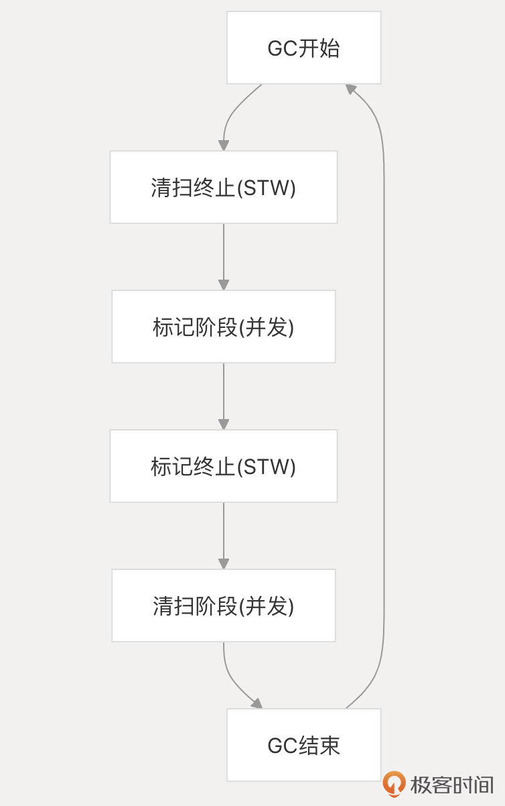
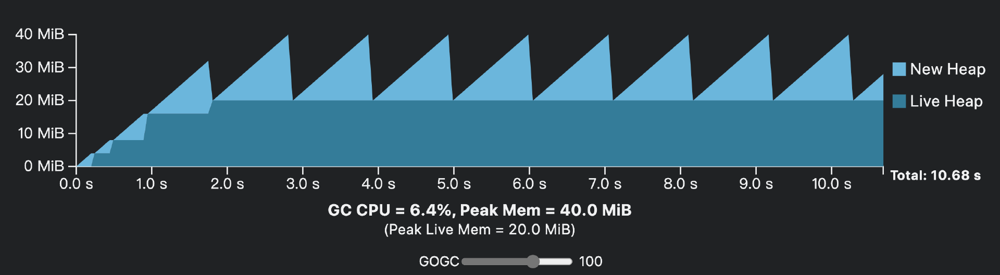
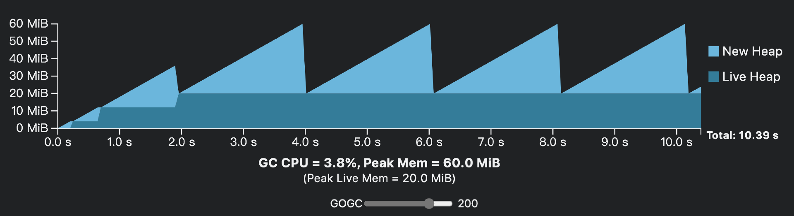
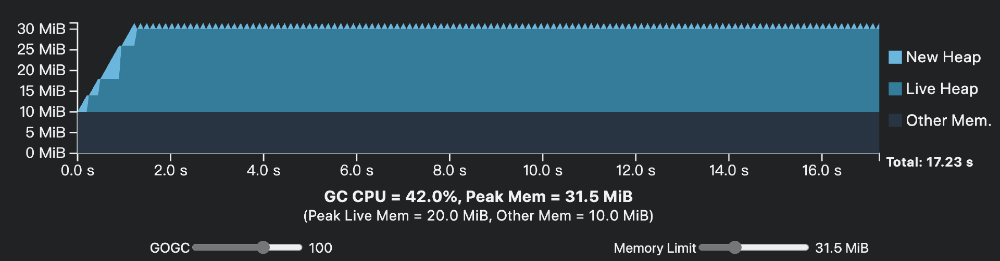

# 垃圾回收：便利≠免费，GC开销分析与优化实践
你好！我是Tony Bai。

Go语言最吸引人的特性之一，无疑是其内置的垃圾回收（GC）机制。它将我们从繁琐的手动内存管理中解放出来，让我们能更专注于业务逻辑，这无疑是巨大的便利。Go语言替我们承担了内存分配和回收的责任，大多数时候我们似乎无需关心内存细节。

但是，这份便利并非免费。GC在后台的辛勤工作，必然伴随着资源的消耗。你是否真正思考过：

- 这份“自动挡”的便利，究竟需要我们付出哪些隐性的性能代价？

- GC的工作（标记、清除、写屏障、标记辅助）具体是如何导致CPU消耗、内存占用增加和程序响应延迟的？

- 如何分析出自己程序中的GC开销有多大？哪些工具可以帮助我们？

- 更重要的是，作为进阶开发者，我们能采取哪些优化实践来编写“GC友好”的代码，在享受便利的同时，最大限度地降低其成本，构建真正高性能的Go应用？


仅仅享受GC的便利而不理解其成本，可能会让我们在面对性能问题时束手无策。 **只有深入分析GC开销的来源，并掌握行之有效的优化实践，才能在便利和性能之间找到最佳平衡点。**

这节课，我们就直面“便利≠免费”这一现实，一起深入理解GC的原理和使用成本，并学习优化使用成本的一些成熟业界实践。

## GC 基本原理

首先，我们要明白Go的内存管理。虽然Go负责管理值的存储，但开发者通常不需要关心具体位置。不需要GC管理的内存（比如函数局部变量且不发生逃逸）通常分配在goroutine的栈（Stack）上，这部分内存分配和回收非常高效。但是，当编译器无法确定一个值的生命周期时（比如动态大小的数据，或者被多处引用可能存活更久），这个值就会逃逸（escape）到堆（Heap）上。堆内存的分配是动态的，编译器和运行时无法预知其确切的生命周期，这时就需要GC介入来自动回收不再使用的堆内存。因此，Go GC的核心任务就是 **识别并回收堆上那些不再被程序使用的对象（垃圾）**。

### 追踪式 GC：对内存对象的可达性分析

Go和其他许多现代编程语言类似，采用的都是追踪式GC。其核心思想是对堆上内存对象的可达性分析。这种分析通常包括如下要素与执行过程：

- **根对象（Roots）**：程序中明确内存对象是否“存活”的起始点，根对象一般包括全局变量、栈上的局部变量和指针、寄存器等。

- **对象图（Object Graph）**：堆上的对象以及它们之间的指针引用关系构成了一个图。

- **追踪：** 从根对象出发，沿着指针引用关系遍历对象图。

- **标记：** 所有能够从根对象访问到的对象，都被认为是存活（Live）的，并被标记下来。

- **回收：** 所有遍历结束后仍未被标记的对象，就是不可达（Unreachable）的垃圾，它们占用的内存可以被回收。


追踪式GC的经典算法是标记-清除（Mark-Sweep）算法，该算法每次启动都要执行两个阶段的操作。

1. **标记（Mark）阶段：** 从根对象开始，递归遍历所有可达对象，打上标记。

2. **清除（Sweep）阶段：** 遍历整个堆，回收所有未标记的内存对象，即不可达对象。


### 并发三色标记和清除

不过传统Mark-Sweep算法的主要问题是，标记和清除阶段通常需要 **暂停整个应用程序（Stop-The-World，STW）**，导致程序卡顿。Go 1.4及之前的版本使用的都是这种经典标记-清除算法。

为了解决STW过长的问题，Go GC采用了允许标记过程与应用程序并发执行的策略。为了保证并发标记的正确性（即不能错误回收存活对象），Go从1.5版开始设计和实现了 **并发三色标记和清除**（Concurrent Tri-Color Marking-Sweeping）的GC算法，一直沿用至今。

该算法在应用程序并发运行时，还能保证标记的正确性（即正确识别所有存活对象，不遗漏也不错杀）。那么Go GC是如何协调的呢？用来追踪并发标记过程状态的三色标记法又是如何定义对象状态，并在这些状态间转换的呢？接下来，我们就详细看一下。

#### 内存对象的三色状态转换

Go GC使用的三色标记法将堆上内存对象逻辑上划分为三种状态（颜色）。

- **白色（White）**：代表对象尚未被GC访问过。在GC开始时，所有对象（除了初始的根对象集合）都是白色的。如果在标记阶段结束后，一个对象仍然是白色的，那么它就被认为是不可达的垃圾，将在清除阶段被回收。

- **灰色（Gray）**：代表对象已被GC访问过，但它引用的其他对象（子对象）尚未被完全处理。灰色对象是标记工作推进的“前线”。GC需要扫描灰色对象引用的对象，并将灰色对象自身标记为黑色。灰色对象是存活的，但GC的工作还没对它完成。

- **黑色（Black）**：代表对象已被GC访问过，并且它引用的所有对象也都被充分处理了（至少被标记为了灰色）。黑色对象是确定存活的对象，在本轮GC中不会被回收，并且GC不会再重新扫描黑色对象。


三色内存对象的状态转换示意图如下：


我们看到，在一个典型的GC标记周期中，对象颜色的转换遵循以下路径：

- 初始：所有对象皆白色。

- 开始：GC从根对象（全局变量、goroutine栈等）出发，将所有根对象直接引用的对象标记为灰色，放入待处理队列。

- 标记进行中：GC不断从灰色队列中取出对象。
  - 灰色 -\> 黑色：当GC处理完一个灰色对象，扫描了它引用的所有其他对象后，就将这个灰色对象标记为黑色。

  - 白色 -\> 灰色：在扫描一个灰色对象时，如果它引用了一个白色对象，那么这个白色对象会被标记为灰色，并放入待处理队列。同样，在并发标记过程中，如果应用程序（Mutator）修改了指针，使得一个黑色对象指向了一个白色对象，那么写屏障（Write Barrier）机制会介入，强制将这个被引用的白色对象标记为灰色，以防遗漏。
- 标记结束：当灰色队列为空时，并发标记阶段结束。此时堆上所有存活的对象都应该是黑色的。

- 下一周期：当下一轮GC开始时，所有对象（无论当前是什么颜色）的状态会重置为白色，开始新一轮的标记。


理解了这个三色标记模型和状态转换，我们就能更好地把握Go GC并发标记的核心逻辑，以及写屏障为何是必要的。接下来，我们再把这个模型放到实际的GC周期中，看看Go GC具体包含哪几个关键阶段。

#### Go GC的几个关键阶段

Go的垃圾回收器在一个GC周期内，大致会经历下图所示的几个关键阶段，这些阶段共同协作以回收不再使用的内存，同时力求将对应用程序运行的影响降至最低。理解这些阶段有助于我们认识GC的工作模式及其开销来源。



> 注：以下描述基于 Go 1.19+ 的 GC 实现，细节可能随版本演进。
>
> **首先是清扫终止（Sweep Termination）阶段。** 这是一个短暂的Stop-The-World（STW）暂停，发生在新一轮GC标记开始之前。在此期间，所有应用程序的 goroutine 都会暂停。在这一阶段，GC的主要任务是确保上一轮循环中识别出的所有垃圾内存都已清扫完毕并可供分配器使用，同时初始化下一轮标记所需的内部状态，并开启写屏障（Write Barrier）。 **写屏障是后续并发标记正确性的关键保障。** STW阶段的目标是极其短暂，通常在亚毫秒级别完成。

**紧随其后的是标记阶段（Mark Phase），这是GC工作的主要部分，并且与应用程序并发执行。** 在此阶段，写屏障处于激活状态，追踪应用程序对指针的修改。GC从根对象（全局变量、goroutine 栈等）出发，使用三色标记法递归地遍历对象图，标记所有可达的存活对象。如果应用程序分配内存的速度过快，超出了后台标记的速度，分配内存的goroutine可能会被要求执行标记辅助（Mark Assist），分担一部分标记工作，这会直接消耗应用程序的CPU时间。

当并发标记接近完成时，会进入第二个短暂的Stop-The-World（STW）阶段——标记终止（Mark Termination）。 **此阶段的目标是最终完成所有标记工作，处理并发期间因写屏障记录的指针变更，并确保没有遗漏任何存活对象。** 完成后，写屏障会被关闭，因为不再需要追踪后续的指针修改。同时，运行时会根据当前存活堆的大小计算并设定下一次GC的触发目标。这个 STW 同样力求短暂。

**最后是清扫阶段（Sweep Phase），它也与应用程序并发执行。** 在此阶段，GC遍历堆内存，将所有在标记结束后仍然是白色（未被标记）的对象所占用的内存空间回收，使其可用于未来的内存分配。这个过程通常是按需（惰性）和后台结合进行的，即应用程序在需要分配内存时可能会触发一小部分清扫，同时也有后台goroutine持续进行清扫工作。清扫的主要目的是让内存可重用，其本身的CPU开销相比标记阶段要小得多。

**理解这四个阶段的交替进行、并发特性以及两个短暂的 STW 时刻，是我们分析Go GC行为和性能影响的基础。**

但还有一个关键问题：GC 是在什么时候开始工作的？又是如何控制自己的节奏，避免过多影响应用程序的呢？这就涉及GC的触发与 Pacer 调速机制了。

#### GC 触发与 Pacer 调速：何时开始？如何进行？

Go GC并不会在每次内存分配后都运行，而是遵循一定的策略来决定何时启动新一轮的回收周期。我们来看下主要的触发时机。

**基于堆大小阈值（GOGC）是最主要的触发方式。** Go运行时会监控程序分配的堆内存。一旦当前已分配的堆内存大小达到上一次GC结束后活动堆大小加上由GOGC百分比计算出的额外内存量这个目标时，就会触发新一轮GC。 `GOGC` 环境变量（或通过 `debug.SetGCPercent` 设置）控制了这个百分比，默认值是 100，意味着当堆大小增长到上次标记后活动对象大小的两倍时触发GC。

计算公式大致为：

```plain
Target heap memory = Live heap + (Live heap + GC roots) * GOGC / 100

- Target heap memory: 目标堆内存
- Live heap: 上次活动堆

```

这个机制是Go在CPU开销和内存占用之间进行权衡的核心参数。

**基于时间也是主要的触发时机。** Go 运行时还有一个后台监控 goroutine（sysmon），它会定期（默认2分钟）检查是否需要强制触发一次GC，即使堆大小未达到阈值。这主要是为了防止在分配速率极低的程序中，内存无限期增长或者某些需要清理的资源（如 Finalizer）迟迟得不到处理。

**我们再来看基于内存限制的触发时机。** 在Go 1.19+版本中，开发者可以通过GOMEMLIMIT环境变量或debug.SetMemoryLimit函数设置一个Go程序内存使用的软上限。当Go运行时检测到程序使用的总内存（堆外内存+堆内存）接近这个限制时，会更积极地触发GC，甚至可能覆盖GOGC的设定，以尝试将内存控制在限制之下。

**最后是手动触发时机。** 调用runtime.GC()可以显式地强制执行一次GC。但这通常只用于调试或特定测试场景，不推荐在生产代码中常规使用。

一旦GC被触发（主要是基于GOGC阈值），Go运行时并不会简单地全速运行GC直到结束。为了平衡GC的执行效率和对应用程序性能的影响（特别是延迟），Go引入了Pacer机制来动态调整GC的步调。

Pacer的核心目标是： **在下一次堆大小达到触发阈值之前，平稳地完成当前的GC标记阶段，同时将GC本身消耗的CPU资源控制在一个合理范围内（默认目标是低于25%）**。它通过持续监控应用程序的内存分配速率和GC自身的标记进度，动态地计算出需要在多长时间内完成标记，并据此调整后台标记工作量和标记辅助触发。

- **后台标记工作量**：分配给专门的后台GC goroutine的标记任务量。

- **标记辅助（Mark Assist）触发**：当应用程序分配内存过快，Pacer预测无法按时完成标记时，会要求分配内存的goroutine承担一部分“标记税”，即暂停业务逻辑去辅助GC进行标记。Pacer会根据需要动态调整触发标记辅助的阈值。


Pacer机制就像一个智能的巡航控制系统，它试图让GC过程尽可能平滑，避免因GC活动导致应用程序性能剧烈波动或长时间卡顿，是Go GC实现低延迟目标的关键技术之一。

理解了Go GC的基本原理——并发三色标记清除算法，以及其精巧的触发和Pacer调速机制后，我们就能更清晰地认识到Go GC与其他GC实现相比所展现出的独特 **特点**。这些特点正是Go语言在并发性能和低延迟方面表现出色的关键所在。接下来，我们就来具体看看Go GC的核心特性。

## Go GC 的关键特点

理解了Go GC的基本原理，我们再来简单看看Go GC区别于其他一些GC实现的关键特点。

**并发是Go GC设计的核心。** 主要的标记和清除阶段都与应用程序goroutine并发执行，最大限度减少对程序运行的阻塞。

**然后我们来看低延迟。** 虽然大部分工作并发执行，Go GC仍需要在特定时刻短暂地暂停所有goroutine（Stop-The-World，STW）来完成一些关键同步操作。Go GC通过精心设计（如并发标记、并发栈扫描等）将STW的时间控制得非常短。

就像上面所描述的那样，目前一个GC周期通常仅包含两次短暂STW，一个是标记终止（Mark Termination），即并发标记结束后，短暂STW以完成标记并关闭写屏障。另外一个是清扫终止（Sweep Termination）/标记准备（Mark Setup）：清除完成后，短暂STW以开启写屏障，为下一轮并发标记做准备。Go团队的目标是将这些STW的P99延迟控制在亚毫秒级别，这对低延迟应用至关重要。

为了保证并发标记的正确性（应用程序修改指针时不丢失存活对象），Go GC使用了写屏障（Write Barrier - Hybrid）。 **写屏障是编译器插入的一小段代码，在指针写入时触发，用于通知GC可能需要重新扫描某些对象**。Go 1.8引入的混合写屏障在保证正确性的前提下，尽量降低了写屏障的运行时开销。

**下一个特点是非分代（Non-Generational）。** 与Java等常见GC不同，Go GC不区分年轻代和老年代，每次GC都会扫描整个活动堆（Live Heap）。这个方案的优点是实现相对简单，避免了对象代际晋升的复杂性和开销。但缺点也很明显，那就是可能需要反复扫描生命周期很长的对象，增加了标记的工作量。

前面提到过，Go运行时使用Pacer机制来动态调整GC的节奏。它根据堆内存的增长速率、目标堆大小（由 `GOGC` 控制）等因素，计算出GC需要在何时完成标记阶段，并据此控制后台标记goroutine的数量和触发“标记辅助”（让业务goroutine参与标记）的频率。目标是在不显著影响应用性能（GC CPU占用率目标 < 25%）的前提下及时完成GC，防止内存无限增长。

上述这些特点共同构成了Go GC的核心竞争力： **以并发实现低延迟，并通过Pacer和写屏障等机制在效率和正确性之间取得平衡**。

## 理解 GC 开销对程序性能的影响

我们已经知道，Go的自动内存管理带来了巨大的开发便利。垃圾收集器（GC）默默地承担了内存回收的重任，让开发者可以专注于业务逻辑。然而，这份便利并非没有代价。GC的运行必然会消耗系统资源，并对应用程序的性能产生影响。理解这些所谓的“GC开销”对于编写高性能Go应用和进行有效的性能调优至关重要。

**GC开销最直接的体现是CPU消耗。** 这部分开销主要来自几个方面。

首先，Go运行时会启动专门的后台goroutine来执行并发的标记和清除操作，这本身就会占用一部分CPU时间。

其次，也是对应用程序吞吐量影响更直接的因素，是标记辅助（Mark Assist）机制。当应用程序分配新内存的速度过快，以至于后台GC的标记工作跟不上时，为了防止堆内存失控，正在分配内存的业务goroutine会被运行时“征用”，暂停自己的工作，转而去帮助GC完成一部分标记任务。这种“标记税”是直接从业务goroutine的CPU时间里扣除的，分配越频繁、越快的goroutine，需要承担的辅助工作就越多。

最后，虽然Go GC力求缩短STW时间，但在两次短暂的STW（Stop-The-World）期间，应用程序完全暂停，CPU资源完全由GC接管，用于完成必要的同步和准备工作。

**除了CPU，GC还会带来内存开销。**

一方面，GC本身需要维护一些元数据，例如标记位图、对象类型信息等，这些元数据需要占用额外的内存空间。

另一方面，由于GC并非实时回收，而是在堆内存增长到一定阈值（由GOGC参数控制）时才触发，因此在两次GC周期之间，堆内存会持续增长。这意味着程序的峰值内存占用（RSS）会显著高于实际存活对象所需的内存（Live Heap）。调整GOGC参数实际上是在CPU开销（GC频率）和峰值内存占用之间进行空间换时间的权衡：更高的GOGC值意味着更低的GC频率和CPU开销，但更高的内存峰值。

最后，GC还会引入延迟开销（Latency）。最明显的是两次STW停顿，虽然Go力求将其控制在亚毫秒级，但对于延迟极其敏感的应用，这仍然是需要考量的因素，它直接影响了请求处理的最坏情况响应时间。此外，标记辅助也会导致业务goroutine的执行被短暂暂停，增加其处理延迟。同时，GC的后台工作和标记辅助任务也会与业务goroutine竞争CPU资源，可能对调度产生影响，间接增加延迟。不容忽视的还有写屏障开销，虽然混合写屏障已经过优化，但每次相关的指针写入操作仍会引入微小的CPU开销，对于指针操作密集的代码，这种累积效应可能变得显著。

那么，我们该如何观察和量化这些GC开销呢？

Go生态系统提供了多种工具。例如，通过设置GODEBUG=gctrace=1环境变量，可以在运行时获得详细的GC日志，了解GC频率、持续时间、STW时长、堆大小变化和GC CPU占比等关键信息。

程序内部也可以通过runtime.ReadMemStats()函数获取内存和GC的统计数据。更深入的分析则可以依赖runtime/pprof进行CPU和内存剖析，或者使用go tool trace进行细粒度的事件追踪。关于这些工具的使用方法和案例分析，我们将在后续工程实践篇中详尽讲解。现在最重要的是建立起GC并非零成本的意识，并了解其主要的开销维度。

理解了GC开销的来源和表现形式后，一个自然的问题是： **我们能做些什么来降低这些开销，让我们的Go程序运行得更高效呢**？虽然可以通过调整GC参数（如 `GOGC`、 `GOMEMLIMIT`）来进行时空权衡，但这通常是最后的手段，且需要深厚的理解和充分的测试。对于大多数开发者来说，更有效、更安全、也更符合Go设计哲学的方式，是从源头做起——编写GC友好（GC-friendly）的代码。接下来，我们就探讨一些业界成熟的、通过改进编码实践来优化GC性能的方法。

## 编写 GC 友好代码

编写对GC友好的代码核心， **在于理解GC的主要工作负担来自于管理堆内存上的对象以及扫描其中的指针**。因此，优化的关键思路就是尽可能地减少这两方面的工作量。

首先，最核心的优化方向是减少不必要的堆分配。分配在堆上的对象越少，GC需要标记、扫描和最终回收的工作量就越小，GC的触发频率也可能随之降低，因标记辅助（Mark Assist）而暂停业务逻辑的情况也会减少。

**一种有效的策略是对象复用。** 对于那些生命周期短但创建开销大的临时对象（比如网络连接中用于读写的缓冲区），可以使用 `sync.Pool` 来缓存和复用它们，避免在每次需要时都重新分配内存。

```go
package main

import (
    "bytes"
    "fmt"
    "sync"
)

// 创建一个用于缓存 bytes.Buffer 的 Pool
var bufferPool = sync.Pool{
    New: func() interface{} {
        fmt.Println("Allocating new buffer") // 打印日志观察分配次数
        return new(bytes.Buffer)
    },
}

func processRequest(data []byte) string {
    buf := bufferPool.Get().(*bytes.Buffer) // 从 Pool 获取 Buffer
    defer bufferPool.Put(buf)              // 使用 defer 确保放回 Pool
    buf.Reset()                            // 重置 Buffer 状态
    buf.Write(data)                        // 使用 Buffer
    // ... 其他处理 ...
    return buf.String()
}

func main() {
    // 模拟处理多个请求
    processRequest([]byte("request 1 data"))
    processRequest([]byte("request 2 data"))
    // 如果并发量高，会看到 "Allocating new buffer" 打印次数远少于请求次数
}

```

其次，在处理字符串时，要特别注意高效的字符串操作。由于Go字符串是不可变的，在循环中使用 `+` 或 `+=` 进行大量字符串拼接会导致频繁创建新的字符串对象和底层字节数组，产生大量需要GC回收的垃圾。正确的做法在之前的讲解中也提到过（这里就不再举例赘述了），那就是使用 `strings.Builder` 或预先分配足够容量的 `[]byte` 缓冲区拼接，最后再一次性生成结果字符串。

另外，对于切片（slice）和map这两种常用的动态数据结构，预分配容量也是一个重要的GC优化手段。如果你能在创建它们时大致预估到最终需要存储多少元素，使用 `make([]T, length, capacity)` 或 `make(map[K]V, size)` 来指定初始容量，可以显著减少甚至避免后续因动态扩容而引发的内存重新分配和数据拷贝，从而降低GC压力。

除了减少堆分配，我们还可以尝试利用栈分配（Stack Allocation）。Go编译器会进行逃逸分析（Escape Analysis），判断一个变量的生命周期是否超出了其声明的函数范围。如果变量不“逃逸”，编译器会优先将其分配在函数调用栈上，栈内存的分配和回收非常快，且完全不需要GC介入。我们可以通过 `go build -gcflags='-m'` 命令来观察变量是否逃逸，并尝试调整代码（比如对于小型数据使用值传递而非指针传递、限制变量的作用域等）来促使变量留在栈上。

```go
package main

import "fmt"

// Point 结构体较小
type Point struct {
    X, Y int
}

// 返回值是指针，p 会逃逸到堆上
//go:noinline
func createPointPtr(x, y int) *Point {
    p := Point{X: x, Y: y}
    return &p // 返回了局部变量 p 的地址，p 必须逃逸
}

// 返回值是值，p 可能分配在栈上 (取决于调用者如何使用返回值)
//go:noinline
func createPointVal(x, y int) Point {
    p := Point{X: x, Y: y}
    return p
}

func main() {
    p1 := createPointPtr(1, 2) // p1 指向堆上的 Point
    p2 := createPointVal(3, 4) // p2 是栈上的 Point (在 main 的栈帧中)
    fmt.Println(p1, p2)
}

```

针对上述示例，运行 `go build -gcflags='-m' ./…` ，可以看到 `p moves/escapes to heap` 的输出。

**另一个减少GC工作量的角度是减少需要扫描的指针数量。** GC标记阶段的核心工作就是遍历对象图中的指针。如果我们的数据结构中包含的指针更少，GC扫描的工作量自然就减少了。例如，对于只包含基本类型（如 `int`、 `float`、 `bool`）而没有任何指针（包括slice、map、string、interface、channel以及指针类型字段）的结构体或数组，GC可以快速跳过它们的内部扫描。在设计数据结构时，如果可能，优先使用值类型而非指针，或者使用整数索引来代替指针引用数组/切片中的元素，都可以降低指针密度。将结构体中的指针字段集中声明在前面，也可能帮助GC在某些情况下提前结束对该结构体的扫描（依赖具体实现）。

```go
package main

import "fmt"

// 结构体 A 包含指针 (string 内部有指针)
type StructA struct {
    ID   int
    Name string // 指针类型
    Data [10]int
}

// 结构体 B 不含指针
type StructB struct {
    ID   int
    Flag bool
    Data [10]int // 值类型数组
}

// 使用索引代替指针
type Node struct{ value int }
type Graph struct {
    nodes []Node
    edges [][]int // 存储索引，而非 *Node
}

func main() {
    a := StructA{ID: 1, Name: "contains pointer"}
    b := StructB{ID: 2, Flag: true}
    // GC扫描 a 时需要检查 Name 字段指向的字符串数据
    // GC扫描 b 时，检查完 Flag 就可以跳过 Data 数组内部（因为它不含指针）
    fmt.Println(a.Name, b.Flag)

    // 对于 Graph，GC 只需扫描 nodes 切片头和 edges 切片头及其内部的 int 切片头
    // 无需深入扫描 Node 结构体内部或跟踪大量节点间指针
}

```

最后，虽然我们强调通过优化代码来改善GC性能是首选，但Go运行时确实提供了两个关键的调优参数——GOGC和GOMEMLIMIT——它们允许我们更直接地干预GC的行为，在时间和空间之间进行权衡。不过， **调整这些参数应被视为最后的手段**，并且必须基于充分的理解、监控数据和性能测试。

GOGC这个参数控制着GC的触发频率。默认值是100，表示当新分配的堆内存达到上次GC后活动堆大小的100%时，触发新一轮GC。如图所示：



而 **增大GOGC**，比如设置为200会降低GC的触发频率，可以对比下图：



我们看到，增大GOGC可以减少GC的总CPU开销（包括STW时间、后台标记和标记辅助），GC CPU占用从6.4%下降为3.8%。但这是以 **增加程序的峰值内存占用** 为代价的（上面图中Peak Mem从40MB升高到60MB）。反之， **减小GOGC**（比如设置为50）会增加GC频率和CPU开销，但能更早地回收内存，降低峰值内存占用。这是一个经典的时间（CPU）换空间（内存）的权衡。

Uber在其大规模实践中发现，许多Go服务配置的CPU与内存比例（如1:1或1:2）低于宿主机的比例（如1:5），这意味着服务有额外的内存空间可以利用。通过 **动态地、基于实际内存使用情况和容器限制来调整GOGC**，而不是使用固定的默认值或手动设置一个保守值， [Uber成功地在30多个关键服务中节省了约7万个CPU核心的开销](https://www.uber.com/blog/how-we-saved-70k-cores-across-30-mission-critical-services/)。他们的GOGCTuner库会根据容器的内存限制动态计算合适的GOGC值，旨在将堆内存使用率维持在一个目标百分比（如70%），从而在不超出内存限制的前提下，最大限度地降低GC频率。

GOMEMLIMIT（Go 1.19+）这个参数（或对应的环境变量）允许我们为Go程序设置一个内存使用软上限。它限制的是Go运行时可使用的总内存量（大致等于runtime.MemStats中的Sys - HeapReleased）。当程序总内存使用接近这个限制时，即使未达到GOGC设定的堆增长阈值，GC也会被更积极地触发，以尝试将内存控制在限制内，如下面示意图：



这个机制特别适用于容器化部署场景，可以帮助避免因内存超限而被容器运行时（如Kubernetes）OOM Kill。设置GOMEMLIMIT的经验法则是，将其设为容器内存限制的90%-95%，为Go运行时无法感知的其他内存开销（如CGO分配的内存、操作系统开销等）留出一些余地。需要注意的是，GOMEMLIMIT是一个软限制。为了避免应用程序因过于频繁的GC而完全卡死（称为 “Thrashing”），Go运行时设定了一个GC CPU使用率上限（大约50%）。如果内存压力极大，即使GC尽力回收，程序使用的内存仍可能短暂超过GOMEMLIMIT。在这种情况下，虽然避免了GC导致的完全饿死，但程序性能会显著下降（比如，上图中GC CPU占用已经达到了42%），甚至可能最终还是被OOM Kill。因此，不能完全依赖GOMEMLIMIT来防止OOM，它更多是作为一道防线，并鼓励GC在内存接近上限时更早介入。

**ballast技术与GOMEMLIMIT的关系：** 在GOMEMLIMIT出现之前，社区常用一种名为ballast（压舱石）的技术来间接控制GC频率。其原理是在程序启动时分配一个非常大但不实际使用的虚拟内存块（如 `make([]byte, 10<<30)`）。由于Go GC将这个ballast视为活动堆的一部分，根据 GOGC=100 的规则，只有当新分配的内存也达到ballast那么大时才会触发GC，从而大大降低了GC频率。

```plain
func main() {

    // Create a large heap allocation of 10 GiB
    ballast := make([]byte, 10<<30)

    // Application execution continues
    // ...
    runtime.KeepAlive(ballast) // make sure the ballast won't be collected
}

```

GOMEMLIMIT的引入在某种程度上提供了官方的、更健壮的替代方案。如果你希望达到类似ballast的效果（即只在内存接近某个硬限制时才GC），理论上可以将GOGC设为off（或-1），然后仅依赖GOMEMLIMIT来触发GC。然而，Go官方和Uber的实践都表明， **除非特殊情况，不建议完全关闭基于GOGC的常规GC**。因为GOMEMLIMIT仅在内存接近上限时才介入，可能导致GC行为变得很不稳定，并且在内存压力大时仍有Thrashing风险。

更好的做法是， **同时设置一个合理的GOMEMLIMIT**（如容器限制的90%） **和一个相对保守的GOGC值**（可能仍是默认的100，或者根据应用的平均内存使用情况略微调高），让GOGC处理常规情况下的GC触发，而GOMEMLIMIT作为一道安全防线。

通过实践这些GC友好的编码方式和审慎的参数调整，我们可以从源头上减少GC的压力，在享受Go自动内存管理便利的同时，构建出性能更佳、资源利用更高效的应用程序。

## 小结

这节课，我们深入探讨了Go语言的垃圾回收机制，核心聚焦于“便利≠免费”这一主题，重点分析了GC的开销来源，并学习了切实可行的优化实践。

1. **便利的代价：** 我们认识到，Go GC提供的自动内存管理虽然极大地方便了开发，但其运行必然伴随着CPU消耗（后台标记、标记辅助、STW）、内存开销（元数据、堆增长）和潜在的 延迟影响（STW、调度干扰）。理解这些成本是进行优化的前提。

2. **开销来源分析：** 我们了解了这些开销产生的具体环节，包括并发标记和清除过程本身、保证并发安全的混合写屏障、以及为追赶分配速度而引入的标记辅助（Mark Assist）机制等。我们也知道了非分代设计意味着每次GC都需要全堆扫描。

3. **优化实践核心：** 最重要且对开发者最可控的优化手段，在于编写GC友好的代码。
   - **减少堆分配：** 这是降低GC压力的根本。通过对象复用（ `sync.Pool`）、高效字符串处理（ `strings.Builder`）、预分配容量（ `make` 带cap）、利用栈分配（关注逃逸分析）等方式，从源头上减少需要GC管理的对象数量。

   - **减少指针使用：** GC的工作量与指针密度相关。合理使用值类型、索引替代指针、优化结构体字段布局（指针集中或无指针）有助于降低扫描成本。

   - **（谨慎）调整GC参数：** `GOGC` 和 `GOMEMLIMIT` 提供了时空权衡的手段，但应在充分理解和测试的基础上使用，通常作为代码优化的补充。

总的来说，虽然Go GC本身在不断进化和优化，但作为进阶开发者，我们不能完全依赖运行时。通过分析GC开销（利用 `gctrace`、 `pprof` 等工具）并积极采取优化实践（尤其是减少不必要的堆分配），我们可以在享受Go GC便利的同时，构建出性能表现更佳、资源利用更高效的应用程序。记住，对GC最好的优化，往往发生在GC之外——在我们的代码设计和内存使用习惯之中。

## 思考题

我们提到Go GC是非分代的，每次都会扫描整个活动堆。而像Java等语言的GC通常采用分代策略，更频繁地回收年轻代对象。

请思考：

1. 你认为Go选择非分代GC可能有哪些优缺点（可以从实现复杂度、特定场景性能、内存碎片等方面考虑）？

2. 在什么类型的Go应用程序或工作负载下，非分代GC可能会表现得相对更好？在什么情况下可能会成为劣势？


欢迎在留言区分享你的看法！我是Tony Bai，我们下节课见。
