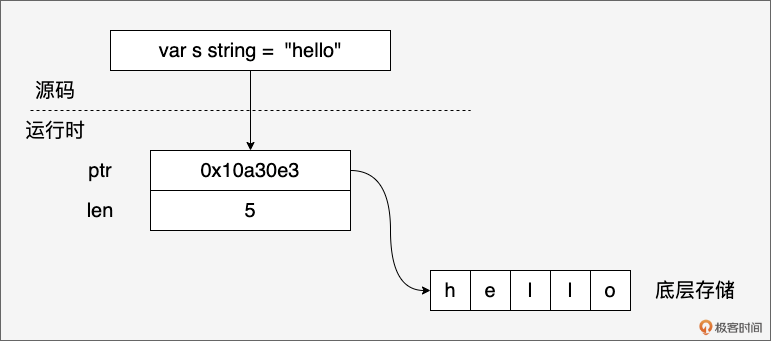
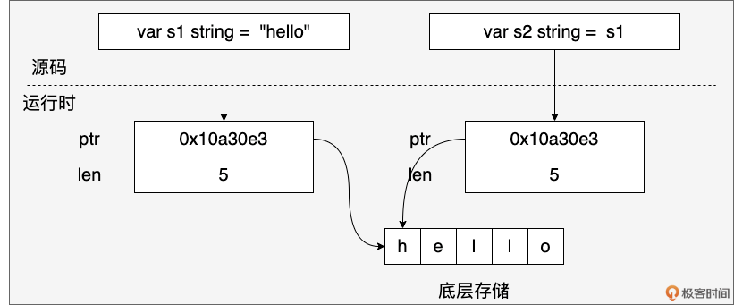
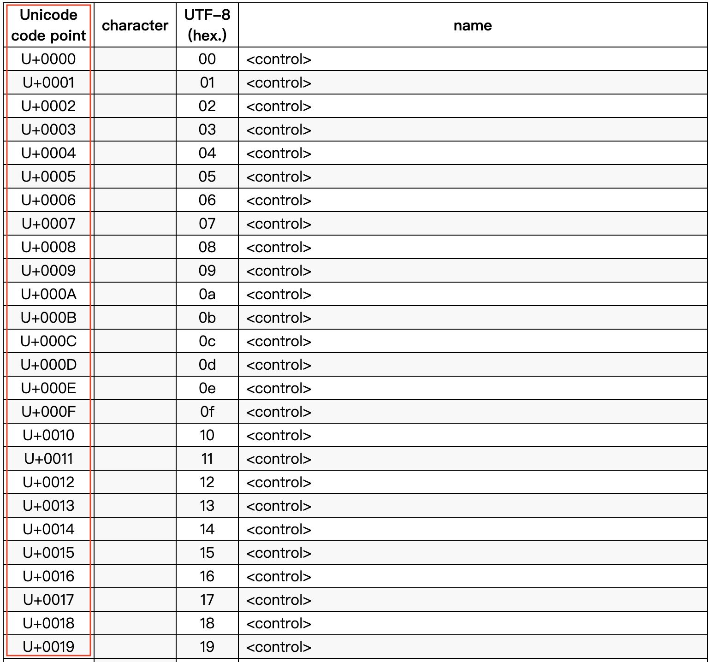
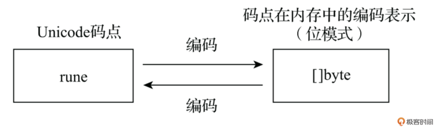

# 字符串：不只是字节序列，揭秘rune、UTF-8与高效操作
你好，我是 Tony Bai。

在 Go 语言中，string 是我们几乎每天都要打交道的基本数据类型。但你是否真正理解它的“内心世界”？

Go 的字符串就像一首精妙的“二重奏”：有时，它表现为一串连续的字节（bytes），你可以对它进行索引、切片，就像操作字节数组一样；有时，它又展现为一串字符（characters），你可以用 for range 优雅地遍历其中的字符，无论它们占多少字节。

这种两面性是如何实现的呢？此外：

- 当我们处理包含中文、日文或其他非 ASCII 字符的文本时，如何确保正确性？
- Go 是如何在底层表示字符串和字符的？rune 类型到底是什么？
- UTF-8 编码在其中扮演了什么角色？
- string 和 \[\]byte 之间频繁转换，性能开销如何？Go 编译器又为我们做了哪些“零拷贝”优化？
- 拼接大量字符串时，用原生连接操作符 `+` 和用 strings.Builder 有多大差别？

如果你对这些问题还有模糊之处，那么这节课就是为你准备的。 **不深入理解字符串的“二重奏”本质，就可能在处理多语言文本时踩坑，或者在性能敏感的场景写出低效的代码。**

这节课我们将深入学习 Go 字符串的内部实现、字符编码，以及如何高效地操作字符串，理解它“二重奏”的精髓。掌握了这些，你就能更自信、更高效地驾驭 Go 字符串这个强大的工具。

## 字节与字符：字符串的“两面性”

Go 语言的字符串有一个核心特性： **不可变性（immutability）**。一旦创建，字符串的内容就不能被修改。在这个前提下，我们可以从两个视角来看待它。

#### 视角一：字符串是字节序列

从这个角度看，字符串（s）表现得像一个只读的字节数组。

- **可按字节索引**

你可以通过下标访问特定位置的字节，下标范围是 0 到 len(s)-1。

```
s := "hello"
fmt.Printf("s[0]: %c (byte value: %d)\n", s[0], s[0]) // 输出 s[0]: h (byte value: 104)

```

注意：如果示例中的 s 包含多字节字符（比如中文字符），s\[i\] 访问的只是其中的一个字节。

- **可按字节切片**

你可以使用切片操作 s\[low:high\] 来获取一个新的字符串，它引用了原始字符串底层字节序列的一部分。 **这个操作非常高效，因为它们共享底层字节数组**，不会创建新的数据副本。

```
s := "hello, world"
s1 := s[:5]  // 获取 "hello"
s2 := s[7:]  // 获取 "world"
fmt.Println(s1, s2) // 输出 hello world

```

#### 视角二：字符串是字符序列

从这个角度看，字符串代表了一连串的 Unicode 字符。

- **可按字符迭代**

使用 for range 循环可以遍历字符串中的每一个 Unicode 字符（rune），无论这个字符由多少个字节组成。

```
s := "你好，世界！" // 包含中文字符和全角标点
for index, char := range s {
    // index 是字符起始字节的索引
    // char 是 rune 类型的值 (Unicode 码点)
    fmt.Printf("字节索引 %d, 字符 %c, Unicode码点 %U\n", index, char, char)
}

```

上面代码输出结果如下：

```
字节索引 0, 字符 你, Unicode码点 U+4F60
字节索引 3, 字符 好, Unicode码点 U+597D
字节索引 6, 字符 ，, Unicode码点 U+FF0C
字节索引 9, 字符 世, Unicode码点 U+4E16
字节索引 12, 字符 界, Unicode码点 U+754C
字节索引 15, 字符 ！, Unicode码点 U+FF01

```

注意观察 index 的变化，它不是连续递增的，因为每个中文字符和全角标点占用了 3 个字节。

- **原生 Unicode 支持**

Go 字符串在设计上天然支持 Unicode。你可以使用标准库 unicode/utf8 中的函数来精确计算字符数量、进行 utf8 编解码等，下面是一个示例：

```
import "unicode/utf8"

s := "Hello, 世界！你好，Go"
fmt.Println("字节长度 (len):", len(s))                 // 输出 27 (bytes)
fmt.Println("字符数量 (RuneCountInString):", utf8.RuneCountInString(s)) // 输出 15 (runes/characters)
// 也可以通过转换为 []rune 来获取字符数量
fmt.Println("字符数量 ([]rune):", len([]rune(s)))      // 输出 15

```

这两种视角看似不同，实则都源于 Go 字符串的底层表示和编码方式。要理解这种统一，我们需要先看看字符串在内存中到底长什么样，以及 rune 到底是什么。

## rune 类型：Go 如何表示 Unicode 字符？

虽然我们在源码层面感觉字符串像字符序列或字节序列，但在 Go 的运行时，一个 string 变量实际上是一个简单的结构体，包含两个字段：



```
// $GOROOT/src/runtime/string.go
type stringStruct struct {
    str unsafe.Pointer
    len int
}

```

其中：

- str 指针指向一块内存，这块内存存储了字符串的字节序列。
- len 字段表示字符串的字节长度，而不是字符数量。

这种设计的关键在于： **字符串是不可变的字节序列**。当我们创建一个字符串时，Go 会分配一块内存来存储字符串的字节数据，并将 ptr 指向这块内存的起始地址。由于字符串不可变，多个字符串变量可以共享同一个底层字节数组，从而节省内存空间。例如：

```
s1 := "hello"
s2 := s1

```

s1 和 s2 会共享同一个底层字节数组，如下图所示：



如果基于 s1 获取子字符串 s3，s3 也与 s1 共享同一块底层内存。

```
s3 := s1[1:4] // s3 ("ell") 也指向 s1 的部分内存

```

字符串底层是一个字节数组，那字符在哪里呢？接下来，我们就来看看 Go 语言是如何表示一个字符的。

Go 语言使用的是 Unicode 字符，无论是英文字母、数字、中文汉字或是其他符号等，在 Go 中都是一个 Unicode 字符，比如：

```
c1 := 'a'
c2 := '世'
c3 := '☺'

```

在 Go 源码层面，每个 Unicode 字符是由一个 rune 类型表示的，也就是说上面代码中的 c1、c2 和 c3 都是 rune 类型的变量。在 Go 中，rune 类型本质是一个 int32 类型，在 `$GOROOT/src/go/builtin/builtin.go` 中，你可以看到下面代码：

```
// $GOROOT/src/builtin/builtin.go

// rune is an alias for int32 and is equivalent to int32 in all ways. It is
// used, by convention, to distinguish character values from integer values.
type rune = int32

```

我们看到 rune 类型是 int32 类型的一个别名（alias），rune 类型变量（比如 c1）中存储的值是一个 Unicode 码点（code point）。

码点就是 Unicode 字符在 Unicode 字符表中的唯一序号，序号是一个数字，如下图：



我们可以通过将字符串转换为 \[\]rune 的方式，来获取其包含的所有字符的码点序列：

```
import "encoding/hex"

s := "中国人"
runes := []rune(s) // 转换为 rune 切片

for i, r := range runes {
    // %c 打印字符，%U 打印 Unicode 码点表示 (U+XXXX)
    fmt.Printf("Index %d: Char '%c', Rune %d, Code Point %U\n", i, r, r, r)
}
fmt.Println(hex.Dump([]byte(s)))

```

输出：

```
Index 0: Char '中', Rune 20013, Code Point U+4E2D
Index 1: Char '国', Rune 22269, Code Point U+56FD
Index 2: Char '人', Rune 20154, Code Point U+4EBA
00000000  e4 b8 ad e5 9b bd e4 ba  ba                       |.........|

```

现在问题来了：我们看到字符的码点（如 20013）和字符串底层存储的字节（如上面的 e4 b8 ad …）并不一样。

这说明， **Go 字符串并没有直接存储码点，而是将码点进行了编码（encoding），然后存储编码后的字节序列**。Go 选择的编码方式，正是大名鼎鼎的 UTF-8。

接下来，我们就来看看这种使用最为广泛的 Unicode 字符编码方式。

## UTF-8 编码：字符串的底层存储奥秘

Unicode 字符编码就是将抽象的 Unicode 码点（一个整数）转换为用于存储或传输的具体字节序列的过程。反过来，将字节序列转换回码点的过程称为解码（decoding）。

下图展示了 Unicode 字符从抽象的码点（code point）到具体的内存表示（字节序列）之间的转换过程。



Unicode 字符有很多种编码方案，比如：UTF-8、UTF-16、UTF-32 等，其中 UTF-8 编码方案是应用最为广泛的一种，Go 默认使用 UTF-8 编码来存储 Unicode 字符。

上面示例中输出的 e4 b8 ad e5 9b bd e4 ba ba 就是字符串"中国人"经过 UTF-8 编码后得到的字节序列，即内存表示。

UTF-8 是一种可变长度编码，对于 ASCII 字符使用 1 个字节，对于其他字符使用 2～4 个字节，上面的中文字符使用的就是 3 字节的编码。

这种编码方式具有兼容性好（比如完全兼容 ASCII 字符)、节省空间（对于英文和其他拉丁字母的文本，UTF-8 使用的字节数较少，仅 1 字节）等优点。

**正是因为 UTF-8 编码的存在，我们才需要区分遍历字符串的字节和字符。** 前面我们已经展示了用 for range 遍历字符串的字符序列，那么如何遍历字符串的字节序列呢？

要遍历字节序列，需要使用到经典的三段式 for 循环：

```
package main

import (
    "fmt"
)

func main() {
    s := "中国人"

    for i := 0; i < len(s); i++ {
        fmt.Printf("%d: %x\n", i, s[i])
    }
}

```

该示例输出结果如下：

```
0: e4
1: b8
2: ad
3: e5
4: 9b
5: bd
6: e4
7: ba
8: ba

```

注意，示例中的 len 函数返回的是字符串的字节数量，而不是字符数量。从输出结果也可以看到："中国人"这个字符串的 UTF-8 编码占用了 9 个字节。

理解了 Go 字符串和字符的表示和编码后，我们再来看一个非常重要的实践环节：字符串与字节切片（\[\]byte）的相互转换。我们将深入探讨这两种类型之间的转换机制，以及 Go 编译器在背后所做的优化工作。

## 零拷贝优化：字符串与字节切片的转换

在 Go 编程中，我们经常需要在 string 和 \[\]byte 之间进行转换。

- 字符串转字节切片

```
s := "hello"
b := []byte(s) // 分配新的字节切片，并将"hello"的内容复制到切片中
b[0] = 'H'
fmt.Println(s) // 输出"hello"，s不变

```

- 字节切片转字符串

```
b := []byte{'h', 'e', 'l', 'l', 'o'}
s := string(b) // 分配新的字符串，并将b的内容复制到字符串中
b[0] = 'H'
fmt.Println(s) // s不变，输出"hello"，

```

上面的字符串和字节切片之间的转换看似简单，但在底层却可能涉及内存分配和数据拷贝。为什么呢？

字符串是不可变的，而字节切片是可变的。这意味着每次将字节切片转换为字符串时，Go 运行时都需要分配一块新的内存来存储字符串数据，并将字节切片的内容复制到新分配的内存中。

反之，将字符串转换为字节切片时，也需要分配新的字节切片内存，并复制字符串的数据。这种频繁的内存分配和数据拷贝会带来以下问题。

- 性能开销：内存分配和数据拷贝是相对耗时的操作，会占用 CPU 周期，降低程序性能。
- 内存占用：频繁的内存分配会导致内存碎片，增加垃圾回收（GC）的压力，甚至可能导致程序内存占用过高。
- GC 压力：大量的临时对象（如新分配的字符串和字节切片）会增加 GC 的负担，导致 GC 暂停时间变长，影响程序的响应速度。

为了解决这些问题，Go 编译器在特定场景下会对字符串和字节切片之间的转换进行优化，避免不必要的数据拷贝。这种优化被称为“零拷贝”（Zero-Copy）。

通过零拷贝，Go 编译器可以减少内存分配、降低 CPU 使用率、减轻 GC 压力，从而提高程序的性能和效率。

那么在哪些情况下，Go 编译器会进行优化，避免数据拷贝，实现零拷贝转换呢？下面我们就来全面地看一下。

零拷贝的核心思想是： **如果编译器能确定转换后的结果不会被修改，或者只是临时使用，那么就可以让转换后的类型直接共享原始类型的底层字节数据，从而避免内存分配和数据拷贝。**

接下来，我们来看一下编译器进行零拷贝优化的常见场景。为了验证“零拷贝”的场景，我们先来准备一个测试工具函数，用来检查内存分配情况：

```
const (
    testStringSmall = "hello, world"
    testStringLarge = "Go is an open source programming language that makes it easy to build simple, reliable, and efficient software. Go语言是一种开源编程语言，它能让我们能够轻松地构建简单、可靠且高效的软件。"
)

func testAllocs(t *testing.T, name string, f func()) {
    t.Helper()
    n := testing.AllocsPerRun(100, f)
    t.Logf("%-40s %f allocs/op", name, n)
    if n > 0 {
        t.Logf("⚠️ %s: 有内存分配发生", name)
    } else {
        t.Logf("✅ %s: 零内存分配", name)
    }
}

```

`testAllocs` 利用 `testing` 包的 `AllocsPerRun` 函数来执行被测函数的内存分配情况， `testing.AllocsPerRun(100, f) ` 这行代码的作用是运行函数 f 100 次，并计算在这些运行过程中发生的内存分配次数。

如果 n > 0，表示在执行函数 f 时发生了内存分配，日志中将输出一个警告信息。如果 n == 0，则说明函数在执行过程中没有发生任何内存分配，日志中将输出成功的信息。

接下来，我们将对 Go 编译器如何对字符串和字节切片互转场景进行零拷贝优化做一个全面的整理与分析。

#### 使用 range 遍历 string 转换为 \[\]byte 的场景

```
// ch05/zerocopy_test.go

func TestRangeOverConvertedBytes(t *testing.T) {
    s := testStringLarge
    testAllocs(t, "Range over []byte(string)", func() {
        sum := 0
        for _, v := range []byte(s) {
            sum += int(v)
        }
        _ = sum
    })
}

```

**优化原理**：Go 编译器检测到该 \[\]byte 只用于遍历，不会被修改，因此可以直接使用原字符串的底层数据，无需额外分配内存。

#### 使用 \[\]byte 转换为 string 作为 map 键的场景

```
// ch05/zerocopy_test.go

func TestMapKeyConversion(t *testing.T) {
    m := make(map[string]int)
    m[testStringLarge] = 42
    b := []byte(testStringLarge)

    testAllocs(t, "Map lookup with string([]byte) key", func() {
        v := m[string(b)]
        _ = v
    })
}

```

**优化原理**：Go 编译器检测到该 string(\[\]byte) 仅用于 map 查找，只需要一个临时字符串，可以直接使用原字节切片的数据，无需复制。

#### append(\[\]byte, string…) 操作

```
// ch05/zerocopy_test.go

func TestAppendStringToBytes(t *testing.T) {
    dst := make([]byte, 0, 100)
    s := testStringSmall

    testAllocs(t, "append([]byte, string...)", func() {
        result := append(dst[:0], s...)
        _ = result
    })
}

```

**优化原理**：Go 编译器将直接从 string 读取数据追加到 \[\]byte 中，而不需要先将 string 转换为 \[\]byte。

#### copy(\[\]byte, string) 操作

```
// ch05/zerocopy_test.go

func TestCopyStringToBytes(t *testing.T) {
    s := testStringLarge
    dst := make([]byte, len(s))

    testAllocs(t, "copy([]byte, string)", func() {
        n := copy(dst, s)
        _ = n
    })
}

```

**优化原理**：Go 编译器直接将字符串内容复制到目标 \[\]byte，避免中间临时 \[\]byte 的创建。

#### 字符串比较操作：string(\[\]byte) == string

```
// ch05/zerocopy_test.go

func TestCompareStringWithBytes(t *testing.T) {
    s := testStringLarge
    b := []byte(s)

    testAllocs(t, "Compare: string([]byte) == string", func() {
        equal := string(b) == s
        _ = equal
    })

    testAllocs(t, "Compare: string([]byte) != string", func() {
        notEqual := string(b) != s
        _ = notEqual
    })

    b1 := []byte(testStringLarge)
    b2 := []byte(testStringLarge)

    testAllocs(t, "Compare: string([]byte) == string([]byte)", func() {
        equal := string(b1) == string(b2)
        _ = equal
    })
}

```

**优化原理**：Go 编译器检测到该操作只需要比较内容，可以直接比较字节切片和字符串、两个字节切片的内容，无需创建临时字符串。

#### bytes 包函数的 string 类型参数

```
// ch05/zerocopy_test.go

func TestBytesPackageWithString(t *testing.T) {
    s := testStringSmall

    testAllocs(t, "bytes.Contains([]byte, []byte(string))", func() {
        c := bytes.Contains([]byte("hello world"), []byte(s))
        _ = c
    })
}

```

**优化原理**：bytes 包是专门用于处理字节切片的，当我们使用 `[]byte(s)` 将字符串转换为字节切片时，编译器可以识别出这种模式，并进行优化。

#### for 循环遍历 string 转换为 \[\]byte 的场景

```
// ch05/zerocopy_test.go

func TestForLoopOverConvertedBytes(t *testing.T) {
    s := testStringLarge

    testAllocs(t, "for loop over []byte(string)", func() {
        bs := []byte(s)
        sum := 0
        for i := 0; i < len(bs); i++ {
            sum += int(bs[i])
        }
        _ = sum
    })
}

```

**优化原理**：虽然这里有 `[]byte(s)` 的转换，但如果 bs 没有被修改，编译器还是可能直接使用底层数组。

#### switch 语句中使用 string(\[\]byte)

```
// ch05/zerocopy_test.go

func TestSwitchWithConvertedBytes(t *testing.T) {
    b := []byte(testStringSmall)

    testAllocs(t, "switch with string([]byte)", func() {
        switch string(b) {
        case "hello":
            // 不执行
        case "world":
            // 不执行
        default:
            // 执行
        }
    })
}

```

**优化原理**：编译器可以优化 switch 语句中的 `string(b)` 转换，避免创建临时字符串。

我们看到，零拷贝优化的核心是 Go 编译器会尽可能地避免在 `string` 和 `[]byte` 之间转换时进行数据拷贝，前提是转换后的结果不会被修改，或者转换只是临时性的。

优化的场景主要集中在使用 `[]byte` 转换为 `string` 的场景，且转换后的 `string` 不会被修改，或者只是用于读取、比较、map 键等操作。 只要涉及对 `[]byte` 或 `string` 的修改，就无法进行零拷贝优化。

当然，我们也可以使用 `unsafe` 包进行强制的零拷贝转换，比如下面示例中的 `byteToStringUnsafe` 和 `stringToByteUnsafe` 函数：

```
// ch05/zerocopy_test.go

func byteSliceToStringUnsafe(b []byte) string {
    return *(*string)(unsafe.Pointer(&reflect.StringHeader{
        Data: uintptr(unsafe.Pointer(&b[0])),
        Len:  len(b),
    }))
}

func stringToByteSliceUnsafe(s string) []byte {
    return *(*[]byte)(unsafe.Pointer(&reflect.SliceHeader{
        Data: (*reflect.StringHeader)(unsafe.Pointer(&s)).Data,
        Len:  len(s),
        Cap:  len(s),
    }))
}

func TestUnsafeConversions(t *testing.T) {
    b := []byte(testStringLarge)
    s := testStringLarge

    testAllocs(t, "Unsafe []byte to string", func() {
        s2 := byteSliceToStringUnsafe(b)
        _ = s2
    })

    testAllocs(t, "Unsafe string to []byte", func() {
        b2 := stringToByteSliceUnsafe(s)
        _ = b2
    })
}

```

但这是不安全的，并且，reflect.StringHeader 和 reflect.SliceHeader 也已经被 Go 设置为废弃。除非你非常清楚自己在做什么，否则不建议使用。

Go 1.21 引入了新 unsafe 函数，它提供了更清晰的 API，来执行之前需要使用 reflect.StringHeader 和 reflect.SliceHeader的操作。这些新函数是：

- unsafe.String(ptr \*byte, len int) string —— 从字节指针和长度创建字符串
- unsafe.StringData(s string) \*byte —— 获取字符串数据的指针
- unsafe.Slice(ptr \*T, len int) \[\]T —— 从指针和长度创建切片
- unsafe.SliceData(slice \[\]T) \*T —— 获取切片数据的指针

这些操作可以用来实现零拷贝的转换，比如：

```
// ch05/zerocopy_test.go

// 使用unsafe.String将字节切片转换为字符串
func byteSliceToStringUnsafeGo121(b []byte) string {
    return unsafe.String(unsafe.SliceData(b), len(b))
}

// 使用unsafe.Slice将字符串转换为字节切片
func stringToByteSliceUnsafeGo121(s string) []byte {
    return unsafe.Slice(unsafe.StringData(s), len(s))
}

func TestUnsafeConversionsGo121(t *testing.T) {
    b := []byte(testStringLarge)
    s := testStringLarge

    testAllocs(t, "Unsafe []byte to string(Go1.21)", func() {
        s2 := byteSliceToStringUnsafeGo121(b)
        _ = s2
    })

    testAllocs(t, "Unsafe string to []byte(Go1.21)", func() {
        b2 := stringToByteSliceUnsafeGo121(s)
        _ = b2
    })
}

```

这些操作虽然实现了零拷贝，但有严格的安全要求：

- 字符串不可变性：使用 unsafe.Slice(unsafe.StringData(s), len(s)) 将字符串转换为字节切片后，绝对不能修改字节切片的内容，否则会破坏 Go 的字符串不可变性保证，可能导致程序崩溃或不可预期的行为。
- 内存生命周期：使用 unsafe.String(unsafe.SliceData(b), len(b)) 将字节切片转换为字符串时，必须确保原始字节切片在字符串使用期间不被回收或修改。
- 并发安全：这些操作不保证并发安全，在并发环境中使用时需要额外同步措施。

提醒大家要注意的是：编译器的优化策略可能会随着 Go 版本的更新而变化，因此在不同的 Go 版本中，零拷贝优化的具体情况可能会有所不同。

通过上面的全面整理与分析，你应该对 Go 编译器在字符串和字节切片转换时的零拷贝优化有了更深入的理解。在实际编程中，了解这些优化机制可以帮助我们编写出更高效的 Go 代码。

最后，我们再来看看另外一个最常见的字符串操作： **字符串拼接**，了解一下哪种拼接方式最为高效。

## 高效字符串拼接：告别低效的 `+`

字符串拼接是另一个常见操作。最直接的方式是使用 `+` 或 `+=` 运算符：

```
s1 := "hello"
s2 := "world"
s3 := s1 + ", " + s2 // 简单直接

```

但是，在循环或需要拼接大量字符串片段的场景下，使用 `+` 会非常低效。为什么呢？

因为字符串是不可变的。每次执行 `result = result + fragment`，Go 运行时都需要：

- 分配一块新的内存，大小为 `len(result) + len(fragment)`。
- 将 `result` 的内容拷贝到新内存。
- 将 `fragment` 的内容拷贝到新内存。
- 让 `result` 指向这块新内存。
- 旧 `result` 的内存成为垃圾，等待回收。

如果在一个循环中执行 N 次拼接，就会产生 N-1 个临时的、马上被丢弃的字符串对象，以及大量的内存分配和拷贝操作，性能开销巨大。

**推荐方案：** `strings.Builder`。

`strings.Builder` 类型是专门为高效构建字符串设计的。它内部维护一个可变的字节缓冲区（ `[]byte`）。

```
import "strings"

var fragments = []string{"Go", " ", "is", " ", "fast", "!"}

// 低效方式
var resultPlus string
for _, frag := range fragments {
    resultPlus += frag
}

// 高效方式
var builder strings.Builder
// 可选：预估总长度，减少缓冲区扩容
builder.Grow(15) // 估算一个大概长度
for _, frag := range fragments {
    builder.WriteString(frag) // 追加到内部缓冲区，可能触发扩容，但比每次都分配新string高效得多
}
resultBuilder := builder.String() // 最后一次性生成最终字符串

fmt.Println(resultPlus)
fmt.Println(resultBuilder)

```

`strings.Builder` **的优势**：

- `WriteString` 方法直接将字符串的字节追加到内部缓冲区，避免创建大量临时字符串。
- 内部缓冲区会按需扩容，但扩容策略通常比 `+` 运算符导致的频繁分配更高效。
- 可以通过 `Grow` 方法预先分配缓冲区大小，进一步减少扩容次数。
- 最后调用 `String()` 方法时，它会返回一个指向内部缓冲区字节数据（或其副本，取决于实现细节和优化）的新字符串。

下面我们写一个 benchmark 测试，直观地对比一下 Builder 与 `+` 操作符的字符串连接速度，benchmark 测试的代码如下：

```
// ch05/benchmark_test.go

package main

import (
    "strings"
    "testing"
)

const numStrings = 1000

func BenchmarkPlus(b *testing.B) {
    for i := 0; i < b.N; i++ {
        s := ""
        for j := 0; j < numStrings; j++ {
            s += "hello"
        }
    }
}

func BenchmarkStringBuilder(b *testing.B) {
    for i := 0; i < b.N; i++ {
        var sb strings.Builder
        for j := 0; j < numStrings; j++ {
            sb.WriteString("hello")
        }
        _ = sb.String() // 获取最终字符串，防止编译器优化
    }
}

```

运行该 benchmark 测试，结果如下：

```
$go test -bench .
goos: darwin
goarch: amd64
pkg: demo
BenchmarkPlus-8                    3109        382385 ns/op
BenchmarkStringBuilder-8         280808          4136 ns/op
PASS
ok      demo    2.445s

```

我们看到在这个特定场景下，Builder 的字符串连接性能要远远超过原生的 `+` 操作符。

那么何时使用 strings.Builder 呢？我建议是在 **需要拼接多个（通常 3 个或以上）字符串片段时，尤其是在循环中构建字符串时。** 而对于仅拼接两三个短字符串的简单情况，直接使用 `+` 操作符仍然是可读性最好、也足够快的选择。

## 小结

这一讲，我们深入探索了 Go 字符串的“二面性”世界，理解了它为何既像字节序列又像字符序列。

1. **两面性**：字符串是不可变的字节序列，支持按字节索引和切片；同时也是 Unicode 字符序列，可通过 for range 按字符（rune）迭代。
2. **底层表示**：运行时由 `stringStruct`（指向字节数据的指针 `str` \+ 字节长度 `len`）表示。
3. `rune` **类型**：int32 的别名，用于表示一个 Unicode 码点。
4. **UTF-8 编码**：Go 默认使用 UTF-8 存储字符串，是可变长度编码，兼容 ASCII，能表示所有 Unicode 字符。
5. `string` **与** `[]byte` **转换**：通常涉及拷贝以保证不可变性。但 Go 编译器在多种只读、临时使用的场景下进行零拷贝优化，直接共享底层数据，提升性能。应优先依赖编译器优化，避免使用 `unsafe` 进行强制零拷贝，除非极度必要且能控制风险。
6. **高效拼接**：在拼接多个字符串片段（尤其在循环中）时，应使用 `strings.Builder` 替代 `+` 运算符，以避免大量临时对象分配和数据拷贝，显著提高性能。

掌握 Go 字符串的这些核心概念和实践技巧，对于正确处理全球化文本、优化 I/O 操作、提升程序整体性能至关重要。

## 思考题

我们知道 `for range s` 可以遍历字符串 `s` 中的 Unicode 字符 ( `rune`)，而 `for i := 0; i < len(s); i++` 遍历的是字节 ( `byte`)。

请思考：在什么情况下，我们可能需要放弃 `for range` 的便利性，而选择手动地、按字节 ( `for i := 0; ...`) 来处理一个字符串？举一个或多个你认为合理的场景。

欢迎在留言区分享你的想法！我是 Tony Bai，我们下节课见。
