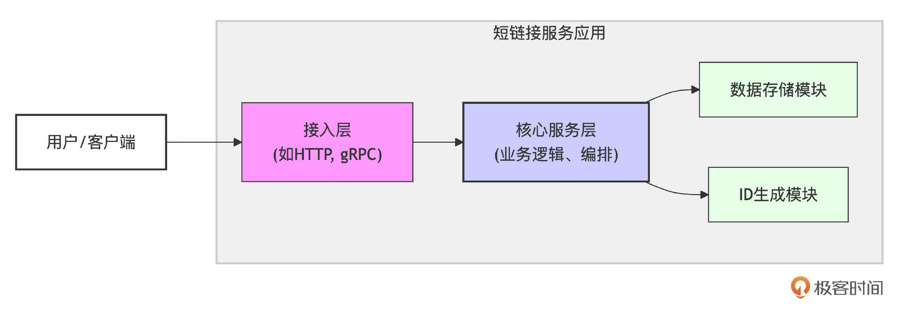
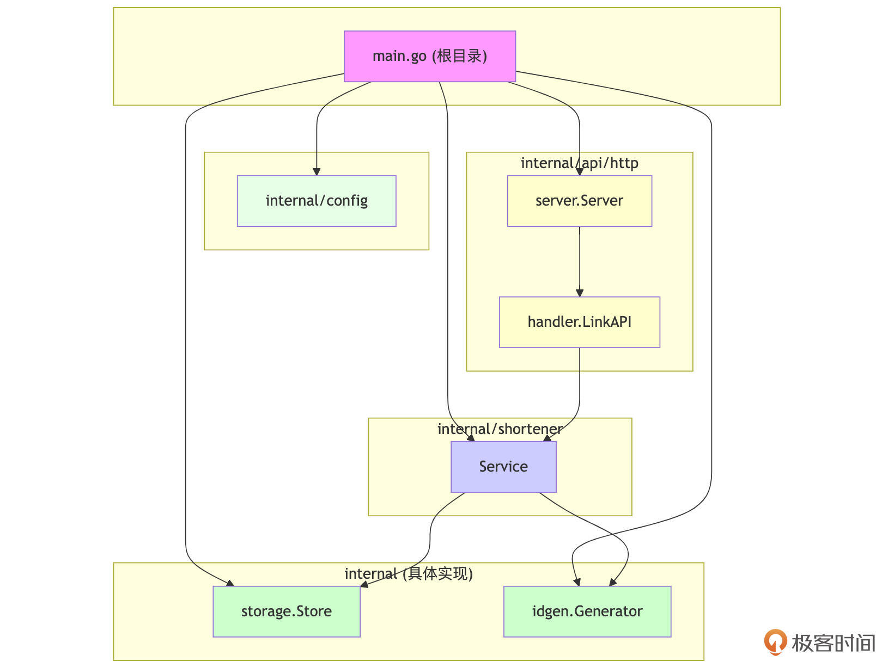
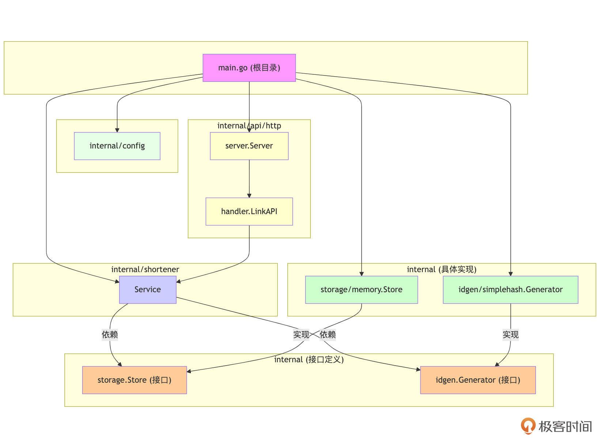

# 实战串讲（设计篇）：设计高内聚低耦合的“短链接服务” (上)
你好，我是Tony Bai！欢迎来到我们设计先行模块的第一次实战串讲。

在前面的几节课（第14～19节）中，我们系统地学习了Go项目的设计原则，涵盖了项目布局、包设计、并发模型选择、接口设计、错误处理策略以及Go包API设计规范。理论知识我们已经掌握了不少，但设计能力的提升，最终还是要落到实践中去。

很多时候，我们拿到一个需求，最容易产生的冲动就是“撸起袖子就是干”，直接开始编写代码。但没有经过深思熟虑的设计，往往会导致项目后期举步维艰：代码耦合严重、难以测试、不易扩展、维护成本高昂，甚至需要推倒重来。

接下来的两节课，我们将通过一个具体的案例——“短链接服务”，来完整地走一遍设计的流程。目的不是要实现一个功能完备、性能极致的系统，而是要 **演示如何将前面学到的设计原则应用到实际问题中，让你看到理论是如何指导实践的，并体会设计决策背后的思考过程**。

在这节课中，我们将重点关注：

1. 需求解读：明确我们要构建什么。

2. 架构草图与分层思想：勾勒系统的核心组件。

3. 核心功能模块的识别与初步职责定义：从需求和架构出发，识别出关键的逻辑单元并初步映射到包。

4. 项目结构规划（第一版）：将逻辑模块映射到初步的物理目录划分。

5. 核心包的具体实现与接口的“发现”：实践高内聚、低耦合原则，并演示接口是如何从具体需求中“自然涌现”的，同时展示引入接口后的结构演变。


通过这节课，你将看到一个简单的想法是如何逐步转化为一个结构清晰、职责分明的设计蓝图的。

## 需求解读与技术选型考量

任何软件设计的起点都是理解并明确需求。只有搞清楚了我们要解决什么问题，为谁解决，才能为后续的架构和技术选型奠定坚实的基础。

我们的目标是设计一个 “短链接服务”（Short Link Service）。它的核心功能很简单，首先是生成短链接（Create Short Link）：接收一个原始的长 URL，生成一个唯一的、较短的标识码（比如 `aBcDeF`），并将长 URL 与短码的映射关系存储起来。返回生成的短码。然后是获取长链接（Get Long URL）：接收一个短码，查找对应的原始长 URL并返回。

为了让设计更完整一些，我们再考虑一个常见的扩展需求，也就是点击统计（Analytics - 轻量）：记录每个短链接被访问的次数（我们暂时不设计复杂的统计后台，只考虑记录次数）。

**非功能性需求（简单考虑）**：

- 性能：短链接的查找（ `GetLongURL`）需要非常快。

- 可扩展性：系统未来可能需要支持更多的链接，存储和处理能力需要能水平扩展（设计阶段重点是逻辑结构）。

- 可靠性：服务需要稳定可靠。


**技术选型（初步设想，聚焦内部逻辑）**：

- 短码生成:
  - 初步想法：我们可以先尝试一种简单的策略，比如对长URL进行哈希，然后截取一部分作为短码。

  - 未来考量：这种简单哈希可能会有冲突，也可能不够“短”或不够“友好”。未来我们可能需要更复杂的策略，如自增ID转特定进制、专门的发号器服务，或者需要处理自定义短码的需求。这种“未来可能变化”的意识是关键。
- 数据存储:
  - 初步想法：为了快速原型开发和测试，我们可以先考虑将短链接映射关系存储在内存中。

  - 未来考量：内存存储在服务重启后会丢失数据，不适用于生产。生产环境通常需要持久化存储，如关系型数据库（MySQL、PostgreSQL）、NoSQL数据库（Redis、Cassandra）或分布式键值存储。我们还需要考虑数据备份、扩展性和查询性能。这里也存在“未来可能替换或有多种实现”的情况。
- 对外暴露的核心能力：根据我们定义的核心功能，这个“短链接服务”至少需要对外提供以下几种核心能力，以便用户或其他系统能够与之交互：
  - 创建短链接的能力：用户需要一种方式提交一个长URL，并获取到一个对应的短码。

  - 通过短码访问长链接的能力：用户或其浏览器需要能通过短码请求服务，并被引导（通常是重定向）到原始的长URL。

  - （可选）获取短链接统计信息的能力：如果我们实现了点击统计，可能还需要一种方式（也许是内部或管理员接口）来查询某个短链接的访问次数。

这些能力是服务必须提供的功能性入口点。至于这些入口点最终是以HTTP API的形式（比如 `POST /links` 和 `GET /{short_code}`）、gRPC服务接口，还是作为一个Go库直接被其他Go程序调用的函数/方法来实现，这是我们后续在详细设计API和传输层时需要具体化的技术决策。 **在当前需求分析阶段，我们重点是识别出这些必须对外提供的核心服务能力。**

明确了需求和初步的技术方向后，我们需要从一个更高的视角来审视整个系统，勾勒出它的核心组成部分以及它们之间大致的协作关系。这就是架构设计的初步草图，它能帮助我们建立对系统全局的认知。

## 架构草图与分层思想

根据需求，我们可以初步勾勒出系统的核心逻辑分层和它们之间的交互关系：



如图所示，整个“短链接服务应用”分为4个核心模块。

1. **接入层**：负责处理具体的协议（如HTTP）和外部世界的通信。

2. **核心服务层**（核心业务逻辑）：封装了短链接服务的核心业务规则。

3. **数据存储模块**：负责短链接映射和统计数据的持久化。

4. **ID生成模块**：负责生成唯一的短码。


这种分层结构使得每一层都可以专注于自己的核心职责。有了高层的架构设想，接下来就需要将这些抽象的“层”和“模块”具体化。首先，我们要识别出构成“短链接服务”应用核心的关键功能单元，并初步为它们划定职责范围，这直接关系到后续代码的组织和包的设计。

## 核心功能模块识别与初步的包设计考量

在明确了高层架构和分层思想后，我们可以进一步识别出实现“短链接服务”所需的核心功能模块，并为它们初步定义职责。 **这个阶段，我们不仅在逻辑层面思考，也开始将这些逻辑单元初步映射到Go的包（package）结构上，思考如何组织这些包以实现高内聚。**

1. 短码生成模块 -\> `idgen` 包:

   a. 核心职责：负责根据输入（如长URL），生成一个符合要求的、唯一的短码。所有与短码生成算法、策略、唯一性保证相关的逻辑都应内聚在此。

   b. 初步包考量：我们可以创建一个 `idgen` 包来封装所有ID生成相关的逻辑。初期，这个包内将直接包含我们选择的第一种具体实现（例如，基于简单哈希的生成器）。将所有ID生成相关的代码放在一个包内，符合高内聚原则。

2. 数据存储模块 -\> `storage` 包:

   a. 核心职责：持久化短码与长URL的映射关系，以及相关的元数据（如访问计数、创建时间）。提供统一的数据保存、查找和更新接口。所有与数据存取、数据库交互（或内存模拟）相关的逻辑都应内聚在此。

   b. 初步包考量：创建一个 `storage` 包来封装所有数据持久化逻辑。初期，这个包内将直接包含我们选择的第一个具体实现（例如，基于内存的存储），将所有存储相关代码放在一起，职责清晰。

3. 业务编排服务模块 -\> `shortener` 包:

   a. 核心职责：作为核心业务逻辑的封装者和协调者。它将使用 `idgen` 包的功能来创建短码，并使用 `storage` 包的功能来保存和检索链接信息。它还负责处理核心业务规则，如输入校验、冲突处理逻辑（如果ID生成与存储有冲突）、访问统计的触发等。

   b. 初步包考量：创建一个 `shortener` 包，它是连接其他底层模块（如 `idgen`、 `storage`）并实现核心业务流程的地方。这个包的内聚性体现在它专注于“短链接服务”本身的核心业务，而不关心ID具体怎么生成、数据具体怎么存储。

4. 配置管理模块 -\> `config` 包:

   a. 核心职责：负责加载和管理应用程序的配置信息（如服务器端口、日志级别、数据库连接字符串等）。

   b. 初步包考量：这是一个相对独立且通用的功能，适合放在一个专门的 `config` 包中。

5. 外部交互模块 -\> `api` 包:

   a. 核心职责：处理与外部世界的交互，如接收HTTP请求、解析参数、调用业务编排服务、返回响应。

   b. 初步包考量：我们将创建一个 `api` 包，并在其下根据具体协议创建子包，如 `api/http`。它将依赖 `shortener` 包。此外，万一未来真的需要支持gRPC或其他某种IPC机制，有一个api目录作为统一的入口点，组织结构会更清晰。例如，可以添加 api/grpc。


通过这样的初步识别和包设计考量，我们已经有了一组逻辑上相对独立且职责明确的候选包。 **这些包的划分遵循了高内聚的原则——每个包都聚焦于一个特定的功能领域。**

将逻辑模块映射到具体的Go包之后，我们还需要为这些包在文件系统中找到一个合适的“家”。这就是项目结构规划的任务，它要确保我们的代码库既符合Go的组织习惯，又能清晰地反映我们对模块和职责的划分。

## 项目结构规划（第一版——映射已识别的包）

基于上述识别出的核心功能模块及其对应的包，并结合我们在第14节学习到的项目布局知识，可以规划出项目的第一版项目目录结构如下：

```plain
demo1/shortlink/
├── go.mod               # Go 模块文件
├── internal/            # 内部代码，项目核心逻辑所在地
│   ├── api/
│   │   └── http/
│   │       ├── handler/
│   │       │   └── handler.go
│   │       └── server/
│   │           └── server.go
│   ├── config/             # 配置管理包
│   │   └── config.go
│   ├── idgen/             # 短码生成包 (初期直接包含简单哈希实现)
│   │   └── simple_hash_generator.go
│   ├── shortener/       # 业务编排服务包
│   │   └── service.go
│   └── storage/         # 数据存储包 (初期直接包含内存实现)
│       └── memory_store.go
└── main.go              # 应用主入口

```

设计决策说明：

- `main.go`：放在根目录，作为应用的启动入口，负责初始化依赖并将它们组装起来。此外由于短链接服务就一个可执行程序，我们没有必要建立一个 `cmd/` 目录。

- `/internal/`：所有核心的功能包都放在这里，因为它们是特定于这个短链接服务的。
  - `config/`: 实现配置加载逻辑。

  - `shortener/`：这是我们的核心业务逻辑层。 `service.go` 将定义 `Service` 类型，它会直接依赖于我们接下来要具体实现的 `idgen/simplehash` 和 `storage/memory` 包中的类型。

  - `storage/`：这是“数据存储模块”的统一入口包。初期，我们将在 `storage/memory_store.go` 文件中直接定义和实现基于内存的存储逻辑，例如 `memory.Store` 类型及其方法。此时， `storage` 包本身就提供了第一个具体的存储实现。

  - `idgen/`：这是“短码生成模块”的统一入口包。初期，我们将在 `idgen/simple_hash_generator.go` 文件中直接定义和实现基于简单哈希的ID生成器逻辑，例如 `idgen.Generator` 类型及其方法。 `idgen` 包本身就提供了第一个具体的生成器实现。

  - `api/http/`：实现HTTP API的Server和Handler，它将依赖 `shortener.Service`。

这个结构将我们识别出的逻辑模块映射到了具体的包路径。 `storage` 和 `idgen` 包内部直接包含了它们的第一个具体实现。

项目结构和初步的包划分已经完成，现在是时候深入到每个核心包内部，开始编写具体的实现代码了。正是在这个从抽象到具体，再从具体反思抽象的过程中，接口的真正价值和必要性才会逐渐显现出来。

## 核心包的具体实现与接口的“发现”

现在，我们开始在规划好的包目录下编写核心功能模块的具体实现。在这个过程中，我们将分析它们之间的依赖关系，并根据可替换性、可测试性和关注点分离等原则，自然地“发现”并提取出接口。

首先是 `idgen` 包——短码生成机制（具体实现）。

- 职责：负责生成唯一的短码，使用一种简单的哈希策略。

- 内聚性：包内所有代码都围绕“简单哈希生成短码”这一核心功能。

- 对外API（初期）： `idgen.NewGenerator()` 构造函数和 `(*Generator) GenerateShortCode(...)` 方法。


```go
// ch20/demo1/shortlink/internal/idgen/simple_hash_generator.go

... ...
const defaultCodeLength = 7

type Generator struct {
}

func NewGenerator() *Generator {
    rand.Seed(time.Now().UnixNano())
    return &Generator{}
}

func (g *Generator) GenerateShortCode(ctx context.Context, longURL string) (string, error) {
    if longURL == "" {
        return "", errors.New("idgen: longURL cannot be empty for code generation")
    }
    hasher := sha256.New()
    hasher.Write([]byte(longURL))
    hasher.Write([]byte(time.Now().Format(time.RFC3339Nano)))
    hasher.Write([]byte(fmt.Sprintf("%d", rand.Int63())))
    hashBytes := hasher.Sum(nil)
    encoded := base64.URLEncoding.EncodeToString(hashBytes)

    if len(encoded) < defaultCodeLength {
        return encoded, nil
    }
    return encoded[:defaultCodeLength], nil
}

```

然后是 `storage` 包——数据持久化机制（具体实现）。

- 职责：负责短链接映射和访问计数的持久化。

- 内聚性：所有代码都围绕“内存存储短链接数据”这一功能。

- 对外API（初期）： `storage.NewStore()` 构造函数和 `(*Store) Save(...)`、 `(*Store) FindByShortCode(...)`、 `(*Store) IncrementVisitCount(...)` 等方法。 `Link` 类型暂时也定义在此包内。


```go
// ch20/demo1/shortlink/internal/storage/memory_store.go

package storage

import (
    "context"
    "errors"
    "sync"
    "time"
)

type Link struct {
    ShortCode  string
    LongURL    string
    VisitCount int64
    CreatedAt  time.Time
}

var ErrNotFound = errors.New("storage: link not found")
var ErrShortCodeExists = errors.New("storage: short code already exists")

// 初期，这个 Store 就是我们的内存存储具体实现
type Store struct {
    mu    sync.RWMutex
    links map[string]Link
}

func NewStore() *Store { // 构造函数返回具体类型
    return &Store{links: make(map[string]Link)}
}

func (s *Store) Save(ctx context.Context, link Link) error { /* ... */ return nil }
func (s *Store) FindByShortCode(ctx context.Context, shortCode string) (*Link, error) { /* ... */ return nil, nil }
func (s *Store) IncrementVisitCount(ctx context.Context, shortCode string) error { /* ... */ return nil }
func (s *Store) Close() error { return nil }

```

思考点： `Link` 类型现在是 `storage` 包的。如果 `shortener.Service` 要操作 `Link`，就需要导入 `storage` 包并使用 `storage.Link`。这会产生一个从业务核心到具体存储实现的依赖，不太理想。这是后续接口抽象要解决的问题之一。

接着来看 `shortener` 包——核心业务逻辑（Service层，依赖具体实现）。

- 职责：实现创建短链接、获取长链接等核心业务流程，编排对 `idgen.Generator` 和 `storage.Store` 的调用。

- 内聚性：聚焦核心短链接业务逻辑。

- 对外API（初期）： `shortener.NewService(...)` 构造函数和 `(*Service) CreateShortLink(...)`、 `(*Service) GetAndTrackLongURL(...)` 方法。

- SOLID原则初步体现:
  - SRP（单一职责）： `shortener` 包专注于业务编排，将ID生成和存储的具体实现委托给其他包。

  - DIP（依赖倒置原则）——尚未完全体现：目前 `shortener.Service` 直接依赖具体实现类型 `*idgen.Generator` 和 `*storage.Store`。这在初期可以接受，但不利于扩展和测试。我们将在下一阶段通过引入接口来改进这一点。

```go
// ch20/demo1/shortlink/internal/shortener/service.go
... ...

// Config for Service, allowing dependencies to be passed in.
type Config struct {
    Store          *storage.Store   // Concrete type for demo1
    Generator      *idgen.Generator // Concrete type for demo1
    MaxGenAttempts int
}

type Service struct {
    store          *storage.Store
    generator      *idgen.Generator
    maxGenAttempts int
}

func NewService(cfg Config) *Service { // Removed error return for simplicity in demo1 main
    if cfg.Store == nil || cfg.Generator == nil {
        log.Fatalln("Store and Generator must not be nil for Shortener Service")
    }
    if cfg.MaxGenAttempts <= 0 {
        cfg.MaxGenAttempts = 3
    }
    return &Service{
        store:          cfg.Store,
        generator:      cfg.Generator,
        maxGenAttempts: cfg.MaxGenAttempts,
    }
}

func (s *Service) CreateShortLink(ctx context.Context, longURL string) (string, error) {
    if longURL == "" {
        return "", fmt.Errorf("%w: longURL cannot be empty", ErrInvalidInput)
    }

    var shortCode string
    for attempt := 0; attempt < s.maxGenAttempts; attempt++ {
        log.Printf("DEBUG: Attempting to generate short code, attempt %d, longURL: %s\n", attempt+1, longURL)
        code, genErr := s.generator.GenerateShortCode(ctx, longURL)
        if genErr != nil {
            return "", fmt.Errorf("attempt %d: failed to generate short code: %w", attempt+1, genErr)
        }
        shortCode = code

        linkToSave := storage.Link{
            ShortCode: shortCode,
            LongURL:   longURL,
            CreatedAt: time.Now().UTC(),
        }
        saveErr := s.store.Save(ctx, linkToSave)
        if saveErr == nil {
            log.Printf("INFO: Successfully created short link. ShortCode: %s, LongURL: %s\n", shortCode, longURL)
            return shortCode, nil
        }

        if errors.Is(saveErr, storage.ErrShortCodeExists) && attempt < s.maxGenAttempts-1 {
            log.Printf("WARN: Short code collision, retrying. Code: %s, Attempt: %d\n", shortCode, attempt+1)
            continue
        }
        log.Printf("ERROR: Failed to save link. LongURL: %s, ShortCode: %s, Attempt: %d, Error: %v\n", longURL, shortCode, attempt+1, saveErr)
        return "", fmt.Errorf("%w: after %d attempts for input %s: %w", ErrConflict, attempt+1, longURL, saveErr)
    }
    return "", ErrServiceInternal
}

func (s *Service) GetAndTrackLongURL(ctx context.Context, shortCode string) (string, error) {
    if shortCode == "" {
        return "", fmt.Errorf("%w: short code cannot be empty", ErrInvalidInput)
    }

    link, findErr := s.store.FindByShortCode(ctx, shortCode)
    if findErr != nil {
        if errors.Is(findErr, storage.ErrNotFound) {
            log.Printf("WARN: Short code not found. ShortCode: %s\n", shortCode)
            return "", fmt.Errorf("short link for code '%s' not found: %w", shortCode, findErr)
        }
        log.Printf("ERROR: Failed to find link by short code. ShortCode: %s, Error: %v\n", shortCode, findErr)
        return "", fmt.Errorf("failed to find link for code '%s': %w", shortCode, findErr)
    }

    go func(sc string, currentCount int64) {
        bgCtx := context.Background()
        if err := s.store.IncrementVisitCount(bgCtx, sc); err != nil {
            log.Printf("ERROR: Failed to increment visit count (async). ShortCode: %s, Error: %v\n", sc, err)
        } else {
            log.Printf("DEBUG: Incremented visit count (async). ShortCode: %s, NewCount: %d\n", sc, currentCount+1)
        }
    }(shortCode, link.VisitCount)

    log.Printf("INFO: Redirecting to long URL. ShortCode: %s, LongURL: %s\n", shortCode, link.LongURL)
    return link.LongURL, nil
}

```

internal/api/http下的server和handler则是常规的http server（封装路由）以及请求的处理器，这里就不贴代码了。最后补充一下main.go对各个包和服务的组装环节：

```plain
// ch20/demo1/shortlink/main.go
package main

import (
    "context"
    "errors"
    "log"
    "net/http"
    "os"
    "os/signal"
    "syscall"
    "time"

    "github.com/your_org/shortlink/internal/api/http/server"
    "github.com/your_org/shortlink/internal/config"
    "github.com/your_org/shortlink/internal/idgen"
    "github.com/your_org/shortlink/internal/shortener"
    "github.com/your_org/shortlink/internal/storage"
)

func main() {
    // 1. 简化配置处理 (硬编码)
    c, _ := config.LoadConfig()

    // 2. 使用标准库 log
    log.SetFlags(log.LstdFlags | log.Lshortfile)
    log.Println("Starting shortlink service", "version", "shortlink-demo1")

    // 3. 初始化依赖 (具体类型)
    storeImpl := storage.NewStore()
    defer func() {
        if err := storeImpl.Close(); err != nil {
            log.Printf("Error closing store: %v\n", err)
        }
    }()

    idGenImpl := idgen.NewGenerator()

    // 假设 NewService 接受具体类型，并且可能返回错误（如果依赖为nil）
    // shortenerService, err := shortener.NewService(storeImpl, idGenImpl) // 如果 NewService 返回 error
    shortenerService := shortener.NewService(shortener.Config{
        Store:          storeImpl,
        Generator:      idGenImpl,
        MaxGenAttempts: 3}) // 使用Config结构
    if shortenerService == nil {
        log.Fatalln("Failed to create shortener service due to nil dependencies")
    }

    // 4. 创建并启动 HTTP 服务器 (由 api/http/server.go 负责)
    httpServer := server.New(c.Server.Port, shortenerService) // 将 service 注入

    go func() {
        log.Printf("HTTP server starting on :%s\n", c.Server.Port)
        if err := httpServer.Start(); err != nil && !errors.Is(err, http.ErrServerClosed) {
            log.Fatalf("HTTP server ListenAndServe error: %v\n", err)
        }
    }()

    // 5. 优雅退出
    ... ...
}

```

第一版设计后的包依赖层次图（依赖具体实现）：



从图中我们看到：

- `main.go`：作为应用的入口，负责创建和组装所有核心组件。它直接创建了 `config`、 `shortener.Service`（并将具体的 `storage.Store` 和 `idgen.Generator` 实例注入其中），以及 `api/http/server.Server` 的实例。

- `api/http/server.Server`：负责HTTP服务器的启动和路由注册。它会创建一个 `api/http/handler.LinkAPI` 的实例。

- `api/http/handler.LinkAPI`：包含具体的HTTP请求处理逻辑。它依赖于 `shortener.Service` 来执行业务操作。

- `shortener.Service`：核心业务逻辑层。在第一版设计中，它直接依赖于 `internal/storage.Store`（此时是内存存储的具体类型）和 `internal/idgen.Generator`（此时是简单哈希生成的具体类型）。

- `internal/storage.Store` 和 `internal/idgen.Generator`：在此版本中，它们是各自功能域下的具体实现类型。


**这个阶段，我们的设计优先考虑了功能的快速实现，包之间的依赖是具体的。** 这为我们接下来的“发现”接口过程奠定了基础。更多关于第一版的代码，请访问本专栏代码仓库并下载查看。

至此，我们的 `shortener.Service` 直接依赖了 `storage.Store` 和 `idgen.Generator` 的具体实现。这在项目初期为了快速验证功能是可行的。但随着思考的深入，我们会发现几个关键问题（正如我们第17讲讨论接口设计时提到的），这些问题将自然地引导我们“发现”接口的必要性。

**首先是可替换性与扩展性。**

我们的“技术选型考量”中已经预见到， `simplehash` 可能不是最终的ID生成方案， `memory.Store` 也肯定不是生产环境的存储方案。如果未来我们要引入基于数据库的存储（ `PostgresStore`），或者一种基于雪花算法的ID生成器（ `SnowflakeGenerator`），那么 `shortener.Service` 将被迫修改其字段类型（ `store`、 `generator`）和构造函数 `NewService` 的参数类型。每次增加新的实现或替换旧的实现，都需要改动核心业务逻辑代码，这显然违反了开放-关闭原则。我们希望 `shortener.Service` 的核心逻辑能够稳定，不随具体依赖的实现变化而变化。

**其次是关注点分离与依赖倒置。**

`shortener.Service` 的核心职责是编排业务流程。它不应该强耦合于ID是如何生成的（哈希还是发号器？），或者数据是存在内存里还是数据库里。 **它应该只关心它所依赖的组件能提供哪些行为契约**。例如，它需要一个“能生成短码的东西”和一个“能保存和查找链接的东西”。这种对“东西”能力的抽象，正是接口的用武之地，也是依赖倒置原则的体现——高层模块（shortener.Service）不应依赖底层模块（具体实现），两者都应依赖抽象（接口）。

**最后是可测试性（作为上述好处的自然结果）。**

一旦 `shortener.Service` 依赖于抽象接口，而不是具体实现，那么在对 `shortener.Service` 进行单元测试时，我们就可以轻松地传入这些接口的测试替身（Test Doubles），如Fake objects或Mocks。这样就能隔离测试 `Service` 本身的业务逻辑，而不受真实存储或ID生成器的复杂性和不确定性（如网络、磁盘I/O、随机性）的影响。

基于这些更贴近实际设计演进的理由，我们决定引入接口。 `shortener.Service` 作为消费者，它定义了它对依赖组件的行为期望。

引入接口后的项目结构规划（第二版 \- 带接口定义）如下所示。注意，这里只展示结构变化，具体接口定义下一节课会讲。

```plain
└── demo2/shortlink/
    ├── go.mod
    ├── internal/
    │   ├── api/
    │   │   └── http/
    │   │       ├── handler/
    │   │       │   └── handler.go
    │   │       └── server/
    │   │           └── server.go
    │   ├── config/
    │   │   └── config.go
    │   ├── idgen/
    │   │   ├── interface.go  # <--- 新增接口定义文件
    │   │   └── simplehash/   # 基于简单哈希的具体实现
    │   │       └── generator.go
    │   ├── shortener/
    │   │   └── service.go
    │   └── storage/
    │       ├── interface.go  # <--- 新增接口定义文件
    │       └── memory/       # 内存存储的具体实现
    │           └── memory.go
    └── main.go

```

我们为 `storage` 和 `idgen` 包分别增加了 `interface.go` 文件，用于定义它们对外暴露的抽象接口。 `storage.Link` 结构体现在也定义在 `storage/interface.go` 中，作为接口契约的一部分。具体的实现包（如 `memory` 和 `simplehash`）将去实现这些接口，并使用通用的 `storage.Link`。

引入接口后的包依赖层次图如下（概念性）：



在第二版设计中， `main` 仍然负责创建具体实现，但现在它将这些实现（它们满足接口）注入到 `shortener.Service`。 `Service` 层现在依赖于 `storage.Store` 和 `idgen.Generator` 接口（暂定的接口名），实现了与具体实现的解耦。

通过这个演化过程可以知道，我们不是一开始就“发明”接口，而是在编写了具体实现并分析其局限性后，从消费者的需求（ `shortener.Service` 的需求）出发，“发现”并提取出了必要的接口抽象。这种方式创建的接口通常更实用、更聚焦，也更符合Go语言的设计哲学。具体的接口方法签名和更细致的API设计，将是我们下节课的重点。

## 小结

在这节课中，我们通过“短链接服务”这个具体案例，迈出了从需求到初步设计蓝图的关键一步，重点体验了设计的演进过程。

1. 需求解读与技术选型考量：我们明确了服务的核心功能和初步的技术思考方向，并对未来可能的变化点（如短码生成策略、数据存储方式）保持了开放性。

2. 架构草图与分层思想：我们勾勒了应用的核心逻辑分层（接入层、核心服务层、数据存储、ID生成），为后续的模块划分和职责定义奠定了基础。

3. 核心功能模块识别与包设计考量：我们将逻辑功能映射到初步的Go包（如 `shortener`、 `storage`、 `idgen`、 `config`、 `api/http`），并强调了在包设计初期就应考虑高内聚原则。

4. 项目结构规划（第一版）：我们基于识别出的包，规划了第一版的物理目录结构，此时 `main.go` 位于根目录，核心业务逻辑在 `/internal` 下，并且 `shortener.Service` 直接依赖具体实现的存储和ID生成包。

5. 核心包的具体实现与接口的“发现”：我们编写了这些核心包的初步具体实现。然后，通过分析直接依赖具体实现所带来的问题（如可替换性差、可测试性差、违反开放-关闭原则和依赖倒置原则），我们演示了接口是如何从这些实际的设计痛点中“自然涌现”的。最后，我们展示了引入接口定义（在各自功能域的根包下，如 `storage/interface.go`）后，项目结构和包依赖关系图的演变，实现了核心业务逻辑与具体实现的解耦。


**这节课的核心在于理解设计是一个迭代和演进的过程。** 我们从具体的需求和初步实现出发，逐步识别出抽象的必要性，让接口成为解决耦合、提升灵活性的自然选择，而不是一开始就进行过度设计。这个过程为我们详细打磨这些Go包API和错误处理策略做了充分的铺垫。

下节课我们将重点详细设计和打磨在本节末尾引入的 `storage.Store` 和 `idgen.Generator` 接口，以及 `shortener.Service` 自身对外暴露的Go API。应用第19讲的Go包API设计五要素，让它们更易用、安全、兼容、高效和符合Go惯例。同时，细化错误处理策略，定义业务错误类型，并规划错误在各层之间的传递与包装，以及简单讨论核心流程中可能涉及的内部并发考量。

**这第一部分的实战关键在于体会设计先行的重要性，以及如何将抽象的设计原则应用到具体的项目中，从需求一步步推导出清晰的模块和接口。**

## 思考题

在我们的第一版设计中， `shortener.Service` 直接依赖了 `storage.Store` 和 `idgen.Generator` 的具体类型。在“发现接口的必要性”部分，我们论述了引入接口的好处，如可替换性、可测试性和依赖倒置。

那从团队协作的角度来看，在项目初期（甚至在只有一个具体实现的情况下）就着手定义清晰的接口（比如 `storage.Store` 和 `idgen.Generator` 接口），而不是等到多个实现出现时再提取，可能会带来哪些额外的好处或便利？

欢迎在留言区分享你的想法！我是Tony Bai，我们下节课将继续完善“短链接服务”的设计。
