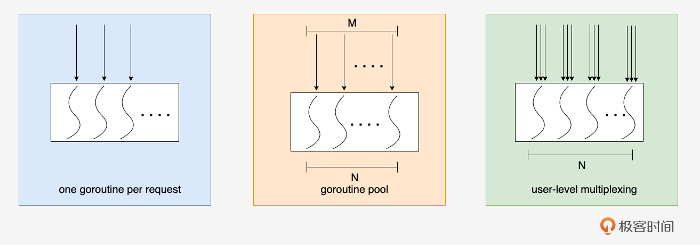
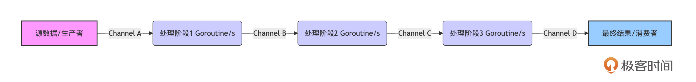
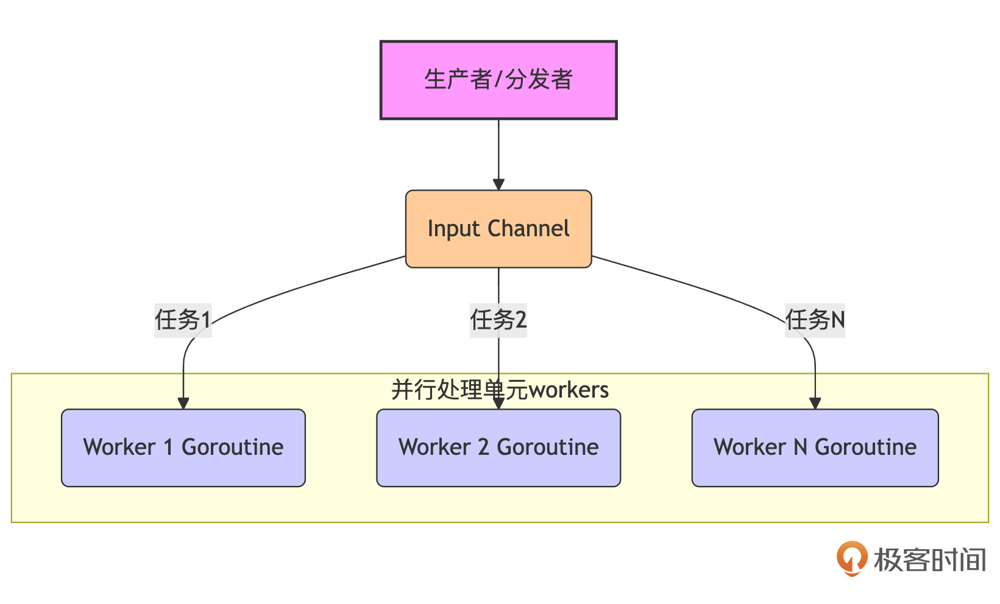
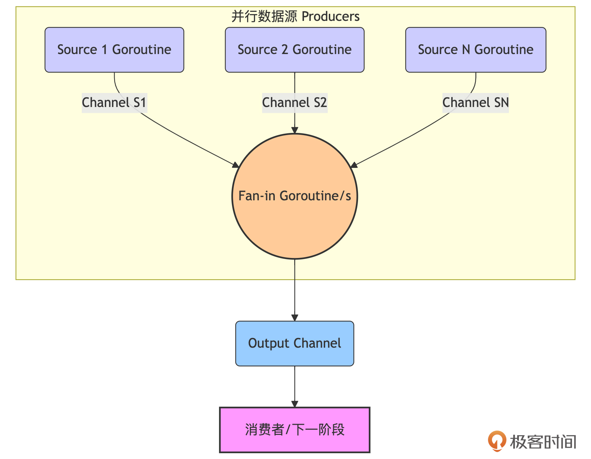
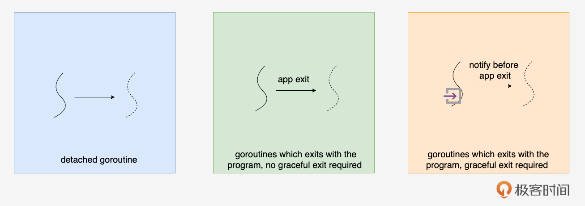

# 并发设计：用并发思维构建Go应用的结构骨架
你好！我是Tony Bai。

在模块一的 [第11节课](https://time.geekbang.org/column/article/881725?utm_campaign=geektime_search&utm_content=geektime_search&utm_medium=geektime_search&utm_source=geektime_search&utm_term=geektime_search)，我们已经深入学习了Go并发编程的“兵器谱”——goroutine、channel、select、sync包以及context。我们了解了这些工具如何工作，以及它们的优势和潜在陷阱。现在，是时候将这些知识提升到设计层面了。

Go语言的并发特性不仅仅是为了让我们的程序跑得更快（并行），它更是一种强大的 **构造和组织软件的方式**。正如Go语言设计者之一Rob Pike 所言：“ [Concurrency is not parallelism（并发不是并行）](https://go.dev/talks/2012/waza.slide#1)”。他强调，并发提供了一种编写简洁、清晰代码，并能良好地与现实世界复杂交互的途径。

那么，具体到Go项目设计中：

- 我们应该如何运用“并发的眼光”来审视和构建应用的整体结构骨架？

- 当外部请求涌入时，我们的应用应该采用哪种并发模型来接收和处理？是为每个请求启动一个goroutine，还是使用goroutine池，或者更底层的用户态多路复用？

- 在应用内部，当不同组件或处理阶段需要协作时，有哪些经典的并发模式（如Pipeline, Fan-in/out）可以借鉴？

- 最重要也是最容易被忽视的一点：我们启动的每一个goroutine，它的生命周期该如何管理？如何确保它们在不再需要时能够优雅地退出，而不是变成难以追踪的“幽灵”，耗尽系统资源（goroutine泄漏）？


**不从并发结构和生命周期管理的角度去设计Go应用，就可能导致系统在高并发下表现脆弱、资源利用率低下，甚至因goroutine泄漏而最终崩溃。**

这节课，我们将聚焦于如何运用并发思维来设计Go应用的结构，并重点探讨goroutine的生命周期管理。我们的目标是：让你不仅会写单个的goroutine，更能设计出结构清晰、行为可控、资源高效的并发Go应用。

## 并发真谛：不只是并行，更是构建清晰软件结构的方式

首先，我们需要再次明确Rob Pike关于并发与并行的经典论述。并行（Parallelism）指的是同时执行多个计算任务（通常利用多核CPU）。而并发（Concurrency）指的是 **同时处理多个任务的能力**，这些任务可能在时间上重叠，但不一定非要同时执行。并发是一种程序结构（structuring）层面的问题，而并行是一种执行（execution）层面的问题。

Go的goroutine和channel提供了一种优雅的方式，将复杂问题分解为多个独立的、并发执行的逻辑单元，并通过明确的通信（channel）来协调它们。这种方式带来的好处不仅仅是潜在的性能提升（通过并行），更重要的是：

- **提升代码清晰度和模块化**：可以将不同的职责或处理阶段映射到不同的goroutine中，使得每个goroutine的逻辑更简单、更专注。

- **增强响应性**：对于I/O密集型或需要等待外部事件的应用（如网络服务器），可以将耗时的操作放在独立的goroutine中，避免阻塞主处理流程，提高用户体验。

- **简化复杂状态管理**：通过channel传递数据和控制信号，可以比使用复杂的锁和共享状态更容易地管理并发状态，减少数据竞争。

- **更好地模拟现实世界**：现实世界本身就是并发的，用并发的思维来建模和解决问题，往往更自然、更直观。


因此，在设计Go应用时，我们应该主动思考：哪些部分可以独立出来并发执行？它们之间如何通信和同步？这种“并发的眼光”能帮助我们构建出更模块化、更具弹性、也更易于理解的系统结构。

当我们用并发的视角来审视一个应用程序的整体结构时，可以从几个关键的维度入手。首先是应用的入口，它如何接收和分发来自外部世界的请求或事件？其次是应用内部不同组件或处理流程之间如何高效、安全地并发协作？最后，也是至关重要的，是每一个并发执行单元（goroutine）的生命周期如何被妥善管理，确保其按预期启动、工作并最终干净地退出。这三个维度——入口并发模型、内部协作模式和生命周期管理——共同构成了Go并发设计的核心骨架。我们先从应用的“前门”开始看起。

## 面向外部请求：Go应用的入口并发模型选择

对于一个需要处理外部请求（如HTTP请求、RPC调用、消息队列消息）的Go应用，其入口处的并发模型至关重要，它直接影响到应用的吞吐量、延迟和资源消耗。

常见的入口并发模型有三种，如下图所示：



接下来，我们就逐一看看这三个并发模型各自的原理、特点与适用场景。

### 并发模型一：One Goroutine Per Request

One Goroutine Per Request（请求级并发）是Go `net/http` 包处理HTTP请求的默认模型。每当服务器接收到一个新的HTTP连接（或HTTP/2的流），它通常会启动一个新的goroutine来专门处理这个请求的完整生命周期。比如下面这个简化逻辑版的示例：

```go
package main

import (
    "context"
    "fmt"
    "log"
    "net/http"
)

func process(context.Context, *http.Request) {
    // 处理请求的实际逻辑
}

func handleRequest(w http.ResponseWriter, r *http.Request) {
    // 这里的代码在一个独立的 goroutine 中执行
    process(r.Context(), r) // 传递 context 很重要
    fmt.Fprintf(w, "Request processed")
}

func main() {
    http.HandleFunc("/hello", handleRequest)
    fmt.Println("Server starting on :8080")
    // http.ListenAndServe 内部会为每个请求启动一个goroutine
    log.Fatal(http.ListenAndServe(":8080", nil))
}

```

在Go的并发模型中，“一请求一goroutine”模型的原理与优势显而易见。

首先，这种方法实现简单且直观。每个请求的处理逻辑都在一个独立的执行单元中，确保了状态的隔离性。此外，这种方式能够充分利用多核 CPU 的能力，只要有足够的CPU核心，服务器便可以同时处理多个请求，从而实现并行处理。

另一个重要的优势是，I/O 阻塞不会影响其他请求的处理。当某个请求的 goroutine 因为等待数据库或外部 API 而被阻塞时，其他请求的 goroutine 仍然可以被调度执行，这大大提高了系统的响应能力和资源利用率。

这种并发模型也适用于绝大多数 Web 服务和 API 网关等场景，能够有效应对高并发的请求处理需求。

然而，该模型也存在一些潜在问题需要考虑。如果并发请求量非常大，可能会创建大量的 goroutine。虽然我们在第11节课中说过单个 goroutine 的开销较小，但过多的 goroutine 仍会消耗内存（主要是栈空间），并增加调度器的压力，甚至可能导致系统资源的耗尽（如文件描述符的限制）。以一个goroutine分配2KB栈空间为例，100万个goroutine需要的内存就是2GB，并且实际运行时，goroutine的平均栈空间通常还要大于2KB。

此外，服务器的连接数也受到操作系统和配置的限制，这在高并发场景中可能成为瓶颈。因此，在设计系统时，必须综合考虑这些因素，以确保系统的稳定性和性能。

### 并发模型二：Goroutine Pool（工作协程池）

为了控制并发goroutine的数量，避免无限制增长，我们可以使用 goroutine池（worker pool）并发模式，即预先创建固定数量（或有上限的动态数量）的worker goroutine，然后将到来的连接或请求作为任务分发给这些worker。

为了有效管理资源和控制并发度，这种并发模型采用了限制最大 goroutine 数量的策略，其原理与优势在于能够防止资源耗尽，确保系统的稳定性。同时，通过复用 goroutine，可以避免频繁创建和销毁 goroutine 所带来的开销。虽然 Go 创建 goroutine 的速度很快，但在极高频率下，这种开销仍然会产生影响。此外，这种方式能够平滑地处理突发流量，从而提高系统的响应能力。

这种并发模型特别适用于需要处理大量短时任务的场景，尤其是在不希望 goroutine 数量失控的情况下。例如，后端任务处理和消息队列消费者都可以受益于这种设计。此外，对于需要精细控制并发度的场景，这种方法也提供了良好的解决方案。

下面是一个使用goroutine pool处理tcp客户端连接和请求的示例：

```go
package main

import (
    "bufio"
    "errors"
    "fmt"
    "io"
    "log"
    "net"
    "strings"
    "sync"
    "time"
)

const (
    MaxWorkers       = 5   // 池中 worker 的最大数量
    RequestQueueSize = 100 // 请求队列的大小
)

// connHandler 代表一个可以处理网络连接的 worker
func connHandler(id int, jobs <-chan net.Conn, wg *sync.WaitGroup) {
    defer wg.Done()
    fmt.Printf("Worker %d started\n", id)
    for conn := range jobs { // 从 jobs channel 接收连接
        fmt.Printf("Worker %d processing connection from %s\n", id, conn.RemoteAddr().String())
        handleConnection(conn) // 调用实际的处理函数
        fmt.Printf("Worker %d finished connection from %s\n", id, conn.RemoteAddr().String())
        conn.Close() // 处理完毕后关闭连接
    }
    fmt.Printf("Worker %d shutting down\n", id)
}

// handleConnection 实际处理连接上的请求 (简化逻辑)
func handleConnection(conn net.Conn) {
    reader := bufio.NewReader(conn)
    for {
        // 设置读取超时，避免worker永久阻塞在一个不活跃的连接上
        conn.SetReadDeadline(time.Now().Add(5 * time.Second))
        message, err := reader.ReadString('\n')
        if err != nil {
            if err != io.EOF && !errors.Is(err, net.ErrClosed) && !strings.Contains(err.Error(), "i/o timeout") {
                fmt.Printf("Error reading from %s: %v\n", conn.RemoteAddr().String(), err)
            }
            return // 读取错误或EOF，结束此连接的处理
        }

        fmt.Printf("Received from %s: %s", conn.RemoteAddr().String(), message)
        // 模拟处理
        time.Sleep(100 * time.Millisecond)
        response := "Processed: " + strings.ToUpper(message)
        conn.Write([]byte(response))
    }
}

func main() {
    listenAddr := "localhost:8080"
    listener, err := net.Listen("tcp", listenAddr)
    if err != nil {
        log.Fatalf("Failed to listen on %s: %v", listenAddr, err)
    }
    defer listener.Close()
    fmt.Printf("TCP Server listening on %s\n", listenAddr)

    // 请求队列 (channel of connections)
    requestQueue := make(chan net.Conn, RequestQueueSize)
    var wg sync.WaitGroup // 用于等待所有 worker goroutine 退出

    // 启动固定数量的 worker goroutines
    for i := 0; i < MaxWorkers; i++ {
        wg.Add(1)
        go connHandler(i, requestQueue, &wg)
    }

    // 主循环，接收新连接并将其放入请求队列
    for {
        conn, err := listener.Accept()
        if err != nil {
            // 监听器关闭或其他错误
            if errors.Is(err, net.ErrClosed) {
                fmt.Println("Listener closed, stopping accept loop.")
                break // 退出循环
            }
            log.Printf("Failed to accept connection: %v", err)
            continue
        }

        // 将新连接发送到请求队列
        // 如果队列已满，这里会阻塞，起到一定的背压作用
        // 或者使用 select 带 default 来处理队列满的情况（例如，拒绝连接）
        select {
        case requestQueue <- conn:
            // 连接已成功放入队列
        default:
            fmt.Printf("Request queue full, rejecting connection from %s\n", conn.RemoteAddr().String())
            conn.Write([]byte("Server busy, try again later.\n"))
            conn.Close()
        }
    }

    // 走到这里通常是 listener 关闭了
    fmt.Println("Shutting down server...")
    close(requestQueue) // 关闭请求队列，通知所有 worker 不再有新连接
    wg.Wait()           // 等待所有 worker 处理完当前连接并退出
    fmt.Println("All workers finished. Server shut down.")
}

```

上面这个示例通过固定大小的worker池，有效地控制了并发处理连接的goroutine数量，避免了无限制创建goroutine可能带来的资源耗尽问题。然而，这种固定大小的池模型也并非完美。想象一下，如果客户端连接请求在短时间内激增，数量远超 MaxWorkers，那么 requestQueue 很快就会被填满。后续到达的连接请求，在 requestQueue <- conn 这一步就会阻塞（或者如果使用带 default 的 select，则会被直接拒绝），客户端会感受到明显的延迟甚至连接失败。

虽然我们可以通过增大 RequestQueueSize 来缓解短时突发流量，或者实现更复杂的动态池大小调整逻辑，但这些方法在面对数十万甚至百万级别的超高并发连接时，仍然会面临goroutine调度开销和内存占用的挑战。当我们需要在单个或少量几个线程/goroutine上处理海量并发连接，并追求极致的性能和资源利用率时，就需要考虑更底层的并发模型了。接下来，我们就来看看用户态多路复用这种并发模型。

### 并发模型三：User-Level Multiplexing

User-Level Multiplexing这种模型通常被称为用户态多路复用，其核心思想是借鉴操作系统的I/O多路复用机制（如Linux的 `epoll`、BSD的 `kqueue`、Windows的 `IOCP`），但在用户层面用更少的goroutine（通常是每个CPU核心一个或固定少数几个）来管理大量的网络连接或其他I/O事件。

在概念上，这种模型依赖于少量核心 goroutine，而不是为每个连接创建一个 goroutine。这些核心 goroutine，通常称为事件循环（Event Loop）或 I/O goroutine，采用非阻塞 I/O，注册感兴趣的事件（例如连接可读、可写）。当操作系统通知某个连接上有事件发生时，相应的核心 goroutine 会被唤醒。此外，针对每个连接，通常会维护一个状态机，以便在事件发生时，核心 goroutine 能够调用对应的处理函数或回调。如果在初步解析数据后需要进一步处理，核心 goroutine 还可以将实际的业务逻辑任务分发给后端的 worker goroutine 池，从而避免阻塞事件循环。

这种模型的优势在于其极低的 goroutine 开销。由于只使用少量核心 goroutine 管理大量连接，这大大减少了goroutine创建、调度和栈内存的开销。同时，这种非阻塞的处理方式非常适合解决 C10K、C100K 甚至 C1M 问题，即在单机上处理数万到数百万的并发连接。此外，开发者还可以更精确地控制内存和 CPU 的使用，提升资源的利用效率。

其适用场景包括需要处理极高并发连接的网络服务器，如高性能网关、消息推送服务、实时通信服务和游戏服务器等，这些场景对延迟和资源消耗有极高的要求。

然而，实现这样一个健壮、高效的用户态多路复用网络库非常复杂，涉及大量底层细节，如非阻塞 I/O、事件轮询、定时器管理和内存管理等。因此，大多数 Go 开发者选择使用成熟的第三方高性能网络库，如：

- `gnet`（ [https://github.com/panjf2000/gnet](https://github.com/panjf2000/gnet)）

- `netpoll`（CloudWeGo/字节跳动 出品, [https://github.com/cloudwego/netpoll](https://github.com/cloudwego/netpoll)）


这些库封装了底层的复杂性，提供了相对易用的 API，使开发者能够更专注于业务逻辑的实现。

由于完整的实现过于复杂，我这里只给出一个概念性的伪代码/结构示意的例子，旨在展示使用这类库时，应用层代码可能的样子。实际API会因库而异。

```go
package main

import (
    "fmt"
    "log"
    // "github.com/some-event-driven-net-library/gnetlike" // 假设这是一个类似gnet的库
)

// AppEventHandler 实现了库定义的事件回调接口
type AppEventHandler struct {
    // gnetlike.EventHandler // 嵌入库的基础事件处理器
}

// OnOpen 当新连接建立时被调用
func (ae *AppEventHandler) OnOpen(c /*gnetlike.Conn*/ interface{}) (out []byte, action /*gnetlike.Action*/) {
    conn := c.(ActualConnType) // 实际类型转换
    fmt.Printf("Connection opened from: %s\n", conn.RemoteAddr().String())
    // 可以向客户端发送欢迎消息等
    // out = []byte("Welcome!\n")
    // action = gnetlike.None
    return
}

// OnTraffic 当连接上有数据到达时被调用
func (ae *AppEventHandler) OnTraffic(c /*gnetlike.Conn*/ interface{}, data []byte) (action /*gnetlike.Action*/) {
    conn := c.(ActualConnType)
    fmt.Printf("Received from %s: %s\n", conn.RemoteAddr().String(), string(data))

    // 业务逻辑处理 (可以同步处理，也可以异步分发给worker pool)
    response := []byte("Server got: " + strings.ToUpper(string(data)))
    conn.AsyncWrite(response) // 假设库提供了异步写回方法

    // action = gnetlike.None
    return
}

// OnClose 当连接关闭时被调用
func (ae *AppEventHandler) OnClose(c /*gnetlike.Conn*/ interface{}, err error) (action /*gnetlike.Action*/) {
    conn := c.(ActualConnType)
    fmt.Printf("Connection closed from: %s, error: %v\n", conn.RemoteAddr().String(), err)
    // action = gnetlike.None
    return
}

// (这里用 ActualConnType 只是为了示意，实际库会有具体的 Conn 类型)
type ActualConnType interface {
    RemoteAddr() net.Addr
    AsyncWrite([]byte) error
    // ... 其他库提供的方法
}

func main() {
    eventHandler := &AppEventHandler{}
    addr := "tcp://:9090" // 库可能使用自己的地址格式

    fmt.Printf("Event-driven server starting on %s\n", addr)
    // 启动事件循环，传入我们的事件处理器
    err := gnetlike.Serve(eventHandler, addr, gnetlike.WithMulticore(true), gnetlike.WithNumEventLoop(runtime.NumCPU()))
    if err != nil {
        log.Fatalf("Failed to start server: %v", err)
    }
    log.Println("Conceptual example: Imagine a gnet-like library running here.")
    // 实际使用时，需要替换为真实库的启动代码
    // 由于没有实际库，这里让主 goroutine 保持运行
    select{}
}

```

在这个概念示例中，我们不再直接 `Accept` 连接，而是将连接的生命周期事件（打开、数据到达、关闭）委托给了一个事件处理器（ `AppEventHandler`）。网络库内部会使用用户态多路复用技术高效地管理大量连接，并在事件发生时调用我们提供的回调方法。这种模型将网络I/O处理与业务逻辑处理分离开来。

那么，在这三种入口的并发模型之间，我们该如何做出选择呢？

- **One Goroutine Per Request**：理解和开发实现都是最简单的，也是Go的默认方式，适用于绝大多数场景。主要关注可能产生的goroutine数量。

- **Goroutine Pool**：当需要严格控制并发度、复用资源或平滑负载，且任务之间相对独立时考虑。增加了实现的复杂度。

- **User-Level Multiplexing**：用于需要突破OS线程模型限制、追求极致网络并发性能的特定场景，通常通过使用成熟的第三方库。其编程模型与传统的同步阻塞模型有较大差异，理解、开发和调试起来较为复杂，对开发人员能力的要求较高。


选择哪种模型，取决于你的应用对并发量、性能、资源消耗以及开发复杂度的具体要求和权衡。

## 面向内部协作：常见的Go并发模式

处理好来自外部世界的并发请求仅仅是第一步。 **在一个复杂的Go应用中，请求的处理过程往往不是单一、线性的，它可能需要多个内部组件或处理阶段并发地协作才能完成。** 例如，一个数据处理任务可能需要先从数据源读取，然后进行转换，接着做一些计算，最后存储结果。如果这些步骤都串行执行，效率可能会很低，也无法充分利用现代多核CPU的能力。

Go的并发原语（goroutine和channel）为我们组织这种内部协作提供了强大的工具。通过将不同的处理逻辑封装在独立的goroutine中，并通过channel在它们之间安全地传递数据和状态，我们可以构建出高效、清晰且易于推理的并发工作流。为了应对常见的内部协作场景，社区和实践中也沉淀出了一些行之有效的并发模式（Concurrency Patterns）。这些模式就像是搭建复杂并发系统的“乐高积木”，可以帮助我们以标准化的方式解决重复出现的问题。

接下来，我们就来看看几种典型的内部协作的并发模式：Pipeline（流水线）、Fan-out（扇出）和 Fan-in（扇入）。

### Pipeline：串联处理，数据流动

Pipeline模式是一种将复杂的处理流程分解为一系列连续的处理阶段（stages）的并发设计。每个阶段通常由一个或多个goroutine负责，它们通过channel连接起来，形成一个数据流。上一个阶段的输出（通过channel发送）成为下一个阶段的输入（通过channel接收），数据就像在流水线上一样依次经过每个阶段的处理。

**这种模式的核心优势在于任务分解清晰，每个阶段可以专注于单一的、明确的职责。** 同时，如果各个阶段可以独立执行（例如，一个阶段在处理当前数据项时，上一个阶段已经在准备下一个数据项），那么Pipeline就能很好地利用多核CPU实现并行处理，提高整体吞吐量。此外，阶段间channel的缓冲能力还可以起到一定的削峰填谷作用，解耦上下游阶段的处理速度，形成自然的背压（back-pressure）机制。Pipeline模式广泛应用于数据处理、ETL流程、图像/视频处理、编译器等需要分步处理数据的场景。

下面是Go实现Pipeline模式的示意图：



从图中我们看到：数据从源头开始，通过一系列由channel连接的并发处理阶段，最终流向结果。每个箭头代表一个channel，每个处理阶段是一个或多个goroutine。

下面我们再举一个具体的利用pipeline进行数据处理的简单示例，来直观地看一下pipeline模式的威力：

```go
package main

import (
    "context"
    "fmt"
)

// Stage 1: 生成数字序列
func generateNumbers(ctx context.Context, max int) <-chan int {
    out := make(chan int)
    go func() {
        defer close(out)
        for i := 1; i <= max; i++ {
            select {
            case out <- i:
            case <-ctx.Done(): // 响应外部取消
                return
            }
        }
    }()
    return out
}

// Stage 2: 计算平方
func squareNumbers(ctx context.Context, in <-chan int) <-chan int {
    out := make(chan int)
    go func() {
        defer close(out)
        for n := range in { // 从上一个阶段接收数据
            select {
            case out <- n * n:
            case <-ctx.Done():
                return
            }
        }
    }()
    return out
}

func main() {
    ctx, cancel := context.WithCancel(context.Background())
    defer cancel() // 确保能取消整个流水线

    inputChannel := generateNumbers(ctx, 5)            // 第一个阶段
    squaredChannel := squareNumbers(ctx, inputChannel) // 第二个阶段

    // 消费最终结果
    for result := range squaredChannel {
        fmt.Println(result)
        if result > 10 { // 假设我们基于结果提前停止
            fmt.Println("Result exceeded 10, canceling pipeline.")
            cancel() // 发出取消信号，所有监听ctx.Done()的阶段都会退出
        }
    }
    fmt.Println("Pipeline finished.")
}

```

在这个例子中， `generateNumbers` 和 `squareNumbers` 分别代表流水线的两个阶段，它们通过channel连接。 `context` 用于控制整个流水线的取消。generateNumbers输出原始要处理的数值，通过squareNumbers的加工，实现对数值平方的计算。

然而，并非所有的并发协作都是线性的。有时，我们需要将一批任务或数据并行地分发给多个执行单元去处理，以期缩短整体处理时间。这就引出了我们接下来要讨论的 Fan-out（扇出）模式。

### Fan-out：并行分发，加速处理

Fan-out模式通常用于将一个数据源或一批任务分发（distribute）给多个并行的worker goroutine进行处理，以提高整体的处理速度。你可以把它想象成一个总管（生产者或分发者）将工作分配给多个工人（消费者或worker）同时进行。

实现Fan-out时，通常有一个输入channel，分发逻辑会从中读取数据或任务，然后通过某种策略（如轮询、随机或基于任务特性）将它们发送到多个worker goroutine各自的输入channel，或者直接让多个worker goroutine从同一个输入channel竞争获取任务。每个worker独立完成其分配到的任务。

下面是Fan-out模式工作原理示意图：



从图中我们看到：一个生产者将任务放入输入channel，多个Worker Goroutine并发地从该channel（或各自的channel）获取并处理任务。

下面我们改造一下前面处理数字平方的示例，看看如何用fan-out模式来实现：

```go
package main

import (
    "context"
    "fmt"
    "sync"
)

func squareWorker(ctx context.Context, id int, in <-chan int, out chan<- int, wg *sync.WaitGroup) {
    defer wg.Done()
    fmt.Printf("Worker %d started\n", id)
    for num := range in {
        select {
        case out <- num * num:
            fmt.Printf("Worker %d processed %d -> %d\n", id, num, num*num)
        case <-ctx.Done():
            fmt.Printf("Worker %d canceling\n", id)
            return
        }
    }
    fmt.Printf("Worker %d finished, input channel closed\n", id)
}

func main() {
    ctx, cancel := context.WithCancel(context.Background())
    defer cancel()

    numbersToProcess := []int{1, 2, 3, 4, 5, 6, 7, 8, 9, 10}
    inputChan := make(chan int, len(numbersToProcess))   // 带缓冲，避免发送阻塞
    resultsChan := make(chan int, len(numbersToProcess)) // 收集结果

    var wg sync.WaitGroup
    numWorkers := 3 // 启动3个worker

    // Fan-out: 启动 workers
    wg.Add(numWorkers)
    for i := 0; i < numWorkers; i++ {
        go squareWorker(ctx, i, inputChan, resultsChan, &wg)
    }

    // 分发任务到 inputChan
    for _, num := range numbersToProcess {
        inputChan <- num
    }
    close(inputChan) // 所有任务发送完毕，关闭 inputChan，worker 会在读完后退出

    // 等待所有 worker 完成
    go func() { // 启动一个goroutine来等待并关闭resultsChan，避免main阻塞
        wg.Wait()
        close(resultsChan)
    }()

    // 收集结果 (Fan-in 的一种简单形式)
    for sq := range resultsChan {
        fmt.Println("Main received squared value:", sq)
    }
    fmt.Println("All numbers processed.")
}

```

在这个例子中，主goroutine将所有待处理数字放入 `inputChan`，然后启动了 `numWorkers` 个 `squareWorker` goroutine，它们并发地从 `inputChan` 中获取数字并计算平方，再将结果发送到 `resultsChan`。

与Fan-out将任务“分散”出去相对应，有时我们需要将来自多个并发源头 的数据或结果汇聚到一个统一的地方进行下一步处理或最终消费。这种将多个输入流合并为一个输出流的模式，就是我们接下来要介绍的 Fan-in（扇入）模式。

### Fan-in：聚合结果，统一输出

Fan-in模式与Fan-out相对应，它用于 **将多个输入channel的数据汇聚（merge/multiplex）到一个输出channel中**。

实现Fan-in时，通常会为每个输入channel启动一个goroutine，这个goroutine负责从其对应的输入channel读取数据，并将读取到的数据转发到共同的输出channel。需要注意的是，当所有输入channel都关闭后，负责汇聚的goroutine应该关闭那个共同的输出channel，以通知下游处理结束。

下面是Fan-in模式工作原理示意图：



通过上图我们看到：多个数据源（或处理阶段的输出channel）的数据，通过一个或多个汇聚goroutine，被转发到同一个输出channel中。

一个Fan-in模式的经典应用场景是，当我们向多个不同的服务（比如Web搜索、图片搜索、视频搜索）同时发出查询请求后，需要将它们各自返回的结果合并起来，尽快地呈现给用户，而不是等待所有搜索都完成后再一起显示。下面我们就用一个示例来“复现”一下这个经典的Fan-in应用。

```go
package main

import (
    "fmt"
    "math/rand"
    "sync"
    "time"
)

// search 模拟一个搜索操作，它在一些延迟后返回一个结果。
// kind 参数用于区分不同的搜索源（如 "Web", "Image"）。
// query 是搜索查询词。
// 返回一个只读的字符串channel，用于接收搜索结果。
func search(kind string, query string) <-chan string {
    ch := make(chan string) // 创建用于返回结果的channel
    go func() {
        defer close(ch) // 确保goroutine退出时关闭channel
        // 模拟不同的搜索延迟
        latency := time.Duration(rand.Intn(100)+50) * time.Millisecond
        time.Sleep(latency)
        // 将格式化的结果发送到channel
        ch <- fmt.Sprintf("%s 结果，查询词 '%s' (耗时 %v)", kind, query, latency)
    }()
    return ch // 返回channel，调用者可以从中接收结果
}

// fanInMerger 接收一个或多个只读的字符串channel（输入channels），
// 并将它们输出的值合并到一个新的只读字符串channel（输出channel）中。
// 当所有的输入channel都关闭并且它们的数据都被读取完毕后，输出channel也会被关闭。
func fanInMerger(inputChannels ...<-chan string) <-chan string {
    mergedCh := make(chan string)          // 创建用于合并结果的输出channel
    var wg sync.WaitGroup                 // 使用WaitGroup等待所有转发goroutine完成
    wg.Add(len(inputChannels))             // 为每个输入channel增加WaitGroup计数

    // 为每个输入channel启动一个goroutine，负责将其数据转发到mergedCh
    for _, ch := range inputChannels {
        go func(c <-chan string) {
            defer wg.Done() // 当前goroutine完成时，减少WaitGroup计数
            // 从输入channel c 中读取数据，直到它被关闭
            for data := range c {
                mergedCh <- data // 将读取到的数据发送到合并后的channel
            }
        }(ch) // 将当前的channel c 作为参数传递给goroutine，避免闭包问题
    }

    // 启动一个goroutine，用于在所有转发goroutine都完成后关闭mergedCh
    go func() {
        wg.Wait()       // 等待所有转发goroutine执行完毕
        close(mergedCh) // 关闭合并后的输出channel，通知消费者没有更多数据
    }()

    return mergedCh // 返回合并后的channel
}

func main() {
    rand.Seed(time.Now().UnixNano()) // 初始化随机数种子
    query := "Go并发模式"

    // 模拟并行启动多个搜索操作 (这里隐式地形成了Fan-out)
    webResults1 := search("Web搜索源1", query)
    webResults2 := search("Web搜索源2", query)
    imageResults := search("图片搜索源", query)
    videoResults := search("视频搜索源", query)

    // Fan-in: 将所有搜索源的结果合并到一个channel中
    // 我们希望尽快得到结果，不一定需要等待所有搜索完成。
    aggregatedResults := fanInMerger(webResults1, webResults2, imageResults, videoResults)

    fmt.Printf("正在聚合对 '%s' 的搜索结果:\n", query)
    resultCount := 0
    maxResultsToDisplay := 3 // 假设我们只关心最先到达的3个结果

    // 从合并后的channel中消费结果
    for result := range aggregatedResults {
        fmt.Println("  -> ", result)
        resultCount++
        if resultCount >= maxResultsToDisplay {
            fmt.Printf("\n已收集 %d 条结果，停止接收。\n", maxResultsToDisplay)
            // 在真实的应用程序中，如果在这里提前退出，并且底层的search goroutines
            // 还在运行（例如因为它们有更长的超时或没有超时），
            // 我们需要一种机制（通常是context）来通知它们也停止工作，以避免资源浪费。
            // 这个简化的例子中，我们允许它们自然结束并关闭各自的channel，
            // fanInMerger中的goroutine也会随之结束。
            break
        }
    }

    // 如果aggregatedResults channel没有被完全读取（例如，如果maxResultsToDisplay小于总结果数），
    // fanInMerger中的转发goroutine可能仍在尝试向mergedCh发送数据（如果它们的输入源还没关闭）。
    // 一个更健壮的解决方案会使用context来处理取消和超时，确保所有相关goroutine都能及时退出。
    // 在这个特定示例中，由于main函数即将退出，所有子goroutine也会被终止。
    fmt.Println("主函数消费完毕。")
}

```

这个例子清晰地展示了Fan-in如何将多个并发数据流合并为一个，让调用者可以统一处理。在实际应用中，结合context进行超时控制和取消传播，可以让这种模式更加健壮。

Pipeline、Fan-out和Fan-in这些模式是Go并发编程中常用的构建块，它们可以相互组合，形成更复杂的并发数据处理流程，帮助我们构建出高效且结构清晰的并发应用。

无论是哪种并发模型或模式，只要我们启动了goroutine，一个无法回避的核心问题就是：这些goroutine何时，以及如何结束？如果对goroutine的生命周期缺乏有效管理，任其自生自灭，或者错误地假设它们会“自动”退出，就极易导致goroutine泄漏，最终耗尽系统资源。因此，深入理解并实践goroutine的生命周期管理，是编写健壮并发程序的重中之重。

## Goroutine生命周期管理：避免泄漏，实现优雅退出

启动goroutine很容易 ( `go myFunc()`)，但 **正确地管理它们的生命周期，确保它们在不再需要时能够按预期退出，是编写健壮并发程序的关键，也是最容易出问题的地方。** 未能正确退出的goroutine会导致goroutine泄漏（goroutine leak），大量僵尸goroutine会增加调度器负担，影响程序性能，同时还会持续占用内存和运行时资源，最终可能拖垮整个应用。

Goroutine的退出策略大致有如下几种：



下面我们逐一来看这些退出策略的原理、各自的特点以及适用场景。

### 退出策略一：自然退出

自然退出（Detached/Fire-and-Forget）是最简单的 goroutine 管理方式。当 goroutine 执行完其函数体内的所有代码后，它会自然结束并退出。在这种情况下，调用方启动这个 goroutine 后，通常不再关心它的完成状态或结果，任其“自生自灭”。

这种模式适合于执行一些非常短暂、一次性的后台任务，例如发送非关键的日志记录或更新一个不影响主流程的缓存项。此外，任务本身应该非常简单，能够保证在所有情况下都会迅速终止，并且不会因为错误或阻塞而导致永久运行。调用方也完全不依赖于该 goroutine 的执行结果或完成信号。

然而，这种方式也存在风险，是最容易被滥用并导致 goroutine 泄漏的方式。如果 goroutine 内部的逻辑存在潜在的永久阻塞点，例如等待一个永远不会有数据的 channel、等待一个永远不会被释放的锁，或者陷入死循环，那么这个 goroutine 可能永远无法退出，成为“僵尸” goroutine。此外，未被捕获的 panic 也可能导致相似的问题。因此，在使用这种方式时需要特别小心，以避免不必要的资源浪费。

但这种退出方式最易实现，下面是一个自然退出策略的示例代码：

```go
package main

import (
    "fmt"
    "time"
)

// logInBackground 模拟一个在后台记录日志的goroutine
func logInBackground(message string) {
    // 这个goroutine非常简单，执行完打印就自然退出了
    fmt.Printf("[LOG] %s\n", message)
    // 假设这里没有可能导致阻塞的操作
}

// fireAndForgetTask 模拟一个“发射后不管”的任务
func fireAndForgetTask() {
    fmt.Println("Starting a fire-and-forget task...")
    // 任务逻辑非常简单，保证会结束
    time.Sleep(50 * time.Millisecond) // 模拟短暂工作
    fmt.Println("Fire-and-forget task completed.")
}

func main() {
    go logInBackground("Application started") // 启动日志goroutine
    go fireAndForgetTask()                   // 启动一个不关心结果的任务

    fmt.Println("Main function continues its work...")
    // 主goroutine继续执行，不等待上面两个goroutine
    // 为了演示，让主goroutine稍作等待，以便观察到子goroutine的输出
    time.Sleep(100 * time.Millisecond)
    fmt.Println("Main function finished.")
    // 当main函数退出时，所有仍在运行的goroutine都会被强制终止
}

```

在这个例子中， `logInBackground` 和 `fireAndForgetTask` 都是在执行完自己的简单逻辑后就退出了。这种方式适用于非常特定的、简单的场景。 **对于需要长期运行或与外部系统交互的goroutine，通常不应采用这种策略。**

### 退出策略二：与程序/父goroutine共存亡

这种策略下，子goroutine的生命周期在某种程度上依赖于其父goroutine或整个程序的生命周期，并且通常也有两种方式。

- **隐式退出（不推荐）**：当主goroutine（ `main` 函数）退出时，整个程序会结束，所有仍在运行的其他goroutine也会被强制终止。这是一种隐式的“共存亡”，但它非常粗暴，子goroutine没有机会进行清理工作。 **这种方式不应作为主动的goroutine管理策略。**

- **显式同步与等待（推荐）**：更可靠的方式是，父goroutine（或某个协调者）明确地等待其启动的子goroutine完成工作。子goroutine在完成其任务后自然退出。这种同步通常通过 `sync.WaitGroup` 或 channel 来实现。


下面是一个使用 `sync.WaitGroup` 实现父子goroutine协同退出的示例：

```go
package main

import (
    "fmt"
    "sync"
    "time"
)

// workerWithWaitGroup 模拟一个需要被等待的工作goroutine
func workerWithWaitGroup(id int, wg *sync.WaitGroup) {
    defer wg.Done() // 关键：在goroutine退出前调用Done()
    fmt.Printf("Worker %d: Starting work\n", id)
    time.Sleep(time.Duration(id+1) * 100 * time.Millisecond) // 模拟工作
    fmt.Printf("Worker %d: Work finished\n", id)
    // Goroutine在此处自然结束
}

func main() {
    var wg sync.WaitGroup // 创建一个WaitGroup实例

    numWorkers := 3
    for i := 0; i < numWorkers; i++ {
        wg.Add(1) // 在启动每个goroutine前，增加WaitGroup的计数器
        go workerWithWaitGroup(i, &wg)
    }

    fmt.Println("Main: All workers launched. Waiting for them to complete...")
    wg.Wait() // 阻塞，直到WaitGroup的计数器归零（所有worker都调用了Done）

    fmt.Println("Main: All workers have completed. Exiting.")
}

```

在这个例子中， `main` goroutine 通过 `wg.Wait()` 等待所有 `workerWithWaitGroup` goroutine 调用 `wg.Done()`。当所有worker都完成后， `wg.Wait()` 返回， `main` goroutine 继续执行并最终退出。每个worker goroutine在完成其工作后也是自然退出。这种方式确保了父goroutine会等待子goroutine，避免了主程序过早退出的问题。

我们再看一个使用 Channel 进行退出协调的示例：

```go
package main

import (
    "fmt"
    "time"
)

// workerListeningDone 模拟一个持续工作的goroutine，但会监听done channel
func workerListeningDone(id int, done <-chan struct{}) {
    fmt.Printf("Worker %d: Starting\n", id)
    for {
        select {
        case <-done: // 当 done channel 被关闭时，这个case会立即执行
            fmt.Printf("Worker %d: Received done signal. Exiting.\n", id)
            // 在这里可以执行一些清理工作
            return // 退出goroutine
        default:
            // 模拟正常工作
            fmt.Printf("Worker %d: Working...\n", id)
            time.Sleep(500 * time.Millisecond)
            // 实际应用中，这里的 default 分支可能是处理一个任务，
            // 或者从某个工作channel接收任务等。
            // 如果是阻塞操作，也需要和 done channel 一起 select。
        }
    }
}

func main() {
    done := make(chan struct{}) // 创建一个用于通知退出的channel

    numWorkers := 3
    for i := 0; i < numWorkers; i++ {

        go workerListeningDone(i, done)
    }

    // 允许worker运行一段时间
    fmt.Println("Main: Workers launched. Simulating work for 2 seconds...")
    time.Sleep(2 * time.Second)

    // 工作完成或程序需要退出，通知所有worker停止
    fmt.Println("Main: Sending done signal to all workers...")
    close(done) // 关闭done channel，所有监听它的goroutine都会收到信号

    fmt.Println("Main: Waiting for all workers to finish...")
    time.Sleep(5 * time.Second) // 设置一个默认的等待时间，等待所有worker退出

    fmt.Println("Main: All workers have completed. Exiting.")
}

```

在这个例子中，父goroutine可以通过关闭一个特定的channel（通常称为 done 或 quit channel）来向所有子goroutine广播一个“停止工作”的信号。子goroutine则通过select 语句监听这个channel。

当然如果你不希望通过设置一个默认等待时间来等待所有Worker退出（存在一定可能，会导致worker无法优雅退出），也可以将WaitGroup与channel结合在一起来实现，这个在下面优雅退出策略的讲解中会有进一步说明。

“与父goroutine共存亡”的关键在于显式的同步机制，确保父级在子级完成前不会退出。这对于许多并发任务是必要的。然而，对于需要更主动控制（如中途取消、超时）的场景，我们就需要更强大的优雅退出策略了。

### 退出策略三：优雅退出

对于服务器应用或任何需要处理外部信号（如Ctrl+C）、配置变更或部署更新的程序，实现优雅退出（Graceful Shutdown）是至关重要的。这意味着程序在收到退出信号后，不是立即粗暴终止，而是：

1. 停止接受新的工作。

2. 尝试完成正在进行的任务（或给予一个超时时间）。

3. 释放占用的资源（如关闭网络连接、数据库连接、文件句柄）。

4. 然后干净地退出。


实现优雅退出的核心在于 **有一种机制能够通知所有相关的goroutine应该开始关闭流程**。

#### 实现方式1：基于Channel的信号通知

使用一个专门的channel（通常是 `chan struct{}`，因为我们只关心信号，不关心值）来广播退出信号。

```go
package main

import (
    "fmt"
    "sync"
    "time"
)

func gracefulWorker(id int, quit <-chan struct{}, wg *sync.WaitGroup) {
    defer wg.Done()
    fmt.Printf("Worker %d starting\n", id)
    for {
        select {
        case <-quit: // 监听到退出信号
            fmt.Printf("Worker %d received quit signal, shutting down...\n", id)
            // ... 执行清理工作 ...
            fmt.Printf("Worker %d finished cleanup.\n", id)
            return // 退出 goroutine
        default:
            // ... 正常工作 ...
            fmt.Printf("Worker %d working...\n", id)
            time.Sleep(500 * time.Millisecond)
        }
    }
}

func main() {
    quit := make(chan struct{})
    var wg sync.WaitGroup

    for i := 0; i < 3; i++ {
        wg.Add(1)
        go gracefulWorker(i, quit, &wg)
    }

    // 模拟一段时间后发送退出信号
    time.Sleep(2 * time.Second)
    fmt.Println("Main: Sending quit signal...")
    close(quit) // 关闭 quit channel，所有监听者都会收到信号

    fmt.Println("Main: Waiting for workers to shut down...")
    wg.Wait() // 等待所有 worker 优雅退出
    fmt.Println("Main: All workers shut down. Exiting.")
}

```

关闭 `quit` channel 会让所有 `select` 中监听 `<-quit` 的goroutine立即收到一个零值（对于 `struct{}` 是空结构体），从而触发退出逻辑。

#### 实现方式2：基于 `context.Context` 的取消传播

这是现代Go并发编程中更推荐的方式，我们在第11节课已经详细学习过 `context`。 `context.WithCancel` 创建一个可取消的context，将其传递给goroutine，goroutine监听 `ctx.Done()`。当外部调用 `cancel()` 函数时，所有派生出的goroutine都会收到通知。

```go
package main

import (
    "context"
    "fmt"
    "sync"
    "time"
)

func contextualWorker(ctx context.Context, id int, wg *sync.WaitGroup) {
    defer wg.Done()
    fmt.Printf("ContextualWorker %d starting\n", id)
    for {
        select {
        case <-ctx.Done(): // 监听到 context 取消
            fmt.Printf("ContextualWorker %d canceled: %v. Shutting down...\n", id, ctx.Err())
            // ... 清理工作 ...
            fmt.Printf("ContextualWorker %d finished cleanup.\n", id)
            return
        default:
            fmt.Printf("ContextualWorker %d working...\n", id)
            time.Sleep(500 * time.Millisecond)
        }
    }
}

func main() {
    // 创建一个可取消的根 context
    rootCtx, cancel := context.WithCancel(context.Background())
    defer cancel() // 确保在 main 退出时所有派生的 context 都被取消 (兜底)

    var wg sync.WaitGroup
    for i := 0; i < 3; i++ {
        wg.Add(1)
        // 将 rootCtx (或其派生ctx) 传递给 worker
        go contextualWorker(rootCtx, i, &wg)
    }

    time.Sleep(2 * time.Second)
    fmt.Println("Main: Canceling all workers via context...")
    cancel() // 发出取消信号

    fmt.Println("Main: Waiting for workers to shut down...")
    wg.Wait()
    fmt.Println("Main: All workers shut down. Exiting.")
}

```

`context` 的优势在于它可以携带截止时间、超时信息，并且取消信号会自动向下传播到所有子孙context，管理更系统化。

#### 实现方式3：结合系统信号（OS Signals）

在生产环境，我们需要响应操作系统信号，包括容器退出时收到的信号（如 `SIGINT` (Ctrl+C)、 `SIGTERM`）来优雅退出服务器应用，通常会将信号处理与上述channel或context机制结合。下面就是一个结合系统信号实现优雅退出的伪代码示例流程：

```go
func main() {
    // ... (启动你的服务和 worker goroutines，使用 context 或 quit channel) ...
    rootCtx, rootCancel := context.WithCancel(context.Background()) // 使用 context 控制

    // (启动 workers, 将 rootCtx 传递给它们)
    // ...

    // 监听系统信号
    sigChan := make(chan os.Signal, 1)
    signal.Notify(sigChan, syscall.SIGINT, syscall.SIGTERM)

    // 阻塞等待信号
    receivedSignal := <-sigChan
    slog.Warn("Received signal, initiating graceful shutdown...", "signal", receivedSignal.String())

    // 触发优雅退出
    rootCancel() // 通过 context 取消所有 goroutines

    // ... (等待所有 goroutine 结束，例如使用 WaitGroup) ...
    // ... (执行其他清理，如关闭数据库连接) ...
    slog.Info("Graceful shutdown complete. Exiting.")
}

```

理论和工具都已齐备，最终我们还是要回到具体的业务场景中。不同的应用特性、性能要求和复杂度，会引导我们做出不同的并发设计选择。没有放之四海而皆准的“最佳模型”，只有最适合当前问题的“合适模型”。

## 场景驱动：为你的业务选择合适的并发结构与退出策略

在选择合适的并发结构与退出策略时，理解各种并发模型和退出策略至关重要，关键在于如何根据实际业务场景进行选择和组合。 **没有银弹，所有设计都是权衡的结果**。

- **简单Web服务/API**： `net/http` 的 **One Goroutine Per Request** 通常是好的起点。在每个handler中，如果需要调用下游服务，务必使用 `r.Context()` 传递 `context`，并为下游调用设置合理的超时（ `context.WithTimeout`）。确保所有由请求派生出的goroutine都监听传入的 `context`。

- **后台任务处理器/消息队列消费者**：Goroutine Pool 是一个常见的选择，以控制资源消耗和并发度。每个worker从任务队列（通常是channel）获取任务。使用一个可取消的 `context`（或 `quit` channel）来通知所有worker优雅退出。

- **数据处理流水线（Pipeline）**：每个阶段是一个或多个goroutine，通过channel连接。每个阶段的goroutine都应该能够响应上游传入的 `context` 的取消信号，并优雅地关闭其输出channel，以通知下游阶段停止。

- **需要扇出/扇入的并行计算**： `sync.WaitGroup` 结合 `context` 是管理大量并行子任务的好方法。父任务创建一个 `context`，分发给所有子任务goroutine。子任务监听 `context`，父任务使用 `WaitGroup` 等待所有子任务完成。


在设计并发结构时，核心考量因素包括任务特性（如 CPU 密集型与 I/O 密集型、长任务与短任务、任务之间的独立性）、资源限制（如 CPU 核心数量、内存大小、允许的最大 goroutine 数）、响应性要求（如是否需要低延迟以及对偶发长尾延迟的容忍度）、复杂度（选择的模型和退出机制是否易于理解、实现和维护），以及错误处理与恢复（并发任务失败后的处理方式、是否需要重试，以及如何向上传播错误）。

因此， **在设计并发结构时，务必将goroutine 的生命周期管理和优雅退出放在与核心逻辑同等重要的位置**。提前考虑每个 goroutine 在何种条件下启动、如何工作，以及最重要的——如何在不再需要时被确定地、干净地终止。

## 小结

这一节课，我们从“并发是构造软件的方式”这一理念出发，探讨了如何运用并发思维来设计Go应用的结构骨架，并重点强调了goroutine的生命周期管理：

1. **并发的真谛**：理解并发不仅仅是为了并行加速，更是为了构建清晰、模块化、高响应性的软件结构。

2. **入口并发模型**：学习了处理外部请求的三种主要模型：One Goroutine Per Request（ `net/http` 默认，简单直接）、Goroutine Pool（控制资源，平滑负载），以及User-Level Multiplexing（极致性能，通常由库封装），我们在选择时需根据场景权衡。

3. **内部协作模式**：回顾了 Pipeline（分阶段处理）和 Fan-in/Fan-out（任务分发与结果聚合）等常见并发模式，它们有助于组织复杂的内部并发流程。

4. **Goroutine生命周期管理**：这是本节课的核心，强调了避免goroutine泄漏的重要性，并详细讨论了自然退出（适用场景极少，需谨慎）、与程序/父goroutine共存亡（通常需显式同步），以及最重要的——优雅退出这三种策略。

5. **优雅退出的实现**：学习了通过Channel信号、 `context.Context` 取消传播以及结合系统信号来实现goroutine的优雅退出，确保资源释放和任务的妥善处理。


设计并发系统是一项富有挑战但极具价值的工作。通过运用本节课讨论的并发模型、模式和生命周期管理策略，并结合前面学习的 `select`、 `sync` 和 `context` 等工具，你将能更有信心地构建出健壮、高效、可控的Go并发应用。始终记住： **启动的每一个goroutine，都要想好它如何结束**。

## 思考题

假设你正在设计一个批处理系统，它需要从一个输入源（比如一个文件或消息队列）读取大量数据项，对每个数据项进行一个耗时的转换操作，然后将转换后的结果写入一个输出源。

1. 你会考虑采用哪种或哪些并发模型/模式来设计这个系统以提高处理吞吐量？（例如，Pipeline? Fan-out/Fan-in? Goroutine Pool?）

2. 对于系统中可能启动的多个处理数据的goroutine，你会如何设计它们的优雅退出机制，以确保在收到停止信号时，它们能完成当前正在处理的数据项，并释放相关资源？


欢迎在评论区分享你的设计思路！我是Tony Bai，我们下节课见。
