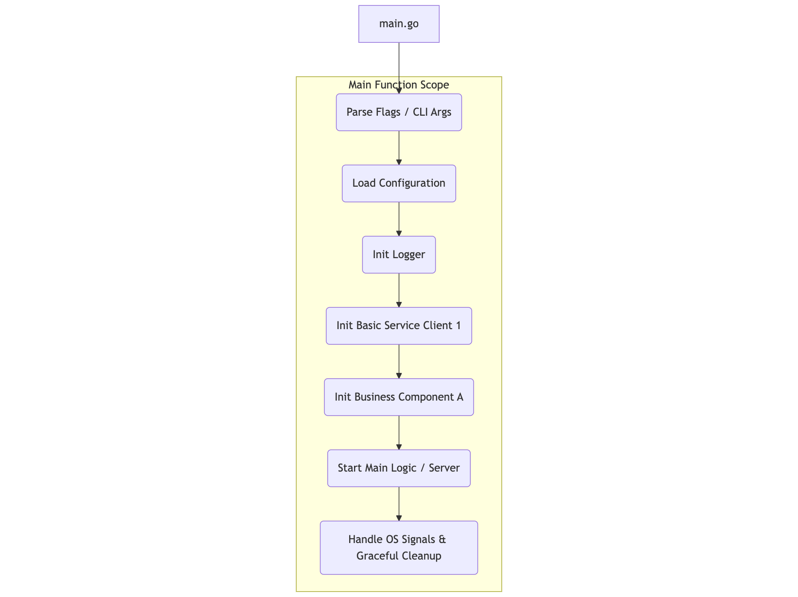
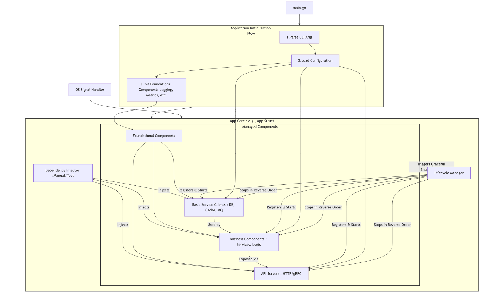
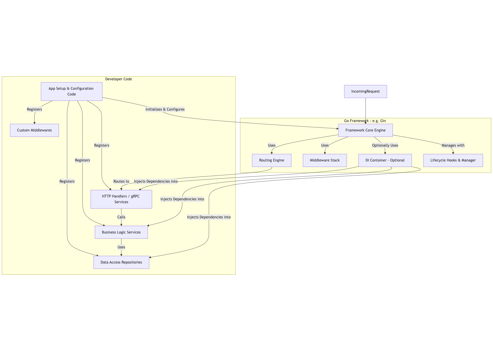

# 应用骨架：从初始化、组件编排到优雅退出的最佳实践（上）
你好，我是Tony Bai。

在模块二中，我们一起深入探讨了Go语言在项目布局、包设计、并发设计、接口设计、错误处理以及API设计等多个层面的核心原则与最佳实践。通过这些内容的学习，相信你已经掌握了如何从“设计”的视角出发，去构思和编写出结构更清晰、耦合更低、更易于维护和扩展的Go代码。我们甚至通过一个“短链接服务”的实战串讲，将这些设计理念融会贯通，体验了从需求到初步API设计的过程。

然而，优秀的设计和高质量的代码片段，最终还需要被有效地组织和运行起来，才能真正交付价值，变成一个稳定可靠的线上服务。 **如何将我们精心设计的模块和代码，组装成一个能够应对生产环境复杂挑战的完整应用？** 这正是我们模块三——工程实践，锻造生产级Go服务，所要聚焦的核心命题。

本模块将带你从代码走向服务，重点关注那些将Go代码转化为可靠线上服务的关键环节：

- 如何构建规范的应用骨架（初始化、依赖注入、优雅退出）？

- 如何实现可复用、高内聚的核心组件（配置、日志、插件化）？

- 如何为你的服务装上“眼睛”和“耳朵”，实现全面的可观测性（Metrics、Logging、Tracing）？

- 如何进行高效的故障排查、组织有效的测试、实施性能调优、拥抱云原生部署，乃至与AI大模型集成，让你的Go应用真正具备生产级的战斗力，助你打通Go工程化的“最后一公里”。

作为模块三的开篇，我们将从构建一个Go应用的“龙骨”——应用骨架（Application Skeleton）展开。

想象一下，你的Go项目还在“裸奔”吗？是从一个简单的 `main` 函数开始，然后随着需求的迭代，代码像藤蔓一样随意生长？当项目逐渐庞大，你是否发现：

- 新的功能模块难以优雅地融入现有体系？

- 配置、日志、数据库连接等基础组件的初始化散落在各处，难以统一管理？

- 每次服务升级或重启，都心惊胆战，生怕丢失数据或影响用户？

- 团队新人面对一团“意大利面条”式的代码，无从下手，维护成本居高不下？

如果这些场景让你感同身受，那么你可能忽略了一个至关重要的环节—— **构建一个坚实的应用骨架（Application Skeleton）**。

很多开发者，尤其是那些未曾深度参与过大型项目从0到1构建的同学，对于如何搭建一个结构清晰、生命周期可控、组件协同高效的Go应用骨架，往往感到迷茫。他们可能知道如何写单个功能，但如何将这些功能有机地组织起来，形成一个强大而可靠的整体，却是一个巨大的挑战。

一个健壮的应用骨架，是项目成功的基石。它不仅仅是一个 `main` 函数，更是项目的“龙骨”，定义了项目的结构规范、组件的初始化与交互方式、以及程序的启动与退出行为，直接影响着代码的可维护性、可测试性、可扩展性以及线上服务的稳定性。 **掌握应用骨架的设计与实践，是Go工程师从“能写代码”到“能构建可靠系统”的关键一步。**

接下来的两节课，我们就深入Go工程实践的核心地带，探讨“应用骨架”的设计与实现。这两节课也可以看作是工程实践模块的总纲，为后续更具体的工程化主题（如配置、日志、可观测性等）奠定基础。

这节课，我先带你深刻理解为何应用骨架如此重要，它如何解决简单 `main` 函数无法应对的挑战。接着，我们将借鉴业界主流Go项目的实践，分析几种常见的应用骨架构建模式，看看“他山之石”如何攻玉。

准备好了吗？让我们一起揭开Go应用骨架的神秘面纱，为你的项目构建坚不可摧的“龙骨”！

## 为何应用骨架如此重要？

我们先来思考一个根本问题：一个简单的 `main` 函数，真的能撑起一个复杂的生产级应用吗？

想象一下，最初你的应用可能只有一个简单的功能， `main` 函数里顺序执行几行代码就搞定了。但随着业务发展：

- 你需要加载配置文件。

- 你需要初始化数据库连接、缓存客户端。

- 你需要启动一个HTTP服务来接收外部请求。

- 你需要在程序的各个位置输出不同级别的log。

- 你可能还需要一些后台任务（goroutine）周期性执行。

- 你需要处理操作系统的信号，以便在服务关闭时做一些清理工作。

如果这些逻辑都堆砌在 `main` 函数中，或者随意散落在几个辅助函数里，很快你就会发现代码变得难以阅读和管理。这就是简单 `main` 函数的局限性。

那么，如果缺乏一个设计良好的应用骨架，具体会带来哪些“切肤之痛”呢？

- **代码结构混乱，职责不清**：初始化逻辑、业务逻辑、中间件逻辑混杂在一起，新人接手项目时，往往需要花费大量时间去理解代码的组织方式和执行流程。

- **组件初始化顺序失控**：比如，作为基础构件的日志系统还没准备好，基础服务客户端（如数据库连接池）就开始尝试记录其初始化日志，导致启动失败或关键信息丢失。又或者，业务组件在它依赖的基础服务客户端尚未就绪时就被调用，引发nil指针恐慌。这种依赖关系复杂的组件之间，初始化顺序一旦失控，问题排查将非常棘手。

- **配置管理分散，难以统一**：无论是基础构件（如日志级别、输出目标）、基础服务客户端（如数据库地址、连接池大小），还是业务组件（如业务规则阈值），如果它们的配置管理方式五花八门，甚至硬编码，那将导致配置难以集中管理和动态更新。

- **缺乏统一的启动和退出流程**：服务启动时，可能遗漏了某个关键基础构件或基础服务客户端的初始化，导致后续依赖它的业务组件无法正常工作。服务关闭时，如果没有一个统一的、考虑了组件依赖顺序的退出流程，就可能导致基础服务客户端的连接未正确关闭、正在执行的业务组件任务被粗暴中断，最终造成数据丢失、资源泄漏，甚至服务无法正常停止。

- **难以进行有效的单元测试和集成测试**：组件间紧密耦合，难以独立测试。想mock某个依赖，却发现它被深层嵌套在初始化代码中。

- **扩展新功能或替换组件时“牵一发而动全身”**：由于缺乏清晰的边界和抽象，修改一处代码可能引发意想不到的连锁反应。

这些痛点，相信经历过项目失控的同学都深有体会。而一个精心设计的应用骨架，正是解决这些问题的良药。它如同建筑的“龙骨”，为整个应用提供了坚实的支撑和清晰的结构。

应用骨架的核心价值，可以总结为以下几点：

- **规范性**（Standardization）：提供一致的项目结构和开发范式，降低团队成员的沟通成本和学习曲线。

- **可控性**（Controllability）：精确管理应用的整个生命周期，包括清晰的初始化顺序、组件的运行状态监控以及可预测的关闭流程。

- **协作性**（Collaboration）：清晰定义组件间的依赖关系和通信方式，使得不同组件可以独立开发和测试，然后顺畅地集成。

- **健壮性**（Robustness）：内置统一的错误处理机制、优雅退出策略、以及对外部信号的响应能力，提升服务的整体可靠性。

- **可维护性与可扩展性**（Maintainability & Scalability）：模块化的设计使得代码更易于理解、修改和调试。当需要添加新功能或替换现有组件时，对现有系统的影响也更小。

对于任何希望构建和维护中大型Go项目，或者希望提升自身Go工程能力的开发者来说，理解和掌握应用骨架的设计与实现，都是一项基础且极端重要的技能。它能帮助你从“写功能”的层面，上升到“构建系统”的层面。

## 业界主流Go应用骨架模式

理解了应用骨架的重要性之后，我们自然会问：那些成熟的、大型的Go开源项目是如何组织其应用骨架的？它们有哪些值得我们学习和借鉴的模式呢？

直接深入这些项目的源码去逐行分析可能非常耗时，且容易迷失在细节中。更有效的方法是，选取一些有代表性的项目，提炼其骨架设计的核心思想和模式。

### 调研方法与核心分析维度

当我们去审视一个项目的应用骨架时，可以重点关注以下几个方面：

1. 启动入口与命令行处理：程序的 `main` 函数在哪里？如何进行命令行参数的解析？这部分属于基础构件的范畴。

2. 配置加载与管理：应用配置从何而来（文件、环境变量、远端）？如何被解析并传递给需要的模块？这也是基础构件的核心。

3. 核心组件的组织与初始化：
   1. 基础构件的初始化：除了命令行和配置，还包括日志系统、可观测性组件（如Metrics、Tracing）等是如何被初始化的？

   2. 基础服务客户端的初始化：如数据库连接池、缓存客户端、消息队列客户端等是如何基于配置被创建和准备就绪的？

   3. 业务组件的初始化与组装：核心业务逻辑是如何被组织成组件，并依赖前两者进行初始化的？
4. 组件间的依赖关系解决：不同类型的组件（基础构件、基础服务客户端、业务组件）之间的依赖是如何被注入和管理的（例如，业务组件如何获取到数据库客户端实例）？

5. 应用生命周期管理与优雅退出：应用如何统一启动所有组件？如何响应外部信号（如 `SIGINT`、 `SIGTERM`）并协调所有组件（特别是那些有状态或需要清理资源的组件）实现有序、平滑的关闭？

通过对这些维度的观察，我们可以总结出几种常见的Go应用骨架模式。

### 模式一：轻量级/脚本式骨架（Lightweight/Script-like Skeleton）

这是一种以核心 `main` 函数为中心构建的结构。如上图所示， `main.go` 作为入口，其内部（或通过少量直接调用的辅助函数）顺序执行了包括基础构件（命令行解析、配置加载、日志初始化）、基础服务客户端（示例中的Basic Service Client 1）和业务组件（示例中的Business Component A）的初始化，以及主逻辑的启动和信号处理。整个流程由 `main` 函数直接驱动和控制。

该模式的特点在于组件初始化逻辑简单直接，依赖关系通常不复杂，通过参数传递或包级变量即可解决。生命周期管理也较为简单，通常仅处理基本的信号退出。

这种结构在许多命令行工具（CLI）、小型后台服务以及早期版本的简单应用中得到广泛应用。它的主要优点在于简单直观，易于理解和快速上手，对于小型项目而言，效率也相对较高。然而，随着项目规模和复杂度的增加， `main` 函数可能会迅速膨胀，导致维护困难。同时，组件间的耦合度较高，使得测试和扩展变得更加复杂。

因此，轻量级/脚本式骨架适用于功能单一的小工具、原型验证以及团队内部使用的简单服务，特别是那些短期内不会大规模扩展的项目。

### 模式二：模块化/组件化驱动骨架（Modular/Component-driven Skeleton）

模块化/组件化驱动骨架，如上图所示，强调将应用拆分为定义清晰的基础构件（如配置、日志、可观测性）、基础服务客户端（如数据库、缓存）和业务组件。

每个需要独立管理生命周期的组件（尤其是基础服务客户端和某些业务组件，以及承载它们的服务器如HTTP/gRPC Server）通常会实现统一的生命周期接口（如 `Start(ctx)`、 `Stop(ctx)`）。

应用骨架的核心（通常是一个中心化的 `App` 或 `Server` 结构体，即图中的 `App Core Instance`）负责：

- 按依赖顺序初始化所有基础构件（如 `AppInit` 流程所示）。

- 基于配置和已初始化的基础构件，创建并初始化所有基础服务客户端。

- 将基础构件和基础服务客户端注入到业务组件中，完成业务组件的初始化和组装（通过 `DependencyInjector`）。

- 注册所有需要管理生命周期的组件，并通过 `LifecycleManager` 编排它们的有序启动。

- 响应 `SignalHandler` 捕获的信号，通过 `LifecycleManager` 实现所有注册组件的有序、基于信号的优雅关闭。

这种设计在许多中大型Go应用中得到了广泛应用，包括一些微服务框架的早期或核心版本，以及像Prometheus和etcd等大型基础设施软件的核心启动逻辑。例如，在Prometheus的 `main` 函数中，会构建一个 `reloadable.NewTransaction` 来管理各个组件的生命周期，这体现了对组件化和生命周期管理的重视。

模块化骨架的主要优点在于其结构清晰、职责分明，使得组件能够独立开发和测试，易于扩展和替换。同时，应用的生命周期管理也更具可控性。然而，相较于轻量级骨架，这种设计在初期投入上可能稍大，且如果依赖关系非常复杂，手动的依赖管理可能会变得繁琐（此时可以考虑依赖注入DI工具）。

因此，模块化/组件化驱动骨架特别适用于那些需要长期维护和演进的生产级Go应用，尤其是包含多个独立功能单元（如API服务、后台处理器和数据存储交互等）的系统。这也是我们后续“庖丁解牛”部分重点分析和推荐的模式。

### 模式三：基于框架的约定式骨架（Framework-based Convention Skeleton）

基于框架的约定式骨架，依赖于特定的Go Web框架（如Gin、Echo、Beego）或微服务框架（如 `go-kratos`、 `go-zero`）。

这些框架通常提供了一整套的应用骨架结构、组件生命周期管理机制（通过 `LifecycleManager`）、依赖注入容器（可选的 `DIContainer`），以及丰富的内置基础设施，包括路由（ `Router`）、中间件（ `MiddlewareStack`）、配置和日志等功能（通常封装在 `Framework Core Engine` 中）。

开发者主要通过遵循框架的“约定”（Convention over Configuration）来填充业务逻辑代码，例如在 `AppSetup` 中进行应用配置和组件注册，定义 `Handlers`、 `BusinessLogic Services`、 `DataRepositories` 等。框架的 `LifecycleManager` 也会调用用户定义的启动和停止钩子。

例如，使用 `go-kratos` 构建的应用会有一个 `App` 结构体来管理 `HTTPServer` 和 `GRPCServer` 等，并通过 `app.Run()` 启动，框架负责底层的生命周期协调。 `go-zero` 则通过 `.api` 或 `.proto` 文件定义服务，并自动生成项目骨架和部分业务代码的脚手架。

这种模式的优点在于开发效率高，框架通常集成了大量最佳实践和开箱即用的功能，从而降低了开发者构建完整应用的门槛。此外，成熟框架的社区生态相对完善，遇到问题时也更容易找到解决方案。

然而，基于框架的设计也存在一些缺点。开发者对框架的依赖较强，可能会面临一定的学习曲线和“黑盒”效应，理解框架内部机制可能需要额外成本。此外，框架的灵活性和可定制性可能受到限制，如果框架本身设计不佳或不再维护，项目的迁移成本也会较高。

因此，这种模式特别适用于需要快速开发标准化的Web应用或微服务的场景，尤其是在团队对特定框架有深入理解和使用经验的情况下，以及当项目需求与框架提供的能力高度匹配时。

通过借鉴上述这些模式，我们可以看到，并没有一个“放之四海而皆准”的完美应用骨架。选择或设计适合自己团队和业务需求的骨架模式才是关键。对于大多数从头开始构建的中大型项目，模块化/组件化驱动的骨架（模式二）往往是一个不错的起点，它在规范性和灵活性之间取得了较好的平衡。而当你需要快速迭代或团队成员对某个框架非常熟悉时，基于框架的骨架（模式三）也能显著提升开发效率。

理解这些模式，能帮助我们更有方向性地去设计自己的应用骨架，或者在评估第三方框架时，看清其背后的组织哲学。

## 小结

这节课，我们首先深刻理解了一个设计良好的应用骨架对于构建高质量、可维护、可扩展的Go应用来说极端重要，它远超一个简单 `main` 函数所能承载的职责。我们分析了缺乏骨架所带来的种种“切肤之痛”，并明确了骨架的核心价值：规范性、可控性、协作性、健壮性以及可维护性与可扩展性。

接着，我们借鉴了业界的成熟实践，“他山之石，可以攻玉”，探讨了轻量级/脚本式、模块化/组件化驱动、以及基于框架的约定式等几种常见的应用骨架构建模式，并分析了它们各自的特点、优缺点及适用场景，帮助你拓宽视野，为自己的项目选择或设计合适的骨架打下基础。

下节课，我们会庖丁解牛，深入拆解一个典型应用骨架的核心组成部分。欢迎在留言区分享你的思考和设计！我是Tony Bai，我们下节课见。