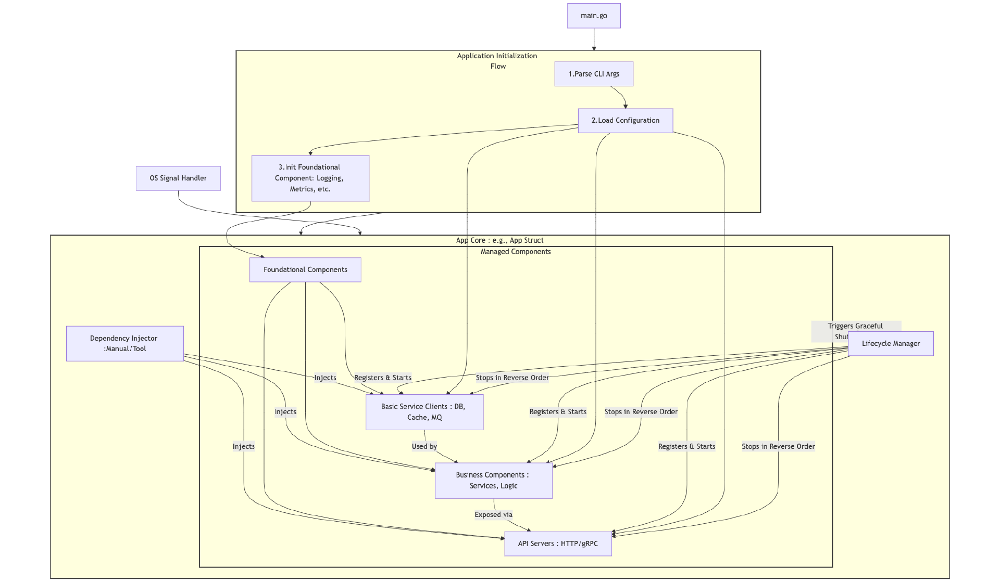

# 应用骨架：从初始化、组件编排到优雅退出的最佳实践（下）
你好，我是Tony Bai。

在了解了不同的骨架模式后，我们会庖丁解牛，深入拆解一个典型应用骨架的核心组成部分：从应用的启动与初始化（包括基础构件如命令行解析、配置加载、日志等的初始化），到各类组件的编排与依赖管理（包括基础服务客户端和业务组件的组装），再到程序如何实现优雅退出（信号处理、资源清理、平滑关停）。

最后，我们会基于典型应用骨架的讲解，给出一个可运行的、概念性的Demo项目代码示例，让你直观地看到这些理论是如何在实践中落地的，并提供一个可以参考和扩展的起点。

我们以模块化/组件化驱动骨架（即模式二），作为接下来详细拆解的蓝本。

一个健壮的模块化应用骨架，其核心在于一个中心化的应用核心实例（ `App Core Instance`），它负责编排应用的整个生命周期。这个过程可以分解为三大关键环节：应用的启动与初始化、核心组件的编排与依赖管理，以及最终的优雅退出。

## 应用启动：初始化、命令行与配置

应用的启动是整个骨架运作的开端，对应下图中的 `Application Initialization Flow`。这个阶段的核心任务是准备好应用运行所需的基础环境和数据，确保后续的组件能够被正确创建和配置。我们首先来看初始化流程的整体控制。



### 初始化流程与顺序控制

一个清晰、可控的初始化序列是应用稳定启动的基石。这涉及如何组织代码，以及如何决定各个部分的初始化时机。

**首先是 `init()` 函数的审慎使用。** 在我的《 [Go语言第一课](http://gk.link/a/10AVZ)》中就已经多次强调，Go语言的 `init()` 函数在包导入时自动执行。这使得它非常适合执行那些绝对必要、无外部依赖（如配置文件、命令行参数）、且必须在包加载时完成的纯粹初始化操作。例如，数据库驱动的注册（如 `_ "github.com/go-sql-driver/mysql"`）、编解码器的注册，或者设置一些包级别的常量和内部状态。然而，要极力避免在 `init()` 函数中执行复杂的逻辑，进行I/O操作（如读文件、网络请求），或者依赖其他包 `init()` 函数的执行顺序。因为 `init()` 函数的执行顺序由包的导入关系决定，这可能导致隐蔽的初始化依赖问题，使得代码难以理解、测试和调试。滥用 `init()` 函数会降低代码的可预测性和可维护性。

**其次是显式的应用级初始化。** 更为推荐和健壮的做法是，在应用的入口（通常是 `main.go` 中的 `main` 函数）引导一个显式的、可控的初始化序列。这通常意味着我们会定义一个或多个应用级别的初始化函数（例如 `setupApplication()`、 `initializeApp()`），或者将初始化逻辑封装在 `App Core Instance` 的构造函数中。在 `main` 函数中，我们按照清晰的逻辑顺序调用这些函数。

这样做的好处显而易见：

- 顺序可控：初始化步骤和它们的执行顺序完全由开发者掌控，一目了然，易于理解和调整。

- 依赖明确：可以将配置对象、其他已初始化的组件实例等作为参数显式传递给后续的初始化函数，使得依赖关系清晰可见。

- 错误处理更佳：显式的函数调用允许我们直接处理初始化过程中可能发生的错误，并据此决定是继续执行、优雅退出还是直接panic。

- 可测试性更高：独立的初始化函数更容易进行单元测试，可以通过传入mock的配置或依赖来验证其行为。


**最后是关键组件的初始化顺序考量。** 一个典型的、合理的初始化顺序通常遵循依赖关系，先初始化被依赖的，再初始化依赖者。

- 命令行参数解析（ `CmdParser`）：这是应用获取外部输入的第一个环节，解析结果可能影响后续步骤，例如指定配置文件的加载路径或覆盖某些默认参数。

- 配置加载（ `ConfigLoader`）：基于命令行参数或约定的默认路径，从文件、环境变量或远程配置中心加载应用的全部配置信息，并将其解析到一个强类型的Go结构体中。这个配置结构体是后续所有组件初始化的“燃料”。

- 基础构件初始化（ `FoundationalComponentsInit`）：在配置加载完毕后，应立即初始化核心的基础构件。这包括：
  - 日志系统：这是重中之重，应尽早初始化。一旦日志系统就绪，后续的初始化步骤、组件运行以及错误处理都能依赖它来输出结构化、可管理的日志信息。

  - 可观测性组件：如 Metrics 收集器（例如Prometheus的registry和collectors）、Tracing Provider（例如OpenTelemetry的SDK配置和导出器）。这些组件能帮助我们监控应用状态和追踪请求链路，对生产环境至关重要。

  - 其他任何不直接依赖于具体业务逻辑或外部服务客户端的平台级工具或共享服务。

这些在应用启动初期完成的初始化步骤，它们的产物（如最终的配置实例、全局的日志器实例、指标注册表等）将被传递给后续的 `App Core Instance`（我们下节课会讲），用于进一步构建和编排更上层的基础服务客户端和业务组件。一个精心设计的初始化流程，能为整个应用的稳定运行打下坚实的基础。接下来，我们具体看看命令行参数是如何解析的。

### 命令行参数解析

命令行参数是用户或部署脚本与应用交互、进行启动时配置的一种重要方式。Go标准库为此提供了基础支持。

- 标准库 `flag` 包：对于大多数应用来说，如果命令行参数需求比较简单（例如，只需要接收 `-config <path>`、 `-port <number>`、 `-debug` 这样的标志），标准库的 `flag` 包完全够用。它简单易学，是Go语言内置的标准功能，无需引入额外依赖。通过 `flag.String()`、 `flag.Int()`、 `flag.Bool()` 等函数定义参数，然后调用 `flag.Parse()` 即可解析。

- 为何以及何时选择第三方库？ 当你的应用需要更复杂的命令行接口（CLI）时， `flag` 包就可能显得力不从心。例如：
  - 子命令（Subcommands）：像 `docker ps`、 `git commit -m "message"` 这样，应用有多个功能模块，每个模块有自己的一套参数。

  - 更丰富的参数类型和校验：需要非基本类型的参数、参数别名、参数分组、自动生成更美观和详细的帮助信息等。

  - 更佳的用户体验：包括命令自动补全、更友好的错误提示等。在这种情况下，社区流行的第三方库如 `spf13/cobra`（被Kubernetes、Docker、Hugo等大量知名项目采用）或 `urfave/cli` 会是更好的选择。它们提供了构建功能强大且用户友好的CLI应用的完整框架。本节课我们不深入这些库的具体API，而是重点理解它们能解决什么问题，以及何时使用它们。
- 命令行参数与配置文件的优先级：一个常见的实践是，允许命令行参数覆盖配置文件中定义的同名配置项。这为用户在启动时临时调整某些参数提供了便利，而无需修改配置文件。例如，你可以通过 `-log-level debug` 来临时开启调试日志，即使配置文件中设置的是 `info` 级别。这种优先级的设定通常在配置加载逻辑中实现。


命令行参数解析完成后，我们就获得了应用启动所需的一些关键信息，其中最重要的往往是配置文件的路径。接下来，就轮到配置加载与管理登场了。

### 配置加载与管理

配置是应用的“大脑”，它指导着应用中几乎所有组件的行为。一个健壮且灵活的配置管理机制对于应用骨架至关重要。

- 配置源的多样性：生产环境中的应用通常需要从多种来源获取配置信息，以适应不同的部署环境和运维需求：
  - 配置文件：这是最常见的方式，如JSON、YAML、TOML、INI等格式的文件。它们结构清晰，易于人工编辑和版本控制。

  - 环境变量：在容器化（如Docker）和云原生环境（如Kubernetes）中非常流行。环境变量便于在不同部署阶段（开发、测试、生产）注入不同的配置，实现配置与代码的分离。

  - 命令行参数：如前所述，用于在启动时临时覆盖或指定少量关键配置。

  - 远程配置中心：对于分布式系统或需要动态更新配置的场景，使用配置中心（如etcd、Consul、Apollo、Nacos）是常见的选择。应用启动时从配置中心拉取配置，并可能监听后续的配置变更。
- 加载策略：
  - 启动时加载：大部分配置项在应用启动时一次性加载完成。

  - 多源合并与优先级覆盖：一个好的配置系统应该支持从多个源（如默认值、配置文件、环境变量、命令行参数）加载配置，并能定义清晰的优先级规则进行合并和覆盖。例如，常见的优先级顺序是：命令行参数 > 环境变量 > 指定的配置文件 > 默认配置文件 \> 内置默认值。
- 推荐实践：
  - 使用结构体映射配置：定义一个或多个Go结构体，其字段与配置文件的结构（或环境变量的命名规范）相对应。然后，将从各种源解析出来的配置数据填充（unmarshal/decode）到这些结构体实例中。这样做的好处是类型安全（编译期检查），并且在代码中通过结构体字段访问配置项非常方便直观。

  - 利用库简化加载：手动处理多源加载、格式解析、优先级合并等逻辑可能非常繁琐且容易出错。社区有许多优秀的配置管理库，如 `spf13/viper`，它能很好地处理这些复杂需求，支持多种配置文件格式、环境变量读取、远程配置源、配置热加载（watch），以及将配置自动映射到结构体等功能。理解这类库的核心设计思想（如统一的Get接口、多源优先级管理、与结构体解耦等）比死记硬背其API更为重要。

配置系统是驱动整个应用骨架运转的“燃料”，它决定了各个基础构件、基础服务客户端和业务组件的行为。一个健壮的配置系统本身也是一个重要的基础构件。在后续的《核心组件：构建健壮Go服务的配置、日志与插件化方案》中，我们将结合示例，深入探讨配置管理的最佳实践，包括多源加载、结构化配置、动态更新（热加载）等。这节课我们重点关注配置如何在骨架的启动阶段被加载并传递给需要它的组件。

当应用的启动和基础配置准备就绪后，应用骨架的核心职责就转向了如何将各个功能模块有机地组织起来，这就是我们接下来要讨论的“组件的编排”。

## 组件的编排：组装与依赖管理

一旦完成了初步的初始化（对应图1中的 `Application Initialization Flow`），控制权就交给了图中的 `App Core Instance`。它像一位乐队指挥，负责创建、组装并启动应用中的各个核心组件，让它们协同工作，共同完成应用的使命。这个过程我们称之为“组件的编排”。

### 识别与定义核心组件

首先，我们需要识别出应用中承担不同职责的核心组件。参照图1中 `Managed Components` 的分类，这些组件通常包括：

- 基础构件（ `FC - Foundational Components`）：这些是在初始化阶段就已经准备好的实例，例如我们之前讨论的 `Logger`（日志记录器）、可能的 `Metrics Collector`（指标收集器）、 `Tracer Provider`（分布式追踪提供者）等。它们通常不直接依赖其他自定义的业务组件，而是作为基础服务被其他所有类型的组件依赖和使用。

- 基础服务客户端（ `BSC - Basic Service Clients`）：这些是应用与外部基础设施（如数据库、缓存服务、消息队列、第三方API等）进行交互的客户端或连接池。例如， `*sql.DB` 实例、 `*redis.Client` 实例、Kafka或RabbitMQ的生产者/消费者客户端等。它们的创建和配置高度依赖于从 `AppConfig` 中加载到的相关配置信息，并且通常会使用基础构件中的 `Logger` 来记录其操作日志。

- 业务组件（ `BC - Business Components`）：这是应用的核心所在，封装了具体的业务逻辑。例如，在一个电商应用中，可能会有 `UserService`、 `OrderService`、 `ProductService` 等。这些业务组件通常会依赖一个或多个基础服务客户端来完成数据的持久化和检索，同时也可能需要基础构件（如Logger）来辅助。

- API服务器/Lifecycle组件（ `Servers`）：这些是应用对外提供服务或执行后台任务的入口和执行体。最常见的是HTTP服务器（如基于 `net/http` 或 Gin、Echo 等框架构建）和gRPC服务器。此外，消息队列的消费者进程、定时的批处理任务执行器等，如果它们有独立的运行和关闭生命周期，也属于此类。这些组件通常会组合一个或多个业务组件（通过依赖注入的方式），将业务能力暴露给外部调用者或触发内部处理流程。由于它们通常需要管理网络监听、后台goroutine等资源，因此会实现我们稍后讨论的统一生命周期管理接口。


一个至关重要的设计原则是：面向接口设计组件。 尽可能为你定义的组件（尤其是基础服务客户端和业务组件）抽象出清晰的接口，而不是让其他组件直接依赖它们的具体实现类型。这样做的好处是：

- 解耦：依赖方只关心接口定义的能力，不关心具体如何实现。

- 可测试性：在单元测试中，可以轻松地为接口创建模拟（mock）实现，从而隔离被测试组件的行为。

- 可替换性：如果未来需要更换某个组件的具体实现（例如，将数据库从MySQL迁移到PostgreSQL，或者将缓存从本地内存缓存切换到Redis），只要新的实现满足相同的接口，对依赖方代码的改动就会非常小。


这是实现“高内聚、低耦合”设计目标的关键实践，也是构建一个灵活、可维护应用骨架的基础。

当组件被清晰定义后，接下来的问题就是如何在 `App Core Instance` 中创建并把它们“编排”起来。

### 组件的初始化与编排

在 `App Core Instance` 内部（通常在其构造函数或一个专门的初始化方法中），我们需要根据加载的配置和已经准备好的基础构件，来实例化和组装其他各类组件。

- 实例化：每个组件通常都有一个自己的构造函数（例如， `NewDatabaseClient(cfg config.DBConfig, logger *logger.Logger) (*DatabaseClient, error)`， `NewUserService(dbClient data.UserRepo, logger *logger.Logger) *UserService`）。 `App Core Instance` 负责调用这些构造函数，并传入必要的配置和依赖项，从而创建出各个组件的实例。这个过程就是图1中 `DependencyInjector` 概念上所做的事情。

- 生命周期管理接口（ `LifecycleManager` 的作用体现）：对于那些需要显式启动和停止的组件（特别是API服务器/Lifecycle组件，以及某些可能管理着连接池或后台goroutine的基础服务客户端或业务组件），我们通常会定义一个统一的生命周期管理接口。这有助于 `App Core Instance` 以一致的方式管理它们。一个常见的模式如下：


```go
package lifecycle // 通常放在项目的 pkg/lifecycle 或 internal/platform/lifecycle 目录下

import "context"

// Component defines the interface for a manageable application component
// that has a distinct start and stop lifecycle.
type Component interface {
    Start(ctx context.Context) error // Starts the component.
                                     // This method can be blocking (e.g., http.ListenAndServe)
                                     // or non-blocking (launching goroutines and returning).
                                     // The provided context can be used for cancellation during startup.
    Stop(ctx context.Context) error  // Stops the component gracefully.
                                     // The provided context typically carries a deadline for shutdown.
    Name() string // Optional: Returns a human-readable name for the component, useful for logging.
}

```

`App Core Instance` 会持有一个 `[]lifecycle.Component` 的切片，将所有需要管理的组件注册到这个列表中。在应用启动时，它会遍历这个列表并调用每个组件的 `Start` 方法；在应用关闭时，则会按相反的顺序遍历并调用 `Stop` 方法。

启动与停止顺序，这个顺序至关重要，必须由 `App Core Instance` 内的 `LifecycleManager`（逻辑概念，实际可能是 `App` 结构体中的一段代码）精确控制。

- 启动顺序：通常遵循依赖关系。被依赖的组件（如基础服务客户端）应先于依赖它们的组件（如业务组件，再如API服务器）启动。例如，数据库连接池必须先成功启动并准备好接受连接，然后依赖它的业务服务才能正常初始化和运行，最后API服务器才能开始接收并处理依赖这些业务服务的请求。

- 停止顺序：通常是启动顺序的逆序。例如，API服务器应首先停止接受新的外部请求，并等待已在处理的请求完成；然后，业务组件可能需要完成其正在进行的任务；最后，基础服务客户端（如数据库连接池、消息队列连接）才关闭它们的连接和释放资源。


通过这种方式， `App Core Instance` 就如同一位经验丰富的指挥家，确保乐队中的每个乐器（组件）都能在正确的时间以正确的方式开始演奏，并在演出结束时和谐地谢幕。

接下来，我们更深入地探讨一下如何优雅地处理这些组件之间的依赖关系。

### 依赖管理模式

依赖注入（DI）是构建模块化、可测试和可维护软件的核心技术之一。其基本思想是：一个对象（或组件）不应该自己创建它所依赖的其他对象（依赖项），而应该由外部环境（如 `App Core Instance` 或DI容器）在创建时将这些依赖项“注入”给它。

为何需要DI？原因主要有三个：

- 解耦（Decoupling）：组件只声明它需要什么类型的依赖（通常是接口），而不关心这个依赖的具体实现是如何创建的。这降低了组件之间的耦合度。

- 可测试性（Testability）：在单元测试中，可以非常方便地为组件注入模拟（mock）的依赖对象，从而隔离被测试组件的行为，使其测试不依赖于真实的数据库、网络服务等外部环境。

- 灵活性和可配置性（Flexibility & Configurability）：可以在不修改组件自身代码的情况下，通过改变注入的依赖项（例如，在测试时注入内存数据库，在生产时注入真实数据库客户端）来改变组件的行为或适应不同的环境。


Go语言简洁的设计哲学使得手动DI非常自然且常用，通常不需要重量级的DI框架。

构造函数注入（Constructor Injection）是Go中最常见也最为推荐的DI方式。在创建组件实例时，通过其构造函数的参数将所有必需的依赖项传入。

```go
// foundational/logger/logger.go
// func New(cfg config.LoggerConfig) *Logger { ... }

// client/database/client.go
// func New(cfg config.DBConfig, logger *logger.Logger) (*Client, error) { ... }

// biz/user/service.go
// type DBInterface interface { Query(...) (...) } // 定义接口
// func NewService(db DBInterface, logger *logger.Logger) *Service { ... }

// transport/http/server.go
// type UserServiceProvider interface { GetUser(...) (...) } // 定义接口
// func New(cfg config.HTTPServerConfig, userService UserServiceProvider, logger *logger.Logger) lifecycle.Component { ... }

// 在 appcore/app.go 的 New() 方法中:
// appLogger := logger.New(cfg.Logger)
// dbClient, _ := database.New(cfg.DB, appLogger)
// userService := user.NewService(dbClient, appLogger) // dbClient 实现了 UserServiceProvider 所需的DBInterface
// httpServer := http.New(cfg.HTTPServer, userService, appLogger)

```

如图1所示， `App Core Instance`（通过其内部的 `DependencyInjector` 逻辑） 正是利用构造函数注入，将基础构件（ `FC`）注入到基础服务客户端（ `BSC`），再将 `FC` 和 `BSC` 注入到业务组件（ `BC`），最后将 `FC` 和 `BC` 注入到API服务器（ `Servers`）。这种依赖链条在应用初始化时被清晰、显式地建立起来，具有编译期类型安全、易于理解和追踪的优点。

此外，还可以通过组件暴露的公有Setter方法来注入依赖。这种方式适用于可选依赖，或者需要在对象生命周期中动态改变依赖的场景。不过，在Go中相对少用，因为它可能导致对象在所有依赖被设置前处于不完整或不可用状态，且依赖关系不如构造函数注入那样一目了然。

最后是接口注入，也就是定义一个特定的接口，要求依赖注入者实现该接口的方法来接收依赖项。这种方式在Go中更为罕见，因为构造函数注入通常更简单、更直接。

当应用规模变得非常大，组件数量众多，依赖关系图错综复杂时，纯粹手动的构造函数注入（尤其是在单一的 `App Core` 构造函数中完成所有组装）可能会导致这个构造函数变得异常冗长、难以维护，并且容易因参数顺序或类型匹配错误而出错。这个时候，我们会借助一些依赖注入的容器/工具。

常见的依赖注入工具包括 [Google wire](https://github.com/google/wire)、 [uber Fx](https://github.com/uber-go/fx)、 [facebook inject](https://github.com/facebookarchive/inject) 等。这些工具大致可分为两类，一类是利用代码生成技术的编译期依赖注入，比如Wire，另一类则是利用反射技术的运行时依赖注入，比如fx。

`google/wire` 是Go社区一个广受欢迎的编译时依赖注入工具。它的核心思想是：你只需为你应用中的每个组件编写其独立的构造函数（在Wire中称为Provider），并在构造函数签名中明确声明其依赖项。然后，你定义一个或多个Injector函数，在这些函数中通过 `wire.Build(...)` 列出你希望Wire帮你构建的目标组件以及所有相关的Provider。Wire会在编译期间分析这些Provider之间的依赖关系图，并自动为你生成一个包含所有必要实例化和注入逻辑的Go源文件（ `wire_gen.go`）。

静态注入框架的优点主要体现在几个方面。首先，它提供了编译时安全，这意味着如果依赖关系无法满足，例如某个依赖缺失、类型不匹配或存在循环依赖， `wire` 会在编译时报错，而不必等到运行时才出现panic。这种机制有效地减少了运行时错误的可能性，提高了代码的可靠性。其次，静态注入框架避免了运行时反射开销。生成的代码是纯粹的Go代码，因此没有运行时反射带来的性能损耗。这使得应用在执行时更加高效。此外，生成的代码通常是可读的，开发者可以轻松地检查这些代码，以理解依赖是如何被组装的。这种透明性增强了代码的可维护性和可理解性。最后，静态注入框架实现了关注点分离，将组件的创建逻辑（Provider）与其组装逻辑（Injector）分离。这种设计使得各个部分的职责更加清晰，有助于提升代码的模块化和可重用性。

`google/wire` 这类依赖注入工具可以极大地简化复杂依赖关系的组装过程，确保所有基础构件、基础服务客户端和业务组件都能正确地获取到它们的依赖项，并最终构建出功能完整的API服务器/Lifecycle组件，这些最终都由 `App Core Instance` 来统一管理。是否使用DI工具，需要根据项目规模、团队熟悉度和对编译时安全的追求来权衡。

日志系统作为重要的基础构件，是排查问题、监控应用状态的基础。结构化日志、日志级别控制、异步写入等是构建一个优秀日志系统的关键，我们会在后面的课程中详细展开，并重点介绍Go 1.21引入的 `slog` 标准库。在骨架层面，我们需要尽早初始化日志组件，并通过依赖注入的方式，将其注入到其他所有需要日志输出的组件中（如基础服务客户端、业务组件、API服务器等）。

同样，一个生产级的应用骨架还应为可观测性（Observability）的其他方面——Metrics（指标监控）和 Tracing（分布式链路追踪）——预留接口或集成点。这意味着在应用初始化阶段，我们会创建并配置相应的基础构件（如Prometheus的指标注册表、OpenTelemetry的Tracer Provider）。然后，通过依赖注入，将这些构件传递给需要暴露指标或参与链路追踪的组件（特别是API服务器和业务组件）。这些都属于应用骨架需要考虑的‘基础构件’，我们会在后面的课程中深入探讨如何将它们的设计与实现融入Go应用。”

至此，我们已经探讨了如何识别、定义、初始化和组装应用中的各类核心组件，以及如何管理它们之间的依赖关系。这些共同构成了应用骨架在运行期间的“交响乐”。

接下来，我们还需要关注这首交响乐如何优雅地结束。

## 应用结束：信号处理与优雅退出

一个专业的、生产级的应用，不仅要能稳定地启动和高效地运行，更要在需要停止时体面地“谢幕”，而不是粗暴地中断，留下未完成的任务和混乱的资源状态。这对应图1中由 `SignalHandler` 捕获操作系统信号，并由 `App Core Instance` 通过其 `LifecycleManager` 协调的关闭流程。

### 为何需要优雅退出？

优雅退出（Graceful Shutdown）对于现代应用，尤其是长时间运行的服务来说，至关重要。其核心价值在于：

- **避免数据丢失或损坏**：确保所有正在进行的、未完成的写操作（例如，数据库事务提交、消息队列中的消息确认、文件写入刷新到磁盘）能够安全完成或得到妥善回滚。

- **释放已占用的资源**：主动关闭网络连接（如HTTP、gRPC连接，数据库连接池中的连接）、文件句柄，以及其他系统资源，避免资源泄漏，为下一次启动或系统其他进程腾出空间。

- **确保正在处理的请求得到妥善完成**：对于API服务器，优雅退出意味着它会停止接受新的入站请求，但会给当前正在处理的请求一定的时间窗口来完成它们的处理和响应，而不是直接切断连接，从而极大地提升用户体验和系统间调用的可靠性。

- **符合云原生环境对应用生命周期管理的要求**：在容器编排平台（如Kubernetes）中，当需要更新、缩容或删除一个Pod时，Kubelet会先向Pod内的容器发送 `SIGTERM` 信号，并给予一个宽限期（grace period）。应用如果能响应该信号并在此期限内完成优雅退出，就能实现平滑的滚动更新和资源回收。如果超时仍未退出，平台可能会发送 `SIGKILL` 强制终止。


未能实现优雅退出的应用，在停止时可能会导致数据不一致、用户请求失败、资源无法及时释放等问题，严重影响服务的质量和稳定性。

一个完整的优雅退出流程，通常遵循以下步骤：

1. 监听退出信号：应用需要主动监听操作系统发送的终止信号（如 `SIGINT`、 `SIGTERM`）。

2. 触发关闭流程：一旦收到信号，应用应记录日志，并启动内部的关闭程序。这通常涉及创建一个带有超时机制的 `context`（我们称之为 `shutdownCtx`），用于控制整个关闭过程的时长。

3. 有序停止组件：按照预定的顺序（通常是启动顺序的逆序，或者是基于组件间依赖关系的更复杂顺序），调用各个核心组件的 `Stop(shutdownCtx)` 方法。每个组件的 `Stop` 方法负责执行其自身的清理逻辑，并应尊重 `shutdownCtx` 的超时限制。

4. 等待组件停止：主关闭流程需要等待所有组件都已停止，或者 `shutdownCtx` 超时。

5. 等待其他后台任务：如果应用中存在不直接由组件生命周期管理的后台goroutine（例如，一些辅助性的、由 `main` 或 `AppCore` 直接启动的任务），需要使用如 `sync.WaitGroup` 等机制来确保它们在程序退出前也能完成。

6. 执行最终清理：执行任何剩余的、全局性的清理工作（例如，刷新最后的日志缓冲区）。

7. 记录退出日志并终止：明确记录应用已成功（或因超时而部分成功）退出的信息，然后程序终止。


接下来，我们将详细探讨这个流程中的关键环节。

### 捕获操作系统信号

Go语言通过标准库 `os/signal` 包提供了捕获和处理操作系统信号的能力。对于优雅退出，我们最常关注以下两个信号：

- `syscall.SIGINT：` 中断信号。通常由用户在终端按下 `Ctrl+C` 时发送给前台进程。

- `syscall.SIGTERM：` 终止信号。这是标准的、通用的程序终止请求信号，不指定信号类型的 `kill` 命令默认发送此信号。Kubernetes、systemd等现代服务管理系统在停止服务时，通常也会先发送 `SIGTERM`。


在 `App Core Instance`（如图1中的 `SignalHandler` 逻辑部分，通常实现在 `App` 结构体内部或一个辅助模块中），我们会创建一个channel来接收这些信号的通知，并在一个专门的goroutine中阻塞等待：

```go
// (在 appcore/app.go 或 foundational/signal/handler.go 中)
// quitSignals := []os.Signal{syscall.SIGINT, syscall.SIGTERM}
// sigChan := make(chan os.Signal, 1)
// signal.Notify(sigChan, quitSignals...)

// // 在App的Run方法或一个专门的goroutine中:
// go func() {
//     sig := <-sigChan
//     app.logger.Infof("AppCore: Received OS signal: %v. Initiating graceful shutdown...", sig)
//     app.initiateShutdown() // 这是一个触发AppCore关闭流程的方法
// }()

// 更现代且推荐的方式是使用 Go 1.16+ 引入的 `signal.NotifyContext`:
// appCtx, stopSignalListening := signal.NotifyContext(context.Background(), syscall.SIGINT, syscall.SIGTERM)
// defer stopSignalListening() // 确保释放资源
// // ... 应用主逻辑 ...
// <-appCtx.Done() // 阻塞直到信号发生，appCtx被取消
// app.logger.Infof("AppCore: OS signal received or context cancelled. Initiating graceful shutdown...")
// app.performGracefulShutdown(context.Background()) // 传入一个新的根上下文用于关闭流程

```

使用 `signal.NotifyContext` 的好处是，它能将信号处理与Go的 `context` 机制无缝集成，当信号发生时，它会取消返回的 `context`，这可以非常方便地用来通知应用的主运行循环停止。

一旦捕获到退出信号， `App Core Instance` 就需要开始协调所有组件的关闭过程。

### 运用 `context` 实现超时与取消传播

在执行优雅退出流程时，我们不能无限期地等待所有组件完成关闭，因为某些组件的关闭过程可能会因外部依赖问题而卡住。因此，为整个关闭流程设定一个总的超时时间是非常必要的。Go的 `context` 包是实现这一目标的理想工具。

当 `App Core Instance` 收到退出信号并准备开始关闭组件时，它应该：

1. 创建一个新的 `context`，并为其设置一个合理的超时时间（例如，15秒、30秒，这个时间应该略小于Kubernetes等平台的grace period）。

```
// (在 AppCore 的关闭逻辑中)
// overallShutdownTimeout := 30 * time.Second // 可配置
// shutdownCtx, cancelShutdown := context.WithTimeout(context.Background(), overallShutdownTimeout)
// defer cancelShutdown() // 确保即使提前完成，超时相关的资源也能释放

```

2. 将这个带有超时的 `shutdownCtx` 逐层传递给所有需要关闭的 `lifecycle.Component` 的 `Stop(ctx)` 方法。

每个组件的 `Stop` 方法在执行其清理逻辑时，应该：

- 尊重传入的 `shutdownCtx` 的截止时间。如果清理操作是耗时的（例如，等待所有数据库连接归还连接池），它应该使用 `select` 语句同时监听其自身操作的完成和 `shutdownCtx.Done()`。

- 如果 `shutdownCtx` 在其操作完成前被取消（超时），组件应尽力快速停止当前操作，释放关键资源，并返回 `ctx.Err()`。


通过这种方式， `context` 机制确保了整个优雅退出流程既有秩序，又有时间限制，避免了无限期阻塞。

### 核心组件的优雅关闭实践

`App Core Instance`（通过其 `LifecycleManager` 逻辑）需要按照与启动时相反的顺序（或基于更复杂的依赖关系图）来停止各个组件。

- API服务器/Lifecycle组件（ `Servers`）：这是最先需要关闭的，目的是停止接受新的外部请求或处理新的消息/任务。
  - HTTP Server（ `net/http`）：调用 `http.Server.Shutdown(shutdownCtx)` 方法。它会平滑地关闭服务器。首先关闭所有监听器，停止接受新连接；然后处理所有已建立连接上的活动请求，直到它们完成或 `shutdownCtx` 超时/取消；最后关闭所有空闲连接。

  - gRPC Server（ `google.golang.org/grpc`）：调用 `grpc.Server.GracefulStop()` 方法。它会停止接受新的RPC请求，并等待所有当前正在处理的RPC完成。注意， `GracefulStop()` 本身是一个阻塞调用，直到所有RPC完成或服务器被强制停止（通过调用 `Server.Stop()`）。因此，通常会将其放在一个goroutine中，并使用 `shutdownCtx` 来控制其超时或被外部取消。

  - 消息队列消费者：应该停止从队列中拉取新的消息，并等待当前正在处理的一批消息完成其业务逻辑和确认（ack/nack）操作。其 `Stop` 方法应确保在 `shutdownCtx` 的约束下完成这些。
- 业务组件：如果业务组件本身启动了后台goroutine（例如，进行一些周期性计算或维护任务），或者持有一些需要显式清理的内部状态，并且它实现了 `lifecycle.Component` 接口，那么它的 `Stop(shutdownCtx)` 方法会被调用。业务组件应确保其后台任务能够响应 `shutdownCtx` 的取消并安全退出。

- 基础服务客户端：在上层业务逻辑和API服务都已停止或正在停止后，可以安全地关闭与外部基础设施的连接。
  - 数据库连接池：调用连接池库提供的 `Close()` 方法。一个设计良好的连接池 `Close()` 方法通常会等待所有已借出的连接被归还，然后关闭所有底层的物理连接。

  - Redis客户端、其他RPC客户端等，调用它们各自库提供的 `Close()` 方法。

  - 如果这些客户端也实现了 `lifecycle.Component` 接口（例如，通过包装其原生 `Close` 方法），则它们的 `Stop(shutdownCtx)` 会被统一调用。
- 基础构件：某些基础构件在应用退出前也可能需要执行清理操作。
  - 日志系统：如果使用了带缓冲的异步日志写入，其 `Stop` 方法（或一个专门的 `Sync`/ `Flush` 方法）应确保将所有缓冲区中的日志条目刷新到最终的输出目标（如文件或远端日志服务）。

  - Metrics/Tracing导出器：可能需要将缓存的指标或追踪数据导出到后端。

### 等待后台任务完成

如果应用中存在一些不直接由 `LifecycleManager` 管理的，但仍需在应用主逻辑退出前等待其完成的后台goroutine（例如，一些由 `main` 或 `AppCore` 直接启动的辅助性、非组件化的goroutine）， `App Core Instance` 需要使用 `sync.WaitGroup` 等同步原语来追踪这些goroutine的完成。在所有 `lifecycle.Component` 都已停止后，主程序真正退出前，应调用 `wg.Wait()`。

### 清理与日志

在整个优雅退出的每一个关键步骤中， `App Core Instance` 都应通过其 `Logger` 记录清晰的日志信息，包括：开始关闭、正在停止哪个组件、组件停止成功与否、遇到的任何错误、以及最终应用成功退出的信息。这些日志对于事后排查关闭过程中可能发生的问题非常有价值。

此外，确保所有必要的最终清理操作（例如，删除临时文件、释放特定的系统级句柄等，如果这些不由各组件的 `Stop` 方法处理的话）在程序终止前被执行。

优雅退出是确保应用数据一致性和服务稳定性的最后一道防线，它要求应用核心实例能够精确协调所有API服务器/Lifecycle组件、业务组件（如果它们管理自身生命周期）乃至基础服务客户端（如果它们持有需要释放的资源，或者其库本身支持优雅关闭）的关闭顺序和行为。

通过以上三个方面的精心设计与实现——应用的启动、组件的编排、优雅的退出——我们就能构建出一个真正健壮、可维护、可扩展的Go应用骨架。这个骨架不仅能支撑起当前复杂的业务需求，更能从容应对未来的变化与挑战。

## 模块化应用骨架Demo项目示例

为了更直观地理解上述核心组成如何协同工作，我们构建了一个简化的Go项目。这个Demo将演示一个基于图1理念的模块化应用骨架。通过这个示例，你可以看到配置如何驱动初始化，各个不同类型的组件（基础构件、基础服务客户端、业务组件、API服务器）如何被组织和依赖注入，以及应用如何通过统一的生命周期管理实现启动和优雅退出。

### 项目布局（ `app-skeleton-demo/`）

这个典型的模块化应用骨架项目，其目录结构可能如下所示，它清晰地划分了不同职责的代码：

```plain
app-skeleton-demo/
├── cmd/
│   └── myapp/
│       └── main.go         // 应用入口, 初始化并运行App Core
├── configs/
│   └── config.yaml         // 示例配置文件
├── internal/
│   ├── appcore/            // App Core 实现 (图1中的App Core Instance)
│   │   └── app.go          // App结构体, Run, Stop, 依赖注入和生命周期管理逻辑
│   ├── foundational/       // 基础构件
│   │   ├── config/
│   │   │   └── config.go   // 配置结构体定义与加载
│   │   └── logger/
│   │       └── logger.go   // 日志组件封装
│   ├── client/             // 基础服务客户端
│   │   └── database/
│   │       └── client.go   // 数据库客户端 (模拟, 实现Lifecycle)
│   ├── biz/                // 业务组件 (Business Components)
│   │   └── user/
│   │       └── service.go  // 用户服务
│   └── transport/          // API服务器/Lifecycle组件
│       └── http/
│           └── server.go   // HTTP服务器 (实现Lifecycle)
└── pkg/
    └── lifecycle/
        └── lifecycle.go    // 定义Lifecycle接口

```

### 核心入口： `cmd/myapp/main.go`

`main.go` 是整个应用的启动入口，它负责最顶层的引导工作：解析命令行参数、加载配置，然后创建并运行我们的核心应用实例（ `appcore.App`）。

```go
package main

import (
    "app-skeleton-demo/internal/appcore"
    "app-skeleton-demo/internal/foundational/config"
    "flag"
    "fmt"
    "os"
    "strings"
)

var (
    configPath string
)

func init() {
    // 定义 -config 标志，用于指定配置文件的路径
    // 默认指向 "configs/config.yaml"，这个路径是相对于可执行文件运行的位置
    // 在开发时，如果从项目根目录运行 `go run ./cmd/myapp/main.go`，请确保configs目录在根目录下
    flag.StringVar(&configPath, "config", "configs/config.yaml", "path to config file (e.g., ./configs/config.yaml)")
}

func main() {
    flag.Parse() // 解析命令行传入的标志

    // 1. 加载配置 (基础构件的职责)
    // 这是应用启动的第一步关键操作，后续所有组件的初始化都依赖于此配置
    cfg, err := config.Load(configPath)
    if err != nil {
        // 在日志系统完全初始化之前，关键的启动错误直接输出到标准错误
        fmt.Fprintf(os.Stderr, "FATAL: Failed to load configuration from '%s': %v\n", configPath, err)
        os.Exit(1) // 非正常退出
    }

    // 2. 创建应用核心实例 (appcore.App)
    // appcore.New() 内部会完成所有组件的初始化和依赖注入
    app, err := appcore.New(cfg)
    if err != nil {
        // 如果应用核心创建失败，同样记录致命错误并退出
        // 此时，如果app为nil或者app.Logger()为nil，我们仍然需要一种方式输出错误
        errorMsg := fmt.Sprintf("FATAL: Failed to create application: %v\n", err)
        if app != nil && app.Logger() != nil { // 尝试使用应用日志器
            app.Logger().Fatalf(strings.TrimSuffix(errorMsg, "\n"))
        } else {
            fmt.Fprint(os.Stderr, errorMsg)
        }
        os.Exit(1)
    }

    // 3. 运行应用
    // app.Run() 是一个阻塞调用，它会启动所有生命周期组件，
    // 并等待操作系统的退出信号（如 SIGINT, SIGTERM）或内部组件发生致命错误。
    // 当接收到退出指令后，它会执行优雅关闭流程。
    if err := app.Run(); err != nil {
        // 如果 app.Run() 返回错误，表明应用在运行或关闭过程中遇到了问题。
        // 此时应用级的日志系统应该已经可用。
        app.Logger().Errorf("FATAL: Application terminated with error: %v", err)
        os.Exit(1) // 非正常退出
    }

    // 如果 app.Run() 正常返回（err == nil），说明应用已成功完成优雅关闭。
    // 相关的成功日志应在 app.Run() 内部或组件的Stop方法中打印。
    // main函数在此处正常结束，隐式返回 os.Exit(0)。
}

```

### 代码示例说明与运行步骤

这个Demo项目虽然为省略了大部分内部实现细节，但其核心结构和 `main.go` 的引导流程清晰地展示了以下内容：

- 配置驱动：应用的启动和行为由外部 `configs/config.yaml` 文件决定。

- 分层与组件化：代码按照职责被组织在 `foundational`（基础构件，如配置加载、日志）、 `client`（基础服务客户端，如数据库模拟）、 `biz`（业务组件，如用户服务）、 `transport`（API服务器，如HTTP服务）以及核心的 `appcore` 中。

- 依赖注入的起点： `appcore.New()` 函数是所有依赖关系被手动（或通过DI工具）组装的中心。

- 统一的生命周期管理：通过 `pkg/lifecycle.Component` 接口和 `appcore.App` 的编排，实现了对需要显式启动和停止的组件（如HTTP服务器、模拟的数据库客户端）的统一管理。

- 信号处理与优雅退出： `appcore.App` 内部封装了对操作系统信号的监听和响应逻辑，确保应用在收到退出指令时能够有序地关闭各个组件。


示例项目运行步骤：

1. 获取完整代码：从专栏提供的代码库中获取 `app-skeleton-demo` 项目的完整源代码。

2. 创建配置文件：在项目根目录下创建 `configs/config.yaml` 文件，内容如下（或参考代码库中的示例）： `yaml appName: "MyModularDemoApp" logger:   level: "info" httpServer:   addr: ":8080" db:   dsn: "simulated_user:simulated_pass@tcp(127.0.0.1:3306)/simulated_db"`。

3. 初始化Go模块并获取依赖：在 `app-skeleton-demo` 根目录下运行


```
go mod init app-skeleton-demo  # 如果代码库中没有go.mod，或者你想重新开始
go mod tidy                    # 获取必要的依赖，如 gopkg.in/yaml.v3

```

4. 运行应用：在 `app-skeleton-demo` 根目录下运行 `bash go run ./cmd/myapp/main.go -config ./configs/config.yaml`。或者，如果你的配置文件路径与 `main.go` 中 `flag` 定义的默认值一致，可以直接运行 `bash go run ./cmd/myapp/main.go`

5. 观察日志：控制台将输出各个组件的初始化、启动日志。HTTP服务器将在 `http://localhost:8080` 上监听。

6. 测试API（可选）：如果你查看了代码库中 `transport/http/server.go` 的实现，可以尝试访问其定义的API端点（例如， `http://localhost:8080/api/user?id=123`）。

7. 优雅退出：在运行应用的终端中按下 `Ctrl+C`。观察应用如何捕获信号，并按顺序优雅地关闭各个组件，最后打印“Application MyModularDemoApp stopped gracefully.”（或类似的日志）。


最后，我们强烈建议你结合这一节的内容，仔细阅读并运行专栏配套GitHub代码库中的完整 `app-skeleton-demo` 示例。在代码库中，你可以看到：

- `internal/appcore/app.go` 如何实现 `App` 结构体，并在其 `New()` 方法中完成所有组件的手动依赖注入，以及如何在 `Run()` 方法中编排组件的启动、信号监听和优雅关闭逻辑。

- 各个模拟组件（如 `internal/foundational/logger/logger.go`、 `internal/client/database/client.go`、 `internal/biz/user/service.go`、 `internal/transport/http/server.go`）是如何定义的，它们如何接收依赖，以及那些需要生命周期管理的组件是如何实现 `pkg/lifecycle.Component` 接口的 `Start()` 和 `Stop()` 方法的。

- 配置文件 `configs/config.yaml` 如何驱动不同组件的配置。


## 小结

好了，关于Go应用骨架的设计与实践，我们就探讨到这里。我们以模块化/组件化驱动的骨架为蓝本（参考图1），详细“庖丁解牛”般地拆解了一个典型应用骨架的三大核心组成部分：

1. 应用的启动：涵盖了初始化流程与顺序控制的考量、命令行参数的解析方法，以及配置加载与管理的最佳实践。

2. 组件的编排：深入探讨了如何识别与定义核心组件（基础构件、基础服务客户端、业务组件、API服务器/Lifecycle组件），如何进行组件的初始化与编排，特别是通过依赖注入（尤其是构造函数注入和 `google/wire` 的思想）来组装它们。

3. 优雅的退出：详细阐述了为何需要优雅退出，以及如何通过捕获操作系统信号、运用 `context` 进行超时与取消传播，来实现核心组件的有序关闭和资源清理。


最后，我们通过一个概念性的模块化应用骨架Demo项目的布局和核心入口代码，展示了这些理论是如何在实践中结合起来的，并引导你通过配套代码库进行更深入的学习和实践。

结合示意图和理论阐述，以及动手实践配套的完整代码示例，你将能够对一个典型的、模块化的Go应用骨架是如何从概念走向实践，如何将各个部分有机地组织起来，从而构建一个健壮、可维护的系统，有一个非常具体和深入的理解。这为你将来构建自己的Go应用或参与大型Go项目打下坚实的基础。

构建一个优秀的应用骨架，是一项既考验技术深度也考验架构能力的综合性工作。希望这节课的内容能为你点亮一盏明灯，让你在Go工程化的道路上走得更加稳健和自信。

## 思考题

假设你现在要从头开始设计一个中等规模的Go微服务，它需要对外提供HTTP API，对内可能需要与数据库、缓存以及另一个gRPC服务交互，并且需要处理一些异步消息。

1. 你会选择或设计一种什么样的应用骨架模式（参考本讲讨论的模式，或提出自己的融合思路）？为什么？

2. 请按照本讲讨论的基础构件、基础服务客户端、业务组件、API服务器/Lifecycle组件的分类，简要描述一下这个微服务的核心组件会有哪些？它们之间的依赖关系大致是怎样的？你会如何设计它们的初始化顺序，并通过怎样的依赖注入方式（手动或工具思路）将它们组装在应用核心实例（App Core Instance）中？

3. 在优雅退出方面，你会特别关注哪些组件的关闭顺序和细节？


欢迎在留言区分享你的思考和设计！我是Tony Bai，我们下节课见。