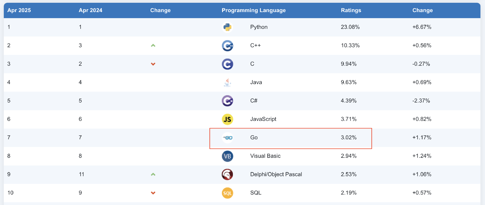
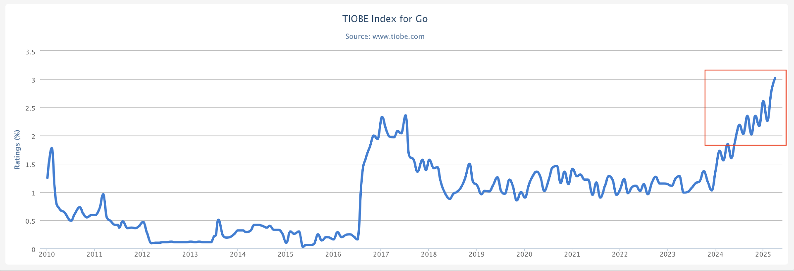

# 开篇词｜从熟练到精通：开启你的Go语言进阶之旅
你好，我是 Tony Bai，一名在 Go 领域深耕多年的布道师。

也许你已经完成了我的 [《Go语言第一课》](http://gk.link/a/10AVZ)，或者通过其他途径掌握了 Go 的基础语法和常用库。但你可能正面临这样的困惑：

- **感觉到了瓶颈？** 写了不少 Go 代码，但总觉得离“精通”还差一口气，想写出更优雅、更高性能的代码却不知从何下手？

- **设计能力跟不上？** 面对复杂的业务需求，如何进行合理的项目布局、包设计、接口设计？如何选择合适的并发模型？

- **工程实践经验不足？** 知道要测试、要监控、要优化，但具体到 Go 项目，如何搭建可观测性体系？如何进行有效的故障排查和性能调优？如何保证代码质量和线上稳定？

- ……

如果你有这些疑问，那么这门“Go 语言进阶课”正是为你量身打造的。

## 现在是进阶 Go 的最佳时机吗？

如果你还在观望：Go语言还值得深入吗？前景如何？我的答案是：现在正是学习和进阶 Go 的最佳时机！

### Go 正迎来它的黄金十年

如果你关注近些年的主流语言应用趋势，不难发现，从国外的Google、特斯拉，到国内的腾讯（连续两年内部最热门语言）、字节跳动（超55%服务用Go实现，并开源了Kitex、Hertz等框架），再到越来越多的中小和初创公司，都在生产环境大规模使用Go。为什么？ **Go 语言是生产力与执行效率的最佳结合**，尤其在云原生、微服务、中间件领域优势明显，能实实在在的降本增效。

各大行业榜单也是稳中有进。无论是关注工程师需求的IEEE Spectrum，追踪社区热度的RedMonk，衡量开源项目量的GitHub Octoverse，还是搜索热度的TIOBE，Go语言都呈现出稳步上升甚至屡创新高的态势。特别是在TIOBE榜单上，Go 已稳定在第 7 名，并且 **在 2025 年 4 月榜中，其份额首次超过 3%，达到 3.02%。**

从全球开发者社区来看的话，热度不减。新冠疫情后，全球GopherCon大会和Meetup纷纷回归线下，国内GopherChina甚至一年两办，连非洲也迎来了首届GopherCon。 **这背后是** **Go** **开发者生态的持续繁荣。**

开发者基数扩大、优秀项目涌现是排名上升的基础。2025年伊始，我们看到 [TypeScript 编译器项目向 Go 移植](https://tonybai.com/2025/03/12/typescript-native-port-to-go)，各大主流大模型厂商纷纷推出官方Go SDK项目，Ollama成为本地运行大模型工具的事实标准，我们还看到 Grafana 基于 Go 构建 MCP Server（ [mcp-grafana](https://github.com/grafana/mcp-grafana)），GitHub 更是 [用 Go 重写了其 MCP Server](https://github.com/github/github-mcp-server)（替换原有 JS 版本）……这些都展示了Go社区的活力以及Go在AI生态中的快速渗透和发展，也预示着 **Go** **在构建下一代** **AI** **应用（特别是与大模型交互相关的组件）方面将扮演越来越重要的角色。**

结合技术成熟度曲线来看，Go语言已经走出了“泡沫破裂谷底期”，稳步迈入“光明期”。正如我在 [《Go 语言第一课》](https://time.geekbang.org/column/intro/100093501) 结束语中预测的，Go 正迎来它的黄金十年。

### Go 持续进化，能力更强大

另外，Go语言并非一成不变，它在保持简洁和兼容性的同时，也在积极地吸纳社区反馈，不断进行自我完善和能力增强。近些年，Go语言迎来了许多重要的里程碑，为开发者提供了更现代、更高效的工具集。

- **泛型落地（Go 1.18）：** 这无疑是近年来最重大的语言特性更新，解决了无数 Gopher 的“心头痛”，极大地提升了代码的复用性和表达力，让编写类型安全的通用数据结构和函数成为可能。

- **兼容性承诺与演进策略（Go 1.x & math/rand/v2）：** Russ Cox 明确“不会有 Go 2”，并强调兼容性是 Go 最重要的特性，给开发者吃下了定心丸。同时，通过 math/rand/v2 包的发布，Go 团队也展示了如何在保持兼容性的前提下，对标准库进行版本化演进，为未来的改进铺平了道路。

- **性能优化持续发力（PGO & Runtime）：** Profile-Guided Optimization (PGO) 从 Go 1.20 的技术预览，到 Go 1.21 正式可用，并在 Go 1.22 中进一步增强了去虚拟化（devirtualization）的能力，Go 1.23 则显著降低了 PGO 的编译开销。这些改进能为典型 Go 应用带来 3-7% 甚至更高的性能提升。运行时的垃圾收集元数据优化也在持续进行，以降低 CPU 和内存开销。

- **语言层面精益求精（Loopvar Fix & Function Iterators）：** Go 团队勇于修正历史包袱。例如，长期困扰开发者的 for 循环变量共享问题在 Go 1.22 中得到了历史性的修正，每次迭代都会获得独立的变量实例。Go 1.23 则引入了对自定义函数迭代器的支持（range over func），让 for range 语句可以优雅地遍历用户自定义的集合类型，提升了语言的灵活性。

- **工程化与标准库能力显著增强：**
  - **标准库：** 新增了如 log/slog 结构化日志包，采用泛型实现的 slices、maps、cmp 包，用于处理唯一值的 unique 包，以及支持函数迭代器的 iter 包等。net/http.ServeMux 的路由能力在 Go 1.22 中也得到了大幅增强，支持方法谓词、路径变量和通配符。

  - **工具链：** 推出了官方安全漏洞扫描工具 govulncheck，加强了软件供应链安全。Go 1.23 正式引入了官方遥测系统（Telemetry），用于收集匿名的使用数据以指导 Go 的未来发展。go work 对 vendor 的支持、go mod tidy -diff 等改进也提升了日常开发效率。godebug 指示符的引入使得在 go.mod 中管理实验性特性或行为调整更为便捷。

这些变化并非孤立的补丁，它们共同构成了 Go 语言持续进步的图景： **更强的表达力、更高的性能、更完善的工具链、更丰富的标准库以及对开发者痛点的积极响应。**

正是因为 Go 语言这种务实、持续进化的态度，我们有理由相信，现在学习和掌握 Go 的进阶知识，将为你未来的技术生涯注入强大的动力。

### 大势所趋，Go 高级技能需求迫切

我们正处在一个 **云原生、微服务、分布式系统** 成为技术基础设施核心的时代。而Go语言，凭借其出色的并发性能、简洁的语法、高效的编译部署以及对网络编程的良好支持，已经成为构建这些现代系统的 **首选语言之一**。

这意味着什么？

**应用场景深化：** Go不再仅仅用于编写简单的API服务或工具。它被广泛应用于构建复杂的中间件（如服务网格、消息队列）、高性能网关、容器编排（Kubernetes生态）、可观测性系统（如Prometheus、VictoriaMetrics、VictoriaLogs等）、分布式数据库（如CockroachDB等）等核心基础设施。大型语言模型（LLM）应用的兴起带来了新的架构挑战。构建复杂的AI Agent、RAG（Retrieval-Augmented Generation）系统或多模型编排应用，往往需要一个强大的后端来处理业务逻辑、协调对不同模型/API/工具的调用、管理状态和并发。Go的并发模型和性能优势，使其成为构建这类复杂、高并发AI应用后端的有力竞争者。

**对工程师能力要求提升：** 要在这些关键领域构建稳定、高效、可扩展的系统，仅仅掌握Go的基础语法是远远不够的。企业迫切需要那些深刻理解 Go 并发模型、内存管理、性能调优、具备良好系统设计能力和工程实践经验的高级工程师。

**职业价值凸显：** 掌握Go的进阶知识和实践技能，意味着你能够胜任更具挑战性、更有价值的工作岗位，解决更复杂的工程问题。这直接关系到你的职业竞争力和发展空间。

总结来说，行业的技术发展方向与Go语言的优势高度契合，这催生了对真正掌握 Go 进阶技能人才的巨大需求。仅仅“会用” Go 已经不足以应对挑战，市场需要的是能够“精通”并能解决复杂问题的Go专家。

## 这门课能带给你什么？

作为一名在Go领域深耕多年的布道师和一线技术负责人（你可以在 [tonybai.com](https://tonybai.com) 找到我的博客），目前，我带领团队使用Go语言构建的车云平台产品，已经成功服务于国内外多家知名车企的量产车型。

在将产品从0到1、再到服务生产环境的过程中，我们踩过坑，也积累了丰富的Go语言实战经验，尤其是在 **系统设计、工程化实践和性能优化** 方面。我深知Go开发者从“入门”到“熟练”，再到“精通”需要跨越哪些障碍。

过去几年，我将这些经验和思考在团队内部分享，并带到了GopherChina大会的“Go 高级工程师必修课”培训中，收到了非常积极的反馈。因此，我决定再推出一门进阶课，希望能系统性地帮助更多Gopher突破瓶颈。

### 提升能力的三个核心维度

那么这门课是如何设计的呢？

进阶课摒弃了简单罗列知识点的方式，聚焦于 Go 工程师能力提升的三个核心维度，为你精心设计了三大模块。

**模块一：夯实基础，突破语法认知瓶颈**

这里我们不满足于“知道”，而是追求“理解”。深入类型系统、值与指针、切片与map陷阱、接口与组合、context、泛型等核心概念的底层逻辑与设计哲学，让你写出更地道、更健壮的Go代码，彻底告别“语法坑”。

**模块二：设计先行，奠定高质量代码基础**

从宏观的项目布局、包设计，到具体的并发模型选择、接口设计原则，再到实用的错误处理策略和API设计规范。这一模块将提升你的软件设计能力，让你能驾驭更复杂的项目。

**模块三：工程实践，锻造生产级Go服务**

聚焦于将Go代码变成可靠线上服务的关键环节。如何构建应用骨架（初始化、依赖注入、优雅退出）？如何实现核心组件（配置、日志、插件化）？如何落地可观测性（Metrics、Logging、Tracing）？如何进行高效的故障排查、测试组织、性能调优、云原生部署以及与AI大模型集成？这里全是硬核干货。

此外，我们还安排了 **实战串讲项目**，带你将前面学到的知识融会贯通，亲手构建并完善一个真实的Go服务。

通过这门课程的学习，你不仅可以掌握Go的高级特性和用法，更能 **建立起** **Go** **语言的设计思维和工程思维**，真正具备驾驭大型Go项目、解决复杂工程问题的能力，完成从“Go 熟练工”到“Go 专家”的蜕变。

你准备好了吗？让我们一起，开启这段激动人心的Go语言进阶之旅！