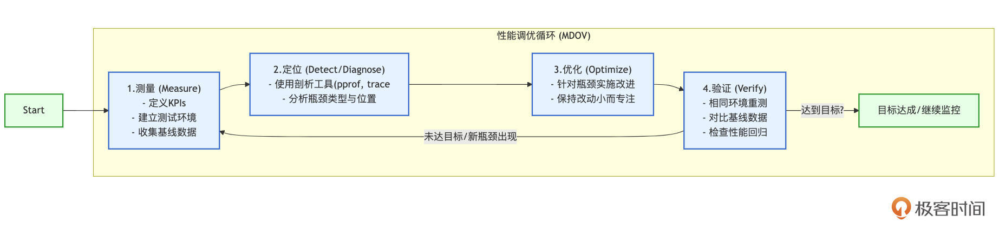
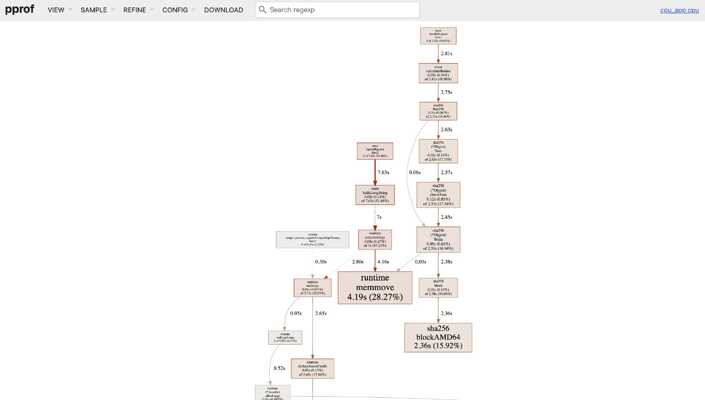
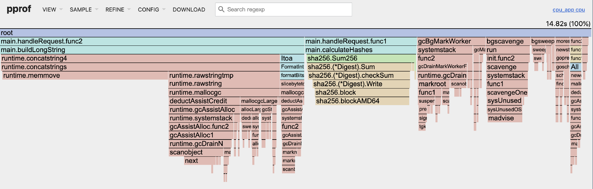
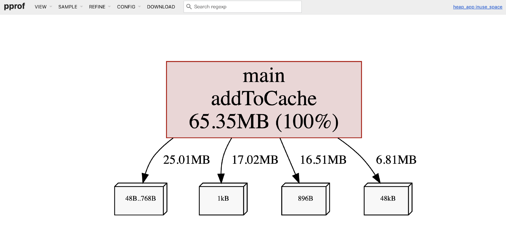
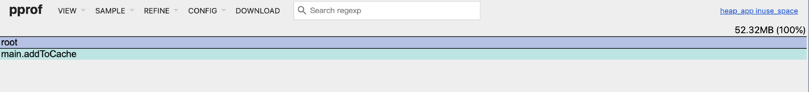

# 性能调优：定位瓶颈，优化Go程序的系统方法（上）
你好，我是Tony Bai。

在前面的课程中，我们已经学习了如何构建健壮的应用骨架，如何实现核心组件，如何进行有效的故障诊断，包括初步使用 `pprof` 等工具来定位问题。当我们的可观测性系统或故障诊断过程将矛头指向了“性能”这个维度时——例如，应用响应缓慢、CPU居高不下、内存持续增长——仅仅知道“哪里出了问题”是不够的。 **真正的挑战在于，如何系统性地分析这些性能瓶颈，并运用恰当的优化手段来提升我们Go程序的效率和资源利用率。**

Go语言以其出色的性能而闻名，其高效的并发模型、优化的编译器和低延迟的垃圾回收器为我们构建高性能应用打下了坚实的基础。然而，在复杂的业务场景和大规模部署下，即便是Go程序，也可能因为不当的编码实践、低效的算法选择，或者对Go运行时特性理解不足而遭遇性能瓶颈。

**你是否也曾在性能调优中感到困惑？**

- 面对性能问题，是应该立即修改代码，还是先做点别的？

- `pprof` 的各种profile眼花缭乱，如何从火焰图、top列表、调用图中准确解读出瓶颈所在？

- 除了 `pprof`，Go还提供了哪些工具能帮助我们洞察更深层次的执行细节，比如goroutine调度和GC行为？

- 针对CPU、内存、并发、I/O等不同类型的瓶颈，Go语言有哪些特有的、行之有效的优化技巧？


如果这些问题触动了你，那么接下来的两节课正是为你精心准备的，我们将一起深入Go程序的性能调优之旅。

这节课，我们先建立一套科学的性能分析方法论，然后再次深入实战Go的性能剖析利器 `pprof`（在不同维度上进行更细致的分析）。下节课再结合最新的Go运行时追踪工具 `trace` 来洞察执行细节，同时系统性地梳理Go中常见的性能瓶颈类型及其对应的、具有Go特色的优化技巧。

这两节课的核心理念，也是所有性能优化工作的金科玉律：“ **不要猜测，要测量！**”（Measure, don’t guess!）只有基于真实的数据和科学的方法，我们的优化工作才能精准有效，避免盲目修改带来的风险。

准备好了吗？让我们一起揭开Go性能调优的神秘面纱，学习如何让你的Go程序跑得更快、更稳、更省资源！

在真正拿起 `pprof` 这样的“手术刀”对Go代码进行剖析和优化之前，我们必须先在脑海中建立起一套清晰、科学的性能调优方法论。这套方法论将作为我们后续所有行动的指南针，确保我们的努力不会偏离正确的方向。

## Go性能调优方法论：科学的优化之路

性能调优绝非仅仅是修改几行代码那么简单，它是一项系统性的工程，需要严谨的态度和科学的方法。如果缺乏正确的方法论指导，我们很容易陷入一些误区，不仅效率低下，甚至可能引入新的问题使情况变得更糟或导致过度优化。

### 性能调优的常见误区与核心原则

在开始任何性能优化工作之前，我们首先需要警惕一些开发者容易陷入的常见误区。

**“过早优化是万恶之源”**，这句来自Donald Knuth的箴言，提醒我们不应在需求尚未明确、代码结构尚未稳定，甚至在没有数据证明存在性能瓶颈之前，就投入大量精力进行细枝末节的优化。这样做往往事倍功半，甚至可能因为需求变化而导致之前的努力付诸东流。

**同样需要避免的是“凭感觉优化”**，即仅根据直觉或以往经验猜测瓶颈所在，这往往是不准确的。此外，仅仅关注对某个函数的局部极致优化，如果该函数在系统整体性能中占比不高，那么对整体的提升也将微乎其微。最后，缺乏明确的优化目标（例如，P99延迟降低多少，吞吐量提升多少）会使优化工作失去方向，也难以评估其真实效果。

为了避免这些误区，并确保我们的性能调优工作卓有成效，我们应该始终遵循一些核心原则。

首先也是最重要的， **性能调优必须由数据驱动（Data-Driven）**。所有的分析、决策和验证都必须基于真实的、可量化的性能数据，这些数据可以来自基准测试、压力测试或线上的性能剖析与监控。

其次，在开始优化之前，我们必须 **明确具体的、可衡量的性能改进目标**。再次，根据“木桶理论”，我们应该优先识别并优化对整体性能影响最大的瓶颈点。

最后，性能优化通常是一个迭代的过程，我们应遵循“小步快跑，持续验证”的原则，每次只做少量相关的改动，并立即验证其效果，同时也要充分考虑潜在的权衡，例如时间复杂度与空间复杂度之间，或性能提升与代码可读性、可维护性之间的平衡。

遵循这些原则，我们就能为性能调优工作打下坚实的方法论基础。接下来，我们将这些原则具象化为一个系统性的操作流程。

### 性能调优的系统化流程：测量、定位、优化、验证（MDOV）

一个科学的性能调优过程，可以概括为一个持续迭代的循环，我这里称之为MDOV流程：测量（Measure）、定位（Detect/Diagnose）、优化（Optimize）、验证（Verify）。这个流程确保了我们的每一步优化都是有据可依、目标明确且效果可评估的。

我们可以用下图来直观地展示这个流程：



这个MDOV循环清晰地展示了性能调优的四个核心阶段及其迭代关系。

#### 阶段一：测量——建立基线，收集数据

这是所有性能工作的起点。

首先，你需要定义清晰的关键性能指标，例如请求延迟（平均值、P95、P99等分位数）、吞吐量（QPS/TPS）、CPU和内存使用率、GC暂停时间、goroutine数量等，这些指标应该与你的业务目标和用户体验直接相关。

其次，你需要建立一个稳定、可重复的性能测试环境，这可能包括编写Go的基准测试（ `testing.B`）、使用压力测试工具（如 `k6`、 `vegeta` 或 `hey`）模拟真实负载，或者（对于线上问题）配置好持续剖析和监控系统。

最重要的一步是在进行任何优化之前，务必在这个环境中运行测试并收集一组基线的性能数据，这将作为后续所有优化效果的参照标准。

#### 阶段二：定位——识别瓶颈

当测量数据显示当前性能未达到预期目标，或者你希望进一步挖掘性能潜力时，就需要进入定位阶段。核心任务是使用性能剖析工具（如Go的 `pprof` 和 `trace` 工具，我们将在后面详细讲解）来深入分析应用的运行时行为，找出那些消耗了不成比例的资源（CPU时间、内存分配）、执行速度过慢，或者导致不必要阻塞的关键代码路径、函数或资源。

同时，还需要分析瓶颈的类型：是计算密集型问题，还是内存分配过多导致GC压力，或者是I/O等待，亦或是并发同步（如锁竞争、channel阻塞）引入的瓶颈？不同类型的瓶颈，其分析视角和后续的优化策略会有显著差异。

#### 阶段三：优化——实施改进

在准确地定位到性能瓶颈之后，就可以针对性地实施优化了。这可能涉及改进算法的逻辑、优化数据结构的选择、减少不必要的内存分配、使用更高效的并发模式、引入缓存机制，或者对I/O操作进行批量处理等等。

在实施优化时，一个重要的原则是保持改动尽可能小而专注。避免一次性进行大量、不相关的代码修改，因为这会让你难以判断是哪个具体的改动带来了性能提升（或下降），也难以评估每个改动的独立效果，甚至可能引入新的问题。

#### 阶段四：验证——评估效果，检查回归

优化完成后，绝不能想当然地认为问题已经解决或性能一定提升了。必须在与收集基线数据完全相同的测试环境下，重新运行性能测试，并收集新的性能数据。

然后，将新的数据与基线数据进行严格对比，以量化的方式评估这次优化是否达到了预期的目标（例如，P99延迟是否如期降低了20%）。

同时，还需要密切关注其他相关的性能指标，确保优化某个方面的同时，没有对其他方面造成不可接受的负面影响（即性能回归（Regression））。例如，一个旨在降低CPU占用的优化，不应该导致内存占用大幅增加或请求延迟显著上升。如果优化效果显著且无明显副作用，那么这次优化就是成功的，记录下优化前后的数据对比和所做的具体改动。如果效果不明显，或者引入了新的问题，可能需要回退这次改动，或者重新回到“定位”阶段，审视瓶颈分析是否准确，调整优化策略。

性能调优通常不是一次性的行为，而是一个 **持续迭代的循环过程**。解决了当前最主要的瓶颈后，系统的下一个（次要的）瓶颈点可能会浮现出来，你需要重复这个MDOV流程，不断地测量、定位、优化和验证，直到应用的性能达到既定目标，或者进一步优化的投入产出比不再具有吸引力。

掌握了这套科学的方法论，我们就有了进行性能调优的“导航系统”。接下来，我们将再次深入Go语言的性能剖析利器——pprof，学习如何更精细地用它来执行MDOV流程中的“定位”环节，从不同维度分析性能瓶颈。

## pprof实战再深入：从概览到多维度瓶颈分析

在讲解“故障诊断”时，我们已经对 `pprof` 有了初步的了解，知道它可以帮助我们获取CPU、内存等方面的性能剖析数据。本节课，我们将从“性能调优”的视角出发，再次深入 `pprof` 的实战应用，重点学习如何解读其产生的不同类型的profile，并如何利用这些信息来精准定位各种常见的性能瓶颈。我们将不仅仅满足于“找到热点函数”，更要理解这些热点背后的原因，以及它们是如何影响系统整体性能的。

### `net/http/pprof` 与 `runtime/pprof`：回顾与选择

Go语言原生支持的获取性能分析数据的方式主要有两种： `net/http/pprof` 和 `runtime/pprof`。它们各自有不同的使用场景和优缺点。

首先， `net/http/pprof` 通过HTTP服务来暴露分析端点，这种方式非常适合长期运行的HTTP服务。开发者只需在应用中匿名导入 `_ "net/http/pprof"` 包，这样就会自动在 `http.DefaultServeMux` 或指定的Mux上注册多个以 `/debug/pprof/` 为前缀的端点。用户可以通过浏览器访问这些端点，例如访问 `http://localhost:8080/debug/pprof/` 可查看可用的profile列表。此外，使用 `go tool pprof` 命令可以直接从这些端点抓取profile数据，例如通过 `go tool pprof http://localhost:8080/debug/pprof/profile?seconds=30` 抓取30秒的CPU profile。

该方法的优点在于，它允许在线上或测试环境中按需获取实时的profile数据，而不需要重启应用。然而，它的缺点是要求应用本身是一个HTTP服务，或者需要额外启动一个HTTP服务来专门提供pprof端点。

另一方面， `runtime/pprof` 提供了一套代码API，允许开发者手动控制profile的生成。这一标准库中的包提供了多种函数，可以精确地控制何时开始和停止收集特定类型的profile数据，并将结果写入文件。以下是CPU Profiling和Heap Profiling的示例代码片段：

```go
import (
    "os"
    "runtime/pprof"
    "runtime/trace" // trace也常与pprof结合
)

// CPU Profiling示例
fcpu, _ := os.Create("cpu.prof")
defer fcpu.Close()
pprof.StartCPUProfile(fcpu)
defer pprof.StopCPUProfile()
// ... 执行要剖析的代码 ...

// Heap Profiling示例
fheap, _ := os.Create("heap.prof")
defer fheap.Close()
pprof.WriteHeapProfile(fheap) // 写入当前时刻的堆快照

```

这种方法的优点在于能够精确控制剖析的范围和时机，特别适合于基准测试、命令行工具或在特定事件触发时进行剖析的场景。然而，它的缺点是需要对代码进行修改，以嵌入启动和停止profile的逻辑。

综上所述，对于线上服务和长期运行的应用，推荐使用 `net/http/pprof` 暴露端点的方式。而对于基准测试、短时任务或特定场景的深度剖析， `runtime/pprof` 的代码API提供了更多的灵活性。无论选择哪种方式，获取到的profile数据格式都是兼容的，都可以通过 `go tool pprof` 进行分析。

Go的 `pprof` 支持多种类型的profile，每种都对应着程序运行时的一个特定方面。理解不同profile的用途以及如何解读它们，是有效定位性能瓶颈的关键。接下来，我们将首先深入CPU Profile，它是识别计算密集型瓶颈最直接的工具。

### CPU Profiling 深度解析：找到CPU的“时间小偷”

当你的Go应用表现出CPU使用率过高，或者某个操作执行缓慢且你怀疑是计算密集型任务导致的，CPU Profiling就能帮助我们精确定位那些消耗了最多CPU执行时间的函数和代码路径——也就是找出程序中的“CPU时间小偷”。

Go语言的CPU Profiler采用的是 **基于采样的分析方法**。当CPU Profiling被激活后，Go运行时会以一个固定的频率（在Linux、macOS等类Unix系统上，通常是每秒100次，由操作系统的 `SIGPROF` 定时器信号驱动）中断正在执行的Go程序。每次中断发生时，Profiler会记录下当前正在CPU上执行的每个goroutine的函数调用栈。通过在一段时间内（例如，抓取一个30秒的profile）收集大量的这类调用栈样本，那些在样本中出现频率越高的函数调用栈，就表明它们所代表的代码路径在CPU上执行的时间越长，消耗的CPU资源也越多。这种采样方式对应用的性能影响相对较小，使其适用于生产环境的诊断。

下面我们就通过一个示例深度解析一下cpu profiling的过程与技巧。这个示例程序包含一个进行大量哈希计算的函数和一个进行大量字符串拼接（低效方式）的函数。

```go
// ch29/profiling/cpu_profiling_example/main.go
package main

import (
    "crypto/sha256"
    "fmt"
    "log"
    "net/http"
    _ "net/http/pprof" // 匿名导入pprof包
    "strconv"
    "sync"
    "time"
)

// calculateHashes: 一个CPU密集型任务，计算SHA256哈希多次
func calculateHashes(input string, iterations int) string {
    data := []byte(input)
    var hash [32]byte // sha256.Size
    for i := 0; i < iterations; i++ {
        hash = sha256.Sum256(data)
        // 为了让每次迭代的输入都不同，从而避免一些编译器优化或缓存效应，
        // 并且增加计算量，我们将上一次的哈希结果作为下一次的输入。
        // 注意：这只是为了模拟CPU消耗，实际意义不大。
        if i < iterations-1 { // 避免最后一次转换，因为我们只用hash
            data = hash[:]
        }
    }
    return fmt.Sprintf("%x", hash) // 返回最终哈希的十六进制字符串
}

// buildLongString: 另一个可能消耗CPU的函数，通过低效的字符串拼接
func buildLongString(count int) string {
    var s string // 使用+=进行字符串拼接，效率较低
    for i := 0; i < count; i++ {
        s += "Iteration " + strconv.Itoa(i) + " and some more text to make it longer. "
    }
    return s
}

// handleRequest: 模拟一个HTTP请求处理器，它会并发执行上述两个任务
func handleRequest(w http.ResponseWriter, r *http.Request) {
    iterations := 100000 // 哈希计算的迭代次数
    stringBuildCount := 2000 // 字符串拼接的迭代次数

    // 从查询参数中获取迭代次数，以便调整负载
    if queryIters := r.URL.Query().Get("iters"); queryIters != "" {
        if val, err := strconv.Atoi(queryIters); err == nil && val > 0 {
            iterations = val
        }
    }
    if queryStrCount := r.URL.Query().Get("strcount"); queryStrCount != "" {
        if val, err := strconv.Atoi(queryStrCount); err == nil && val > 0 {
            stringBuildCount = val
        }
    }

    log.Printf("Handling request: iterations=%d, stringBuildCount=%d\n", iterations, stringBuildCount)

    var wg sync.WaitGroup
    wg.Add(2) // 我们要等待两个goroutine完成

    var hashResult string
    var stringResultLength int // 只关心长度以避免打印过长字符串

    go func() { // Goroutine 1: 执行哈希计算
        defer wg.Done()
        startTime := time.Now()
        hashResult = calculateHashes("some_initial_seed_data_for_hashing", iterations)
        log.Printf("Hash calculation finished in %v. Result starts with: %s...\n",
            time.Since(startTime), hashResult[:min(10, len(hashResult))])
    }()

    go func() { // Goroutine 2: 执行字符串拼接
        defer wg.Done()
        startTime := time.Now()
        longStr := buildLongString(stringBuildCount)
        stringResultLength = len(longStr)
        log.Printf("String building finished in %v. Result length: %d\n",
            time.Since(startTime), stringResultLength)
    }()

    wg.Wait() // 等待两个goroutine都完成

    // 响应客户端
    fmt.Fprintf(w, "Work completed.\nHash result (prefix): %s...\nString result length: %d\n",
        hashResult[:min(10, len(hashResult))], stringResultLength)
}

// min是一个辅助函数
func min(a, b int) int {
    if a < b {
        return a
    }
    return b
}

func main() {
    // 启动pprof HTTP服务器 (通常与业务服务器在同一端口，或一个单独的admin端口)
    go func() {
        log.Println("Starting pprof server on :6060")
        // http.ListenAndServe的第二个参数是handler，nil表示使用http.DefaultServeMux
        // _ "net/http/pprof" 会将其handlers注册到DefaultServeMux
        if err := http.ListenAndServe("localhost:6060", nil); err != nil {
            log.Fatalf("Pprof server failed: %v", err)
        }
    }()

    // 启动业务HTTP服务器
    http.HandleFunc("/work", handleRequest) // 注册我们的业务处理器
    port := "8080"
    log.Printf("Business server listening on :%s. Access /work to generate load.\n", port)
    if err := http.ListenAndServe(":"+port, nil); err != nil { // 使用DefaultServeMux
        log.Fatalf("Business server failed: %v", err)
    }
}

```

接下来，我们运行一下该程序并对其进行剖析。

**1\. 运行Go应用**

```bash
$cd ch29/profiling/cpu_profiling_example/ # 进入示例代码目录
$go build -gcflags '-N -l' -o cpu_app main.go # 编译和运行示例程序，这里关闭了编译器的一些优化，便于后续演示
$./cpu_app
2025/06/12 14:47:56 Business server listening on :8080. Access /work to generate load.
2025/06/12 14:47:56 Starting pprof server on :6060

```

示例应用会在8080端口提供业务服务，并在6060端口提供pprof服务。

**2\. 产生负载**：在另一个终端，向 `/work` 端点发送一些请求以产生CPU负载。我们可以通过调整查询参数 `iters` 和 `strcount` 来控制计算的密集程度。

```bash
# 发送一个中等负载的请求
$curl "http://localhost:8080/work?iters=200000&strcount=5000"
# 可以多发几次，或者用hey, wrk等工具持续发送一段时间

```

**3\. 采集CPU Profile**：在负载产生期间，从pprof端点抓取CPU profile数据。我们将抓取30秒的数据并保存到 `cpu.prof` 文件。

```bash
$curl -o cpu.prof "http://localhost:6060/debug/pprof/profile?seconds=30"

```

**4\. pprof交互分析**：采集完成后，我们便可以使用 `go tool pprof` 进入交互式分析界面。

```bash
// 在cpu_profiling_example目录下
$go tool pprof ./cpu_app cpu.prof
File: cpu_app
Build ID: 874472e84348bbfbe3fdf905e2e0712051e7fbdd
Type: cpu
Time: 2025-06-12 07:28:18 UTC
Duration: 30.15s, Total samples = 14.82s (49.15%)
Entering interactive mode (type "help" for commands, "o" for options)
(pprof)

```

现在我们进入了 `(pprof)` 提示符，使用 `top10` 查看自身消耗（ `flat`）最多的函数：

```plain
(pprof) top10
Showing nodes accounting for 10650ms, 71.86% of 14820ms total
Dropped 201 nodes (cum <= 74.10ms)
Showing top 10 nodes out of 134
      flat  flat%   sum%        cum   cum%
    4190ms 28.27% 28.27%     4190ms 28.27%  runtime.memmove
    2360ms 15.92% 44.20%     2360ms 15.92%  crypto/internal/fips140/sha256.blockAMD64
     880ms  5.94% 50.13%      880ms  5.94%  runtime.madvise
     860ms  5.80% 55.94%     1020ms  6.88%  runtime.typePointers.next
     600ms  4.05% 59.99%     2050ms 13.83%  runtime.scanobject
     530ms  3.58% 63.56%      530ms  3.58%  runtime.futex
     500ms  3.37% 66.94%      670ms  4.52%  runtime.scanblock
     340ms  2.29% 69.23%      340ms  2.29%  runtime.tgkill
     200ms  1.35% 70.58%      290ms  1.96%  runtime.findObject
     190ms  1.28% 71.86%      240ms  1.62%  runtime.unlock2
(pprof)

```

从 `top10` 的输出中（你的具体数字可能不同），我们可以看到： `crypto/internal/fips140/sha256.blockAMD64` 占据了最高的 `flat`（自身消耗）百分比。这符合预期，因为SHA256计算是CPU密集型的。

但在这里我们并没有看到字符串连接操作所在函数buildLongString的身影，这是因为示例代码使用的是 `+` 操作符进行的连接，Go编译器将 `+` 操作符转换为了runtime.concatstrings等函数，而后者也调用了其他一些函数，甚至是汇编实现的函数来完成的字符串连接功能。

在这种情况下，我们只能通过 cum（累计消耗）百分比来看一下buildLongString的排名了。通过 `top10 -cum` 可以看到累计消耗的排名：

```plain
(pprof) top10 -cum
Showing nodes accounting for 4.32s, 29.15% of 14.82s total
Dropped 201 nodes (cum <= 0.07s)
Showing top 10 nodes out of 134
      flat  flat%   sum%        cum   cum%
     0.02s  0.13%  0.13%      7.63s 51.48%  main.buildLongString
         0     0%  0.13%      7.63s 51.48%  main.handleRequest.func2
         0     0%  0.13%         7s 47.23%  runtime.concatstring4
     0.04s  0.27%   0.4%         7s 47.23%  runtime.concatstrings
     0.01s 0.067%  0.47%      6.02s 40.62%  runtime.systemstack
     4.19s 28.27% 28.74%      4.19s 28.27%  runtime.memmove
     0.01s 0.067% 28.81%      3.71s 25.03%  runtime.mallocgc
         0     0% 28.81%      2.82s 19.03%  main.handleRequest.func1
     0.05s  0.34% 29.15%      2.81s 18.96%  main.calculateHashes
         0     0% 29.15%      2.80s 18.89%  runtime.rawstring (inline)

```

可以看到： `main.buildLongString` 的累计消耗排行首位，其 `cum` 值反映了字符串拼接操作的整体开销，而其 `flat` 自身开销占比则非常小，main.calculateHashes也是这个道理。 `runtime.memmove` 和 `runtime.mallocgc` 也出现在列表中，这通常与大量数据拷贝和内存分配有关，很可能与我们低效的字符串拼接方式（ `main.buildLongString`）相关。

使用 `list FunctionName` 我们可以在源码级别进一步“下钻”，以main.buildLongString为例：

```plain
(pprof) list main.buildLongString
Total: 14.82s
ROUTINE ======================== main.buildLongString in /root/test/goadv/ch29/profiling/cpu_profiling_example/main.go
      20ms      7.63s (flat, cum) 51.48% of Total
         .          .     32:func buildLongString(count int) string {
         .          .     33:    var s string // 使用+=进行字符串拼接，效率较低
         .          .     34:    for i := 0; i < count; i++ {
      20ms      7.63s     35:        s += "Iteration " + strconv.Itoa(i) + " and some more text to make it longer. "
         .          .     36:    }
         .          .     37:    return s
         .          .     38:}
         .          .     39:
         .          .     40:// handleRequest: 模拟一个HTTP请求处理器，它会并发执行上述两个任务
(pprof)

```

`list` 的输出清晰地指出了 `s += "Iteration " + strconv.Itoa(i) + " and some more text to make it longer. "` 这一行（第35行）是 `buildLongString` 函数内部CPU消耗的主要来源，这通常是因为每次 `+=` 都会创建一个新的字符串，导致大量的内存分配和拷贝。

除了命令行交互模式之外，go tool pprof还支持以Web GUI形式进行可视化分析。在 `pprof` 交互模式下输入 `web`（或直接使用 `go tool pprof -http=:8081 ./cpu_app cpu.prof` 启动Web UI），浏览器会自动打开一个包含多种视图的页面（默认View是Graph）：



> 注：Web GUI形式进行可视化分析需要主机上安装graphviz工具。

通过上图我们可以一眼看到sha256.blockAMD64是一个CPU开销大户！

我们也可以通过View菜单选择"Flame Graph"进入火焰图分析视图：



在火焰图中，你会看到一个非常宽的基座可能对应 `main.handleRequest` 或其启动的goroutine。在其下方， `main.calculateHashes` 会占据一个显著宽度的条块，并且它的下方大部分宽度会被 `sha256.blockAMD64` 占据，形成一个“高塔”。

`main.buildLongString` 也会形成一个相对较宽的条块，其下方可能会看到与字符串转换、内存分配和拷贝相关的运行时函数（如 `runtime.concatstrings`、 `runtime.mallocgc`、 `runtime.memmove`）。

火焰图能非常直观地展示CPU时间是如何在调用栈中分布的，帮助我们快速识别出那些“平顶宽条”（自身耗时多）或“宽底座高塔”（调用链耗时多）的函数。

如果你想更深入地了解某个热点函数（例如，一个你自己写的、没有调用其他库的复杂计算函数）为何耗CPU，可以使用 `disasm` 查看其汇编代码，并看到CPU样本在具体指令上的分布。这通常用于非常底层的性能优化。

通过这一系列分析，我们已经清晰地定位到 `calculateHashes` 中的SHA256计算和 `buildLongString` 中的低效字符串拼接是主要的CPU消耗源。这就为我们下一步的优化指明了方向。在后续讲解“常见性能瓶颈与Go特有的优化技巧”时，我们将针对性地讨论这些模式的优化方法。

CPU是重要的资源，但内存使用不当同样会导致严重的性能问题，甚至服务崩溃。例如，内存泄漏会导致应用可用内存越来越少直至OOM（Out Of Memory）；而过于频繁的内存分配则会给垃圾回收器（GC）带来巨大压力，消耗大量CPU并可能引发长时间的STW（Stop-The-World）暂停，严重影响应用响应。Heap Profiling正是我们诊断这类内存问题的“侦探”。

### Heap Profiling与内存分配分析：揪出“内存饕餮”

Heap Profile（堆剖析）用于分析Go程序在堆上内存的分配和当前持有情况。它可以帮助我们精准地回答以下问题：

- 哪些代码路径分配了最多的内存（识别内存分配热点）？

- 当前堆上主要是哪些类型的对象占用了内存？

- 这些占用了大量内存的对象，是在哪里被分配出来的（定位内存泄漏源头）？

- 应用的整体内存分配模式是怎样的？是否存在大量不必要的临时对象分配？


Go语言的Heap Profiler也是基于采样的。默认情况下，当程序运行时，Go的内存分配器每当累积分配达到512KB的新内存时就进行一次采样（这个采样率可以通过环境变量 `GOMEMPROFILE` 或代码 `runtime.MemProfileRate` 进行调整，例如 `runtime.MemProfileRate = 1` 表示对每次分配都采样，这会带来非常大的性能开销，仅用于特定调试；设置为0则关闭堆剖析）。每次采样时，Profiler会记录下导致这次（或这批）分配的函数调用栈，以及分配的对象大小和数量。 `go tool pprof` 在分析heap profile时，会根据这些采样数据和采样率，来估算出各个调用栈实际分配并持有的总内存大小和对象数量。

和cpu profile一样，下面我们也通过一个示例深度解析heap profiling的过程与技巧。在这个示例中，我们将创建两个goroutine，其中一个goroutine会持续向一个全局map中添加数据（模拟内存泄漏），另一个goroutine会高频地创建临时小对象（模拟高GC压力）。示例的代码如下：

```go
// ch29/profiling/heap_profiling_example/main.go
package main

import (
    "fmt"
    "log"
    "math/rand"
    "net/http"
    _ "net/http/pprof" // 匿名导入以注册pprof HTTP handlers
    "runtime"          // 用于 GC 和 MemStats
    "strconv"
    "sync"
    "time"
)

var (
    // globalCache 模拟一个可能导致内存泄漏的缓存
    globalCache = make(map[string][]byte)
    cacheMutex  sync.Mutex // 保护 globalCache 的并发访问
    randSrc     = rand.New(rand.NewSource(time.Now().UnixNano())) // 用于生成随机数据
)

// addToCache 持续向全局缓存中添加数据，模拟内存泄漏
func addToCache() {
    log.Println("Goroutine 'addToCache' started: continuously adding items to globalCache.")
    for i := 0; ; i++ {
        key := "cache_key_for_leak_simulation_" + strconv.Itoa(i)

        // 模拟不同大小的数据，平均约0.75KB (512 + 1024/2)
        dataSize := 512 + randSrc.Intn(512)
        data := make([]byte, dataSize) // 分配[]byte
        for j := 0; j < dataSize; j++ { // 填充随机数据
            data[j] = byte(randSrc.Intn(256))
        }

        cacheMutex.Lock()
        globalCache[key] = data // 将数据存入全局map
        cacheMutex.Unlock()

        if i%5000 == 0 && i != 0 { // 每5000次打印一次日志，避免刷屏
            log.Printf("[addToCache] Added %d items to cache. Current cache size: %d items.\n", i+1, len(globalCache))
            // 主动触发一次GC，以便pprof heap能看到更真实的inuse数据（可选）
            runtime.GC()
        }
        time.Sleep(1 * time.Millisecond) // 控制添加速度，避免瞬间撑爆内存
    }
}

// frequentSmallAllocs 模拟高频小对象分配
func frequentSmallAllocs() {
    log.Println("Goroutine 'frequentSmallAllocs' started: frequently allocating small temporary objects.")
    for {
        // 模拟在请求处理或一些计算中创建临时对象
        for i := 0; i < 1000; i++ {
            // 分配一个小字符串（通常会在堆上，如果逃逸或足够大）
            _ = fmt.Sprintf("temp_string_data_%d_and_some_padding", i)
            // 分配一个小结构体 (如果它逃逸到堆)
            // type TempStruct struct { A int; B string }
            // _ = &TempStruct{A:i, B:"temp"}
        }
        time.Sleep(50 * time.Millisecond) // 每轮分配后稍作停顿
    }
}

// handleStats 提供一个简单的HTTP端点来查看当前缓存大小和内存统计
func handleStats(w http.ResponseWriter, r *http.Request) {
    cacheMutex.Lock()
    numItems := len(globalCache)
    cacheMutex.Unlock()

    var m runtime.MemStats
    runtime.ReadMemStats(&m)

    fmt.Fprintf(w, "--- Cache Stats ---\n")
    fmt.Fprintf(w, "Current cache items: %d\n\n", numItems)
    fmt.Fprintf(w, "--- Memory Stats (runtime.MemStats) ---\n")
    fmt.Fprintf(w, "Alloc (bytes allocated and not yet freed): %v MiB\n", m.Alloc/1024/1024)
    fmt.Fprintf(w, "TotalAlloc (bytes allocated since program start): %v MiB\n", m.TotalAlloc/1024/1024)
    fmt.Fprintf(w, "Sys (total bytes of memory obtained from OS): %v MiB\n", m.Sys/1024/1024)
    fmt.Fprintf(w, "NumGC: %v\n", m.NumGC)
    // ... 可以打印更多 MemStats 字段
}

func main() {
    log.SetFlags(log.LstdFlags | log.Lmicroseconds) // 为日志添加微秒时间戳

    // 启动pprof HTTP服务器
    go func() {
        log.Println("Starting pprof HTTP server on localhost:6060")
        if err := http.ListenAndServe("localhost:6060", nil); err != nil {
            log.Fatalf("Pprof server failed: %v", err)
        }
    }()

    // 启动模拟内存泄漏的goroutine
    go addToCache()

    // 启动模拟高频小对象分配的goroutine
    go frequentSmallAllocs()

    // 启动业务HTTP服务器（用于查看stats和触发业务逻辑，如果未来添加）
    http.HandleFunc("/stats", handleStats)
    port := "8080"
    log.Printf("Business server listening on :%s. Access /stats to see cache size.\n", port)
    log.Println("Access http://localhost:6060/debug/pprof/heap to get heap profile.")
    log.Println("Let the application run for a while to observe memory changes.")
    if err := http.ListenAndServe(":"+port, nil); err != nil {
        log.Fatalf("Business server failed: %v", err)
    }
}

```

接下来，我们运行一下该程序并对其进行heap剖析。

**首先运行Go应用。**

```bash
$cd ch29/profiling/heap_profiling_example/
$go build -o heap_app -gcflags '-N -l' main.go
$./heap_app
2025/06/12 09:01:30.479049 Business server listening on :8080. Access /stats to see cache size.
2025/06/12 09:01:30.479226 Access http://localhost:6060/debug/pprof/heap to get heap profile.
2025/06/12 09:01:30.479237 Let the application run for a while to observe memory changes.
2025/06/12 09:01:30.479201 Goroutine 'frequentSmallAllocs' started: frequently allocating small temporary objects.
2025/06/12 09:01:30.479057 Starting pprof HTTP server on localhost:6060
2025/06/12 09:01:30.479121 Goroutine 'addToCache' started: continuously adding items to globalCache.
... ...

```

应用启动后， `addToCache` goroutine会持续向 `globalCache` 添加数据，模拟内存泄漏； `frequentSmallAllocs` goroutine会持续创建临时对象，模拟高GC压力。

**然后观察与采集Heap Profile。** 让程序运行一段时间（例如，1-2分钟），以便 `globalCache` 积累数据，并让 `frequentSmallAllocs` 执行多轮。然后我们采集不同时间点的Heap Profile（主要用于内存泄漏诊断）。在程序启动后不久（比如15-30秒），采集一次heap profile，命名为 `heap_early.prof`。

```bash
$curl -o heap_early.prof http://localhost:6060/debug/pprof/heap

```

让程序再继续运行1-2分钟，再次采集heap profile，命名为 `heap_late.prof`。

```bash
$curl -o heap_late.prof http://localhost:6060/debug/pprof/heap

```

接下来，我们先来使用命令行交互方式查看heap\_late.prof这个profile：

```plain
$go tool pprof ./heap_app heap_late.prof
File: heap_app
Build ID: 8c4020aed8edca3dd41d1940732a66815866c048
Type: inuse_space
Time: 2025-06-12 09:16:20 UTC
Entering interactive mode (type "help" for commands, "o" for options)
(pprof)

```

我们看到默认是inuse\_space视图，即当前持有的内存空间。通过 `top` 查看内存持有排名：

```plain
(pprof) top
Showing nodes accounting for 65.35MB, 100% of 65.35MB total
      flat  flat%   sum%        cum   cum%
   65.35MB   100%   100%    65.35MB   100%  main.addToCache
(pprof) top -cum
Showing nodes accounting for 65.35MB, 100% of 65.35MB total
      flat  flat%   sum%        cum   cum%
   65.35MB   100%   100%    65.35MB   100%  main.addToCache

```

切换到alloc\_space，可以查看采集的 `allocs` Profile，它记录的是从程序启动到采集时刻所有发生过的内存分配（包括那些已经被GC回收的），通常更能反映出哪些代码路径是“分配大户”。这可以用于诊断分配热点和GC压力：

```plain
(pprof) alloc_space
(pprof) top
Showing nodes accounting for 162.10MB, 99.39% of 163.10MB total
Dropped 5 nodes (cum <= 0.82MB)
Showing top 10 nodes out of 17
      flat  flat%   sum%        cum   cum%
   76.50MB 46.91% 46.91%    76.50MB 46.91%  fmt.Sprintf
   70.05MB 42.95% 89.85%    70.55MB 43.26%  main.addToCache
   13.50MB  8.28% 98.13%       90MB 55.18%  main.frequentSmallAllocs
    1.17MB  0.72% 98.85%     1.17MB  0.72%  compress/flate.(*compressor).init
    0.88MB  0.54% 99.39%     2.05MB  1.26%  compress/flate.NewWriter (inline)
         0     0% 99.39%     2.05MB  1.26%  compress/gzip.(*Writer).Write
         0     0% 99.39%     2.05MB  1.26%  net/http.(*ServeMux).ServeHTTP
         0     0% 99.39%     2.05MB  1.26%  net/http.(*conn).serve
         0     0% 99.39%     2.05MB  1.26%  net/http.HandlerFunc.ServeHTTP
         0     0% 99.39%     2.05MB  1.26%  net/http.serverHandler.ServeHTTP
(pprof)

```

从top10列表来看，main.frequentSmallAllocs调用的fmt.Sprintf、main.addToCache是heap内存分配大户， `flat` 列显示了该函数自身直接分配的内存， `cum` 列显示的是该函数及其调用的所有函数分配的heap内存。main.frequentSmallAllocs就是一个自身分配排名第三，但 `cum` 排名第一的函数，这点从下面top -cum可以印证：

```plain
(pprof) top -cum
Showing nodes accounting for 160.94MB, 98.67% of 163.10MB total
Dropped 5 nodes (cum <= 0.82MB)
Showing top 10 nodes out of 17
      flat  flat%   sum%        cum   cum%
   13.50MB  8.28%  8.28%       90MB 55.18%  main.frequentSmallAllocs
   76.50MB 46.91% 55.18%    76.50MB 46.91%  fmt.Sprintf
   70.05MB 42.95% 98.13%    70.55MB 43.26%  main.addToCache
    0.88MB  0.54% 98.67%     2.05MB  1.26%  compress/flate.NewWriter (inline)
         0     0% 98.67%     2.05MB  1.26%  compress/gzip.(*Writer).Write
         0     0% 98.67%     2.05MB  1.26%  net/http.(*ServeMux).ServeHTTP
         0     0% 98.67%     2.05MB  1.26%  net/http.(*conn).serve
         0     0% 98.67%     2.05MB  1.26%  net/http.HandlerFunc.ServeHTTP
         0     0% 98.67%     2.05MB  1.26%  net/http.serverHandler.ServeHTTP
         0     0% 98.67%     2.05MB  1.26%  net/http/pprof.Index
(pprof)

```

和cpu profile一样，通过 `list function_name` 可以继续向下“钻取”，得到分配内存的“真凶”，以main.frequentSmallAllocs为例：

```plain
(pprof) list main.frequentSmallAllocs
Total: 163.10MB
ROUTINE ======================== main.frequentSmallAllocs in /root/test/goadv/ch29/profiling/heap_profiling_example/main.go
   13.50MB       90MB (flat, cum) 55.18% of Total
         .          .     49:func frequentSmallAllocs() {
         .          .     50:    log.Println("Goroutine 'frequentSmallAllocs' started: frequently allocating small temporary objects.")
         .          .     51:    for {
         .          .     52:        // 模拟在请求处理或一些计算中创建临时对象
         .          .     53:        for i := 0; i < 1000; i++ {
         .          .     54:            // 分配一个小字符串（通常会在堆上，如果逃逸或足够大）
   13.50MB       90MB     55:            _ = fmt.Sprintf("temp_string_data_%d_and_some_padding", i)
         .          .     56:            // 分配一个小结构体 (如果它逃逸到堆)
         .          .     57:            // type TempStruct struct { A int; B string }
         .          .     58:            // _ = &TempStruct{A:i, B:"temp"}
         .          .     59:        }
         .          .     60:        time.Sleep(50 * time.Millisecond) // 每轮分配后稍作停顿
(pprof)

```

我们看到实际上fmt.Sprintf才是分配内存的“大户”，这和alloc\_space下top10的结果是一致的。

go tool pprof支持基于heap profile的增量分析，通过向go tool pprof传入-base选项，我们可以得到新增的内存分配量和持有量的数据：

```plain
$go tool pprof -base heap_early.prof ./heap_app heap_late.prof
File: heap_app
Build ID: 8c4020aed8edca3dd41d1940732a66815866c048
Type: inuse_space
Time: 2025-06-12 09:15:01 UTC
Entering interactive mode (type "help" for commands, "o" for options)
(pprof) top
Showing nodes accounting for 52.32MB, 100% of 52.32MB total
      flat  flat%   sum%        cum   cum%
   52.32MB   100%   100%    52.32MB   100%  main.addToCache
(pprof) alloc_space
(pprof) top
Showing nodes accounting for 127.99MB, 99.61% of 128.49MB total
Dropped 3 nodes (cum <= 0.64MB)
Showing top 10 nodes out of 17
      flat  flat%   sum%        cum   cum%
   59.50MB 46.31% 46.31%    59.50MB 46.31%  fmt.Sprintf
   54.94MB 42.76% 89.07%    55.44MB 43.15%  main.addToCache
   11.50MB  8.95% 98.02%       71MB 55.26%  main.frequentSmallAllocs
    1.17MB  0.91% 98.92%     1.17MB  0.91%  compress/flate.(*compressor).init
    0.88MB  0.69% 99.61%     2.05MB  1.59%  compress/flate.NewWriter (inline)
         0     0% 99.61%     2.05MB  1.59%  compress/gzip.(*Writer).Write
         0     0% 99.61%     2.05MB  1.59%  net/http.(*ServeMux).ServeHTTP
         0     0% 99.61%     2.05MB  1.59%  net/http.(*conn).serve
         0     0% 99.61%     2.05MB  1.59%  net/http.HandlerFunc.ServeHTTP
         0     0% 99.61%     2.05MB  1.59%  net/http.serverHandler.ServeHTTP
(pprof)

```

显然在这种“差值”状态下，fmt.Sprintf、main.addToCache和main.frequentSmallAllocs在持有增量和分配增量上依旧名列前茅。

和cpu profile一样，我们也可以通过Web GUI方式进行heap profile的分析。还是以对heap\_late.prof的分析为例，通过下面命令便可以让分析结果以图形化形式呈现在浏览器页面上：

```plain
$go tool pprof -http=0.0.0.0:8082 ./heap_app heap_late.prof

```

打开的Web UI（ `http://localhost:8082`）页面如下图所示：



默认显示的是 `inuse_space`（当前持有的内存空间）的相关视图，你可以通过左上角 “VIEW” 菜单切换各种视图：Top视图、Flame Graph（火焰图）视图等。

你也可以通过 “SAMPLE” 菜单切换到 `alloc_space` 空间，并查看该空间的相关视图。我们也可以以GUI方式对比早期和晚期快照，诊断内存泄漏（使用 `-base` 选项）：

```bash
$go tool pprof -http=0.0.0.0:8082 -base heap_early.prof ./heap_app heap_late.prof

```

这样打开的Web页面中的各种量就都是“增量”了，即从 `heap_early.prof` 时刻到 `heap_late.prof` 时刻之间，新增的内存持有量/分配量。这是诊断内存泄漏的利器。在Web UI的火焰图或Top视图中，那些显著增长的部分，就是在这段时间内泄漏或新分配且未释放的内存的来源。在我们的例子中， `main.addToCache` 导致的 `globalCache` 增长会非常明显，如下图所示：



通过Heap Profile的多维度分析——既关注当前持有的内存（ `inuse_space`，用于查泄漏），也关注总分配量（ `alloc_space`，用于查GC压力），我们就能够更全面地理解应用的内存使用模式，并找出需要优化的地方。

到这里，我们已经深入探讨了如何通过CPU Profile定位计算热点，以及如何通过Heap Profile诊断内存分配和泄漏问题。然而，Go程序的性能瓶颈往往不是孤立存在的。很多时候，CPU的繁忙可能源于过度的内存分配导致的GC压力；而应用的响应缓慢，除了CPU和内存因素外，更可能与Go强大的并发模型中goroutine的调度、阻塞以及同步原语（如锁和channel）的使用不当密切相关。

因此，要全面地理解和优化Go程序的性能，我们不能仅仅满足于分析单一类型的profile。更高级的性能调优，需要我们学会综合运用多种profile数据，将它们关联起来，从不同维度相互印证，从而更精准地定位到问题的根本原因。

### 综合运用多种Profile进行关联分析

虽然CPU Profile和Heap Profile为我们揭示了计算和内存方面的宏观性能瓶颈，但Go应用的性能还深受其并发行为的微观细节影响。当应用出现响应缓慢、吞吐量下降，但CPU和内存使用率看似并不极端时，问题往往潜藏在goroutine的调度、不必要的阻塞或低效的同步开销中。这时，我们就需要结合Goroutine Profile、Block Profile和Mutex Profile，甚至运行时追踪（ `go tool trace`）来进行一次更全面的“会诊”。

#### Goroutine Profile

首先，让我们看看Goroutine Profile能提供哪些洞察。

正如我们之前讲过的，Goroutine Profile（可以通过 `net/http/pprof` 的 `/debug/pprof/goroutine` 端点获取，特别是使用 `?debug=1` 或 `?debug=2` 参数查看文本堆栈）能够捕获在某一时刻程序中所有存活goroutine的创建位置（即启动该goroutine的函数调用栈）及其当前正在执行（或阻塞）的位置的调用栈。

这份信息的核心价值在于 **帮助我们理解应用的并发实体“众生相”**。例如，在诊断Goroutine泄漏时，如果发现goroutine数量随时间持续异常增长，通过分析Goroutine Profile中那些大量处于相同阻塞点（比如，等待一个永远不会有数据的channel）且由相同代码路径创建的goroutine，就能快速定位到泄漏的源头。

同时，它也能帮助我们理解应用的整体并发结构和潜在瓶颈，比如哪些代码路径是goroutine的主要“孵化器”，以及这些goroutine当前主要阻塞在什么类型的操作上（如channel收发、select等待、系统调用或锁等待——状态通常会显示为 `chan send/receive`、 `select`、 `IO wait`、 `syscall`、 `semacquire` 等）。值得一提的是，Goroutine泄漏通常会伴随着内存泄漏，因为每个未能正常退出的goroutine所占用的栈内存（通常从几KB起步）以及它可能持有的堆上对象引用都无法被GC回收。因此，Goroutine Profile与Heap Profile的 `-inuse_space` 视图常常需要结合分析，相互印证泄漏的存在和具体影响。

#### Block Profile

在分析了goroutine的总体状态后，如果怀疑瓶颈在于同步等待，Block Profiling能为我们提供更聚焦的线索。

Go语言中的Block Profile（需要在代码中通过 `runtime.SetBlockProfileRate(rate)` 开启，并通过 `/debug/pprof/block` 端点获取）专门记录那些导致goroutine长时间阻塞在Go的核心同步原语上的调用点，以及它们的累积阻塞时间。这些原语主要包括channel的读写操作（当channel满或空时）、 `select` 语句（当所有case都无法立即满足时），以及 `sync.Cond.Wait()`。

通过分析Block Profile（例如，在 `pprof` 工具中使用 `top` 命令），我们可以识别出哪些特定的channel操作或 `select` 语句是导致goroutine等待时间最长的“瓶颈点”。例如，如果大量goroutine长时间阻塞在对同一个有缓冲channel的发送操作上，这通常意味着channel已满，表明下游的消费者处理速度跟不上上游的生产者；反之，如果阻塞在接收操作上，则表明channel为空，生产者供应不足。这些信息对于优化并发流程和调整channel缓冲策略至关重要。

#### Mutex Profile

与Block Profiling相辅相成的是Mutex Profiling，它专门用于揭示由互斥锁（ `sync.Mutex` 和 `sync.RWMutex`）竞争导致的性能问题。

当多个goroutine频繁尝试获取同一个锁时，就会发生锁竞争，导致后来的goroutine不得不排队等待，这同样会引入显著的性能开销。Mutex Profile（需要在代码中通过 `runtime.SetMutexProfileFraction(rate)` 开启，并通过 `/debug/pprof/mutex` 端点获取）记录的正是这些因争用互斥锁而发生等待（阻塞）的调用点，以及它们累积的锁等待时间。通过分析Mutex Profile（同样可以使用 `pprof` 的 `top`、 `list`、火焰图等），我们可以清晰地识别出哪些锁是“热点锁”，即存在最激烈竞争的锁，以及哪些代码路径是这些锁竞争的主要贡献者。例如，如果一个保护了过大临界区的全局锁成为热点，这就强烈提示我们需要将锁的粒度细化，或者优化临界区内的逻辑以减少锁的持有时间。

值得注意的是，严重的锁竞争不仅直接导致goroutine的等待延迟，还可能因为频繁的goroutine上下文切换和调度器活动而间接消耗CPU资源。有时，CPU Profile中与锁获取相关的运行时函数（如 `runtime.semaacquiremutex`）如果占比较高，也从一个侧面印证了锁竞争的存在。

#### 常见的综合分析场景示例

要真正做到庖丁解牛，往往需要我们将这些不同维度的Profile数据结合起来，进行综合的关联分析。因为性能问题很少是单一因素造成的，它们之间常常存在复杂的因果关系。这里提供一些常见的综合分析思路。

##### 场景1：应用P99延迟很高，但CPU使用率和内存占用看似正常

初步诊断方向：这很可能不是计算密集或内存泄漏问题，而是由I/O等待、锁竞争或Channel阻塞等“等待型”瓶颈主导。

关联分析步骤：

- 首先，查看Goroutine Profile（特别是 `debug=2` 的文本输出）：观察是否有大量goroutine阻塞在网络I/O、文件I/O相关的系统调用上（状态通常显示为 `IO wait` 或 `syscall`），或者阻塞在特定的channel操作（ `chan receive/send`）或锁等待（ `semacquire`）上。记录下这些阻塞点的代码位置。

- 如果goroutine主要阻塞在channel或 `select` 上，接着分析Block Profile：查看哪些channel或 `select` 语句累积了最长的阻塞时间，确认是否与Goroutine Profile中观察到的一致。

- 如果goroutine主要阻塞在锁（ `semacquire` 状态），则分析Mutex Profile：找出竞争最激烈的锁及其调用点。

- 如果怀疑是外部I/O慢（例如，数据库查询慢、调用下游HTTP API慢），此时分布式追踪数据（ `go tool trace` 或OpenTelemetry Tracing）将变得非常关键，它可以清晰地展示外部调用的精确耗时。


##### 场景2：CPU使用率持续高位运行

初步诊断方向：这可能是计算密集型任务，或者是高频内存分配导致的GC压力。

关联分析步骤：

- 首先，分析CPU Profile：使用火焰图和 top/list 命令定位消耗CPU最多的热点函数和代码路径。

- 同时，分析Heap Profile并切换到 `-sample_index=alloc_space` 视图（查看总分配空间）：检查是否存在内存分配的热点代码路径。如果某些函数（即使它们在CPU Profile的 `flat` 值不高）产生了巨量的内存分配（无论这些内存是否很快被回收），这都会给GC带来巨大压力，导致GC更频繁地运行，从而间接消耗大量CPU时间。

- 再结合 `go tool trace`：通过Trace视图中的GC事件（特别是STW暂停时长和频率）和Heap视图（堆大小变化），可以验证GC压力是否确实是导致CPU高的一个重要因素。Trace中的Goroutine视图也能显示goroutine在CPU上的实际运行情况，以及被GC抢占的情况。


##### 场景3：内存使用量持续增长，疑似内存泄漏

初步诊断方向：最可能是Goroutine泄漏、未关闭的资源，或者某些全局数据结构只增不减。

关联分析步骤：

- 核心是分析Heap Profile，特别是通过对比不同时间点采集的 `-inuse_space` 快照（使用 `pprof -base` 选项）。这能清晰地显示出哪些类型的对象以及它们的分配调用栈，在这段时间内其持有的内存量在持续增长。

- 同时，分析Goroutine Profile：检查goroutine的总数量是否也在不合理地持续增长。如果是，那么泄漏的goroutine本身（包括它们的栈空间）就是内存泄漏的一部分。更重要的是，这些泄漏的goroutine可能还会持有对其他堆上对象的引用，从而阻止这些对象被GC回收。找出泄漏goroutine的创建位置和它们当前阻塞（或卡死）的位置至关重要。

- 最后，根据profile定位到的可疑代码路径，进行深入的代码审查，仔细检查资源（如文件句柄、网络连接、 `http.Response.Body`）是否都通过 `defer Close()` 或类似机制确保了关闭，map或slice等集合类型是否存在只添加不清理的逻辑，以及goroutine的退出条件是否都能被正确触发。


**这里的核心思想是：不要孤立地看待任何一种profile数据**。每种profile都从一个特定的维度揭示了程序的运行时行为。将CPU、内存（in-use和allocs）、goroutine、block、mutex以及我们接下来要学习的trace数据结合起来，让它们相互印证、互为补充，通常能帮助我们更准确、更全面地理解性能问题的本质，从而避免“头痛医头、脚痛医脚”的片面优化。

## 小结

这节课，我们首先强调了性能调优的正确方法论（MDOV循环）：始终基于数据（测量），明确目标，识别瓶颈，小步快跑并持续验证，避免了凭感觉或过早优化等常见误区。

然后，我们再次深入了Go性能剖析利器 `pprof`，不仅回顾了其基本用法，更从CPU Profile（定位计算热点）和Heap Profile（诊断内存分配与泄漏，包括 `inuse_space` 和 `alloc_space` 视图）两个核心维度进行了深度解析和实战演示。我们还强调了综合运用多种Profile进行关联分析的重要性，简要提及了Goroutine Profile、Block Profile和Mutex Profile在辅助诊断并发和内存问题时的价值，它们能与CPU和Heap Profile相互印证，帮助我们更全面地理解瓶颈。

欢迎在留言区分享你的思考和实践经验！我是Tony Bai，我们下节课见。
