# 性能调优：定位瓶颈，优化Go程序的系统方法（下）
你好，我是Tony Bai。

上节课，通过对 `pprof` 各种维度的深入剖析和综合关联分析的思维训练，我们能够更精准地定位到Go程序中的绝大多数性能瓶颈，但这通常只是性能调优过程的第一步——定位问题。

`pprof` 为我们提供了关于资源消耗的聚合性统计视图，它告诉我们“哪些函数或代码路径是热点”。然而，有时 **仅仅知道“哪里热”还不够，我们还需要理解“为什么热”以及“热的过程是怎样的”**，特别是对于那些与goroutine调度、GC行为、并发交互时序，或细微的I/O等待相关的复杂性能问题。

这时，我们就需要一个能提供更细粒度执行追踪信息的“终极武器”——Go运行时追踪工具。

## Go运行时追踪：洞察执行细节与并发交互

Go语言不仅提供了基于采样的 `pprof` 工具进行性能剖析，还提供了一种基于追踪（tracing）策略的工具。一旦开启，Go应用中发生的特定运行时事件便会被详细记录下来。这个工具就是Go Runtime Tracer（我们通常简称为Tracer），通过 `go tool trace` 命令进行分析。

Brendan Gregg在其性能分析的著作中曾指出，采样工具（如 `pprof`）通过测量子集来描绘目标的粗略情况可能会遗漏事件；而追踪则是基于事件的记录，能捕获所有原始事件和元数据。 `pprof` 的CPU分析基于操作系统定时器（通常每秒100次，即10ms一次采样），这在需要微秒级精度时可能不足。Go Runtime Tracer正是为了弥补这一环，为我们提供了更细致的、事件驱动的运行时洞察。

它由Google的Dmitry Vyukov设计并实现，自Go 1.5版本起便成为Go工具链的一部分，并在后续版本中持续改进，例如提高了数据收集效率和增加了对用户自定义追踪任务和区域的支持，以及更清晰的GC事件展示等。

那么，这个强大的Tracer究竟能为我们做什么呢？

### Go Runtime Tracer的核心能力

`go tool pprof` 帮助我们找到代码中的“热点”，而Go Runtime Tracer则更侧重于揭示程序运行期间 **goroutine的动态行为和它们与运行时的交互**。Dmitry Vyukov在最初的设计中，期望Tracer能为Go开发者提供至少以下几个方面的详细信息：

- **Goroutine调度事件**：
  - Goroutine的创建（ `GoCreate`）、开始执行（ `GoStart`）、结束（ `GoEnd`）。

  - Goroutine因抢占（ `GoPreempt`）或主动让出（ `GoSched`）而暂停。

  - Goroutine在同步原语（如channel收发、 `select`、互斥锁——尽管锁的直接追踪不如Mutex Profile，但其导致的阻塞会反映在goroutine状态上）上的阻塞（ `GoBlockSend`、 `GoBlockRecv`、 `GoBlockSelect`、 `GoBlockSync` 等）与被唤醒（ `GoUnblock`）。
- **网络I/O事件**：Goroutine在网络读写操作上的阻塞与唤醒。

- **系统调用事件**：Goroutine进入系统调用（ `GoSysCallEnter`）与从系统调用返回（ `GoSysCallExit`）。

- **垃圾回收器（GC）事件**：
  - GC的开始（ `GCSTWStart`、 `GCMarkAssistStart`）和停止（ `GCSTWDone`、 `GCMarkAssistDone`）。

  - 并发标记（Concurrent Mark）和并发清扫（Concurrent Sweep）的开始与结束。

  - STW（Stop-The-World）暂停的精确起止。
- **堆内存变化**：堆分配大小（HeapAllocs）和下次GC目标（NextGC）随时间的变化。

- **处理器（P）活动**：每个逻辑处理器P在何时运行哪个goroutine，何时处于空闲，何时在执行GC辅助工作等。

- **用户自定义追踪（User Annotation，Go 1.11+）**：允许开发者在自己的代码中通过 `runtime/trace` 包的API（如 `trace.WithRegion`、 `trace.NewTask`、 `trace.Logf`）标记出特定的业务逻辑区域、任务或事件，这些标记会与运行时事件一起显示在追踪视图中。


有了这些纳秒级精度的事件信息，我们就可以从逻辑处理器P的视角（看到每个P在时间线上依次执行了哪些goroutine和运行时任务）和Goroutine G的视角（追踪单个goroutine从创建到结束的完整生命周期、状态变迁和阻塞点）来全面审视程序的并发执行流。通过对Tracer输出数据中每个P和G的行为进行细致分析，并结合详细的事件数据，我们就能诊断出许多 `pprof` 难以直接揭示的复杂性能问题。

- **并行执行程度不足的问题**：例如，没有充分利用多核CPU资源，某些P长时间空闲，或者goroutine之间存在不必要的串行化。

- **因GC导致的具体应用延迟**：可以精确看到GC的STW阶段何时发生、持续多久，以及它如何打断了哪些goroutine的执行。

- **Goroutine执行效率低下或异常延迟**：分析特定goroutine为何长时间处于Runnable状态但未被调度，或者为何频繁阻塞在某个同步点、系统调用或网络I/O上。


可以看出，Tracer 与 `pprof` 工具的CPU、Heap等Profiling剖析是互补的：

- `pprof` 基于采样，给出的是聚合性统计，适合快速找到“热点”（消耗资源最多的地方）。

- Tracer 基于事件追踪，记录的是详细的时序行为，适合深入分析“过程是怎样”以及“为什么会这样”。


Tracer 的开销通常比 `pprof`（尤其是CPU Profile）要大，因为它记录的事件非常多，产生的数据文件也可能大得多。Dmitry Vyukov最初估计Tracer可能带来35%的性能下降，后续版本虽有优化（如Go 1.7将开销降至约25%），但仍不建议在生产环境持续开启，更适合按需、短时间地进行。

了解了 Tracer 能做什么之后，我们来看看如何在Go应用中启用它并收集追踪数据。

### 为Go应用添加Tracer并收集数据

Go为在应用中启用Tracer并收集追踪数据提供了三种主要方法，它们最终都依赖于标准库的 runtime/trace 包。

#### 手动通过 runtime/trace 包在代码中启停Tracer

这是最直接也最灵活的方式，允许你在代码的任意位置精确控制追踪的开始和结束。下面是一个典型的示例：

```go
// ch29/tracing/manual_trace_start_stop/main.go
package main

import (
    "fmt"
    "log"
    "os"
    "runtime/trace"
    "sync"
    "time"
)

func worker(id int, wg *sync.WaitGroup) {
    defer wg.Done()
    fmt.Printf("Worker %d: starting\n", id)
    time.Sleep(time.Duration(id*100) * time.Millisecond) // 模拟不同时长的任务
    fmt.Printf("Worker %d: finished\n", id)
}

func main() {
    // 1. 创建追踪输出文件
    traceFile := "manual_trace.out"
    f, err := os.Create(traceFile)
    if err != nil {
        log.Fatalf("Failed to create trace output file %s: %v", traceFile, err)
    }
    // 使用defer确保文件在main函数结束时关闭
    defer func() {
        if err := f.Close(); err != nil {
            log.Printf("Failed to close trace file %s: %v", traceFile, err)
        }
    }()

    // 2. 启动追踪，将数据写入文件f
    if err := trace.Start(f); err != nil {
        log.Fatalf("Failed to start trace: %v", err)
    }
    // 3. 核心：使用defer确保trace.Stop()在main函数退出前被调用，
    //    这样所有缓冲的追踪数据才会被完整写入文件。
    defer trace.Stop()

    log.Println("Runtime tracing started. Executing some concurrent work...")

    var wg sync.WaitGroup
    numWorkers := 5
    for i := 1; i <= numWorkers; i++ {
        wg.Add(1)
        go worker(i, &wg)
    }
    wg.Wait() // 等待所有worker完成

    log.Printf("All workers finished. Stopping trace. Trace data saved to %s\n", traceFile)
    fmt.Printf("\nTo analyze the trace, run:\ngo tool trace %s\n", traceFile)
}

```

这个例子中， `trace.Start(f)` 开启追踪， `defer trace.Stop()` 确保程序结束时停止追踪并将数据刷盘。在manual\_trace\_start\_stop目录下，通过go run main.go即可运行起该示例程序。程序运行结束后，就会在当前目录下生成 `manual_trace.out` 文件。不过要注意： `trace.Start` 和 `trace.Stop` 必须成对出现，且 `trace.Stop` 必须在所有被追踪的活动基本结束后调用，以确保数据完整。如果程序意外崩溃而未能调用 `trace.Stop`，追踪文件可能不完整或损坏。

这种手动方式非常适合对程序中的特定代码段或整个应用的完整生命周期进行追踪。

#### 通过 net/http/pprof 的HTTP端点动态启停Tracer

如果你的Go应用是一个HTTP服务，并且已经通过匿名导入 `_ "net/http/pprof"` 注册了pprof的HTTP Handler，那么你可以非常方便地通过其 `/debug/pprof/trace` 端点来动态地触发和收集追踪数据。

当客户端（如 `curl` 或浏览器）向该端点发送一个GET请求时， `net/http/pprof` 包中的 `Trace` 函数（位于 `$GOROOT/src/net/http/pprof/pprof.go`）会被调用。这个函数会：

- 解析请求中的 `seconds` 查询参数（例如 `?seconds=5`），如果未提供或无效，则默认为1秒。这个参数决定了追踪的持续时间。

- 设置HTTP响应头，表明将返回一个二进制流附件。

- 调用 `trace.Start(w)`，其中 `w` 是 `http.ResponseWriter`。这使得追踪数据直接写入HTTP响应体。

- 等待指定的 `seconds` 时长。

- 调用 `trace.Stop()`。


假设你的Go Web服务（已导入 `_ "net/http/pprof"`）监听在 `localhost:8080`，那么通过下面命令便可以抓取接下来5秒的追踪数据，并保存到 http\_trace.out 文件中：

```bash
$curl -o http_trace.out "http://localhost:8080/debug/pprof/trace?seconds=5"

```

这种方式非常适合对线上正在运行的服务进行按需、短时间的追踪，以捕捉特定时间窗口内的行为，而无需重启服务或修改代码。但要注意，追踪期间对服务的性能影响。

#### 通过 `go test -trace` 在测试执行期间收集Tracer数据

如果你想分析的是某个测试用例（单元测试或基准测试）的执行细节， `go test` 命令提供了一个便捷的 `-trace` 标志：

```bash
# 对当前包的所有测试执行期间进行追踪，结果保存到 trace.out
go test -trace=trace.out .

# 只对名为 TestMySpecificFunction 的测试进行追踪
go test -run=TestMySpecificFunction -trace=specific_test.trace .

# 对名为 BenchmarkMyAlgorithm 的基准测试进行追踪，并运行5秒
go test -bench=BenchmarkMyAlgorithm -trace=bench_algo.trace -benchtime=5s .

```

命令执行结束后，指定的trace输出文件中就包含了测试执行过程中的追踪数据。这对于分析测试本身的性能瓶颈，或者理解被测代码在测试场景下的并发行为非常有用。

掌握了如何收集追踪数据后，下一步就是如何解读这些数据，从中发掘有价值的信息。

### Tracer数据分析：解读可视化视图

有了Tracer输出的数据后，我们接下来便可以使用go tool trace工具对存储Tracer数据的文件进行分析了：

```plain
$go tool trace trace.out
// $go tool trace -http=0.0.0.0:6060 trace.out // 可以通过浏览器远程打开Tracer的分析页面

```

go tool trace会解析并验证Tracer输出的数据文件，如果数据无误，它接下来会在默认浏览器中建立新的页面并加载和渲染这些数据，如下图所示：

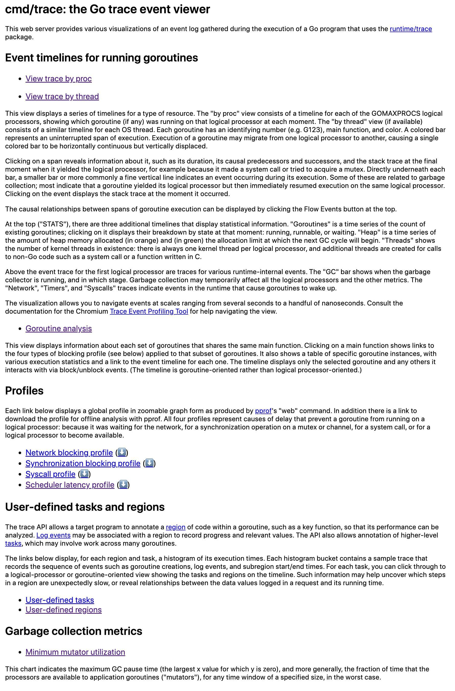

我们看到首页显示了多个数据分析的超链接，每个链接将打开一个分析视图，其中：

- View trace by proc/thread：分别从P和thread视角以图形页面的形式渲染和展示tracer的数据（如下图所示），这也是我们最为关注/最常用的功能。

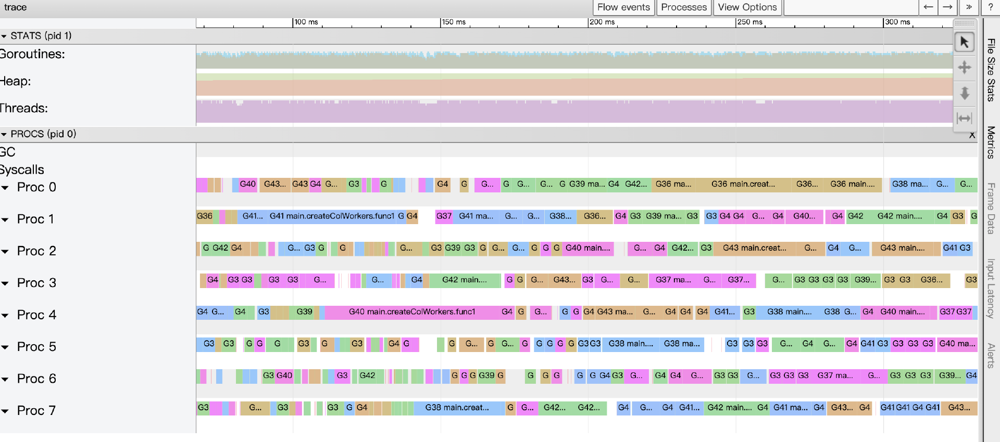

- Goroutine analysis：以表的形式记录执行同一个函数的多个goroutine的各项trace数据。下图的表格记录的是执行main.httpHandler.func3的几个goroutine的各项数据：

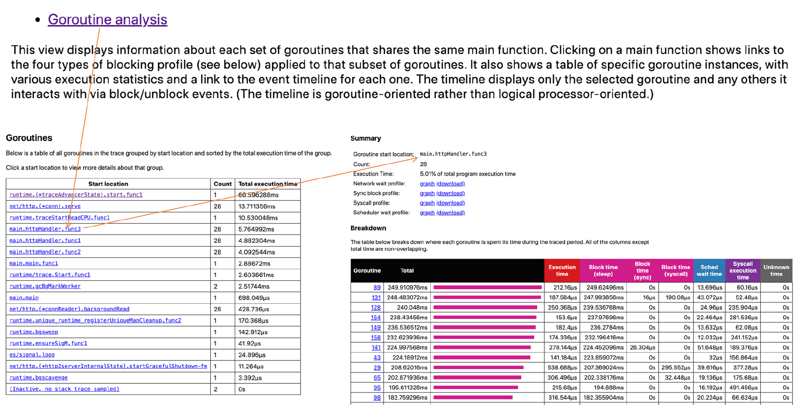

- Network blocking profile：用pprof profile形式的调用关系图展示网络I/O阻塞的情况。

- Synchronization blocking profile：用pprof profile形式的调用关系图展示同步阻塞耗时情况。

- Syscall profile：用pprof profile形式的调用关系图展示系统调用阻塞耗时情况。

- Scheduler latency profile：用pprof profile形式的调用关系图展示调度器延迟情况。

- User-defined tasks和User-defined regions：用户自定义trace的task和region。

- Minimum mutator utilization：分析GC对应用延迟和吞吐影响情况的曲线图。


通常我们最为关注的是View trace by proc/thread和Goroutine analysis，下面将详细说说这两项的用法。

#### View trace by proc/thread

点击 “View trace by proc” 进入Tracer数据分析视图，见下图：

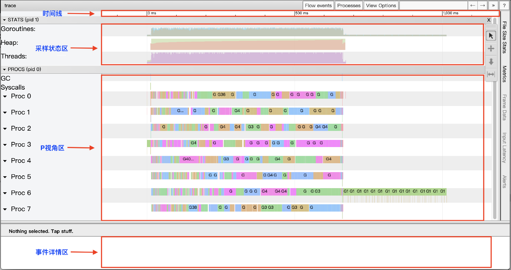

View trace视图是基于google的 [trace-viewer](https://github.com/catapult-project/catapult) 实现的，其大体上可分为四个区域。

**第一个区域是时间线（timeline）。** 时间线为View trace提供了时间参照系，View trace的时间线始于Tracer开启时，各个区域记录的事件的时间都是基于时间线的起始时间的相对时间。

时间线的时间精度最高为纳秒，但View trace视图支持自由缩放时间线的时间标尺，我们可以在秒、毫秒的“宏观尺度”查看全局，亦可以将时间标尺缩放到微秒、纳秒的“微观尺度”来查看某一个极短暂事件的细节，如下图所示：

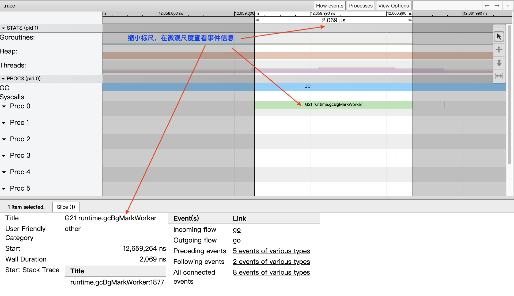

如果Tracer跟踪时间较长，trace.out文件较大，go tool trace会将View trace按时间段进行划分，避免触碰到trace-viewer的限制：

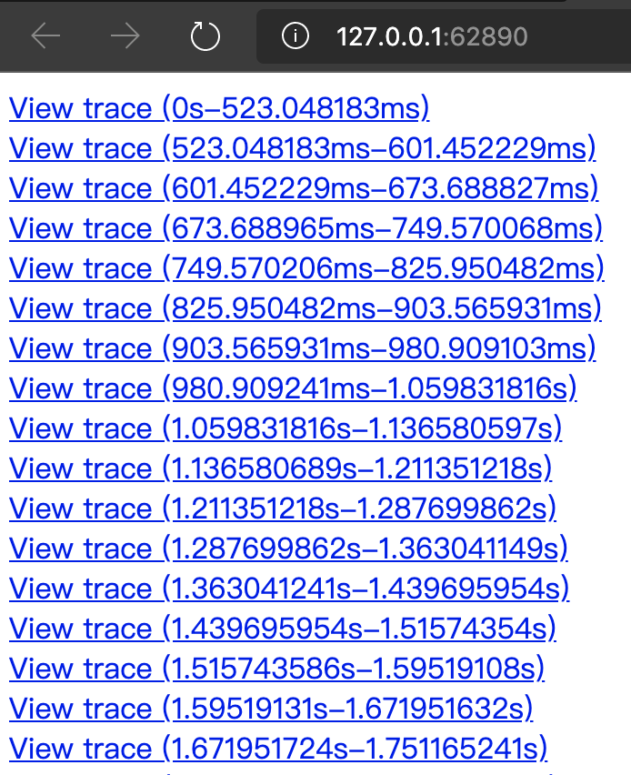

View trace使用快捷键来缩放时间线标尺：w键用于放大（从秒向纳秒缩放），s键用于缩小标尺（从纳秒向秒缩放）。我们同样可以通过快捷键在时间线上左右移动：s键用于左移，d键用于右移。如果你记不住这些快捷键，可以点击View trace视图右上角的问号？按钮，浏览器将弹出View trace操作帮助对话框，View trace视图的所有快捷操作方式都可以在这里查询到。

**第二个区域是采样状态区（STATS）。** 这个区内展示了三个指标：Goroutines、Heap和Threads，某个时间点上这三个指标的数据是这个时间点上的状态快照采样。

Goroutines表示某一时间点上应用中启动的goroutine的数量。当我们点击某个时间点上的goroutines采样状态区域时（我们可以用快捷键m来准确标记出那个时间点），事件详情区会显示当前的goroutines指标采样状态：

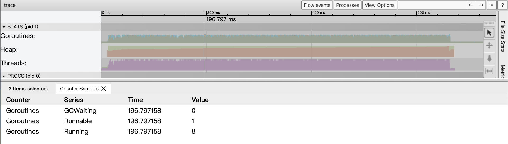

从上图中我们看到，那个时间点上共有9个goroutine，8个正在运行，另外1个准备就绪，等待被调度。处于GCWaiting状态的goroutine数量为0。

而Heap指标则显示了某个时间点上Go应用heap分配情况（包括已经分配的Allocated和下一次GC的目标值NextGC）：

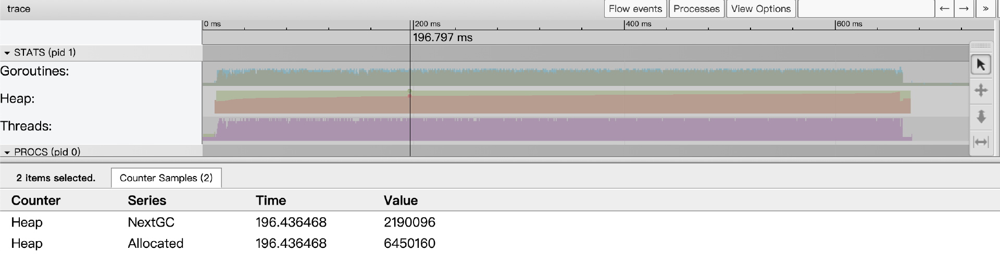

Threads指标显示了某个时间点上Go应用启动的线程数量情况，事件详情区将显示处于InSyscall（整阻塞在系统调用上）和Running两个状态的线程数量情况：

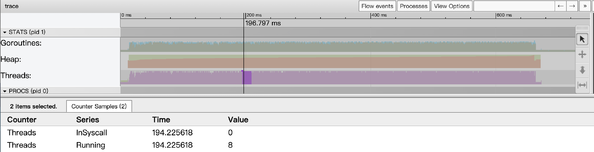

总的来说，连续的采样数据按时间线排列描绘出了各个指标的变化趋势情况。

**第三个区域是P视角区（PROCS）。** 这里将View trace视图中最大的一块区域称为“P视角区”。这是因为在这个区域，我们能看到Go应用中每个P（Goroutine调度概念中的P）上发生的所有事件，包括：EventProcStart、EventProcStop、EventGoStart、EventGoStop、EventGoPreempt、Goroutine辅助GC的各种事件，以及Goroutine的GC阻塞（STW）、系统调用阻塞、网络阻塞，以及同步原语阻塞（mutex）等事件。除了每个P上发生的事件，我们还可以看到以单独行显示的GC过程中的所有事件。

另外我们看到每个Proc对应的条带都有两行，上面一行表示的是运行在该P上的Goroutine的主事件，而第二行则是一些其他事件，比如系统调用、运行时事件等，或是goroutine代表运行时完成的一些任务，比如代表GC进行并行标记。下图展示了每个Proc的条带：

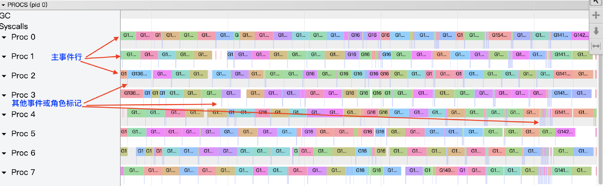

我们放大图像，看看Proc对应的条带的细节：

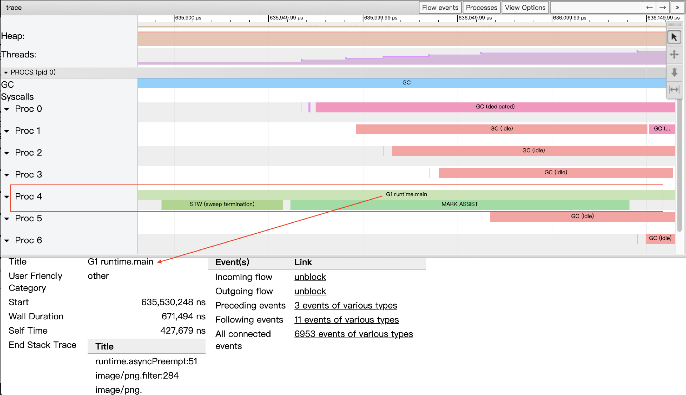

我们以上图proc4中的一段条带为例，这里包含三个事件。条带两行中第一行的事件表示的是，G1这个goroutine被调度到P4运行，选中该事件，在事件详情区可以看到该事件的详细信息：

- Title：事件的可读名称。

- Start：事件的开始时间，相对于时间线上的起始时间。

- Wall Duration：这个事件的持续时间，这里表示的是G1在P4上此次持续执行的时间。

- Start Stack Trace：当P4开始执行G1时G1的调用栈。

- End Stack Trace：当P4结束执行G1时G1的调用栈；从上面End Stack Trace栈顶的函数为runtime.asyncPreempt来看，该Goroutine G1是被强行抢占了，这样P4才结束了其运行。

- Incoming flow：触发P4执行G1的事件。

- Outgoing flow：触发G1结束在P4上执行的事件。

- Preceding events：与G1这个goroutine相关的之前的所有事件。

- Follwing events：与G1这个goroutine相关的之后的所有事件。

- All connected：与G1这个goroutine相关的所有事件。


proc4条带的第二行按顺序先后发生了两个事件，一个是stw，即GC暂停所有goroutine执行；另外一个是让G1这个goroutine辅助执行GC过程的并发标记（可能是G1分配内存较多较快，GC选择让其交出部分算力做gc标记）。

通过P视角区，我们可以可视化地显示整个程序（每个Proc）在程序执行时间线上的全部情况，尤其是按时间线顺序显示每个P上运行的各个goroutine（每个goroutine都有唯一独立的颜色）相关事件的细节。

P视角区显示的各个事件间存在关联关系，我们可以通过视图上方的“flow events”按钮打开关联事件流，这样在图中我们就能看到某事件的前后关联事件关系了（如下图）：

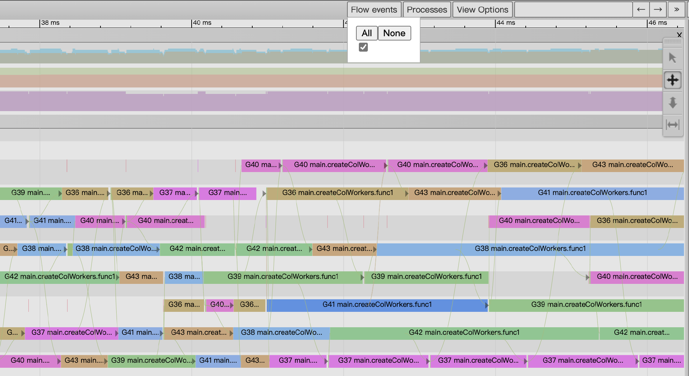

**第四个区域是事件详情区。** View trace视图的最下方为“事件详情区”，当我们点选某个事件后，关于该事件的详细信息便会在这个区域显示出来，就像上面Proc条带图示中的那样。

在宏观尺度上，每个P条带的第二行的事件因为持续事件较短而多呈现为一条竖线，我们点选这些事件不是很容易。点选这些事件的方法，要么将图像放大，要么通过左箭头或右箭头两个键盘键顺序选取，选取后可以通过m键显式标记出这个事件（再次敲击m键取消标记）。

#### Goroutine analysis

就像前面图中展示的Goroutine analysis的各个子页面那样，Goroutine analysis为我们提供了从G视角看Go应用执行的图景。

点击前面Goroutine analysis图中位于Goroutines表第一列中的任一个Goroutine id，我们将进入G视角视图：

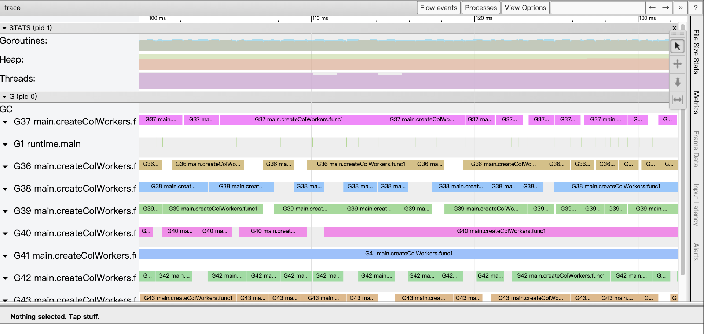

我们看到与View trace不同，这次页面中最广阔的区域提供的G视角视图，而不再是P视角视图。在这个视图中，每个G都会对应一个单独的条带（和P视角视图一样，每个条带都有两行），通过这一条带我们可以按时间线看到这个G的全部执行情况。

通过熟练运用Tracer UI的这些视图，并结合对Go运行时基本原理的理解，我们就能够从海量的追踪事件中提取出有价值的信息，诊断出许多隐藏较深的性能问题。

为了更具体地理解Go Runtime Tracer如何帮助我们分析和优化并发程序的性能，让我们来看一个经典的实例。

### 实例理解：通过Trace优化并发分形图渲染

这个例子来源于早期Go社区中一篇广受欢迎的关于Tracer使用的文章，它通过逐步优化一个并发生成分形图像（曼德布洛特集）的程序，清晰地展示了 `go tool trace` 在分析并行度、goroutine行为和并发瓶颈方面的强大能力。

我们将跳过分形算法本身的数学细节，重点关注不同并发实现版本在Trace视图中的表现，以及如何根据Trace的反馈进行优化。

#### 初始版本：串行计算

假设我们有一个第一版的代码，它串行地计算图像中的每一个像素点：

```go
// ch29/tracing/fractal_example/versions/v1_sequential/main.go

package main

import (
    "image"
    "image/color"
    "image/png"
    "log"
    "os"
    "runtime/trace"
)

const (
    output     = "out.png"
    width      = 2048
    height     = 2048
    numWorkers = 8
)

func main() {
    trace.Start(os.Stdout)
    defer trace.Stop()

    f, err := os.Create(output)
    if err != nil {
        log.Fatal(err)
    }

    img := createSeq(width, height)

    if err = png.Encode(f, img); err != nil {
        log.Fatal(err)
    }
}

// createSeq fills one pixel at a time.
func createSeq(width, height int) image.Image {
    m := image.NewGray(image.Rect(0, 0, width, height))
    for i := 0; i < width; i++ {
        for j := 0; j < height; j++ {
            m.Set(i, j, pixel(i, j, width, height))
        }
    }
    return m
}

// pixel returns the color of a Mandelbrot fractal at the given point.
func pixel(i, j, width, height int) color.Color {
    // Play with this constant to increase the complexity of the fractal.
    // In the justforfunc.com video this was set to 4.
    const complexity = 1024

    xi := norm(i, width, -1.0, 2)
    yi := norm(j, height, -1, 1)

    const maxI = 1000
    x, y := 0., 0.

    for i := 0; (x*x+y*y < complexity) && i < maxI; i++ {
        x, y = x*x-y*y+xi, 2*x*y+yi
    }

    return color.Gray{uint8(x)}
}

func norm(x, total int, min, max float64) float64 {
    return (max-min)*float64(x)/float64(total) - max
}

```

这一版代码通过pixel函数算出待输出图片中的每个像素值，这版代码即便不用pprof也基本能定位出来程序热点在pixel这个关键路径的函数上，更精确的位置是pixel中的那个循环。那么如何优化呢？pprof已经没招了，我们用Tracer来看看。

运行这个版本并生成trace文件和分型图：

```plain
$go build -o mandelbrot_v1 main.go
$./mandelbrot_v1 > fractal_v1_seq.trace
$go tool trace fractal_v1_seq.trace

```

我们会在Trace UI的“View trace”中看到类似下图的数据：

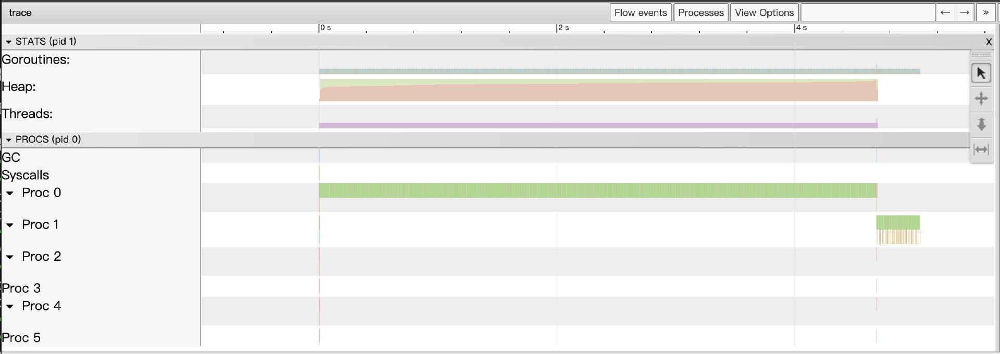

我们看到： **只有一个P（逻辑处理器）在忙碌，其他P都处于空闲状态**。Goroutines行上只有主goroutine在稳定地执行计算。这清晰地表明，这个串行版本完全没有利用多核CPU的并行能力。

#### 第二版：极端并发 \- 每像素一个Goroutine

为了利用多核，一个直接的想法是为每个像素点的计算都启动一个goroutine。

```go
// ch29/tracing/fractal_example/v2_pixel_goroutine/main.go
func createPixelParallel(width, height int) image.Image {
    m := image.NewGray(image.Rect(0, 0, width, height))
    var wg sync.WaitGroup
    wg.Add(width * height)
    for i := 0; i < width; i++ {
        for j := 0; j < height; j++ {
            go func(px, py int) { // 注意捕获循环变量
                defer wg.Done()
                m.Set(px, py, pixel(px, py, width, height))
            }(i, j)
        }
    }
    wg.Wait()
    return m
}
// main函数中调用 createPixelParallel 替换第一版中的 createSeq

```

运行这个版本并生成trace文件和分形图：

```plain
$go build -o mandelbrot_v2 main.go
$./mandelbrot_v2 > fractal_v2_goroutine.trace
$go tool trace fractal_v2_goroutine.trace

```

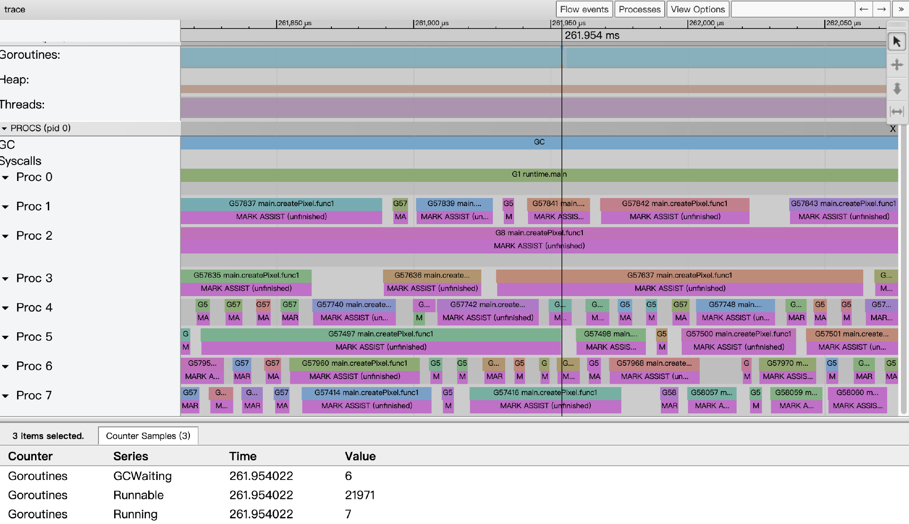

这一版性能上比第一版的纯串行思路的确有所提升，并且Trace视图会显示所有CPU核心都被利用起来了，但它也暴露了新的问题。

以261.954ms附近的事件数据为例，我们看到系统的8个cpu core都满负荷运转，但从goroutine的状态采集数据看到，仅有7个goroutine处于运行状态，而有21971个goroutine正在等待被调度，这给go运行时的调度带去很大压力；另外由于这一版代码创建了2048x2048个goroutine（400多w个），导致内存分配频繁，给GC造成很大压力，从视图上来看，每个Goroutine似乎都在辅助GC做并行标记。由此可见，我们不能创建这么多goroutine，即无脑地为每个最小单元都创建goroutine并非最佳策略。

接下来，我们来看第三版代码。

#### 第三版：按列并发 \- 每列一个Goroutine

于是作者又给出了第三版代码，仅创建2048个goroutine，每个goroutine负责一列像素的生成（用下面createCol替换createPixel）。

接下来一个自然而然的改进思路是减少goroutine的数量，让每个goroutine承担更多的工作。例如，为图像的每一列启动一个goroutine，由它负责计算该列所有像素，用下面createCol替换第二版的createPixel：

```go
// ch29/tracing/fractal_example/v3_column_goroutine/main.go
func createColumnParallel(width, height int) image.Image {
    m := image.NewGray(image.Rect(0, 0, width, height))
    var wg sync.WaitGroup
    wg.Add(width) // 为每一列启动一个goroutine
    for i := 0; i < width; i++ {
        go func(colIdx int) {
            defer wg.Done()
            for j := 0; j < height; j++ { // 该goroutine负责计算一整列
                m.Set(colIdx, j, pixel(colIdx, j, width, height))
            }
        }(i)
    }
    wg.Wait()
    return m
}

```

运行这个版本并生成trace文件和分形图：

```plain
$go build -o mandelbrot_v3 main.go
$./mandelbrot_v3 > fractal_v3_goroutine.trace
$go tool trace fractal_v3_goroutine.trace

```

这个版本的性能通常会比第二版好很多。Trace视图会显示数量可控的goroutine（例如，1024个）在各个P上稳定运行，GC压力也会显著降低。这证明了合理的并发粒度对于性能的重要性。

还可以再优化么？你可以回顾一下我们在并发设计那节课提到过的并发模式。没错！我们可以试试Worker池模式。接下来，我们看一下第四版代码。

#### 第四版：固定Worker池模式

这一版代码使用了固定数量的Worker goroutine池，并通过channel向它们派发任务（每个任务是计算一个像素点）。

```go
// ch29/tracing/fractal_example/v4_worker_pool_pixel_task/main.go
// createWorkers creates numWorkers workers and uses a channel to pass each pixel.
func createWorkers(width, height int) image.Image {
    m := image.NewGray(image.Rect(0, 0, width, height))

    type px struct{ x, y int }
    c := make(chan px)

    var w sync.WaitGroup
    for n := 0; n < numWorkers; n++ {
        w.Add(1)
        go func() {
            for px := range c {
                m.Set(px.x, px.y, pixel(px.x, px.y, width, height))
            }
            w.Done()
        }()
    }

    for i := 0; i < width; i++ {
        for j := 0; j < height; j++ {
            c <- px{i, j}
        }
    }
    close(c)
    w.Wait()
    return m
}

```

运行这个版本并生成trace文件和分形图：

```plain
$go build -o mandelbrot_v4 main.go
$./mandelbrot_v4 > fractal_v4_goroutine.trace
$go tool trace fractal_v4_goroutine.trace

```

示例中预创建了8个worker goroutine（和主机核数一致），主goroutine通过一个channel c向各个goroutine派发工作。但这个示例并没有达到预期的性能，其性能还不如每个像素一个goroutine的版本。查看Tracer情况如下（这一版代码的Tracer数据更多，解析和加载时间更长）：

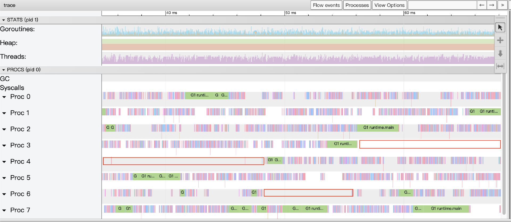

适当放大View trace视图后，我们看到了很多大段的Proc暂停以及不计其数的小段暂停，显然goroutine发生阻塞了，我们接下来通过Synchronization blocking profile查看究竟在哪里阻塞时间最长：

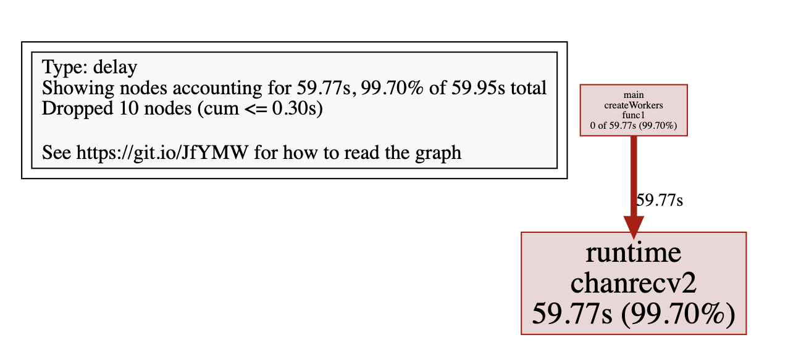

我们看到，在channel接收上所有goroutine一共等待了近60s。从这版代码来看，main goroutine要进行近400多w次发送，而其他8个worker goroutine都得耐心阻塞在channel接收上等待，这样的结构显然不够优化，即便将channel换成带缓冲的也依然不够理想。

估计到这里，你也想到了第三版代码的的思路，即不将每个像素点作为一个task发给worker，而是将一个列作为一个工作单元发送给worker，每个worker完成一个列像素的计算，这样我们来到了最终版代码（使用下面的createColWorkersBuffered替换createWorkers）。

#### 最终优化版：Worker池 + 每列一个任务

结合第三版和第四版的思路，一个更优的方案是：仍然使用固定数量的Worker goroutine池，但通过channel派发的任务不再是单个像素点，而是计算一整列像素的任务。

```go
// ch29/tracing/fractal_example/v5_worker_pool_column_task/main.go

func createColWorkersBuffered(width, height int) image.Image {
    m := image.NewGray(image.Rect(0, 0, width, height))

    c := make(chan int, width)

    var w sync.WaitGroup
    for n := 0; n < numWorkers; n++ {
        w.Add(1)
        go func() {
            for i := range c {
                for j := 0; j < height; j++ {
                    m.Set(i, j, pixel(i, j, width, height))
                }
            }
            w.Done()
        }()
    }

    for i := 0; i < width; i++ {
        c <- i
    }

    close(c)
    w.Wait()
    return m
}

```

这版代码的确是所有版本中性能最好的，并且这个版本的Trace视图也展现出近乎完美的并行执行效果：所有P都被充分利用，goroutine稳定运行，channel的同步开销因任务粒度增大而显著降低，GC压力也得到良好控制。

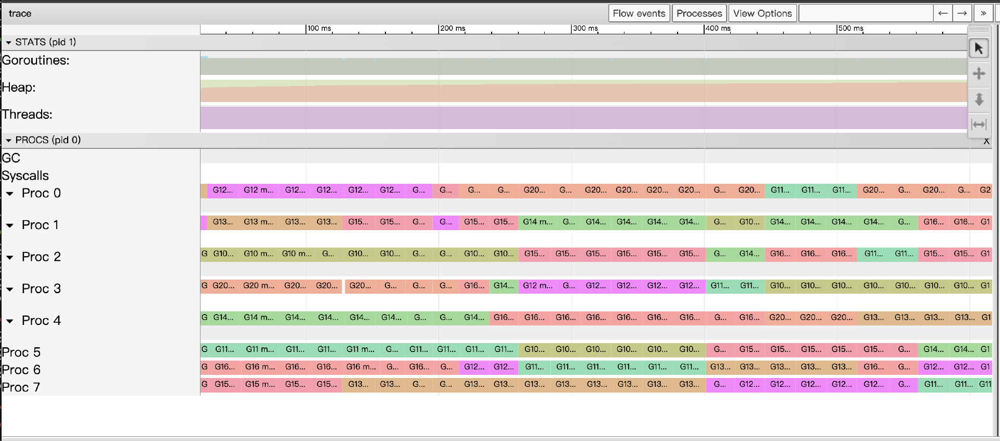

从这个分形图渲染的实例演进中，我们可以深刻体会到：

- `go tool trace` 能够直观地暴露并行度不足、goroutine调度压力过大，以及因同步原语（如channel）使用不当导致的性能瓶颈。

- 通过观察Trace视图中P的利用率、goroutine的状态和数量、GC活动以及同步阻塞情况，我们可以获得优化并发设计的宝贵线索。

- 性能调优往往是一个不断试错、测量、分析、再优化的迭代过程，Tracer是这个过程中不可或缺的重要工具。


这个实例清晰地展示了 `go tool trace` 在分析和指导并发程序优化方面的强大能力。理解了它的基本用法和解读方式后，我们来系统总结一下它在不同场景下的应用。

### `go tool trace` 的应用场景

Go Runtime Tracer凭借其对运行时事件的细粒度捕捉和丰富的可视化分析能力，在性能调优和复杂问题诊断中扮演着不可或缺的角色，尤其擅长处理以下几类场景：

1. **诊断并行执行程度不足**：通过观察Trace UI中P时间线的利用率，以及Goroutine视图中大量goroutine是否处于Runnable状态但长时间得不到调度，可以判断应用是否未能充分利用多核CPU资源。

2. **分析和优化GC导致的延迟**：Trace视图中的GC行和Heap行，以及Minimum Mutator Utilization图表，可清晰地揭示了GC的STW暂停时长、并发标记/清扫阶段对应用goroutine的影响。

3. **深入分析Goroutine执行效率与阻塞原因**：当 `pprof` 的Goroutine Profile显示大量goroutine存在，或者Block/Mutex Profile指示存在同步瓶颈时， `go tool trace` 能提供更细致的上下文，展示goroutine具体阻塞在哪个同步原语、系统调用或网络I/O上，以及它们被唤醒的时机和后续行为。

4. **理解和优化复杂的并发交互逻辑**：对于包含多个goroutine通过channel、 `select`、 `sync.Cond` 等进行复杂协作的场景，Trace的时间线视图和事件流关联功能，能够帮助我们梳理清楚它们之间的实际交互时序，发现是否存在不必要的等待、竞争条件，甚至死锁/活锁的倾向。

5. **精确追踪和分解长尾延迟请求**（结合用户自定义追踪）：通过在应用代码的关键业务逻辑路径上使用 `runtime/trace.WithRegion`、 `trace.NewTask`、 `trace.Logf` 等API添加用户自定义的追踪标记，我们可以将一个端到端的请求分解为多个命名的子任务或区域。在Trace UI的“User-defined tasks”或“User-defined regions”视图中，可以清晰地看到这些自定义标记的层级关系和各自的精确耗时，这对于定位长尾延迟请求中的具体瓶颈环节非常有效。


总的来说， `go tool trace` 是 `pprof` 的重要补充。当 `pprof` 告诉我们“是什么”消耗了资源后， `trace` 能进一步帮助我们理解“为什么”以及“过程是怎样”的。它尤其擅长揭示与时间相关的动态行为、并发交互的细节，以及运行时（特别是GC和调度器）对应用性能的细微影响。虽然开启Trace的性能开销相对较大，不适合长时间在生产环境全量开启，但作为一种按需的、短时间的深度诊断工具，它在解决Go应用的疑难性能杂症方面具有不可替代的价值。

在掌握了 `pprof` 和 `trace` 这两大官方性能分析利器之后，我们就可以更系统地来看待Go中常见的性能瓶颈类型，并学习针对它们的、具有Go特色的优化技巧了。这正是我们下一部分要探讨的内容。

## 常见性能瓶颈与Go特有的优化技巧

理解常见的性能瓶颈模式，并掌握针对性的优化方法，是性能调优工作的核心。Go语言因其独特的运行时（如GC、goroutine调度器）和语言特性（如channel、interface、defer），也形成了一些特有的性能考量点和优化技巧。接下来，我们将概要性地梳理Go中常见的性能瓶颈类型及其对应的、具有Go特色的优化技巧和最佳实践，为你提供一个实用的优化“速查手册”。再次强调，所有优化都应遵循“测量-定位-优化-验证”的原则。

### CPU密集型瓶颈：让计算更高效

当CPU Profile（如火焰图）显示程序的大部分时间消耗在计算而非等待时，我们就遇到了CPU瓶颈。

- **核心优化方向**：优化算法与数据结构是根本。例如，对需要频繁查找的场景，使用 `map` 通常优于 `slice` 遍历。

- **字符串操作**：正如我们之前讲过的，Go中字符串是不可变的，频繁使用 `+` 拼接字符串会产生大量临时对象和内存分配，严重影响性能。务必使用 `strings.Builder` 或 `bytes.Buffer` 进行高效拼接。尽可能在处理过程中使用 `[]byte`，仅在最终需要时转换为 `string`。对于简单的子串匹配，优先使用 `strings` 包内函数而非正则表达式。

- **序列化/反序列化**：标准库 `encoding/json` 等基于反射，在高频场景下可能成为瓶颈。若 `pprof` 证实如此，可考虑性能更高的第三方库（如 `bytedance/sonic`、 `json-iterator/go`）。

- **正则表达式**：对需要反复使用的正则表达式，必须使用 `regexp.Compile()` 进行预编译，复用编译后的 `*regexp.Regexp` 对象。

- **并发分解**：对于可并行的计算任务，利用goroutine和channel将其分解到多核执行。但要注意避免为过细小的任务创建goroutine，以免调度开销过大。

- **避免热点路径的** `interface{}`：接口操作有运行时开销，在性能极度敏感的热点代码中，若构成瓶颈，可考虑使用具体类型或泛型（Go 1.18+）优化。

- **底层优化（进阶）**：在极少数情况下，如果上述优化仍不足，且 `pprof -disasm` 显示瓶颈在非常底层的计算，可考虑手动进行循环展开、优化内存访问模式以提升缓存命中率，甚至（极罕见）使用汇编或SIMD指令。这些属于专家级优化，需极度谨慎并充分测试。


> 注： [Go团队已正式提案在标准库里提供SIMD API](https://github.com/golang/go/issues/73787)，旨在为Go开发者提供一种无需编写汇编即可利用底层硬件加速能力的方式。

### 内存分配与GC：减少开销，避免泄漏

内存问题主要表现为内存泄漏（ `inuse_space` 持续增长）或高频分配（ `alloc_space` 过高导致GC压力大，CPU Profile中GC占比较高）。

- **诊断内存泄漏**：核心是对比不同时间点的Heap Profile（ `pprof -base`），找出持续增长的对象及其分配来源。同时结合Goroutine Profile检查是否存在goroutine泄漏（其栈和持有对象无法回收）。代码审查时，特别关注资源是否正确关闭（ `defer Close()`）、全局集合是否只增不减、 `time.Ticker` 是否停止。

- **减少内存分配：**
  - 对象复用（ `sync.Pool`）：对可重置的、频繁创建和销毁的临时对象（如缓冲区、临时结构体）使用 `sync.Pool`，能显著减少分配和GC压力。

  - 预分配容量：创建 `slice` 和 `map` 时，如果能预估大小，通过 `make` 指定初始容量，避免多次扩容。

  - 谨慎使用 `defer` 在热点循环中：如果 `defer` 的操作（如资源释放）可以被安全地、显式地提前执行，可能比依赖 `defer` 栈在函数退出时处理要好，尤其是在长循环或高频短函数中。

  - 指针传递大型结构体：避免不必要的值拷贝。
- **GC调优（审慎进行）**：
  - `GOGC`：控制GC触发的堆增长比例。减小值使GC更频繁（可能STW更短但总CPU消耗高），增大则相反。

  - `GOMEMLIMIT`（Go 1.19+）：设置内存软上限，辅助GC决策，有助于在容器等内存受限环境中避免OOM。

务必注意：调整GC参数是最后手段，通常应优先优化代码自身的分配行为。

### 并发同步：降低竞争，提升并行度

Go的并发模型虽好，不当的同步原语使用也可能导致性能瓶颈。

- **锁竞争**（ `sync.Mutex` **、** `sync.RWMutex`）：
  - 细化锁粒度：只锁必要的数据，避免大范围的全局锁。

  - 避免长时间持锁：临界区代码应尽可能快。绝不在持锁时进行I/O等耗时操作。

  - 审慎使用 `RWMutex`：仅在“读远多于写且读临界区短”时才可能有优势。
- **Channel使用**：
  - 合理缓冲：根据生产者/消费者速率选择合适的缓冲大小。

  - 避免不必要的阻塞：在 `select` 中使用 `default` 或超时 `case`。

  - 明确关闭时机：通常由发送方或唯一协调者关闭，以通知接收方。
- **Goroutine管理**：
  - 避免高频创建销毁极短任务的goroutine：考虑使用Worker Pool模式复用goroutine。
- **原子操作**（ `sync/atomic`）：对简单共享标量（计数器、标志位）的无锁更新通常比锁高效。但要注意高并发下对同一缓存行的原子写也可能因“缓存行乒乓”成为瓶颈。


### I/O操作：加速与外部世界的交互

当应用瓶颈在于等待外部I/O（网络、磁盘、数据库）时，优化重点在于 **减少等待时间和提高I/O效率**。

- 并发执行独立I/O：利用goroutine并发处理可并行的I/O任务。

- 设置超时与重试：对所有外部调用（特别是网络）使用 `context.WithTimeout`，并实现合理的重试逻辑（如指数退避）。

- 连接池：务必为数据库、Redis等使用连接池，并合理配置。

- 批量操作（Batching）：将多个小的I/O操作聚合成批量操作，减少往返次数。

- 缓冲I/O（ `bufio`）：处理文件或网络流时，使用 `bufio.Reader/Writer` 减少系统调用。


### 利用Go编译器与运行时优化：PGO及其他

除了我们自己通过改进代码逻辑和算法来实现性能优化外，Go编译器和运行时本身也在不断地进化，提供了越来越多的自动化或半自动化的性能优化手段。

- **Profile-Guided Optimization（PGO，Go 1.21+）**：PGO允许编译器利用程序在真实负载下收集到的性能剖析数据（CPU profile）来做出更优的优化决策，例如更积极的函数内联、改进的去虚拟化（devirtualization）和优化的代码布局。
  - 流程：先在类生产环境收集CPU profile（ `default.pgo`），再使用 `go build -pgo=default.pgo` 编译。

  - 效果：通常能带来2-7%的性能提升，几乎无需修改代码。关键在于profile数据的质量和代表性。
- **编译器的常规优化**：Go编译器默认会进行函数内联、死代码消除、常量传播等多种优化。通常无需手动干预，但了解 `-gcflags` 中的 `-N`（禁用优化）和 `-l`（禁用内联）有时可用于特定调试场景（生产构建不应使用）。

- **Go运行时的自适应优化**：GC的Pacer调速、goroutine调度器的动态调整等，都是运行时为保障性能而做的自适应工作。

- **利用最新的Go版本**：Go团队在每个新版本中都会对编译器、运行时和标准库进行性能优化。简单地升级到最新的稳定版Go，往往就能免费获得一些性能红利。


通过综合运用代码层面的优化技巧、强大的性能剖析工具，以及充分利用Go编译器和运行时的自身优化能力，我们就能系统性地提升Go应用的性能表现，使其更高效、更稳定地服务于业务需求。

## 小结

这节课，我们学习了Go运行时追踪工具 `go tool trace` 的妙用，理解了它如何通过细粒度的事件追踪，帮助我们洞察goroutine调度、GC行为、系统调用以及用户自定义任务的执行细节。通过一个并发分形图渲染的实例，我们看到了Trace工具在分析并行度、并发交互和指导优化方面的强大能力。

最后，我们系统性地梳理了Go程序中常见的性能瓶颈类型及其具有Go特色的优化技巧。我们分别从CPU密集型（如算法优化、高效字符串/序列化/正则处理、并发分解、避免热点 `interface{}`、底层优化简介）、内存分配与GC相关（如泄漏诊断、对象复用 `sync.Pool`、预分配容量、GC参数调优）、并发同步相关（如细化锁粒度、高效Channel使用、Worker Pool、原子操作），以及I/O操作相关（如并发I/O、超时重试、连接池、批量处理、缓冲I/O）等多个维度，详细讨论了问题成因和优化策略。我们还探讨了如何利用Go编译器与运行时的优化机制，特别是Go 1.21+引入的Profile-Guided Optimization（PGO），以及关注最新Go版本带来的性能红利。

通过这两节课的学习，你不仅掌握了Go性能分析的核心工具和方法，更重要的是建立了一套科学的性能调优思维框架，并了解了Go语言环境下特有的优化技巧以及如何利用语言和工具的最新进展。这将使你在面对Go应用的性能挑战时，能够更有信心、更有章法地去定位瓶颈、实施优化，打造出真正高性能的Go服务。

## 思考题

你的一个Go Web服务在进行压力测试时，通过 `pprof` 的CPU Profile发现GC占用了较高的CPU百分比（例如，超过20-30%），同时Heap Profile的 `-alloc_space` 视图显示某个处理JSON请求的Handler内部有非常高的内存分配量，尽管 `-inuse_space` 视图看起来内存并没有明显泄漏。请你分析一下，这可能是什么原因导致的。你会考虑从哪些方面入手去优化这个问题？

> 提示：可以结合这两节课所讨论的内存分配优化技巧和JSON处理优化

欢迎在留言区分享你的思考和实践经验！我是Tony Bai，我们下节课见。
