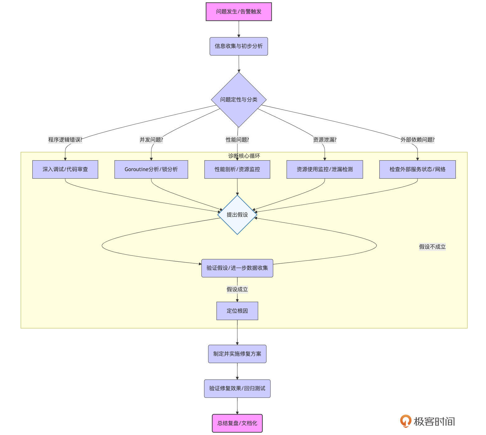
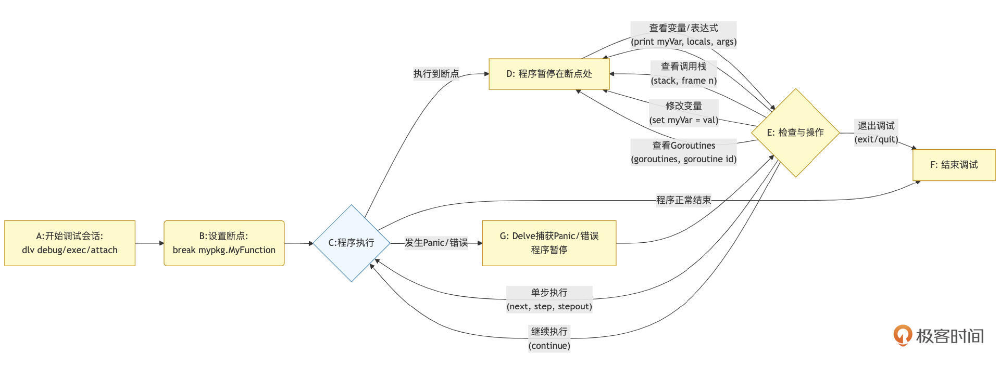
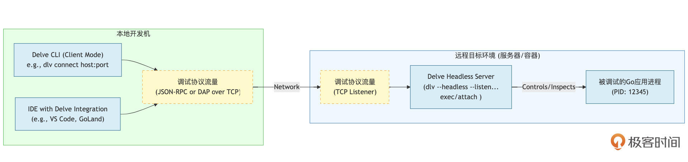

# 故障诊断：线上问题排查的利器与策略（上）
你好，我是Tony Bai。

在前面的课程中，我们已经学习了如何为Go应用构建健壮的应用骨架、核心组件，如何进行容器化部署和实现平滑的线上升级。特别是 [《可观测性：Metrics、Logging、Tracing，让你的Go服务不再是黑盒》](https://time.geekbang.org/column/article/890892) 这节课，为我们构建了一套强大的“雷达系统”，通过日志、指标和追踪，辅以告警机制，能够帮助我们及时发现线上服务出现的异常。

然而， **当告警的铃声响起，或者用户反馈的问题如雪片般飞来，日志信息有时却像一本密码本，指标曲线也只是描绘了症状而非病因，Trace链条可能在中途断裂或指向一个模糊的区域。这时，真正的挑战才刚刚开始：如何从纷繁复杂的现象中剥茧抽丝，快速、准确地定位到问题的根源？** 不同的问题类型——是潜藏的程序逻辑错误，还是难以捉摸的并发异常，抑或是缓慢蚕食资源的性能瓶颈——它们是否需要我们亮出不同的诊断“兵器”和应对策略？

这正是接下来两节课我们要聚焦的核心： **在可观测性系统发出预警之后，我们将深入探讨深度诊断的阶段**。我们将学习如何对线上Go应用出现的问题进行有效分类，并针对不同类型的问题，掌握Go生态中一系列强大的诊断工具和高级定位技巧。目标是让你能够像一位经验丰富的“应用医生”一样，高效地找到问题的根因，为后续的修复和优化工作打下坚实的基础，最终保障线上服务的稳定与高效。

## 线上问题诊断的通用策略与问题分类

在正式介绍各种诊断工具之前，我们首先需要建立一个结构化的诊断思维框架。面对线上问题，慌乱和盲目尝试往往会浪费宝贵的时间，甚至可能使问题恶化。一个清晰的诊断流程和对问题类型的准确判断，是高效排查的前提。

### 诊断流程概览：从现象到根因

线上问题的诊断就像医生看病，需要遵循一定的章法，从表面的“症状”入手，通过一系列的“检查”和“分析”，最终找到“病根”。虽然每个问题都有其独特性，但一个通用的诊断流程可以帮助我们系统性地思考和行动。

我们可以用下图来概括这个诊断流程的主要阶段：



上图展示了这个迭代的诊断过程，具体来说，它通常包含以下关键步骤：

1. **信息收集与初步分析**：当问题发生或告警被触发时，首先要做的是全面收集与问题相关的所有信息。这包括：
   1. **告警信息**：详细阅读告警内容，了解是哪个指标触发了告警、具体的阈值、发生的时间点以及持续时长。

   2. **日志分析**：仔细查阅问题发生时间点前后相关的服务日志，特别是ERROR和WARN级别的日志。关注是否有异常堆栈、特定的错误码或者不寻常的日志模式。结构化日志中的上下文信息（如TraceID、UserID、RequestID）对于关联事件非常有价值。

   3. **指标监控数据**：查看监控系统（如Prometheus、Grafana）中与问题服务相关的核心指标曲线，例如：QPS（每秒请求数）、请求延迟（平均值、P95、P99）、错误率、CPU使用率、内存使用率、goroutine数量、GC活动频率和暂停时间等。通过指标可以快速判断问题的影响范围和严重程度。

   4. **分布式追踪数据**：如果系统集成了分布式追踪（如Jaeger、Tempo、OpenTelemetry），根据TraceID查找有问题的请求链路，可以帮助定位瓶颈或错误发生的具体服务和操作环节。

   5. **用户反馈/业务现象**：详细了解用户报告的问题现象、他们正在执行的操作、问题发生的时间、影响范围等。这些一手信息往往能提供重要线索。

   6. **复现步骤（如果可能）**：尝试在测试环境或一个隔离的、影响可控的生产环境（如果条件允许）中复现问题。能够稳定复现问题，对于后续的深入分析和调试至关重要。
2. **问题初步定性与分类**：在收集到足够的信息后，需要对问题的性质进行初步判断和分类。这是为了帮助我们选择正确的诊断方向和工具。例如，这个问题看起来更像是一个功能性的Bug，还是性能瓶颈？是系统资源耗尽，还是并发逻辑引入的死锁或竞争？问题是持续性的，还是偶发性的？影响是全局的，还是只针对特定用户或特定场景？

3. **假设与验证**：基于初步的定性和分类，我们会对问题的可能根因提出一个或多个假设。例如：“我怀疑是最近上线的一个新功能引入了内存泄漏”，或者“我认为是数据库连接池配置不当导致了请求超时”。然后，针对每个假设，我们需要设计具体的验证方案，这可能包括：
   1. 查阅特定模块的代码。

   2. 进一步收集更细粒度的日志或指标。

   3. 使用性能剖析工具。

   4. 在测试环境中构造特定场景进行复现。

   5. 进行A/B测试或回滚特定变更。
4. **缩小范围，定位根因**：通过不断地提出假设、进行验证、排除不相关的因素，我们逐步缩小问题的可能范围，最终定位到导致问题的具体代码片段、配置项、环境因素或外部依赖。这个过程可能需要反复迭代。

5. **修复与验证**：（虽然修复本身超出了本节课“诊断”的范畴，但它是诊断的最终目的）一旦找到根因，就需要制定并实施修复方案。修复后，必须通过严格的测试（单元测试、集成测试、回归测试）和持续的监控来验证问题是否已彻底解决，并且没有引入新的问题。

6. **总结与复盘**：问题解决后，进行全面的复盘是非常重要的。记录问题的现象、诊断过程、根因分析、解决方案以及可以采取的预防措施。将这些经验教训文档化，分享给团队，有助于避免类似问题再次发生，并提升整个团队的故障处理能力。


这个诊断流程并非一成不变的线性过程，很多时候需要在不同步骤之间来回跳转，例如，在验证假设时发现新的信息，可能需要重新回到信息收集或问题分类阶段。但拥有这样一个结构化的框架，能帮助我们在面对复杂问题时保持清晰的思路。

对问题进行准确的分类，是选择后续诊断工具和策略的第一步。接下来，我们就来看看Go线上服务中一些常见的问题类型。

### Go线上常见问题分类

为了更有针对性地选择诊断“武器库”，我们可以将Go线上服务中遇到的问题大致归为以下几类。理解这些分类有助于我们在诊断初期快速形成判断，并采取合适的排查路径。

**首先是程序逻辑错误，也就是我们常说的Bugs。**

这类问题通常表现为应用的功能行为不符合预期。例如，一个计算函数返回了错误的结果；一个API接口在处理特定输入时崩溃（panic），可能源于nil指针解引用、数组越界或不正确的类型断言；或者错误处理流程不当，导致重要错误被忽略，或者错误信息丢失了关键的上下文，使得后续排查困难。这类问题的特点是，它们通常与代码的特定执行路径和输入数据紧密相关，一旦触发条件满足，问题往往能够稳定复现。

**其次，并发问题是Go应用中一类独特且具有挑战性的问题。**

Go语言强大的并发能力是一把双刃剑，如果使用不当，很容易引入难以察觉的并发缺陷。常见的并发问题包括：

- **死锁（Deadlocks）**：多个goroutine因相互等待对方持有的资源（如互斥锁、channel）而形成循环等待，导致所有相关的goroutine都永久阻塞，无法继续执行。

- **活锁（Livelocks）**：goroutine们虽然在活动（CPU可能还在消耗），但它们在徒劳地重复某些操作以响应其他goroutine的行为，却无法取得任何实质进展，就像两个人同时给对方让路结果谁也过不去一样。

- **Goroutine泄漏（Goroutine Leaks）**：goroutine在完成其任务后（或者因为某些条件永远无法满足而无法完成任务）没有正常退出，导致其占用的资源（主要是栈内存）无法被回收。如果泄漏的goroutine数量持续增长，最终会耗尽系统内存，导致应用OOM（Out Of Memory）被杀死。

- **数据竞争（Data Races）**：两个或多个goroutine在没有适当同步机制（如互斥锁）保护的情况下，同时访问（且至少一个是写操作）同一块共享内存区域。这会导致程序的行为变得不可预测，结果可能因goroutine的执行时序而异。虽然 `go test -race` 能在测试阶段发现大部分数据竞争，但仍有少数情况可能在线上因特定并发模式或配置问题而触发，或者在测试覆盖不到的边缘代码中出现。


并发问题的特点是它们往往具有非确定性，难以稳定复现，其行为与goroutine的调度和执行时序密切相关。

**再次，性能问题是线上服务质量的直接体现。**

即便功能完全正确，如果应用响应缓慢或资源消耗过高，用户体验也会大打折扣。常见的性能问题表现为：

- **CPU飙高/过度消耗**：应用进程长时间占用过高的CPU资源，可能是由于低效的算法、密集的计算或者失控的循环等。

- **内存泄漏/OOM**：应用的内存使用量持续不合理地增长，并且无法被垃圾回收器（GC）有效回收，最终可能导致内存耗尽，触发OOM被操作系统杀死。

- **响应延迟过大/抖动**：API请求的处理时间或后台任务的执行时间远超预期，或者响应时间非常不稳定，时快时慢。

- **吞吐量下降**：应用在单位时间内能够成功处理的请求数或完成的任务数显著低于正常水平。性能问题可能由多种原因引起，包括但不限于低效的算法实现、不恰当的数据结构选择、过度的锁竞争、GC压力过大、以及外部I/O（网络、磁盘）瓶颈等。


**然后，还有一类是资源问题，特指除了CPU和内存之外的其他系统资源的耗尽或管理不当。** 例如：

- **文件句柄泄漏（File Descriptor Leaks）**：应用在打开文件、网络连接（socket）等需要文件句柄的资源后，未能正确关闭它们，导致系统中可用的文件句柄数量逐渐耗尽。当达到上限时，应用将无法再打开新的文件或建立新的网络连接。

- **网络连接耗尽**：对于需要与大量下游服务交互的应用，如果连接池管理不当（例如，连接池太小导致请求排队，或者连接未及时归还和复用），或者创建了过多无法及时释放的临时连接，都可能导致端口耗尽或连接数达到系统上限。

- **其他系统资源耗尽**：例如，信号量、共享内存段、线程数（如果应用大量使用了cgo或依赖于创建OS线程的库）等。


这类问题通常表现为应用在运行一段时间后，开始出现无法创建新连接、打开新文件等相关的错误。

**最后，外部依赖问题也需要我们在诊断时加以区分。**

很多时候，我们的应用功能异常或性能下降，其根源并不在应用自身，而是由于其依赖的下游服务（如数据库、缓存、消息队列、第三方API等）出现了故障、性能瓶颈，返回了错误数据，或者网络连接不稳定。在这种情况下，我们的应用可能只是一个“受害者”。诊断时，我们需要有能力通过日志、指标和追踪数据来判断问题是否源于外部，以便将问题正确地上报或转交给相关的团队处理。

对线上问题进行这样的初步分类，能帮助我们更有针对性地选择后续的诊断工具和分析策略，从而更快地逼近问题的真相。

在所有这些问题类型中，程序逻辑错误（Bugs）和运行时Panic可能是开发者最常直接面对的。当应用的日志和指标指向了某个功能异常，或者一个未被捕获的panic导致服务中断时，我们就需要深入到代码的执行层面，去理解那一刻究竟发生了什么。

## 诊断程序逻辑错误与运行时Panic

程序逻辑错误，即我们常说的Bug，是软件开发过程中难以完全避免的“副产品”。它们可能源于对需求的细微误解、算法设计上的缺陷、对边界条件的考虑不周，或者是对Go语言特性及标准库函数的不当使用。当这些错误潜藏在复杂的业务逻辑中，仅通过日志难以直接定位，或者当它们以一个运行时panic的形式突然爆发，导致服务中断时，我们就需要有更直接、更深入的手段来剖析代码的实际执行情况。

在探讨高级调试工具之前，我们先回顾一下最原始但也最直接的调试方法。

### Printf调试法的局限与适用场景

在许多开发者（尤其是初学者）的工具箱中， `fmt.Println` 或 `log.Printf` 等打印语句往往是遇到问题时的第一反应。通过在代码的关键路径上插入这些“探针”，输出变量的当前值、函数的调用顺序，或者某个条件分支是否被执行，确实能够在一定程度上帮助我们理解程序的行为，尤其是在一些简单场景下。例如，当一个计算结果不符合预期时，在计算过程的几个关键步骤打印中间变量的值，往往能快速发现是哪一步出了问题。

printf调试法尤其适合以下场景：

- **快速验证简单逻辑**：对于一些小段代码或独立函数的行为验证，Printf调试非常便捷。

- **无法使用或不便使用调试器的环境**：在某些严格受限的生产环境（如果策略允许临时修改和部署）、嵌入式系统，或者难以附加调试器的复杂并发场景（尽管打印本身可能干扰并发行为）中，打印日志可能是获取内部状态的少数可行手段之一。

- **复现困难的偶发问题**：对于那些难以稳定复现、无法通过断点稳定捕获的问题，预先在可疑代码路径上埋点打印详细的上下文日志，有助于在问题下一次偶然发生时，捕获到足够的信息来分析根源。


然而，Printf调试法的缺点也非常突出，使其在面对复杂问题时显得力不从心：

- **侵入性强且流程繁琐**：需要直接修改源代码，添加打印语句，然后重新编译、部署、运行。调试结束后，还需要记得移除或注释掉这些临时代码，否则会污染生产日志或影响性能。这个过程本身就容易引入新的错误或遗漏。

- **信息片面且静态**：只能打印出你在编码时预先决定要看的信息。一旦运行起来，如果发现需要看其他变量的状态，或者想深入某个函数调用，就必须重复“修改-编译-运行”的循环。

- **效率低下**：对于复杂的逻辑链条或大量的迭代，可能需要添加非常多的打印点，导致输出信息泛滥，难以从中筛选有效内容。

- **难以处理复杂数据**：对于大型结构体、嵌套对象或长切片/映射，简单打印其内容可能非常不直观，甚至因输出过长而无法有效阅读。

- **对并发程序行为的潜在干扰**：大量的I/O操作（打印到控制台或文件）本身会消耗时间，这可能会改变goroutine的调度时序和执行顺序，有时甚至会“巧合地”掩盖或改变并发问题的表现。同时，来自不同goroutine的打印输出交织在一起，也可能难以解读。


因此，虽然Printf调试法因其简单易上手而有其用武之地，但当我们需要更系统、更深入、更交互式地探查程序状态时，专业的调试工具就成为了必然的选择。

对于Go语言而言， [Delve](https://github.com/go-delve/delve) 无疑是这个领域的事实标准。

### 交互式调试利器：Delve深度应用技巧

Delve是专为Go语言从头设计的、功能强大的源码级调试器。它深刻理解Go的运行时、goroutine调度以及语言特性，为我们提供了在运行时暂停程序、检查状态、单步执行代码、分析调用栈等一系列强大的交互式调试能力。

#### Delve核心交互流程

Delve与开发者之间有一套结构化的核心调试交互流程。我们可以通过下图来理解其核心的交互步骤：



下面我们就结合这幅示意图，对Delve的核心交互流程做个简单说明。

1. **开始调试会话（A）**：通过 `dlv debug`（编译并启动）、 `dlv exec`（调试已编译程序）或 `dlv attach`（附加到已运行进程）来启动Delve。

2. **设置断点（B）**：使用 `break` 命令在代码的关键位置（如函数入口、特定行号）设置一个或多个断点。

3. **程序执行（C）**：使用 `continue` 命令（或Delve启动后自动开始执行，取决于启动方式）让程序运行。
   1. 如果程序执行到断点，会进入 **程序暂停状态（D）**。

   2. 如果程序正常执行结束，会进入 **结束调试状态（F）**。

   3. 如果程序发生未捕获的Panic或错误，Delve会捕获它并使程序暂停在 **Panic/错误点（G）**。
4. **程序暂停在断点处（D）/ Panic点（G）**：此时，控制权交还给Delve命令行。

5. **检查与操作（E）**：在程序暂停时，开发者可以执行一系列Delve命令来检查程序状态或控制后续执行：
   1. **查看变量/表达式**：使用 `print`、 `locals`、 `args` 等命令查看当前上下文的变量值和表达式结果。

   2. **查看调用栈**：使用 `stack`、 `frame` 等命令分析函数调用路径。

   3. **单步执行**：使用 `next`（逐行，不进入函数）、 `step`（逐行，进入函数）、 `stepout`（执行完当前函数并返回）来细致地跟踪代码执行。单步执行后，程序会再次暂停，流程回到（C） ->（D）。

   4. **继续执行**：使用 `continue` 让程序继续运行到下一个断点、结束或发生错误。流程回到（C）。

   5. **修改变量**：（慎用，可能会改变程序行为）使用 `set` 命令在运行时修改变量的值。

   6. **查看Goroutines**：（对于并发程序）使用 `goroutines`、 `goroutine <id>` 等命令检查和切换goroutine上下文。

   7. **退出调试**：使用 `exit` 或 `quit` 命令结束调试会话，流程进入（F）。
6. **结束调试（F）**：Delve会话结束，程序（如果仍在运行）可能会被终止。


可以说，这个流程图清晰地展示了Delve的交互式特性：开发者通过命令在“执行”和“检查/控制”状态之间切换，逐步深入理解程序的行为并定位问题。

虽然在高度敏感的生产环境中直接附加调试器进行长时间的交互式调试通常是不推荐的（因为它会暂停服务或影响性能），但在某些受控的线上诊断场景下，或者在与生产环境高度一致的预发/灰度环境中， **Delve的远程调试和Core Dump分析能力能发挥巨大作用。前提是，团队制定了严格的线上调试规范和权限控制，并且操作人员经验丰富。**

我们先来看看远程调试是如何工作的。

#### Delve远程调试的步骤

当你的Go应用运行在一个远程服务器、容器（如Docker、Kubernetes Pod）或者你无法直接登录操作的环境中时，Delve的远程调试功能允许你在本地开发机上通过网络连接到远端的Delve服务，并像调试本地程序一样进行交互。

其核心关系、流程及操作步骤可以结合下图来理解：



结合示意图，我们再对 **远程调试的工作流程与关键组件** 做一些简单地说明。

在进行远程调试时，第一步是在远程目标环境中启动Delve Headless服务器（ `DelveServer`）。确保目标机器上已安装 `dlv`，然后以无头模式启动Delve。这种模式下，Delve不会启动交互式命令行界面，而是作为服务器运行，等待调试客户端的连接。此时，Delve服务器可以附加到已经在运行的Go应用进程（ `TargetGoApp`），或直接执行你的Go应用的可执行文件。为了确保Delve能够正常工作，建议在编译Go应用时加入调试信息并禁用优化。

你可以使用以下命令启动Delve服务器：

```bash
dlv --headless --listen=:2345 --api-version=2 --accept-multiclient exec ./myapp_for_debug -- <your_app_arguments_if_any>

```

或者，如果你的Go应用已经在运行（例如，PID为12345），则可以附加到该进程：

```bash
dlv --headless --listen=:2345 --api-version=2 --accept-multiclient attach 12345

```

在此命令中， `--listen=:2345` 指定了Delve服务器的监听地址和端口， `--api-version=2` 使用推荐的调试协议版本，而 `--accept-multiclient` 则允许多个调试客户端同时连接到同一Delve服务器。启动后， `DelveServer` 将控制 `TargetGoApp` 的执行，并准备通过网络接收调试指令。

接下来，在本地开发机上需要启动Delve客户端（ `LocalCLI` 或IDE）并连接到远程服务器。确保你的本地开发机器上也安装了 `dlv`。你可以使用 `dlv connect` 命令或通过IDE（如VS Code或GoLand）连接到远程的Delve Headless Server。例如，命令如下：

```bash
dlv connect <remote_target_host_ip_or_dns>:2345

```

在IDE中，你只需配置远程调试目标，输入远程主机的IP或DNS名称及Delve服务器监听的端口（2345）。此时，本地的Delve实例或IDE充当调试客户端的角色。

一旦连接成功，本地Delve客户端（或IDE的调试界面）便可以向远程的 `DelveServer` 发送调试命令，例如设置断点、继续执行、单步执行、查看变量、查看调用栈等。 `DelveServer` 接收到这些命令后，会在 `TargetGoApp` 上执行相应操作，并将结果通过网络回传给本地的调试客户端显示。整个过程对于本地开发者来说，体验与调试本地程序非常相似，只是指令和数据在网络间传递。

#### Delve远程调试示例

为了更具体地感受Delve的交互式调试过程，让我们通过一个更贴近线上场景的例子，来演示如何使用Delve的远程调试功能来诊断一个正在运行的服务中发生的panic。

假设我们有一个简单的HTTP服务，它有一个正常的 `/ping` 接口和一个会导致panic的 `/oops` 接口。当 `/oops` 被访问时，服务会panic。我们将模拟在线上（或一个独立的测试环境）运行这个服务，当它panic后（或者为了调试方便，我们让它在panic前等待），我们从本地通过Delve远程连接上去进行诊断。

下面是被调试的Go HTTP服务的代码片段：

```go
// ch28/remote_panic_service/main.go
package main

import (
    "fmt"
    "log"
    "net/http"
    "os"
    "runtime/debug" // 用于在panic时打印堆栈并保持进程
    "time"
)

var shouldPanicImmediately = false // 控制是否在panic后立即退出，还是等待调试

func criticalOperation(input string) {
    if input == "trigger_panic" {
        log.Println("CRITICAL: About to perform an operation that will panic!")
        var data []int
        // 故意制造一个越界panic
        fmt.Println("Accessing out of bounds:", data[5]) // PANIC!
    }
    log.Printf("CRITICAL: Operation with input '%s' completed successfully (simulated).\n", input)
}

func oopsHandler(w http.ResponseWriter, r *http.Request) {
    log.Println("OOPS_HANDLER: Received request for /oops, preparing to panic...")

    // 在实际生产panic场景，程序会直接退出或被重启策略拉起。
    // 为了演示调试，我们可以在这里加入一个延迟或特定条件，
    // 使得在panic发生后，进程不会立即消失，给我们附加调试器的时间。
    // 或者，如果 'shouldPanicImmediately' 为 false，我们捕获panic，打印堆栈，然后死循环等待调试。
    if !shouldPanicImmediately {
        defer func() {
            if r := recover(); r != nil {
                log.Printf("PANIC RECOVERED (for debugging): %v\n", r)
                log.Println("Stacktrace from recover:")
                debug.PrintStack() // 打印当前goroutine的堆栈

                // 为了让Delve有机会附加，这里让goroutine进入一个可控的等待状态
                // 在真实的线上panic（未recover或recover后os.Exit），进程会终止。
                // 如果是K8s等环境，Pod会被重启。
                // Core Dump是分析这种已终止进程panic的常用手段。
                // 这里我们模拟的是一个“卡住”而非立即退出的panic场景。
                log.Println("Process will now hang, waiting for debugger to attach to its PID...")
                for { // 无限循环，让进程保持存活
                    time.Sleep(1 * time.Minute)
                }
            }
        }()
    }

    // 触发panic
    criticalOperation("trigger_panic") // 这个调用会panic

    // 这行不会被执行
    fmt.Fprintln(w, "If you see this, something went wrong with the panic trigger!")
}

func pingHandler(w http.ResponseWriter, r *http.Request) {
    log.Println("PING_HANDLER: Received request for /ping")
    fmt.Fprintln(w, "PONG!")
}

func main() {
    // 从环境变量读取是否立即panic退出的配置
    if os.Getenv("PANIC_IMMEDIATELY") == "true" {
        shouldPanicImmediately = true
    }

    pid := os.Getpid()
    log.Printf("Starting HTTP server on :8080 (PID: %d)...", pid)
    log.Printf("  Normal endpoint: http://localhost:8080/ping")
    log.Printf("  Panic endpoint:  http://localhost:8080/oops")
    if !shouldPanicImmediately {
        log.Println("  NOTE: On /oops panic, this demo server will recover, print stack, and hang for debugging.")
        log.Println("        In a real production scenario without such a recover, the process would terminate.")
    }

    http.HandleFunc("/ping", pingHandler)
    http.HandleFunc("/oops", oopsHandler)

    if err := http.ListenAndServe(":8080", nil); err != nil {
        log.Fatalf("Failed to start server: %v", err)
    }
}

```

下面我们来讲一下构建执行该服务、触发panic及远程调试的步骤。

**阶段一：在“远程”环境启动服务和Delve Headless Server。**

1. **编译Go服务（推荐带调试信息）：**

```bash
# 进入 ch28/remote_panic_service目录
$go build -gcflags="all=-N -l" -o remote_panic_server main.go

```

2. **运行Go服务。** 在服务器终端中启动该服务：

```bash
# 在服务器终端中运行
$./remote_panic_server
2025/06/02 12:09:30 Starting HTTP server on :8080 (PID: 1286962)...
2025/06/02 12:09:30   Normal endpoint: http://localhost:8080/ping
2025/06/02 12:09:30   Panic endpoint:  http://localhost:8080/oops
2025/06/02 12:09:30   NOTE: On /oops panic, this demo server will recover, print stack, and hang for debugging.
2025/06/02 12:09:30         In a real production scenario without such a recover, the process would terminate.

```

我们看到该服务启动后会打印出其PID：1286962，记下这个PID。

3\. **触发Panic。**

为了让Delve能附加到一个已发生panic（并被我们代码中的 `recover` 捕获并“卡住”）的状态，我们需要先触发它。打开浏览器或使用curl访问 `http://localhost:8080/oops`。服务器终端应该会打印出panic被recover的信息和堆栈，然后开始“hang”住。

```plain
// 触发panic后，remote_panic_server的日志输出

2025/06/02 12:09:40 OOPS_HANDLER: Received request for /oops, preparing to panic...
2025/06/02 12:09:40 CRITICAL: About to perform an operation that will panic!
2025/06/02 12:09:40 PANIC RECOVERED (for debugging): runtime error: index out of range [5] with length 0
2025/06/02 12:09:40 Stacktrace from recover:
goroutine 7 [running]:
runtime/debug.Stack()
    /root/.bin/go1.24.1/src/runtime/debug/stack.go:26 +0x6b
runtime/debug.PrintStack()
    /root/.bin/go1.24.1/src/runtime/debug/stack.go:18 +0x13
main.oopsHandler.func1()
    /root/test/goadv/ch28/remote_panic_service/main.go:36 +0x13a
panic({0x89d200?, 0xc00001a1b0?})
    /root/.bin/go1.24.1/src/runtime/panic.go:792 +0x136
main.criticalOperation({0x8bb8f6, 0xd})
    /root/test/goadv/ch28/remote_panic_service/main.go:19 +0x3ae
main.oopsHandler({0x8f6a20, 0xc0000000e0}, 0xc000160000)
    /root/test/goadv/ch28/remote_panic_service/main.go:52 +0xf0
net/http.HandlerFunc.ServeHTTP(0x8d5ca8, {0x8f6a20, 0xc0000000e0}, 0xc000160000)
    /root/.bin/go1.24.1/src/net/http/server.go:2294 +0x33
net/http.(*ServeMux).ServeHTTP(0xae9d40, {0x8f6a20, 0xc0000000e0}, 0xc000160000)
    /root/.bin/go1.24.1/src/net/http/server.go:2822 +0x3c2
net/http.serverHandler.ServeHTTP({0xc00013a200}, {0x8f6a20, 0xc0000000e0}, 0xc000160000)
    /root/.bin/go1.24.1/src/net/http/server.go:3301 +0x257
net/http.(*conn).serve(0xc000134240, {0x8f6e28, 0xc000138190})
    /root/.bin/go1.24.1/src/net/http/server.go:2102 +0x1b75
created by net/http.(*Server).Serve in goroutine 1
    /root/.bin/go1.24.1/src/net/http/server.go:3454 +0xa9a
2025/06/02 12:09:40 Process will now hang, waiting for debugger to attach to its PID...

```

4. **在“远程”环境启动Delve Headless Server并attach到Go服务进程。** 在另一个服务器终端中，使用之前记下的PID启动Delve Headless Server。

```bash
$ dlv --headless --listen=:2345 --api-version=2 --accept-multiclient attach 1286962
API server listening at: [::]:2345
2025-06-02T12:10:37Z warn layer=rpc Listening for remote connections (connections are not authenticated nor encrypted)

```

attach成功后，目标Go服务进程的执行实际上是被Delve暂停了（或者如果它之前在无限循环中，也会被Delve接管）。

> 注：如果没有安装delve调试器，可以使用go install github.com/go-delve/delve/cmd/dlv@latest安装dlv **。**

**阶段二：在本地开发机通过Delve客户端进行远程调试。**

1. **连接到远程Delve服务器。**

在你的本地开发机（或另一个终端，如果都在本地模拟）上，运行 `dlv connect`：

```bash
# 假设远程服务器IP是 <remote_server_ip>，如果都在本地，可以是 localhost 或 127.0.0.1
dlv connect localhost:2345

```

如果连接成功，你会看到Delve的 `(dlv)` 提示符。

2\. **诊断Panic。**

由于我们是在 `/oops` 接口触发panic后（并被recover和hang住）附加的，我们期望能看到与该panic相关的goroutine和调用栈。我们先查看所有goroutine：

```plain
(dlv) goroutines
  Goroutine 1 - User: /root/.bin/go1.24.1/src/net/fd_unix.go:172 net.(*netFD).accept (0x5caaa9) [IO wait]
  Goroutine 2 - User: /root/.bin/go1.24.1/src/runtime/proc.go:436 runtime.gopark (0x479e71) [force gc (idle)]
  Goroutine 3 - User: /root/.bin/go1.24.1/src/runtime/proc.go:436 runtime.gopark (0x479e71) [GC sweep wait]
  Goroutine 4 - User: /root/.bin/go1.24.1/src/runtime/proc.go:436 runtime.gopark (0x479e71) [GC scavenge wait]
  Goroutine 5 - User: /root/.bin/go1.24.1/src/runtime/proc.go:436 runtime.gopark (0x479e71) [finalizer wait]
  Goroutine 6 - User: /root/.bin/go1.24.1/src/runtime/proc.go:436 runtime.gopark (0x479e71) [chan receive]
  Goroutine 7 - User: /root/.bin/go1.24.1/src/runtime/time.go:338 time.Sleep (0x47d51c) [sleep]
  Goroutine 8 - User: /root/.bin/go1.24.1/src/net/fd_posix.go:55 net.(*netFD).Read (0x5c9093) [IO wait]
[8 goroutines]

```

我们看到了多个goroutine。其中一个（通常是处理HTTP请求的那个）的堆栈顶部停在我们 `recover` 后的无限循环 `time.Sleep` 处。找到这个goroutine的ID，这里是goroutine 7。

切换到goroutine 7：

```plain
(dlv) goroutine 7
Switched from 0 to 7 (thread 1286962)

```

查看goroutine 7的完整调用栈信息：

```plain
(dlv) stack -full
 0  0x0000000000479e71 in runtime.gopark
    at /root/.bin/go1.24.1/src/runtime/proc.go:436
        unlockf = runtime.resetForSleep
        lock = unsafe.Pointer(0x0)
        reason = waitReasonSleep (19)
        traceReason = traceBlockSleep (14)
        traceskip = 1
        mp = (*runtime.m)(0xaeac80)
        gp = (*runtime.g)(0xc0001361c0)
        status = (unreadable could not find loclist entry at 0xb1929 for address 0x479e71)

 1  0x000000000047d51c in time.Sleep
    at /root/.bin/go1.24.1/src/runtime/time.go:338
        ns = 60000000000
        gp = (*runtime.g)(0xc0001361c0)
        t = (unreadable could not find loclist entry at 0xb4c56 for address 0x47d51c)
        now = (unreadable could not find loclist entry at 0xb4cea for address 0x47d51c)
        when = (unreadable could not find loclist entry at 0xb4d43 for address 0x47d51c)

 2  0x000000000073bfe6 in main.oopsHandler.func1
    at /root/test/goadv/ch28/remote_panic_service/main.go:45
        r = interface {}(runtime.boundsError) {x: 5, y: 0, signed: true,...+1 more}

 3  0x0000000000479936 in runtime.gopanic
    at /root/.bin/go1.24.1/src/runtime/panic.go:792
        e = (unreadable error loading module data: read out of bounds)
        gp = (unreadable could not find loclist entry at 0xb1461 for address 0x479936)
        p = runtime._panic {argp: unsafe.Pointer(0xc000169250), arg: interface {}(runtime.boundsError) *(*interface {})(0xc000169280), link: *runtime._panic nil,...+11 more}
        ok = (unreadable could not find loclist entry at 0xb14c9 for address 0x479936)
        fn = (unreadable could not find loclist entry at 0xb14fc for address 0x479936)

 4  0x00000000004416f4 in runtime.goPanicIndex
    at /root/.bin/go1.24.1/src/runtime/panic.go:115
        x = 5
        y = 0

 5  0x000000000073b54e in main.criticalOperation
    at /root/test/goadv/ch28/remote_panic_service/main.go:19
        input = "trigger_panic"
        data = []int len: 0, cap: 0, nil

 6  0x000000000073b710 in main.oopsHandler
    at /root/test/goadv/ch28/remote_panic_service/main.go:52
        w = net/http.ResponseWriter(*net/http.response) 0xc000169520
        r = ("*net/http.Request")(0xc000160000)

 7  0x000000000071d633 in net/http.HandlerFunc.ServeHTTP
    at /root/.bin/go1.24.1/src/net/http/server.go:2294
        f = main.oopsHandler
        w = net/http.ResponseWriter(*net/http.response) 0xc000169550
        r = ("*net/http.Request")(0xc000160000)

 8  0x0000000000720762 in net/http.(*ServeMux).ServeHTTP
    at /root/.bin/go1.24.1/src/net/http/server.go:2822
        mux = ("*net/http.ServeMux")(0xae9d40)
        w = net/http.ResponseWriter(*net/http.response) 0xc000169650
        r = ("*net/http.Request")(0xc000160000)
        h = net/http.Handler(net/http.HandlerFunc) main.oopsHandler

... ...

```

现在你应该能看到导致panic的完整调用栈，从栈顶往下查找，你会找到 `main.criticalOperation` 中的 `data[5]`，以及调用它的 `main.oopsHandler`。这时我们可以跳到对应的Frame，检查相关变量状态：

```plain
(dlv) bt
 0  0x0000000000479e71 in runtime.gopark
    at /root/.bin/go1.24.1/src/runtime/proc.go:436
 1  0x000000000047d51c in time.Sleep
    at /root/.bin/go1.24.1/src/runtime/time.go:338
 2  0x000000000073bfe6 in main.oopsHandler.func1
    at /root/test/goadv/ch28/remote_panic_service/main.go:45
 3  0x0000000000479936 in runtime.gopanic
    at /root/.bin/go1.24.1/src/runtime/panic.go:792
 4  0x00000000004416f4 in runtime.goPanicIndex
    at /root/.bin/go1.24.1/src/runtime/panic.go:115
 5  0x000000000073b54e in main.criticalOperation
    at /root/test/goadv/ch28/remote_panic_service/main.go:19
 6  0x000000000073b710 in main.oopsHandler
    at /root/test/goadv/ch28/remote_panic_service/main.go:52
 7  0x000000000071d633 in net/http.HandlerFunc.ServeHTTP
    at /root/.bin/go1.24.1/src/net/http/server.go:2294
 8  0x0000000000720762 in net/http.(*ServeMux).ServeHTTP
    at /root/.bin/go1.24.1/src/net/http/server.go:2822
 9  0x000000000072bdd7 in net/http.serverHandler.ServeHTTP
    at /root/.bin/go1.24.1/src/net/http/server.go:3301
10  0x000000000071c215 in net/http.(*conn).serve
    at /root/.bin/go1.24.1/src/net/http/server.go:2102
11  0x000000000072289c in net/http.(*Server).Serve.gowrap3
    at /root/.bin/go1.24.1/src/net/http/server.go:3454
12  0x0000000000481021 in runtime.goexit
    at /root/.bin/go1.24.1/src/runtime/asm_amd64.s:1700
(dlv) frame 5
> runtime.gopark() /root/.bin/go1.24.1/src/runtime/proc.go:436 (PC: 0x479e71)
Warning: debugging optimized function
Frame 5: /root/test/goadv/ch28/remote_panic_service/main.go:19 (PC: 73b54e)
(dlv) locals
data = []int len: 0, cap: 0, nil

```

到这里，结合remote\_panic\_service的源码，基本可以定位是访问nil切片导致的panic。

3\. **结束调试。** 使用 `exit` 断开与远程Delve服务器的连接。

```plain
(dlv) exit
Would you like to kill the headless instance? [Y/n] y
Would you like to kill the process? [Y/n] y

```

在退出之前，我们可以选择是否让远程的Delve服务器也随之退出，以及是否杀掉被调试的Go服务进程。

这个示例的核心在于演示了远程 `attach` 的流程，以及如何在panic被 `recover`（并使进程保持存活以便调试）的场景下，通过Delve探查goroutine状态和调用栈来辅助定位问题。

#### 远程调试的几个注意事项

远程调试为开发者提供了强大的能力，可以深入到远端或隔离环境中的Go程序。这在诊断复杂问题时尤为有效，特别是偶发的、仅在特定条件下出现的逻辑错误。通过快速附加Delve进行远程调试，开发者往往能更直接地捕获问题的瞬间状态，而无需分析大量日志。然而，进行远程调试时有几点需要我们注意。

首先，确保远程调试端口（如2345）受到严格的网络访问控制，以防未经授权的访问。可以通过限制特定IP、使用VPN或堡垒机来增强安全性。

其次，远程调试会暂停被调试的goroutine甚至整个目标进程的执行，因此在生产环境中进行此操作必须极其谨慎。应确保目标明确、操作迅速，并尽可能在流量低谷期进行，以避免对整体服务造成不可接受的影响。

最后，为了获得最佳的远程调试体验，目标Go应用最好用包含调试信息的方式编译。然而，在生产环境中，通常会为了性能和体积而去除调试信息。这需要在部署策略中进行权衡。如果计划进行远程调试，可能需要为特定诊断场景准备带调试信息的版本。

到这里，你应该能清晰地理解远程调试的整体架构和操作流程了。

#### 调试已崩溃程序的核心转储

在真实的线上场景，如果一个未被recover的panic导致进程直接崩溃并生成了core dump，那么我们会使用 `dlv core <executable> <core_dump_file>` 来进行事后分析，其分析过程（查看堆栈、变量等）与交互式调试类似。

当Go应用因未恢复的panic或更底层的错误（如段错误）而异常终止时，如果操作系统配置允许（通常通过 `ulimit -c unlimited` 或修改 `/etc/security/limits.conf` 来启用，并配置 `kernel.core_pattern`），系统会生成一个核心转储文件（core dump）。这个文件是程序崩溃瞬间的内存快照。Delve可以加载这个core dump文件进行离线的事后分析。

```bash
$dlv core <path_to_your_go_executable> <path_to_core_dump_file>

```

加载成功后，虽然程序没有在运行，但Delve会恢复到程序崩溃时的状态。你可以：

- 使用 `stack` 查看导致panic的goroutine的完整调用栈。

- 使用 `goroutines` 查看所有goroutine在崩溃时的状态和位置。

- 使用 `print <variable>` 查看（在可访问范围内的）变量值。


这对于分析那些难以在线上直接调试的、偶发的、导致服务崩溃的致命错误非常有价值。例如，一个由特定输入序列触发的nil指针解引用panic，如果在线上发生，core dump就能帮你还原现场。

Delve通过其丰富的交互式命令，为我们深入探查Go程序的运行时状态提供了无与伦比的能力，是诊断复杂逻辑错误和panic不可或缺的工具。

当然，除了交互式调试，Go运行时本身也提供了一些机制来帮助我们理解程序的行为，尤其是当panic发生时。接下来再看看Go运行时为我们留下的“现场”，以及该如何理解这个“现场”。

### 理解Panic堆栈与 `runtime/debug` 包

当Go程序遭遇一个未被 `recover` 捕获的panic时，它会异常终止，并在终止前打印出导致panic的错误信息以及一个详细的调用堆栈（Call Stack / Stack Trace）。这个堆栈信息是定位panic来源的“第一现场”。

那如何解读Go的panic堆栈信息呢？一个典型的panic堆栈（如此前Delve示例中因数组越界产生的panic）通常包含：

- `panic:` 关键字，后跟panic的类型（如 `runtime error`）和具体的错误信息（如 `index out of range [5] with length 0`）。

- 触发panic的goroutine的ID和状态（如 `goroutine 7 [running]:`）。

- 调用栈序列：这是最重要的部分，它自顶向下（从panic直接发生点到goroutine的启动点）列出了函数调用链。每一行通常包含：
  - 包名和函数名（如 `main.process`）。

  - 源文件名和行号（如 `/path/to/delvepanic/main.go:8`）。

  - 相对于函数入口的指令偏移量（如 `+0xYY`）。

通过仔细阅读这个调用栈，我们可以从panic发生的直接位置开始，逐层向上回溯，理解函数是如何被调用的，以及在哪个调用路径上触发了问题。

有时，我们可能不希望程序在遇到某些可预见的“严重”错误时直接panic退出，而是希望捕获到类似panic的详细上下文信息（特别是调用栈）用于日志记录或错误报告，然后再决定如何处理（例如，优雅关闭或返回特定错误）。标准库的 `runtime/debug` 包为此提供了工具：

- `debug.Stack()`：调用此函数会返回当前goroutine的调用堆栈的格式化字节切片。你可以将其转换为字符串，记录到日志中，或附加到错误信息里。

- `debug.PrintStack()`：直接将当前goroutine的调用堆栈打印到标准错误（stderr）。


我们来看一个示例：

```go
// ch28/debugstack/main.go

package main

import (
    "fmt"
    "os"
    "runtime/debug"
)

func Bar() {
    fmt.Println("In Bar, about to print stack to stderr via debug.PrintStack():")
    debug.PrintStack()
}

func Foo() {
    fmt.Println("In Foo, calling Bar.")
    Bar()
}

func main() {
    fmt.Println("Starting main.")
    Foo()

    if err := someOperationThatMightError(); err != nil {
        // 将堆栈信息作为错误上下文的一部分
        detailedError := fmt.Errorf("operation failed: %w\nCall stack:\n%s", err, debug.Stack())
        fmt.Fprintf(os.Stderr, "%v\n", detailedError)
    }
    fmt.Println("Finished main.")
}

func someOperationThatMightError() error {
    // 模拟一个操作，该操作内部可能还调用了其他函数
    return performComplexStep()
}
func performComplexStep() error {
    return fmt.Errorf("a simulated error occurred deep in call stack")
}

```

运行此程序， `debug.PrintStack()` 会直接将调用 `Bar` 时的堆栈打印到stderr。而在 `main` 函数中处理 `someOperationThatMightError` 返回的错误时，我们通过 `debug.Stack()` 获取了当时的堆栈，并将其格式化到错误信息中，这对于记录错误上下文非常有用。下面就是该程序在我的本地环境输出的堆栈信息：

```plain
// 在ch28/debugstack下执行
$go run main.go
Starting main.
In Foo, calling Bar.
In Bar, about to print stack to stderr via debug.PrintStack():
goroutine 1 [running]:
runtime/debug.Stack()
    /Users/tonybai/.bin/go1.24.3/src/runtime/debug/stack.go:26 +0x5e
runtime/debug.PrintStack()
    /Users/tonybai/.bin/go1.24.3/src/runtime/debug/stack.go:18 +0x13
main.Bar()
    ch28/debugstack/main.go:11 +0x4b
main.Foo()
    ch28/debugstack/main.go:16 +0x4b
main.main()
    ch28/debugstack/main.go:21 +0x57
operation failed: a simulated error occurred deep in call stack
Call stack:
goroutine 1 [running]:
runtime/debug.Stack()
    /Users/tonybai/.bin/go1.24.3/src/runtime/debug/stack.go:26 +0x5e
main.main()
    ch28/debugstack/main.go:25 +0x88

Finished main.

```

在某些类Unix操作系统上，一些底层的运行时错误（如通常导致SIGSEGV信号的nil指针解引用，或非法内存访问）默认可能不会立即以Go panic的形式出现，而是可能先被操作系统信号处理。调用 `debug.SetPanicOnFault(true)` 可以改变这种行为，使得这些“faults”（故障）总是以Go panic的形式被抛出，从而能打印出Go风格的、包含goroutine信息的调用堆栈，这有时比分析底层的core dump或操作系统信号对Go开发者来说更直接。但要注意，这会改变程序在某些极端错误下的行为模式，应谨慎使用并了解其影响。

通过结合Delve的交互式调试能力和对panic堆栈的细致解读，以及 `runtime/debug` 包提供的工具，我们可以有效地诊断和定位Go程序中的逻辑错误和运行时panic，为快速修复问题提供坚实的基础。

在诊断完逻辑错误后，并发问题是Go开发者经常需要面对的另一类挑战。我们下一节课会讲到。

## 小结

这节课，我们一起开始探索Go应用线上故障诊断的复杂世界。

我们首先建立了线上问题诊断的通用流程（信息收集、问题分类、假设验证、定位根因、修复验证、总结复盘），并对Go服务中常见的问题类型（程序逻辑错误、并发问题、性能问题、资源问题）进行了梳理，强调了针对不同问题采用不同诊断工具的重要性。

对于程序逻辑错误与运行时Panic，我们回顾了Printf调试的适用场景与局限，并重点学习了交互式调试器Delve的核心功能与进阶技巧，包括断点、单步执行、变量查看、调用栈分析，以及在线上（或类线上）环境中非常有价值的远程调试和Core Dump分析。同时，我们也理解了如何解读Go的Panic堆栈，并了解了 `runtime/debug` 包在主动获取堆栈信息方面的应用。

欢迎在留言区分享你的思考和方案！我是Tony Bai，我们下节课见。
