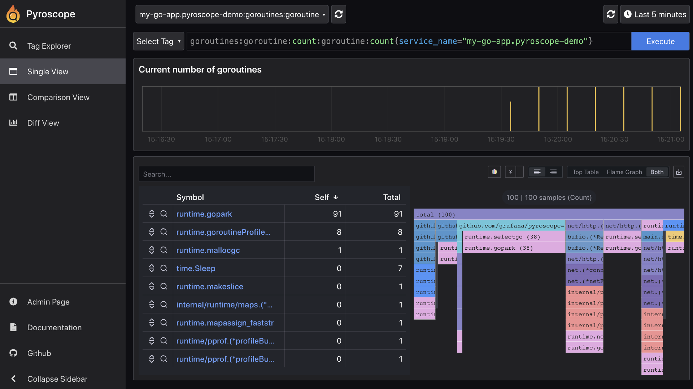
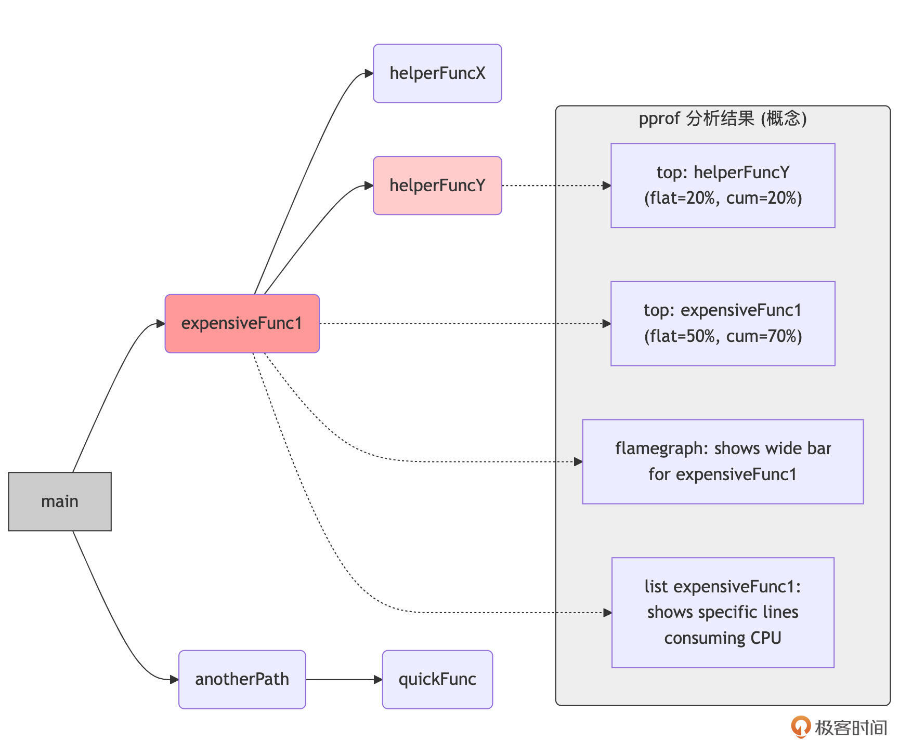

# 故障诊断：线上问题排查的利器与策略（下）
你好，我是Tony Bai。

上节课，我们一起建立了线上问题诊断的通用流程，梳理了Go服务中常见的问题类型，同时对于程序逻辑错误与运行时Panic，我们还回顾了Printf调试的适用场景与局限，并重点学习了交互式调试器Delve的核心功能与进阶技巧。

这节课，我们继续深入Go应用线上故障诊断的复杂世界，来学习如何诊断具体的并发问题和性能问题。

通过这两节课的学习，你在面对线上服务的“疑难杂症”时，就能够胸有成竹，运用恰当的策略和工具。

## 诊断并发问题：解密Goroutine的行为

Go语言的并发模型虽然强大，但也引入了新的问题类型，如死锁、活锁、goroutine泄漏等。当这些问题发生时，应用可能表现为失去响应、性能急剧下降或资源耗尽。诊断这类问题的关键在于，能够洞察大量goroutine的当前状态和它们之间的交互。

下面，我们就来探讨几种诊断Go并发问题的有效方法和工具。首先介绍一个轻量级的进程诊断工具 `gops`，它可以快速获取运行中Go进程的goroutine堆栈和运行时统计信息。

### `gops`：轻量级Go进程诊断工具

`gops`（由Google开发，项目地址是 `github.com/google/gops`）是一个非常实用的命令行工具，用于列出当前系统上正在运行的Go进程，并对它们进行一些基本的诊断操作。它的一个巨大优势是 **通常无需修改目标Go程序或重启它** 就能获取信息。不过，这需要你的目标Go程序内像下面代码一样嵌入了gops的Agent：

```plain
package main

import (
    "log"
    "time"

    "github.com/google/gops/agent"
)

func main() {
    if err := agent.Listen(agent.Options{}); err != nil {
        log.Fatal(err)
    }
    // ... ...
}

```

`gops` 的Agent（在目标Go程序启动时会自动运行一小段代码）会在一个特定的位置（例如，Unix Domain Socket或特定TCP端口，取决于操作系统和配置）监听来自 `gops` 命令行工具的连接和指令。当 `gops` 命令行工具执行如 `gops stack <pid>` 时，它会连接到目标Go进程的Agent，Agent随后会调用Go运行时内部的函数（例如，与 `runtime.Stack` 或 `runtime/pprof` 包中获取profile数据相关的函数）来收集所需的信息，并将结果返回给 `gops` 命令行工具显示。

**这种机制与 `net/http/pprof` 包的工作方式有相似之处**，后者也是通过HTTP服务暴露运行时profile数据的接口。实际上， `gops` 提供的某些功能（如获取CPU/Heap profile、trace数据）底层就是触发了与 `net/http/pprof` 端点类似的运行时数据收集逻辑。相比于 `net/http/pprof` 端点， `gops` 提供了一种体验更好的替代途径来获取类似的诊断信息，特别是goroutine堆栈、运行时统计和基本的profile数据。对于更深入的、可交互的profile分析（如生成火焰图）， `net/http/pprof` 的Web界面或 `go tool pprof` 仍然是首选。

gops也支持连接到远程的Go应用上，前提是Go应用在调用agent.Listen时将参数agent.Options中的Addr(host:port)设置为对外部开放的ip和port，不过出于安全考虑，是否这么做需要根据实际情况做出权衡。

在目标机器上，通过下面命令安装gops命令行工具后便可以对目标Go程序进行调试诊断了：

```bash
$go install github.com/google/gops@latest

```

下面我们结合一个示例程序来展示一下gops的主要用法以及如何基于gops对目标程序的并发问题进行调查和诊断。示例的源码如下：

```plain
// ch28/gops_deadlock/main.go

package main

import (
    "fmt"
    "os"
    "sync"
    "time"

    "github.com/google/gops/agent"
)

func main() {
    if err := agent.Listen(agent.Options{}); err != nil {
        panic(err)
    }

    fmt.Printf("My PID is: %d. Waiting for deadlock...\n", os.Getpid())
    var mu1, mu2 sync.Mutex

    var wg sync.WaitGroup
    wg.Add(2)

    go func() { // Goroutine 1
        defer wg.Done()
        mu1.Lock()
        fmt.Println("G1: mu1 locked")
        time.Sleep(100 * time.Millisecond) // Give G2 time to acquire mu2
        fmt.Println("G1: Attempting to lock mu2...")
        mu2.Lock() // Will block here waiting for G2
        fmt.Println("G1: mu2 locked (should not happen in deadlock)")
        mu2.Unlock()
        mu1.Unlock()
    }()

    go func() { // Goroutine 2
        defer wg.Done()
        mu2.Lock()
        fmt.Println("G2: mu2 locked")
        time.Sleep(100 * time.Millisecond) // Give G1 time to acquire mu1
        fmt.Println("G2: Attempting to lock mu1...")
        mu1.Lock() // Will block here waiting for G1
        fmt.Println("G2: mu1 locked (should not happen in deadlock)")
        mu1.Unlock()
        mu2.Unlock()
    }()

    fmt.Println("Setup complete. Run 'gops stack <PID>' from another terminal, then send SIGINT (Ctrl+C) to stop.")
    var done = make(chan struct{})
    go func() {
        wg.Wait()
        close(done)
    }()

    for {
        select {
        case <-done:
            fmt.Println("Program close normally")
            return
        default:
            time.Sleep(5 * time.Second)
        }
    }
}

```

这是一个用两个goroutine展示经典的AB-BA死锁模式的示例。我们先把它运行起来：

```plain
// 在ch28/gops_deadlock目录下

$go build
$./gops_deadlock
My PID is: 17707. Waiting for deadlock...
Setup complete. Run 'gops stack <PID>' from another terminal, then send SIGINT (Ctrl+C) to stop.
G1: mu1 locked
G2: mu2 locked
G1: Attempting to lock mu2...
G2: Attempting to lock mu1...

```

由于死锁，导致程序hang住，并未退出，这正是gops一展身手进行并发诊断的最佳时机。

诊断第一步就是查找当前目标主机上运行的Go程序。

`gops` 可以列出所有可连接的Go进程及其PID和程序路径：

```plain
$gops
68    1     aTrustXtunnel  go1.20.5 /Library/sangfor/SDP/aTrust.app/Contents/Resources/bin/aTrustXtunnel
81    1     aTrustXtunnel  go1.20.5 /Library/sangfor/SDP/aTrust.app/Contents/Resources/bin/aTrustXtunnel
17707 10635 gops_deadlock* go1.24.3 /Users/tonybai/github/geekbang/column/go-advanced/part3/source/ch28/gops_deadlock/gops_deadlock
18680 15382 gops           go1.18.3 /Users/tonybai/Go/bin/gops
85163 85131 present        go1.24.3 /private/var/folders/cz/sbj5kg2d3m3c6j650z0qfm800000gn/T/go-build1258102410/b001/exe/present
85131 68928 go             go1.24.3 /Users/tonybai/.bin/go1.24.3/bin/go

```

当然，我们也可以用gops tree命令以树状形式展示可连接的Go进程：

```plain
$gops tree
...
├── 1
│   ├── 81 (aTrustXtunnel) {go1.20.5}
│   └── 68 (aTrustXtunnel) {go1.20.5}
├── 598
│   └── 62393 (net-core) {go1.23.0}
├── 10635
│   └── [*]  17707 (gops_deadlock) {go1.24.3}
├── 15382
│   └── 18706 (gops) {go1.18.3}
└── 68928
    └── 85131 (go) {go1.24.3}
        └── 85163 (present) {go1.24.3}

```

我们设计的目标程序在输出日志中打印了pid(17707)，gops也可以直接基于该pid进行后续诊断操作。

`gops <pid>` 显示目标进程的概要信息，包括父进程pid、线程数量、CPU使用、运行时间以及gops agent的连接方式等。这让我们可以对目标进程有一个大致的了解：

```plain
$gops  17707
parent PID:    10635
threads:    5
memory usage:    0.013%
cpu usage:    0.004%
username:    tonybai
cmd+args:    ./gops_deadlock
elapsed time:    01:14:44
local/remote:    127.0.0.1:53669 <-> :0 (LISTEN)

```

`gops stats <pid>` 显示指定进程的运行时统计信息，包括当前goroutine数量、GOMAXPROCS、内存分配、GC暂停时间等。这对于监控goroutine泄漏或GC压力非常有用。

```plain
$gops stats 17707
goroutines: 5
OS threads: 5
GOMAXPROCS: 8
num CPU: 8

```

`gops version <pid>`：查看目标Go应用所使用的Go版本。

```plain
$gops  version 17707
go1.24.3

```

`gops memstats <pid>`：打印目标进程的更详细的内存分配统计（ `runtime.MemStats`）。

```plain
$gops memstats 17707
alloc: 1.14MB (1193752 bytes)
total-alloc: 1.14MB (1193752 bytes)
sys: 7.96MB (8344840 bytes)
lookups: 0
mallocs: 386
frees: 13
heap-alloc: 1.14MB (1193752 bytes)
heap-sys: 3.75MB (3932160 bytes)
heap-idle: 2.02MB (2121728 bytes)
heap-in-use: 1.73MB (1810432 bytes)
heap-released: 1.99MB (2088960 bytes)
heap-objects: 373
stack-in-use: 256.00KB (262144 bytes)
stack-sys: 256.00KB (262144 bytes)
stack-mspan-inuse: 33.59KB (34400 bytes)
stack-mspan-sys: 47.81KB (48960 bytes)
stack-mcache-inuse: 9.44KB (9664 bytes)
stack-mcache-sys: 15.34KB (15704 bytes)
other-sys: 980.17KB (1003689 bytes)
gc-sys: 1.56MB (1638752 bytes)
next-gc: when heap-alloc >= 4.00MB (4194304 bytes)
last-gc: -
gc-pause-total: 0s
gc-pause: 0
gc-pause-end: 0
num-gc: 0
num-forced-gc: 0
gc-cpu-fraction: 0
enable-gc: true
debug-gc: false

```

回到重点问题上，如何用gops分析死锁，这就涉及gops的重要子命令gops stack了。通过 `gops stack <pid>`，我们可以打印指定PID的Go进程中所有goroutine的堆栈信息。这也是诊断死锁或goroutine卡在何处的极其有用的命令，其输出格式与panic时的堆栈类似，我们对gops\_deadlock使用gops stack命令后的输出内容如下：

```plain
$gops stack 17707
goroutine 19 [running]:
runtime/pprof.writeGoroutineStacks({0x118ad880, 0xc000106060})
    /Users/tonybai/.bin/go1.24.3/src/runtime/pprof/pprof.go:764 +0x6a
runtime/pprof.writeGoroutine({0x118ad880?, 0xc000106060?}, 0x0?)
    /Users/tonybai/.bin/go1.24.3/src/runtime/pprof/pprof.go:753 +0x25
runtime/pprof.(*Profile).WriteTo(0xabfbcc0?, {0x118ad880?, 0xc000106060?}, 0x0?)
    /Users/tonybai/.bin/go1.24.3/src/runtime/pprof/pprof.go:377 +0x14b
github.com/google/gops/agent.handle({0x118ad858, 0xc000106060}, {0xc00008e000?, 0x1?, 0x1?})
    /Users/tonybai/Go/pkg/mod/github.com/google/gops@v0.3.28/agent/agent.go:200 +0x2992
github.com/google/gops/agent.listen({0xab239b8, 0xc000124040})
    /Users/tonybai/Go/pkg/mod/github.com/google/gops@v0.3.28/agent/agent.go:144 +0x1b4
created by github.com/google/gops/agent.Listen in goroutine 1
    /Users/tonybai/Go/pkg/mod/github.com/google/gops@v0.3.28/agent/agent.go:122 +0x35c

goroutine 1 [sleep]:
time.Sleep(0x12a05f200)
    /Users/tonybai/.bin/go1.24.3/src/runtime/time.go:338 +0x165
main.main()
    /Users/tonybai/github/geekbang/column/go-advanced/part3/source/ch28/gops_deadlock/main.go:60 +0x23d

goroutine 20 [sync.Mutex.Lock, 34 minutes]:
internal/sync.runtime_SemacquireMutex(0xc000106028?, 0xc0?, 0x1e?)
    /Users/tonybai/.bin/go1.24.3/src/runtime/sema.go:95 +0x25
internal/sync.(*Mutex).lockSlow(0xc0001040e8)
    /Users/tonybai/.bin/go1.24.3/src/internal/sync/mutex.go:149 +0x15d
internal/sync.(*Mutex).Lock(...)
    /Users/tonybai/.bin/go1.24.3/src/internal/sync/mutex.go:70
sync.(*Mutex).Lock(...)
    /Users/tonybai/.bin/go1.24.3/src/sync/mutex.go:46
main.main.func1()
    /Users/tonybai/github/geekbang/column/go-advanced/part3/source/ch28/gops_deadlock/main.go:29 +0x125
created by main.main in goroutine 1
    /Users/tonybai/github/geekbang/column/go-advanced/part3/source/ch28/gops_deadlock/main.go:23 +0x12b

goroutine 21 [sync.Mutex.Lock, 34 minutes]:
internal/sync.runtime_SemacquireMutex(0xc000106028?, 0x0?, 0x1e?)
    /Users/tonybai/.bin/go1.24.3/src/runtime/sema.go:95 +0x25
internal/sync.(*Mutex).lockSlow(0xc0001040e0)
    /Users/tonybai/.bin/go1.24.3/src/internal/sync/mutex.go:149 +0x15d
internal/sync.(*Mutex).Lock(...)
    /Users/tonybai/.bin/go1.24.3/src/internal/sync/mutex.go:70
sync.(*Mutex).Lock(...)
    /Users/tonybai/.bin/go1.24.3/src/sync/mutex.go:46
main.main.func2()
    /Users/tonybai/github/geekbang/column/go-advanced/part3/source/ch28/gops_deadlock/main.go:41 +0x125
created by main.main in goroutine 1
    /Users/tonybai/github/geekbang/column/go-advanced/part3/source/ch28/gops_deadlock/main.go:35 +0x193

goroutine 22 [sync.WaitGroup.Wait, 34 minutes]:
sync.runtime_SemacquireWaitGroup(0x0?)
    /Users/tonybai/.bin/go1.24.3/src/runtime/sema.go:110 +0x25
sync.(*WaitGroup).Wait(0x0?)
    /Users/tonybai/.bin/go1.24.3/src/sync/waitgroup.go:118 +0x48
main.main.func3()
    /Users/tonybai/github/geekbang/column/go-advanced/part3/source/ch28/gops_deadlock/main.go:50 +0x25
created by main.main in goroutine 1
    /Users/tonybai/github/geekbang/column/go-advanced/part3/source/ch28/gops_deadlock/main.go:49 +0x22c

```

如我们预期， `gops stack` 的输出清晰显示了有两个goroutine的堆栈顶部都处在 `sync.Mutex.Lock`：

```plain
goroutine 20 [sync.Mutex.Lock, 34 minutes]:
goroutine 21 [sync.Mutex.Lock, 34 minutes]:

```

这类输出直接揭示了经典的AB-BA死锁模式：G1持有mu1等待mu2，G2持有mu2等待mu1。接下来，对照着源码查看，便可以直接确认“死锁”逻辑的存在。

gops还支持一些与性能调优问题有关的子命令，包括：

- `gops trace <pid> [duration]`：获取指定进程在接下来一段时间（默认5秒）的执行追踪数据（trace.out文件），可以用 `go tool trace` 分析。

- `gops pprof-cpu <pid> [duration]` / `gops pprof-heap <pid>`：方便地获取CPU profile或heap profile，并（可选地）启动 `go tool pprof` 进行分析。

- `gops gc <pid>`：手动触发一次GC（主要用于调试，生产环境慎用）。


我们看到， `gops` 是一个非常轻量且适合快速查看线上Go进程的运行时状态快照的工具。当 `gops` 提供的快照信息不足以完全理解并发行为，或者我们需要更持续的、可通过Web界面交互的剖析数据时， `net/http/pprof` 就派上用场了。

### `net/http/pprof` 的goroutine剖析与死锁辅助判断

如果你的Go应用是一个HTTP服务，或者可以方便地启动一个内部HTTP服务来暴露诊断端点，那么匿名导入 `net/http/pprof` 包（ `_ "net/http/pprof"`）是获取详细运行时剖析数据的标准方式。它会在默认的 `http.DefaultServeMux`（或你指定的Mux）上注册一系列 `/debug/pprof/` 开头的端点。我们还以上面的程序为基础，去掉gops agent，换为net/http/pprof：

```plain
// ch28/net_pprof_deadlock/main.go

package main

import (
    "fmt"
    "log"
    "os"
    "sync"
    "time"

    "net/http"
    _ "net/http/pprof" // 导入 pprof 包
)

func main() {
    // 启动 pprof 监控
    go func() {
        log.Println("Starting pprof server at :6060")
        log.Println(http.ListenAndServe("localhost:6060", nil)) // pprof 端口
    }()

    // 后面与gops_deadlock一致。
    ... ...
}

```

将程序编译运行起来后，就可以利用localhost:6060这个暴露的服务地址进行并发问题诊断了。

以下几个pprof端点对于并发问题特别有用。

首先是 `/debug/pprof/goroutine?debug=1`。这个端点返回当前所有goroutine的堆栈跟踪的文本表示。你可以看到每个goroutine的ID、状态（如 `[chan receive]`、 `[select]`、 `[IO wait]`、 `[syscall]`、 `[semacquire]`——后者常与锁或channel阻塞相关）以及其调用栈。在排查死锁或goroutine泄漏时，仔细分析这个输出，找出那些处于非预期阻塞状态的goroutine，或者数量异常多的处于相同阻塞点的goroutine，往往能提供关键线索。

```plain
$curl http://localhost:6060/debug/pprof/goroutine\?debug\=1
goroutine profile: total 9
... ...

1 @ 0x659e40e 0x657ddbd 0x657dd94 0x659f6c5 0x65b7d3d 0x6784a45 0x6784a21 0x6784a20 0x65a6241
#    0x659f6c4   internal/sync.runtime_SemacquireMutex+0x24  /Users/tonybai/.bin/go1.24.3/src/runtime/sema.go:95
#    0x65b7d3c   internal/sync.(*Mutex).lockSlow+0x15c       /Users/tonybai/.bin/go1.24.3/src/internal/sync/mutex.go:149
#    0x6784a44   internal/sync.(*Mutex).Lock+0x124       /Users/tonybai/.bin/go1.24.3/src/internal/sync/mutex.go:70
#    0x6784a20   sync.(*Mutex).Lock+0x100            /Users/tonybai/.bin/go1.24.3/src/sync/mutex.go:46
#    0x6784a1f   main.main.func3+0xff                /Users/tonybai/github/geekbang/column/go-advanced/part3/source/ch28/net_pprof_deadlock/main.go:45

1 @ 0x659e40e 0x657ddbd 0x657dd94 0x659f6c5 0x65b7d3d 0x6784c85 0x6784c61 0x6784c60 0x65a6241
#    0x659f6c4   internal/sync.runtime_SemacquireMutex+0x24  /Users/tonybai/.bin/go1.24.3/src/runtime/sema.go:95
#    0x65b7d3c   internal/sync.(*Mutex).lockSlow+0x15c       /Users/tonybai/.bin/go1.24.3/src/internal/sync/mutex.go:149
#    0x6784c84   internal/sync.(*Mutex).Lock+0x124       /Users/tonybai/.bin/go1.24.3/src/internal/sync/mutex.go:70
#    0x6784c60   sync.(*Mutex).Lock+0x100            /Users/tonybai/.bin/go1.24.3/src/sync/mutex.go:46
#    0x6784c5f   main.main.func2+0xff                /Users/tonybai/github/geekbang/column/go-advanced/part3/source/ch28/net_pprof_deadlock/main.go:33
... ...

```

其次是 `/debug/pprof/goroutine?debug=2`（符号化文本格式，更易读）。

与 `debug=1` 类似，但 **尝试将内存地址符号化为函数名和代码行号**（如果程序编译时包含了符号信息）。这使得堆栈跟踪更易于人类阅读和理解，尤其是在分析复杂调用链时。

```plain
$curl http://localhost:6060/debug/pprof/goroutine\?debug\=2
... ...
goroutine 20 [sync.Mutex.Lock]:
internal/sync.runtime_SemacquireMutex(0xc000102008?, 0xc0?, 0x1e?)
    /Users/tonybai/.bin/go1.24.3/src/runtime/sema.go:95 +0x25
internal/sync.(*Mutex).lockSlow(0xc0001181c8)
    /Users/tonybai/.bin/go1.24.3/src/internal/sync/mutex.go:149 +0x15d
internal/sync.(*Mutex).Lock(...)
    /Users/tonybai/.bin/go1.24.3/src/internal/sync/mutex.go:70
sync.(*Mutex).Lock(...)
    /Users/tonybai/.bin/go1.24.3/src/sync/mutex.go:46
main.main.func2()
    /Users/tonybai/github/geekbang/column/go-advanced/part3/source/ch28/net_pprof_deadlock/main.go:33 +0x125
created by main.main in goroutine 1
    /Users/tonybai/github/geekbang/column/go-advanced/part3/source/ch28/net_pprof_deadlock/main.go:27 +0x110

goroutine 21 [sync.Mutex.Lock]:
internal/sync.runtime_SemacquireMutex(0xc000102008?, 0x40?, 0x1e?)
    /Users/tonybai/.bin/go1.24.3/src/runtime/sema.go:95 +0x25
internal/sync.(*Mutex).lockSlow(0xc0001181c0)
    /Users/tonybai/.bin/go1.24.3/src/internal/sync/mutex.go:149 +0x15d
internal/sync.(*Mutex).Lock(...)
    /Users/tonybai/.bin/go1.24.3/src/internal/sync/mutex.go:70
sync.(*Mutex).Lock(...)
    /Users/tonybai/.bin/go1.24.3/src/sync/mutex.go:46
main.main.func3()
    /Users/tonybai/github/geekbang/column/go-advanced/part3/source/ch28/net_pprof_deadlock/main.go:45 +0x125
created by main.main in goroutine 1
    /Users/tonybai/github/geekbang/column/go-advanced/part3/source/ch28/net_pprof_deadlock/main.go:39 +0x172
... ...

```

我们看到，这和gops stack的输出如出一辙，并且和gops stack的诊断方式一样，结合源码便可以很容易定位死锁问题。

还有两个端点对于分析并发问题也有一定的帮助，但对于上面已经处于死锁状态的程序而言，可能帮助没有 `/debug/pprof/goroutine` 端点那么大。

再来看 `/debug/pprof/mutex`（查看互斥锁竞争Profile）。 **这个profile记录了那些曾导致goroutine阻塞在互斥锁**（ `sync.Mutex`） **上的调用点**，以及它们的累积阻塞时间（contention time）。我们需要在代码中显式调用一个函数才能开启该分析：

```plain
runtime.SetMutexProfileFraction(1) // 开启 mutex分析

```

当死锁已经稳定发生（就像我们示例中那样），goroutine 永久阻塞时，mutex 分析器的输出可能不那么直观，因为它更关注动态的争用。有时它可能更多地显示 runtime 内部的锁争用，或者信息不够直接指向用户代码的死锁。

```plain
$curl http://localhost:6060/debug/pprof/mutex\?debug\=1
--- mutex:
cycles/second=1391999912
sampling period=1
12432 2 @ 0x82d12a1
#    0x82d12a0   runtime._LostContendedRuntimeLock+0x0   /Users/tonybai/.bin/go1.24.3/src/runtime/proc.go:5447

```

在进行锁争用性能的分析时，mutex profile的用处更大。

最后是 `/debug/pprof/block`（查看导致goroutine阻塞的操作Profile）。

**这个profile记录了那些导致goroutine阻塞的同步操作的调用点和累积阻塞时间。** 这些操作包括channel的发送/接收（如果channel已满或为空）、 `select` 语句（如果所有case都阻塞）、 `sync.Cond.Wait` 的调用，以及被运行时标记为阻塞的系统调用等。它可以帮助识别哪些同步原语或阻塞操作是并发执行的瓶颈，或者是潜在死锁的参与者。

和mutex profile一样，我们需要在代码中显式调用一个函数才能开启该分析：

```plain
runtime.SetBlockProfileRate(1)     // 开启 block 分析

```

下面是采集的block profile的数据示例：

```plain
$curl http://localhost:6060/debug/pprof/block\?debug\=1
--- contention:
cycles/second=1391999912
2014210 1 @ 0x82d8a0e 0x83bf6b9 0x83bdd85 0x83ae025 0x83b0d9b 0x83b135a 0x84a0150 0x84e0ebb 0x84e0ebc 0x83022c1
#    0x82d8a0d   runtime.selectgo+0x4ad          /Users/tonybai/.bin/go1.24.3/src/runtime/select.go:535
#    0x83bf6b8   net.(*Resolver).lookupIPAddr+0x3d8  /Users/tonybai/.bin/go1.24.3/src/net/lookup.go:342
#    0x83bdd84   net.(*Resolver).internetAddrList+0x4c4  /Users/tonybai/.bin/go1.24.3/src/net/ipsock.go:289
#    0x83ae024   net.(*Resolver).resolveAddrList+0x3e4   /Users/tonybai/.bin/go1.24.3/src/net/dial.go:353
#    0x83b0d9a   net.(*ListenConfig).Listen+0x7a     /Users/tonybai/.bin/go1.24.3/src/net/dial.go:805
#    0x83b1359   net.Listen+0x59             /Users/tonybai/.bin/go1.24.3/src/net/dial.go:898
#    0x84a014f   net/http.(*Server).ListenAndServe+0x4f  /Users/tonybai/.bin/go1.24.3/src/net/http/server.go:3346
#    0x84e0eba   net/http.ListenAndServe+0x9a        /Users/tonybai/.bin/go1.24.3/src/net/http/server.go:3665
#    0x84e0ebb   main.main.func1+0x9b            /Users/tonybai/github/geekbang/column/go-advanced/part3/source/ch28/net_pprof_deadlock/main.go:22

1898986 1 @ 0x82d8a0e 0x83cda67 0x83abc85 0x83c0925 0x83d1749 0x83a9597 0x83bff77 0x83a86b4 0x83a8650 0x83022c1
#    0x82d8a0d   runtime.selectgo+0x4ad                  /Users/tonybai/.bin/go1.24.3/src/runtime/select.go:535
#    0x83cda66   net.doBlockingWithCtx[...]+0x346            /Users/tonybai/.bin/go1.24.3/src/net/cgo_unix.go:75
#    0x83abc84   net.cgoLookupIP+0xa4                    /Users/tonybai/.bin/go1.24.3/src/net/cgo_unix.go:236
#    0x83c0924   net.(*Resolver).lookupIP+0xe4               /Users/tonybai/.bin/go1.24.3/src/net/lookup_unix.go:66
#    0x83d1748   net.(*Resolver).lookupIP-fm+0x48            <autogenerated>:1
#    0x83a9596   net.init.func1+0x36                 /Users/tonybai/.bin/go1.24.3/src/net/hook.go:21
#    0x83bff76   net.(*Resolver).lookupIPAddr.func1+0x36         /Users/tonybai/.bin/go1.24.3/src/net/lookup.go:334
#    0x83a86b3   internal/singleflight.(*Group).doCall+0x33      /Users/tonybai/.bin/go1.24.3/src/internal/singleflight/singleflight.go:93
#    0x83a864f   internal/singleflight.(*Group).DoChan.gowrap1+0x2f  /Users/tonybai/.bin/go1.24.3/src/internal/singleflight/singleflight.go:86

50680 7 @ 0x83140a5 0x8495c3d 0x849ae27 0x849bb05 0x84a0968 0x83022c1
#    0x83140a4   sync.(*Cond).Wait+0x84              /Users/tonybai/.bin/go1.24.3/src/sync/cond.go:71
#    0x8495c3c   net/http.(*connReader).abortPendingRead+0x9c    /Users/tonybai/.bin/go1.24.3/src/net/http/server.go:738
#    0x849ae26   net/http.(*response).finishRequest+0x86     /Users/tonybai/.bin/go1.24.3/src/net/http/server.go:1720
#    0x849bb04   net/http.(*conn).serve+0x664            /Users/tonybai/.bin/go1.24.3/src/net/http/server.go:2108
#    0x84a0967   net/http.(*Server).Serve.gowrap3+0x27       /Users/tonybai/.bin/go1.24.3/src/net/http/server.go:3454

4924 1 @ 0x8343ce5 0x8345045 0x8345056 0x83485ce 0x83485c9 0x83503af 0x84e0cdf 0x84e0ca8 0x83022c1
#    0x8343ce4   internal/poll.(*fdMutex).rwlock+0xc4    /Users/tonybai/.bin/go1.24.3/src/internal/poll/fd_mutex.go:154
#    0x8345044   internal/poll.(*FD).writeLock+0x64  /Users/tonybai/.bin/go1.24.3/src/internal/poll/fd_mutex.go:239
#    0x8345055   internal/poll.(*FD).Write+0x75      /Users/tonybai/.bin/go1.24.3/src/internal/poll/fd_unix.go:368
#    0x83485cd   os.(*File).write+0x4d           /Users/tonybai/.bin/go1.24.3/src/os/file_posix.go:46
#    0x83485c8   os.(*File).Write+0x48           /Users/tonybai/.bin/go1.24.3/src/os/file.go:195
#    0x83503ae   fmt.Fprintln+0x6e           /Users/tonybai/.bin/go1.24.3/src/fmt/print.go:305
#    0x84e0cde   fmt.Println+0xfe            /Users/tonybai/.bin/go1.24.3/src/fmt/print.go:314
#    0x84e0ca7   main.main.func2+0xc7            /Users/tonybai/github/geekbang/column/go-advanced/part3/source/ch28/net_pprof_deadlock/main.go:36

```

可以看到，这些信息对于我们调查因mutex死锁的问题并没有什么帮助。在AB-BA互斥锁导致的死锁场景中，block分析器不是首选的诊断工具。你应该继续依赖 goroutine 分析器。如果是因 channel 等同步原语导致的 goroutine 长时间阻塞，那么block profile则很可能会帮助你快速定位问题。

结合上述这些profile信息，我们通常可以有效地推断出是否存在并发问题，以及并发问题形成的具体原因。

如果需要更细致的、交互式的探查特定goroutine在特定时刻的状态，Delve依然是我们的有力工具。

### Delve在并发调试中的应用

虽然Delve主要用于单步调试和状态检查，但它在并发调试中也能发挥重要作用，尤其是在需要交互式地深入探查特定goroutine状态时（这在前面讲解Delve交互式调试时已经做过一些展示）。

- `goroutines` 命令：在Delve中，输入 `goroutines` 可以列出当前所有goroutine及其ID、状态（如 `Running`、 `Sleep`、 `ChanRecv`、 `Select`、 `Mutex` 等）和当前执行位置（文件名和行号）。

- `goroutine <id>` 命令：输入 `goroutine <goroutine_id>` 可以将Delve的调试上下文切换到指定的goroutine。

- **切换后进行检查**：一旦切换到某个goroutine的上下文，你就可以像调试单线程程序一样进行下面的操作。
  - 使用 `stack`（或 `bt`）查看其完整的函数调用栈。

  - 使用 `locals` 查看其当前栈帧的局部变量。

  - 使用 `args` 查看其当前函数的参数。

  - 使用 `print <expression>` 计算和查看该goroutine可见的变量或表达式的值。
- **观察交互与状态变迁**：通过在不同goroutine的关键同步点（例如，channel发送/接收之前、获取/释放锁之前之后）设置断点，然后通过 `continue` 命令让程序运行，当断点命中时，你可以逐个切换到感兴趣的goroutine，观察它们的状态、变量值，以及它们是如何相互等待或影响的。这对于理解复杂的并发逻辑或尝试复现特定的goroutine交错顺序非常有帮助。


使用Delve调试并发程序通常比调试串行程序更具挑战性，因为调试器本身的介入（如暂停一个goroutine）可能会影响其他goroutine的调度和行为，有时甚至可能“扰乱”原本的并发问题。因此，它更适合用于在已经对问题有一定猜测后，去验证特定goroutine在特定时刻的状态，或者理解一小部分goroutine之间的复杂交互。

最后，我们不能忘记在开发和测试阶段就能帮我们防范一类重要并发问题的工具。

### 数据竞争检测： `go test -race` 的辅助作用

正如我们在之前强调过的， `go test -race` 是开发和测试阶段发现数据竞争（Data Races）的黄金标准。数据竞争是指多个goroutine在没有适当同步的情况下并发访问同一内存位置，且至少有一个访问是写操作。

接下来，我们看看 `go test -race` 在诊断中的辅助作用具体是什么。

虽然 `-race` 标志主要用于测试阶段，但理解其机制对线上问题的诊断也有间接帮助。如果线上出现的问题（例如，数据不一致、偶发的panic、难以解释的行为）让你高度怀疑可能是由数据竞争引起的，那么首要的步骤是在你的测试环境中，尽可能地模拟线上的并发场景，并始终使用 `go test -race` 来运行相关的测试。很多时候，这就能直接捕获到潜在的数据竞争。

**线上直接开启race编译版本的考量：通常不推荐在线上生产环境的常规部署中使用通过** `-race` **标志编译的程序**。这是因为竞争检测器会给程序带来显著的性能开销（CPU和内存消耗都可能增加数倍），并且可能会改变程序的精确时序行为。

然而，在非常特殊的情况下，如果一个严重的数据竞争问题只在线上发生，且无法在测试环境稳定复现，作为一种“最后的诊断手段”，在征得同意并充分评估风险后，可能会考虑在一个隔离的、流量极小的生产实例上（或者一个与生产高度一致的预发/灰度环境）临时部署一个用 `-race` 编译的版本，以期捕获到竞争的证据。但这必须是短期的、目标明确的诊断行为，并且在诊断完成后立即恢复到正常的、非race编译的版本。

总而言之，诊断并发问题通常需要结合多种工具和方法： `gops` 用于快速获取进程状态和goroutine堆栈快照； `net/http/pprof` 的goroutine、block和mutex profile用于深入分析阻塞和竞争模式；Delve用于对特定goroutine进行交互式、细粒度的状态探查；而 `-race` 则作为数据竞争的权威检测手段（主要在测试阶段，审慎用于特定诊断场景）。

在解决了程序逻辑错误和并发问题之后，我们线上服务可能遇到的另一大类“拦路虎”就是性能问题。即使功能完全正确、并发逻辑也无懈可击，如果应用响应缓慢、CPU居高不下，或者内存像无底洞一样持续增长，那么用户体验依然会大打折扣，系统资源也会被快速耗尽。

## 诊断性能问题：持续剖析与瓶颈初步定位

性能问题直接影响线上服务质量，因此诊断性能问题的目标在于识别程序中的“热点”代码（CPU密集型）、不必要的内存分配或持有（内存泄漏型），以及导致长时间阻塞的同步操作。我们将重点讨论如何通过性能剖析（Profiling）来“诊断和定位”性能瓶颈的具体代码路径，而具体的“优化方法和技巧”将在下一节课深入探讨。

在实际应用中，我们可以通过 `net/http/pprof` 端点或 `gops` 手动抓取应用的CPU、内存等profile数据。这种方法对于已知且可稳定复现的性能问题非常有效。然而，许多线上性能问题是偶发的，与特定负载模式相关，或者是在长时间运行后逐渐累积的（例如，缓慢的内存泄漏）。一次性和短时间的 `pprof` 可能难以捕捉这些问题的全貌或在问题发生时的精确快照。因此，持续性能剖析（Continuous Profiling）的理念应运而生。

### 为什么要持续性能剖析？

持续性能剖析的价值在于其能够有效捕捉偶发与瞬时问题。

手动 `pprof` 难以抓到那些一闪而过或仅在特定条件下出现的性能瓶颈，而持续剖析通过定期、低频的采样，显著增加了捕捉这些问题的概率。此外，长期收集profile数据还能帮助我们建立应用在不同版本和负载下的性能基线，从而更容易发现性能回归或性能随时间逐渐恶化的趋势。例如，新版本上线后某个函数的CPU占比异常增加，或者缓慢的内存泄漏导致Heap Profile中某个对象类型持续增长。持续剖析就像为应用装上了一台7x24小时工作的X光机，可以在任何时候（包括问题发生时）回溯和分析当时的性能快照，而无需等到下一次手动触发。

持续性能剖析的数据可以与可观测性体系深度结合。通过将其与指标、日志和追踪信息关联起来，我们可以在监控系统告警某个API延迟飙升时，直接查看该时间段内与该API相关的CPU或阻塞profile，从而快速定位瓶颈函数，甚至结合TraceID找到导致慢请求的具体profile样本。

在生产环境中，持续性能剖析的一个核心要求是对应用本身的性能影响必须极小。如果剖析工具自身消耗大量CPU或内存就会失去意义，甚至可能成为新的性能问题源头。因此，现代持续剖析工具通常采用采样（Sampling）技术来实现低开销。例如，CPU Profiling通过以一定频率（如每秒100次）对所有运行中goroutine的调用栈进行采样，能够将对应用CPU的开销控制在1-5%以内，甚至更低。对于内存剖析，通常是在内存分配操作中进行采样，或者在GC发生时记录存活对象的信息，其开销同样可控。虽然具体的开销百分比会因工具实现、采样频率和应用负载等因素而异，但“低开销”始终是所有生产级持续剖析工具追求的目标。

那么目前业界有哪些低开销的持续剖析的思路和方案呢？我们接下来就重点说一下。

### Go应用集成低开销持续剖析方案

目前，为Go应用集成持续剖析主要有以下几种思路：

- 基于net/http/pprof的定期抓取（结合外部工具）

- 集成第三方持续剖析服务

- 问题发生时自动触发Profile采集


下面，我们一一来看。

#### 基于 `net/http/pprof` 的定期抓取

这是一种相对“原始”但可行的方式。就像前面示例那样，Go应用通过匿名导入 `net/http/pprof` 暴露profile端点。然后，你可以：

- 配置Prometheus定期抓取 `/debug/pprof/profile`（CPU）、 `/debug/pprof/heap` 等端点的数据，并将其存储到支持profile存储的后端（如Grafana Pyroscope的早期版本就支持从Prometheus target拉取pprof数据，或者使用专门的profile存储如Parca Agent的scrape模式）。

- 编写自定义脚本（如cron job）定期使用 `curl` 或 `go tool pprof -proto http://...` 下载profile数据，并保存到文件系统或对象存储。


不过要注意，这个“原始”方案需要你仔细控制抓取频率和CPU profile的持续时间，以避免对生产应用造成过大影响。同时，需要你自行解决大量profile数据的存储、索引、可视化和对比分析问题。

如果你不想这么麻烦，可以借助第三方持续剖析服务来达成你的目标。

#### 集成第三方持续剖析服务

这是目前更主流和推荐的方式，能提供更完善的开箱即用体验。这些服务通常提供一个轻量级的Go Agent（一个Go包，在应用中导入并初始化），Agent会在应用运行时以极低的开销持续收集profile数据，并将其发送到云端或自建的后端服务进行分析。

这里我们以Grafana的 [Pyroscope](https://github.com/grafana/pyroscope) 为例，来看看如何集成和使用第三方持续剖析服务。Pyroscope是一个流行的开源持续性能剖析平台，它后来被可观测巨头Grafana收购，并与Grafana的Phlare项目合并，现在是Grafana Labs支持的OSS项目，并能与Grafana深度集成。它支持包括Go在内的多种主流编程语言。

集成和使用Pyroscope非常简单。首先，在你的Go应用中集成Pyroscope的Go Agent（ `github.com/grafana/pyroscope-go`）。Agent会定期（例如，每10秒收集100ms的CPU profile，或在每次GC后收集Heap Profile）对你的应用进行采样。接下来，Go应用集成的Agent，会将收集到的profile数据发送到Pyroscope Server进行存储和聚合。最后，你就可以通过Pyroscope的Web UI（或集成的Grafana面板）查看性能profile数据了，包括火焰图、对比不同时间段或不同版本的profile、下钻分析等。

下面是一个与Pyroscope集成的具体示例代码：

```go
// ch28/profiling/pyroscope_example/main.go

package main

import (
    "context"
    "fmt"
    "log"
    "net/http"
    "os" // For setting MutexProfileFraction etc.
    "time"

    "github.com/grafana/pyroscope-go"
)

// simulateSomeCPUWork performs some CPU-intensive work.
func simulateSomeCPUWork() {
    for i := 0; i < 100000000; i++ {
        _ = i * i
    }
}

// simulateMemoryAllocations allocates some memory.
func simulateMemoryAllocations() {
    for i := 0; i < 100; i++ {
        _ = make([]byte, 1024*1024) // Allocate 1MB
        time.Sleep(50 * time.Millisecond)
    }
}

func main() {
    // --- Pyroscope Configuration ---
    // 这些通常来自配置或环境变量
    pyroscopeServerAddress := os.Getenv("PYROSCOPE_SERVER_ADDRESS") // e.g., "http://pyroscope-server:4040"
    if pyroscopeServerAddress == "" {
        pyroscopeServerAddress = "http://localhost:4040" // Default for local demo
        log.Println("PYROSCOPE_SERVER_ADDRESS not set, using default:", pyroscopeServerAddress)
    }
    appName := "my-go-app.pyroscope-demo"

    // (可选) 开启Mutex和Block profiling, 对性能有一定影响, 按需开启
    // runtime.SetMutexProfileFraction(5) // Report 1 out of 5 mutex contention events
    // runtime.SetBlockProfileRate(5)     // Report 1 out of 5 block events (e.g. channel send/recv, select)

    // --- Start Pyroscope Profiler ---
    profiler, err := pyroscope.Start(pyroscope.Config{
        ApplicationName: appName,
        ServerAddress:   pyroscopeServerAddress, // Pyroscope Server URL

        Logger: pyroscope.StandardLogger,
        // (可选) Tags to attach to all profiles
        Tags: map[string]string{"hostname": os.Getenv("HOSTNAME")},

        ProfileTypes: []pyroscope.ProfileType{
            // these profile types are enabled by default:
            pyroscope.ProfileCPU,
            pyroscope.ProfileAllocObjects,
            pyroscope.ProfileAllocSpace,
            pyroscope.ProfileInuseObjects,
            pyroscope.ProfileInuseSpace,

            // these profile types are optional:
            pyroscope.ProfileGoroutines,
            pyroscope.ProfileMutexCount,
            pyroscope.ProfileMutexDuration,
            pyroscope.ProfileBlockCount,
            pyroscope.ProfileBlockDuration,
        },
        // (可选) HTTP client for pyroscope agent
        // HTTPClient: &http.Client{Timeout: 10 * time.Second},
    })
    if err != nil {
        log.Fatalf("Failed to start Pyroscope profiler: %v. Is Pyroscope server running at %s?", err, pyroscopeServerAddress)
    }
    defer profiler.Stop()
    log.Printf("Pyroscope profiler started for app '%s', sending data to %s\n", appName, pyroscopeServerAddress)

    // --- Your Application Logic ---
    http.HandleFunc("/", func(w http.ResponseWriter, r *http.Request) {
        // Tag a specific piece of work with pyroscope.TagWrapper
        // This will add "handler":"root" tag to profiles collected during this function's execution
        pyroscope.TagWrapper(r.Context(), pyroscope.Labels("handler", "root"), func(ctx context.Context) {
            fmt.Fprintf(w, "Hello from %s! Simulating work...\n", appName)
            simulateSomeCPUWork() // Simulate some CPU load
        })
    })

    go func() { // Simulate some background memory allocations
        log.Println("Starting background memory allocation simulation...")
        simulateMemoryAllocations()
        log.Println("Background memory allocation simulation finished.")
    }()

    port := "8080"
    log.Printf("HTTP server listening on :%s\n", port)
    if err := http.ListenAndServe(":"+port, nil); err != nil {
        log.Fatalf("Failed to start HTTP server: %v", err)
    }
}

```

为了验证示例集成，我们可以通过容器方式快速启动一个Pyroscope Server：

```bash
$docker run -d -p 4040:4040 grafana/pyroscope:latest server

```

编译和运行Go应用：

```bash
$ cd ch28/profiling/pyroscope_example/
$ go mod init pyroscope_example
$ go mod tidy
$ go build
// 确保 PYROSCOPE_SERVER_ADDRESS 环境变量指向你的Pyroscope服务器，或者使用代码中的默认值
$$PYROSCOPE_SERVER_ADDRESS=http://<pyroscope-server-ip>:4040 ./pyroscope_example
[INFO]  starting profiling session:
[INFO]    AppName:        my-go-app.pyroscope-demo
[INFO]    Tags:           map[hostname:]
[INFO]    ProfilingTypes: [cpu alloc_objects alloc_space inuse_objects inuse_space goroutines mutex_count mutex_duration block_count block_duration]
[INFO]    DisableGCRuns:  false
[INFO]    UploadRate:     15s
[DEBUG] profiling session reset 2025-06-06 15:19:15 +0800 CST
2025/06/06 15:19:26 Pyroscope profiler started for app 'my-go-app.pyroscope-demo', sending data to http://<pyroscope-server-ip>:4040
[DEBUG] starting cpu profile collector
2025/06/06 15:19:26 HTTP server listening on :8080
2025/06/06 15:19:26 Starting background memory allocation simulation...
2025/06/06 15:19:31 Background memory allocation simulation finished.
[DEBUG] profiling session reset 2025-06-06 15:19:15 +0800 CST
[DEBUG] uploading at http://<pyroscope-server-ip>:4040/ingest?aggregationType=&from=1749194355000000000&name=my-go-app.pyroscope-demo%7B__session_id__%3D3bdc14ebf314ea4c%7D&sampleRate=0&spyName=gospy&units=&until=1749194381193844652
[DEBUG] uploading at http://<pyroscope-server-ip>:4040/ingest?aggregationType=average&from=1749194355000000000&name=my-go-app.pyroscope-demo%7B__session_id__%3D3bdc14ebf314ea4c%7D&sampleRate=0&spyName=gospy&units=goroutines&until=1749194381193844652
[DEBUG] uploading at http://<pyroscope-server-ip>:4040/ingest?aggregationType=&from=1749194355000000000&name=my-go-app.pyroscope-demo%7B__session_id__%3D3bdc14ebf314ea4c%7D&sampleRate=100&spyName=gospy&units=&until=1749194381193844652
... ...

```

打开浏览器访问 `http://<pyroscope-server-ip>:4040`（Pyroscope Server的地址）。你应该能找到名为 `my-go-app.pyroscope-demo` 的应用，并可以查看其CPU、内存（inuse\_objects、inuse\_space、alloc\_objects、alloc\_space）、goroutine、mutex、block等类型的profile数据的火焰图（如下面示意图）。你可以选择时间范围，对比不同时间的profile，甚至通过 `pyroscope.TagWrapper` 添加的标签进行筛选。



市面上还有一些其他类似的第三方服务，比如， [Parca](https://parca.dev/) 就是另一个流行的开源持续剖析项目，与Pyroscope类似，也提供了Go Agent。商业APM工具（如Datadog、Google Cloud Profiler、New Relic）通常将持续剖析功能作为其整体APM套件的一部分提供。

近些年，eBPF技术飞速发展，它允许在内核层面安全地执行自定义代码，无需修改应用代码或重启，即可实现非常低开销的性能监控和剖析，包括对Go应用的CPU、内存、网络、I/O等行为的深度洞察。一些新兴的可观测性工具（如Pixie、Cilium Hubble的某些功能，以及Pyroscope和Parca的eBPF模式）正在积极利用eBPF。这是未来性能诊断的一个重要发展方向。你了解一下就可以，我就不多说了。

#### 其他考量：问题发生时自动触发Profile采集

虽然持续剖析能提供全时段的数据，但其采样特性可能无法捕捉到非常短暂的、极端尖峰的性能问题的所有细节。另一方面，如果对持续剖析（即使是低开销的）在某些极度敏感的环境中仍有顾虑，或者希望在问题发生时获得更“精确”的快照，可以考虑设计一种 **告警驱动的Profile采集机制**。

1. **集成告警系统**：当监控系统（如Prometheus + Alertmanager）检测到某个关键性能指标（如P99延迟超标、CPU使用率持续过高、错误率激增）触发告警时。

2. **自动触发Profile**：告警系统通过Webhook或其他机制，调用一个脚本或API，该脚本/API会连接到出问题的应用实例（例如，通过 `gops` 或直接请求 `net/http/pprof` 端点，如果暴露在外网则需安全访问），抓取特定类型（如CPU profile几秒，或Heap profile）的profile数据。

3. **数据保存与通知**：将抓取到的profile数据保存到指定位置（如对象存储），并通知相关开发/运维人员进行分析。


这种方式的优点是只在问题实际发生（或疑似发生）时才进行profile采集，开销更集中。缺点是可能错过问题的初始阶段，且依赖于告警的准确性和及时性。

**这种机制并不能完全替代7x24小时的持续剖析**，因为后者能提供历史趋势和基线对比，对于发现缓慢的性能退化或在告警阈值之下的“亚健康”状态更有优势。使用哪一种，还是将两者结合使用，需要你根据实际项目情况进行抉择。

### 分析Profile数据，初步定位瓶颈

无论通过何种方式（手动 `pprof`、定期抓取、持续剖析服务）获取到性能剖析数据（通常是 `.prof` 文件或能在特定UI中查看），最终都需要使用工具进行分析，以找出性能瓶颈。Go官方提供的 `go tool pprof` 是最核心的本地分析工具，而持续剖析服务则通常自带强大的Web UI。

这里简单整理一下 `go tool pprof` 的核心可视化与分析步骤，供你参考：

- **启动交互式命令行**： `go tool pprof <path_to_binary_if_available> <profile_data_file_or_url>`。

- `topN` 命令：显示消耗资源最多的N个函数。这是快速定位热点函数的首选。

- `list FunctionNameRegex` 命令：显示匹配函数的源代码，并标注每行代码的资源消耗。

- `web` 命令（或 `svg`、 `pdf` 等）：生成可视化的调用图（Call Graph）。

- **火焰图（Flame Graph）**：（通过 `pprof` 的HTTP接口或Web UI查看）非常直观，X轴表示样本占比，Y轴表示调用栈深度。 **看顶层平坦宽阔的部分**，通常是直接消耗资源较多的地方。




如上图所示，通过分析 `pprof` 的输出（例如， `top` 命令、火焰图），我们可以快速识别出哪些消耗了不成比例CPU时间的函数（如 `expensiveFunc1` 及其调用的 `helperFuncY`），或者哪些分配了大量内存的对象和调用路径。 **在这节课中，我们的目标是学会如何通过这些工具和数据，“找到”这些可疑的性能瓶颈点，即回答“问题出在哪里？”**。至于如何具体分析这些热点代码的逻辑，以及采用何种Go语言特性或编程技巧去优化它们，将是我们下节课深入探讨的内容。

这里可以看到：持续性能剖析与常规的 `pprof` 工具结合，为我们提供了一套从宏观趋势到微观代码定位性能问题的完整方法论。

## 小结

这两节课，我们从可观测性系统发出告警开始，学习了如何系统性地进行问题排查，直至定位到问题的根源。这节课，我们重点关注了如何诊断具体的并发问题和性能问题。

在诊断并发问题方面，我们介绍了轻量级的Go进程诊断工具 `gops`，学习了它如何通过Agent机制获取运行中Go进程的goroutine堆栈、运行时统计等信息，特别适合快速查看进程状态。我们还回顾了如何利用 `net/http/pprof` 暴露的goroutine、block和mutex profile来深入分析并发瓶颈和辅助判断死锁。此外，探讨了Delve在并发调试中查看和切换goroutine的交互式能力，并再次提及了 `go test -race` 在辅助诊断数据竞争方面的价值（主要用于可复现场景）。

最后，针对性能问题，我们引入了持续性能剖析（Continuous Profiling）的理念及其核心价值（捕捉偶发问题、理解性能趋势、低开销）。我们讨论了Go应用集成低开销持续剖析的几种方案：基于 `net/http/pprof` 的定期抓取、集成第三方服务/Agent（并以Grafana Pyroscope为例给出了具体集成示例），以及对eBPF应用前景的展望。我们还思考了在问题发生时自动触发Profile采集的策略。本节课的重点在于如何通过分析Profile数据（如使用 `go tool pprof` 的火焰图、top列表）来初步定位瓶颈，为下一节课的性能优化做好铺垫。

通过这两节课的学习，相信你已经拥有了一套更全面、更强大的Go故障诊断“兵器谱”。在未来面对线上服务的各种“疑难杂症”时，希望这些策略和工具能助你拨云见日，快速定位问题，更从容地保障服务的稳定运行。

## 思考题

你的Go应用在线上突然出现部分请求响应时间飙升，同时伴有少量goroutine数量缓慢增长的现象。错误日志没有明显指向。请描述你的诊断思路：你会如何对问题进行初步分类？会依次使用哪些工具或方法（从这两节课讨论的内容中选择）来尝试定位CPU耗时热点和潜在的goroutine泄漏源？并简述你期望从每个工具或方法中获得什么样的信息来帮助你推断问题。

欢迎在留言区分享你的思考和方案！我是Tony Bai，我们下节课见。
