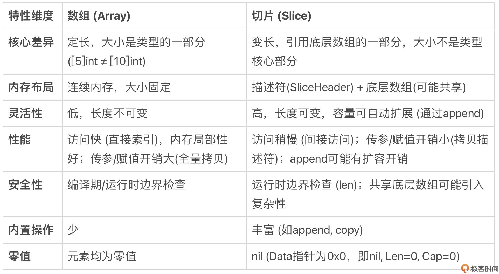

# 数组与切片：性能、灵活与陷阱，如何做出最佳选择？
你好，我是 Tony Bai。

上一讲我们深入学习了值与指针以及 Go 的值传递机制。今天，我们要聚焦 Go 语言中使用频率最高的两种复合类型： **数组（array）和切片（slice）**。相信你对它们已经不陌生了。

数组是由相同类型元素组成的复合类型，Go 会为每个数组类型实例分配一块连续的内存。一旦创建，数组的元素个数和大小就固定不变。

**而切片可以理解为动态数组**，它的元素类型也是相同的，但其底层数组（underlying array）的大小会随着调用 append 函数添加元素而自动扩展。所有这些操作都由 Go 运行时自动完成，程序员无需显式干预。

在日常 Go 开发中，切片以其无与伦比的灵活性，在很多场景下取代了数组，成为处理同构（相同类型）元素集合的首选。

**但切片的这种灵活性并非没有“代价”**。你是否思考过：

- 数组的“死板”背后，隐藏着哪些性能优势？
- 切片的“灵活”背后，又有哪些潜在的性能开销和不易察觉的“陷阱”？
- 比如， `nil` 切片和空切片有何不同？ `append` 导致底层数组“分家”是怎么回事？ `for range` 遍历切片时有什么坑？
- 在追求性能和追求灵活性之间，我们应该如何明智地选择使用数组还是切片？

这节课，我们就来深入剖析数组和切片的核心差异、性能权衡以及常见的陷阱。掌握这些，你才能真正驾驭好数组和切片这两个Go 语言的利器。

## 数组 vs 切片：固定与动态的权衡分析

我们可以先从几个维度来对比数组和切片的优劣：



总结来说，核心的权衡在于：

- **数组**：胜在性能稳定、内存布局简单、类型强约束带固定长度；劣在不够灵活、传参拷贝代价高。适用于大小固定且对性能有极致要求的场景，或作为其他数据结构的底层存储。
- **切片**：胜在灵活、方便、传参代价低；劣在性能有波动（扩容）、内存管理相对复杂、存在一些使用陷阱。是 Go 中处理序列数据的首选和惯用方式。

在同构元素数据结构上，Go 语言的设计者更倾向于灵活性和实用性，因此切片的使用远比数组广泛。但理解切片灵活性的“代价”，是避免踩坑、写出高质量代码的关键。

## 切片的灵活性：背后的性能“代价”与常见陷阱

切片的易用性背后，隐藏着一些需要我们深入理解的机制和潜在问题。

#### nil 切片 vs 空切片

有过 Go 语言开发经验的小伙伴估计大多都知道空切片（empty slice）与 nil 切片（nil slice）比较的梗，这也是 Go 面试中的一道高频题：

```
var sl1 = []int{}
var sl2 []int

```

在上面代码中，sl1 是空切片，而 sl2 是 nil 切片。要理解这两种切片的区别，离不开运行时的切片表示。我们知道切片在运行时由三个字段构成，标准库 reflect 包中有切片在运行时中表示的具体定义：

```
// $GOROOT/src/reflect/value.go
type SliceHeader struct {
    Data uintptr
    Len  int
    Cap  int
}

```

基于这个定义我们来理解空切片和 nil 切片就容易多了。我们用一段代码来看看这两种切片的差别：

```
package main

import (
    "fmt"
    "reflect"
    "unsafe"
)

func main() {
    var sl1 = []int{}
    ph1 := (*reflect.SliceHeader)(unsafe.Pointer(&sl1))
    fmt.Printf("empty slice's header is %#v\n", *ph1)
    var sl2 []int
    ph2 := (*reflect.SliceHeader)(unsafe.Pointer(&sl2))
    fmt.Printf("nil slice's header is %#v\n", *ph2)
}

```

在这段代码中，我们通过 unsafe 包以及 reflect.SliceHeader 输出了空切片与 nil 切片在内存中的表示，即 SliceHeader 各个字段的值。我们运行一下上述代码（使用 -gcflags ‘-l -N’ 可关闭 Go 编译器的优化）：

```
$go run -gcflags '-l -N' dumpslice.go
empty slice's header is reflect.SliceHeader{Data:0xc000092eb0, Len:0, Cap:0}
nil slice's header is reflect.SliceHeader{Data:0x0, Len:0, Cap:0}

```

通过输出结果，我们看到 nil 切片在运行时表示的三个字段值都是 0；而空切片的 len、cap 值为 0，但 **data 值不为 0**。如果将 sl1 和 sl2 分别与 nil 进行等值比较，会得到如下与我们预期一致的结果：

```
println(sl1 == nil) // false
println(sl2 == nil) // true

```

那么 data 值不为 0，是否意味着 Go 已经给空切片分配了额外的内存空间了呢？并没有！

data 的值实际上是一个栈上的内存单元的地址，Go 编译器并没有在堆上额外分配新的内存空间作为切片 sl 的底层数组。如果你输出上面代码对应的汇编代码，你会发现在汇编代码中并没有调用 growslice 或 newobject 等在堆上分配底层数组的调用。

接下来，我们再来看看切片的自动扩容特性在底层内存管理上给我们带来的理解复杂性。

#### 关于自动扩容

这里要提醒你： **只有通过 Go 预定义的 append 函数向切片追加元素的过程中，才会触发切片实例的自动扩容**。如果仅仅是对切片进行下标操作，比如下面使用下标对切片元素的读取和赋值是不会触发自动扩容的。如果下标越界，即超出切片的长度，那么还会引发运行时的 panic。

```
var sl = make([]int, 8)
sl[0] = 10
... ...
sl[7] = 17
println(sl[3])

sl[8] = 18 // panic: runtime error: index out of range [8] with length 8

```

针对上面示例中的 sl，如果还要向其中存入数据，可以通过 append 函数，就像这样：

```
println(cap(sl))      // 8
sl = append(sl, 18)
println(sl[8])        // 18
println(cap(sl))      // 16

```

我们看到通过 append 向切片变量 sl 追加元素，append 前后的切片容量发生了自动扩充，由 append 前的 8 增加到 16，即一旦切片容量满（len==cap），append 就会重新分配一块更大的底层数组，然后将当前切片元素 copy 到新底层数组中。

通常在切片容量较小的情况下，append 都会按 2 倍切片的容量进行扩容，就像这个例子中的从 8 到 16。对于切片容量较大的情况（Go 1.17 及以前版本，容量超过 1024 归于此类，而从 Go 1.18 开始，这一上限值改为 256 了），那么 Go 便不会按 2 倍容量扩容。

下面是 Go 1.18 版本中的切片扩容算法：

```
// $GOROOT/src/runtime/slice.go
func growslice(et *_type, old slice, cap int) slice {
    ... ...

    newcap := old.cap
    doublecap := newcap + newcap
    if cap > doublecap {
        newcap = cap
    } else {
        const threshold = 256
        if old.cap < threshold {
            newcap = doublecap
        } else {
            // Check 0 < newcap to detect overflow
            // and prevent an infinite loop.
            for 0 < newcap && newcap < cap {
                // Transition from growing 2x for small slices
                // to growing 1.25x for large slices. This formula
                // gives a smooth-ish transition between the two.
                newcap += (newcap + 3*threshold) / 4
            }
            // Set newcap to the requested cap when
            // the newcap calculation overflowed.
            if newcap <= 0 {
                newcap = cap
            }
        }
    }
    ... ...
}

```

和 Go 1.17 及以前版本相比，Go 1.18 在处理超过门限值（上面代码中的 threshold）的切片容量扩容前后的变化不会那么剧烈，而是使变化更为平滑一些。不过这个扩容算法也不是一成不变的，也许将来的某个版本 Go 中会有更为科学合理的切片扩容算法。

不过，自动扩容会带来一个“副作用”，进而导致代码中的潜在错误，那就是切片扩容后的新老切片彻底分家。这是什么意思呢？我们来看下面的示例：

```
package main

import "fmt"

func F(sl []int, elems ...int) []int {
    sl = append(sl, elems...)
    sl[0] = 11
    return sl
}

func main() {
    var sl = []int{1, 2}
    fmt.Printf("origin sl = %v, addr of first element: %p\n", sl, &sl[0])
    sl1 := F(sl, 3, 4, 5, 6)
    fmt.Printf("after invoke F, sl = %v, addr of first element: %p\n", sl, &sl[0])
    fmt.Printf("after invoke F, sl1 = %v, addr of first element: %p\n", sl1, &sl1[0])
}

```

在这个示例中，我们有一个整型切片 sl，其初始元素值有两个，1 和 2。我们将其传给函数 F，该函数在向切片追加元素后，会将第一个元素的值更新为 11。对这个示例，很多人的预期结果是原 sl 的第一个元素值也会被改为 11，但事实真的是这样吗？

我们来看看这段示例程序的执行结果：

```
origin sl = [1 2], addr of first element: 0xc00018a010
after invoke F, sl = [1 2], addr of first element: 0xc00018a010
after invoke F, sl1 = [11 2 3 4 5 6], addr of first element: 0xc0001a2000

```

我们看到，由于 F 函数中 append 元素数量超出了原切片的容量，Go 对切片进行了扩容，分配了新的底层数组，这样扩容前后的切片的底层数组就“分家”了，后续对切片第一个元素的更新，影响的仅仅是分家后的新切片及其底层数组，原切片中第一个元素值并未受到影响。

这个“分家”现象直接影响了我们在函数中处理切片的方式，即当切片作为函数参数时，我们该如何考量这个函数的设计。

#### 函数设计

我们知道切片算是“半个”零值可用的类型，为什么这么说呢？当我们声明一个空切片时，我们不能直接对其做下标操作，比如：

```
var sl []int
sl[0] = 5 // 错误：引发panic

```

但是我们可以通过 Go 内置的 append 函数对其进行追加操作，即便 sl 目前的值为 nil：

```
var sl []int
sl = append(sl, 5) // ok

```

细心的小伙伴到这里可能会问： **为什么 append 函数要通过返回值返回切片结果呢**？再泛化一点：当你在函数设计环节遇到要传入传出切片类型时，你会如何设计函数的参数与返回值呢？下面我们就来探讨一下。

我们在 `$GOROOT/src/builtin/builtin.go` 中找到了 append 预置函数的原型：

```
func append(slice []Type, elems ...Type) []Type

```

显然参照 append 函数的设计， **通过参数传入切片，通过返回值传出更新过的切片肯定是一个正确的方案**，比如下面的第一版 MyAppend 函数：

```
func myAppend1(sl []int, elems ...int) []int {
    return append(sl, elems...)
}

func main() {
    var in = []int{1, 2, 3}
    fmt.Println("in slice:", in) // 输出：in slice: [1 2 3]
    fmt.Println("out slice:", myAppend1(in, 4, 5, 6)) // 输出：out slice: [1 2 3 4 5 6]
}

```

到这里，有些小伙伴会提出：切片不是动态数组吗？是不是可以既作为输入参数，又兼作输出参数呢？我理解提出这个问题的小伙伴们希望设计出像下面这样的函数原型：

```
func myAppend2(sl []int, elems ...int)

```

这里 sl 作为输入参数传入 myAppend2，然后在 myAppend2 对其进行 update 后，myAppend2 函数的调用者将得到更新后的 sl。但实际情况是这样的吗？我们来看一下：

```
unc myAppend2(sl []int, elems ...int) {
    sl = append(sl, elems...)
}

func main() {
    var arr = [6]{1,2,3}
    var inOut = arr[:3:6]  // 构建一个len=3，cap=6的切片
    fmt.Println("in slice:", inOut)
    myAppend2(inOut, 4, 5, 6)
    fmt.Println("out slice:", inOut)
}

```

运行这段程序，我们得到如下结果：

```
in slice: [1 2 3]
out slice: [1 2 3]

```

我们看到 myAppend2 并未如我们预期的那样工作，传入的切片并未在 myAppend2 中得到预期的更新，这是为什么呢？首先这是与切片在运行时的表示有关的，在前面我们已经提过这一点了，切片在运行时由三个字段构成（见上面的 SliceHeader 结构体）。

此外，Go 函数采用“值拷贝”的参数传递方式，这意味着 myAppend2 传递的切片 sl 实质上仅仅传递的是切片“描述符” —— SliceHeader。myAppend2 函数体内改变的是形参 sl 的各个字段的值，但 myAppend2 的实参并未受到任何影响，即执行完 myAppend2 后，inOut 的 len 和 cap 依旧保持不变。

而其底层数组是否改变了呢？在这个例子中肯定是“改变”了，但改变的是 inOut 长度（len）范围之外，cap 之内的元素，通过对 inOut 的常规访问是无法获取到这些元素的。

那么我们该如何让 slice 作为 in/out 参数呢？答案是使用指向切片的指针，我们来看下面的例子：

```
func myAppend3(sl *[]int, elems ...int) {
    (*sl) = append(*sl, elems...)
}

func main() {
    var inOut = []int{1, 2, 3}
    fmt.Println("in slice:", inOut) // in slice: [1 2 3]
    myAppend3(&inOut, 4, 5, 6)
    fmt.Println("out slice:", inOut) // out slice: [1 2 3 4 5 6]
}

```

我们看到 myAppend3 函数使用 \*\[\]int 类型的形参，的确解决了切片参数作为输入输出参数的问题：myAppend3 对切片的更改操作都反映到 inOut 变量所代表的这个 slice 上了，即便在 myAppend3 内切片进行了动态扩容，inOut 也能“捕捉”到这点。

不过使用切片指针类型作为函数参数并非 Go 惯用法，我在 Go 标准库中查找了一下，使用指向切片的指针作为参数的函数“少得可怜”：

```
$grep "*\[\]" */*go|grep func
grep: cmd/cgo: Is a directory
grep: cmd/go: Is a directory
grep: runtime/cgo: Is a directory
log/log.go:func itoa(buf *[]byte, i int, wid int) {
log/log.go:func (l *Logger) formatHeader(buf *[]byte, t time.Time, file string, line int) {
regexp/onepass.go:func mergeRuneSets(leftRunes, rightRunes *[]rune, leftPC, rightPC uint32) ([]rune, []uint32) {
regexp/onepass.go:    extend := func(newLow *int, newArray *[]rune, pc uint32) bool {
runtime/mstats.go:func readGCStats(pauses *[]uint64) {
runtime/mstats.go:func readGCStats_m(pauses *[]uint64) {
runtime/proc.go:func saveAncestors(callergp *g) *[]ancestorInfo {

```

综上，当我们在函数设计中遇到切片类型数据时，如果要对切片做更新操作，优先还是要参考 append 函数的设计方案，即通过切片作为输入参数和返回值的方式实现该操作逻辑，必要时也可以使用指向切片的指针的方式传递切片，就像 myAppend3 那样。

#### 预分配容量

既然自动扩容有性能开销（内存分配 \+ 数据拷贝），那么如果我们在创建切片时就能预估到它最终大概需要多大容量，就可以提前分配，从而避免或减少后续 `append` 触发的扩容次数。

我们可以使用带容量参数的 `make` 函数：

```
sl := make([]T, length, capacity)

```

例如，如果你知道一个切片最终会存储约 1000 个元素：

```
// 方式一：无预分配容量
var sl1 []int
for i := 0; i < 1000; i++ {
    sl1 = append(sl1, i) // 可能触发多次扩容
}

// 方式二：预分配容量
sl2 := make([]int, 0, 1000) // 长度为0，容量为1000
for i := 0; i < 1000; i++ {
    sl2 = append(sl2, i) // 基本不会触发扩容 (除非1000次append中途有其他操作改变了容量)
}

```

我们看一下这两种方式的性能基准测试情况：

```
package main

import (
    "testing"
)

func BenchmarkAppendWithoutCap(b *testing.B) {
    for i := 0; i < b.N; i++ {
        var sl []int
        for j := 0; j < 1000; j++ {
            sl = append(sl, j)
        }
    }
}

func BenchmarkAppendWithCap(b *testing.B) {
    for i := 0; i < b.N; i++ {
        sl := make([]int, 0, 1000)
        for j := 0; j < 1000; j++ {
            sl = append(sl, j)
        }
    }
}

```

在这个基准测试中，我们分别测试了使用 cap 创建的切片和未使用 cap 创建的切片的追加元素操作的开销，测试结果如下：

```
$go test -bench . benchmark_test.go
cpu: Intel(R) Core(TM) i5-8257U CPU @ 1.40GHz
BenchmarkAppendWithoutCap-8         355918          3378 ns/op
BenchmarkAppendWithCap-8           2456326           485.1 ns/op
PASS

```

结果显示， **预分配容量的方式性能提升显著（近 7 倍！）**。

由此可以得出使用预分配的两个场景。

- 当你能比较准确地估计出切片所需的最大容量时。
- 在性能敏感的代码路径中，频繁的小切片 `append` 操作可能成为瓶颈。

#### 警惕内存泄露

切片支持在使用 append 追加元素时进行自动扩容， **但却不会自动缩容**。也就是说在切片容量初始分配较大，或者是在扩容为大内存之后依然长期持有，即便不再使用这些扩容后的内存，这些内存也不会被释放，而会长期占用着内存资源。

下面是一个模拟此种状况的代码示例：

```
package main

import (
    "fmt"
    "math/rand"
    "runtime"
    "sync"
    "time"
)

const (
    poolSize     = 10
    maxSliceSize = 1000000
    duration     = 30 * time.Second
)

type SlicePool struct {
    pool chan []int
}

func NewSlicePool(size int) *SlicePool {
    return &SlicePool{
        pool: make(chan []int, size),
    }
}

func (p *SlicePool) Get() []int {
    select {
    case slice := <-p.pool:
        return slice[:0] // 重置切片长度，但保留容量
    default:
        return make([]int, 0, 10) // 如果池空，创建新切片
    }
}

func (p *SlicePool) Put(slice []int) {
    select {
    case p.pool <- slice:
    default:
        // 如果池满，丢弃
    }
}

func smallWorker(id int, pool *SlicePool, wg *sync.WaitGroup, done <-chan struct{}) {
    defer wg.Done()
    for {
        select {
        case <-done:
            return
        default:
            slice := pool.Get()
            // 只使用前10个元素
            for i := 0; i < 10; i++ {
                if i < len(slice) {
                    slice[i] = i
                } else {
                    slice = append(slice, i)
                }
            }
            // 模拟使用切片
            time.Sleep(100 * time.Millisecond)
            pool.Put(slice)
        }
    }
}

func largeWorker(id int, pool *SlicePool, wg *sync.WaitGroup, done <-chan struct{}) {
    defer wg.Done()
    for {
        select {
        case <-done:
            return
        default:
            slice := pool.Get()
            size := rand.Intn(maxSliceSize)
            for i := 0; i < size; i++ {
                slice = append(slice, i)
            }
            // 模拟使用切片
            time.Sleep(1 * time.Second)
            pool.Put(slice)
        }
    }
}

func main() {
    pool := NewSlicePool(poolSize)
    var wg sync.WaitGroup
    done := make(chan struct{})

    // 启动小型worker
    for i := 0; i < 8; i++ {
        wg.Add(1)
        go smallWorker(i, pool, &wg, done)
    }

    // 启动大型worker
    for i := 8; i < 10; i++ {
        wg.Add(1)
        go largeWorker(i, pool, &wg, done)
    }

    // 定时打印内存使用情况
    ticker := time.NewTicker(1 * time.Second)
    timeout := time.After(duration)

    for {
        select {
        case <-ticker.C:
            printMemUsage("当前内存使用")
        case <-timeout:
            close(done) // 通知所有worker停止
            ticker.Stop()
            wg.Wait() // 等待所有worker结束
            printMemUsage("结束时内存使用")
            return
        }
    }
}

func printMemUsage(msg string) {
    var m runtime.MemStats
    runtime.ReadMemStats(&m)
    fmt.Printf("%s - 使用的内存: %v MB\n", msg, m.Alloc/1024/1024)
}

```

在这个示例程序中，我们创建了一个切片池，池的大小为 10。我们启动了两类 worker goroutine，一类 worker goroutine 不断从切片池中取出切片，但仅使用其中很少的空间，然后再放回池子中；而另外一类 worker goroutine 则每秒从池中获取切片，随机扩展切片大小（最大为 1000000 个元素），然后将切片归还到池中。主 goroutine 每秒打印一次内存使用情况，持续 30 秒后程序结束。

我们运行这个程序，可以看到类似如下的输出结果：

```
$go run large_mem_hold.go
当前内存使用 - 使用的内存: 9 MB
当前内存使用 - 使用的内存: 14 MB
当前内存使用 - 使用的内存: 14 MB
当前内存使用 - 使用的内存: 14 MB
当前内存使用 - 使用的内存: 14 MB
当前内存使用 - 使用的内存: 22 MB
... ...
当前内存使用 - 使用的内存: 22 MB
当前内存使用 - 使用的内存: 22 MB
结束时内存使用 - 使用的内存: 22 MB

```

我们会看到内存使用量在开始时快速增长，然后保持在一个较高的水平，即使大部分时间 goroutine 可能只使用了切片池很小的一部分容量。这是由于切片扩容后，底层数组仍然占用着之前扩容的大量内存，这部分内存无法被释放，因为切片仍在池中被重复使用，导致程序内存占用居高不下。

**如何缓解？**

- **按需创建**：如果可能，尽量在需要时创建大小合适的切片，而不是复用可能过大的切片。
- **显式复制**：如果只需要大切片中的一小部分数据，并且希望释放大数组内存，可以显式地释放原切片，并创建一个新切片，并将所需数据拷贝过去。

```
largeSlice := getLargeSliceFromPool()
var smallSlice []int
tooLarge := (cap(largeSlice) >= 1000)

if tooLarge {
    // 创建新切片并拷贝，不再引用大数组
    largeSlice = nil // 释放大切片
    smallSlice = make([]int, len(yourData))
} else {
    smallSlice := largeSlice[:len(yourData)]
}
copy(smallSlice, neededData)
useSmallSlice(smallSlice)           // 使用独立的小切片

```

像上面这样的由于切片在运行时的独特表示以及自动扩容特性所带来的潜在的问题还有一些，接下来我们再来看一个，那就是当 for range 和切片一起使用时可能会出现的问题。

#### `for range` 陷阱

切片与 for range 一起使用的方法我们再熟悉不过了，这里不再回顾 for range 的语法，而是直接给出一个 for range 与切片联合使用的代码示例，你先猜猜最终输出的 cnt 值是多少呢？

```
package main

import "fmt"

func main() {
    a := make([]int, 5, 8)
    cnt := 0
    for i := range a {
        cnt++
        if i == 1 {
            a = append(a, 6, 7, 8)
        }
    }
    fmt.Println("cnt=", cnt)
}

```

有人说是 8！这些小伙伴的理由估计是这样的：在 i 为 1 时，代码又向切片 a 附加了 3 个新元素，使得切片的长度变为了 8。于是 for range 迭代 8 次，cnt 计数到 8。

下面我们实际运行一下这段代码，看看输出的结果究竟是多少：

```
cnt= 5

```

我们看到最终 cnt 的值为 5。为什么会这样呢？这与切片在运行时的表示以及 for range 后面的表达式的含义不无关系！

当我们使用 for range 去迭代切片变量 a 时，实际上 for range 后面的 a 是切片变量 a 的副本（以下以 a’ 代替），就像将一个切片变量以参数的形式传给一个函数一样，这是一个值拷贝的过程。

在 for range 循环过程中，切片 a 的副本 a’ 始终未变更过，它的长度始终为 5，因此 for range 一共就迭代了 5 次，所以 cnt 为 5。而循环体中通过 append 追加的元素实际上是追加到了原切片 a 上了。即便 a 和 a’ 仍然共享底层数组，但由于 a’ 的长度是 5，for range 就只能迭代 5 次。

## 数组与切片相互转换

最后，我们再来看看数组和切片间的转换。

虽然数组和切片是 Go 语言中不同的类型，但在实际开发中，我们经常需要在它们之间进行转换。理解如何高效地进行转换，避免不必要的内存分配，对于编写高性能的 Go 代码至关重要。

我们先来看看数组转切片。

将数组转换为切片非常简单，Go 语言提供了切片操作符 \[:\] 来实现这一目的，并且这种转换方式是 **零拷贝** 的。也就是说，它不会创建新的底层数组，而是直接引用原数组的底层存储。我们看下面示例：

```
package main

import (
    "fmt"
    "reflect"
    "unsafe"
)

func main() {
    arr := [5]int{1, 2, 3, 4, 5}

    // 数组转切片
    slice := arr[:]

    // 验证切片与数组共享底层存储
    fmt.Printf("Array address: %p\n", &arr[0])
    fmt.Printf("Slice address: %p\n", &slice[0])

    // 修改切片元素，观察数组是否受影响
    slice[0] = 10
    fmt.Println("Array after slice modification:", arr)

    //获取数组和切片底层信息
    ph1 := (*reflect.SliceHeader)(unsafe.Pointer(&slice))
    fmt.Printf("slice's header is %#v\n", *ph1)
    ph2 := (*[5]int)(unsafe.Pointer(ph1.Data))
    fmt.Printf("slice's underlying array is %#v\n", *ph2)
}

```

运行这段程序，我们得到如下结果：

```
Array address: 0xc0000201b0
Slice address: 0xc0000201b0
Array after slice modification: [10 2 3 4 5]
slice's header is reflect.SliceHeader{Data:0xc0000201b0, Len:5, Cap:5}
slice's underlying array is [5]int{10, 2, 3, 4, 5}

```

从输出结果可以看出，切片 slice 和数组 arr 共享相同的底层存储地址。修改切片的元素也会影响到数组的元素。这种零拷贝的转换方式非常高效。

接下来，我们再来看看切片转数组。

与数组转切片不同的是，Go 并没有提供直接从切片创建数组的语法糖，因为切片是动态的，而数组是固定大小的。但在某些情况下，我们可能希望以数组的方式来操作切片的底层数据。但在 Go 1.17 之前，我们没有办法直接将切片转为数组，只能通过 unsafe 方式得到切片的底层数组的地址。

Go 1.17 增加了切片转数组指针的语法，Go 1.20 版本又增加了将切片转为数组的语法，我们通过下面示例来看一下这两种转换的使用：

```
package main

import (
    "fmt"
    "unsafe"
)

func main() {
    // 原始切片
    slice := []int{1, 2, 3, 4, 5}
    fmt.Println("Original slice:", slice)

    // 方法1: 标准语法 - Go 1.17+
    arrayPtr := (*[5]int)(slice)
    fmt.Println("Array pointer (standard):", *arrayPtr)

    // 方法2: 使用unsafe的等价形式，不推荐，这里只是为了演示
    unsafeArrayPtr := (*[5]int)(unsafe.Pointer(&slice[0]))
    fmt.Println("Array pointer (unsafe):", *unsafeArrayPtr)

    // 验证两者指向相同的内存
    fmt.Printf("Standard array pointer: %p\n", arrayPtr)
    fmt.Printf("Unsafe array pointer:   %p\n", unsafeArrayPtr)

    // 修改通过指针获取的数组，验证它影响原切片
    (*arrayPtr)[2] = 30
    fmt.Println("Slice after modifying through array pointer:", slice)

    // 方法1: 标准语法 - Go 1.20+
    slice[2] = 3 // 恢复原值
    array := [5]int(slice)
    fmt.Println("Array (standard):", array)

    // 方法2: 使用unsafe的等价形式
    // 另一种unsafe方式（不推荐，这只是为了演示）
    unsafeArray := *(*[5]int)(unsafe.Pointer(&slice[0]))
    fmt.Println("Array (unsafe deref):", unsafeArray)

    // 验证标准转换创建了新的副本
    array[2] = 300
    fmt.Println("Original slice after modifying array:", slice)
    fmt.Println("Modified array:", array)
}

```

运行这段程序，我们得到如下结果：

```
Original slice: [1 2 3 4 5]
Array pointer (standard): [1 2 3 4 5]
Array pointer (unsafe): [1 2 3 4 5]
Standard array pointer: 0xc00012e000
Unsafe array pointer:   0xc00012e000
Slice after modifying through array pointer: [1 2 30 4 5]
Array (standard): [1 2 3 4 5]
Array (unsafe deref): [1 2 3 4 5]
Original slice after modifying array: [1 2 3 4 5]
Modified array: [1 2 300 4 5]

```

从结果我们可以看到，通过转换后的数组指针，我们可以获得切片的底层数组的访问，并且对数组指针的修改也会影响到原切片。而通过 Go 1.20 的切片转数组语法，则是创建了一个新数组，并将切片的数据复制到了新数组中。因此，对新数组的修改不会影响到原来的切片。

Go 1.17 和 Go 1.20 提供了从切片到数组的更安全、更便捷的转换方式，这些方式避免了通过 unsafe 包直接操作指针，降低了出错的风险。同时 Go 1.17 的切片转数组是零拷贝的，非常高效。不过我们也要注意： **如果切片的长度小于数组的长度，会引发运行时** **panic**。

## 小结

在本讲中，我们深入对比了 Go 语言的数组和切片，探讨了它们在性能与灵活性上的核心权衡，并重点揭示了使用切片时可能遇到的性能“代价”与常见“陷阱”。

- **核心权衡**：数组提供性能稳定和内存可预测性，但缺乏灵活性；切片提供极高的灵活性和便捷性，但性能有波动且隐藏着更多复杂性。

- **切片的“代价”与陷阱**
  - **nil vs 空切片**：底层 `Data` 指针不同，影响 `== nil` 判断和某些场景（如JSON）。
  - **自动扩容**： `append` 超出容量时触发，涉及内存分配和拷贝开销；可能导致新老切片底层数组 “分家”。
  - **函数设计**：修改切片（尤其长度/容量）的函数，应返回新切片，而非依赖副作用或使用不常用的 `*[]T` 参数。
  - **预分配容量**：使用 `make([]T, len, cap)` 能显著减少扩容开销，提升性能。
  - **内存持有**：切片不自动缩容，复用大切片可能导致内存浪费，需警惕。
  - `for range` **行为**：迭代开始时拷贝切片头，循环次数固定，循环体内修改切片长度不影响迭代次数。
- **数组切片转换**：数组转切片是零拷贝；切片转数组指针（1.17+）是零拷贝；切片转数组（1.20+）是拷贝。


**如何做出最佳选择？**

- **默认使用切片**：对于大多数需要处理序列数据的场景，切片的灵活性和易用性使其成为首选。
- **性能敏感且大小固定？考虑数组**：如果集合大小在编译期已知，且是性能瓶颈点，数组可能是更好的选择。

数组和切片是 Go 数据结构的基础。深刻理解它们的特性、权衡和陷阱，是写出高效、健壮、地道 Go 代码的必经之路。

## 思考题

假设你正在设计一个函数，需要接收一个 `[]byte` 切片，对其内容进行某种转换（可能会改变元素值，但不会改变切片的长度），然后返回转换后的结果。

请问，这个函数签名最好设计成以下哪种形式？并说明理由。

1. `func Transform(data []byte)`（无返回值，直接修改传入的切片）
2. `func Transform(data []byte) []byte`（传入切片，返回一个新的切片）
3. `func Transform(data *[]byte)`（传入指向切片的指针）

欢迎在留言区分享你的选择和思考！我是 Tony Bai，我们下节课见。
