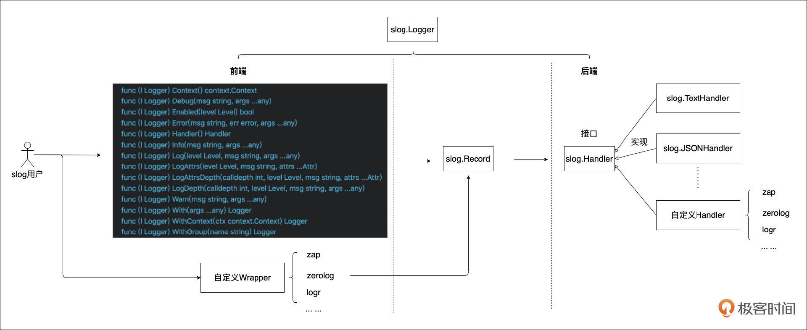
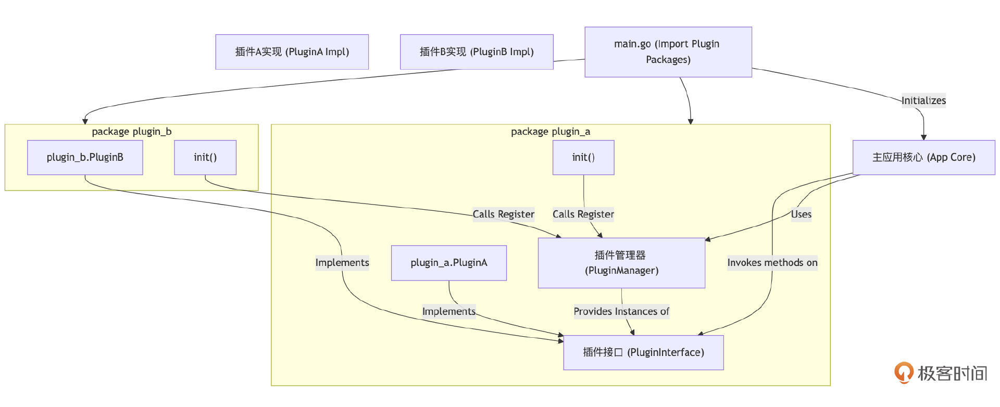
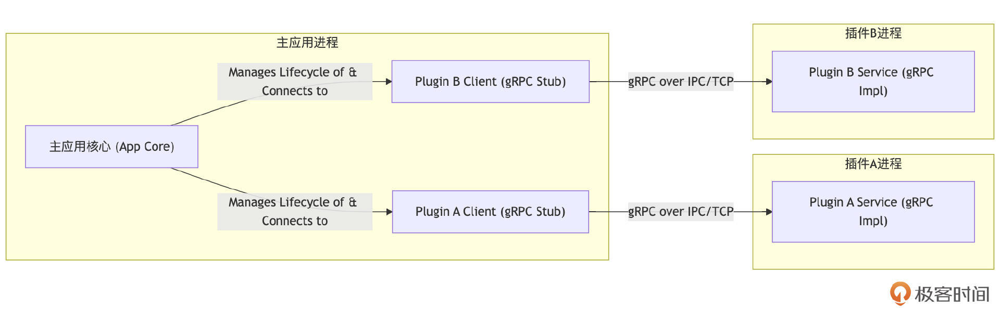
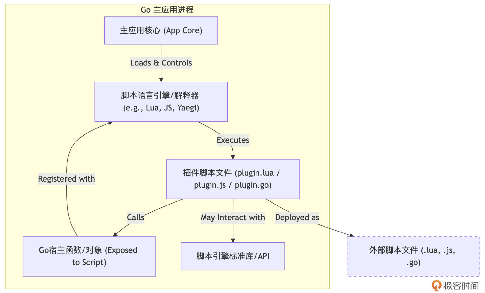

# 核心组件：构建健壮Go服务的配置、日志与插件化方案（下）
你好，我是Tony Bai。

上节课，我们深入配置管理的实践，学习了如何整合命令行参数、环境变量、配置文件乃至远程配置中心等多种配置源，理解了优先级策略的重要性。

这节课，我们接着聚焦日志最佳实践。分析传统日志记录的不足，明确现代日志系统的核心要素（结构化、级别、上下文、输出目标等），并重点讲解Go 1.21+ 官方推出的结构化日志库 `log/slog`。我们还会结合“标准库优先，按需拓展”的理念进行讨论。

最后，我们将探讨插件化架构。从Go原生 `plugin` 包的能力与局限出发，借鉴社区经验，总结几种在Go应用中更实用、更常见的插件化设计模式，并分析其适用场景，帮助你判断何时以及如何为应用引入插件化能力。

## 日志最佳实践与 `log/slog` 详解

**如果说配置是应用行为的指南，那么日志系统就是应用运行状态的忠实记录者。** 它记录下应用运行过程中的关键事件、状态变化、错误信息以及调试线索。没有高质量的日志，线上服务一旦出现问题，开发者就难以快速有效地定位和解决。

那么，如果让 `fmt.Println` 和标准库 `log` 包打天下，会有什么问题？

在学习Go的初期，或者编写一些简单的脚本时，我们可能习惯于使用 `fmt.Println()` 或标准库的 `log.Println()` 来输出信息。

```go
// ch23/logging/simple/main.go
package main

import (
    "fmt"
    "log"
    "os"
)

func doSomething() error {
    // ... 模拟操作 ...
    return fmt.Errorf("simulated error: something went wrong")
}

func main() {
    fmt.Println("Application starting...") // 直接输出到 Stdout

    // 配置标准库 log
    log.SetOutput(os.Stdout) // 通常默认是 Stderr，这里改为 Stdout 方便观察
    log.SetFlags(log.LstdFlags | log.Lmicroseconds | log.Lshortfile)
    log.Println("Standard logger configured.")

    err := doSomething()
    if err != nil {
        // 不同的输出方式
        fmt.Printf("Output with fmt.Printf: Error occurred: %v\n", err)
        log.Printf("Output with log.Printf: Error occurred: %v\n", err)
    }
    fmt.Println("Application finished.")
}

```

运行后，这个示例的输出可能如下：

```plain
$go run main.go
Application starting...
2025/05/24 19:56:11.449705 main.go:20: Standard logger configured.
Output with fmt.Printf: Error occurred: simulated error: something went wrong
2025/05/24 19:56:11.449854 main.go:26: Output with log.Printf: Error occurred: simulated error: something went wrong
Application finished.

```

这种方式对于临时调试或非常简单的应用可能够用，但对于生产级服务，其弊端显而易见：

- **非结构化**： `fmt.Println` 和标准库 `log` 默认输出的是纯文本字符串。\*\*当日志量巨大时，从中筛选、聚合、分析特定信息变得极其困难。机器难以解析，人工阅读效率也低。

- **没有日志级别**：所有的输出信息“待遇”相同。我们无法区分哪些是调试信息（Debug），哪些是常规流程信息（Info），哪些是警告（Warn），哪些是错误（Error）。在生产环境，我们通常不希望看到大量的调试信息，但在排查问题时又需要它们。

- **缺乏上下文信息**：日志条目通常是孤立的。我们很难将一条日志与特定的用户请求、业务事务或分布式调用链关联起来。这使得追踪一个完整流程的执行路径和状态变化变得困难。

- **功能单一，难以扩展**：标准库 `log` 功能非常基础，不支持自定义格式化、多种输出目标、日志轮转等高级特性。


因此，要构建一个健壮、可观测的Go服务，我们需要一个更现代、更强大的日志解决方案。那么，一个现代化的日志系统应该具备哪些关键特征呢？下面我们就来全面系统了解一下。

### 现代日志系统的核心要素

一个设计良好的现代日志系统，通常应具备以下核心要素：

- 结构化日志（Structured Logging）是最核心的一点。结构化日志意味着每条日志记录不再是简单的文本字符串，而是具有明确 schéma 的数据结构，通常是JSON格式或key-value对格式。

```json
// 示例：一条结构化的JSON日志
{
    "timestamp": "2023-10-27T10:30:15.123Z",
    "level": "ERROR",
    "message": "Failed to process payment",
    "service": "payment-service",
    "trace_id": "abc-123-xyz-789",
    "user_id": "user-456",
    // ... 更多业务相关字段 ...
}

```

**它极易被机器解析、索引和查询，便于开发者利用日志管理工具（如ELK Stack、Grafana Loki、VictoriaLogs等）进行高效的日志聚合、搜索、过滤、可视化和告警。**

- 日志级别（Log Levels）：通过为日志消息设置不同的严重级别（如DEBUG、INFO、WARN、ERROR、FATAL/CRITICAL），可以控制在不同环境下实际输出的日志量，便于信息过滤。

- 上下文信息（Contextual Information）：在日志中包含丰富的上下文，如时间戳、服务名、主机名、请求ID、Trace ID、用户ID、业务ID等，能将分散的日志条目串联起来，还原完整的业务流程或问题场景。

- 可配置的输出目标（Outputs/Sinks）：日志系统应支持将日志输出到不同的目标。
  - 控制台（Stdout/Stderr）：便于开发调试和容器日志收集。

  - 本地文件（Local Files）：持久化日志，常用于传统部署。

  - 集中式日志收集系统/消息队列：如ELK Stack的Logstash/Fluentd、Kafka、NATS等。这是构建可观测性的重要一环，将日志集中后，可以方便地与Metrics、Tracing联动分析，提供对系统行为更全面的洞察。如果日志中包含了关键的业务指标或错误计数，它们甚至可以被日志分析系统提取出来，间接贡献给Metrics系统。
- 性能考量（Performance）：日志记录不应成为应用瓶颈（例如，通过异步写入、避免不必要的反射和内存分配来优化）。

- 日志轮转与归档（Log Rotation & Archiving）：当日志输出到本地文件时，必须有机制来防止日志文件无限增长，通常通过专门的库或外部工具实现。


具备了这些核心要素，我们的日志系统才能真正成为应用稳定运行的得力助手。了解了理想状态后，我们来看看在Go语言中，日志方案是如何一步步发展，并最终催生出官方的log/slog库的。

### 日志方案的演进：从第三方库的启示到拥抱 `log/slog`

在Go官方推出log/slog之前，Go社区在日志库方面已经有了非常丰富的实践和探索，其中不乏一些设计优秀、广受欢迎的第三方库。它们不仅解决了标准库log的诸多不足，也为slog的最终设计提供了宝贵的经验和启示。下面我们就先来简要回顾一下这些第三方库的贡献。

#### `sirupsen/logrus`

logrus可能是早期最流行的Go结构化日志库之一。它API设计与标准库log包高度兼容，使得迁移成本较低。提供了日志级别、JSON/Text格式化，以及通过Hook机制扩展输出目标（如发送到Sentry、Syslog等）的能力。

下面是logrus的使用示例代码片段，完整示例参见ch23/logging/logrus\_example/main.go。

```plain
// import "github.com/sirupsen/logrus"
// logrus.SetFormatter(&logrus.JSONFormatter{})
// logrus.WithFields(logrus.Fields{
//   "animal": "walrus",
//   "size":   10,
// }).Info("A group of walrus emerges from the ocean")

```

运行示例，可以得到类似下面输出结果：

```plain
{"level":"info","msg":"A group of walrus emerges from the ocean","time":"2025-05-24T20:13:54.068+08:00"}
{"level":"warning","msg":"The group is larger than expected","time":"2025-05-24T20:13:54.068+08:00"}
{"action":"swim","animal":"walrus","level":"error","msg":"Failed to count all walruses","size":10,"time":"2025-05-24T20:13:54.068+08:00"}

```

Logrus推广了结构化日志和可扩展性的理念，但其基于 `interface{}` 的 `Fields` 和反射的使用，在高性能场景下存在一些开销。

#### `uber-go/zap`

zap库由Uber开源，专为高性能和低（零）分配而设计。它通过避免使用 `interface{}`（而是采用强类型的 `zap.Field` 构造函数如 `zap.String()`、 `zap.Int()`）、几乎不使用反射，以及大量使用 `sync.Pool` 等技巧，实现了极致的日志记录性能。它提供了Logger（高性能，但API略繁琐）和SugaredLogger（性能稍逊，但API更接近fmt.Printf和logrus，更易用）两种API。

下面是zap的使用示例代码片段，完整示例代码见ch23/logging/zap\_example/main.go。

```plain
// import "go.uber.org/zap"
// import "time"
// logger, _ := zap.NewProduction() // JSON格式, INFO级别以上
// defer logger.Sync() // Flushes any buffered log entries
// logger.Info("failed to fetch URL",
//   zap.String("url", "http://example.com"),
//   zap.Int("attempt", 3),
//   zap.Duration("backoff", time.Second),
// )

```

运行示例，可以得到类似下面输出结果：

```plain
{"level":"debug","ts":"2025-05-24T20:19:41.244+0800","caller":"zap_example/main.go:40","msg":"This is a zap debug message.","component":"auth","user_id_count":1005}
{"level":"info","ts":"2025-05-24T20:19:41.245+0800","caller":"zap_example/main.go:44","msg":"Zap logger initialized.","url":"http://example.com","attempt":3,"backoff":1}
{"level":"warn","ts":"2025-05-24T20:19:41.245+0800","caller":"zap_example/main.go:49","msg":"Potential issue detected.","warning_code":"W001"}
{"level":"error","ts":"2025-05-24T20:19:41.245+0800","caller":"zap_example/main.go:50","msg":"Operation failed.","error":"network connection refused","stacktrace":"main.main\n\t/Users/tonybai/go/src/github/go-advanced/part3/source/ch23/logging/zap_example/main.go:50\nruntime.main\n\t/Users/tonybai/.bin/go1.24.3/src/runtime/proc.go:283"}

```

zap 证明了Go日志库可以达到极高的性能，并强调了在设计API时为性能所做的权衡（例如，要求用户显式提供字段类型）。它对Go社区在高性能组件设计方面产生了深远影响。

这些优秀的第三方库，极大地推动了Go社区对结构化日志、高性能日志以及日志系统可扩展性的认知和实践。它们在各自的领域都做得非常出色，并为后续标准库的演进提供了宝贵的参考。

#### `log/slog`：Go官方的结构化日志解决方案（Go 1.21+）

在选择日志库时，标准库 `log` 的局限性使其难以胜任生产级应用的需求。而引入第三方库则需要权衡其功能、性能、学习成本、社区支持和依赖管理等因素。正是由于这种背景，Go官方推出了 `log/slog`。



`log/slog` 旨在提供一个易用、高性能、可扩展的结构化日志基础，并期望能逐步统一Go生态的日志记录方式。其设计目标与核心特性包括：

- 开箱即用的结构化日志：默认支持JSON和类似logfmt的文本格式。

- 日志级别：内置了 `LevelDebug`、 `LevelInfo`、 `LevelWarn`、 `LevelError`。

- 高性能：设计上充分考虑了性能，避免了标准库 `log` 和早期一些第三方库的性能瓶颈（如过度反射、大量分配）。官方宣称其性能接近 `zap`。

- 可插拔的 `Handler`：这是 `slog` 设计的核心亮点。 `slog.Logger` 通过一个 `slog.Handler` 接口来处理日志记录的实际格式化和输出。这意味着开发者可以轻松替换或自定义Handler，以支持不同的输出格式、目标，或添加额外的处理逻辑（如采样、过滤、对接第三方服务等）。

- 与标准库 `log` 兼容：可以将标准库 `log` 的输出重定向到 `slog`。


slog的核心API包括如下类型与方法：

- `slog.Logger`：日志记录器实例，通过 `slog.New(Handler)` 创建。

- `slog.Handler`：这是一个接口类型，定义了处理日志记录的核心逻辑。标准库提供了 `slog.TextHandler` 和 `slog.JSONHandler` 两个内建实现。


```go
type Handler interface {
    Enabled(context.Context, Level) bool
    Handle(context.Context, Record) error
    WithAttrs(attrs []Attr) Handler
    WithGroup(name string) Handler
}

```

- `slog.Record`：代表一条日志记录的结构体，包含时间、级别、消息、属性等。

- `slog.Attr`：代表一个key-value属性对，用于向日志记录添加结构化数据。通过 `slog.String(key, value)`、 `slog.Int(key, value)`、 `slog.Duration(key, value)`、 `slog.Any(key, value)` 等函数创建。


下面是slog的一个基本用法与上下文集成的示例：

```go
// ch23/logging/slog_example/main.go
package main

import (
    "context"
    "fmt"
    "log/slog"
    "os"
    "time"
)

type User struct {
    ID   string
    Name string
}

// UserLogValue implements slog.LogValuer to customize logging for User type
func (u User) LogValue() slog.Value {
    return slog.GroupValue(
        slog.String("id", u.ID),
        slog.String("name", u.Name),
    )
}

func main() {
    // --- TextHandler Example ---
    txtOpts := &slog.HandlerOptions{
        Level:     slog.LevelDebug,
        AddSource: true, // 添加源码位置 (文件名:行号)
        ReplaceAttr: func(groups []string, a slog.Attr) slog.Attr {
            // 将所有 Info 级别的 level 字段的键名改为 "severity"
            if a.Key == slog.LevelKey && a.Value.Any().(slog.Level) == slog.LevelInfo {
                a.Key = "severity"
            }
            return a
        },
    }
    txtHandler := slog.NewTextHandler(os.Stdout, txtOpts)
    txtLogger := slog.New(txtHandler)
    txtLogger.Info("TextHandler: Server started.", slog.String("port", ":8080"))

    // --- JSONHandler Example ---
    jsonOpts := &slog.HandlerOptions{
        Level: slog.LevelInfo, // JSON logger只输出Info及以上
        ReplaceAttr: func(groups []string, a slog.Attr) slog.Attr {
            if a.Key == slog.TimeKey { // 自定义时间戳字段名和格式
                a.Key = "event_time"
                a.Value = slog.StringValue(a.Value.Time().Format(time.RFC3339Nano))
            }
            return a
        },
    }
    jsonHandler := slog.NewJSONHandler(os.Stderr, jsonOpts)
    jsonLogger := slog.New(jsonHandler)
    jsonLogger.Error("JSONHandler: Payment failed.",
        slog.String("order_id", "ord-123"),
        slog.Any("error_details", map[string]string{"code": "P401", "message": "Insufficient funds"}),
    )

    // --- Using With for contextual logging ---
    requestID := "req-abc-789"
    userLogger := jsonLogger.With(
        slog.String("request_id", requestID),
        slog.Group("user_info",
            slog.String("id", "user-xyz"),
            slog.Bool("authenticated", true),
        ),
    )
    userLogger.Info("User action performed.", slog.String("action", "view_profile"))
    userLogger.Debug("This debug from userLogger will not be printed by jsonLogger (LevelInfo).")

    // --- Implementing LogValuer for custom type logging ---
    currentUser := User{ID: "u-555", Name: "Alice Wonderland"}
    userLogger.Info("Processing user data.", slog.Any("user_object", currentUser))

    // --- Setting a default logger ---
    slog.SetDefault(txtLogger.WithGroup("global")) // All subsequent slog.Info etc. will use this
    slog.Info("This is a global log message via default logger (TextHandler).", slog.Int("count", 42))

    // for components requiring specific contexts or outputs, explicit logger injection is preferred.
    doWorkWithGlobalLogger()
}

func doWorkWithGlobalLogger() {
    slog.Warn("Warning from a function using the global default logger.", slog.String("module", "worker"))
}

```

运行示例，可以得到类似下面输出结果：

```plain
time=2025-05-24T20:54:15.787+08:00 severity=INFO source=/Users/tonybai/go/src/github/go-advanced/part3/source/ch23/logging/slog_example/main.go:37 msg="TextHandler: Server started." port=:8080
{"event_time":"2025-05-24T20:54:15.787392+08:00","level":"ERROR","msg":"JSONHandler: Payment failed.","order_id":"ord-123","error_details":{"code":"P401","message":"Insufficient funds"}}
{"event_time":"2025-05-24T20:54:15.787457+08:00","level":"INFO","msg":"User action performed.","request_id":"req-abc-789","user_info":{"id":"user-xyz","authenticated":true},"action":"view_profile"}
{"event_time":"2025-05-24T20:54:15.787465+08:00","level":"INFO","msg":"Processing user data.","request_id":"req-abc-789","user_info":{"id":"user-xyz","authenticated":true},"user_object":{"id":"u-555","name":"Alice Wonderland"}}
time=2025-05-24T20:54:15.787+08:00 severity=INFO source=/Users/tonybai/go/src/github/go-advanced/part3/source/ch23/logging/slog_example/main.go:75 msg="This is a global log message via default logger (TextHandler)." global.count=42
time=2025-05-24T20:54:15.787+08:00 level=WARN source=/Users/tonybai/go/src/github/go-advanced/part3/source/ch23/logging/slog_example/main.go:86 msg="Warning from a function using the global default logger." global.module=worker

```

从示例中我们也看到：一旦通过 `slog.SetDefault(logger)` 设置了全局默认的 `slog.Logger`，应用中的任何包都可以直接调用包级别的 `slog.Info()`、 `slog.Error()` 等函数进行日志记录，而无需显式传递 `slog.Logger` 实例。全局默认logger更适合作为一种普适性的、便捷的基础日志记录手段。

而对于那些需要携带特定上下文信息（如请求ID、用户ID）或者需要输出到特定目标（通过不同的Handler）的组件或逻辑单元（例如HTTP请求处理器、gRPC服务实现、业务服务方法），仍然推荐显式地创建和注入（或通过 `logger.With()` 派生）特定的 `slog.Logger` 实例。这样做能使日志的上下文更丰富，也更容易管理不同模块的日志行为。

此外， `slog` 本身不强制要求将 `Logger` 实例通过 `context.Context` 传递，但你可以这样做，或者创建一个包装了 `context.Context` 的 `Logger`。更常见的做法是，当你需要为特定请求或流程添加上下文属性时，可以使用 `logger.With(attrs ...slog.Attr)` 来创建一个新的 `Logger` 实例，它会携带这些额外的属性。这种做法也被称为上下文集成（Contextual Logging）：

```go
func handleRequest(ctx context.Context, baseLogger *slog.Logger, requestID string) {
    reqLogger := baseLogger.With(slog.String("request_id", requestID))
    reqLogger.Info("Processing request")
    // ...
    if err := doWork(ctx, reqLogger); err != nil {
        reqLogger.Error("Work failed", slog.Any("error", err))
    }
}

```

许多Web框架和库也开始提供与 `slog` 集成的中间件，可以自动从请求上下文中提取或注入 `Logger`。

如果你需要将日志发送到 `slog` 标准库未直接支持的目标（如Kafka、特定的云日志服务），或者需要实现非常定制化的格式化、过滤、采样逻辑，你可以通过实现 `slog.Handler` 接口来创建自己的Handler。这是 `slog` 强大扩展性的体现。

```go
type MyCustomHandler struct {
    // ...你的依赖和配置...
    next slog.Handler // 可以包装另一个Handler，形成处理链
}

func (h *MyCustomHandler) Enabled(ctx context.Context, level slog.Level) bool {
    return h.next.Enabled(ctx, level) // 或自定义逻辑
}

func (h *MyCustomHandler) Handle(ctx context.Context, r slog.Record) error {
    // ...你的自定义处理逻辑，例如修改Record，或将其发送到特定目标...
    // r.AddAttrs(slog.String("custom_field", "my_value"))
    return h.next.Handle(ctx, r) // 调用下一个Handler
}
// ...实现 WithAttrs 和 WithGroup ...

```

那么，何时选择 `slog`？何时仍可能考虑第三方库呢？

**`slog` 作为标准库是未来的趋势。对于新项目，或希望减少外部依赖、追求与Go生态更好集成的项目， `slog` 无疑是首选。**

如果项目已深度使用某个第三方日志库（如 `zap` 或 `logrus`），并强依赖其特定高级功能或庞大的Hook生态，立即迁移可能成本较高，可以考虑使用桥接Handler或在新模块中逐步采用 `slog`。

但如果对日志性能有极端严苛要求，且基准测试表明 `slog` 在特定场景下仍有差距时，专门优化的库（如 `zap`）可能仍是备选。

总的来说， **“标准库优先”原则在此依然适用**。 `slog` 为Go的结构化日志提供了坚实的基础和统一的API。

熟悉了现代日志系统的核心要素和Go中日志方案的演进，我们还需要解决一个实际问题：当日志输出到本地文件时，如何有效地管理这些文件？

### 日志轮转与归档

当日志输出到本地文件时，管理这些文件的大小和生命周期至关重要，以防止它们无限增长并耗尽磁盘空间。slog本身作为日志记录API和格式化库，不直接处理文件轮转的物理操作。这项工作通常交给专门的库来完成。

下面是结合 `slog` 与 `natefinch/lumberjack` 实现日志轮转的一个示例， `natefinch/lumberjack` 是一个在Go社区广泛使用的，用于实现日志文件轮转的库。它实现了 `io.Writer` 接口，可以非常方便地与 `slog`（或其他任何接受 `io.Writer` 的日志库）集成。

```go
// ch23/logging/slog_lumberjack/main.go
package main

import (
    "io" // Required for io.MultiWriter
    "log/slog"
    "os"
    "time"

    "github.com/natefinch/lumberjack"
)

func main() {
    // 1. 配置 lumberjack.Logger 作为 io.Writer
    logFilePath := "./logs/myapp_rotated.log" // 日志文件路径
    os.MkdirAll("./logs", os.ModePerm)      // 确保logs目录存在

    logFileWriter := &lumberjack.Logger{
        Filename:   logFilePath,
        MaxSize:    1,                  // 每个日志文件的最大大小 (MB)
        MaxBackups: 3,                  // 保留的旧日志文件的最大数量
        MaxAge:     7,                  // 保留的旧日志文件的最大天数 (天)
        Compress:   true,               // 是否压缩旧的日志文件 (使用gzip)
        LocalTime:  true,               // 使用本地时间命名备份文件
    }

    // 2. 创建一个slog Handler
    // 使用 io.MultiWriter 可以同时将日志输出到文件和控制台（方便开发调试）
    handlerOptions := &slog.HandlerOptions{
        Level:     slog.LevelDebug,
        AddSource: true, // 添加源码位置
        ReplaceAttr: func(groups []string, a slog.Attr) slog.Attr {
            if a.Key == slog.TimeKey {
                a.Value = slog.StringValue(a.Value.Time().Format("2006-01-02 15:04:05.000"))
            }
            return a
        },
    }

    // 可以选择输出格式，例如JSON或Text
    // logger := slog.New(slog.NewJSONHandler(io.MultiWriter(os.Stdout, logFileWriter), handlerOptions))
    logger := slog.New(slog.NewTextHandler(io.MultiWriter(os.Stdout, logFileWriter), handlerOptions))

    slog.SetDefault(logger) // 可选：设置为默认logger

    slog.Info("Application starting with file rotation enabled via lumberjack.")
    slog.Debug("This is a debug message that should appear in both console and file.")

    // 模拟大量日志输出以触发轮转 (1MB大约需要较多条目)
    // 调整循环次数和日志内容大小以实际触发轮转
    // 一条典型slog日志（带时间、级别、源、消息、几个属性）可能在100-300字节左右
    // 1MB = 1024 * 1024 bytes. 大约需要 3500 - 10000条日志.
    for i := 0; i < 5000; i++ {
        slog.Info("This is a test log entry to demonstrate rotation.",
            slog.Int("entry_number", i),
            slog.String("data_payload", fmt.Sprintf("some_long_data_string_padding_%d_%s", i, time.Now().String())),
        )
        if i%1000 == 0 && i != 0 {
            slog.Warn("Milestone log entry reached.", slog.Int("progress_mark", i/1000))
            time.Sleep(100 * time.Millisecond) // 稍微暂停，让日志有机会写入
        }
    }

    slog.Info("Application finished logging. Check the './logs' directory for rotated files.")
}

```

运行这个示例后，检查项目下的 `./logs/` 目录，你会看到 `myapp_rotated.log` 文件，以及当它达到1MB后被轮转、压缩（如果开启Compress）的备份文件。

```plain
logs git:(main) ✗ $ls
myapp_rotated-2025-05-24T21-17-18.008.log.gz    myapp_rotated.log

```

通过这种方式，我们利用 `slog` 的结构化日志能力和 `lumberjack` 的文件管理能力，构建了一个既强大又易于维护的本地文件日志系统。

至此，我们已经深入探讨了应用骨架中两个至关重要的基础组件：配置管理和日志系统。它们为应用的稳定运行、灵活部署和问题排查提供了坚实的基础。然而，当应用发展到一定阶段，面临更复杂的需求，例如需要动态扩展功能、允许第三方集成或实现特定业务逻辑的灵活替换时，我们就可能需要引入更高级的架构模式——插件化架构。

## 插件化架构设计模式

随着应用功能的日益丰富和业务场景的不断演变，我们有时会遇到这样的需求：希望应用的核心保持稳定，但又能灵活地增减或替换某些特定功能模块，甚至允许第三方开发者为我们的平台贡献扩展。这时，插件化架构（Plugin Architecture）就显得尤为重要。

当我的应用需要支持第三方扩展，或者在不重新编译主程序的情况下动态增减功能时，该怎么办？

如果你的应用只是简单地将所有功能都硬编码在主程序中，那么每次添加一个小特性、修复一个小模块的 Bug，或者集成一个新的第三方服务，都可能意味着要修改核心代码、重新编译整个应用并重新部署。这不仅效率低下，而且容易引入新的风险。

**插件化架构顾名思义就是将应用的核心功能与可插拔的扩展功能（插件）分离开来。** 主应用定义好与插件交互的接口和规范，插件则按照这些规范实现具体的功能。这样，就可以在不修改主应用核心代码的前提下，通过添加、移除或替换插件来改变或扩展应用的行为。

插件化的核心价值在于其带来的灵活性和可扩展性，它使得应用能够更好地适应变化、解耦模块、促进社区贡献并支持功能定制。然而，实现一个优秀的插件化系统也面临诸多挑战，包括：

- 如何定义稳定且易用的插件接口？

- 如何管理插件的版本兼容性？

- 如何保障插件的安全性与资源隔离？

- 如何处理插件的发现与加载机制？

- 如何应对可能增加的性能开销和调试复杂度？


因此，选择是否引入插件化以及采用何种插件化方案，需要仔细权衡这些价值与挑战。并非所有应用都需要复杂的插件系统，但理解其设计模式对于构建大型、可演进的系统非常有益。

接下来，我们先看看Go语言原生提供的插件支持，然后再探讨社区中更为主流和实用的插件化架构模式。

### Go原生 `plugin` 包：美好的初衷与残酷的现实

Go语言在1.8版本中引入了官方的 `plugin` 包，旨在提供一种原生的方式来构建和加载插件。其核心思想是将Go包编译为共享对象文件（在Linux上是 `.so` 文件，macOS上是 `.dylib` 文件），主程序可以在运行时动态加载这些文件，并查找和使用其中导出的符号（变量和函数）。

下面是一个演示plugin基本用法的示例。我们首先看看插件包 `ch23/plugins/native/myplugin/plugin.go`，注意：插件包的包名必须是 `main`：

```go
// ch23/plugins/native/myplugin/plugin.go
package main

import "fmt"

// PluginName 是一个导出的变量
var PluginName = "MyNativeGoPlugin"

// Greet 是一个导出的函数
func Greet(name string) string {
    return fmt.Sprintf("Hello, %s, from %s!", name, PluginName)
}

// Version 是另一个导出变量示例
var Version = "1.0.0"

// 为了能被编译为plugin，必须有一个main函数，即使它是空的
func main() {
    // 通常插件的main函数不执行任何操作，因为其代码是被主程序加载和调用的
}

```

在 `ch23/plugins/native/myplugin/` 目录下运行下面命令可以编译该插件：

```bash
$go build -buildmode=plugin -o myplugin.so plugin.go

```

这会生成 `myplugin.so` 文件，我们将该文件拷贝一份到其上层目录ch23/plugins/native下。

接下来，我们再来看加载和使用插件的主程序（ `ch23/plugins/native/main.go`）：

```go
package main

import (
    "fmt"
    "log"
    "os"
    "path/filepath"
    "plugin"
)

func main() {
    exePath, err := os.Executable()
    if err != nil {
        log.Fatalf("Failed to get executable path: %v", err)
    }
    pluginDir := filepath.Dir(exePath)
    pluginPath := pluginDir+"./myplugin.so" // 假设.so文件在当前工作目录下，或相对于main.go

    // 最简单的运行方式：
    // 1. cd ch23/plugins/native/myplugin
    // 2. go build -buildmode=plugin -o ../myplugin.so plugin.go  (将.so输出到上一级目录)
    // 3. cd .. (进入 ch23/plugins/native 目录)
    // 4. go run main.go

    log.Printf("Attempting to load plugin from: %s\n", pluginPath)
    p, err := plugin.Open(pluginPath)
    if err != nil {
        log.Fatalf("Failed to open plugin '%s': %v\nIf running with 'go run', ensure '%s' is in the current directory or adjust path.", pluginPath, err, filepath.Base(pluginPath))
    }
    log.Println("Plugin loaded successfully.")

    // 查找导出的变量 PluginName
    pluginNameSymbol, err := p.Lookup("PluginName")
    if err != nil {
        log.Fatalf("Failed to lookup PluginName: %v", err)
    }
    pluginName, ok := pluginNameSymbol.(*string) // 需要类型断言，因为Lookup返回plugin.Symbol (interface{})
    if !ok {
        log.Fatalf("PluginName is not a *string, actual type: %T", pluginNameSymbol)
    }
    fmt.Printf("Plugin's registered name: %s\n", *pluginName)

    // 查找导出的变量 Version
    versionSymbol, err := p.Lookup("Version")
    if err != nil {
        log.Fatalf("Failed to lookup Version: %v", err)
    }
    version, ok := versionSymbol.(*string)
    if !ok {
        log.Fatalf("Version is not a *string, actual type: %T", versionSymbol)
    }
    fmt.Printf("Plugin's version: %s\n", *version)

    // 查找导出的函数 Greet
    greetSymbol, err := p.Lookup("Greet")
    if err != nil {
        log.Fatalf("Failed to lookup Greet: %v", err)
    }
    greetFunc, ok := greetSymbol.(func(string) string) // 类型断言为函数类型
    if !ok {
        log.Fatalf("Greet is not a func(string) string, actual type: %T", greetSymbol)
    }

    // 调用插件中的函数
    message := greetFunc("Go Developer")
    fmt.Println(message)

    // 尝试修改插件中的可导出变量 (如果插件设计允许)
    log.Printf("Original PluginName in plugin: %s\n", *pluginName)
    *pluginName = "MyUpdatedNativePlugin" // 修改的是主程序持有的指针指向的值

    // 再次调用函数，看看插件内部是否感知到变化（取决于插件如何使用该变量）
    // 如果Greet函数直接使用全局的PluginName，它会看到变化
    // 但如果Greet函数在调用时捕获了PluginName的副本，则可能看不到
    // 在我们的简单示例中，Greet函数每次都会读取全局的PluginName
    messageAfterChange := greetFunc("Gopher")
    fmt.Println(messageAfterChange)
}

```

在ch23/plugins/native下编译主程序并运行：

```plain
$go build -o main
$./main
2025/05/24 21:48:31 Attempting to load plugin from: /Users/tonybai/go/src/github/go-advanced/part3/source/ch23/plugins/native/myplugin.so
2025/05/24 21:48:31 Plugin loaded successfully.
Plugin's registered name: MyNativeGoPlugin
Plugin's version: 1.0.0
Hello, Go Developer, from MyNativeGoPlugin!
2025/05/24 21:48:31 Original PluginName in plugin: MyNativeGoPlugin
Hello, Gopher, from MyUpdatedNativePlugin!

```

我们看到go plugin的机制是可以工作的。但这仅是一个demo，因此不要乐观过早！因为Go原生的 `plugin` 包虽然提供了一种动态加载代码的机制，但在实际应用中面临诸多严格的约束，这极大地限制了它的普及和易用性。这些约束主要包括：

- **平台限制**：官方明确支持Linux、macOS、FreeBSD，但尚不支持Windows等其他平台。

- **构建环境高度一致性要求**：这是最主要的痛点。主程序和所有插件必须使用完全相同版本（包括补丁版本）的Go编译器进行编译。此外，它们的GOPATH/GOROOT设置（尤其在非Module模式下）以及所依赖的所有共享包（包括直接和间接依赖）的源代码和版本也必须完全一致。任何细微的差异都可能导致插件加载失败，并伴随难以调试的错误，如 `plugin was built with a different version of package X`。

- **动态链接与Go的静态编译优势相悖**：Go语言的一大优势是能够编译成单个静态链接的可执行文件，便于分发和部署。然而，使用 `plugin` 包意味着主程序必须进行动态链接，这在一定程度上削弱了Go的这一核心优势。

- **无法热卸载（No Hot Unloading）**：一旦插件通过 `plugin.Open()` 被加载到主进程的地址空间中，Go的 `plugin` 包目前没有提供任何安全地卸载（unload）或替换它的机制。这对于需要真正动态更新插件版本的场景是一个重大限制。

- **版本管理复杂**：由于上述对构建环境和依赖版本的严格一致性要求，管理插件及其依赖的版本变得非常具有挑战性，尤其是在大型项目或有多个独立开发的插件时。

- **符号查找的类型安全**： `Lookup()` 方法返回的是 `plugin.Symbol`（其底层类型是 `interface{}`），这意味着主程序在获取到插件的符号后，必须进行类型断言才能将其转换为期望的变量指针或函数类型。如果类型不匹配，会在运行时发生panic。


这样来看，尽管Go原生 `plugin` 包提供了一种底层的动态代码加载能力，但其严苛的约束使得它在许多实际的生产场景中并非一个便捷或理想的选择。开发者在考虑使用它时，必须仔细评估是否能满足并长期维持这些一致性要求。

鉴于此，社区和业界在实践中更多地探索和采用了其他不依赖于原生 `plugin` 包的插件化架构模式。

### 社区主流的Go应用插件化架构模式

由于Go原生 `plugin` 包的实际应用限制，社区和业界探索出了多种更为实用和灵活的插件化架构模式。这些模式通常不依赖于操作系统级别的共享对象动态加载，而是通过Go语言自身的特性（如接口、包管理）或进程间通信机制来实现主应用与插件的解耦和集成。

#### 模式一：基于接口与注册机制的“内部插件”



这种模式下，插件作为普通的Go包存在，它们实现主应用预先定义好的接口。主应用通过某种机制（通常是插件包在 `init()` 函数中调用主应用提供的注册函数）来发现和管理这些插件的实现。最终，插件代码会和主应用代码一起被编译到同一个可执行文件中。

**这种模式的核心思想是利用Go的接口实现多态，并通过包导入时的 `init` 副作用或显式注册来收集插件。** 其优点在于类型安全（编译期检查）、高性能（直接方法调用）和统一的依赖管理。然而，它并不提供运行时热插拔的能力，添加或更新插件都需要重新编译主应用。由于插件与主应用在同一进程空间，也没有资源隔离和强安全性保障。

这种模式非常适合那些需要高度模块化，且允许不同团队开发可组合功能，但所有功能模块可以一起编译和部署的场景。许多开源项目，如Caddy Web服务器的模块系统，就广泛采用了类似的思想。

#### 模式二：基于IPC/RPC的“外部插件”



在这种模式中，插件作为完全独立的进程运行与主应用进程分离。主应用和插件进程之间通过某种标准的进程间通信（IPC）机制，如Unix Domain Socket、Named Pipes，或者更常用的远程过程调用（RPC）框架（如gRPC、HTTP）进行交互。主应用通常负责启动、监控插件子进程，并管理与它们的通信。

HashiCorp开源的 `go-plugin` 库（ [https://github.com/hashicorp/go-plugin](https://github.com/hashicorp/go-plugin)）是这种模式的一个非常优秀且成熟的实现。它默认使用gRPC作为通信协议，并封装了插件发现、版本协商、双向流式RPC、插件进程管理等诸多复杂细节，大大简化了构建外部插件系统的难度。

**这种模式的核心优势在于它实现了真正的运行时热插拔、热更新甚至热卸载（通过管理子进程的启停）。** 由于进程隔离，它还带来了语言无关性（插件可以用任何支持gRPC的语言编写）、更好的资源隔离和稳定性（一个插件进程的崩溃通常不会直接影响主应用），以及增强的安全性（可以对插件进程施加更严格的权限控制）。

当然，这种模式的代价是引入了IPC/RPC带来的通信开销（数据序列化/反序列化、上下文切换等），增加了部署和管理的复杂度（需要管理多个进程），并且主应用与插件之间共享复杂状态或大量数据可能不如进程内那样高效。

这种模式非常适合对运行时动态性要求极高（如需要不停机更新功能模块）、需要支持异构语言插件，或者对安全性和稳定性有较高要求的场景。许多基础设施工具，如Terraform（其Provider插件系统）、Vault、Consul等，都广泛采用了基于 `go-plugin` 的外部插件架构。由于基于 `hashicorp/go-plugin` 的示例代码量较大，涉及定义protobuf服务、实现gRPC服务端和客户端等，此处不展示完整代码，你可以参考 `hashicorp/go-plugin` 的官方文档和示例。

#### 模式三：基于脚本语言嵌入的插件



**这种模式的核心是在Go主应用中嵌入一个脚本语言的解释器或运行时**，例如使用 `robertkrimen/otto` 嵌入JavaScript（ES5）解释器，或使用 `yuin/gopher-lua` 嵌入Lua解释器，或使用 `traefik/yaegi` 嵌入一个Go语言自身的解释器。插件则以该脚本语言的脚本文件形式存在，由主应用在运行时加载并执行这些脚本。主应用需要向脚本的执行环境暴露一些Go函数或对象作为API，供脚本调用以与主应用交互。

这种模式的主要优点是高度的动态性，脚本插件通常可以非常方便地在运行时被加载、更新甚至移除，无需重启主应用，并且插件开发可能更为快速（对熟悉脚本语言的开发者而言）。脚本解释器也往往能提供一定程度的沙箱环境以增强安全性。

然而，这种模式的缺点也十分明显：脚本执行的性能通常远低于原生Go代码；在Go与脚本语言之间传递数据和调用函数可能涉及复杂的类型转换和绑定逻辑，不如原生Go接口那样直接和类型安全；调试脚本插件也可能比调试Go代码更困难。此外，它还引入了对脚本解释器库的依赖。

**此模式适用于那些需要高度动态化、允许用户自定义复杂逻辑，但对性能要求不是极端苛刻的场景**，例如某些Web服务器的请求/响应修改规则、游戏中的行为脚本、数据处理管道中的自定义转换规则，或者规则引擎的条件判断等。

在为你的Go应用选择或设计插件化架构时，没有一刀切的答案。你需要仔细权衡动态性需求、性能要求、安全性与隔离性、开发复杂度与团队技能、插件的语言要求以及部署与运维复杂度等多种因素。

对于大多数Go应用，如果需要插件化：

- 当模块间信任度高，对性能敏感，且不需要运行时动态加载时，基于接口的内部插件（模式一）因其简单、高效和类型安全，通常是首选。

- 当对运行时动态性、语言异构性或强隔离性有更高要求时，基于IPC/RPC的外部插件（模式二，特别是使用 `hashicorp/go-plugin`）则是一个非常成熟和强大的选择。

- 脚本嵌入（模式三）则适用于更特定的且对动态性有极端需求，但对性能要求却不苛刻的场景。


## 小结

好了，关于Go应用中核心组件——配置管理、日志系统以及插件化架构的设计与实践，我们就探讨到这里。这节课，我们深入了应用骨架之下的关键“器官”，理解了它们如何支撑一个健壮、可维护、可扩展的Go服务。

我们聚焦于日志最佳实践，分析了 `fmt.Println` 和标准库 `log` 在生产环境中的不足，明确了现代日志系统应具备的核心要素：结构化、级别、上下文信息、可配置的输出目标（及其对接可观测性的意义）、性能考量和日志轮转。我们回顾了 `logrus` 和 `zap` 等优秀第三方库对Go社区的贡献，并本着“标准库优先，按需拓展”的原则，重点学习了Go 1.21+ 官方推出的结构化日志库 `log/slog` 的核心API、用法、上下文集成（特别是通过 `slog.SetDefault` 实现便捷的全局日志记录），以及通过自定义Handler进行扩展的能力。同时，我们也探讨了何时选择 `slog`，以及何时可能仍需考虑其他方案，并结合 `natefinch/lumberjack` 演示了日志轮转的实现。

我们探讨了应用的插件化架构，了解了插件化的核心价值与挑战，分析了Go原生 `plugin` 包美好的初衷及其在实践中的诸多约束。更重要的是，我们借鉴社区和业界的成熟经验，总结了几种更为实用的Go应用插件化设计模式：基于接口的内部插件（编译时）、基于IPC/RPC的外部插件（运行时、跨语言，如 `hashicorp/go-plugin`），以及基于脚本语言嵌入的插件，并讨论了它们各自的优缺点和适用场景。

至此，你不仅掌握了配置、日志这两个每个Go应用都不可或缺的核心组件的设计要点和最佳实践，也对插件化这一重要（但非必须）的架构模式有了更深入的理解。这些知识将直接提升你构建和维护高质量Go服务的能力。在后续的课程中，我们将继续深入探讨与工程实践相关的其他重要主题，例如更全面的可观测性体系构建。

## 思考题

1. 配置与日志的综合应用：假设你正在设计一个需要对接多种第三方服务（如不同的支付渠道、不同的短信服务商）的Go应用。你会如何设计其配置结构来管理这些第三方服务的不同参数（如API Key、URL、超时等）？在日志方面，当调用这些第三方服务时，你会重点记录哪些结构化信息（考虑使用 `slog.Attr`），以便于问题排查和SLA监控？你会选择 `log/slog` 还是其他方案，为什么？

2. 插件化选型思考：如果你的应用（例如一个内容管理系统CMS）需要允许网站管理员通过安装不同的“功能模块”（例如，SEO优化工具、评论系统、电商购物车模块）来扩展网站功能，你会倾向于选择哪种插件化架构模式来实现这个需求？请阐述你选择的主要理由，并简要说明主应用与这些“功能模块”插件之间可能的交互方式。


欢迎在留言区分享你的思考和见解！我是Tony Bai，我们下节课见。
