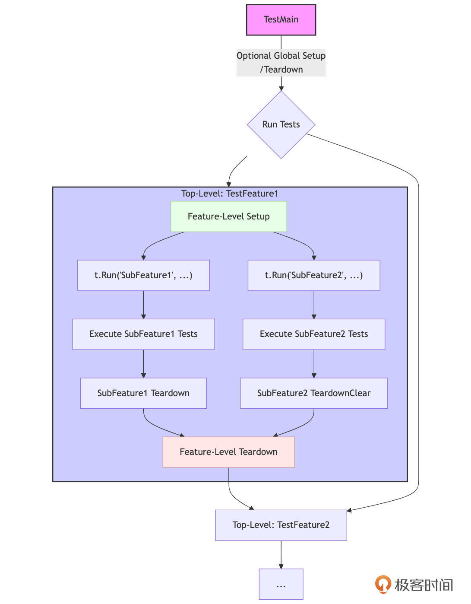

# 测试进阶：组织、覆盖、Mock与Fuzzing的最佳实践（上）
你好，我是Tony Bai。

在Go工程实践中，编写测试是保障代码质量、提升系统稳定性的基石。你可能已经熟悉了如何用Go编写基本的单元测试，但随着项目复杂度的提升，仅仅“会写测试”远远不够。我们还需要掌握更高级的测试组织方法、处理复杂依赖的策略、应对并发场景的技巧，以及利用自动化工具探索代码边界的能力。

**回忆一下，你是否遇到过下面这些进阶测试中的挑战？**

- 一个函数的测试用例写了几百行，包含了各种场景，难以阅读和维护？

- 面对依赖数据库或外部API的模块，开发者编写单元测试时举步维艰，不知道如何下手？

- 为并发代码编写的测试时灵时不灵，数据竞争和死锁像幽灵一样难以捉摸？

- 测试覆盖率报告显示一片绿色，但上线后依然Bug频出？

- 感觉自己的测试用例总是覆盖不到那些“刁钻”的边界条件？


接下来的两节课，我们将超越基础的单元测试，直面上述挑战中的问题，深入探讨Go测试的进阶技巧与最佳实践。我们将一起：

- 快速回顾Go测试的基础类型（单元、基准、示例），确保我们在同一起跑线。

- 深入探讨 **测试组织** 的核心技巧：子测试（t.Run）和表驱动测试（Table-Driven Tests），学习如何编写清晰、可维护的测试用例集，以及如何利用子测试规划包内测试的层次布局。

- 重点攻克 **并发测试** 的难点，讨论如何在Go中安全有效地测试并发代码，包括使用 t.Parallel、sync 包、数据竞争检测，并展望Go 1.25即将正式引入的 testing/synctest。

- 详解 **测试策略中的Fake、Stub与Mock**，以及如何利用 testdata 管理测试数据，有效隔离外部依赖。

- 讨论如何正确 **理解和运用测试覆盖率**，避免将其作为唯一的衡量标准。

- 介绍Go 1.18引入的强大特性—— **Fuzzing（模糊测试）**，学习如何利用它自动发现代码中的边界条件和潜在缺陷。


这节课，我们先来看Go测试基础和测试组织的核心技巧。

## Go测试基础回顾

在深入探讨Go测试的进阶技巧之前，让我们快速回顾一下构成Go测试体系的几个核心基石。这能确保我们对接下来的讨论有共同的语境。Go语言的测试能力主要由标准库中的 testing 包和强大的 `go test` 命令行工具提供。

### 测试文件的约定与测试函数的签名

Go的测试遵循一套简单而明确的约定，这使得测试的发现和执行自动化成为可能。

**首先是测试文件命名。** 所有测试代码都必须放置在以 `_test.go` 为后缀的文件中。这些测试文件需要与它们所测试的源文件位于同一个包内。例如，如果你的包中有一个 `calculator.go` 文件，那么它的测试代码通常会放在 `calculator_test.go` 文件里。

**其次是单元测试函数（Unit Tests）。** 这是最常见的测试类型，用于验证包中某个独立函数或方法的行为。函数签名必须是 `func TestXxx(t *testing.T)`，其中函数名必须以 `Test` 开头，其后的 `Xxx` 是你为测试命名的部分，通常会包含被测试的函数或方法名。 `t *testing.T` 是测试框架提供的上下文对象，用于报告测试结果和状态。示例如下：

```go
// ch25/basics/calc.go
package basics
func Add(a, b int) int { return a + b }

// ch25/basics/calc_test.go
package basics
import "testing"
func TestAdd(t *testing.T) {
    if Add(1, 2) != 3 {
        t.Error("1 + 2 should be 3") // 报告错误
    }
}

```

**然后是示例测试函数（Example Tests）。** 主要用于展示包中函数或方法如何使用，它们既是测试（如果包含 `// Output:` 注释则会验证输出），也是实时更新的文档。函数签名通常是 `func ExampleXxx()`。函数名必须以 `Example` 开头。示例如下：

```plain
// ch25/basics/calc_test.go
        import "fmt"
        func ExampleAdd() {
            sum := Add(5, 10)
            fmt.Println(sum)
            // Output: 15
        }

```

这些命名和签名约定是Go测试框架能够自动发现并执行测试的基础。

### testing.T 的核心交互

\*testing.T（用于单元测试和示例测试）对象是测试函数与测试框架交互的桥梁。它们提供了一系列方法来报告测试状态、记录信息和控制测试流程。我们不必在此罗列所有方法，但理解其核心交互方式很重要。

- **报告失败：**
  - `t.Error(args...)` / `t.Errorf(format, args...)` 报告测试失败，但允许测试继续执行。

  - `t.Fatal(args...)` / `t.Fatalf(format, args...)` 报告测试失败，并立即停止当前测试函数（或子测试）的执行。
- **记录信息：** `t.Log(args...)` / `t.Logf(format, args...)` 输出日志信息，通常在 `go test -v` 时显示。

- **跳过测试：** `t.Skip(args...)` / `t.Skipf(format, args...)` 将当前测试标记为跳过。

- **辅助函数标记：** `t.Helper()`。在自定义的测试辅助函数中调用，使错误报告的行号更准确。

- **资源清理：** `t.Cleanup(f func())`。注册一个函数，在当前测试（或子测试）结束后执行，非常适合资源释放。


熟悉这些核心方法，能帮助我们编写出表意清晰、结果明确的测试。

### go test 命令的核心功能

`go test` 是执行所有类型测试的统一入口。它是一个功能非常强大的工具，这里我们仅回顾几个最核心的常用参数，更详细的用法可以通过 `go help test` 查看。

- **运行测试：**
  - `go test`：运行当前包下的所有测试。

  - `go test ./...`：运行当前目录及所有子目录下的测试。

  - `-run TestNameRegex`：只运行名称匹配正则表达式的测试（例如， `-run TestMyFeature`）。

  - `-bench BenchmarkNameRegex`：运行匹配的基准测试（例如， `-bench .` 运行所有基准测试）。关于性能基准测试的内容，我们将在后面的课程中进行全面系统的进阶讲解。
- **控制输出与行为：**
  - `-v`：详细输出，包括每个测试的名称、状态和日志。

  - `-count n`：将每个测试运行 `n` 次。

  - `-failfast`：在第一个测试失败后立即停止。

  - `-short`：运行一个“简短”模式的测试，测试代码中可以用 `testing.Short()` 来判断是否跳过耗时测试。
- **覆盖率分析：**
  - `-cover`：计算并显示测试覆盖率。

  - `-coverprofile=coverage.out`：将覆盖率数据保存到文件。

  - `go tool cover -html=coverage.out`：生成HTML格式的覆盖率报告。
- **并发与性能：**
  - `-race`：启用数据竞争检测器。

  - `-benchmem`：在基准测试中报告内存分配。

  - `-fuzz FuzzTargetName`（Go 1.18+）：运行模糊测试。

以上这些基础构成了我们进阶讨论的起点。理解这些约定、API和命令，是有效运用Go测试框架的前提。现在，让我们深入第一个进阶主题：如何更好地组织我们的测试代码。

## 测试组织：构建清晰、可维护的测试用例集

随着被测试代码复杂度的增加，一个简单的 `TestXxx` 函数可能会迅速膨胀，尤其是当一个函数有多种输入组合和边界条件时，如何避免测试函数冗长且难以阅读？当一个包内有多个相关的函数或类型方法需要测试时，如何组织测试文件和函数，使其逻辑清晰？测试用例集如果没有清晰的组织结构，会给理解和管理测试带来困难。Go测试框架提供了子测试和表驱动测试这两种强大的机制来协助解决这些问题，同时 **“让添加新测试用例变得容易”**，是我们组织测试时应遵循的核心原则。

### 子测试（t.Run）：化整为零，提升测试粒度与可读性

Go 1.7 引入的 t.Run 方法允许我们在一个顶层测试函数（TestXxx）内部创建和运行独立的、命名的子测试。每个子测试都有自己的 `*testing.T` 实例，可以独立地报告成功、失败或跳过。

**那么，为何需要子测试？原因如下：**

- **隔离失败**：一个子测试的失败不会影响其他子测试的执行。

- **更清晰的测试报告**： `go test -v` 的输出会清晰显示层级和名称（如 `TestMyFunction/SubTestA/Case1`），便于定位。 **清晰的子测试命名对于使测试失败易读至关重要。**

- **共享Setup/Teardown逻辑**：可以在父测试中执行通用设置和清理。

- **逻辑分组**：将相关测试组织在同一个父测试下。


子测试的通常使用形式如下：

```plain
func TestXxx(t *testing.T) {
    t.Run(name string, f func(t *testing.T) {
        // 子测试f的函数体，实现子测试测试逻辑
    })
)

```

其中，name 参数是子测试的描述性名称，f 是子测试的执行函数。下面是一个典型的 **使用子测试进行测试管理** 的示例：

```go
// ch25/subtests/parser_test.go
package subtests

import (
    "fmt"
    "testing"
)

// ParseInput is a function we want to test with subtests.
func ParseInput(input string, strictMode bool) (string, error) {
    if input == "" {
        return "", fmt.Errorf("input cannot be empty")
    }
    if strictMode && len(input) > 10 {
        return "", fmt.Errorf("input too long in strict mode (max 10 chars)")
    }
    return "parsed: " + input, nil
}

func TestParseInput_WithSubtests(t *testing.T) {
    t.Log("Setting up for ParseInput tests...")
    // defer t.Log("Tearing down after ParseInput tests...") // Example of shared teardown

    t.Run("EmptyInput", func(t *testing.T) {
        // t.Parallel() // This subtest could run in parallel if independent
        _, err := ParseInput("", false)
        if err == nil {
            t.Error("Expected error for empty input, got nil")
        } else {
            t.Logf("Got expected error for empty input: %v", err)
        }
    })

    t.Run("ValidInputNonStrict", func(t *testing.T) {
        // t.Parallel()
        input := "hello world" // More than 10 chars, but non-strict
        expected := "parsed: " + input
        result, err := ParseInput(input, false)
        if err != nil {
            t.Errorf("Expected no error for valid input in non-strict mode, got %v", err)
        }
        if result != expected {
            t.Errorf("Expected result '%s', got '%s'", expected, result)
        }
    })

    t.Run("StrictChecks", func(t *testing.T) { // A group for strict mode tests
        // t.Parallel() // This group itself can be parallel with other top-level t.Run

        t.Run("InputTooLongInStrictMode", func(t *testing.T) {
            // t.Parallel()
            input := "thisisareallylonginput" // More than 10 chars
            _, err := ParseInput(input, true) // strictMode = true
            if err == nil {
                t.Error("Expected error for too long input in strict mode, got nil")
            } else {
                expectedErrorMsg := "input too long in strict mode (max 10 chars)"
                if err.Error() != expectedErrorMsg {
                    t.Errorf("Expected error message '%s', got '%s'", expectedErrorMsg, err.Error())
                }
                t.Logf("Got expected error for long input in strict mode: %v", err)
            }
        })

        t.Run("ValidShortInputInStrictMode", func(t *testing.T) {
            // t.Parallel()
            input := "short"
            expected := "parsed: " + input
            result, err := ParseInput(input, true) // strictMode = true
            if err != nil {
                t.Errorf("Expected no error for short input in strict mode, got %v", err)
            }
            if result != expected {
                t.Errorf("Expected result '%s', got '%s'", expected, result)
            }
        })
    })
}

```

以-v标志运行该测试，go测试框架会输出类似如下结果：

```plain
$go test -v
=== RUN   TestParseInput_WithSubtests
    parser_test.go:20: Setting up for ParseInput tests...
=== RUN   TestParseInput_WithSubtests/EmptyInput
    parser_test.go:29: Got expected error for empty input: input cannot be empty
=== RUN   TestParseInput_WithSubtests/ValidInputNonStrict
=== PAUSE TestParseInput_WithSubtests/ValidInputNonStrict
=== RUN   TestParseInput_WithSubtests/StrictChecks
=== PAUSE TestParseInput_WithSubtests/StrictChecks
=== NAME  TestParseInput_WithSubtests
    parser_test.go:77: Tearing down after ParseInput tests...
=== CONT  TestParseInput_WithSubtests/ValidInputNonStrict
=== CONT  TestParseInput_WithSubtests/StrictChecks
=== RUN   TestParseInput_WithSubtests/StrictChecks/InputTooLongInStrictMode
=== PAUSE TestParseInput_WithSubtests/StrictChecks/InputTooLongInStrictMode
=== RUN   TestParseInput_WithSubtests/StrictChecks/ValidShortInputInStrictMode
=== PAUSE TestParseInput_WithSubtests/StrictChecks/ValidShortInputInStrictMode
=== CONT  TestParseInput_WithSubtests/StrictChecks/InputTooLongInStrictMode
=== CONT  TestParseInput_WithSubtests/StrictChecks/ValidShortInputInStrictMode
=== NAME  TestParseInput_WithSubtests/StrictChecks/InputTooLongInStrictMode
    parser_test.go:60: Got expected error for long input in strict mode: input too long in strict mode (max 10 chars)
--- PASS: TestParseInput_WithSubtests (0.00s)
    --- PASS: TestParseInput_WithSubtests/EmptyInput (0.00s)
    --- PASS: TestParseInput_WithSubtests/ValidInputNonStrict (0.00s)
    --- PASS: TestParseInput_WithSubtests/StrictChecks (0.00s)
        --- PASS: TestParseInput_WithSubtests/StrictChecks/InputTooLongInStrictMode (0.00s)
        --- PASS: TestParseInput_WithSubtests/StrictChecks/ValidShortInputInStrictMode (0.00s)
PASS
ok      ch25/subtests   0.007s

```

从上面TestParseInput\_WithSubtests的测试输出中我们可以清晰地看到，子测试支持嵌套定义。例如，我们在StrictChecks这个子测试内部，又定义了InputTooLongInStrictMode和ValidShortInputInStrictMode这两个更下一层的子测试。这种 **嵌套能力使得我们可以构建出非常精细和有层次的测试结构**，这对于组织针对复杂功能（其本身可能包含多个子功能或多种状态组合）的测试场景非常有用。测试报告会忠实地反映这种层级关系，使得定位问题更加精准。

如果子测试之间是相互独立的（不共享可变状态，或者共享状态已得到妥善同步），可以在每个子测试的f func(t \*testing.T)函数体开头调用t.Parallel()。这会告诉测试框架，这个子测试可以与其他标记为Parallel的（同层级的）子测试或顶层测试并发执行。重要的是，父测试函数（如TestParseInput\_WithSubtests）在所有其Parallel子测试完成之前不会返回。

子测试为我们提供了组织复杂测试场景的强大武器，它使得我们可以将一个庞大的测试需求分解为一系列更小、更专注、更易于管理的测试单元。而当这些测试单元共享相似的测试逻辑，仅在输入数据和期望输出上有所不同时，表驱动测试便是子测试的最佳拍档，能进一步提升测试代码的简洁性和可维护性。

### 表驱动测试（Table-Driven Tests）：数据与逻辑分离的最佳实践

表驱动测试是Go社区广为推崇的一种测试模式，它完美体现了 **“将测试用例与测试逻辑分开”** 的测试惯例。其核心思想是将一系列测试用例的输入数据和期望输出组织在一个“表”（通常是结构体切片）中，然后编写一段通用的测试逻辑来遍历这个表，对每一行（即每一个测试用例）执行测试。

**表驱动测试的核心思想与结构是这样的：**

1. **定义测试用例结构体**：通常包含 name（string，用于子测试命名和描述）、输入参数字段、期望输出字段、期望错误类型等。

2. **创建测试用例表**：一个该结构体的切片实例。

3. **循环执行**：遍历切片，对每个测试用例：
   1. 使用 `t.Run(testCase.name, func(t *testing.T) { ... })` 创建子测试。清晰的 `testCase.name` 是保证测试失败信息易读的关键。

   2. 在子测试内部执行被测逻辑，并进行断言。

下面是一个表测试驱动的典型示例：

```go
// ch25/tabledriven/calculator_test.go
package tabledriven

import (
    "fmt"
    "math"
    "testing"
    // "github.com/google/go-cmp/cmp"
)

// Function to be tested
func Divide(a, b float64) (float64, error) {
    if b == 0 {
        return 0, fmt.Errorf("division by zero")
    }
    return a / b, nil
}

func TestDivide_TableDriven(t *testing.T) {
    testCases := []struct {
        name          string    // Test case name
        a, b          float64   // Inputs
        expectedVal   float64   // Expected result value
        expectedErr   string    // Expected error message substring (empty if no error)
    }{
        {
            name:        "ValidDivision_PositiveNumbers",
            a:           10, b: 2,
            expectedVal: 5,
            expectedErr: "",
        },
        {
            name:        "ValidDivision_NegativeResult",
            a:           -10, b: 2,
            expectedVal: -5,
            expectedErr: "",
        },
        {
            name:        "DivisionByZero",
            a:           10, b: 0,
            expectedVal: 0,
            expectedErr: "division by zero",
        },
        {
            name:        "ZeroDividedByNumber",
            a:           0, b: 5,
            expectedVal: 0,
            expectedErr: "",
        },
        {
            name:        "FloatingPointPrecision",
            a:           1.0, b: 3.0,
            expectedVal: 0.3333333333333333,
            expectedErr: "",
        },
    }

    for _, tc := range testCases {
        currentTestCase := tc
        t.Run(currentTestCase.name, func(t *testing.T) {
            val, err := Divide(currentTestCase.a, currentTestCase.b)

            if currentTestCase.expectedErr != "" {
                if err == nil {
                    t.Errorf("Divide(%f, %f): expected error containing '%s', got nil",
                        currentTestCase.a, currentTestCase.b, currentTestCase.expectedErr)
                } else if err.Error() != currentTestCase.expectedErr {
                    t.Errorf("Divide(%f, %f): unexpected error message: got '%v', want substring '%s'",
                        currentTestCase.a, currentTestCase.b, err, currentTestCase.expectedErr)
                }
            } else {
                if err != nil {
                    t.Errorf("Divide(%f, %f): unexpected error: %v", currentTestCase.a, currentTestCase.b, err)
                }
            }

            if currentTestCase.expectedErr == "" {
                const epsilon = 1e-9
                if math.Abs(val-currentTestCase.expectedVal) > epsilon {
                    t.Errorf("Divide(%f, %f) = %f; want %f (within epsilon %e)",
                        currentTestCase.a, currentTestCase.b, val, currentTestCase.expectedVal, epsilon)
                }
            }
        })
    }
}

```

运行该测试用例，你会看到类似下面的测试输出结果：

```plain
$go test -v
=== RUN   TestDivide_TableDriven
=== RUN   TestDivide_TableDriven/ValidDivision_PositiveNumbers
=== RUN   TestDivide_TableDriven/ValidDivision_NegativeResult
=== RUN   TestDivide_TableDriven/DivisionByZero
=== RUN   TestDivide_TableDriven/ZeroDividedByNumber
=== RUN   TestDivide_TableDriven/FloatingPointPrecision
--- PASS: TestDivide_TableDriven (0.00s)
    --- PASS: TestDivide_TableDriven/ValidDivision_PositiveNumbers (0.00s)
    --- PASS: TestDivide_TableDriven/ValidDivision_NegativeResult (0.00s)
    --- PASS: TestDivide_TableDriven/DivisionByZero (0.00s)
    --- PASS: TestDivide_TableDriven/ZeroDividedByNumber (0.00s)
    --- PASS: TestDivide_TableDriven/FloatingPointPrecision (0.00s)
PASS
ok      ch25/tabledriven

```

表驱动测试是Go中编写单元测试的事实标准，它极大地提高了测试代码的组织性、可读性和可维护性，并简化了新测试用例的添加过程——通常只需要在表中增加一行数据。这完美契合了“让添加新测试用例变得容易”的原则。

掌握了子测试和表驱动测试后，我们就可以更有条理地组织一个包内的测试代码了。

### 利用子测试规划包内测试的层次布局

当一个包内有多个相关的函数，或者一个类型有多个方法需要测试时，如何组织这些测试，使其在 `go test -v` 的输出中逻辑清晰、易于定位，是一个值得思考的问题。子测试在这里能发挥巨大作用，帮助我们构建清晰的测试层次。

**利用子测试规划包内测试的层次布局的策略如下：**

1. **按被测单元组织顶层测试函数**：为主要类型或功能模块创建顶层 `TestXxx` 函数。例如，对于一个 `UserService` 类型，我们可以创建一个 `TestUserService(t *testing.T)` 作为其所有方法测试的入口。

2. **在顶层测试函数中使用 t.Run 为每个方法或主要功能点创建子测试分组**：在 `TestUserService` 内部，为 `CreateUser`、 `GetUser`、 `UpdateUser` 等每个公开方法创建一个子测试。这形成了测试报告的第一层逻辑分组，使得报告更易读，例如 `TestUserService/CreateUser`。

3. **在方法/子功能级别的子测试内，再使用表驱动测试或进一步的子测试来覆盖不同场景**：对于每个方法的测试（如 `CreateUser` 的子测试），内部再使用表驱动测试来覆盖该方法的各种输入场景和边界条件。表驱动的每一行又可以通过 t.Run 变成更下一级的子测试，例如 `TestUserService/CreateUser/ValidInput`。


为了更直观地展示这一策略，我们来看一个具体的示例（为了展示测试层次布局，示例代码做了简化）：

```go
// ch25/testhierarchy/user_service.go

package user_service

import "fmt"

type User struct {
    ID   string
    Name string
}

type UserService struct {
    users map[string]User
}

func NewUserService() *UserService {
    return &UserService{users: make(map[string]User)}
}

func (s *UserService) CreateUser(id, name string) (User, error) {
    if id == "" {
        return User{}, fmt.Errorf("user ID cannot be empty")
    }
    if _, exists := s.users[id]; exists {
        return User{}, fmt.Errorf("user %s already exists", id)
    }
    nu := User{ID: id, Name: name}
    s.users[id] = nu
    fmt.Printf("[UserService] User created: %+v\n", nu)
    return nu, nil
}

func (s *UserService) GetUser(id string) (User, error) {
    user, ok := s.users[id]
    if !ok {
        return User{}, fmt.Errorf("user %s not found", id)
    }
    fmt.Printf("[UserService] User retrieved: %+v\n", user)
    return user, nil
}

func (s *UserService) UpdateUser(id, newName string) error {
    if id == "" || newName == "" {
        return fmt.Errorf("id and newName cannot be empty for UpdateUser")
    }
    user, ok := s.users[id]
    if !ok {
        return fmt.Errorf("user %s not found", id)
    }
    user.Name = newName
    s.users[id] = user
    fmt.Printf("[UserService] UpdateUser called for ID: %s, NewName: %s\n", id, newName)
    return nil
}

// ch25/testhierarchy/user_service_test.go
package user_service

import (
    "testing"
)

// TestUserService acts as the main entry point for testing all UserService functionalities.
// It demonstrates how to group tests for different methods using t.Run.
func TestUserService(t *testing.T) {
    // Optional: Common setup for all UserService tests can go here.
    t.Log("Starting tests for UserService...")

    // --- Group for CreateUser method tests ---
    t.Run("CreateUser", func(t *testing.T) {
        t.Log("  Running CreateUser tests...")

        // Sub-case 1 for CreateUser: Valid input
        t.Run("ValidInput", func(t *testing.T) {
            // t.Parallel() // This specific case could run in parallel with other CreateUser cases.
            userService := NewUserService() // Fresh instance for isolation
            _, err := userService.CreateUser("user123", "Alice")
            if err != nil {
                t.Errorf("CreateUser with valid input failed: %v", err)
            }
            // Add more specific assertions if needed, but focus here is on structure.
            t.Log("    CreateUser/ValidInput: PASSED (simulated)")
        })

        // Sub-case 2 for CreateUser: Invalid input (e.g., empty ID)
        t.Run("EmptyID", func(t *testing.T) {
            userService := NewUserService()
            _, err := userService.CreateUser("", "Bob")
            if err == nil {
                t.Error("CreateUser with empty ID should have failed, but got nil error")
            }
            t.Log("    CreateUser/EmptyID: PASSED (simulated error check)")
        })

        // Add more t.Run calls for other CreateUser scenarios (e.g., duplicate ID)
    })

    // --- Group for GetUser method tests ---
    t.Run("GetUser", func(t *testing.T) {
        t.Log("  Running GetUser tests...")
        userService := NewUserService()
        userService.CreateUser("userExists", "Charlie")

        // Sub-case 1 for GetUser: Existing user
        t.Run("ExistingUser", func(t *testing.T) {
            // t.Parallel()
            _, err := userService.GetUser("userExists")
            if err != nil {
                t.Errorf("GetUser for existing user failed: %v", err)
            }
            t.Log("    GetUser/ExistingUser: PASSED (simulated)")
        })

        // Sub-case 2 for GetUser: Non-existing user
        t.Run("NonExistingUser", func(t *testing.T) {
            // t.Parallel()
            _, err := userService.GetUser("userDoesNotExist")
            if err == nil {
                t.Error("GetUser for non-existing user should have failed, but got nil error")
            }
            t.Log("    GetUser/NonExistingUser: PASSED (simulated error check)")
        })
    })

    // --- Group for UpdateUser method tests (Illustrative) ---
    t.Run("UpdateUser", func(t *testing.T) {
        t.Log("  Running UpdateUser tests (structure demonstration)...")
        t.Run("ValidUpdate", func(t *testing.T) {
            userService := NewUserService()
            userService.CreateUser("userToUpdate", "OldName")
            err := userService.UpdateUser("userToUpdate", "NewName")
            if err != nil {
                t.Errorf("UpdateUser failed: %v", err)
            }
            t.Log("    UpdateUser/ValidUpdate: PASSED (simulated)")
        })
    })

    t.Log("Finished tests for UserService.")
}

```

运行测试后，我们可以看到结构层次清晰的测试报告输出：

```plain
$go test -v
=== RUN   TestUserService
    user_service_test.go:11: Starting tests for UserService...
=== RUN   TestUserService/CreateUser
    user_service_test.go:15:   Running CreateUser tests...
=== RUN   TestUserService/CreateUser/ValidInput
[UserService] User created: {ID:user123 Name:Alice}
    user_service_test.go:26:     CreateUser/ValidInput: PASSED (simulated)
=== RUN   TestUserService/CreateUser/EmptyID
    user_service_test.go:36:     CreateUser/EmptyID: PASSED (simulated error check)
=== RUN   TestUserService/GetUser
    user_service_test.go:44:   Running GetUser tests...
[UserService] User created: {ID:userExists Name:Charlie}
=== RUN   TestUserService/GetUser/ExistingUser
[UserService] User retrieved: {ID:userExists Name:Charlie}
    user_service_test.go:55:     GetUser/ExistingUser: PASSED (simulated)
=== RUN   TestUserService/GetUser/NonExistingUser
    user_service_test.go:65:     GetUser/NonExistingUser: PASSED (simulated error check)
=== RUN   TestUserService/UpdateUser
    user_service_test.go:71:   Running UpdateUser tests (structure demonstration)...
=== RUN   TestUserService/UpdateUser/ValidUpdate
[UserService] User created: {ID:userToUpdate Name:OldName}
[UserService] UpdateUser called for ID: userToUpdate, NewName: NewName
    user_service_test.go:79:     UpdateUser/ValidUpdate: PASSED (simulated)
=== NAME  TestUserService
    user_service_test.go:83: Finished tests for UserService.
--- PASS: TestUserService (0.00s)
    --- PASS: TestUserService/CreateUser (0.00s)
        --- PASS: TestUserService/CreateUser/ValidInput (0.00s)
        --- PASS: TestUserService/CreateUser/EmptyID (0.00s)
    --- PASS: TestUserService/GetUser (0.00s)
        --- PASS: TestUserService/GetUser/ExistingUser (0.00s)
        --- PASS: TestUserService/GetUser/NonExistingUser (0.00s)
    --- PASS: TestUserService/UpdateUser (0.00s)
        --- PASS: TestUserService/UpdateUser/ValidUpdate (0.00s)
PASS
ok      ch25/testhierarchy  0.006s

```

通过示例我们看到这种测试分层组织方式的优点如下：

- **测试报告结构清晰**：输出结果按 `TestType/Method/CaseName` 的层次组织，非常易于定位具体哪个场景的测试失败。

- **逻辑聚合**：将与同一类型或功能相关的所有测试都聚合在一个顶层测试函数下，方便管理和理解。

- **可共享Setup/Teardown**：可以在顶层 `TestUserService` 函数级别执行一次性的设置（如创建 `UserService` 实例、初始化依赖等），并通过 `t.Cleanup` 注册清理逻辑。这些设置对所有子测试可见（上述示例里没有显式提供setup/teardown）。


这种分层组织方式，使得即便是包含大量测试用例的包，其测试结构也能保持清晰和易于导航。

为了更直观地理解这种基于子测试的层次化测试组织，我们可以用下图来表示一个典型的布局，其中包含了Setup和Teardown的执行时机：



我们来详细解释下图中的重要内容。

1. **(可选)** `TestMain(m *testing.M)`：位于包级别，可以执行一次性的全局Setup（在 `m.Run()` 之前）和全局Teardown（在 `m.Run()` 之后）。这通常用于设置/清理整个包测试所需的外部依赖或环境。

2. **顶层测试函数**（如 `TestFeature1`）：这是针对一个主要功能、类型或模块的测试入口。
   1. Feature-Level Setup：在顶层测试函数体的开始部分，可以直接编写该特性所有子测试共享的Setup代码。

   2. `t.Run("SubFeatureX", ...)`：通过 t.Run 创建子测试，用于测试该特性下的不同子功能或场景。

   3. Sub-Feature Tests：在每个子测试的函数体内，执行具体的测试逻辑。这里可以进一步嵌套 t.Run 或使用表驱动测试。

   4. Sub-Feature Teardown：在每个子测试内部，可以使用 t.Cleanup() 来注册该子测试完成后的清理逻辑。这些清理函数会在其对应的子测试返回后立即执行。

   5. Feature-Level Teardown：在顶层测试函数中，可以使用 t.Cleanup() 或 defer 语句来注册在该函数所有子测试（包括并行的子测试）都执行完毕后的清理逻辑。
3. **其他顶层测试函数**（如 TestFeature1）：包内可以有多个并列的顶层测试函数，它们之间通常是独立的。


通过这种层次化的组织，结合 t.Run 和 t.Cleanup，我们可以构建出结构清晰、Setup/Teardown逻辑明确、易于维护和扩展的测试套件。这不仅使得单个测试用例更易于理解和编写，也极大地提升了整个测试集的可管理性。

然而，当我们的测试场景变得更为复杂，例如测试用例本身包含大量数据，或者需要模拟文件系统交互，甚至需要一种领域特定的语言来描述测试时，我们还可以探索一些更高级的测试组织与数据管理方式。

### 更高级的测试组织与数据管理（扩展思路）

虽然子测试和表驱动测试是Go测试的基石，能解决大部分组织问题，但对于某些特定和复杂的场景，以下进阶思路能进一步提升测试的表达力和可维护性。

#### 当表驱动不适用时：明确独立的子测试

并非所有东西都适合放在表中。对于某些测试用例，如果它们各自需要非常独特的、大量的Setup/Teardown逻辑，或者其核心测试逻辑本身差异巨大，那么强行将它们塞进一个复杂的、包含许多条件分支的表驱动测试中，反而可能降低可读性。

在这种情况下，直接为这些特殊场景编写独立的、描述性命名的子测试（t.Run），或者甚至将它们拆分成多个独立的顶层 `TestXxx` 函数，可能是更清晰的选择。

例如，测试一个复杂算法的多种极端边界条件，每个边界条件可能都需要一套完全不同的输入构造和验证逻辑，此时独立的子测试能更好地隔离和表达这些特定场景。如下面的概念示例：

```go
// 概念示例
func TestComplexAlgorithm(t *testing.T) {
    t.Run("HandlesEmptyInputGracefully", func(t *testing.T) {
        // Specific setup for empty input
        // Specific assertions for empty input
        // Specific cleanup if needed
    })
    t.Run("HandlesVeryLargeInputWithinLimits", func(t *testing.T) {
        // Specific setup for large input
        // Specific assertions for large input
    })
    t.Run("HandlesInputWithSpecialCharactersCorrectly", func(t *testing.T) {
        // ...
    })
    // ...
}

```

#### 使用 testdata 与黄金文件进行输入输出测试（及Update模式）

当测试用例的输入数据或期望输出结果比较复杂，不适合直接硬编码在测试函数中时（例如，多行文本、JSON/XML片段、或者格式化的输出），Go语言提供了一种优雅的解决方案，即通过 testdata 目录约定结合“黄金文件”（Golden Files）测试模式。当测试用例的输入数据或期望输出结果不适合直接硬编码到测试函数中时（例如，多行文本、JSON/XML片段或格式化输出），testdata 目录便显得尤为重要。

testdata 目录的约定允许开发者在包目录下创建一个名为 testdata 的子目录，并将所有外部测试数据文件放置其中。这些文件在运行 `go test` 时可以通过相对路径被测试代码访问，但它们不会被编译到最终的包或可执行文件中，仅用于测试目的。

在此基础上， **黄金文件模式** 提供了一种管理复杂期望输出的有效方法。在这种模式下，对于一个给定的输入（该输入本身也可能来源于 testdata 中的文件），被测函数会产生一个输出。我们将这个“正确的”、“期望的”输出预先保存到一个文件中，这个文件就是所谓的“黄金文件”，通常也存放在 testdata 目录下，并遵循特定的命名约定（例如， `testcase1_input.txt` 对应 `testcase1_output.golden`）。测试逻辑的核心在于运行被测函数，获取其实际输出，然后将其与黄金文件中的内容进行精确比较，从而验证函数行为的正确性。

为了提升维护效率，特别是当被测函数逻辑更新导致大量黄金文件需要修改时，可以引入 **Update模式**。通过在运行 `go test` 时传递一个自定义的命令行标志（例如 `-update`），测试逻辑会改变其行为：它不再进行比较，而是将函数的实际输出直接覆盖（更新）到对应的黄金文件中。然而， **更新黄金文件后，必须使用版本控制工具（如 `git diff`）仔细审查这些变更**，以确保新的黄金内容确实是正确的、符合预期的，而不是因为引入了新的Bug才产生的。只有在审查通过后，才能将更新后的黄金文件提交到版本库。

这种测试模式的优点显而易见：它使得 `\_test.go` 文件保持简洁，将测试逻辑与大量测试数据分离；复杂数据变得易于管理，可以方便地编辑、审查和版本控制 testdata 中的文件；通过查看黄金文件，测试的可读性大大增强，可以直观地了解期望的输出格式和内容；同时，Update模式显著提升了测试的维护效率。

下面我们用一个示例来直观地感受一下这种测试管理方式。假设我们有一个函数 TransformText，它对输入的文本进行某种转换（例如，本例中的转换为大写并添加前缀）。下面是该示例的目录结构：

```plain
ch25/
└── goldenfiles/
    ├── transformer.go
    ├── transformer_test.go
    └── testdata/
        ├── case1_input.txt
        ├── case1_output.golden
        ├── case2_input.txt
        └── case2_output.golden

```

被测函数代码如下：

```go
// ch25/goldenfiles/transformer.go

package goldenfiles

import (
    "fmt"
    "strings"
)

// TransformText applies a simple transformation to the input string.
func TransformText(input string) string {
    // Example transformation: Convert to uppercase and add a prefix.
    // In a real scenario, this could be much more complex.
    transformed := strings.ToUpper(input)
    return fmt.Sprintf("TRANSFORMED: %s", transformed)
}

```

testdata目录下的初始文件内容：

- `ch25/goldenfiles/testdata/case1_input.txt`:

```plain
Hello World

```

- `ch25/goldenfiles/testdata/case2_input.txt`:

```plain
Go Testing is Fun!

```

测试代码如下：

```go
package goldenfiles

import (
    "flag" // To define the -update flag
    "os"
    "path/filepath"
    "strings"
    "testing"

    "github.com/google/go-cmp/cmp" // For better diffs
)

var update = flag.Bool("update", false, "Update golden files with actual output.")

// TestMain can be used to parse flags.
func TestMain(m *testing.M) {
    flag.Parse()
    code := m.Run()
    os.Exit(code)
}

func TestTransformText_Golden(t *testing.T) {
    testCases := []struct {
        name      string
        inputFile string // Relative to testdata/
        // Golden file will be inputFile with .golden suffix
    }{
        {name: "Case1_HelloWorld", inputFile: "case1_input.txt"},
        {name: "Case2_GoTesting", inputFile: "case2_input.txt"},
        {name: "Case3_EmptyInput", inputFile: "case3_empty_input.txt"}, // Expects an empty input file
        {name: "Case4_SpecialChars", inputFile: "case4_special_input.txt"},
    }

    // Create dummy input files for Case3 and Case4 if they don't exist
    // This is just for the example to be self-contained for generation.
    // In a real scenario, these files would already exist with meaningful content.
    os.MkdirAll(filepath.Join("testdata"), 0755)
    os.WriteFile(filepath.Join("testdata", "case3_empty_input.txt"), []byte(""), 0644)
    os.WriteFile(filepath.Join("testdata", "case4_special_input.txt"), []byte("你好, 世界 & < > \" '"), 0644)

    for _, tc := range testCases {
        currentTC := tc // Capture range variable
        t.Run(currentTC.name, func(t *testing.T) {
            // t.Parallel() // Golden file tests often modify files, so parallelism needs care

            inputPath := filepath.Join("testdata", currentTC.inputFile)
            // Golden file path is derived from input file name
            goldenPath := strings.TrimSuffix(inputPath, filepath.Ext(inputPath)) + "_output.golden"

            inputBytes, err := os.ReadFile(inputPath)
            if err != nil {
                t.Fatalf("Failed to read input file %s: %v", inputPath, err)
            }
            inputContent := string(inputBytes)

            actualOutput := TransformText(inputContent)

            if *update { // Check if the -update flag is set
                // Write the actual output to the golden file
                err := os.WriteFile(goldenPath, []byte(actualOutput), 0644)
                if err != nil {
                    t.Fatalf("Failed to update golden file %s: %v", goldenPath, err)
                }
                t.Logf("Golden file %s updated.", goldenPath)
                // After updating, we might want to skip the comparison for this run,
                // or we can let it compare to ensure what we wrote is what we get if read back.
                // For this example, we'll just log and continue (which means it might PASS if written correctly).
            }

            // Read the golden file for comparison
            expectedOutputBytes, err := os.ReadFile(goldenPath)
            if err != nil {
                // If golden file doesn't exist and we are not in -update mode, it's an error.
                // Or, it could mean this is the first run for a new test case,
                // and you might want to automatically create it (similar to -update).
                // For strictness, we'll consider it an error here if not in -update mode.
                t.Fatalf("Failed to read golden file %s: %v. Run with -args -update to create it.", goldenPath, err)
            }
            expectedOutput := string(expectedOutputBytes)

            // Compare actual output with golden file content
            // Using github.com/google/go-cmp/cmp for better diffs
            if diff := cmp.Diff(expectedOutput, actualOutput); diff != "" {
                t.Errorf("TransformText() output does not match golden file %s. Diff (-golden +actual):\n%s",
                    goldenPath, diff)
            }
        })
    }
}

```

要运行上述测试，先要确保 `ch25/goldenfiles/testdata/` 目录存在，并已创建 `case1_input.txt` 和 `case2_input.txt`（内容如前述）。 `case3_empty_input.txt` 和 `case4_special_input.txt` 会由测试代码创建（仅为演示）。

然后，我们在 `ch25/goldenfiles/` 目录下，先不带 `-update` 标志运行测试。如果黄金文件 `_output.golden` 不存在或内容不匹配，测试会失败：

```plain
$go test -v .
=== RUN   TestTransformText_Golden
=== RUN   TestTransformText_Golden/Case1_HelloWorld
    transformer_test.go:77: Failed to read golden file testdata/case1_input_output.golden: open testdata/case1_input_output.golden: no such file or directory. Run with -args -update to create it.
=== RUN   TestTransformText_Golden/Case2_GoTesting
    transformer_test.go:77: Failed to read golden file testdata/case2_input_output.golden: open testdata/case2_input_output.golden: no such file or directory. Run with -args -update to create it.
=== RUN   TestTransformText_Golden/Case3_EmptyInput
    transformer_test.go:77: Failed to read golden file testdata/case3_empty_input_output.golden: open testdata/case3_empty_input_output.golden: no such file or directory. Run with -args -update to create it.
=== RUN   TestTransformText_Golden/Case4_SpecialChars
    transformer_test.go:77: Failed to read golden file testdata/case4_special_input_output.golden: open testdata/case4_special_input_output.golden: no such file or directory. Run with -args -update to create it.
--- FAIL: TestTransformText_Golden (0.00s)
    --- FAIL: TestTransformText_Golden/Case1_HelloWorld (0.00s)
    --- FAIL: TestTransformText_Golden/Case2_GoTesting (0.00s)
    --- FAIL: TestTransformText_Golden/Case3_EmptyInput (0.00s)
    --- FAIL: TestTransformText_Golden/Case4_SpecialChars (0.00s)
FAIL
FAIL    ch25/goldenfiles    0.022s
FAIL

```

接下来，我们使用Update模式生成或更新黄金文件：

```bash
$go test -v -update

```

运行后，检查 testdata 目录，你会发现 `case1_input_output.golden`、 `case2_input_output.golden` 等文件已被创建或更新。此时，用 `git diff testdata/` 来审查这些变更。

再次正常运行测试：

```bash
$go test -v
=== RUN   TestTransformText_Golden
=== RUN   TestTransformText_Golden/Case1_HelloWorld
=== RUN   TestTransformText_Golden/Case2_GoTesting
=== RUN   TestTransformText_Golden/Case3_EmptyInput
=== RUN   TestTransformText_Golden/Case4_SpecialChars
--- PASS: TestTransformText_Golden (0.00s)
    --- PASS: TestTransformText_Golden/Case1_HelloWorld (0.00s)
    --- PASS: TestTransformText_Golden/Case2_GoTesting (0.00s)
    --- PASS: TestTransformText_Golden/Case3_EmptyInput (0.00s)
    --- PASS: TestTransformText_Golden/Case4_SpecialChars (0.00s)
PASS
ok      ch25/goldenfiles    0.011s

```

如果黄金文件已正确更新，所有测试现在应该通过。

#### 高级测试数据组织和测试方法

上面这些方法主要关注单个或成对的输入/输出文件。但有时，我们的测试场景可能更为复杂，需要模拟一个包含多个文件和目录的结构，或者用一种更领域特定的语言来描述测试逻辑。

**首先来看使用 txtar 组织多文件测试用例。** 当你的测试需要模拟一个小型文件系统环境，或者涉及一组相互关联的输入文件和期望的输出文件时（例如，测试一个处理Go模块、编译过程或代码生成任务的工具）， `golang.org/x/tools/txtar` 包提供了一种非常有用的解决方案。

txtar 定义了一种简单的文本归档格式，允许你在一个单一的文本文件中清晰地表示一个包含多个文件的“虚拟”文件树。每个“文件”在 txtar 存档中都有一个文件名标记（如 `-- go.mod --`）和其对应的内容。这种格式易于人工阅读和编辑，并且在版本控制系统（如Git）中进行差异比较也非常友好。

你的测试代码可以使用 txtar.ParseFile() 或 txtar.Parse() 来解析这些存档文件，然后在内存中访问这些虚拟文件，或者将它们提取到临时的真实文件系统中，以便被测代码能够像处理普通文件一样处理它们。Go命令本身的许多复杂测试就是用 txtar 格式来组织的。对于需要处理文件集合或目录结构的测试场景，txtar 是一种值得考虑的高级数据组织方式。

**接着来看测试专用的迷你语言（DSL）/ 脚本化测试。** 对于某些特定领域的测试，尤其是当测试用例的描述具有高度的重复模式，或者可以用一套领域特定的指令序列来更自然地表达时，可以考虑设计一种测试专用的迷你语言（DSL）或测试脚本。这些DSL脚本通常存储在普通的文本文件中（例如，放在 testdata 目录下）。

你的测试代码则需要包含一个解析器来读取和理解这些脚本，一个执行引擎来逐条执行脚本中的指令，并验证结果。例如，一个测试CLI工具的脚本可能会包含设置环境变量、执行命令、检查标准输出/标准错误内容、以及验证退出码等指令。

这种方法的核心优势在于，它可以使得测试用例的编写非常简洁、高度可读，并且更贴近业务或被测系统的自然语言描述，从而真正实现“让添加新测试用例变得容易”。对于非程序员（如QA或领域专家）来说，理解甚至编写这种DSL脚本也可能更容易。

go命令本身的测试和go.dev网站的端到端测试有一部分就是通过这种脚本化方式高效组织的。虽然设计和实现一个DSL及其解释器需要一定的初期投入，但对于大型、复杂的测试套件，或者需要大量相似但略有不同的测试场景时，这种投入往往是值得的。社区也有如 `rsc.io/script` 这样的库可以作为实现此类脚本化测试的起点。

这些更高级的组织和数据管理方式，为我们应对极端复杂的测试场景提供了额外的工具。当然，它们也带来了更高的实现成本，需要根据项目的具体需求和收益进行权衡。

通过灵活运用子测试、表驱动测试，并结合 testdata 目录以及这些扩展的高级测试思路，我们可以构建出结构清晰、层次分明、易于维护和扩展的测试套件。然而，Go的一大特色是并发。如何为我们的并发代码编写可靠的测试，是下一个必须攻克的难关。

## 小结

这一节课，我们首先快速回顾了Go测试的基础：单元测试、基准测试、示例测试的函数签名约定和 `go test` 命令的核心用法，为后续的进阶讨论奠定了共同的理解基础。

在测试组织方面，我们重点学习了如何使用子测试（t.Run）来提升测试的粒度、隔离失败并使测试报告更清晰，以及如何结合表驱动测试来实现数据与测试逻辑的有效分离，让添加新测试用例变得简单。我们还探讨了如何利用子测试来规划包内测试的层次布局，并通过 testdata 目录、黄金文件（含Update模式）、txtar 以及领域特定语言（DSL）等高级数据管理和组织技巧来应对复杂测试场景。

下一节课，我们继续讨论并发测试、测试策略，理解测试覆盖率，以及自动化探索。欢迎在留言区分享你的思考和实践经验！我是Tony Bai，我们下节课见。
