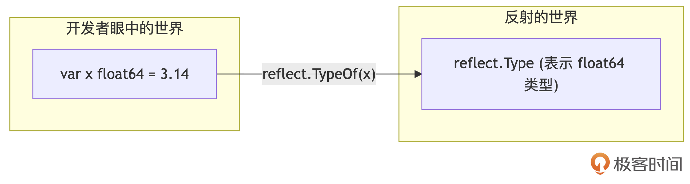
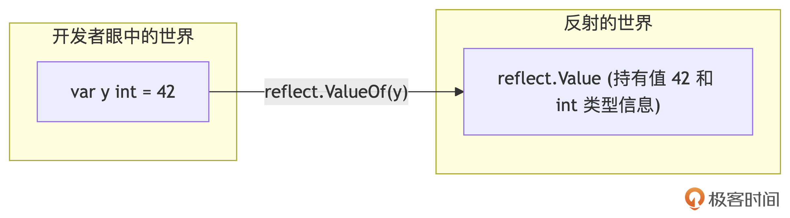

# 深入Go底层：驾驭反射（Reflection）与unsafe的双刃剑
你好！我是Tony Bai。

在Go语言简洁、静态类型和内存安全的“舒适区”之下，隐藏着两把威力巨大但也极其危险的“瑞士军刀”——反射（Reflection）和 `unsafe` 包。它们允许我们在某种程度上 **突破Go的常规限制：反射让我们能在运行时动态地操作类型和值； `unsafe` 则让我们能直接操作内存、绕过类型系统的检查**。

通常情况下，我们编写的Go代码都应该遵循语言提供的类型安全和内存安全保证。但总有一些特殊场景，比如：

- 需要编写能处理任意类型的通用框架（如JSON序列化、格式化输出、ORM等）。

- 需要与C语言或其他底层系统进行低级别交互。

- 在性能极端敏感的场景下，需要进行手动内存布局优化或避免某些运行时开销。


这时，反射和 `unsafe` 就可能进入我们的视野。然而，它们就像双刃剑：

- 威力：提供了强大的灵活性和底层操作能力，能实现常规Go代码难以完成的功能。

- 风险：使用不当极易导致代码难以理解、性能低下、类型不安全、甚至程序崩溃。


不理解反射和 `unsafe` 的原理、适用场景和风险，就可能在项目中误用或滥用它们，引入难以排查的Bug和性能问题。 **对于进阶开发者而言，掌握这两把“双刃剑”的正确用法和安全边界至关重要。**

这节课，我们将深入Go的底层地带，一起探索：

1. 反射（Reflection）：它是如何在运行时赋予我们动态操作类型和值的能力？核心概念是什么？

2. `unsafe` 包：它提供了哪些“不安全”的操作？我们能用它来做什么，比如探索内存布局？

3. 双刃剑的代价：使用反射和 `unsafe` 分别会带来哪些性能影响和安全风险？

4. 实践红线：明确何时以及如何（在保证安全的前提下）审慎地使用这两种高级特性。


接下来，就让我们一起学习如何驾驭这两把强大的底层工具吧。

## 反射：运行时动态操作类型与值

反射，简单来说就是程序在运行时检查自身结构（特别是类型信息）并进行操作的能力。Go的 `reflect` 包提供了这种能力。想象一下标准库的 `fmt.Println` 或 `encoding/json.Marshal` 函数，它们如何能接受任何类型的参数并正确处理？答案就是反射。反射在Go中主要用于编写需要处理未知类型数据的通用代码。

要理解Go反射，最重要的是掌握 reflect 中的 Type 和 Value 两个核心概念。

### 核心概念： `reflect.Type` 与 `reflect.Value`

Go语言的反射能力主要由标准库 `reflect` 包提供。要进入反射的世界，我们需要了解两个最核心的概念（也是 `reflect` 包中最重要的两个类型）： `reflect.Type` 和 `reflect.Value`。它们就像是我们在运行时观察和操作Go程序内部结构的“透镜”和“机械臂”。

#### 如何进入反射世界？

`reflect` 包提供了两个入口函数，让我们能够从普通的Go值（通常是 `interface{}` 类型，因为任何类型都可以赋值给它）得到对应的反射对象，并进入一个以反射对象为中心进行操作的世界——反射世界。

1. reflect.TypeOf：获取类型信息

在Go语言中，我们可以使用reflect包的TypeOf函数来获取一个值的类型信息。TypeOf函数的签名如下：

```plain
func TypeOf(i any) Type

```

**我们看到这个函数接收任何类型的值 `i`，并返回其动态类型的** `reflect.Type` **表示。** 通过TypeOf进入反射世界的过程如下图所示：



**TypeOf专注于揭示值的类型信息。** 下面是一个通过TypeOf函数获取一个float64类型值的类型信息的示例：

```go
import (
    "fmt"
    "reflect"
)

func main() {
    var x float64 = 3.14
    t := reflect.TypeOf(x) // 获取 x 的类型信息
    fmt.Println("Type:", t)            // 输出: float64
    fmt.Println("Name:", t.Name())     // 输出: float64 (类型名称)
    fmt.Println("Kind:", t.Kind())     // 输出: float64 (类型种类)
    fmt.Println("Size:", t.Size())     // 输出: 8 (占用的字节数)
}

```

可以看到，一旦通过TypeOf进入反射世界（拿到reflect.Type信息），我们就能掌握值的类型的很多重要信息，包括名称、种类以及大小等。

2. reflect.ValueOf：获取值信息

在Go语言中，我们可以使用reflect包的ValueOf函数来获取一个值的Value信息。ValueOf函数的签名如下：

```plain
func ValueOf(i any) Value

```

我们看到，ValueOf函数接受一个任意类型的值作为参数，并返回该值的Value信息，即interface{}接口类型变量中存储的动态类型的值的信息，用reflect.Value表示。通过ValueOf进入反射世界的过程如下图所示：



**reflect.Value不仅包含了值本身，还包含了值的类型信息，并提供了操作这个值的方法。** 下面是一个通过ValueOf函数获取一个int值的反射值信息示例：

```plain
import (
    "fmt"
    "reflect"
)

func main() {
    var y int = 42
    v := reflect.ValueOf(y) // 获取 y 的值信息
    fmt.Println("Value:", v)           // 输出: 42
    fmt.Println("Type:", v.Type())     // 输出: int (Value 对象包含 Type 信息)
    fmt.Println("Kind:", v.Kind())     // 输出: int
    fmt.Println("Value as int:", v.Int()) // 输出: 42 (获取具体 int 值)
}

```

`TypeOf` 和 `ValueOf` 是我们从常规Go代码通往反射世界的两扇大门。一旦进入，我们主要就与 `reflect.Type` 和 `reflect.Value` 这两种反射对象打交道了。

#### `reflect.Type`：探索类型的静态信息

`reflect.Type` 对象就像一面镜子，可以照出任意Go值背后的类型信息。通过 `reflect.TypeOf(x)` 得到它之后，我们可以问它很多关于这个类型本身的问题。

最常用的就是询问它的种类（Kind）和名称（Name）：

```go
package main

import (
    "fmt"
    "reflect"
)

type MyInt int
type Person struct { Name string; Age int }

func main() {
    var i int = 10
    var mi MyInt = 20
    var p Person
    var s []string
    var m map[string]bool

    ti := reflect.TypeOf(i)
    tmi := reflect.TypeOf(mi)
    tp := reflect.TypeOf(p)
    ts := reflect.TypeOf(s)
    tm := reflect.TypeOf(m)

    fmt.Printf("Type: %s, Kind: %s\n", ti.Name(), ti.Kind())   // 输出: Type: int, Kind: int
    fmt.Printf("Type: %s, Kind: %s\n", tmi.Name(), tmi.Kind()) // 输出: Type: MyInt, Kind: int (Kind 是底层种类)
    fmt.Printf("Type: %s, Kind: %s\n", tp.Name(), tp.Kind())   // 输出: Type: Person, Kind: struct
    fmt.Printf("Type: %s, Kind: %s\n", ts.Name(), ts.Kind())   // 输出: Type: , Kind: slice (未命名类型 Name 为空)
    fmt.Printf("Type: %s, Kind: %s\n", tm.Name(), tm.Kind())   // 输出: Type: , Kind: map
}

```

`Kind()` 返回的是类型的基础分类（如 int、struct、slice、map、ptr、func、interface等），这对于编写通用的反射代码非常重要，因为很多操作依赖于 `Kind`。而 `Name()` 返回的是类型的显式名称（如果它是已命名的类型）。

对于复合类型，我们可以进一步探索其内部结构：

```plain
// 对于 Struct
fmt.Println("Person NumField:", tp.NumField()) // 输出: 2
nameField, _ := tp.FieldByName("Name")
fmt.Printf("  Field Name: %s, Type: %s, Tag: '%s'\n", nameField.Name, nameField.Type, nameField.Tag)
// 输出: Field Name: Name, Type: string, Tag: '' (这里没加 tag)

// 对于 Slice, Array, Map, Chan, Ptr
fmt.Println("Slice Element Type:", ts.Elem()) // 输出: string
fmt.Println("Map Key Type:", tm.Key(), ", Map Value Type:", tm.Elem()) // 输出: string bool

// 对于 Func
fnType := reflect.TypeOf(func(a int, b string) bool { return false })
fmt.Println("Func Kind:", fnType.Kind())      // 输出: func
fmt.Println("Func NumIn:", fnType.NumIn())    // 输出: 2
fmt.Println("Func In(0):", fnType.In(0))      // 输出: int
fmt.Println("Func NumOut:", fnType.NumOut())  // 输出: 1
fmt.Println("Func Out(0):", fnType.Out(0))    // 输出: bool

```

`Type` 还提供了判断类型能力的方法，比如 `Comparable()`（是否可比较）、 `Implements()`（是否实现某接口）、 `AssignableTo()`（是否可赋值给某类型）等，这些在需要进行类型兼容性判断时很有用。

总的来说， `reflect.Type` 让我们能够在运行时静态地检视类型的定义和结构，它不关心具体的值是什么。

#### `reflect.Value`：持有值并与之交互

与 `Type` 不同， `reflect.Value` **代表的是一个具体的运行时值**。它像一个万能容器，可以装下任何类型的值，并且提供了一套API来与这个值进行交互。

当然， `Value` 对象同样可以告诉我们它持有值的类型信息：

```go
var pi float64 = 3.14159
vpi := reflect.ValueOf(pi)
fmt.Println("Value holds type:", vpi.Type()) // 输出: float64
fmt.Println("Value holds kind:", vpi.Kind()) // 输出: float64

```

更重要的是， `Value` **允许我们获取和设置（如果允许的话）它所持有的值**。下面是获取值的示例：

```go
// 获取值
fmt.Println("Value as float:", vpi.Float()) // 输出: 3.14159
// 还有 Int(), Uint(), String(), Bool(), Bytes(), Complex() 等对应 Kind 的方法

// 将 Value 转换回 interface{}
genericValue := vpi.Interface()
originalValue := genericValue.(float64) // 通过类型断言获取原始值
fmt.Println("Original value:", originalValue)

```

而通过 `Value` 对象来修改值，需要该值具有“可设置性（Settability）”。这是反射中最容易出错的地方之一。你不能直接修改通过 `reflect.ValueOf(x)` 得到的 `Value`，因为它持有的是 `x` 的一个副本。要想通过反射修改原始变量 `x`，必须：

1. 获取 `x` 的指针的 `reflect.Value`。

2. 调用 `.Elem()` 方法获取指针指向的那个值的 `reflect.Value`。

3. 这个通过 `.Elem()` 得到的 `Value` 才是可设置（Settable）的。


我们看下面的示例：

```go
var count int = 10
vCount := reflect.ValueOf(count)
// vCount.SetInt(20) // 直接修改副本会 panic! panic: reflect: reflect.Value.SetInt using unaddressable value

vpCount := reflect.ValueOf(&count) // 1. 获取指针的 Value
veCount := vpCount.Elem()          // 2. 获取指针指向的元素的 Value

fmt.Println("Is settable?", veCount.CanSet()) // 输出: true

veCount.SetInt(20) // 3. 修改成功
fmt.Println("New count:", count)       // 输出: 20

```

从上述示例可以看出： **判断是否可设置非常重要**，我们可以通过 `CanSet()` 方法检查。而对于结构体字段的设置，还需要该字段是可导出的（首字母大写）。下面我们再通过一个示例看一下通过Value操作结构体、数组、切片、map等复合类型内部值的方法：

```go
type User struct {
    ID       int
    Name     string
    Email    string
    IsActive bool
    Tags     []string
    Props    map[string]string
}

func main() {
    user := User{
        ID:       1,
        Name:     "Test",
        Email:    "test@example.com",
        IsActive: true,
        Tags:     make([]string, 10),
        Props:    make(map[string]string),
    }
    vUser := reflect.ValueOf(&user).Elem() // 获取可设置的 User Value

    // 访问和修改结构体字段
    nameField := vUser.FieldByName("Name")
    if nameField.IsValid() && nameField.CanSet() {
        nameField.SetString("Updated Name")
    }
    fmt.Println("Updated User Name:", user.Name) // 输出: Updated Name

    // 操作切片
    tagsField := vUser.FieldByName("Tags")
    tagsField.SetLen(3)                // 设置长度
    tagsField.Index(0).SetString("go") // 设置元素
    fmt.Println("Tag 0:", tagsField.Index(0).String())

    // 操作 Map
    propsField := vUser.FieldByName("Props")
    propsField.SetMapIndex(reflect.ValueOf("city"), reflect.ValueOf("London")) // 添加键值对
    cityVal := propsField.MapIndex(reflect.ValueOf("city"))
    if cityVal.IsValid() {
        fmt.Println("City:", cityVal.String())
    }
    fmt.Println(user) // {1 Updated Name test@example.com true [go  ] map[city:London]}
}

```

反射还可以动态地调用一个值的方法：

```go
type Greeter struct{ Greeting string }

func (g Greeter) Greet(name string) string {
    return g.Greeting + ", " + name + "!"
}

func main() {
    g := Greeter{Greeting: "Hello"}
    vg := reflect.ValueOf(g)
    method := vg.MethodByName("Greet") // 获取 Greet 方法的 Value

    if method.IsValid() {
        args := []reflect.Value{reflect.ValueOf("World")} // 准备参数
        results := method.Call(args)                      // 调用方法
        if len(results) > 0 {
            fmt.Println("Method result:", results[0].String()) // 输出: Hello, World!
        }
    }
}

```

我们看到，在反射世界里通过Value对象动态调用值的方法，方法的参数也需要使用“反射世界”的Value类型值（如上例中的args）。

`reflect.Value` 是反射机制中进行动态操作的核心。它像一个功能强大的通用“操作杆”，可以让你在运行时与几乎任何Go值进行交互，但前提是你必须小心翼翼地检查类型、种类和可设置性，以避免运行时错误。

### 反射三大定律

掌握了 `reflect.Type` 和 `reflect.Value` 这两个核心工具后，我们还需要理解它们之间相互作用的基本规则。Go语言官方博客上有一篇由 Rob Pike 撰写的著名文章，提出了“ [反射三大定律](https://go.dev/blog/laws-of-reflection)”，这三条定律清晰地阐述了Go反射机制的边界和核心交互方式，是安全、正确使用反射的基石。让我们来逐一理解它们。

这三条定律描述了普通类型值、 `reflect.Type`、 `reflect.Value` 以及 `interface{}` 之间的相互转换关系以及要遵循的原则。

#### 定律一：反射可以将“接口类型变量”转换为“反射对象”（ `Type` 或 `Value`）

任何一个Go值，都可以被赋给一个空接口 `interface{}`（或 `any`）类型的变量。上面已经详细介绍了 `reflect` 包提供的 `TypeOf` 和 `ValueOf` 函数，可以从这个接口值中提取出其底层包含的动态类型信息（ `reflect.Type`）和动态值信息（ `reflect.Value`），相信你已经理解了，我就不再举例赘述。

这条定律让我们能够探知任意变量在运行时的实际类型和值，并且规定了我们进入反射世界的入口。

#### 定律二：反射可以将“反射对象”转换回“接口类型变量”

这是我们从反射世界“出来”的通道。当你拥有一个 `reflect.Value` 对象时，可以调用它的 `Interface()` 方法，将其转换回一个 `interface{}` 类型的值。这个接口值会持有反射对象所代表的那个原始的动态类型和动态值。

```go
func main() {
    vInt := reflect.ValueOf(123)   // 得到 int 值的 Value
    iFace := vInt.Interface()      // 将 Value 转回 interface{}

    // 现在 iFace 持有的是 int 类型的 123
    fmt.Printf("Interface value: %v, type: %T\n", iFace, iFace) // 输出: Interface value: 123, type: int

    // 可以通过类型断言获取原始值
    originalInt := iFace.(int)
    fmt.Println("Original int:", originalInt) // 输出: 123
}

```

这条定律允许我们将通过反射获得或操作的值，传递给需要 `interface{}` 参数的函数，或者通过类型断言恢复其原始类型。

#### 定律三：要修改反射对象（ `reflect.Value`），其值必须是“可设置的”

这是使用反射进行修改操作时最重要的规则，也是最容易出错的地方。并非所有的 `reflect.Value` 都允许你修改它所持有的值。一个 `reflect.Value` 是可设置的，必须满足两个条件：

1. **可寻址（Addressable）**：这个 `Value` 必须代表一个内存中可以获取地址的值。通常，通过获取一个变量的指针，再调用 `.Elem()` 得到的 `Value` 才是可寻址的。直接对一个普通变量（非指针）调用 `reflect.ValueOf()` 得到的是该变量值的副本，这个副本是不可寻址的。

2. **非只读（Not Read-only）**：如果是结构体字段，该字段必须是可导出的（Exported，即首字母大写）。


前面介绍过，可以通过 `reflect.Value` 的 `CanSet()` 方法来检查一个值是否可设置，这里通过下面示例再强调一下这一点：

```go
func main() {
    var x float64 = 1.0
    v := reflect.ValueOf(x)        // v 持有 x 的副本，不可设置
    fmt.Println("v CanSet:", v.CanSet()) // 输出: false
    // v.SetFloat(2.0) // 直接修改会 panic: reflect: reflect.Value.SetFloat using unaddressable value

    p := reflect.ValueOf(&x)       // p 持有 x 的地址 (*float64)
    fmt.Println("p CanSet:", p.CanSet()) // 输出: false (指针本身不可被设置成指向别处，除非p本身是通过指针获得的)

    e := p.Elem()                  // e 是 p 指向的值 (x)，它是可寻址的
    fmt.Println("e CanSet:", e.CanSet()) // 输出: true

    e.SetFloat(2.5)               // 修改成功
    fmt.Println("x is now:", x)     // 输出: 2.5

    // 结构体字段示例
    type MyData struct { Public int; private int }
    data := MyData{}
    vData := reflect.ValueOf(&data).Elem()

    fmt.Println("Public CanSet:", vData.FieldByName("Public").CanSet())   // 输出: true
    // fmt.Println("private CanSet:", vData.FieldByName("private").CanSet()) // 输出: false (不可导出)

    vData.FieldByName("Public").SetInt(100)
    // vData.FieldByName("private").SetInt(200) // 会 panic
    fmt.Println("data is now:", data) // 输出: {100 0}
}

```

定律三强调了反射操作的边界： **你可以检视几乎任何东西，但只能修改那些被允许修改的东西**（可寻址且非只读）。理解并遵守这三大定律，是安全、有效地使用Go反射的前提。

### 反射的应用场景举例

虽然我们强调要谨慎使用反射，但它在某些场景下确实是不可或缺的利器。以下是一些典型的应用场景，我们来看一下。

#### 序列化和反序列化（Serialization/Deserialization）

这是反射最广泛的应用之一。我们需要编写通用的代码，将任意结构体转换为某种格式（如JSON、XML、Gob）或从这些格式恢复成结构体，而无需为每种结构体编写特定的转换逻辑。

以下是简化版 JSON Marshal（仅处理简单结构体和基本类型）示例：

```go
import (
    "encoding/json" // 标准库 json 就大量使用了反射
    "fmt"
    "reflect"
    "strings"
)

type Product struct {
    Name      string  `json:"product_name"` // 使用 tag 指定 JSON 字段名
    Price     float64 `json:"price"`
    Available bool    `json:"-"`            // tag 为 "-" 表示忽略此字段
    secret    string  // 非导出字段，json 包默认会忽略
}

func simpleMarshal(v interface{}) (string, error) {
    val := reflect.ValueOf(v)
    // 如果是指针，获取其指向的元素
    if val.Kind() == reflect.Ptr {
        val = val.Elem()
    }
    // 必须是结构体
    if val.Kind() != reflect.Struct {
        return "", fmt.Errorf("only structs are supported")
    }

    typ := val.Type()
    var parts []string

    for i := 0; i < val.NumField(); i++ {
        fieldVal := val.Field(i)
        fieldTyp := typ.Field(i)

        // 检查字段是否可导出
        if !fieldVal.CanInterface() { // 另一种检查可导出的方式
            continue
        }

        // 读取 json tag
        jsonTag := fieldTyp.Tag.Get("json")
        if jsonTag == "-" { // 忽略 tag 为 "-" 的字段
            continue
        }
        fieldName := jsonTag
        if fieldName == "" { // 如果没有 tag，使用字段名
            fieldName = fieldTyp.Name
        }

        // 将字段值序列化为 JSON 字符串 (这里简化，只处理 string 和 float64)
        var fieldStr string
        switch fieldVal.Kind() {
        case reflect.String:
            fieldStr = fmt.Sprintf(`"%s": "%s"`, fieldName, fieldVal.String())
        case reflect.Float64:
            fieldStr = fmt.Sprintf(`"%s": %f`, fieldName, fieldVal.Float())
        // ... 可以添加更多类型处理
        default:
            // 忽略不支持的类型
            continue
        }
        parts = append(parts, fieldStr)
    }

    return "{" + strings.Join(parts, ", ") + "}", nil
}

func main() {
    p := Product{Name: "Go Book", Price: 29.99, Available: true, secret: "hidden"}
    jsonStr, err := simpleMarshal(&p) // 传入指针通常更好
    if err != nil {
        fmt.Println("Error:", err)
    } else {
        fmt.Println("Simple Marshal:", jsonStr)
        // 输出: Simple Marshal: {"product_name": "Go Book", "price": 29.990000}
        // 注意 Available 和 secret 被忽略了
    }

    // 对比标准库
    stdJson, _ := json.Marshal(&p)
    fmt.Println("Standard Marshal:", string(stdJson))
    // 输出: Standard Marshal: {"product_name":"Go Book","price":29.99}
}

```

这个例子展示了如何使用反射遍历结构体字段、读取字段 `tag`、获取字段类型和值，并根据这些信息动态构建JSON字符串。标准库的实现远比这复杂，但核心原理是相似的。

#### 格式化输出

标准库 `fmt` 包（如 `fmt.Println`、 `fmt.Printf`）能打印任意类型的值，也是基于反射实现的。它使用反射来探知传入参数的类型和内部结构，然后选择合适的格式进行输出。下面是一个使用反射进行简单地自定义格式化输出的示例：

```go
import (
    "fmt"
    "reflect"
)

type Coordinates struct{ Lat, Lon float64 }

func main() {
    c := Coordinates{Lat: 34.05, Lon: -118.24}
    i := 123
    s := "hello"

    fmt.Println("--- Using fmt (relies on reflection) ---")
    fmt.Printf("Default (%%v): %v, %v, %v\n", c, i, s)
    // 输出: Default (%v): {34.05 -118.24}, 123, hello
    fmt.Printf("With Fields (%%+v): %+v\n", c)
    // 输出: With Fields (%+v): {Lat:34.05 Lon:-118.24}
    fmt.Printf("Go Syntax (%%#v): %#v, %#v, %#v\n", c, i, s)
    // 输出: Go Syntax (%#v): main.Coordinates{Lat:34.05, Lon:-118.24}, 123, "hello"

    fmt.Println("\n--- Manual reflection for similar info ---")
    printReflectInfo(c)
    printReflectInfo(i)
    printReflectInfo(s)
}

func printReflectInfo(x interface{}) {
    v := reflect.ValueOf(x)
    t := v.Type()
    fmt.Printf("Value: %v, Type: %s, Kind: %s\n", v.Interface(), t.Name(), t.Kind())
    if t.Kind() == reflect.Struct {
        fmt.Printf("  Fields (%d):\n", t.NumField())
        for i := 0; i < t.NumField(); i++ {
            fieldT := t.Field(i)
            fieldV := v.Field(i)
            fmt.Printf("    - %s (%s): %v\n", fieldT.Name, fieldT.Type, fieldV.Interface())
        }
    }
}

```

这个例子对比了 `fmt` 的输出和我们手动用反射获取类似信息的过程，也可以帮助我们理解 `fmt` 内部的工作方式。

#### 对象关系映射（ORM）

ORM框架需要将程序中的结构体映射到数据库表，并将结构体字段映射到表列。它使用反射来：

- 获取结构体名称（推断表名）。

- 遍历结构体字段，获取字段名、类型和 `db` 等 tag（推断列名、类型、约束）。

- 动态地读取结构体字段的值，用于生成 `INSERT` 或 `UPDATE` 语句的参数。

- 动态地将数据库查询结果（行数据）设置回结构体实例的字段中。


下面是一个基于反射实现的简化版 `INSERT` 语句生成的示例：

```go
import (
    "fmt"
    "reflect"
    "strings"
)

type Order struct {
    OrderID   int     `db:"order_id,pk"` // pk 表示主键 (假设)
    Customer  string  `db:"customer_name"`
    Total     float64 `db:"total_amount"`
    Status    string  // 没有 db tag，可能会被忽略或按字段名映射
    createdAt time.Time `db:"-"` // 忽略此字段
}

func generateInsertSQL(obj interface{}) (string, []interface{}, error) {
    val := reflect.ValueOf(obj)
    if val.Kind() == reflect.Ptr { val = val.Elem() }
    if val.Kind() != reflect.Struct { return "", nil, fmt.Errorf("expected a struct or pointer to struct") }

    typ := val.Type()
    tableName := strings.ToLower(typ.Name()) // 简单推断表名
    var fields []string
    var placeholders []string
    var values []interface{}

    for i := 0; i < val.NumField(); i++ {
        fieldTyp := typ.Field(i)
        fieldVal := val.Field(i)

        if !fieldVal.CanInterface() { continue } // 跳过非导出字段

        dbTag := fieldTyp.Tag.Get("db")
        if dbTag == "-" { continue } // 跳过忽略的字段

        parts := strings.Split(dbTag, ",")
        colName := parts[0]
        if colName == "" { colName = strings.ToLower(fieldTyp.Name) } // 默认用字段名

        // 简单处理，假设非主键都需要插入
        isPK := false
        for _, part := range parts[1:] {
            if part == "pk" { isPK = true; break }
        }
        if !isPK { // 假设主键通常是自增或其他方式生成，不在 INSERT 中提供
            fields = append(fields, colName)
            placeholders = append(placeholders, "?") // 使用 ? 作为占位符
            values = append(values, fieldVal.Interface())
        }
    }

    if len(fields) == 0 { return "", nil, fmt.Errorf("no fields to insert for table %s", tableName) }

    query := fmt.Sprintf("INSERT INTO %s (%s) VALUES (%s)",
        tableName,
        strings.Join(fields, ", "),
        strings.Join(placeholders, ", "),
    )

    return query, values, nil
}

func main() {
    order := Order{OrderID: 101, Customer: "ACME Corp", Total: 199.99, Status: "Pending"}
    sql, args, err := generateInsertSQL(&order)
    if err != nil {
        fmt.Println("Error:", err)
    } else {
        fmt.Println("Generated SQL:", sql)
        fmt.Println("Arguments:", args)
        // 输出:
        // Generated SQL: INSERT INTO order (customer_name, total_amount, status) VALUES (?, ?, ?)
        // Arguments: [ACME Corp 199.99 Pending]
    }
}

```

这个例子展示了ORM框架如何利用反射来检查结构体、读取tag，并动态生成SQL语句和参数列表。

以上这些场景充分体现了反射的强大之处，它使得编写能够适应不同数据类型和结构的通用代码成为可能。但同时，这种能力是以牺牲部分编译期安全性和性能为代价的，这个我们后面会有讲到。

反射允许我们在运行时与Go的类型系统进行交互，但在某些更极端的情况下，开发者可能需要完全绕过类型系统和内存安全保证，直接触及内存的底层。这时，我们就需要了解Go语言提供的另一把更锋利、也更危险的“双刃剑”—— `unsafe` 包。

## unsafe包：探索内存布局，打破类型系统约束的场景

`unsafe` 包是Go标准库中一个非常特殊的存在。正如其名， **它提供的功能是不安全的，它允许我们执行一些打破Go语言常规类型检查和内存安全保障的操作**。Go官方文档明确指出：“导入 `unsafe` 的包可能在可移植性上无法保证”。

为什么Go会提供这样一个“危险”的包呢？主要是为了满足一些非常底层的需求，这些需求通常由Go运行时自身、需要与C语言交互的代码（cgo），或者需要进行极致性能优化的库来承担。普通应用程序开发者极少需要直接使用 `unsafe` 包。

`unsafe` 包的核心在于提供了与内存地址和指针进行底层交互的能力，其中最关键的是 `unsafe.Pointer` 这个类型，它是unsafe包“危险”的主要来源！

### `unsafe.Pointer`：通用指针，类型转换的桥梁

`unsafe.Pointer` 是一种特殊的指针类型，它可以指向任意类型的数据，类似于C语言中的 `void*`。它的存在主要是为了在 **不同类型的指针之间进行转换**，这是它最核心也最常用的功能，同时也是最“危险”的功能。

当然 `unsafe.Pointer` 本身也有着严格的使用限制，比如你不能对 `unsafe.Pointer` 进行算术运算（比如 `p + 1`），也不能直接引用 `unsafe.Pointer` 来获取它指向的数据。它遵循以下四条转换规则：

1. 任何类型的指针 `*T` 都可以转换为 `unsafe.Pointer`。

2. `unsafe.Pointer` 可以转换回任何类型的指针 `*T2`。

3. `uintptr` 类型的值可以转换为 `unsafe.Pointer`。

4. `unsafe.Pointer` 可以转换为 `uintptr` 类型的值。


我们在 [第一节课类型系统](https://time.geekbang.org/column/article/876525?utm_campaign=geektime_search&utm_content=geektime_search&utm_medium=geektime_search&utm_source=geektime_search&utm_term=geektime_search) 中曾提到过uintptr，它是一个无符号整数类型，其大小足以容纳一个内存地址（在32位系统上是4字节，64位系统上是8字节）。 **它的唯一目的是用于指针的算术运算。**

由于 `unsafe.Pointer` 不能直接进行加减运算，所以当我们需要根据内存偏移量访问数据时（比如访问结构体字段或数组元素），需要经历以下步骤：

```plain
*T1 -> unsafe.Pointer -> uintptr -> (进行加减运算得到新的地址整数) -> unsafe.Pointer -> *T2

```

下面就是一个结合 `unsafe.Pointer` 和 `uintptr` 访问结构体字段的示例。假设我们有一个结构体，并想通过计算偏移量来访问其字段（ **注意：这是非常不推荐的实践，仅作原理演示**）：

```go
package main

import (
    "fmt"
    "unsafe"
)

type Data struct {
    Flag    bool    // 1 byte + 7 padding (on 64-bit)
    Value   float64 // 8 bytes
    Counter int32   // 4 bytes + 4 padding
    Label   string  // 16 bytes (pointer + length)
}

func main() {
    d := Data{Flag: true, Value: 3.14, Counter: 10, Label: "example"}

    // 1. 获取结构体实例的指针
    ptrD := unsafe.Pointer(&d)

    // 2. 计算 Value 字段的地址
    //    将 ptrD 转为 uintptr 进行运算
    //    加上 Flag 字段的偏移量 Offsetof(d.Flag) (通常是0)
    //    再加上 Value 字段相对于 Flag 字段的偏移 （需要考虑对齐）
    //    更可靠的方式是直接用 Offsetof(d.Value)
    ptrValue := unsafe.Pointer(uintptr(ptrD) + unsafe.Offsetof(d.Value))

    // 3. 将计算得到的通用指针转换为具体类型指针 *float64
    valueField := (*float64)(ptrValue)

    // 4. 访问或修改值
    fmt.Println("Value field via unsafe:", *valueField) // 输出 3.14
    *valueField = 2.71
    fmt.Println("Value field after modification:", d.Value) // 输出 2.71

    // 同样可以访问 Counter 字段
    ptrCounter := unsafe.Pointer(uintptr(ptrD) + unsafe.Offsetof(d.Counter))
    counterField := (*int32)(ptrCounter)
    fmt.Println("Counter field via unsafe:", *counterField) // 输出10
}

```

这个例子展示了如何组合使用 `unsafe.Pointer`, `uintptr` 和 `Offsetof` 来访问结构体内部字段。再次强调，直接依赖 `Offsetof` 进行字段访问是极其脆弱和危险的，因为字段偏移量可能因编译器优化、Go版本更新、平台差异等因素而改变。

并且，unsafe.Pointer与uintptr联合使用进行指针算术运算，也是最容易导致误用并引发安全问题的场景。因为 `uintptr` 只是一个整数，它持有的是某个时刻内存地址的数值。Go的垃圾回收器不会跟踪 `uintptr` 值， **持有** `uintptr` **并不能保证其指向的内存对象不被GC回收或移动！** 这意味着，将 `unsafe.Pointer` 转换为 `uintptr` 后，不应长期持有这个 `uintptr` 值。它通常只在临时的、一系列转换和运算的中间步骤中使用，并且最终必须转换回 `unsafe.Pointer` 才能安全地访问内存。

为此，Go官方文档（特别是在 `unsafe` 包的注释中）明确指出了使用 `unsafe.Pointer` 的六种被认为是合法的模式。任何超出这些模式的使用都可能导致不可移植或不安全的行为。理解这些模式是安全使用 `unsafe` 的前提。下面我们就来看一下这些安全模式！

### `unsafe` 的安全使用模式

Go官方文档明确规定了 `unsafe.Pointer` 的几种合法使用模式。理解并严格遵守这些模式，是避免未定义行为、保证代码（相对）安全的关键。

**模式1：将 `*T1` 转换为 `unsafe.Pointer`，再转换为** `*T2` **。** 这种模式允许在不同类型的指针间转换，前提是你确信这种转换在内存层面是合理的（比如 `T2` 的大小不超过 `T1`，或者你知道如何正确解释 `T1` 的内存作为 `T2`）。

**正确模式:**

```go
var f float64 = 3.14
// 将 float64 的地址解释为 uint64 的地址 (假设知道底层比特位含义)
bits := *(*uint64)(unsafe.Pointer(&f))
fmt.Printf("Float bits: 0x%x\n", bits)

```

**错误/危险模式:**

```plain
type MyStructSmall struct { a int32 }
type MyStructLarge struct { x, y, z int64 }
var small MyStructSmall
// 将小结构的指针强转为大结构的指针
// largePtr := (*MyStructLarge)(unsafe.Pointer(&small))
// *largePtr = MyStructLarge{1, 2, 3} // 写入会越界，破坏small变量之外的内存！错误！

```

**模式2：将** `unsafe.Pointer` **转换为** `uintptr` **。** 这种模式会返回指向该值的内存地址，并以整数形式表示。uintptr类型的通常用途是打印它。并且，一般来说，将uintptr转换回指针是无效的。即使uintptr保存了某个对象的地址，垃圾回收器也不会在该对象移动时更新该uintptr的值，也不会阻止该对象被回收。

**正确模式:**

```go
var x int
ptrX := unsafe.Pointer(&x)
fmt.Println("Address as uintptr:", uintptr(ptrX)) // 仅做打印值

```

**错误模式:**

```plain
addrInt := uintptr(ptrX) // 错误：保存 uintptr 供后续使用
// ... 中间可能发生 GC，x 可能被移动 ...
// runtime.GC() // 模拟 GC
// ptrX_later := unsafe.Pointer(addrInt) // addrInt 可能已失效！错误！
// *(*int)(ptrX_later) = 10 // 可能访问无效内存

```

**模式3：将** `unsafe.Pointer` **转为** `uintptr` **并进行算术运算，然后立即转回** `unsafe.Pointer`。这是进行指针运算的标准模式。整个转换、运算、再转换的过程必须在一个表达式中完成，且它们之间只能存在算术运算。

**正确模式：**

```plain
type DataPoint struct { timestamp int64; value float64 }
dp := DataPoint{1678886400, 98.6}
ptrDP := unsafe.Pointer(&dp)
offsetValue := unsafe.Offsetof(dp.value)

// 在单一语句中完成计算和转换
ptrValue := unsafe.Pointer(uintptr(ptrDP) + offsetValue)
value := *(*float64)(ptrValue)
fmt.Println("Value via offset:", value) // 输出 98.6

```

**错误模式：**

```plain
// 分解操作，中间保存 uintptr
addrDP_int := uintptr(ptrDP)
addrValue_int := addrDP_int + offsetValue
// ... 中间可能发生 GC ...
// runtime.GC() // 模拟 GC
ptrValue_invalid := unsafe.Pointer(addrValue_int) // addrValue_int 可能失效！错误！
// *(*float64)(ptrValue_invalid) = 100.0 // 危险操作

```

**模式4：将** `unsafe.Pointer` **转换为** `uintptr` **以作为特定函数的参数。** 某些特殊的底层函数（主要是 `syscall` 包中的函数）被设计为接收 `uintptr` 类型的参数来代表内存地址。将 `unsafe.Pointer` 转换为 `uintptr` 以便调用这些特定函数是合法的。但如果必须将指针参数转换为uintptr才能用作参数，则该转换必须出现在调用表达式本身当中。

```go
import (
    "syscall"
    "unsafe"
    // "reflect" // 如果要用 reflect.Value.SetPointer 等
)

var data [10]byte

func main() {
    // 正确模式: unsafe.Pointer转为uintptr出现在syscall.Write的调用表达式本身当中
    // 注意：这里 syscall.Write 的 fd 和 buf 参数类型都是 uintptr
    // 这是一个简化示例，实际系统调用更复杂
    syscall.Write(1 /* stdout fd */, uintptr(unsafe.Pointer(&data[0])), len(data))

    // 错误模式 (同规则2): 将 uintptr 保存起来用于非特定函数调用或没有出现在调用表达式本身当中
    // addrInt := uintptr(ptr)
    // // ... 可能 GC ...
    // someOtherFunc(addrInt) // 除非 someOtherFunc 明确设计处理 uintptr，否则危险
}

```

**模式5：将** `reflect.Value` **的** `Pointer()` **或** `UnsafeAddr()` **方法返回的** `uintptr` **转换为** `unsafe.Pointer` **。** `reflect.Value` 提供了 `Pointer()`（用于指针、unsafe.Pointer、chan、map、func）和 `UnsafeAddr()`（用于获取变量地址，即使它不是指针类型，但必须可寻址）方法，它们都返回 `uintptr` 类型的值。这意味着结果很脆弱，必须在调用后立即转换为Pointer类型。

**正确模式:**

```plain
p := (*int)(unsafe.Pointer(reflect.ValueOf(new(int)).Pointer()))

```

**错误模式:**

```plain
u := reflect.ValueOf(new(int)).Pointer() // uintptr不应该被存储在临时变量里
p := (*int)(unsafe.Pointer(u))

```

**模式6：** `unsafe.Pointer` **与** `reflect.SliceHeader` **或** `reflect.StringHeader` **的** `Data` **字段（** `uintptr` **类型）的相互转换。** 这条规则是实现 `string` 和 `[]byte`（或其他切片类型）之间底层数据访问和零拷贝转换的基础。 `reflect` 包定义的 `SliceHeader` 和 `StringHeader` 结构体，它们的 `Data` 字段被声明为 `uintptr` 类型。这主要是为了防止用户在不导入 `unsafe` 包的情况下，就能轻易地将这个字段转换为任意指针类型。

这个 `Data` 字段（ `uintptr`）应被视为字符串或切片内部指针的另一种表示形式，而不是一个独立的、可以长期持有的整数地址。因此， `SliceHeader` 和 `StringHeader` 结构体只应在它们指向一个实际存在的、有效的字符串或切片值时才有意义。

**正确模式**：

- **获取底层数据指针**：获取一个实际的字符串或切片的 Header 指针，然后将其 `Data` 字段（ `uintptr`）转换为 `unsafe.Pointer`，以访问底层字节数据。

```go
s := "hello"
hdr := (*reflect.StringHeader)(unsafe.Pointer(&s)) // 获取指向实际 s 的 Header 指针
dataPtr := unsafe.Pointer(hdr.Data)                // 将 Data (uintptr) 转为 unsafe.Pointer
// firstByte := *(*byte)(dataPtr)                  // 合法地访问第一个字节

```

- **构建（或修改）Header以创建新的字符串或切片**：用一个有效的 `unsafe.Pointer`（指向你想引用的字节数据）转换为 `uintptr`，并赋给一个指向实际字符串或切片变量的Header的 `Data` 字段。

```go
var s string // 准备一个 string 变量来接收结果
var p unsafe.Pointer = unsafe.Pointer(&someByteArray[0]) // p 指向某字节数据
n := len(someByteArray)

hdr := (*reflect.StringHeader)(unsafe.Pointer(&s)) // 获取 s 的 Header 指针
hdr.Data = uintptr(p)                             // 将 p 的地址赋给 Data
hdr.Len = n                                       // 设置长度
// 现在 s 就引用了 someByteArray 的数据 (零拷贝)

```

**错误模式:**

- **直接声明或分配 Header 结构体**：永远不要声明或分配一个独立的 `SliceHeader` 或 `StringHeader` 结构体变量，然后试图填充它的字段来创建一个字符串或切片。因为这个独立的Header结构体变量本身与任何实际的字符串或切片值没有关联，其 `Data` 字段的 `uintptr` 不会像在实际的字符串/切片内部那样被GC正确跟踪。

```go
// 错误模式: 直接声明 Header 变量
var hdr reflect.StringHeader // 无效：没有指向实际的 string 变量
var p unsafe.Pointer = unsafe.Pointer(&someData[0])
n := len(someData)

hdr.Data = uintptr(p) // 赋值给一个独立的 uintptr 字段
hdr.Len = n
// ... 在这里 p 指向的 someData 可能已经被 GC 回收 ...
// s := *(*string)(unsafe.Pointer(&hdr)) // 极其危险！hdr.Data 此时可能无效！

```

- **将从Header获取的** `Data` **（** `uintptr` **）长期持有**: 与规则 2、3 一样，从 `SliceHeader` 或 `StringHeader` 中取出的 `Data` 字段（ `uintptr`）也不能保证其指向的对象存活。它只应在原字符串/切片仍然有效的情况下，用于临时的转换和访问。

严格遵循这六种模式是底线。任何试图“创造性”地使用 `unsafe` 的行为都极有可能引入难以发现的、与平台或版本相关的严重Bug。

我们已经看到， `unsafe` 包提供了直接操作内存的终极能力，它允许我们打破Go语言精心设计的类型和内存安全壁垒。这种能力在某些底层场景下是必要的，但其代价是巨大的安全风险和可移植性问题。与 `unsafe` 类似，反射虽然不直接操作原始内存地址，但它也在运行时层面绕过了编译期的静态类型检查，同样带来了性能和安全上的权衡。接下来，我们就来系统地审视一下使用反射和 `unsafe` 这两把“双刃剑”所需要付出的具体代价。

## 双刃剑的代价

选择使用反射或 `unsafe`，就如同选择挥舞一把双刃剑，它们在赋予我们强大能力的同时，也必然伴随着需要付出的代价，主要体现在性能和安全两个维度。

**反射（Reflection）的代价，更多地体现在性能损耗和类型安全的延迟上。** 由于反射操作是在运行时进行的，获取类型信息、查找字段或方法、动态调用函数以及进行值的转换和设置，都比直接的静态代码要慢得多，通常有数量级的差距。这意味着在性能敏感的代码路径（如热点循环或高频函数）中滥用反射会显著拖慢程序。同时，反射将本应在编译期完成的类型检查推迟到了运行时，类型错误（如错误的类型断言或不匹配的参数）直到运行时才会以 `panic` 的形式暴露出来，这无疑增加了调试的难度和线上风险。此外，充斥着类型检查、接口转换和动态调用的反射代码，往往也比结构清晰的静态代码更难阅读和维护。

而 `unsafe` 包的代价则更为根本和危险，它直接触及了Go语言赖以生存的内存安全基石。使用 `unsafe`，你将直面悬空指针（ `uintptr` 不保证对象存活）、非法内存访问（指针计算错误导致越界或访问未对齐地址）、数据竞争（ `unsafe` 操作非原子性，并发访问需手动同步）以及破坏类型系统（强制类型转换导致数据解释混乱，修改不可变数据如 `string` 则可能引发灾难）等严重风险。这些问题一旦发生，往往导致程序崩溃或出现极其诡异、难以复现的数据损坏。

更糟糕的是， `unsafe` 代码通常严重依赖特定平台的内存布局、大小和对齐方式，这使得代码可移植性极差，在不同的操作系统、CPU架构或Go版本之间可能完全失效，尤其是那些试图访问私有字段的技巧，更是极其脆弱。最后，由于绕过了编译器的保护， `unsafe` 代码的错误往往难以调试，其晦涩的意图也给代码维护带来了巨大挑战。

简单来说，反射牺牲了相当一部分性能和编译期安全，换来了运行时的动态灵活性；而 `unsafe` 则几乎是彻底放弃了Go的安全保障，以换取最底层的内存操作能力和（理论上可能的）极致性能，但风险极高。

认识到这两把“双刃剑”的沉重代价，我们才能更加清醒地判断，在何种情况下值得去承担这些风险，以及如何在使用时将风险降至最低。这正是我们接下来要讨论的实践红线。

## 实践红线：如何审慎地使用这两种高级特性

掌握了反射和 `unsafe` 的能力与风险后，一个关键问题摆在我们面前：在实际开发中，我们应该在什么情况下考虑使用它们？又该如何确保在使用时能最大限度地发挥其优势，同时将风险控制在最低水平呢？这需要我们划定清晰的“实践红线”。

对于反射（Reflection）而言，它的用武之地在于那些确实需要在运行时处理未知类型的场景。当你需要编写真正通用的代码，比如开发序列化/反序列化框架（像 `encoding/json`）、数据库 ORM、通用的打印或比较工具（如 `fmt` 包、 `reflect.DeepEqual`），或者构建依赖注入容器、插件系统这类需要动态发现和组装组件的系统时，反射往往是不可或缺的。然而，即便在这些场景下，我们也应 **始终将反射视为最后的选择**。如果问题可以通过接口、泛型（Go 1.18+）或其他静态类型机制解决，那么这些静态方案通常更安全、性能更好、代码也更易于理解和维护，应当优先采用。

决定使用反射后，务必遵循几条核心原则。

首先，绝对要避免在性能敏感的热点路径（如核心计算逻辑、高频调用的函数或紧密循环）中使用反射，因为它的性能开销相对较大。

其次，最好能将反射的复杂性封装起来，将其隐藏在特定的库或辅助函数内部，对上层调用者提供类型安全的、清晰的接口。

再者，由于反射操作可能在运行时引发 `panic`（例如类型断言失败、尝试修改不可设置的值），因此必须做好充分的错误处理和有效性检查（利用 `recover` 捕获 `panic`，或在使用 `Value` 的方法前检查 `IsValid`、 `CanSet`、 `CanAddr` 等）。

最后，如果你的公共API接受 `interface{}` 参数并内部使用了反射，清晰的文档至关重要，务必说明其行为、限制以及可能抛出的 `panic`。

相比之下， `unsafe` 包的使用场景要罕见得多，门槛也高得多。它几乎是为 Go 语言的“引擎室”准备的工具。考虑使用 `unsafe` 的情况通常只有以下几种：

- 与非 Go 代码（如 C 语言）进行底层交互（cgo）时，可能需要用 `unsafe.Pointer` 进行类型转换。

- 需要直接与操作系统或硬件打交道，比如操作内存映射文件或访问特定硬件地址时（这通常发生在 `syscall` 或运行时内部）。

- 或者是在实现标准库、运行时级别的底层数据结构（如 `sync.Pool`、 `sync.Map`、 `reflect` 包自身）时，为了性能或特殊需求而使用。

- 最后一种可能的情况是，在进行了严格的性能剖析和基准测试，证明常规Go代码确实无法满足性能要求，且瓶颈明确指向内存布局或某些运行时开销之后，经验极其丰富的开发者 可能会考虑使用 `unsafe` 进行高度针对性、局部化的极致优化（如实现零拷贝转换或手动内存布局）。


如果确实遇到了必须使用 `unsafe` 的极少数情况，那么必须遵循一系列严格的安全红线。使用的范围必须绝对最小化，仅限于别无选择的核心代码点。操作时必须严格遵守官方文档定义的六种合法转换模式，任何“自创”的用法都可能导致灾难。

同时， `unsafe` 代码必须被彻底地封装和隔离在最小的包或函数内部，绝不能让 `unsafe.Pointer` 或 `uintptr` 泄露到公共API中，上层必须通过类型安全的接口来调用。 **详尽的注释和文档必不可少**，需要解释清楚为何使用 `unsafe` 以及代码依赖的所有底层假设（内存布局、对齐、Go 版本等）。

此外，大量的、各种形式的测试（单元、集成、并发、跨平台）是必须的，并且 `unsafe` 代码必须经过团队中最有经验的成员进行严格的代码审查。最后，要时刻准备好，依赖 `unsafe` 的代码是脆弱的，Go版本更新或环境变化都可能导致其失效，需要持续维护甚至重写。

总而言之，反射是“运行时”的工具，而 `unsafe` 则是“绕过运行时”的工具。它们都属于高级特性，绝非日常编码的常规选择。我们应始终优先寻求静态类型、接口、泛型等更安全、更清晰的解决方案。只有在这些方法确实无法满足需求，并且我们完全理解并能够控制其风险与代价时，才应审慎地、有节制地考虑使用反射，并极度谨慎地、在严格约束下考虑使用 `unsafe`。驾驭它们需要深厚的知识和高度的责任感。

## 小结

这节课，我们深入Go语言的底层机制，探讨了反射（ `Reflection`）和 `unsafe` 这两把强大，但必须审慎使用的“双刃剑”。

我们首先学习了反射。它赋予了我们在运行时检视类型（ `reflect.Type`）、获取并操作值（ `reflect.Value`）的动态能力。这种能力是构建通用框架（如序列化、ORM、依赖注入）的基石，使得代码可以处理在编译时未知的类型。然而，我们也清楚地认识到反射的代价：它牺牲了编译期的类型安全，将错误暴露推迟到运行时（可能导致 `panic`），带来了显著的性能开销，并且往往使代码变得更复杂、更难理解和维护。掌握反射的三大定律和核心API是基础，但更重要的是理解其适用边界，并始终优先考虑接口、泛型等静态类型方案，将反射作为最后的选择。

接着，我们探索了更为底层的 `unsafe` 包。它允许我们彻底绕过Go的类型系统和内存安全保障，通过 `unsafe.Pointer`（通用指针桥梁）和 `uintptr`（用于地址计算的整数）直接操作内存。这使得与C代码交互、进行极底层的系统操作或实现运行时内部机制成为可能，甚至在极少数情况下可用于压榨极致性能。但这种能力伴随着极高的风险：内存安全问题（悬空指针、越界访问）、数据竞争、类型系统破坏、极差的可移植性，以及极其困难的调试与维护。我们强调了必须严格遵守官方定义的六种安全使用模式，并将 `unsafe` 的使用严格限制在绝对必要的、最小化的范围内，由经验丰富的开发者在充分测试、封装隔离和详尽文档的前提下极度谨慎地应用。

总结来说，反射和 `unsafe` 都提供了超越Go常规类型和安全边界的能力，但它们付出的代价也十分高昂。 **反射是以性能和部分编译期安全换取运行时的动态性；而** `unsafe` **几乎是以牺牲所有安全保障来换取最底层的控制力和理论上的性能极限。** 两者都绝非日常编码的常规武器。

理解这两种高级特性的能力边界、风险所在，以及安全使用的准则，是Go进阶开发者的重要一课。不仅仅要学习如何使用它们，更重要的是学会判断何时应该使用，以及更常见的——何时应该坚决避免使用，转而寻求Go提供的更安全、更清晰、更易于维护的解决方案。驾驭好这两把“双刃剑”的关键，在于深刻理解其代价，并始终保持敬畏之心。

## 思考题

标准库的 `encoding/json` 包在进行 `Marshal`（编码）和 `Unmarshal`（解码）时大量使用了反射。

请思考：

1. 为什么反射是实现通用 `json.Marshal/Unmarshal` 功能的理想（甚至是必需）选择？

2. 既然反射有性能开销，那么对于性能要求极高的场景，如果需要处理JSON，有没有可以替代反射的方法？（提示：想想代码生成）


欢迎在评论区分享你的看法！我是Tony Bai，我们下节课见。
