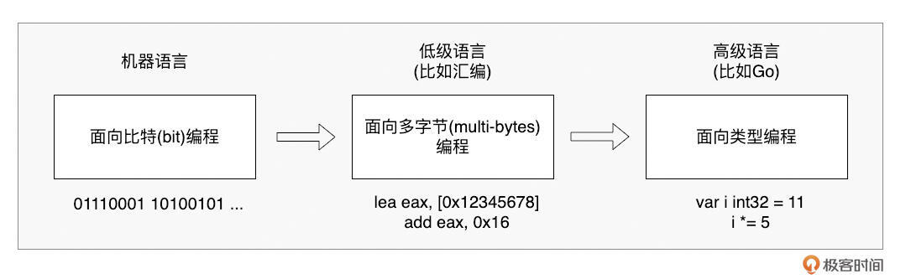
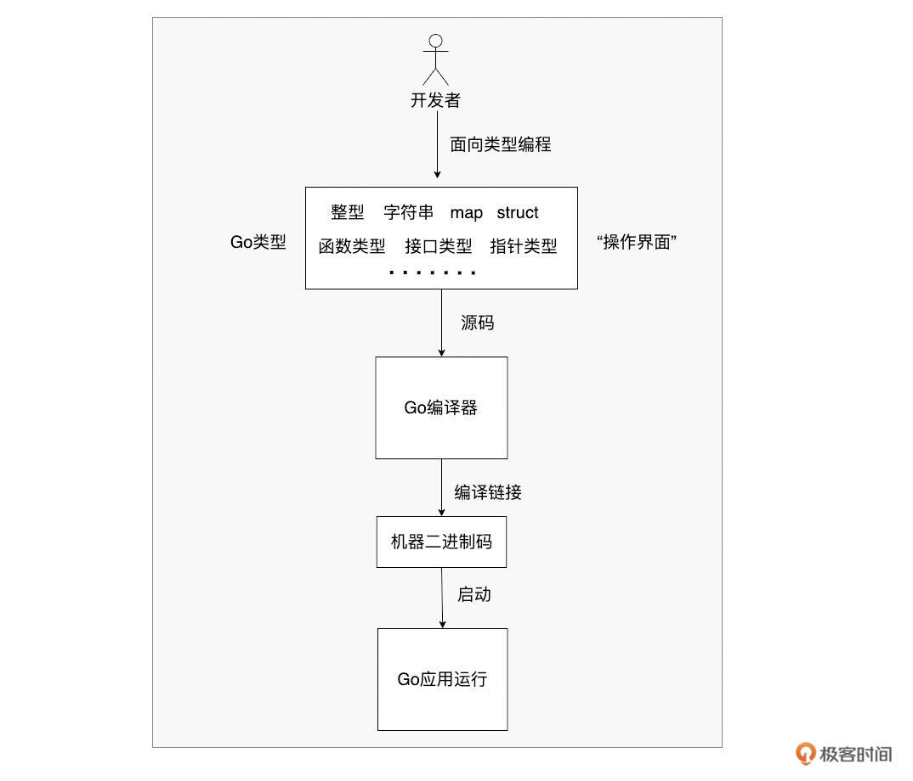
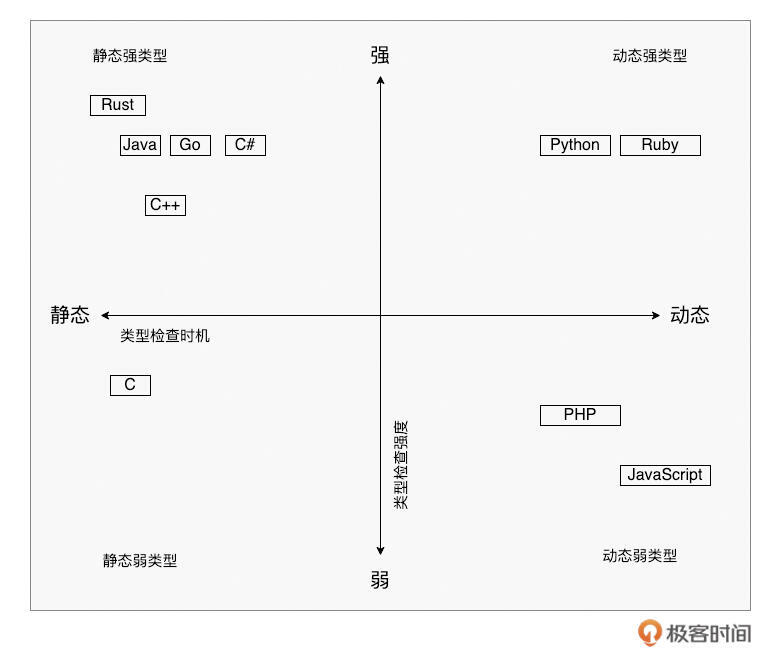
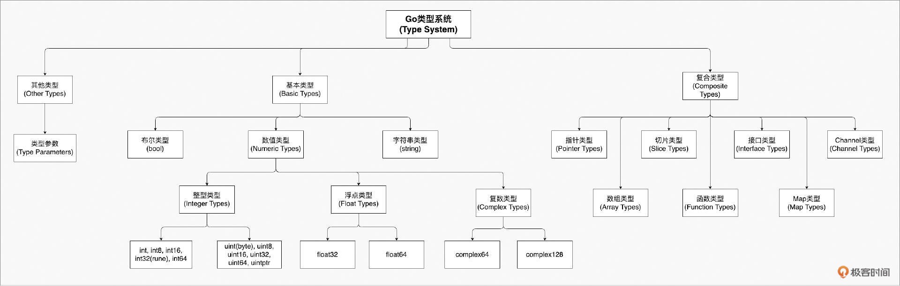

# 类型系统：理解Go语言独特设计哲学的关键钥匙
你好，我是Tony Bai。

欢迎来到“Tony Bai·Go语言进阶课”的第一讲！

这门课不同于入门课程，我会假设你已经具备一定的 Go 语言基础。如果你是 Go 新手，我推荐你先学习我的《 [Go语言第一课](http://gk.link/a/10AVZ)》专栏，那里是扎实基础的好起点。

今天，作为“语法强化篇”这个模块的开篇，我们要深入探讨 Go 语言的一个核心基石： **类型系统**。

提到类型系统，你是不是也和我一样，有种“最熟悉的陌生人”的感觉？

熟悉，是因为我们每天都在和各种类型打交道，比如 int、string、struct、interface{}… 它们是我们构建程序的砖瓦。陌生，则是因为一旦加上 **系统** 二字，它就变得抽象起来。

很多人可能并不清楚，类型系统到底是什么，它在 Go 这门静态强类型语言中扮演着怎样至关重要的角色。

在Go的世界里，几乎每一行代码都离不开 **类型**。它是编译器检查我们代码的依据，是运行时保证程序安全的基础，更是我们理解 Go 诸多特性（比如接口、组合、泛型）的关键。

可以说， **对** **Go** **类型系统认知的高度，直接决定了你** **Go** **编程能力的深度**。不深入理解它，你可能会在类型转换、接口使用、泛型约束等方面遇到各种“坑”。

那么，这节课，我们就来揭开Go类型系统的神秘面纱。我将带你一起探索：

- 编程语言中为什么需要类型这个抽象？

- 类型系统究竟是什么，它有哪些分类？

- Go的类型系统有哪些独特的设计选择？它的规则和机制是怎样的？


准备好了吗？让我们先从最根本的问题开始：为什么要有类型？

## 类型的存在意义：编程语言为何需要它？

作为有经验的 Gopher，你肯定知道 Go 提供了丰富的内置类型（布尔、整型、浮点、复数、字符串、函数等），复合类型（数组、切片、map、struct、channel），代表行为抽象的接口类型，以及指针类型。我们还能通过 **type** 关键字自定义新类型或定义类型别名。

但你有没有想过：为什么编程语言需要类型？它究竟带来了什么好处？

回顾编程语言的发展史，我们会发现一个关键点： **类型是高级语言区别于机器语言和汇编语言的重要抽象**。



在机器眼中，一切数据都是 0 和 1。直接用机器码编程，复杂、低效且极易出错。汇编语言稍好一些，它操作的是固定长度的字节，比如 **movb** 操作 1 字节， **movl** 操作 4 字节，但它依然不关心这些字节代表的真正含义，只是在地址间搬运数据。

高级语言的“高级”之处，很大程度上就体现在类型这个抽象上。

**类型，为开发者屏蔽了底层数据的复杂表示。** 我们不再需要关心某个值在内存中具体是多少位、字节序如何，只需要跟类型打交道。类型告诉我们：

- 这个值能存储什么范围的数据（比如 int8 vs int64）？

- 能对它进行哪些操作（比如字符串拼接 vs 整数加法）？

- 它需要多少存储空间？

- 它如何与其他类型互动（转换、组合、实现接口等）？




可以说， **类型成为了开发者与编译器之间高效沟通的“操作界面”**。我们面向类型编程，遵循类型的规则，而类型之下的复杂比特和字节操作，则由编译器和运行时帮我们处理。

那么，是谁赋予了类型这些能力和规则呢？答案就是—— **类型系统**。

## 类型系统概览：约束与表达力

类型系统，并不是一个看得见摸得着的实体，而是围绕类型建立的一整套规则和机制。它贯穿于语言规范、编译器和运行时，共同定义、管理和约束着类型的使用。

- **语言规范层面**：定义类型的种类、层次、语法语义、使用约束等，给开发者提供明确指引。

- **编译器层面**：执行类型检查，确保类型兼容性、转换有效性等，在编译期捕捉大量潜在错误。

- **运行时层面**：支持多态（根据实际类型动态绑定方法）、动态类型检查（如类型断言）等。


简单来说， **类型系统通过赋能和管理类型，来保证程序的正确性、安全性和可靠性**。

当然，不同语言的类型系统设计差异很大。主要的区别在于检查类型的时机和检查的严格程度。

- **按检查时机分：**
  - 静态类型系统：尽可能在 **编译期间** 进行类型检查。变量类型在编译时确定，能及早发现类型错误。代表：Go、C、C++、Java 以及 Rust 等。

  - 动态类型系统：主要在 **运行时** 进行类型检查。变量类型可变，更灵活，但错误可能到运行时才暴露。代表：Python、JavaScript 以及 Ruby 等。
- **按检查严格程度分：**
  - 强类型系统：类型检查严格，不允许隐式或不合理的类型混合操作和转换。强调类型安全。代表：Go、Java、Rust、C++（相对于其他强类型语言，其类型检查严格程度略弱一些)、Python（注意 Python 是动态强类型）等。

  - 弱类型系统：类型检查相对宽松，允许一定程度的隐式类型转换和混合操作。更便利，但可能隐藏类型风险。代表：C、JavaScript、PHP 等。

下面我们再用一张示意图，直观地展示这些主流编程语言的类型系统在“检查时机”和“检查严格程度”象限图中的位置。



了解了这些分类，我们就清楚了 Go 的定位： **Go** **拥有一个静态强类型系统**。这意味着它倾向于在编译阶段就发现尽可能多的类型错误，并且对类型的匹配和转换要求非常严格。

接下来，让我们聚焦 Go，看看它的类型系统具体有哪些独特的设计和规则。

## Go语言类型系统的独特设计与选择

要理解 Go 的类型系统，关键在于弄懂它围绕类型建立的具体规则。我们从类型定义、类型推断、类型检查和类型连接这几个方面来看。

### 类型定义：内置与自定义

类型是开发者用来抽象现实世界的工具。Go 内置了丰富的类型，我们通过一张示意图来看一下 Go 类型系统中的类型：



从图中我们看到，Go 语言的类型系统主要包含基本类型和复合类型。

其中，内置的基本类型包括布尔类型 bool（表示 true 和 false），以及多种数值类型：整数类型 int8、int16、int32、int64、uint8、uint16、uint32、uint64、int、uint、uintptr，浮点类型 float32、float64，以及复数类型 complex64、complex128。

byte 是 uint8 的别名，rune 是 int32 的别名。此外，还有字符串类型 string，表示不可变的字节序列。

复合类型则包括数组类型、切片类型、结构体类型、指针类型、函数类型、接口类型、Map 类型以及 Channel 类型。

除了这些，我们还可以使用 **type** 关键字来创造自己的类型：

```plain
// 定义一个新类型 T，其底层类型是 U
type T U

```

这里的 **U** 被称为 **T** 的底层类型（underlying type）。这是一个非常重要的概念！ **类型系统会认为自定义类型 T 和它的底层类型 U 是两个完全不同的类型**。这是编译期类型检查的基础规则之一。

```plain
type MyInt int // MyInt 是一个新类型，底层类型是 int
type S struct { // S 是一个新类型
    a int
    b string
}

```

Go 1.9 之后，还引入了 **类型别名（type alias）**：

```plain
// 定义 P 作为 Q 的别名
type P = Q

```

注意，这里并 **没有** 创建新类型。 **P 和** **Q** **在类型系统看来是完全等价并可以互换的**。别名机制的引入主要是为了方便代码重构。

秉承“简单”的设计哲学，Go 类型系统并未内置支持其他语言中常见的几种类型。

第一种是 **联合体类型（union）**。在这种类型中，其所有字段共享同一个内存空间，比如下面 C 语言例子代码中 num 类型：

```plain
union num {
    int m;
    char ch;
    double f;
};
union num a, b, c; // 声明三个union类型变量

```

这段 C 代码定义了一个名为 num 的联合体类型，其三个成员 m、ch 和 f 共享同一个内存空间，C 编译器会以最大的字段的 size 为 num 类型的变量分配内存空间。

另外一种Go语言不支持的是 **枚举类型（enum）**。Go 没有原生的 enum 关键字。但我们可以通过 **常量**（通常配合 iota）和 **自定义类型** 来模拟基础的枚举行为（值仅限布尔、数值或字符串）。

```plain
// C语法枚举
enum Weekday {
        SUNDAY,
        MONDAY,
        TUESDAY,
        WEDNESDAY,
        THURSDAY,
        FRIDAY,
        SATURDAY
};

// Go模拟实现Weekday
type Weekday int

const (
        Sunday Weekday = iota
        Monday
        Tuesday
        Wednesday
        Thursday
        Friday
        Saturday
)

```

对于像 Rust 语言实现的新式枚举类型（见下面例子），Go 类型系统目前是无能为力的。Rust 中的枚举可以包含关联的数据，每个枚举成员可以有不同的数据类型，并且可以使用 match 表达式对枚举进行模式匹配，处理每个可能的枚举成员和关联的数据。

```plain
// Rust的枚举示例

enum Shape {
    Circle(f64),                 // 圆形，关联半径 (f64 类型)
    Rectangle(f64, f64),         // 矩形，关联宽度和高度 (两个 f64 类型)
    Triangle(f64, f64, f64),     // 三角形，关联三条边的长度 (三个 f64 类型)
}

fn main() {
    let circle = Shape::Circle(3.14);
    let rectangle = Shape::Rectangle(2.0, 4.0);
    let triangle = Shape::Triangle(3.0, 4.0, 5.0);

    // 使用 match 表达式匹配枚举成员并访问关联数据
    match circle {
        Shape::Circle(radius) => {
            println!("Circle with radius: {}", radius);
        },
        _ => {}
    }

    match rectangle {
        Shape::Rectangle(width, height) => {
            println!("Rectangle with width: {} and height: {}", width, height);
        },
        _ => {}
    }

    match triangle {
        Shape::Triangle(a, b, c) => {
            println!("Triangle with sides: {}, {}, {}", a, b, c);
        },
        _ => {}
    }
}

```

最后一种 Go 类型系统不支持的类型是 **元组类型（tuple）**。元组类型是一种用于组合多个值的数据结构。它是一个有序的集合，其中的每个元素可以具有不同的类型。元组允许将多个值绑定在一起，形成一个逻辑上相关的单元，可以作为单个实体进行传递、返回或操作。

元组的长度是固定的，一旦定义，就不能添加或删除元素。元素可以通过索引来访问，通常使用点号（.）或类似的语法来访问元组的成员。下面是 Rust 中关于元组使用的一个示例：

```plain
fn get_person_info() -> (String, u32, bool) { // 返回一个元组类型
    let name = String::from("Alice");
    let age = 30;
    let is_employed = true;

    (name, age, is_employed)
}

fn main() {
    let person = get_person_info();

    let name = person.0; // 通过索引来访问元组中的元素
    let age = person.1;
    let is_employed = person.2;

    println!("Name: {}", name);
    println!("Age: {}", age);
    println!("Employed: {}", is_employed);
}

```

虽然没有内置支持元组类型，但在 Go 中我们可以通过以下方式来实现类似元组的功能。

我们可以定义一个结构体，其中的字段对应元组中的各个元素。每个字段可以具有不同的类型。例如：

```plain
type Tuple struct {
    First  int
    Second string
    Third  bool
}

```

使用结构体可以方便地将多个值组合在一起，并通过访问结构体的字段来获取和操作元组的元素。

我们还可以使用数组或切片来模拟元组类型。可以定义一个固定长度的数组，其中的每个元素对应元组中的一个元素，类型为 interface{}。例如：

```plain
tuple := [3]interface{}{42, "Hello", true}

```

这里使用了一个 interface{} 类型的数组，其中的元素可以是任意类型。通过索引来访问数组的元素，就可以获取和操作元组中的元素。

需要注意的是，上面使用结构体、数组/切片方式仅是模拟元组，不同方式模拟得到的“元组”会丧失一些元组类型的特性，例如固定长度、类型安全或索引访问等。

Go 1.18 引入了 **泛型**，通过 **类型参数（type parameter）** 极大地增强了语言的表达力，也给类型系统带来了新的维度。我们可以定义泛型函数、泛型类型以及它们的约束。

```plain
// 定义一个泛型约束 (Go 1.21及以后可用cmp.Ordered的预定义约束)
type Ordered interface {
    ~int | ~int8 | ~int16 | ~int32 | ~int64 |
    ~uint | ~uint8 | ~uint16 | ~uint32 | ~uint64 |
    ~float32 | ~float64 |
    ~string
}

// 泛型函数
func Max[T Ordered](x, y T) T { /* ... */ }

// 泛型类型
type Stack[T any] struct { items []T }

// 泛型类型的方法
func (s *Stack[T]) Push(item T) { /* ... */ }
func (s *Stack[T]) Pop() (T, bool) { /* ... */ }

```

泛型无疑让 Go 更强大，但也增加了类型系统的复杂性。关于泛型的深入探讨，可以回顾 《 [Go语言第一课](http://gk.link/a/10AVZ)》 专栏的泛型篇，或关注本专栏后续可能涉及的泛型实践内容。

### 类型推断：简洁之道

Go 从一开始就支持基本的类型推断（type inference），编译器能自动推导出变量或常量的类型，让我们少写很多代码：

```plain
var s = "hello"   // 编译器推断 s 为 string 类型
a := 128          // 编译器推断 a 为 int 类型
const f = 4.3567  // 编译器推断 f 为 untyped float, 默认 float64

```

泛型引入后，类型推断能力进一步增强，编译器通常能自动推断出调用泛型函数或实例化泛型类型时所需的 **类型实参（type argument）**：

```plain
import "slices"

nums := []int{3, 1, 4}
slices.Sort(nums) // 无需写 slices.Sort[[]int, int](nums)

strs := []string{"b", "a", "c"}
slices.Sort(strs) // 无需写 slices.Sort[[]string, string](strs)

```

无论是普通变量还是泛型参数的类型推断，都起到了 **语法糖** 的作用，减少了代码的冗余，提高了可读性。

### 类型检查：编译与运行时的守护

作为静态语言，Go 要求变量在使用前必须声明类型。编译器和运行时会进行 **类型检查（type checking）**，确保我们对变量的操作是合法的，遵守类型系统的规则，从而保障 **类型安全（type safety）**。

Go 是强类型语言，严格限制 **隐式类型转换（implicit type conversion）**。绝大多数情况下，不同类型之间的转换必须通过 **显式类型转换（explicit type conversion）** 来完成，并且只有在 **底层类型（underlying type）** 兼容时才允许转换：

```plain
type T1 int
type T2 struct{}
type MyInt int // 新类型，底层是 int

var i int = 5
var t1 T1
var s T2
var mi MyInt

// t1 = i     // 错误：类型不匹配 (T1 和 int 是不同类型)
t1 = T1(i) // 正确：显式转换，底层类型 (int) 兼容

// s = T2(t1) // 错误：底层类型不兼容 (struct{} 和 int)

// mi = i     // 错误：类型不匹配 (MyInt 和 int 是不同类型)
mi = MyInt(i) // 正确：显式转换
// i = mi     // 错误：类型不匹配
i = int(mi) // 正确：显式转换

```

**但是，有一个重要的“例外”规则与赋值有关！**

思考一下这个例子：

```plain
type MyInt int
type MyMap map[string]int

var x MyInt
var y int
// x = y // 报错: cannot use y (type int) as type MyInt in assignment
x = MyInt(y) // ok

var m1 MyMap
var m2 map[string]int
m1 = m2 // 不报错!
m2 = m1 // 也不报错!

```

为什么 **MyInt** 和 **int** 之间赋值需要显式转换，而 **MyMap** 和 **map\[string\]int** 之间可以直接赋值？

关键在于具定义类型（defined type）这个概念（在引入类型别名前也叫named type）。

Go语言规范规定：如果变量 `x` 的类型 `V` 与类型 `T` 具有相同的底层类型，并且 `V` 和 `T` 中至少有一个不是 defined type，那么 `x` 就可以直接赋值给类型为 `T` 的变量。

那么，哪些是 **defined type**？Go 语言规范给出的定义如下：

- 所有通过 `type NewType BaseType` 定义的新类型都是 defined type (如 `MyInt` **,** `MyMap`)。

- Go 内置类型中，所有数值类型（int, float64 等）、string 类型、bool 类型都是defined type。


**注意：map、slice、array、channel、func 这些复合类型本身不是** **defined type！**

现在再来看看上面的例子：

- `MyInt` 是 defined type， `int` 也是 defined type。两者底层类型相同，但都不是“非defined type”，所以赋值需要显式转换。

- `MyMap` 是 defined type，但它的底层类型 `map[string]int` **不是** defined type。满足了“至少有一个不是 defined type”的条件，因此它们之间可以直接赋值。


理解 `defined type` 和赋值规则对于深入掌握Go类型系统至关重要。

除了编译期的静态检查，Go 类型系统还提供了运行时的动态类型检查：

- **接口类型检查**：运行时检查存入接口变量的实际值是否真的实现了该接口的所有方法。

- **数组/切片下标检查**：运行时检查访问的索引是否越界，越界则 `panic`。

- **类型断言（type assertion）**：在运行时检查接口变量底层存储的具体类型，并可以获取该类型的值。


```plain
var x interface{} = 42

// 安全的类型断言
if i, ok := x.(int); ok {
    fmt.Printf("x is an int with value %d\n", i)
} else {
    fmt.Println("x is not an int")
}

// 非安全的类型断言 (如果 x 不是 int 会 panic)
// j := x.(int)

```

当然，Go也提供了打破类型系统约束的“后门”—— **unsafe.Pointer** 和 **反射（reflection）**。

`unsafe.Pointer` 允许你在不同类型的指针间进行转换，直接操作内存，完全绕过类型检查。

标准库 `math.Float64frombits` 就是一个例子：

```plain
// $GOROOT/src/math/unsafe.go
func Float64frombits(b uint64) float64 {
    // 将 uint64 的内存解释为 float64
    return *(*float64)(unsafe.Pointer(&b))
}

```

反射允许在运行时检查类型信息、获取和设置值、调用方法等，也能在一定程度上绕过编译期类型检查。

```plain
import "reflect"

type MyStruct struct{ Field int }

func main() {
    s := MyStruct{Field: 10}
    v := reflect.ValueOf(&s).Elem() // 获取可设置的 Value
    f := v.FieldByName("Field")
    if f.CanSet() {
        f.SetInt(20) // 通过反射修改了MyStruct的字段值
    }
    fmt.Println(s) // Output: {20}
}

```

**警告：** **使用 unsafe 和反射是非常危险的**，它们破坏了Go的类型安全保证，可能导致程序崩溃或难以预料的行为。除非你完全清楚自己在做什么，并且没有其他更安全的方法，否则， **强烈建议避免使用**。

### 类型连接：组合优于继承

Go 并非经典的面向对象语言。它没有类（class），没有继承（inheritance）层级，也没有构造函数。

在 Go 的类型系统中，类型之间建立连接的主要方式是 **组合（composition）**，通常通过 **类型嵌入（type embedding）** 实现。我们可以将一个类型（接口或非接口）嵌入到另一个类型（通常是struct）中，从而“借用”或“聚合”其字段和方法。

下面示例中 Server 直接使用了其嵌入的类型 \*Logger 的 Log 方法：

```plain
type Logger struct { Verbose bool }
func (l *Logger) Log(msg string) { fmt.Println(msg) }

type Server struct {
    *Logger // 嵌入 Logger 类型 (指针形式)
    Addr string
}

func main() {
    s := Server{
        Logger: &Logger{Verbose: true},
        Addr:   ":8080",
    }
    s.Log("Server starting...") //可以直接调用嵌入类型的 Log 方法
    fmt.Println(s.Verbose)     // 也可以直接访问嵌入类型的字段
}

```

**Go 的多态性主要通过接口（interface）实现**。接口定义了一组行为（方法签名），任何类型只要实现了接口要求的所有方法，就被视为 **隐式地（implicitly）** 实现了该接口，无需像 Java 或 C# 那样显式声明 `implements`。

```plain
type Speaker interface {
    Speak() string
}

type Cat struct{}
func (c Cat) Speak() string { return "Meow" }

type Human struct{}
func (h Human) Speak() string { return "Hello" }

func MakeSpeak(s Speaker) {
    fmt.Println(s.Speak())
}

func main() {
    var c Speaker = Cat{}    // Cat 实现了 Speaker 接口
    var h Speaker = Human{}  // Human 也实现了

    MakeSpeak(c) // Output: Meow
    MakeSpeak(h) // Output: Hello
}

```

这种隐式实现让 Go 的接口非常灵活和解耦。

此外，Go 中的 **函数是一等公民**，可以赋值给变量、作为参数传递、作为返回值。这使得函数类型本身也展现出一种形式的多态性：一个函数类型的变量可以在运行时指向不同的函数实现，从而表现出不同的行为。

```plain
type FilterFunc func(string) bool

func IsLong(s string) bool { return len(s) > 5 }
func HasPrefixA(s string) bool { return strings.HasPrefix(s, "A") }

func FilterStrings(strs []string, filter FilterFunc) []string {
    var result []string
    for _, s := range strs {
        if filter(s) {
            result = append(result, s)
        }
    }
    return result
}

func main() {
    words := []string{"Apple", "Banana", "Ant", "Orange", "Apricot"}

    longWords := FilterStrings(words, IsLong)
    fmt.Println(longWords) // Output: [Banana Orange Apricot]

    aWords := FilterStrings(words, HasPrefixA)
    fmt.Println(aWords) // Output: [Apple Ant Apricot]
}

```

## 小结

好了，关于 Go 类型系统的第一课就到这里。我们来快速回顾一下核心要点。

1. **类型是关键抽象**：它屏蔽了底层细节，是开发者与编译器沟通的界面，提高了编程效率和代码可读性。

2. **类型系统是规则集**：围绕类型建立，贯穿编译和运行时，保证类型安全。Go 拥有静态、强类型系统，强调编译期检查和严格性。

3. **Go** **类型定义**：内置丰富类型，支持 type 定义新类型（产生不同类型，关注底层类型）和 type alias 定义别名（类型等价）。不支持 union、enum、tuple，但可模拟。Go 1.18 加入 **泛型** 增强了表达力。

4. **Go** **类型推断**：编译器能自动推断变量、常量及泛型参数类型，简化代码。

5. **Go** **类型检查**：编译期严格检查，限制隐式转换，需 **显式转换**。运行时检查接口实现、数组/切片越界、类型断言。理解 defined type 对掌握赋值规则很重要。unsafe 和反射可绕过检查，但需极度谨慎。

6. **Go** **类型连接**：摒弃继承，采用组合（通过类型嵌入）和接口（隐式实现）来构建类型关系和实现多态。函数作为一等公民也提供了一种多态形式。


总的来说，Go 的类型系统设计简洁、一致，以 **可读性** 和 **类型安全** 为优先考量。虽然有时需要开发者编写更明确的代码（如显式转换），但这有助于构建更健壮、更易于维护的系统。

对于想要在Go编程道路上进阶的你来说，花时间深入理解 Go 类型系统的设计哲学和具体规则，是非常有价值的。它将为你后续学习 Go 的并发、接口设计、错误处理、泛型应用等打下坚实的基础。

如果小伙伴对编程语言的类型系统理论感兴趣，这里推荐阅读一下《 [编程与类型系统](https://book.douban.com/subject/35325133/)》这本书。

## 思考题

Go 语言选择了静态强类型系统。相比之下，像 Python 这样的动态类型语言将许多类型检查推迟到运行时。请你思考一下：

- Go 采用静态强类型系统，主要的优点是什么？它给开发者带来了哪些好处？

- 同时，这种选择可能带来哪些挑战或不便之处（相比动态类型语言）？


欢迎在留言区分享你的思考和见解！也欢迎你把这节课分享给更多对 Go 类型系统感兴趣的朋友。我是Tony Bai，我们下节课见！