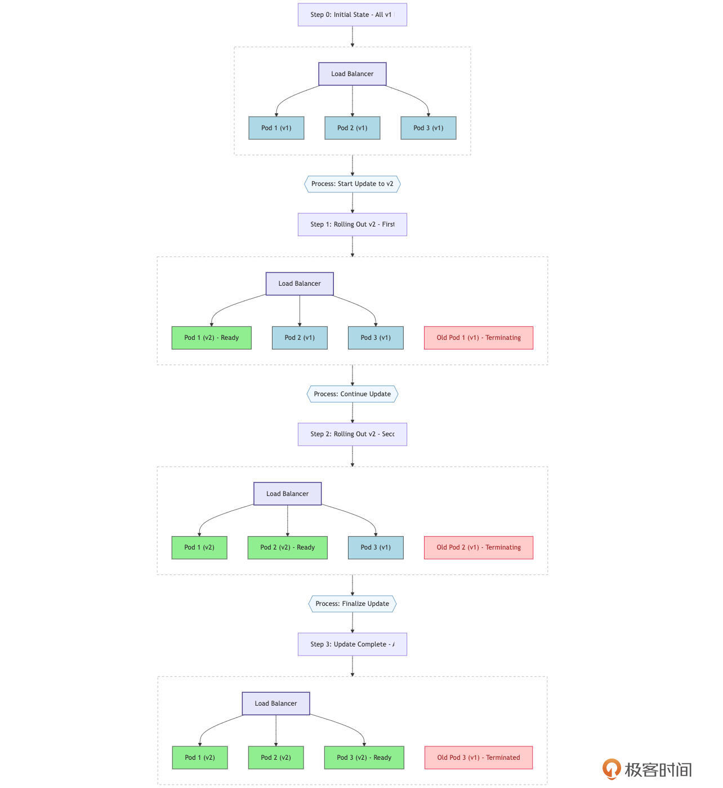
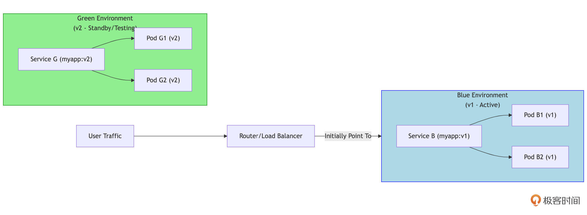
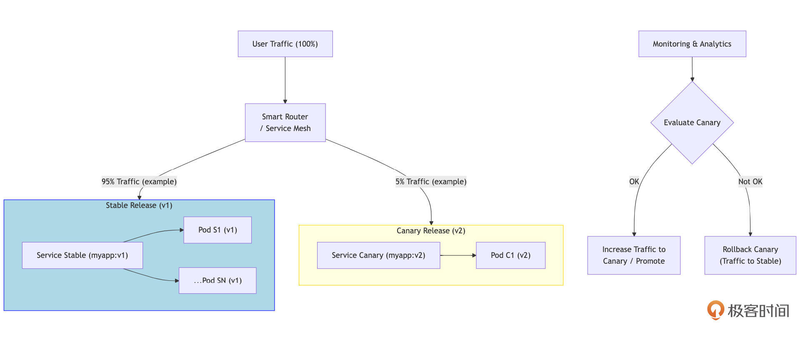

# 部署与升级：拥抱云原生，实现Go应用持续交付（下）
你好，我是Tony Bai。

这节课，我们将一起入门Kubernetes的核心概念，并重点讨论在K8s中部署Go服务的典型模式，包括配置管理、健康检查和资源管理。最后，我们将深入剖析 **主流的平滑发布策略**——滚动更新、蓝绿部署与金丝雀发布，理解它们的原理、优缺点，以及Go应用如何配合这些策略实现无缝升级。

这两节课学完，你将能够为你的Go应用插上云原生的翅膀，使其部署更简单、升级更平滑、运行更稳健。

## Kubernetes部署：Go服务在云原生时代的“标准舞台”

我们的Go应用已经容器化，并且在Docker Compose环境中能够与依赖服务协同工作了。但是，如何在生产环境中大规模地管理、伸缩、容错并自动化这些容器化应用呢？ 答案在当前的云原生时代几乎是唯一的，那就是 Kubernetes（K8s）。Kubernetes已经成为容器编排领域的事实标准，它提供了一个健壮、可扩展、声明式的框架，用于自动化容器化应用的部署、扩展和管理。对于我们精心构建的Go服务来说，Kubernetes正是那个能让它们在生产环境中大放异彩的“标准舞台”。

理解Kubernetes的核心概念，并掌握如何在其中部署和管理我们的Go服务，是Go工程师迈向云原生运维的关键一步。 **更重要的是，Kubernetes提供的环境和能力，也为我们后续要讨论的平滑发布策略（如滚动更新、蓝绿部署、金丝雀发布）奠定了基础。没有Kubernetes这样的编排平台，许多高级的发布和运维技术将难以实现。**

### Kubernetes核心概念入门

要理解Kubernetes，就要从其核心概念开始。下面是Kubernetes这个平台的一些核心概念，我们逐一来看一下。

- **Pod**：K8s中可以创建和管理的 **最小部署单元**。一个Pod代表集群中一个运行的进程。它可以包含一个或多个紧密协作的容器，这些容器共享同一个网络命名空间、存储卷，并且可以在同一节点上被共同调度。

- **Service（服务）**：K8s Service为一组逻辑上相关的Pod提供一个 **稳定的网络入口点**。它会给这组Pod分配一个唯一的、虚拟的IP地址（ClusterIP）和一个DNS名称，集群内的其他应用可以通过这个ClusterIP或DNS名称来访问这些Pod，Service会自动进行负载均衡。

- **Deployment（部署）**：Deployment是K8s中用于 **声明式地管理应用副本和更新** 的一种控制器。你可以在Deployment中定义期望的应用状态，Deployment控制器会持续工作以确保集群的实际状态与期望状态一致。它支持滚动更新和回滚等发布策略。

- **ReplicaSet（副本集）**：ReplicaSet确保在任何给定时间都有指定数量的Pod副本在运行。它通常不直接使用，而是由Deployment在内部创建和管理。

- **Namespace（命名空间）**：Namespace用于在同一个物理集群内创建多个 **虚拟的、逻辑隔离的集群环境**，可以用来隔离不同团队、项目或环境的资源。

- **ConfigMap（配置映射）与 Secret（保密字典）**：
  - ConfigMap：用于存储应用的非敏感配置数据，并将其以环境变量、命令行参数或挂载卷的形式注入到Pod的容器中。

  - Secret：专门用于存储敏感数据，如密码、API密钥、TLS证书等。
- **Ingress（入口）**：（可选）定义了从集群外部访问集群内部Service的规则，通常是HTTP和HTTPS路由，需要Ingress Controller配合。


理解这些核心概念，是我们后续讨论如何在K8s中部署Go服务的基础。它们就像Kubernetes这座复杂城市的“街道”、“建筑”和“基础设施”，为我们的Go应用容器提供了运行的场所和交互的规则。

熟悉了这些基本构件之后，我们自然会问：如何将这些概念组合起来，形成一套行之有效的方案，真正把我们的Go服务部署到Kubernetes集群中，并让它稳定、高效地运行起来呢？这就引出了我们在K8s中部署Go服务的典型模式。

### 在Kubernetes中部署Go服务的典型模式

在Kubernetes中部署一个Go服务（或其他任何类型的服务），通常不是简单地运行一个Pod那么简单。为了实现高可用、可伸缩、易于管理和配置的目标，我们需要将前面介绍的多个核心概念（如Deployment、Service、ConfigMap、Secret、Health Probes等）有机地组合起来，形成一套标准的、可重复的部署模式。

**掌握这种典型模式至关重要，因为它不仅是生产环境中部署Go服务的最佳实践，也是后续实现自动化运维、持续集成/持续交付（CI/CD）以及高级发布策略（如滚动更新、蓝绿部署）的基础。** 一个精心设计的部署模式，能够让你的Go服务在Kubernetes这个强大的平台上充分发挥其潜力，同时显著降低运维的复杂度和风险。

接下来，我们将通过编写YAML声明式配置文件的方式，来具体展示这个典型模式是如何构成的，以及Go应用自身需要如何配合。一个最小但能体现核心思想的生产级Go服务部署，通常至少会涉及Deployment和Service这两个关键的Kubernetes资源对象。

#### 编写Deployment YAML

Deployment是Kubernetes中用于声明式地管理应用副本（Pod）和更新策略的核心对象。它确保了我们期望数量的Go应用实例始终在运行，并能在版本更新时进行平滑的滚动升级。

下面是一个部署简单Go Web服务的 `myapp-deployment.yaml` 文件示例：

```yaml
# myapp-deployment.yaml
apiVersion: apps/v1 # 1. 指定API版本，apps/v1是当前稳定版本
kind: Deployment    # 2. 声明资源类型为Deployment
metadata:           # 3. 元数据，用于标识和组织资源
  name: my-go-app-deployment # Deployment的名称，在Namespace内唯一
  labels:                    # 标签，用于选择和组织资源
    app: my-go-app           # 例如，app=my-go-app 可以被Service用来选择此Deployment管理的Pod
    version: v1.0.0          # 可以加上版本标签，便于管理
spec:                        # 4. 规格，定义Deployment的期望状态
  replicas: 3                # 期望运行3个Pod副本，K8s会努力维持这个数量
  selector:                  # 5. 选择器，定义此Deployment管理哪些Pod
    matchLabels:
      app: my-go-app       # 它必须与下面template.metadata.labels中的标签匹配
                           # (注意：通常版本标签不放在selector中，以便Service可以同时选择新旧版本Pod进行滚动更新)
  template:                  # 6. Pod模板，描述如何创建每个Pod实例
    metadata:
      labels:                # Pod自身的标签，必须包含selector中定义的标签
        app: my-go-app
        version: v1.0.0      # Pod也带上版本标签
    spec:                    # Pod的规格
      containers:            # 定义Pod中运行的容器列表（通常Go服务只有一个主容器）
      - name: my-go-app-container # 容器名称，在Pod内唯一
        image: your-registry/my-go-app:v1.0.0 # 7. 指定Go应用的Docker镜像及其版本标签
        imagePullPolicy: IfNotPresent # (可选) 镜像拉取策略，IfNotPresent表示如果本地已有则不拉取
        ports:
        - name: http         # (可选) 为端口命名，便于引用
          containerPort: 8080 # 8. 应用在容器内部监听的端口号
          protocol: TCP      # (可选) 默认为TCP

        # --- 9. 通过环境变量传递配置 ---
        env:
        - name: APP_DATABASE_URL # 环境变量名
          valueFrom:             # 值从其他地方获取
            secretKeyRef:        # 从一个Secret对象中获取
              name: db-credentials-secret # Secret对象的名称
              key: database_url         # Secret中对应的键 (key)
        - name: LOG_LEVEL
          valueFrom:
            configMapKeyRef:     # 从一个ConfigMap对象中获取
              name: app-configmap      # ConfigMap对象的名称
              key: log.level           # ConfigMap中对应的键
        # 也可以直接设置固定值的环境变量:
        # - name: GIN_MODE
        #   value: "release"

        # --- 10. 健康检查 (Health Probes) ---
        livenessProbe: # 存活探针：判断容器是否仍在运行且健康
          httpGet:     # 通过HTTP GET请求检查
            path: /healthz # Go应用需要提供这个HTTP端点
            port: 8080     # 对应containerPort
            scheme: HTTP   # (可选) 默认为HTTP
          initialDelaySeconds: 15 # 容器启动后15秒开始第一次探测
          periodSeconds: 20     # 每20秒探测一次
          timeoutSeconds: 5       # 探测超时时间 (默认1s)
          successThreshold: 1   # (可选) 连续1次成功即认为健康 (默认1)
          failureThreshold: 3   # 连续3次失败后认为不健康 (K8s会重启容器)
        readinessProbe: # 就绪探针：判断容器是否准备好接收流量
          httpGet:
            path: /readyz # Go应用需要提供这个HTTP端点
            port: 8080
          initialDelaySeconds: 5  # 容器启动后5秒开始探测
          periodSeconds: 10
          timeoutSeconds: 5
          failureThreshold: 3   # 连续3次失败后认为未就绪 (Service会将其从负载均衡中移除)
        # startupProbe: (K8s 1.18+) # 启动探针，用于启动时间较长的应用 (可选)
        #   httpGet:
        #     path: /startupz
        #     port: 8080
        #   failureThreshold: 30 # 允许较多次失败，给足启动时间
        #   periodSeconds: 10    # 探测间隔

        # --- 11. 资源请求与限制 (Resource Requests and Limits) ---
        resources:
          requests: # Pod调度时，节点必须能满足这些最小资源请求
            memory: "64Mi"  # 请求64兆字节内存
            cpu: "100m"     # 请求0.1 CPU核心 (100 millicores)
          limits:   # 容器使用的资源不能超过这些硬性限制
            memory: "128Mi" # 内存上限128Mi
            cpu: "500m"     # CPU上限0.5核心
      # (可选) terminationGracePeriodSeconds: 30 # Pod停止时，给容器优雅退出的宽限时间 (默认30s)
      # (可选) imagePullSecrets: # 如果镜像是私有的，需要指定拉取凭证
      # - name: my-registry-secret

```

下面，我们针对这份Deployment文件的几个关键点简单说明一下：

01. `apiVersion` 和 `kind`：标准K8s对象头，指明API版本和资源类型。

02. `metadata`：包含 `name`（Deployment的唯一标识）和 `labels`（用于组织和选择）。 `labels` 非常重要，Service会用它来找到这个Deployment管理的Pod。

03. `spec`：定义了Deployment的期望状态。

04. `replicas`：期望运行的Pod副本数量。K8s会自动维护这个数量，如果某个Pod挂了，会自动创建一个新的。

05. `selector`：告诉Deployment它应该管理哪些Pod。 `matchLabels` 必须与下面 `template.metadata.labels` 中的标签一致。

06. `template`：这是Pod的模板，Deployment会根据这个模板来创建新的Pod。

07. `image`：指定你的Go应用打包好的Docker镜像地址和版本标签。

08. `containerPort`：声明容器内部应用监听的端口。这本身不暴露端口到外部，但Service会用到它。

09. `env`：通过环境变量向Go应用注入配置。这里演示了从 `Secret`（用于敏感数据如DB URL）和 `ConfigMap`（用于非敏感数据如日志级别）中获取值。Go应用需要能从环境变量中读取这些配置（例如，使用 `os.Getenv()` 或Viper等库的 `AutomaticEnv()` 功能）。

10. Health Probes（健康检查）：这是让Kubernetes能够感知你的Go应用健康状况的关键机制。Deployment中可以配置三种探针：
    1. `livenessProbe`（存活探针）：用于判断容器是否“活着”。如果探测失败，Kubernetes会重启容器。

    2. `readinessProbe`（就绪探针）：用于判断容器是否“准备好”接收流量。如果探测失败，Pod的IP地址会从所有匹配的Service的端点列表中移除。

    3. `startupProbe`（启动探针, K8s 1.18+）：（可选）用于那些启动过程可能比较耗时的应用。在启动探针成功之前，存活探针和就绪探针不会开始。这可以防止应用因启动慢而被存活探针过早杀死。

这些探针可以通过HTTP GET、TCP Socket连接或在容器内执行命令等方式进行。对于Go Web服务，HTTP GET是最常用的方式。 **Go应用自身需要如何实现这些探针端点，我们稍后会详细讨论。**

11. `resources`（资源请求与限制）：
    1. `requests`：Pod在被调度到某个Node上时，Node必须拥有足够的可用资源来满足这些请求。它也影响Pod的服务质量等级（QoS）。

    2. `limits`：容器可以使用的资源硬上限。如果内存使用超过limit，容器可能会被OOMKilled；如果CPU使用时长超过limit，可能会被节流。为Go应用设置合理的资源请求和限制非常重要，以保证集群的稳定性和资源的有效利用。

#### Go应用如何配合Deployment的定义

为了让我们的Go应用能够良好地在上述Deployment的管理下运行，应用本身需要做一些适配。

**首先是读取配置。** Go应用需要能够从环境变量中读取配置（如使用标准库的 `os.Getenv()`，或者像 `spf13/viper` 这样的库可以通过 `AutomaticEnv()` 功能自动绑定环境变量）。如果Deployment中配置是通过文件卷（Volume Mounts from ConfigMap/Secret）挂载的，那么Go应用就需要从指定的挂载路径读取这些配置文件。

**其次是实现健康检查端点。** 这是至关重要的一环，直接关系到应用在Kubernetes中的稳定性和可用性。Go应用（通常是Web服务）需要实现Deployment中 `livenessProbe`、 `readinessProbe`（以及可能的 `startupProbe`）通过 `httpGet` 指定的HTTP路径和端口。

- `/healthz` (Liveness Probe 端点实现)： **这个端点的实现逻辑应该非常简单和轻量。** 它的核心目标是确认应用进程本身是否还在运行，并且其内部核心循环（例如HTTP服务器的监听循环）没有僵死。存活探针不应该检查外部依赖（如数据库连接状态、下游服务是否可达等）的健康状况。如果仅仅因为一个外部依赖暂时抖动或不可用，就导致Kubernetes重启你的应用容器，这往往是不必要的，甚至可能加剧问题（例如，所有实例同时重启去冲击一个本已不堪重负的数据库）。一个好的存活探针可能仅仅是简单地返回 `http.StatusOK`（状态码200）。如果应用内部有可以快速检测到的致命的、不可恢复的内部错误状态，也可以在此反映。

```go
// 示例：Go应用中简单的Liveness Probe Handler
// http.HandleFunc("/healthz", func(w http.ResponseWriter, r *http.Request) {
//  w.WriteHeader(http.StatusOK)
//  fmt.Fprintln(w, "ok")
// })

```

- `/readyz` (Readiness Probe 端点实现)： **就绪探针的逻辑应该比存活探针更全面和严格。它的目标是告诉Kubernetes，当前这个Pod实例是否真正准备好处理生产流量**。应用在完成所有关键的初始化工作之前，不应该让 `/readyz` 返回成功。这些初始化工作可能包括：
  - 成功连接到所有必需的数据库和缓存服务。
  - 加载完必要的配置和数据到内存中。
  - 所有内部的核心模块和goroutine已正常启动并准备就绪。
  - 依赖的关键下游服务（如果这些服务的不可用会导致本服务也无法正常提供核心功能）初步可达。一旦 `/readyz` 返回成功（通常是 `http.StatusOK`），Kubernetes就会认为这个Pod实例已经就绪，并会将其加入到对应Service的负载均衡池中，开始接收流量。在应用运行期间，如果检测到自身某个 **关键的、使其无法正常提供核心服务** 的状态（例如，与主数据库的连接断开且无法恢复，或者某个核心内部组件故障）， `/readyz` 应该开始返回失败状态码（如 `http.StatusServiceUnavailable` (503)）。这样，Kubernetes就能将其从负载均衡中暂时移除，避免将新的用户请求导入到这个有问题的实例，直到它恢复正常。

```go
// 示例：Go应用中稍复杂的Readiness Probe Handler (概念性)
// var isAppReady bool // 由应用初始化逻辑和状态监控更新
// var readinessMux sync.RWMutex // 保护isAppReady的并发访问
//
// func setReadyStatus(ready bool) {
//  readinessMux.Lock()
//  isAppReady = ready
//  readinessMux.Unlock()
// }
//
// func readinessHandler(w http.ResponseWriter, r *http.Request) {
//  readinessMux.RLock()
//  currentReadyStatus := isAppReady
//  readinessMux.RUnlock()
//
//  if currentReadyStatus /* && checkCriticalDependencies() */ {
//      w.WriteHeader(http.StatusOK)
//      fmt.Fprintln(w, "ready")
//  } else {
//      w.WriteHeader(http.StatusServiceUnavailable)
//      fmt.Fprintln(w, "not ready")
//  }
// }
// http.HandleFunc("/readyz", readinessHandler)

```

- `/startupz`（Startup Probe 端点实现, K8s 1.18+）：（可选）如果应用启动过程确实非常耗时（例如，需要几分钟来预热大量缓存数据或建立复杂的外部连接），可以使用启动探针。其实现逻辑可以与就绪探针类似，或者是一个更简单的、仅表示“主要启动流程已完成”的信号。一旦启动探针成功，其职责就完全移交给了后续的存活探针和就绪探针。

通过精心设计和实现这些健康检查端点，Go应用就能与Kubernetes的生命周期管理机制良好协作，从而实现更高的可用性和稳定性。

#### 编写Service YAML

Service为一组具有相同标签的Pod（由Deployment管理）提供一个统一的、稳定的访问入口（ClusterIP和DNS名称），并在这组Pod之间进行负载均衡。下面是一个将上述Deployment暴露为集群内部服务的 `myapp-service.yaml` 示例：

```yaml
# myapp-service.yaml
apiVersion: v1 # Service属于核心API组 (core/v1)
kind: Service
metadata:
  name: my-go-app-service # Service的名称
  labels:
    app: my-go-app # (可选) Service也可以有自己的标签
spec:
  selector:        # 1. 选择器，关键！它必须匹配你希望此Service代理的Pod的标签
    app: my-go-app # 这里选择了所有带有 app=my-go-app 标签的Pod
  ports:
  - name: http     # (可选) 端口名称
    protocol: TCP  # (可选) 默认为TCP
    port: 80       # 2. Service自身暴露给集群内部其他Pod访问的端口号
    targetPort: 8080 # 3. 流量将被转发到后端Pod容器的哪个端口 (必须与Pod模板中定义的containerPort匹配)
  type: ClusterIP   # 4. Service类型 (默认为ClusterIP)
                    # ClusterIP: 只在集群内部可见，通过一个内部IP地址访问。
                    # NodePort: 在每个集群节点的某个静态端口上暴露服务 (通常用于测试或特定场景)。
                    # LoadBalancer: (通常在云环境中如AWS, GCP, Azure) 会自动创建一个外部负载均衡器，
                    #             将外部流量导入到此Service。
                    # ExternalName: 将Service映射到一个外部的DNS名称 (通过CNAME记录)。

```

我们针对这份Service文件的几个关键点简单说明一下：

1. `selector`：这是Service与Pod关联的核心。Service会持续监控集群中所有带有匹配标签（这里是 `app: my-go-app`）的Pod，并将它们作为自己的后端端点（Endpoints）。

2. `port`：Service监听的端口。集群内的其他应用如果想访问 `my-go-app` 服务，就会连接到这个Service的ClusterIP和这个 `port`（例如， `http://my-go-app-service:80`）。

3. `targetPort`：Service接收到流量后，会将流量转发到后端某个Pod的这个端口上。这个值必须与Deployment中Pod模板里定义的 `containerPort` 一致。它可以是一个数字端口，也可以是Pod端口的命名引用（如果Deployment的 `ports` 中定义了 `name`）。

4. `type`：决定了Service如何被访问。 `ClusterIP` 是最常见的类型，用于集群内部服务间的通信。


#### 应用YAML到集群

当你编写好这些YAML文件后，可以使用 `kubectl apply -f <filename.yaml>` 命令将它们提交给Kubernetes集群的API Server。

```bash
kubectl apply -f myapp-configmap.yaml  # 假设你还有ConfigMap和Secret的YAML文件
kubectl apply -f myapp-secret.yaml
kubectl apply -f myapp-deployment.yaml
kubectl apply -f myapp-service.yaml

```

以下是上述命令的执行效果：

- Kubernetes会根据 `myapp-deployment.yaml` 的定义，创建Deployment对象。

- Deployment控制器会根据 `replicas: 3` 和Pod模板，创建3个Pod的ReplicaSet，并确保3个Pod实例被调度到集群节点上运行。每个Pod会拉取 `your-registry/my-go-app:v1.0.0` 镜像，并根据定义的 `env`、 `ports`、 `probes`、 `resources` 来启动容器。

- 同时，根据 `myapp-service.yaml`，Kubernetes会创建Service对象。Service会分配一个集群内部的IP地址（ClusterIP），并开始监控所有带有 `app: my-go-app` 标签的Pod。当这些Pod的Readiness Probe成功后，Service会将它们加入到自己的负载均衡池中。

- 此后，集群内的其他应用就可以通过 `my-go-app-service` 的DNS名称（或ClusterIP）和Service定义的 `port`（如80）来访问你的Go应用了，Service会自动将请求轮询（或其他负载均衡策略）到后端健康的3个Pod实例的 `targetPort`（如8080）上。

- 你可以通过 `kubectl get deployments`、 `kubectl get pods`、 `kubectl get services`、 `kubectl describe pod <pod-name>`、 `kubectl logs <pod-name> -c <container-name>` 等命令来查看部署状态和应用日志。


通过这种方式，我们就将Go应用以一种声明式的、可重复的、可扩展的方式部署到了Kubernetes中。

### Go应用在Kubernetes环境下的日志与可观测性集成

虽然我们已经详细探讨过Go应用自身如何设计和实现可观测性，但在这里，我们还是要再从Kubernetes部署的角度简要说明一下集成方式。

- **日志（Logging）**：
  - Go应用侧：关键在于将所有日志（结构化的，如使用 `log/slog`） **输出到标准输出（stdout）和标准错误（stderr）**。这是云原生应用日志处理的最佳实践。

  - Kubernetes侧：Kubernetes集群通常会配置一个日志收集方案（例如，节点上运行Fluentd或Fluent Bit作为日志代理）。这些代理会自动收集所有容器的标准输出流，并将它们转发到集中的日志存储和分析系统（如Elasticsearch + Kibana、Grafana Loki、VictoriaLogs或云服务商提供的日志服务）。

  - 开发者应避免让Go应用直接写入本地日志文件并自行管理轮转，因为这会与K8s的日志架构冲突，并使日志管理复杂化。
- **监控（Metrics & Tracing）**：
  - Go应用侧：
    - Metrics：Go应用应通过HTTP端点（通常是 `/metrics`）以Prometheus格式暴露其内部的关键性能指标和业务指标。

    - Tracing：Go应用应集成分布式追踪库（如OpenTelemetry），生成和传播Trace信息。
  - Kubernetes侧：
    - Metrics：Prometheus（通常通过Prometheus Operator部署在K8s中）可以配置为自动发现并抓取（scrape）集群内带有特定注解（如 `prometheus.io/scrape: 'true'`）的Pod或Service暴露的 `/metrics` 端点。

    - Tracing：追踪数据通常由应用直接或通过Agent（如OpenTelemetry Collector部署为DaemonSet或Sidecar）发送到集中的追踪后端（如Jaeger、Zipkin、Grafana Tempo）。

通过这种方式，Go应用自身的日志和可观测性数据能够无缝地融入到Kubernetes集群的整体监控和日志管理体系中，为后续的故障排查、性能分析和告警打下基础。

我们已经成功地将Go应用容器化，并通过Kubernetes的Deployment和Service将其稳定地部署到了集群中，实现了配置管理、健康检查和基本的日志监控集成。这为我们的应用提供了一个健壮的运行环境。但是，软件开发是一个持续迭代的过程，新功能、Bug修复、性能优化层出不穷。当我们的Go应用需要发布新版本时，又将面临新的挑战： **如何才能在升级过程中最大限度地减少甚至避免服务中断，保证用户体验的平滑过渡，并有效控制发布带来的风险呢？**

## 平滑发布：实现Go应用的无缝升级与迭代

在快速迭代的现代软件开发中，频繁地发布新版本是常态。然而，每一次发布都如同一次“心脏搭桥手术”，操作不当就可能对“病人”（我们的线上服务）造成冲击：新版本可能引入未被发现的Bug，升级过程可能导致服务短暂中断或性能抖动，用户体验可能因此受到影响。因此，仅仅能够“部署”是不够的，我们还需要掌握“如何优雅地升级”，这就是平滑发布（也常被称为渐进式交付或零停机部署）所要解决的核心问题。

平滑发布的核心目标非常明确：

- **最大限度减少或避免服务中断（Zero Downtime Deployment / Near Zero Downtime）**：在从旧版本切换到新版本的过程中，用户应尽可能感受不到服务的停顿或不可用。

- **降低发布风险**：通过逐步引入新版本并持续、密切地监控其在真实生产环境（或部分生产流量）下的表现，我们可以在问题影响范围扩大之前及时发现并处理。

- **具备快速回滚能力**：如果新版本在线上暴露出严重问题，我们必须能够迅速、安全地将服务状态回退到上一个已知的稳定版本，将损失降到最低。

- **验证新版本在真实环境下的表现**：在受控的、小范围的真实流量下观察新版本的功能、性能和稳定性，这比任何模拟环境的测试都更具说服力。


幸运的是，Kubernetes作为强大的容器编排平台，其Deployment对象本身就内置了对滚动更新（Rolling Update）这种基础平滑发布策略的支持。而对于更复杂、更精细的发布需求，Kubernetes生态（例如通过Service、Ingress以及Service Mesh工具如Istio、Linkerd，或渐进式交付工具如Argo Rollouts、Flagger）也为我们实现更高级的发布策略（如蓝绿部署、金丝雀发布）提供了强大的基础设施。

### 主流平滑发布策略详解

在理解了平滑发布的必要性和核心目标之后，现在让我们具体来看一看在Kubernetes生态中，有哪些主流的发布策略可以帮助我们实现这一目标（以Kubernetes Deployment或相关机制为例）。每种策略都有其独特的运作方式、优势和适用场景。我们将重点关注滚动更新、蓝绿部署和金丝雀发布这三种最常用且具有代表性的方法。

#### 滚动更新（Rolling Update）

这是Kubernetes Deployment默认的更新策略（ `strategy: type: RollingUpdate`)。它通过逐步地、分批次地用新版本的Pod替换旧版本的Pod来实现更新。在整个更新过程中，新旧版本的Pod会同时存在并共同处理流量。



Kubernetes Deployment通过 `spec.strategy.rollingUpdate` 字段下的 `maxSurge` 和 `maxUnavailable` 参数来精细控制更新过程：

- `maxSurge`：在更新过程中，允许创建的超出期望副本数的Pod数量（或百分比）。例如，如果 `replicas: 3`， `maxSurge: 1`，则在更新时最多可以有4个Pod运行。

- `maxUnavailable`：在更新过程中，允许的最大不可用Pod数量（或百分比）。例如，如果 `replicas: 3`， `maxUnavailable: 1`，则在更新时至少要有2个Pod是可用的。


Kubernetes 在更新 Pod 时，采用了一种先启动新版本 Pod、等待其就绪（通过 Readiness Probe），再停止旧版本 Pod 的策略。这种方法具有多个优点。

首先，它是 Kubernetes 的默认行为，实现相对简单且自动化程度高。在更新过程中，只要合理控制 `maxUnavailable`，服务基本可以保持不中断。

此外，该策略的资源利用率较高，因为不需要额外的完整环境。同时，它还支持版本回滚，用户可以通过命令 `kubectl rollout undo deployment/...` 轻松回退到之前的版本。

然而，这种更新方式也存在一些缺点。由于新旧版本的实例会在更新过程中同时存在并处理请求，如果新旧版本之间存在不兼容的 API 或数据格式变更，可能会引发问题。此外，尽管回滚操作相对直接，但回滚过程本身也可能对已经使用新版本的用户造成影响，尤其是在新版本涉及数据变更的情况下。因此，在进行版本更新时，需要综合考虑这些因素，以确保服务的稳定性和用户体验。

在这种模式下， **Go应用与Kubernetes配合实现优雅退出**（Graceful Shutdown）就显得至关重要了。

当 Kubernetes 停止旧版本的 Pod 时，会首先发送 `SIGTERM` 信号。为了确保应用能够妥善处理这一信号，Go 应用必须能够捕获它，停止接受新请求，并在 `terminationGracePeriodSeconds` 的时间内处理完所有已有请求，释放资源后再正常退出。这种机制能够有效避免正在处理的请求被粗暴中断，从而提升用户体验。

此外，在新旧版本同时服务的情况下，API 版本的兼容性也是一个重要考量。为了确保平稳过渡，新旧版本所提供的外部 API 及其内部交互接口必须向后兼容，或者可以通过 API 网关等机制进行适配，从而避免因接口不兼容而导致的问题。

最后，如果新版本涉及数据库 Schema 的变更，开发团队需要仔细规划迁移策略，以确保在过渡期间新旧版本的代码都能正确处理数据状态。这种周密的设计与实现，可以有效降低版本更新过程中可能出现的风险，确保服务的稳定性和可靠性。

#### 蓝绿部署（Blue/Green Deployment）

蓝绿部署的前提是需要同时准备两套完全相同（硬件资源、网络配置等）但独立的生产环境：“蓝色”环境（Blue Environment）运行当前稳定的生产版本（v1），“绿色”环境（Green Environment）部署新版本（v2）。

开始时，所有生产流量都指向蓝色环境。当绿色环境部署完成并通过所有测试（包括在真实流量的子集下进行测试，如果可能）后，通过负载均衡器或DNS切换，将所有流量瞬间从蓝色环境切换到绿色环境。绿色环境成为新的生产环境，蓝色环境则作为热备份，如果绿色环境出现问题，可以快速将流量切回蓝色环境。



Kubernetes 本身并没有一个名为“蓝绿部署”的直接控制器，但可以通过手动操作或借助工具来实现这一策略。

**通常的做法是为蓝色版本和绿色版本分别创建独立的 Deployment**（例如， `myapp-blue-deployment` 和 `myapp-green-deployment`） **以及相应的 Service**（例如， `myapp-blue-service` 和 `myapp-green-service`）。

此外，一个“主” Service（或 Ingress 规则）负责接收外部流量，它通过修改其 `selector` 来指向蓝色或绿色 Service，从而实现流量的切换。例如，主 Service `myapp-production-service` 的 `selector` 最初可能是 `version: blue`，切换时则修改为 `version: green`，同时确保 Pod 的 labels 也相应更新。借助 Service Mesh 工具（如 Istio、Linkerd）或更高级的交付工具（如 Argo Rollouts、Flagger），可以更方便地管理蓝绿部署流程及流量切换。

蓝绿部署的优点在于其发布和回滚的速度非常快且风险低，几乎实现零停机时间，因为流量的切换是瞬间完成的。新版本可以在隔离的环境中进行充分测试，包括压力测试和集成测试，而不会影响到现有的生产流量。一旦需要回滚，只需将流量指向旧环境，这一过程非常可靠。

然而，蓝绿部署也存在一些缺点。首先，资源成本较高，因为在切换期间需要维护两套完整的生产环境，导致资源需求翻倍。对于有状态服务，特别是涉及数据库的 Schema 变更和数据同步，情况会变得相当复杂。必须确保两个环境能够操作同一个（或同步的）数据存储，或者在切换时妥善处理数据迁移。

在 Go 应用的设计中，最好采用无状态的架构，或者将状态管理交给外部存储（如 Redis 或数据库），这样在切换环境时就不会丢失会话信息。此外，如果新旧版本共用同一数据库，则需要确保新版本的代码及其 Schema 变更（如果有）对旧版本是向后兼容的，或者在切换前后制定明确的数据迁移和同步步骤，以确保数据的一致性和完整性。

#### 金丝雀发布 (Canary Release)

这是一种更渐进、更谨慎的发布策略。首先，将新版本（v2）部署到一小部分服务器或用户（这些被称为“金丝雀”实例或“金丝雀”群体）。然后，让这部分用户开始使用新版本，同时密切监控新版本的表现（例如，错误率、响应时间、CPU/内存使用、业务指标、用户反馈等）。如果金丝雀版本表现稳定且符合预期，就逐步扩大其部署范围（例如，从1%用户到5%，再到20%，以此类推），直到最终所有流量都切换到新版本，旧版本被完全替换。如果在任何阶段金丝雀版本出现问题，可以立即将其流量切回旧版本，并将影响控制在最小范围。



在 Kubernetes 中实现金丝雀发布通常比滚动更新和蓝绿部署更复杂，但也提供了更大的灵活性。

金丝雀发布的基本策略是手动管理多个 Deployment，维护一个主版本的 Deployment（例如， `myapp-stable-deployment`）和一个金丝雀版本的 Deployment（ `myapp-canary-deployment`）。通过调整它们的 `replicas` 数量，并让同一个 Service 通过标签选择器同时选中这两个 Deployment 的 Pod，可以粗略控制流量比例，例如分配 90% 的流量给稳定版本，10% 给金丝雀版本。然而，这种方法的精确度有限。

为了实现更精确的流量切分，可以使用 Ingress Controller，支持基于权重或 HTTP Header 的流量切分（例如 Nginx Ingress 的金丝雀注解）。此外，使用 Service Mesh 工具（如 Istio 或 Linkerd）是实现复杂金丝雀发布和 A/B 测试的推荐方式。Service Mesh 提供了细粒度的流量路由控制能力，能够基于权重、HTTP 头部（如 User-Agent、特定 cookie、地理位置）以及 gRPC 方法等，将特定比例或特定用户的流量精确导向金丝雀版本。这些工具通常还集成了遥测数据收集，便于监控金丝雀版本的表现。

渐进式交付工具（如 [Argo Rollouts](https://github.com/argoproj/argo-rollouts) 和 [Flagger](https://github.com/fluxcd/flagger)）专门用于自动化和管理金丝雀发布及蓝绿部署等高级发布策略。这些工具构建在 Kubernetes 之上，并通常与 Service Mesh 和监控系统（如 Prometheus）集成，根据预设的分析规则（例如，错误率不超过 X%，延迟不高于 Y 毫秒）自动判断是否逐步推进发布或进行回滚。

金丝雀发布的主要优点是风险最低，因为新版本仅暴露给一小部分用户，这使得在真实生产流量下对其功能、性能和稳定性进行小范围验证成为可能。此外，这种方式能够收集真实用户对新版本的反馈，一旦出现问题，影响范围极小，且可以快速回滚。

然而，金丝雀发布的缺点在于实现和管理相对复杂，特别是在流量切分和金丝雀版本监控方面。整个发布周期可能较长，因为需要逐步增加流量并观察效果。此外，对强大的监控、日志和告警能力的要求也很高，以便及时、准确地评估金丝雀版本的表现。

在 Go 应用的设计中，强大的可观测性至关重要。应用必须暴露详细的 Metrics（使用 Prometheus 等工具）、结构化日志（如使用 `slog` 输出到集中式日志系统），以及分布式追踪信息，这些都是评估金丝雀版本健康状况的重要依据。同时，可以通过特性开关（Feature Flags）与金丝雀发布配合使用，即使代码已经部署，也可以在运行时控制新功能的开启范围，从而进一步细化风险。此外，由于新旧版本会长时间共存，确保 API 和数据格式的兼容性设计尤为重要，以避免在切换过程中出现问题。

### 选择合适的发布策略

没有一种发布策略是万能的。选择哪种策略，通常需要根据以下因素进行权衡：

- **业务风险承受能力**：应用的核心程度如何？一次发布失败可能造成的业务损失有多大？风险承受能力低的应用更适合金丝雀发布或蓝绿部署。

- **应用复杂度和特性**：应用是有状态还是无状态？新版本是否涉及破坏性的数据或API变更？这些都会影响策略的选择。

- **团队的运维能力和工具支持**：团队是否熟悉Kubernetes的高级特性？是否有Service Mesh或渐进式交付工具的支持？运维能力强的团队更能驾驭复杂的发布策略。

- **资源成本**：蓝绿部署需要双倍资源，这是否在预算之内？

- **发布频率和速度要求**：如果需要非常频繁和快速地发布，滚动更新可能更敏捷，而金丝雀发布周期较长。


在实践中，团队也可能 **组合使用这些策略**。例如，先进行小范围的金丝雀发布，验证核心功能后，再通过滚动更新或蓝绿部署全面铺开。

Go语言本身编译出的高效、轻量的二进制文件，以及其强大的并发处理能力和完善的生态（如Prometheus监控、优雅退出支持），使其非常适合在Kubernetes这样的云原生环境中采用这些先进的平滑发布策略，从而实现真正意义上的持续交付和快速迭代。

## 小结

这节课，我们入门了Kubernetes的核心概念（如Pod、Service、Deployment、ConfigMap、Secret），并重点讨论了在K8s中部署Go服务的典型模式。这包括如何编写Deployment和Service的YAML文件，如何通过环境变量或挂载卷管理配置，如何为Go应用实现有效的健康检查（Liveness、Readiness、Startup Probes），以及如何设置资源请求与限制。我们还简要提及了日志和监控的集成思路。

最后，也是非常关键的一环，我们详细剖析了主流的平滑发布策略：滚动更新、蓝绿部署与金丝雀发布。我们分析了每种策略的原理、优缺点、在Kubernetes中的实现思路，以及Go应用如何配合这些策略来实现无缝升级。

这两节课，我们深入探讨了Go应用从代码完成到生产环境部署和持续升级的关键环节，重点拥抱了云原生的理念和实践。你不仅掌握了将Go应用部署到生产环境并实现平滑升级的核心技术和策略，更对Go在云原生时代如何大放异彩有了更深的理解。这将是你构建和运维大规模、高可用Go服务的重要一步。

## 思考题

1. 你的团队目前正在为一个包含Go后端、PostgreSQL数据库和Redis缓存的Web应用进行开发。请简要描述你会如何使用 `docker-compose.yml` 来搭建本地开发环境，特别是如何处理Go应用的代码热重载和与数据库/缓存的连接（例如，服务名如何解析，配置如何传递）。

2. 当这个应用准备上生产时，从你设计的Docker Compose环境迁移到Kubernetes部署，你会主要关注哪些配置和管理上的关键差异点需要适配和调整（例如，在服务发现、配置管理方式、持久化存储方案、健康检查实现、以及资源管理等方面，K8s与Compose有何不同，你的Go应用需要如何适应这些变化）？


欢迎在留言区分享你的思考和方案！我是Tony Bai，我们下节课见。
