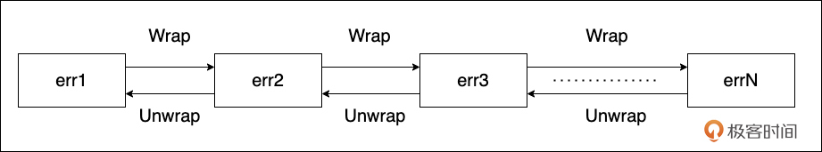

# 错误处理设计：从显式处理到错误链的最佳实践
你好！我是Tony Bai。

在Go语言的设计中，错误处理无疑占据着核心地位，也是与其他许多主流语言区别显著的地方。如果你写过Go代码，一定对随处可见的 `if err != nil` 印象深刻。这种看似“啰嗦”的方式，恰恰体现了Go对于错误处理的核心哲学。

但是，仅仅知道 `if err != nil` 是不够的。面对复杂的调用链和多样的错误场景，我们可能会遇到这样的问题：

- Go为什么坚持使用返回值（ `error` 接口）而不是异常（ `try-catch`）来处理错误？这种设计的优劣何在？

- 当错误层层向上传递时，如何避免原始的、有价值的错误上下文信息丢失？

- `errors.Is` 和 `errors.As` 这两个函数有什么区别？我应该在什么时候使用它们来判断错误？

- 除了检查特定的错误值或类型，还有没有更灵活的错误处理策略？

- Go到底有没有“异常”？ `panic` 和 `recover` 究竟是做什么用的？我能用 `panic` 来传递错误吗？

- Go的错误处理机制是一成不变的吗？社区和官方团队在改进错误处理方面有哪些探索和思考？


**不深入理解Go的错误处理哲学、错误链机制、不同的处理策略以及其演进思考，我们可能会写出信息模糊、难以调试、甚至隐藏风险的错误处理代码，也可能无法理解未来Go在错误处理方面可能的变化。** 掌握优雅、健壮的错误处理设计，是编写生产级Go应用的关键一环。

这节课，我们就来深入探讨Go错误处理的设计与实践。

要真正理解Go中那些看似“繁琐”的 `if err != nil`，我们要先深入其设计理念的源头，看看Go为什么选择了这样一条与众不同的错误处理道路，以及这种选择为我们带来了什么。

## Go的错误处理哲学：显式处理，错误即值

与其他许多语言（如Java、Python、C#）普遍使用 **异常（Exception）** 和 `try-catch` 机制来处理非正常情况不同，Go语言选择了一条不同的道路：将错误作为普通的值（error value）来处理。

Go的核心思想是： **错误是程序正常流程的一部分，应该被显式地检查和处理，而不是通过特殊的控制流（如异常抛出）来绕过。** 这种设计基于一个简单的接口：

```go
type error interface {
    Error() string // 返回错误的描述信息
}

```

任何实现了这个接口的类型，都可以作为一个 `error` 值被返回。函数如果可能失败，通常会将 `error` 作为其最后一个返回值。调用者则有责任立即检查这个返回的 `error` 值是否为 `nil`，比如下面这个典型的示例：

```go
package main

import (
    "fmt"
    "os"
)

func readFileContent(filename string) ([]byte, error) {
    data, err := os.ReadFile(filename) // ReadFile 可能返回错误
    if err != nil {
        // 错误发生，返回 nil 数据和具体的 error 值
        return nil, fmt.Errorf("failed to read file %s: %w", filename, err) // 使用 %w 包装错误 (后面详述)
    }
    // 成功，返回数据和 nil error
    return data, nil
}

func main() {
    content, err := readFileContent("my_notes.txt")
    if err != nil { // <--- 显式检查错误
        fmt.Fprintf(os.Stderr, "Error encountered: %v\n", err)
        // ... 进行错误处理，比如记录日志、返回错误码给用户等 ...
        os.Exit(1)
    }
    // 如果 err == nil，则可以安全地使用 content
    fmt.Println("File content:", string(content))
}

```

显式错误处理在编程中有其明显的优缺点。

首先，从优点来看，显式错误处理提供了清晰的错误处理逻辑。由于错误处理代码与正常流程紧密结合，开发者可以轻松识别可能出错的地方以及相应的处理方式。

此外，尽管编译器不强制检查错误，但使用 `if err != nil` 的惯用法使得忽视错误变得显而易见，这种方式鼓励开发者主动处理错误。同时，将错误视为普通值，使得开发者可以灵活地对待错误进行传递、存储、比较和类型判断等操作，增加了处理的灵活性。

然而，显式错误处理也存在一些缺点。首先，代码冗余是一个常见问题。类似于 `if err != nil { return ..., err }` 的代码块频繁出现，可能导致代码显得啰嗦。此外，在Go 1.13之前，错误的上下文容易丢失。当错误层层返回时，如果没有特别处理，开发者只能看到最外层的错误描述，而失去了原始错误信息，这可能会影响调试和问题排查的效率。

总的来说，显式错误处理在清晰性和灵活性上有优势，但也面临代码冗余和上下文丢失的挑战。

理解了Go将错误视为普通值并强制显式处理的哲学后，我们自然会遇到一个实践中的挑战：当错误信息经过层层函数调用向上传递时，如何确保底层的、最原始的错误上下文信息不丢失，同时又能让每一层都附加上自己相关的诊断信息呢？这正是Go 1.13版本引入的错误链机制所要解决的核心问题。

## 错误链的威力：使用 `fmt.Errorf %w` 包装与 `errors` 包解构

想象一下这样的调用链： `main` -\> `service` -\> `repository` -\> `database driver`。如果驱动层返回一个错误，我们希望每一层都能在不丢失原始错误信息的前提下，添加自己这一层的上下文信息，最终形成一个包含完整调用路径信息的“错误链”。

Go 1.13通过错误包装（Error Wrapping）机制实现了这一点。

### 构建错误链： `fmt.Errorf` 与 `%w`

标准库 `fmt.Errorf` 函数增加了一个新的格式化动词 `%w`。当使用 `%w` 来格式化一个 `error` 类型的值时， `fmt.Errorf` 会创建一个新的错误值，这个新错误值不仅包含了你提供的格式化字符串，还 “包裹（wrap）” 了原始的那个错误。

```go
// 在 repository 层
dbErr := sql.ErrNoRows // 假设数据库驱动返回这个错误
errRepo := fmt.Errorf("repository layer: user with id %d not found: %w", userID, dbErr)

// 在 service 层
errService := fmt.Errorf("service layer: failed to get user details: %w", errRepo)

// 在 main 或 handler 层收到 errService
fmt.Println(errService)
// 输出可能类似:
// service layer: failed to get user details: repository layer: user with id 123 not found: sql: no rows in result set

```

我们看到，通过 `%w` 逐层包装，最终的 `errService` 包含了从最底层 `sql.ErrNoRows` 到最外层 `service layer` 的所有上下文信息。

我们来看一个通用一些的示例：

```plain
package main

import (
    "errors"
    "fmt"
)

func main() {
    err1 := errors.New("error1")
    err2 := fmt.Errorf("error2: wrap %w", err1)
    err3 := fmt.Errorf("error3: wrap %w", err2)

    errChain := fmt.Errorf("error chain: wrap %w", err3)
    fmt.Println(errChain)
}

```

运行这个示例，将输出如下结果：

```plain
error chain: wrap error3: wrap error2: wrap error1

```

我们用下面的示意图来更直观地展示这样的结构：



如图所示，从左到右是错误链的包装次序，err1最先被Wrap，接下来是err2，以此类推，直到errN。从右至左是错误链的解包装次序，errN先被解包装处理，接下来是errN-1，以此类推，直到err1。 **像这种由错误逐个包裹而形成的链式结构，我们就称之为错误链**。

fmt.Printf还支持一次调用使用多个 `%w` 实现对多个错误的包装，当然你也可以使用 Go 1.20 引入的 `errors.Join` 函数来实现同样的功能。下面我们看一个示例：

```plain
package main

import (
    "errors"
    "fmt"
)

func main() {
    err1 := errors.New("error1")
    err2 := errors.New("error2")
    err3 := errors.New("error3")

    errChain1 := fmt.Errorf("wrap multiple error: %w, %w, %w", err1, err2, err3)
    fmt.Println(errChain1)
    errChain2 := errors.Join(err1, err2, err3)
    fmt.Println(errChain2)
}

```

运行这个示例，我们可以看到如下输出：

```plain
wrap multiple error: error1, error2, error3
error1
error2
error3

```

两种方式的不同之处在于errors.Join在每个被包装的错误后面加了一个换行符。

### 解构错误链： `Unwrap`、 `Is` 和 `As`

创建了错误链，我们还需要有方法来检查链中是否包含特定的错误，或者获取链中特定类型的错误信息。标准库 `errors` 包提供了三个关键函数： `errors.Unwrap(err error) error`、 `errors.Is(err error, target error) bool` 和 `errors.As(err error, target interface{}) bool`。我们分别来看。

首先是 `errors.Unwrap(err error) error`。 **如果** `err` **是一个包装错误**（即它内部有一个通过 `%w` 或实现了 `Unwrap() error` 方法包裹的错误）， **那** `Unwrap` **返回被包裹的那个直接内部错误**。如果 `err` 没有包裹其他错误，或者 `err` 是 `nil`，则返回 `nil`。

我们可以通过循环调用 `Unwrap` 来遍历整个错误链，直到找到根错误（最底层的那个）或者 `Unwrap` 返回 `nil`。比如下面的printErrChain函数，利用该函数我们可以清晰地将上面示例中的errChain链上的错误逐一Unwrap出来：

```go
func main() {
    err1 := errors.New("error1")
    err2 := fmt.Errorf("error2: wrap %w", err1)
    err3 := fmt.Errorf("error3: wrap %w", err2)

    errChain := fmt.Errorf("error chain: wrap %w", err3)
    printErrChain(errChain)
}

func printErrChain(err error) {
    fmt.Println("Error Chain:")
    for err != nil {
        fmt.Printf(" -> %v\n", err)
        err = errors.Unwrap(err) // 获取下一个内部错误
    }
}

```

运行该示例，将得到如下输出：

```plain
Error Chain:
 -> error chain: wrap error3: wrap error2: wrap error1
 -> error3: wrap error2: wrap error1
 -> error2: wrap error1
 -> error1

```

其次是 `errors.Is(err error, target error) bool`。errors.Is函数用于判断错误链 `err` 中是否存在一个错误等于 `target` 错误值。它会递归地调用 `Unwrap` 来检查链上的每一个错误是否与 `target` 相等（使用 `==` 比较，或者如果错误实现了 `Is(error) bool` 方法，则调用该方法）。

`errors.Is` **特别适合用来检查错误链中是否包含某个哨兵错误值（Sentinel Error)**：

```go
// 检查 errService 是否包含了数据库未找到行的错误ErrNoRows
if errors.Is(errService, sql.ErrNoRows) {
    fmt.Println("The root cause was sql.ErrNoRows!")
    // 可以进行针对性处理，比如返回 404 Not Found
}

```

最后是 `errors.As(err error, target interface{}) bool`。errors.As用于判断错误链 `err` 中是否存在一个错误的类型匹配 `target` 指向的类型，并将第一个匹配到的错误值赋给 `target`。 `target` 必须是一个指向接口类型或具体错误类型的指针。

`errors.As` **特别适合用来检查错误链中是否包含某个特定错误类型，并获取该错误的值以访问其包含的额外信息**。

下面示例定义了一个自定义网络错误类型NetworkError，并演示了如何使用 errors.As 来检查错误链中是否存在该类型的错误，并提取相关信息：

```go
package main

import (
    "errors"
    "fmt"
)

// NetworkError 是一个自定义的网络错误类型
type NetworkError struct {
    Op  string
    URL string
    Err error // 可能包装了底层错误
}

// Error 方法实现了 error 接口
func (e *NetworkError) Error() string {
    return fmt.Sprintf("Network error on %s %s: %v", e.Op, e.URL, e.Err)
}

// Unwrap 方法允许 errors.As 访问被包装的错误
func (e *NetworkError) Unwrap() error {
    return e.Err
}

// someOperation 模拟一个可能返回 NetworkError 的操作
func someOperation(url string) error {
    // 模拟一个底层错误
    originalErr := errors.New("connection refused")

    // 创建并返回一个包装后的 NetworkError
    return &NetworkError{
        Op:  "GET",
        URL: url,
        Err: originalErr,
    }
}

func main() {
    // 调用 someOperation 获取错误
    err := someOperation("https://example.com")

    var netErr *NetworkError // 准备一个指针变量来接收
    if errors.As(err, &netErr) { // 检查链中是否有 *NetworkError 类型
        // 如果找到，netErr 现在指向那个 NetworkError 实例
        fmt.Printf("Network error occurred: Op=%s, URL=%s, OriginalErr=%v\n",
            netErr.Op, netErr.URL, netErr.Err)
        // 可以根据 netErr 中的具体信息做处理
    } else {
        fmt.Println("No network error found in the error chain.")
        fmt.Printf("Original error: %v\n", err)
    }
}

```

运行该示例，将得到如下输出：

```plain
Network error occurred: Op=GET, URL=https://example.com, OriginalErr=connection refused

```

下面再看一个使用接口指针类型作为target的示例：

```plain
package main

import (
    "errors"
    "fmt"
)

// 定义一个通用的错误接口
type CustomError interface {
    Error() string
    CustomDetails() string // 自定义的错误信息方法
}

// NetworkError 实现了 CustomError 接口
type NetworkError struct {
    Op  string
    URL string
    Err error
}

func (e *NetworkError) Error() string {
    return fmt.Sprintf("Network error on %s %s: %v", e.Op, e.URL, e.Err)
}

func (e *NetworkError) CustomDetails() string {
    return fmt.Sprintf("Op: %s, URL: %s", e.Op, e.URL)
}

func (e *NetworkError) Unwrap() error {
    return e.Err
}

// DatabaseError 实现了 CustomError 接口
type DatabaseError struct {
    Query string
    Err   error
}

func (e *DatabaseError) Error() string {
    return fmt.Sprintf("Database error with query '%s': %v", e.Query, e.Err)
}

func (e *DatabaseError) CustomDetails() string {
    return fmt.Sprintf("Query: %s", e.Query)
}

func (e *DatabaseError) Unwrap() error {
    return e.Err
}

// someOperation 模拟返回不同类型错误的操作
func someOperation(errorType string) error {
    switch errorType {
    case "network":
        return &NetworkError{
            Op:  "GET",
            URL: "https://example.com",
            Err: errors.New("connection timeout"),
        }
    case "database":
        return &DatabaseError{
            Query: "SELECT * FROM users",
            Err:   errors.New("invalid column name"),
        }
    default:
        return errors.New("unknown error")
    }
}

func main() {
    // 模拟获取一个错误
    err := someOperation("network") // 可以尝试 "database" 或其他值

    // 使用接口指针作为 target
    var customErr CustomError
    if errors.As(err, &customErr) {
        fmt.Printf("Custom error detected: %s\n", customErr.Error())
        fmt.Printf("Custom details: %s\n", customErr.CustomDetails())

        // 进一步判断具体类型 (可选)
        switch v := customErr.(type) {
        case *NetworkError:
            fmt.Println("This is a NetworkError.")
            fmt.Printf("URL: %s\n", v.URL)
        case *DatabaseError:
            fmt.Println("This is a DatabaseError.")
            fmt.Printf("Query: %s\n", v.Query)
        }
    } else {
        fmt.Println("No custom error found in the error chain.")
        fmt.Printf("Original error: %v\n", err)
    }
}

```

这个例子展示了如何使用接口类型指针作为 errors.As 的 target，从而实现更灵活的错误处理。通过定义一个通用的错误接口，我们可以处理实现了该接口的任何类型的错误，无需事先知道具体的错误类型。类型断言可以用于进一步判断具体类型，并执行特定于该类型的操作。这种方法在处理多种不同类型的错误时非常有用。

`Unwrap`、 `Is`、 `As` **这三个函数是处理错误链的核心工具，让我们能够在保留完整错误上下文的同时，精确地检查和处理我们关心的特定错误情况。**

掌握了如何通过错误包装构建信息丰富的错误链，以及如何使用 `errors.Unwrap`、 `Is` 和 `As` 来探查错误链之后，我们面临的下一个问题是：在实际编码中，面对各种不同的错误情况，我们应该采取哪种具体的判断和处理策略呢？Go为我们提供了多种选择，每种策略都有其适用的场景和权衡。

## 错误处理策略：选择合适的判断与处理方式

知道了如何创建和解构错误链，我们在实际编码中应该采用哪种策略来判断和处理错误呢？主要有4种选择，各有优劣，我们逐一来看一下。

### 策略一：简单检查 `err != nil`

这是最基础、最常用的方式。我们只关心操作是否成功，不关心具体的失败原因。

```go
data, err := ioutil.ReadFile("config.json")
if err != nil {
    // 只知道出错了，进行通用处理
    log.Printf("Failed to read config: %v", err)
    return defaultConf, err // 可能直接返回错误
}
// 成功，继续处理 data

```

这种方式的优点在于其简单直接。通过检查错误是否为 nil，可以快速判断操作是否成功，并进行通用的错误处理。例如，在读取配置文件时，如果发生错误，程序会记录错误信息并返回默认配置和错误。这种处理方式让代码保持了清晰和简洁。

然而，这种方法也有缺点。由于无法根据不同的错误原因采取针对性的错误处理逻辑，开发者在遇到不同的错误情况时可能无法进行适当的响应。这可能导致程序在处理不同类型错误时缺乏灵活性，影响整体的错误处理能力。

### 策略二：哨兵错误值

预先定义一些导出的错误变量（通常在包级别使用 `var ErrXxx = errors.New("...")` 定义），这些变量本身就代表了一种特定的错误状态。 **调用者通过** `errors.Is` **来检查返回的错误是否是这个预定义的哨兵值**。标准库中的 `io.EOF`、 `sql.ErrNoRows` 都是典型的哨兵错误。

```
package fileutils

import "errors"
var ErrPermission = errors.New("permission denied") // 定义哨兵错误

func WriteData(path string, data []byte) error {
    // ... 尝试写入 ...
    if permissionIssue {
        return ErrPermission // 返回预定义的错误值
    }
    // ...
    return nil
}

// 调用方
err := fileutils.WriteData("/etc/passwd", data)
if errors.Is(err, fileutils.ErrPermission) { // 使用 errors.Is 判断
    fmt.Println("Operation failed due to permissions.")
    // 采取特定处理
} else if err != nil {
    // 处理其他错误
}

```

这种方法的优点在于其简单易懂，错误的意图非常明确。开发者可以清晰地判断出错误的来源和性质。例如，在写入数据时，如果出现权限问题，可以直接返回预定义的 ErrPermission，调用者随后可以通过 errors.Is 来进行判断并采取相应的处理措施。

然而，哨兵错误值也存在一些缺点。首先，它可能导致包之间的耦合，调用者需要导入定义哨兵错误的包，这增加了依赖性。其次，哨兵错误通常不携带额外的上下文信息，虽然可以通过错误包装来添加这些信息，但这也使得处理变得更加复杂。最后，如果定义的哨兵错误数量过多，管理和记忆这些错误的成本也会随之增加，从而影响开发的效率。

### 策略三：特定错误类型

定义一个自定义的结构体类型，让它实现 `error` 接口。这个结构体可以包含丰富的上下文信息（比如哪个字段验证失败、网络操作的目标地址、临时性错误还是永久性错误等）。调用者使用 `errors.As` 来检查错误链中是否存在这种类型的错误，并获取其值以访问详细信息。

```go
package main

import (
    "errors"
    "fmt"
)

// FieldError 表示字段验证错误
type FieldError struct {
    FieldName string
    Issue     string
}

// Error 方法实现了 error 接口
func (fe *FieldError) Error() string {
    return fmt.Sprintf("validation failed for field '%s': %s", fe.FieldName, fe.Issue)
}

// ValidateInput 验证输入数据
func ValidateInput(input map[string]string) error {
    if input["email"] == "" {
        // 返回一个具体的 FieldError 类型
        return &FieldError{FieldName: "email", Issue: "cannot be empty"}
    }

    if len(input["password"]) < 8 {
        return &FieldError{FieldName: "password", Issue: "must be at least 8 characters"}
    }
    // ... 其他验证 ...
    return nil
}

func main() {
    // 模拟输入数据
    inputData := map[string]string{
        "email":    "",
        "password": "short",
    }

    // 调用 ValidateInput 进行验证
    err := ValidateInput(inputData)

    // 准备接收 FieldError 指针
    var fieldErr *FieldError

    // 使用 errors.As 判断并获取 FieldError
    if errors.As(err, &fieldErr) {
        fmt.Printf("Input validation failed on field '%s': %s\n",
            fieldErr.FieldName, fieldErr.Issue) // 输出：Input validation failed on field 'email': cannot be empty
        // 可以根据 fieldErr.FieldName 给用户更具体的提示
    } else if err != nil {
        // 处理其他类型的错误
        fmt.Printf("An unexpected error occurred: %v\n", err)
    } else {
        fmt.Println("Input validation successful!")
    }
}

```

这种方法的优点在于其类型安全性。自定义错误类型可以携带详细的上下文信息，使得错误处理更加灵活和具体。例如，在字段验证时，如果某个字段不符合要求，返回的 FieldError 类型可以准确指明出错的字段和问题。这种方式将错误的行为封装在类型内部，使得错误处理更加清晰。

然而，特定错误类型也有其缺点。首先，开发者需要定义额外的类型，增加了代码量。这可能使得代码看起来更加复杂，尤其是在错误种类较多的情况下。此外，定义和管理这些自定义错误类型也需要一定的时间和精力。因此，尽管特定错误类型提供了丰富的上下文信息和灵活性，但在实现上相对较为繁琐。

### 策略四：行为特征判断

有时我们不关心错误的具体类型或值，而是关心它是否具有某种行为或特征。比如，一个网络错误是否是临时性的（Temporary），可以稍后重试？是否是超时（Timeout）？我们可以定义只包含描述这种行为的方法的接口，然后使用类型断言或 `errors.As`（如果目标是指向接口的指针）来检查错误是否实现了该接口。

```go
package main

import (
    "errors"
    "fmt"
    "time"
)

// temporary 接口用于描述临时性错误
type temporary interface {
    Temporary() bool
}

// OpError 是一个自定义的操作错误类型
type OpError struct {
    Op          string
    Net         string
    Addr        string
    Err         error
    IsTemporary bool // 显式指定是否是临时错误
}

func (e *OpError) Error() string {
    return fmt.Sprintf("op error: %s %s %s: %v", e.Op, e.Net, e.Addr, e.Err)
}

func (e *OpError) Temporary() bool {
    return e.IsTemporary
}

func (e *OpError) Unwrap() error {
    return e.Err
}

// IsTemporary 函数判断错误是否是临时性的
func IsTemporary(err error) bool {
    var te temporary
    // 可以用 errors.As (更推荐，能处理错误链)
    if errors.As(err, &te) {
        return te.Temporary()
    }
    // 或者用类型断言 (只能检查 err 本身)
    // if te, ok := err.(temporary); ok {
    //     return te.Temporary()
    // }
    return false
}

// 模拟一个可能返回临时性网络错误的函数
func someNetCall() error {
    // 模拟一个临时性错误（例如连接超时）
    err := &OpError{
        Op:          "dial",
        Net:         "tcp",
        Addr:        "127.0.0.1:8080",
        Err:         errors.New("connection refused"), // 模拟连接被拒绝
        IsTemporary: true,                             // 显式指定为临时错误
    }

    return err
}

func main() {
    // 调用 someNetCall 获取错误
    err := someNetCall()

    // 判断错误是否是临时性的
    if IsTemporary(err) {
        fmt.Println("Network error is temporary, retrying later...")
        // 模拟重试逻辑
        fmt.Println("Retrying in 5 seconds...")
        time.Sleep(5 * time.Second)
        fmt.Println("Retry successful (simulated).")
    } else if err != nil {
        // 处理非临时性错误
        fmt.Printf("Non-temporary error: %v\n", err)
    } else {
        fmt.Println("No error occurred.")
    }
}

```

这个示例展示了如何自定义一个错误类型，并实现 temporary 接口，以及如何使用 errors.As 函数来判断错误链中是否存在实现了该接口的错误。

**该策略的优点在于高度解耦，调用者只需关注错误的行为特征，而不依赖于具体的错误类型或值。** 这种方式提供了极大的灵活性和可扩展性，使其适用于多种应用场景。然而，缺点是需要预先设计好描述行为的接口，且使用场景相对特定，主要适用于判断错误的可恢复性和类别等情况。

### 策略选择的考量

在选择错误处理策略时，可以根据具体场景的需求进行判断。对于仅需判断操作是否出错的情况，使用简单的 `err != nil` 是最合适的方式。若需要区分几种固定且众所周知的错误状态，则可以采用哨兵错误值结合 `errors.Is` 的方法。在需要传递丰富的错误上下文信息或错误本身具有多种状态的场景中，特定错误类型与 `errors.As` 的组合会更加有效。

此外，当需要根据错误的某种能力或特征（例如是否可重试）做出决策时，使用行为特征接口配合 `errors.As` 或类型断言是一个理想的选择。

通常，一个项目中会根据不同需求混合使用这些策略，以实现更灵活和有效的错误处理。

通过上述几种策略，我们可以有效地处理程序中预期的、作为正常流程一部分的“错误”。但Go语言中还有一个与错误处理相关的概念，常常引起混淆，那就是 `panic`。它与我们一直在讨论的 `error` 有什么本质区别？我们又该在何种场景下（如果真的需要的话）使用 `panic` 和 `recover` 呢？厘清这两者的边界，对于编写健壮的Go程序至关重要。

## Panic vs Error：Go 中异常处理的边界与正确场景

Go语言明确区分了错误（error）和异常（panic）。

- 错误（Error）： **是预期中可能发生的问题，是程序正常流程的一部分**。比如文件未找到、网络连接失败、用户输入无效等。Go强制要求显式地检查和处理错误。

- 异常（Panic）： **表示程序遇到了无法恢复的内部错误或严重的程序缺陷**，此时程序无法安全地继续执行下去。例如，数组访问越界、空指针解引用、并发写map等。 `panic` 会中断正常的控制流，开始在goroutine的调用栈中向上传递“恐慌”，执行每个 `defer` 语句，直到到达顶层或被 `recover` 捕获。如果始终未被捕获，那么该panic将会导致整个程序退出。


`panic` **的正确使用场景非常有限**，主要包括几个方面。

首先，在遇到真正不可恢复的错误时，程序如果遭遇内部状态错误，比如关键数据结构的损坏，应该使用 `panic`，因为继续运行已经没有意义。

其次，在程序的初始化阶段，如 `init` 函数或全局变量初始化时，如果出现无法继续的错误，使用 `panic` 可以实现快速失败。

最后，开发者可以在代码中添加断言，尤其是在测试代码中，如果某个本应为真的条件未满足，可以通过 `panic` 来标明存在编程错误。

另一方面，内置函数 `recover()` 的作用是在 `defer` 语句中调用时显现。它能够捕获当前 goroutine 中的 `panic`，使程序从恐慌状态中恢复，阻断panic的继续向上传递，并返回传递给 `panic` 的值。如果没有发生 `panic`， `recover` 则返回 `nil`。

recover的主要用途是在程序的边界，即程序中可能会出现异常状态的关键点，通常是与外部交互或执行上下文切换的地方，例如每个 HTTP handler 的顶层或每个 goroutine 的入口函数，捕获意外的panic，记录日志，并返回内部错误给调用者（或 HTTP 500 响应），以防止单个请求或 goroutine 的崩溃导致整个服务进程退出。

需要特别注意的是，绝对不要使用 `panic` 来传递普通的、可预期的错误。这种做法会破坏 Go 语言明确的错误处理流程，使错误变得难以追踪和处理，进而导致代码脆弱。

在区分 `Error` 和 `Panic`，以及选择合适的错误处理策略之外，日常错误处理设计中还有一些重要的实践细节和注意事项，它们虽然零散，却同样影响着代码的质量和可维护性。

## 错误处理设计的其他注意事项

这里再补充几点重要的错误处理设计的实践建议：

- **日志 vs 返回**：在一个函数或方法中，通常应该 **要么记录详细错误日志，要么将错误返回给调用者**，避免两者都做。通常，底层的函数负责返回错误（可以包装上下文），顶层的调用者（如HTTP handler或main函数）负责根据最终的错误情况记录日志或向用户展示信息。

- **错误信息**： `error` 的 `Error()` 方法返回的字符串应该简洁明了，描述错误本身。额外的上下文信息应该通过错误包装添加，或者存储在自定义错误类型的字段中，避免在错误字符串中暴露敏感信息（如文件路径、IP地址等）。

- **错误链深度**：过深的错误链（嵌套包装太多层）可能会让错误信息变得冗长难读。在适当的层级，可以考虑处理（比如记录日志后返回一个更通用的错误）或转换错误，而不是一味地向上包装。


通过遵循这些注意事项，我们可以让Go的显式错误处理发挥出其最大的威力，编写出既健壮又易于理解的代码。

到这里，我们已经深入探讨了Go当前错误处理的核心机制、各种策略以及实践中的考量。可以说，Go 1.13版本引入的错误链和 errors.Is/As 极大地完善了Go的错误处理能力，解决了早期版本中上下文信息易丢失、错误判断不便等问题。然而，正如任何广泛使用的语言特性一样，关于Go错误处理的讨论和思考从未停止。社区中关于如何进一步优化错误处理体验、减少样板代码的呼声一直存在，Go核心团队也对此保持着关注和探索。接下来，我们就来简单回顾一下这些年Go在错误处理演进方面的尝试，以及对未来的展望。

## Go错误处理的演进与展望

正如我们在本节课开头提到的，错误处理一直是Go社区讨论的热点，在历年的Go官方用户调查中，它也常常位列“最希望改进的功能”榜首。这并非意味着Go现有的错误处理机制（ `error` 接口、显式检查、错误链）不好，恰恰相反，它为构建可靠软件提供了坚实的基础。但社区的期待主要集中在如何能 **减少** `if err != nil` **的样板代码**，同时又不牺牲Go错误处理的 **显式性、清晰性和错误即值的核心哲学**。

多年来，Go核心团队和社区成员为此付出了大量努力，提出了多个备受关注的错误处理改进提案，但遗憾的是，这些提案大多因未能完美平衡简洁性、Go的哲学以及向后兼容性等因素而被搁置或否决。我们不妨简要回顾几个典型的探索方向。

### `try` 内建函数提案（Go 2 Error Handling Trial）

这是Go团队在Go 2草案中最受瞩目的提案之一。它试图引入一个 `try` 内建函数（或操作符），如果在 `try` 的表达式中发生错误，当前函数会立即返回该错误。

- **设想语法**： `value := try(FailingFunc())`。

- **优点**：能显著减少 `if err != nil { return ..., err }` 的重复代码。

- **被否决原因**：社区对其引入的隐式控制流（类似轻量级异常）存在较大争议，认为它可能破坏Go错误处理的明确性和可读性。错误处理路径不再那么“显眼”，增加了理解代码控制流的难度。同时，如何与 `defer` 交互、如何处理多个返回值的函数等细节也存在复杂性。


### 错误检查操作符（如 `?` 或 `check/handle` 块 ）

借鉴其他语言（如Rust的 `?` 操作符），有提案建议引入某种简写操作符或块结构来简化错误检查和返回。

- **设想语法**： `value := FailingFunc()?` 或 `check err { handle err }`。

- **优点**：同样旨在减少样板代码。

- **面临挑战**： `?` 操作符的语义与Go现有的多返回值和 `error` 接口如何优雅结合是一个难题。 `check/handle` 块则引入了新的控制结构，增加了语言复杂性，并可能像 `try` 一样被认为引入了不够显式的错误处理路径。


随着泛型的引入，社区开始探索是否能利用泛型来创建更通用的错误处理辅助函数或模式，以减少一些重复代码，例如创建能包装不同类型错误并附加通用上下文的泛型错误类型。实际的现状呢？泛型确实为库作者提供了一些新的工具来封装错误处理逻辑，但它并未从根本上改变Go语言层面的错误处理范式（ `error` 接口和显式检查）。它更多的是在库的层面提供便利，而非语言核心语法的变革。

**Go错误处理的核心哲学是错误即值、显式处理。** 这意味着错误是普通的返回值，可以像其他值一样被传递、检查、记录。意味着错误处理逻辑是程序正常控制流的一部分，清晰可见。

任何试图“简化”错误处理的提案，如果引入了隐式的控制流（如 `try` 的提前返回），或者让错误处理路径不够显眼，就很容易与这个核心哲学产生冲突。此外，Go语言对向后兼容性的承诺，以及对保持语言简洁性的追求，都使得对这样一个核心机制的改动需要极其审慎。

我个人认为，当前 Go 的 `if err != nil` 风格，虽然有时显得重复，但其带来的 **代码清晰度、错误处理路径的明确性以及对错误的重视程度** 是非常有价值的。它迫使开发者思考每一个可能出错的地方，这对于构建可靠的系统至关重要。错误链机制（ `%w`、 `errors.Is`、 `errors.As`）的引入，已经极大地改善了错误上下文传递和错误类型判断的问题，弥补了早期错误处理的一些不足。

当然，如果未来能出现一种新的提案，它能够在 **完全保持Go显式、直观的错误处理哲学** 的基础上，安全地、优雅地减少一些样板代码，那无疑是值得期待的。

但就目前而言， **拥抱并掌握现有的错误处理机制**——理解 `error` 接口、熟练使用错误包装和 `errors` 包的辅助函数、根据场景选择合适的错误处理策略——仍然是每个Go开发者提升代码质量的必经之路。

## 小结

这节课，我们深入系统地探讨了Go语言错误处理的设计哲学、核心机制、实践策略以及未来的演进思考。

1. **Go的哲学**：我们理解了Go坚持显式处理、错误即值的核心理念。错误作为普通的返回值，强制开发者关注并处理每一个可能出错的地方，这构成了Go程序健壮性的基础。

2. **错误链的威力**：自Go 1.13以来，通过 `fmt.Errorf` 的 `%w` 动词进行错误包装，以及使用 `errors.Unwrap`、 `errors.Is`、 `errors.As` 来解构错误链，已经成为现代Go错误处理的标准实践。这使得我们能够在保留完整错误上下文的同时，精确地判断和处理特定错误。

3. **核心处理策略**：我们学习了根据不同场景选择合适的错误处理策略，包括基础的简单检查（ `!= nil`）、针对已知错误状态的哨兵错误值（ `errors.Is`）、需要丰富上下文的特定错误类型（ `errors.As`），以及关注错误行为的行为特征判断。

4. **Panic vs. Error**：我们严格区分了错误（程序正常流程的一部分）和异常（通常是不可恢复的程序缺陷）。明确了 `panic` 仅用于表示严重的内部错误或快速失败，绝不能用来传递普通的、可预期的错误。 `recover` 则用于在边界捕获panic，防止程序崩溃。

5. **注意事项**：我们还强调了一些重要的实践细节，如避免同时记录日志和返回错误、保持错误信息清晰安全、适度管理错误链深度等。

6. **演进与展望**：我们回顾了Go社区和核心团队在改进错误处理机制方面所做的探索（如 `try` 提案）以及面临的挑战。理解了Go在保持其显式、直观的错误处理哲学与减少样板代码之间的审慎权衡。虽然现有机制已相当成熟，但对更优雅方案的探索仍在继续。


掌握Go的错误处理设计，不仅是编写健壮代码的基础，也是理解Go语言简洁、务实风格的关键。通过显式处理、错误包装、合理的策略选择，并关注其演进，我们可以构建出既可靠又易于调试和维护的Go应用程序。Go的错误处理方式或许不是所有语言中最简洁的，但它无疑是经过深思熟虑的，并且在实践中被证明是行之有效的。

## 思考题

假设你在编写一个函数 `processUserData(userID int)`，它内部需要依次调用三个函数：

- `getUserProfile(userID)` 可能返回 `sql.ErrNoRows` 或其他数据库错误。

- `calculateScore(profile)` 可能返回一个自定义的 `validation.ErrInvalidProfile` 类型错误。

- `updateAnalytics(userID, score)` 可能返回一个网络错误，该错误可能实现了 `temporary` 接口。


在 `processUserData` 函数中，你会如何组织错误处理逻辑，以便能够：

- 在 `getUserProfile` 返回 `sql.ErrNoRows` 时，返回一个特定的业务错误 `ErrUserNotFound`。

- 在 `calculateScore` 返回 `validation.ErrInvalidProfile` 时，能获取到错误的详细信息并记录日志，然后返回一个通用的处理失败错误。

- 在 `updateAnalytics` 返回临时网络错误时，尝试进行1次重试；如果是其他网络错误，则直接返回失败。

- 对于所有其他未预料到的错误，都包装上 “failed to process user data for id X” 的上下文信息再返回。


不需要写完整代码，描述关键的 `if err != nil` 分支和使用的 `errors.Is/As` 或类型断言逻辑即可。

欢迎在评论区分享你的错误处理策略！我是Tony Bai，我们下节课见。