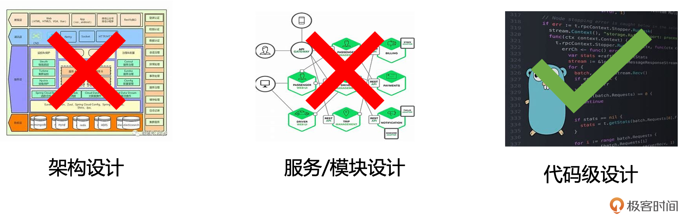
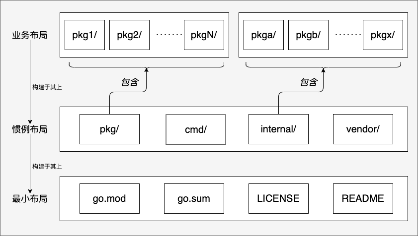

# 项目布局：构建清晰、可维护Go应用的基石
你好！我是Tony Bai。

欢迎来到模块二——设计先行，奠定高质量代码基础的第一节课！在模块一，我们强化了Go的语法细节，理解了类型、接口、并发原语等核心语法构建块。但仅仅掌握这些“砖瓦”还不够，要建造一座坚固、优雅、易于扩展的“软件大厦”，优秀的设计思维和实践至关重要。这个模块，我们将聚焦于如何在动手编码之前，运用良好的设计原则来规划我们的Go项目。

在这一模块中，我所讲解的设计不是指架构级别的设计，也不是服务、模块级别的，更多是代码层级的设计。



这部分设计甚至不需要文档化，可能只停留在我们大脑中。当然，如果能将其文档化，或以注释的形式放入源码文件中，自然最好。

我个人推崇“无设计不代码”，因此在这一模块中，我将围绕Go代码设计的六个主要方面进行系统地讲解：


而所有设计的起点，往往就是 **项目结构布局（Project Layout）——我们如何组织代码文件和目录**。一个清晰、合理的项目布局就像一座建筑的蓝图，它不仅能反映项目的组织方式和模块划分，更能极大地影响代码的可维护性、团队协作效率以及新成员的上手速度。

但Go项目的布局常常让人困惑：

- 是否存在官方的“标准答案”？

- 网上流传的各种“标准布局模板”靠谱吗？我们应该照搬吗？

- 像 `cmd`、 `internal`、 `pkg` 这些目录，我们应该在什么时候以及如何正确使用它们？

- 现代Go项目中的 `go.mod` 和 `go.work` 又该如何与项目布局协同工作？


很多人可能没有机会从零设计项目结构，或者习惯遵循某种“约定俗成”的模板。但不理解项目布局背后的设计原则和Go语言自身的特点（比如对简洁性的推崇），可能会让我们陷入为了结构而结构、过度设计或组织混乱的困境。这节课，我们就深入探讨Go项目布局的设计之道，让你能根据项目的实际情况，做出明智、合理的布局决策。

我们将一起：

1. 探讨一种 **分层布局** 的思考方式，帮你理清项目结构的不同关注点。

2. 探索 **主流的布局选择**，辨析事实标准、社区惯例与需要警惕的反模式。

3. 掌握 **模块化管理** 的最佳实践，特别是 `go.mod` 与 `go.work` 的协同。


下面我们先来看看什么是分层布局，这可是我在Go项目布局设计方面的独创性思考哦。

## 分层布局：构建清晰应用的基础

在深入讨论具体的目录（如 `cmd`、 `internal`）之前，我们先建立一种 **概念上的分层思维** 来理解Go项目的结构。与其一开始就陷入目录细节，不如先从宏观上思考一个项目可能包含的不同层次的关注点。

### Go项目布局的概念模型

借鉴Go社区的实践和思考，我们可以将一个Go项目的布局（尤其对于中大型项目）在概念上划分为三个层次：



这是一个思考Go项目布局的概念模型。最底层是所有项目都具备的最小布局，其上是可选的、按社区惯例组织的目录层，最上层是真正体现项目业务逻辑的包布局。我们逐一来看一下。

### 最小布局（Minimal Layout）

最小布局是任何一个Go Module的基础，构成了项目的“身份标识”和最核心的元数据。它通常只包含：

- `go.mod`：定义模块路径、Go版本和依赖。

- `go.sum`：依赖项的校验和。

- `LICENSE`：项目的开源许可证，显然这是一个可选项，仅在你的项目是开源项目时有效。

- `README.md`：项目的说明文档。无论是否是开源项目，我都建议你在项目中包含一份“项目的说明书”。


对于非常简单的库或工具，可能这就足够了。这与 [Go官方布局指南](https://go.dev/doc/modules/layout) 推荐的“从简单开始”不谋而合。

### 惯例布局（Conventional Layout）

在最小布局之上，随着项目变复杂，社区逐渐形成了一些组织代码的惯例目录。这些目录通常是可选的，用于解决特定的组织问题：

- `cmd`：存放项目的可执行文件入口（main包）。当项目需要构建多个二进制文件时很有用。

- `internal`：存放项目内部私有代码，Go工具链保证这里的包不能被外部模块导入。用于保护内部实现。

- `pkg`：（有争议，但仍有项目使用）存放项目中可以被外部安全引用的公共库代码。

- `vendor`：存放项目依赖的本地副本（通过 `go mod vendor` 生成）。


这一层提供了一种相对标准化的方式来组织不同类型的Go代码（应用程序入口 vs 内部实现 vs 公共库）。如果你对此有异议，别急，我们将在下一小节详细讨论这些目录的适用场景和注意事项。

### 业务布局（Business Layout）

这是项目最核心、最能体现其价值的部分，包含了实现项目特定功能的业务逻辑代码。这里的包组织方式应该完全由项目的领域、功能和架构决定，而非固定的模板。

- 对于Web服务项目，这里可能包含 `api`、 `service`、 `handler`、 `router`、 `model`、 `store` 等包。

- 对于命令行工具项目，这里可能是 `command`、 `parser`、 `helper` 等。

- 对于数据库项目，这里可能是 `engine`、 `storage`、 `query`、 `parser` 等。

- 如果项目遵循DDD（领域驱动设计），可能是 `domain`、 `application`、 `infrastructure` 等，体现领域模型、应用服务和基础设施的分离。

- 如果遵循 **“Clean Architecture”（整洁架构）**，布局会强调依赖规则（依赖必须指向内层）。可能包含如 `entities`（核心领域模型）、 `usecases`（应用逻辑，定义接口端口）、 `interfaces`/ `adapters`（包含 `controllers`、 `presenters`、 `gateways`/ `repositories` 等适配器）以及 `infrastructure`（具体外部依赖实现）等包，层层分离。

- 如果遵循 **“六边形架构”（Hexagonal Architecture）**，布局会突出核心业务逻辑与外部世界的隔离。核心层定义所需端口（Ports，通常是接口），外部交互通过适配器（Adapters）实现，适配器会放在独立的包结构下，区分为驱动适配器（如 `adapters/http`、 `adapters/cli`）和被驱动适配器（如 `adapters/database`、 `adapters/messaging`）。


这一层的关键在于：这些包的命名和组织方式应该反映业务本身和所选的架构风格，做到高内聚、低耦合。选择哪种架构风格应基于项目复杂度和团队熟悉度，并体现在“业务布局”的包组织上。

理解了这个概念分层模型，可以帮助我们更有条理地思考项目结构：先有基础（最小布局），再考虑是否需要引入社区惯例的组织方式（惯例布局），最后根据业务需求精心设计核心逻辑的包结构（业务布局）并决定将其置于何处。不过，你一定要做好区分： **这里我们讨论的“分层布局”是一种组织项目文件结构的概念模型**，它不同于应用程序内部的“分层架构”（如Web应用中的表现层、业务层、数据访问层）。业务布局内部可能会实现这种分层架构（比如包含 `api`、 `service`、 `store` 包），但这只是业务布局的一种具体实现方式。

明确了这种分层的思考方式后，我们现在可以将目光聚焦到实践层面了。虽然Go官方没有强制规定布局，但社区在长期实践中，围绕着“惯例布局”层和如何组织“业务布局”层，逐渐形成了一些主流的选择和看法。接下来，我们就来探索这些主流的布局实践，辨析其中的事实标准、社区惯例，并警惕一些可能被误用的反模式。

## 主流选择：探索Go项目标准布局及变种

明确了概念上的分层布局思路后，我们现在可以将目光聚焦到实践层面。虽然Go官方并没有像某些语言那样强制规定一套详细的项目结构，但社区在长期的实践中，围绕着“惯例布局”层和如何组织“业务布局”层，逐渐形成了一些主流的选择和看法。当然，也伴随着一些需要警惕的、可能被误用的“反模式”。下面，我们就来探索这些主流的布局实践，帮助你理解不同结构选择背后的考量，辨析事实标准与社区惯例，从而为你的项目选择合适的起点。

### 有机生长，警惕“伪标准”与过度设计

在开始组织项目结构时，最重要的一点或许是心态。Go语言推崇简洁和实用主义。这意味着我们应该避免一开始就构建一个过于庞大和复杂的目录结构，尤其要警惕那些看似“标准”实则可能过度设计的模板。

你在网上可能经常看到 `golang-standards/project-layout` 这个GitHub仓库，它提供了一个非常详尽的目录结构。虽然它可以作为了解大型项目可能需要哪些组织的参考，但它绝非官方标准，且对于大多数项目而言过于复杂。直接套用这样的模板，很容易陷入“为了结构而结构”的陷阱，创建大量目前并不需要的空目录，或者在需求尚不明确时就进行不成熟的抽象和分层，这反而违背了Go的简洁哲学。

**正确的做法应该是让项目结构“有机生长”**。遵循Go官方在 [Organizing a Go module](https://go.dev/doc/modules/layout) 指南中传递的核心思想： **从最简单的结构开始，按需添加复杂性**。一个简单的库可能只需要根目录下的几个 `.go` 文件；一个简单的命令行工具可能也只需要根目录下的 `main.go`。只有当项目规模增长、职责需要分离，或者需要明确区分内部与外部代码时，才逐步引入更复杂的结构。

### 核心惯例目录的审慎使用

随着项目复杂度的增加，一些具有特定含义的顶层目录（我们之前称之为“惯例布局”层的一部分）可能会被引入。理解它们的确切含义和适用场景至关重要，避免误用。我们首先来看看cmd目录。

#### cmd目录：可执行文件入口

在Go的惯例中，cmd目录用于存放项目的 **可执行文件入口**（即包含 `main` 函数的包）。如果一个项目有多个可执行文件，那么cmd目录下可以放置多个入口包。

Go官方建议，只有当你的代码仓库（module）同时包含可供导入的库包（library packages）和多个命令包（command packages）时，才使用 `cmd` 目录来存放这些命令包。这样做可以清晰地将应用程序入口与库代码分开。

```plain
myproject/
├── cmd/
│   ├── server/      # Web服务器入口
│   │   └── main.go
│   └── cli/         # 命令行工具入口
│       └── main.go
├── internal/
│   └── logic/
├── mylib/           # 可供外部导入的库包
│   └── mylib.go
└── go.mod

```

如果你的项目目标是创建一个可供其他项目导入使用的 Go 库，不包含任何可执行的 `main` 包，那么完全不需要 `cmd` 目录。所有的库代码（包括可能的子包）直接放在项目根目录或者根目录下的子目录中即可，比如下面这个示例：

```plain
mypubliclib/
├── internal/        # (可选) 存放内部实现细节
│   └── helper/
│       └── helper.go
├── subpkg/          # (可选) 公共的子包
│   └── feature.go
├── mypubliclib.go   # 库的主要入口或核心功能
├── mypubliclib_test.go
├── go.mod
└── README.md

```

如果你的项目包含一些内部库或者一些公共库，但 **最终只构建一个可执行文件**，Go官方的建议是将这个 `main` 包（通常是 `main.go`）直接放在项目根目录下。比如下面这个示例：

```plain
mycli_tool/
├── internal/        # (可选) 内部库
│   └── core/
│       └── logic.go
├── utils/           # (可选) 公共库包 (放在根目录)
│   └── strutil.go
├── main.go          # <--- 应用入口直接在根目录
├── main_test.go
├── go.mod
└── README.md

```

针对这样的项目，构建命令就是简单的 `go build` 或 `go install github.com/user/mycli_tool`。这种结构对于大多数单一应用程序或命令行工具来说，是最简洁明了的。

**如果你的项目包含多个独立的可执行命令**，但没有打算提供任何可被外部导入的库包（所有共享代码都放在 `/internal` 或不共享），Go官方指南倾向于直接在根目录下创建命令子目录：

```plain
my_multi_command_project/
├── internal/         # (可选) 共享的内部代码
│   └── shared/
│       └── common.go
├── command1/         # 命令1的目录
│   └── main.go
├── command2/         # 命令2的目录
│   └── main.go
├── go.mod
└── README.md

```

接下来，我们再说说internal目录。

#### internal目录：存放内部私有代码

internal目录用来存放项目内部私有的代码，这是Go工具链在Go 1.4版本引入的一个特殊规则： `internal` **目录下的包不能被项目外部的其他Go模块导入**。

当你编写一个库供他人使用时，如果不希望暴露给用户的内部实现细节（如辅助函数、内部数据结构），则可以将这些细节放在 `internal` 下，这可以强制保护你的公共API边界。

```plain
mylib/
├── internal/
│   └── helper/
│       └── helper.go // 外部无法 import mylib/internal/helper
├── mylib.go          // 公共 API
└── go.mod

```

一些大型应用程序，为了确保应用内部的核心模块（如业务逻辑、数据访问层）不被其他非核心或未来可能添加的模块意外依赖，也会将这些包放在internal下：

```plain
 webapp/
 ├── internal/
 │   ├── service/    // 核心服务
 │   ├── store/      // 数据存储
 │   └── auth/       // 认证逻辑
 ├── cmd/
 │   └── server/
 │       └── main.go // main 可以导入 internal/service 等
 └── go.mod

```

不过要注意：internal只是限制了外部模块的导入，同一模块内的包（比如上例中的 `/cmd/server`）可以导入同一模块 `internal` 目录下的包。此外，如果你的项目只是一个独立的应用程序，并不作为库发布，使用 `internal` 的必要性相对较低，可以通过包设计和导出机制来管理可见性。

接下来，我们再来看看争议最大的pkg目录。

#### pkg目录：供外部项目导入和使用的公共包

如果你学习过我的《 [Go语言第一课](https://time.geekbang.org/column/intro/100093501?utm_campaign=geektime_search&utm_content=geektime_search&utm_medium=geektime_search&utm_source=geektime_search&utm_term=geektime_search&tab=intro)》，应该知道Go官方在1.4版本后不再使用顶层 `pkg` 存放源码，且其名称本身缺乏明确语义，但长期以来Go社区的一些项目还保留着pkg目录这一“惯例”，这也影响了很多Go开发者，以至于出现了所谓的“pkg目录”争议。

在Go社区惯例中，pkg目录用于存放项目中那些 **明确希望可以被外部项目安全导入和使用的公共库代码**，它试图与 `internal`（内部代码）和 `cmd`（应用程序入口）形成区分。

按Go社区惯例，当你的代码仓库（module）同时包含应用入口（在 `cmd` 下）和一些你想作为公共库提供的包时，可以将这些公共库放在 `pkg` 下。这与使用 `cmd` 的场景类似，都是为了在混合项目中区分不同类型的代码。

```plain
mytoolchain/
├── cmd/
│   ├── mytool1/
│   │   └── tool1.go
│   └── mytool2/
│       └── tool2.go
└── go.mod
├── internal/
│   └── corelogic/
├── pkg/
│   ├── parser/       // 可供外部使用的解析器库
│   │   └── parser.go
│   └── formatter/    // 可供外部使用的格式化库
│       └── formatter.go
└── go.mod

```

不过，Go官方布局指南中的确没有提及pkg目录，对于上面示例中的情况，官方更倾向于将parser、formatter直接放在顶层目录下：

```plain
mytoolchain/
├── cmd/
│   ├── mytool1/
│   │   └── tool1.go
│   └── mytool2/
│       └── tool2.go
└── go.mod
├── internal/
│   └── corelogic/
│── parser/       // 可供外部使用的解析器库
│   └── parser.go
│── formatter/    // 可供外部使用的格式化库
│   └── formatter.go
└── go.mod

```

我认为对于提供少量公共库包的项目，直接放在根目录下完全没问题，Go官方指南也推荐了这种方式。但对于一些拥有大量导出公共包的大型Go项目，将这些包都平铺到顶层目录下，值得商榷。对于这样的项目，我的第一感觉就是有些“凌乱”和不整洁。这时候，如果将这些导出公共包放到pkg目录下，可以让整个代码库显得相对整洁，虽然pkg这个名字的确没有任何明确的语义，更多是约定俗成。

因此，是否使用 `pkg` 目录需要团队内部达成共识，并理解其潜在的争议和历史包袱。如果决定要用pkg，那pkg内必须只放真正稳定且公开的库代码，这也是Go社区中一条不成文的共识。

综上，在“惯例布局”层，没有哪个目录是必须的。 `cmd`、 `internal` 和 `pkg` 都是为了解决特定组织问题而出现的可选惯例。理解它们的目的，并在项目确实需要时才引入它们，切记避免盲目跟风。

### 业务布局的实践原则

掌握了上述惯例目录的用法之后，我们终于来到了项目结构设计的核心目录。一个项目中最核心、最体现其价值的部分，始终是那些实现具体业务功能的，即如何组织真正实现项目功能的业务布局（Business Layout）。这部分的包划分和命名最能体现一个项目的设计质量和开发者的架构思考。

虽然没有固定的模板，但遵循一些重要的实践原则，可以帮助我们构建维护性、可扩展性和团队的开发效率：

- **避免“大杂烩”包**（ `utils`、 `common` 等）：这是最常见的反模式之一。这些包往往职责不清，最终变成难以维护、依赖混乱的“垃圾桶”。辅助函数应就近放置（如果只被一个包用），或者根据其具体功能领域（如 `strutil`、 `httputil`、 `config`）组织成独立的、依赖层级低的包。

- **包名体现领域或职责**：包的命名和划分应该清晰地反映其包含的代码所负责的业务领域（如 `user`、 `order`、 `payment`）或技术职责（如 `api`、 `service`、 `storage`、 `middleware`）。好的包名本身就是一种文档。

- **尊重依赖方向（DAG）**：Go强制要求包依赖必须形成有向无环图，禁止循环依赖。当出现循环依赖错误时，通常意味着架构设计或职责划分存在问题。应通过调整代码结构、提取接口或引入新包等方式从根本上解决，而不是试图用技巧绕过。

- **适度重复优于不当依赖**：不要为了消除几行相似的代码而强行提取公共函数并引入复杂的包依赖关系。Go社区普遍认为，为了保持包的独立性和低耦合，接受适度的代码重复通常是更好的选择。在抽象和提取公共部分之前，仔细思考这些“重复”是否真的属于同一概念，以及它们未来的演化方向是否一致。


设计业务布局是一个需要根据项目具体情况不断权衡和演进的过程。保持简洁，聚焦于清晰的职责划分和依赖管理，是通往良好设计的关键。Go包设计方面的内容，我们将在下一节课系统讲解，这里就不赘述了。

确定了项目代码的物理组织结构（目录和包）之后，现代Go开发还有一个不可或缺的基础设施，那就是模块化管理。自Go 1.11引入Modules以来，go.mod 文件已成为定义项目身份、管理版本和依赖关系的核心，也是前面Go项目最小布局中必需要有的文件。而Go 1.18带来的go.work则进一步优化了多模块本地开发的体验。理解并善用这两个工具，对于维护健康的依赖关系、保证构建的可靠性，以及提升开发效率至关重要。下面，我们就来探讨 go.mod 和 go.work 的最佳实践。

## 模块化管理：go.mod与go.work的最佳实践

现代Go开发有一个不可或缺的基础设施，那就是模块化管理。自Go 1.11引入Modules以来， `go.mod` 文件已成为定义项目身份、管理版本和依赖关系的核心标准。如果你还在使用旧的GOPATH模式，强烈建议尽快迁移到Go Modules。

`go.mod` 文件通常位于项目的根目录，属于我们之前讨论的“最小布局”的一部分。 **它的核心作用是定义模块的唯一路径**（通常是版本控制仓库的路径，如 `github.com/user/repo`）， **声明项目所需的最低Go版本，最重要的是精确记录项目所依赖的其他模块及其版本**。Go工具链（如 `go build`、 `go test`、 `go run`）会依据 `go.mod` 文件来下载和使用正确的依赖版本，保证了构建的可重复性。

在日常开发中， **维护 `go.mod` 的最佳实践是让Go命令自动管理它**。当你添加或移除导入语句时，运行 `go mod tidy` 命令会自动更新 `go.mod` 和 `go.sum`（校验和文件），添加新的必要依赖并移除不再使用的依赖。 **我们通常不应手动编辑 `go.mod` 中的依赖版本列表**。

不过， `go.mod` 也提供了两个需要谨慎使用的指令： `replace` 和 `exclude`。 `replace` 指令允许我们将某个依赖重定向到本地文件系统上的另一个模块或者一个不同的版本库/版本，这在本地开发和调试（虽然现在 `go work` 是更好的选择）或临时应用未发布的修复时有用，但需要注意 `replace` 指令只在当前主模块生效，不会被依赖你模块的其他项目继承。 `exclude` 指令则用于明确排除某个有问题的依赖版本。

当项目规模进一步扩大，或者你需要在本地同时开发和测试多个相互关联的Go模块时，Go 1.18 引入的 `go work` 和 `go.work` 文件就显得尤为重要。想象一下这种场景：你正在开发一个Web应用程序 `myapp`，它依赖于你团队维护的一个共享库 `mylib`。这两个项目是独立的Go模块，位于你本地文件系统的不同目录下。

示例项目布局（本地开发环境）：

```plain
workspace/                 <-- 你的工作区根目录 (任意名称)
├── myapp/                 <-- 应用程序模块
│   ├── go.mod             # module github.com/myorg/myapp
│   │                      # require github.com/myorg/mylib v1.2.0
│   └── main.go            # import "github.com/myorg/mylib"
│
└── mylib/                 <-- 库模块
    ├── go.mod             # module github.com/myorg/mylib
    └── mylib.go           # package mylib

```

现在，你需要在本地同时修改 `myapp` 和 `mylib` 的代码，并测试 `myapp` 使用你本地 `mylib` 修改后的效果。在没有 `go work` 之前，你可能需要在 `myapp/go.mod` 中添加一行 `replace github.com/myorg/mylib => ../mylib`。这种方式可行，但容易忘记移除 `replace` 指令，或者导致 `go.mod` 文件在不同开发者之间不一致。

`go work` 提供了一个更优雅的解决方案。你可以在 `workspace` 目录下（或者任何包含 `myapp` 和 `mylib` 的父目录）初始化一个工作区：

```bash
cd workspace
go work init ./myapp ./mylib # 或者先 init，再 use
# 这会在 workspace/ 目录下生成一个 go.work 文件

```

`go.work` 文件的内容大致如下：

```plain
go 1.21 // 指定工作区使用的 Go 版本

use (
    ./myapp
    ./mylib
)

```

有了这个 `go.work` 文件，当你在 `myapp` 目录内（或者 `mylib` 目录内，或 `workspace` 目录内）执行Go命令（如 `go build`、 `go test`）时，Go工具链会自动识别出 `mylib` 也在工作区中，并且会 **优先使用本地 `workspace/mylib` 目录下的源码**，完全忽略 `myapp/go.mod` 中对 `github.com/myorg/mylib v1.2.0` 的依赖声明。这使得多模块的本地开发和联调变得极其顺畅。

关于 `go.work` 文件，一个重要的最佳实践是 **通常不应将其提交到版本控制系统（VCS）**。因为它主要反映的是开发者的本地开发环境配置，不同开发者可能需要协同开发不同的模块组合。

当然，也有例外情况：如果你的代码仓库本身就是一个monorepo（单一仓库），即在一个仓库中包含 **多个需要协同构建和发布的Go模块**，那么将 `go.work` 文件纳入版本控制，可以确保所有开发者和CI/CD流程都使用一致的工作区配置，这在这种特定场景下是合理的。管理工作区也非常简单，可以使用 `go work use ./path/to/module` 添加模块，或者 `go work edit -dropuse ./path/to/module` 来移除。

总而言之，熟练掌握 `go mod` 系列命令来管理单个模块的依赖，并善用 `go work` 来优化多模块本地协同开发的流程，是现代Go项目开发中保证构建可靠性、维护健康依赖关系并提升开发效率的关键实践。

## 小结

为Go项目设计一个清晰、可维护的布局是项目成功的基石。尽管没有唯一的官方标准，但通过理解 Go 的设计哲学和社区的实践经验，我们可以遵循一些核心原则来指导我们的决策。

1. **分层布局思考**：从概念上区分项目的最小布局（基础文件）、惯例布局（可选的 `cmd`、 `internal`、 `pkg` 等目录）和业务布局（核心功能包），有助于我们结构化地思考项目组织，从全局视角把握结构。

2. **有机生长，警惕“伪标准”**：遵循Go官方从简单开始的建议，让项目结构随着实际需求有机演化。警惕 `golang-standards/project-layout` 这类大而全的模板，避免过度设计和不必要的复杂性。

3. **审慎使用惯例目录**：理解 `cmd`（多入口，或混合项目中的入口）、 `internal`（内部保护）和 `pkg`（可选公共库，需谨慎）的确切目的和适用场景。只在项目确实需要解决这些特定组织问题时才引入它们。

4. **业务驱动核心布局**：项目的核心“业务布局”应该反映其领域模型和架构设计，追求高内聚、低耦合。坚决避免 `utils`、 `common` 等“大杂烩”包，让包名体现职责，尊重Go的依赖方向规则（DAG），并在适度重复和不当依赖之间做出明智权衡。

5. **善用模块化工具**：熟练使用 `go mod` 管理单个模块的依赖，利用 `go work` 优化多模块本地协同开发的流程，使其更加顺畅高效，并理解 `go.work` 文件通常不提交到VCS的原则（monorepo除外）。


最终，最好的项目布局并非照搬某个模板，而是那个能够清晰反映项目逻辑、易于团队协作、并能灵活适应未来变化的布局。保持简洁、价值驱动、让结构服务于内容，这或许就是Go项目布局的“大道至简”。

## 思考题

通过今天的学习我们知道，应避免创建名为 `utils`、 `common`、 `shared` 的“大杂烩”包。

假设你在开发一个Web服务时，发现多个 `handler` 包都需要用到一些关于解析HTTP请求头（比如获取 `X-Request-ID`）和设置通用响应头（比如 `Content-Type: application/json`）的辅助函数。

你会如何组织这些辅助函数，既能实现代码复用，又避免创建像 `httputil` 或 `webutil` 这样的潜在“杂烩”包？（提示：考虑这些辅助函数的具体功能、依赖关系，以及可能的组织方式，比如放在更具体的包内，或者创建一个非常专注的小包？）

欢迎在评论区分享你的布局方案和思考过程！我是Tony Bai，我们下节课见。
